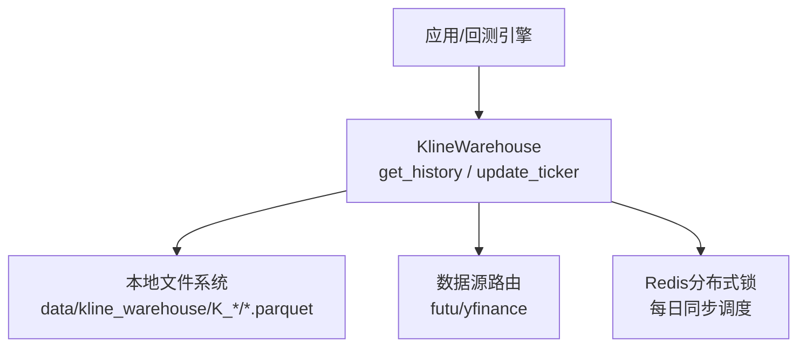
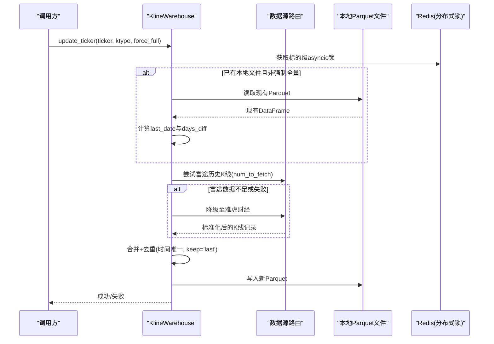
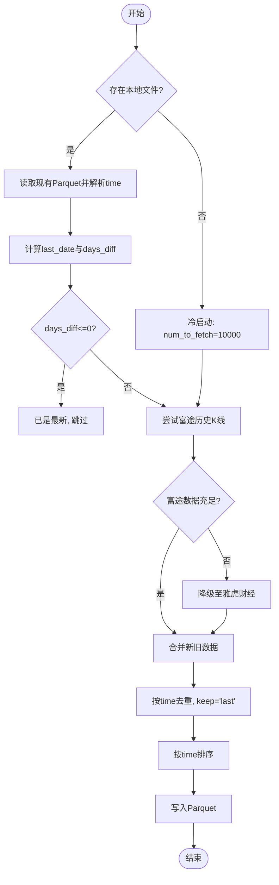
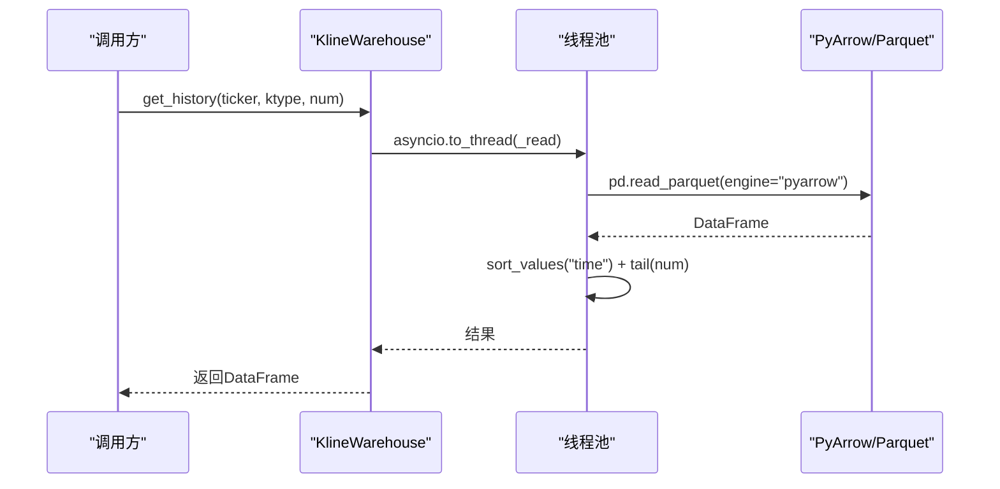
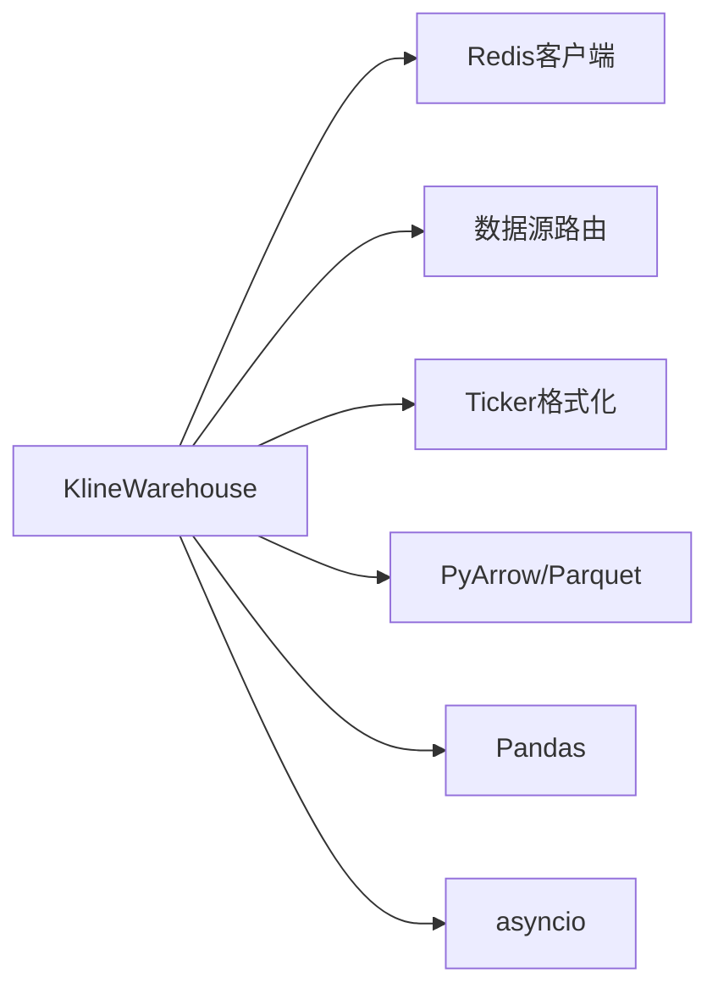
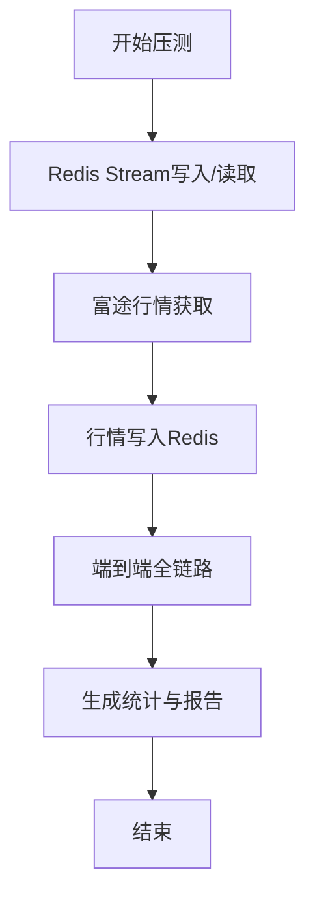

# Parquet存储引擎

<cite>
**本文引用的文件**
- [kline_warehouse.py](file://backend/services/datalake/kline_warehouse.py)
- [test_kline_warehouse.py](file://backend/tests/test_kline_warehouse.py)
- [benchmark_kline_pipeline.py](file://backend/scripts/benchmark_kline_pipeline.py)
</cite>

## 目录
1. [简介](#简介)
2. [项目结构](#项目结构)
3. [核心组件](#核心组件)
4. [架构总览](#架构总览)
5. [详细组件分析](#详细组件分析)
6. [依赖关系分析](#依赖关系分析)
7. [性能考量与基准](#性能考量与基准)
8. [故障排查指南](#故障排查指南)
9. [结论](#结论)
10. [附录](#附录)

## 简介
本技术文档面向Quant Agent的Parquet存储引擎，聚焦于K线数据的本地列式存储、增量更新机制、异步读取优化、数据完整性与错误恢复、容量规划与扩展策略。该引擎以Parquet为持久化格式，结合线程池隔离与GIL释放，提供纳秒级读取能力，服务于VectorBT回测等高性能场景。

## 项目结构
- 数据存储根目录：data/kline_warehouse（与代码库隔离）
- 按K线周期分目录组织：如 K_DAY、K_60M
- 每个标的一个Parquet文件：ticker规范化后生成文件名（将“.”和“/”替换为“_”）
- 核心实现位于后端服务层：backend/services/datalake/kline_warehouse.py
- 单元测试覆盖关键路径：backend/tests/test_kline_warehouse.py
- 压测工具用于端到端延迟评估：backend/scripts/benchmark_kline_pipeline.py

图表来源
- [kline_warehouse.py:16-258](file://backend/services/datalake/kline_warehouse.py#L16-L258)

章节来源
- [kline_warehouse.py:11-33](file://backend/services/datalake/kline_warehouse.py#L11-L33)

## 核心组件
- KlineWarehouse：封装本地Parquet数仓的读写、增量更新与守护任务
  - get_history：异步读取并返回最近N条K线
  - update_ticker：智能增量拉取、去重合并、复权覆盖保存
  - daemon_sync_task：定时全量资产增量同步，发布日快照与保留策略
- 数据源降级策略：优先富途高质量前复权，不足时自动降级至雅虎财经兜底
- 并发控制：基于asyncio.Lock进行标的级互斥；守护任务使用Redis分布式锁避免集群重复执行

章节来源
- [kline_warehouse.py:16-258](file://backend/services/datalake/kline_warehouse.py#L16-L258)

## 架构总览

图表来源
- [kline_warehouse.py:55-173](file://backend/services/datalake/kline_warehouse.py#L55-L173)

## 详细组件分析

### 本地存储策略与文件组织
- 存储根目录：data/kline_warehouse，与代码隔离，便于备份与迁移
- 目录划分：按K线周期（如K_DAY、K_60M）建立子目录，提升检索效率
- 文件命名：ticker规范化（将“.”和“/”替换为“_”），后缀.parquet
- 列式存储：采用PyArrow引擎读取，充分利用列存压缩与向量化扫描优势

章节来源
- [kline_warehouse.py:11-33](file://backend/services/datalake/kline_warehouse.py#L11-L33)

### 增量更新机制
- 智能时间差判断：
  - 首次冷启动：num_to_fetch=10000，确保覆盖超长历史
  - 已有数据：根据last_date与当前时间差days_diff，动态决定拉取数量，增加冗余天数以应对节假日与复权修正
- 数据源优先级与降级：
  - 首选富途高质量前复权数据
  - 若富途返回数据不足（例如>2000需求但返回<2000）或失败，自动降级至雅虎财经兜底
- 去重与复权处理：
  - 合并时使用time作为唯一键，keep='last'，确保最新复权数据覆盖旧值
  - 排序后落盘，保证时间有序性

图表来源
- [kline_warehouse.py:55-173](file://backend/services/datalake/kline_warehouse.py#L55-L173)

章节来源
- [kline_warehouse.py:55-173](file://backend/services/datalake/kline_warehouse.py#L55-L173)

### 异步读取优化
- 线程池隔离：通过asyncio.to_thread将阻塞的Parquet读取放入线程池，避免阻塞事件循环
- GIL释放：PyArrow在C层释放GIL，配合to_thread实现与事件循环解耦
- 并发访问控制：
  - 标的级锁：update_ticker使用asyncio.Lock防止同一标的并发写入冲突
  - 守护任务分布式锁：每日凌晨同步使用Redis分布式锁，避免集群多实例重复拉取打爆配额

图表来源
- [kline_warehouse.py:34-53](file://backend/services/datalake/kline_warehouse.py#L34-L53)

章节来源
- [kline_warehouse.py:34-53](file://backend/services/datalake/kline_warehouse.py#L34-L53)

### 守护进程与日快照
- 定时任务：每天凌晨3点执行，避开富途清算与其他任务高峰
- 分布式锁：Redis键quant:lock:kline_sync:{日期}，设置过期时间，防止多机重复执行
- 同步范围：从监控池中汇总tickers，并包含默认标的；按K_60M、K_DAY顺序循环同步，每次请求间错峰sleep防限流
- 日快照与保留：同步成功后发布日快照，并在周日或月初执行保留策略清理

章节来源
- [kline_warehouse.py:175-254](file://backend/services/datalake/kline_warehouse.py#L175-L254)

### 数据完整性验证与错误恢复
- 读取异常保护：get_history捕获异常并返回None，避免上层崩溃
- 写入异常保护：update_ticker保存阶段捕获异常并返回False，便于调用方重试或告警
- 测试覆盖：
  - 缺失文件返回None
  - 损坏Parquet文件返回None
  - 首次冷启动、已最新跳过、富途失败降级、force_full忽略已有数据等路径均被覆盖

章节来源
- [kline_warehouse.py:34-53](file://backend/services/datalake/kline_warehouse.py#L34-L53)
- [kline_warehouse.py:151-173](file://backend/services/datalake/kline_warehouse.py#L151-L173)
- [test_kline_warehouse.py:59-90](file://backend/tests/test_kline_warehouse.py#L59-L90)
- [test_kline_warehouse.py:92-145](file://backend/tests/test_kline_warehouse.py#L92-L145)
- [test_kline_warehouse.py:146-175](file://backend/tests/test_kline_warehouse.py#L146-L175)
- [test_kline_warehouse.py:176-228](file://backend/tests/test_kline_warehouse.py#L176-L228)
- [test_kline_warehouse.py:230-292](file://backend/tests/test_kline_warehouse.py#L230-L292)

## 依赖关系分析
- 内部依赖
  - Redis客户端：用于分布式锁与监控指标
  - 数据源路由：统一接入富途与雅虎财经，屏蔽差异
  - Ticker格式化：标准化不同市场符号
- 外部依赖
  - PyArrow/Parquet：高性能列式存储与读取
  - Pandas：数据处理与合并、去重、排序
  - asyncio：异步并发与线程池调度

图表来源
- [kline_warehouse.py:1-10](file://backend/services/datalake/kline_warehouse.py#L1-L10)
- [kline_warehouse.py:86-120](file://backend/services/datalake/kline_warehouse.py#L86-L120)

章节来源
- [kline_warehouse.py:1-10](file://backend/services/datalake/kline_warehouse.py#L1-L10)
- [kline_warehouse.py:86-120](file://backend/services/datalake/kline_warehouse.py#L86-L120)

## 性能考量与基准
- 读取性能
  - 列式存储：Parquet按列压缩与投影，显著减少IO与CPU开销
  - 线程池隔离：避免阻塞事件循环，提高并发吞吐
  - 建议：合理设置num参数，仅加载所需尾部数据，降低内存占用
- 写入性能
  - 增量合并：仅在必要时追加与去重，避免全量重建
  - 建议：批量写入与定期Compaction可进一步提升写入吞吐（当前实现为单文件追加）
- 端到端延迟基准
  - 压测工具覆盖Redis Stream、富途行情获取、写入Redis与端到端链路
  - 目标：P99延迟<50ms（适用于实时管道场景）
  - 使用方法：支持指定标的与迭代次数，输出各阶段统计与报告

图表来源
- [benchmark_kline_pipeline.py:47-96](file://backend/scripts/benchmark_kline_pipeline.py#L47-L96)
- [benchmark_kline_pipeline.py:98-220](file://backend/scripts/benchmark_kline_pipeline.py#L98-L220)
- [benchmark_kline_pipeline.py:222-308](file://backend/scripts/benchmark_kline_pipeline.py#L222-L308)

章节来源
- [benchmark_kline_pipeline.py:47-308](file://backend/scripts/benchmark_kline_pipeline.py#L47-L308)

## 故障排查指南
- 读取失败
  - 现象：get_history返回None
  - 可能原因：文件不存在、Parquet损坏、读取异常
  - 处理：检查文件路径与权限；重新触发增量更新；查看日志中的警告信息
- 写入失败
  - 现象：update_ticker返回False
  - 可能原因：所有数据源不可用、磁盘空间不足、序列化异常
  - 处理：检查数据源连通性与配额；确认磁盘可用空间；重试或手动修复文件
- 守护任务未执行
  - 现象：每日增量未触发
  - 可能原因：时间条件不满足、Redis锁竞争、异常中断
  - 处理：检查系统时间与时区；确认Redis锁键是否被占用；查看守护进程日志

章节来源
- [kline_warehouse.py:34-53](file://backend/services/datalake/kline_warehouse.py#L34-L53)
- [kline_warehouse.py:147-173](file://backend/services/datalake/kline_warehouse.py#L147-L173)
- [kline_warehouse.py:175-254](file://backend/services/datalake/kline_warehouse.py#L175-L254)

## 结论
该Parquet存储引擎通过列式存储、智能增量与降级策略、异步读取优化与完善的错误恢复机制，为回测与数据分析提供了高可靠、高性能的数据底座。建议在大规模场景下引入定期Compaction与分区归档，并结合监控指标持续优化吞吐与延迟。

## 附录
- 容量规划建议
  - 估算单标的日增行数与字段大小，结合Parquet压缩比评估磁盘增长
  - 按K线周期与标的维度规划目录结构与生命周期管理
- 扩展策略
  - 多标的并行同步：可在守护任务中增加并发度，注意数据源限流与锁粒度
  - 多副本与异地备份：对data/kline_warehouse目录实施定期快照与异地复制
  - 查询加速：对常用时间窗口建立索引或预聚合表（如分钟级OHLCV聚合）
