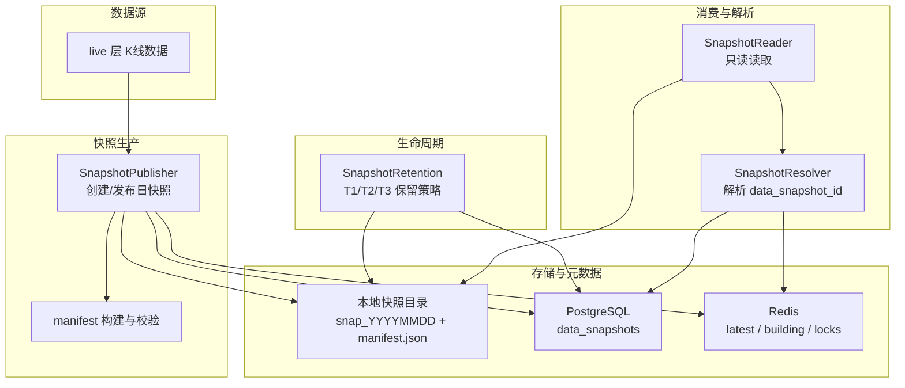
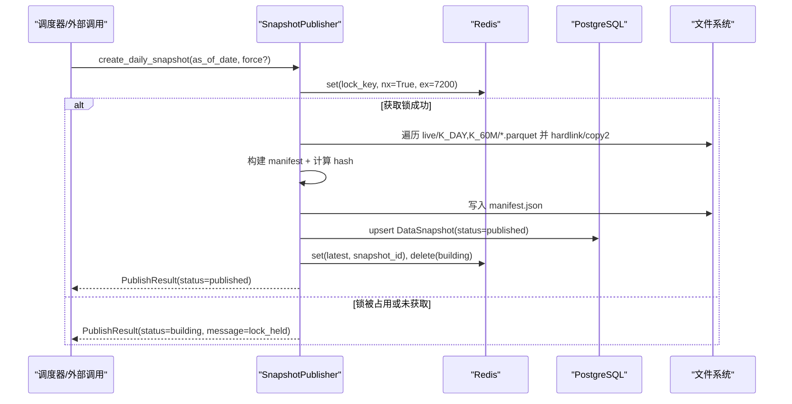
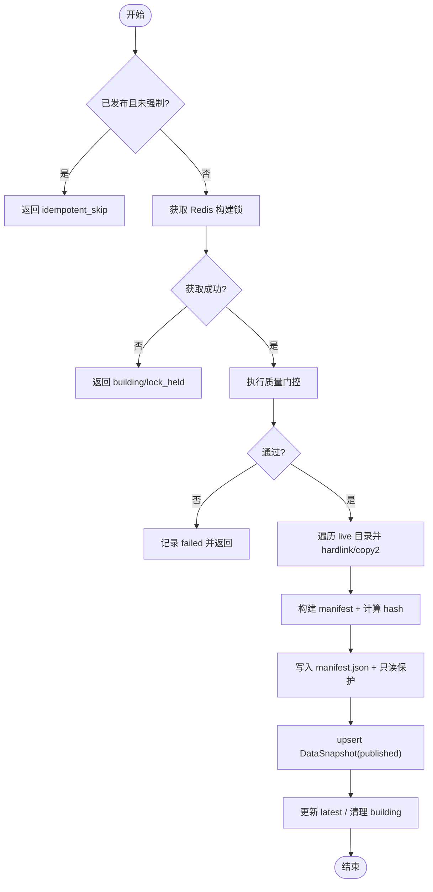
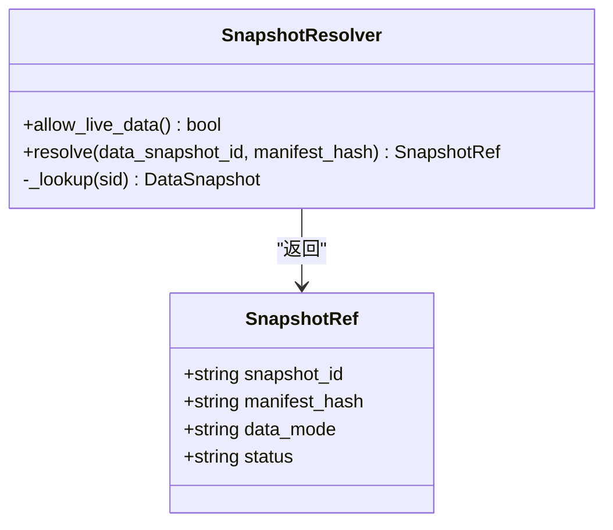
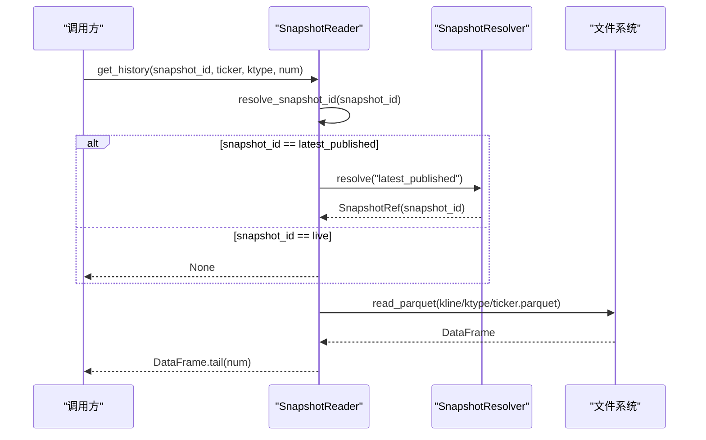
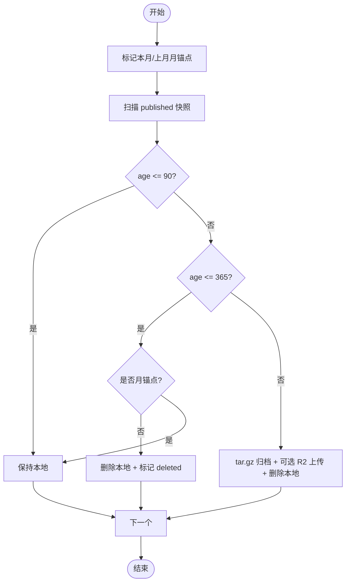
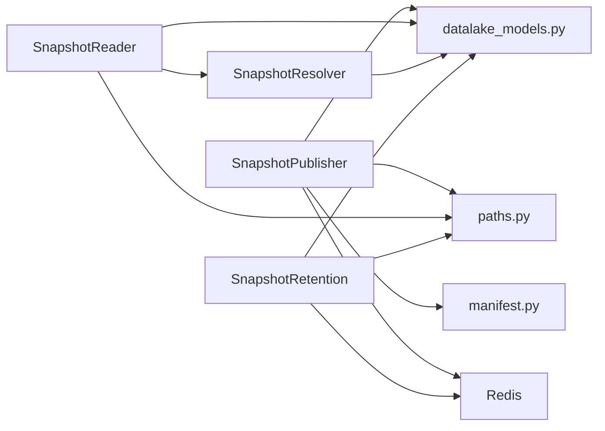

# 快照管理系统

<cite>
**本文引用的文件**
- [snapshot_publisher.py](file://backend/services/datalake/snapshot_publisher.py)
- [snapshot_reader.py](file://backend/services/datalake/snapshot_reader.py)
- [snapshot_resolver.py](file://backend/services/datalake/snapshot_resolver.py)
- [snapshot_retention.py](file://backend/services/datalake/snapshot_retention.py)
- [paths.py](file://backend/services/datalake/paths.py)
- [manifest.py](file://backend/services/datalake/manifest.py)
- [datalake_models.py](file://backend/core/datalake_models.py)
- [test_services_snapshot_publisher_coverage.py](file://backend/tests/test_services_snapshot_publisher_coverage.py)
- [backtest_app.py](file://backend/app/backtest_app.py)
- [report_service.py](file://backend/app/backtest/report_service.py)
</cite>

## 目录
1. [简介](#简介)
2. [项目结构](#项目结构)
3. [核心组件](#核心组件)
4. [架构总览](#架构总览)
5. [详细组件分析](#详细组件分析)
6. [依赖关系分析](#依赖关系分析)
7. [性能与优化](#性能与优化)
8. [故障排查指南](#故障排查指南)
9. [结论](#结论)
10. [附录](#附录)

## 简介
本技术文档围绕 Quant Agent 的快照管理系统，系统性阐述快照的生命周期管理（创建、发布、订阅、删除）、快照类型策略（日/周/月）、解析器机制（按时间、版本或标签精确查找）、读取器优化（缓存与批量读取）、备份与恢复（灾难恢复与数据迁移）、存储与生命周期策略，以及在回测与研究工作流中的应用。

## 项目结构
快照系统位于后端服务的数据湖子系统中，采用“生产者—消费者”解耦设计：
- 生产者：SnapshotPublisher 负责从 live 层生成并发布日快照，写入本地快照目录、清单 manifest、PostgreSQL 元数据表，并通过 Redis 维护最新指针与构建锁。
- 消费者：SnapshotReader 提供只读访问能力，支持解析 latest_published/live 等引用；SnapshotResolver 负责将 data_snapshot_id 解析为可绑定的 SnapshotRef（含数据模式与状态）。
- 生命周期：SnapshotRetention 执行保留策略（T1/T2/T3），标记月锚点、清理非锚点、归档到对象存储并更新元数据。
- 路径与清单：paths.py 定义 live/snapshots 根路径、K线类型、Redis Key；manifest.py 提供确定性清单构建与哈希校验。
- 模型：datalake_models.py 定义 DataSnapshot 与 BacktestReport ORM，用于持久化快照元数据与回测复现绑定。

**图表来源**
- [snapshot_publisher.py:91-250](file://backend/services/datalake/snapshot_publisher.py#L91-L250)
- [snapshot_resolver.py:31-103](file://backend/services/datalake/snapshot_resolver.py#L31-L103)
- [snapshot_reader.py:30-121](file://backend/services/datalake/snapshot_reader.py#L30-L121)
- [snapshot_retention.py:29-143](file://backend/services/datalake/snapshot_retention.py#L29-L143)
- [paths.py:1-43](file://backend/services/datalake/paths.py#L1-L43)
- [manifest.py:27-78](file://backend/services/datalake/manifest.py#L27-L78)
- [datalake_models.py:31-82](file://backend/core/datalake_models.py#L31-L82)

**章节来源**
- [paths.py:1-43](file://backend/services/datalake/paths.py#L1-L43)
- [datalake_models.py:31-82](file://backend/core/datalake_models.py#L31-L82)

## 核心组件
- SnapshotPublisher：从 live 层拷贝/硬链接 K线 Parquet 文件，生成 manifest 并落盘，写入 PostgreSQL 记录，更新 Redis 最新快照指针与构建锁，支持幂等发布、质量门控、侧车导出（如 universe）。
- SnapshotResolver：将 data_snapshot_id 解析为 SnapshotRef，支持 latest_published、live、指定 snap_id、以及无库时的 manifest_hash 绑定；限制 live 仅在开发环境允许。
- SnapshotReader：提供只读访问，解析 snapshot_id（含 latest_published → 具体 snap_id），读取 manifest 与历史 K线，列出 ticker 列表。
- SnapshotRetention：执行 T1(0–90d 全保留)、T2(91–365d 仅月锚点)、T3(>365d 归档 tar.gz 并删本地)，支持可选 R2 上传，打月锚点并更新 storage_tier。
- Manifest：确定性 JSON 序列化与哈希计算，保证数据指纹一致性与可验证性。
- 路径与常量：定义 live/snapshots 根目录、K线类型、Redis Key、脏数据率阈值等。

**章节来源**
- [snapshot_publisher.py:91-302](file://backend/services/datalake/snapshot_publisher.py#L91-L302)
- [snapshot_resolver.py:19-103](file://backend/services/datalake/snapshot_resolver.py#L19-L103)
- [snapshot_reader.py:30-121](file://backend/services/datalake/snapshot_reader.py#L30-L121)
- [snapshot_retention.py:29-143](file://backend/services/datalake/snapshot_retention.py#L29-L143)
- [manifest.py:16-78](file://backend/services/datalake/manifest.py#L16-L78)
- [paths.py:1-43](file://backend/services/datalake/paths.py#L1-L43)

## 架构总览
快照系统以“发布—解析—读取—保留”为主线，结合 Redis 与 PostgreSQL 实现高可用与一致性：
- 发布阶段：通过 Redis 分布式锁避免重复构建；质量门控失败则记录 failed 状态；成功则写 manifest、PG、Redis latest。
- 解析阶段：优先使用 Redis latest 指针，否则查 PG published 列表；支持 live 白名单控制。
- 读取阶段：基于解析后的 snapshot_id 直接读取本地 Parquet；支持同步/异步接口与尾部切片。
- 保留阶段：定时任务扫描 published 快照，按年龄执行删除/归档，并标记月锚点。

**图表来源**
- [snapshot_publisher.py:119-250](file://backend/services/datalake/snapshot_publisher.py#L119-L250)
- [paths.py:15-18](file://backend/services/datalake/paths.py#L15-L18)

**章节来源**
- [snapshot_publisher.py:119-250](file://backend/services/datalake/snapshot_publisher.py#L119-L250)

## 详细组件分析

### 快照发布器（SnapshotPublisher）
- 职责：从 live 层生成日快照，确保幂等、质量门控、侧车导出、只读保护、指标上报。
- 关键流程：
  - 检查已发布快照（幂等跳过）。
  - 使用 Redis 分布式锁防止并发构建。
  - 质量门控失败时记录 failed 并返回。
  - 遍历 K线类型目录，尝试 hardlink，失败回退 copy2，记录模式。
  - 构建 manifest 并计算哈希，写入 manifest.json。
  - 设置文件只读权限（尽力而为）。
  - 写入 PG DataSnapshot（published），更新 Redis latest，清理 building。
  - 上报指标并返回结果。
- 扩展点：quality_gate_fn、universe_exporter 可注入自定义逻辑。

**图表来源**
- [snapshot_publisher.py:119-250](file://backend/services/datalake/snapshot_publisher.py#L119-L250)

**章节来源**
- [snapshot_publisher.py:91-302](file://backend/services/datalake/snapshot_publisher.py#L91-L302)
- [test_services_snapshot_publisher_coverage.py:66-133](file://backend/tests/test_services_snapshot_publisher_coverage.py#L66-L133)

### 快照解析器（SnapshotResolver）
- 职责：将 data_snapshot_id 解析为 SnapshotRef，包含 snapshot_id、manifest_hash、data_mode、status。
- 行为：
  - live：仅在 ENGINE_ALLOW_LIVE_DATA=true 时允许，否则抛错。
  - latest_published：查询 PG 最近 published 行。
  - 指定 snap_id：查询 PG published 列表。
  - 无 DB 或无 published：若传入 manifest_hash，构造 unbound/snapshot 引用（测试/预绑定场景）。
- 安全：禁止在生产环境直接使用 live 数据作为回测指纹。

**图表来源**
- [snapshot_resolver.py:19-103](file://backend/services/datalake/snapshot_resolver.py#L19-L103)

**章节来源**
- [snapshot_resolver.py:19-103](file://backend/services/datalake/snapshot_resolver.py#L19-L103)

### 快照读取器（SnapshotReader）
- 职责：只读访问快照目录，解析 latest_published/live，读取 manifest 与历史 K线，列出 ticker。
- 优化：
  - resolve_snapshot_id 优先走 Redis latest 指针，减少数据库压力。
  - get_history 异步封装同步读取，避免阻塞事件循环。
  - 支持 tail(num) 切片，降低内存与传输开销。
  - list_tickers 快速枚举目录中的 parquet 文件。
- 兼容：文件名安全转换（ticker_to_filename/filename_to_ticker），兼容旧格式。

**图表来源**
- [snapshot_reader.py:42-121](file://backend/services/datalake/snapshot_reader.py#L42-L121)
- [snapshot_resolver.py:44-95](file://backend/services/datalake/snapshot_resolver.py#L44-L95)

**章节来源**
- [snapshot_reader.py:30-121](file://backend/services/datalake/snapshot_reader.py#L30-L121)

### 快照保留策略（SnapshotRetention）
- 策略：
  - T1(0–90d)：全保留。
  - T2(91–365d)：仅保留月锚点，删除非锚点本地副本。
  - T3(>365d)：归档为 tar.gz，可选上传至 R2，删除本地副本，更新 storage_tier。
- 月锚点：每月最后一个 published 日快照标记为 is_monthly_anchor。
- 分布式锁：run_retention_with_lock 使用 Redis 锁避免重复执行。

**图表来源**
- [snapshot_retention.py:41-143](file://backend/services/datalake/snapshot_retention.py#L41-L143)

**章节来源**
- [snapshot_retention.py:29-143](file://backend/services/datalake/snapshot_retention.py#L29-L143)

### 清单与数据指纹（Manifest）
- 确定性 JSON：sort_keys + 紧凑分隔符，日期转 ISO，保证跨平台一致。
- 哈希计算：compute_manifest_hash 排除 manifest_hash 字段本身，确保内容变更触发新指纹。
- 校验：validate_manifest 支持兼容 "sha256:" 前缀。

**章节来源**
- [manifest.py:16-78](file://backend/services/datalake/manifest.py#L16-L78)

### 数据模型（DataSnapshot / BacktestReport）
- DataSnapshot：不可变快照元数据，包含 snapshot_id、as_of_date、status、manifest_hash、manifest_json、ticker_count、total_bytes、is_monthly_anchor、storage_tier、r2_key、时间戳等。
- BacktestReport：回测报告持久化，绑定 data_snapshot_id 与 code_hash、params、random_seed 等，支持 reproducibility_key 与 metrics/equity_curve/trades/result_digest 等。

**章节来源**
- [datalake_models.py:31-82](file://backend/core/datalake_models.py#L31-L82)

## 依赖关系分析
- 模块耦合：
  - Publisher 依赖 paths、manifest、models、Redis、metrics。
  - Reader 依赖 Resolver、paths、models、Redis。
  - Resolver 依赖 models、环境变量。
  - Retention 依赖 models、paths、Redis、可选 R2 上传。
- 外部依赖：
  - PostgreSQL：持久化快照元数据与回测报告。
  - Redis：分布式锁、latest 指针、构建状态。
  - 文件系统：Parquet 数据与 manifest 文件。
- 潜在风险：
  - Redis 不可用：发布/读取降级为 PG 查询或失败提示。
  - 文件系统权限：只读保护尽力而为，部分 FS 忽略。
  - 大文件 I/O：建议配合异步与批处理优化。

**图表来源**
- [snapshot_publisher.py:91-250](file://backend/services/datalake/snapshot_publisher.py#L91-L250)
- [snapshot_reader.py:30-121](file://backend/services/datalake/snapshot_reader.py#L30-L121)
- [snapshot_resolver.py:31-103](file://backend/services/datalake/snapshot_resolver.py#L31-L103)
- [snapshot_retention.py:29-143](file://backend/services/datalake/snapshot_retention.py#L29-L143)
- [paths.py:1-43](file://backend/services/datalake/paths.py#L1-L43)
- [datalake_models.py:31-82](file://backend/core/datalake_models.py#L31-L82)

**章节来源**
- [paths.py:1-43](file://backend/services/datalake/paths.py#L1-L43)
- [datalake_models.py:31-82](file://backend/core/datalake_models.py#L31-L82)

## 性能与优化
- 发布阶段：
  - 优先 hardlink，失败回退 copy2，减少磁盘占用与 I/O。
  - 质量门控前置，失败快速返回，避免无效 I/O。
  - 只读保护提升后续读取稳定性。
- 读取阶段：
  - Redis latest 指针优先，减少 PG 查询。
  - 异步 to_thread 包装同步读取，避免阻塞。
  - tail(num) 切片降低内存与网络传输。
- 保留阶段：
  - 月锚点策略平衡回溯需求与存储成本。
  - 归档 tar.gz 压缩，可选 R2 上传，释放本地空间。
- 建议优化：
  - 批量读取：对多 ticker 请求合并 IO，减少打开/关闭开销。
  - 缓存策略：热点 ticker 在内存中缓存 DataFrame，设置 TTL 与 LRU。
  - 索引优化：PG 上针对 status、as_of_date、published_at 建立复合索引（已有索引）。
  - 监控与告警：对 Redis 不可用、PG 连接异常、I/O 错误进行度量与告警。

[本节为通用指导，不直接分析具体文件]

## 故障排查指南
- 发布失败：
  - 质量门控失败：检查 dirty_rate_observed 与阈值，定位数据源问题。
  - Redis 锁冲突：确认是否存在长时间运行的构建任务，必要时清理锁键。
  - 文件权限：检查目标目录写权限与只读保护是否生效。
- 读取失败：
  - latest_published 为空：检查是否有 published 快照，或手动指定 snap_id。
  - 文件缺失：核对 ticker 文件名映射与安全字符替换。
  - live 数据误用：确认 ENGINE_ALLOW_LIVE_DATA 配置，避免生产环境使用 live。
- 保留异常：
  - 重复执行：检查 Redis 锁是否过期或被抢占。
  - 归档失败：确认 R2 上传配置与权限，查看日志中的 r2_upload_failed。
  - 月锚点未标记：检查月份边界与 published 快照存在性。

**章节来源**
- [snapshot_publisher.py:119-250](file://backend/services/datalake/snapshot_publisher.py#L119-L250)
- [snapshot_reader.py:42-121](file://backend/services/datalake/snapshot_reader.py#L42-L121)
- [snapshot_retention.py:61-143](file://backend/services/datalake/snapshot_retention.py#L61-L143)

## 结论
Quant Agent 的快照管理系统通过清晰的发布—解析—读取—保留流水线，结合 Redis 与 PostgreSQL 实现了高可用、可追溯、可扩展的数据快照能力。日快照为主力，周/月策略通过保留阶段的月锚点机制体现；解析器支持多种引用方式，读取器提供高效只读访问；保留策略兼顾存储成本与回溯需求。系统在回测与研究场景中提供了稳定、可复现的数据基础。

[本节为总结，不直接分析具体文件]

## 附录

### 快照类型与策略说明
- 日快照：由 SnapshotPublisher 每日生成，作为主要回溯单元。
- 周快照：可通过保留策略的月锚点近似覆盖周级别回溯需求（月末锚点）。
- 月快照：保留阶段明确标记月锚点，便于月度级回溯与归档。
- 策略依据：T1/T2/T3 分层保留，月锚点在 T2/T3 中保留，其余按策略删除或归档。

**章节来源**
- [snapshot_retention.py:41-143](file://backend/services/datalake/snapshot_retention.py#L41-L143)

### 回测与研究工作流应用
- 回测：
  - backtest_app 通过 SnapshotReader 解析 data_snapshot_id，支持 latest_published 与指定 snap_id。
  - report_service 将回测报告与 data_snapshot_id 绑定，确保可复现性。
- 研究：
  - 使用 SnapshotReader.list_tickers 快速枚举可用标的。
  - 通过 get_history 获取历史 K线进行分析与可视化。

**章节来源**
- [backtest_app.py:65-95](file://backend/app/backtest_app.py#L65-L95)
- [report_service.py:55-110](file://backend/app/backtest/report_service.py#L55-L110)
