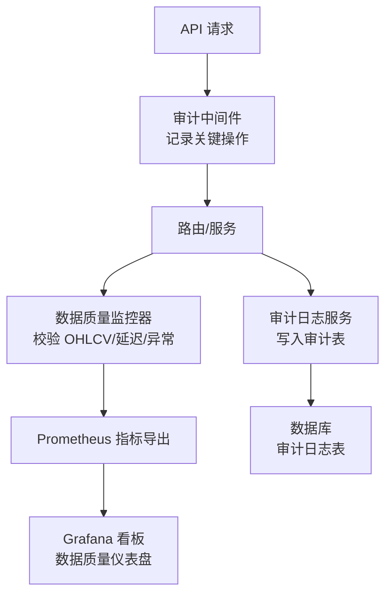
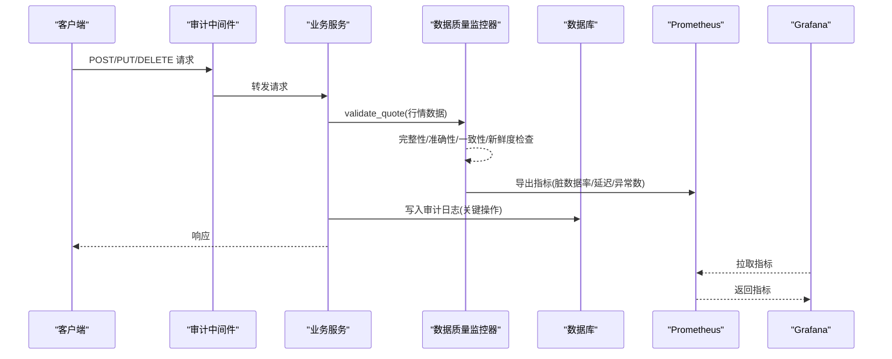
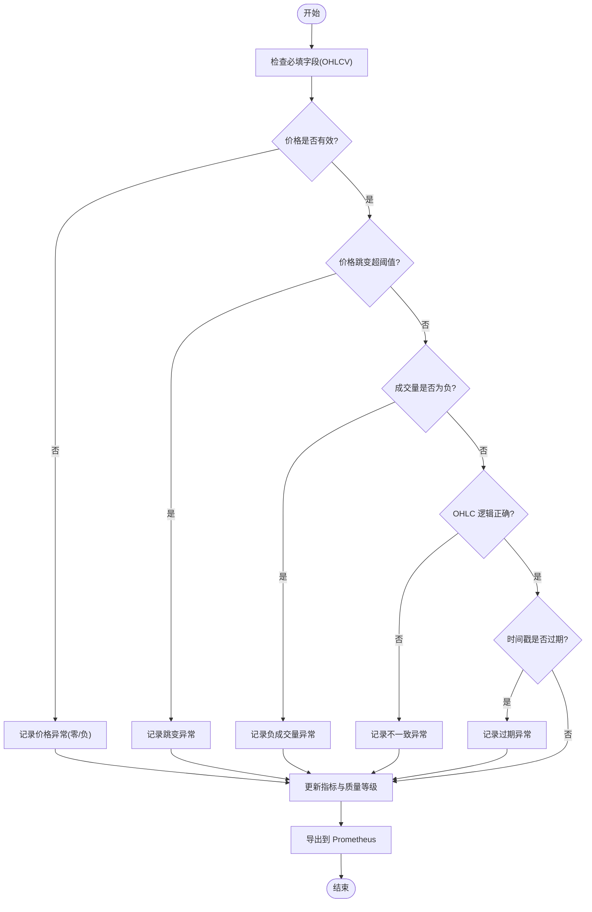
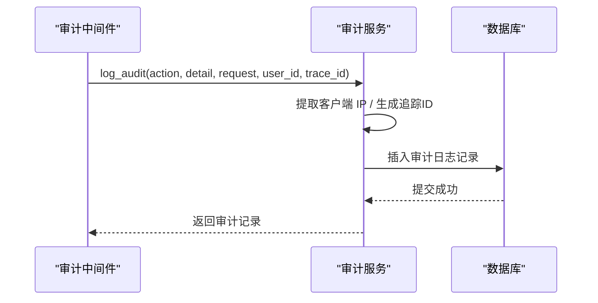
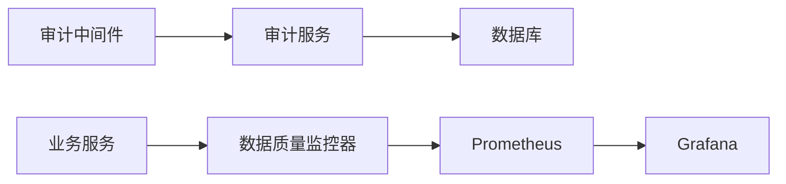

# 数据治理规范

<cite>
**本文引用的文件**
- [monitor.py](file://backend/services/data_quality/monitor.py)
- [audit_service.py](file://backend/services/audit_service.py)
- [audit_middleware.py](file://backend/middleware/audit_middleware.py)
- [models.py](file://backend/core/models.py)
- [data_quality_dashboard.json](file://grafana/provisioning/dashboards/data-quality-dashboard.json)
</cite>

## 目录
1. [简介](#简介)
2. [项目结构](#项目结构)
3. [核心组件](#核心组件)
4. [架构总览](#架构总览)
5. [详细组件分析](#详细组件分析)
6. [依赖关系分析](#依赖关系分析)
7. [性能考量](#性能考量)
8. [故障排查指南](#故障排查指南)
9. [结论](#结论)
10. [附录](#附录)

## 简介
本规范面向 Quant Agent 的数据治理体系，聚焦以下目标：
- 建立数据质量监控框架：完整性检查、准确性验证、一致性保证与延迟监控。
- 实现数据血缘追踪与审计日志：支持变更历史追溯与可观测性。
- 明确数据权限控制机制：访问级别管理与用户权限校验。
- 定义数据清洗与标准化流程：确保一致性与可用性。
- 制定数据保留策略与归档机制：支撑长期数据管理。
- 提供最佳实践与合规要求：覆盖安全、隐私与可审计性。
- 展示在业务场景中的应用案例：如行情采集、回测与报表生成。

## 项目结构
围绕数据治理的关键代码集中在后端服务层与中间件层：
- 数据质量监控：services/data_quality/monitor.py
- 审计日志服务：services/audit_service.py
- 审计中间件：middleware/audit_middleware.py
- 数据模型（含审计日志表）：core/models.py
- 可视化看板：grafana/provisioning/dashboards/data-quality-dashboard.json

图表来源
- [audit_middleware.py:1-77](file://backend/middleware/audit_middleware.py#L1-L77)
- [monitor.py:1-408](file://backend/services/data_quality/monitor.py#L1-L408)
- [audit_service.py:1-112](file://backend/services/audit_service.py#L1-L112)
- [models.py:1-200](file://backend/core/models.py#L1-L200)
- [data_quality_dashboard.json](file://grafana/provisioning/dashboards/data-quality-dashboard.json)

章节来源
- [audit_middleware.py:1-77](file://backend/middleware/audit_middleware.py#L1-L77)
- [monitor.py:1-408](file://backend/services/data_quality/monitor.py#L1-L408)
- [audit_service.py:1-112](file://backend/services/audit_service.py#L1-L112)
- [models.py:1-200](file://backend/core/models.py#L1-L200)
- [data_quality_dashboard.json](file://grafana/provisioning/dashboards/data-quality-dashboard.json)

## 核心组件
- 数据质量监控器：按数据源维度统计脏数据率、完整率、延迟、异常计数，并输出到 Prometheus；支持告警回调。
- 审计日志服务：统一封装审计日志写入与查询，提取客户端 IP、生成追踪 ID。
- 审计中间件：对关键写操作进行自动审计，仅记录成功响应。
- 数据模型：包含审计日志等持久化实体，供审计与后续分析使用。
- Grafana 看板：基于 Prometheus 指标构建数据质量可视化面板。

章节来源
- [monitor.py:1-408](file://backend/services/data_quality/monitor.py#L1-L408)
- [audit_service.py:1-112](file://backend/services/audit_service.py#L1-L112)
- [audit_middleware.py:1-77](file://backend/middleware/audit_middleware.py#L1-L77)
- [models.py:1-200](file://backend/core/models.py#L1-L200)
- [data_quality_dashboard.json](file://grafana/provisioning/dashboards/data-quality-dashboard.json)

## 架构总览
数据治理由“采集—校验—存储—可视”闭环构成：
- 采集：外部数据源（如行情、宏观）进入系统。
- 校验：数据质量监控器执行完整性、准确性、一致性、新鲜度检查。
- 存储：审计日志写入数据库；质量指标通过 Prometheus 暴露。
- 可视：Grafana 看板聚合指标，辅助运维与合规审计。

图表来源
- [audit_middleware.py:1-77](file://backend/middleware/audit_middleware.py#L1-L77)
- [monitor.py:1-408](file://backend/services/data_quality/monitor.py#L1-L408)
- [audit_service.py:1-112](file://backend/services/audit_service.py#L1-L112)
- [models.py:1-200](file://backend/core/models.py#L1-L200)
- [data_quality_dashboard.json](file://grafana/provisioning/dashboards/data-quality-dashboard.json)

## 详细组件分析

### 数据质量监控器（DataQualityMonitor）
- 功能要点
  - 完整性检查：必填字段缺失检测（OHLCV）。
  - 准确性验证：零价/负价/负成交量检测。
  - 一致性保证：OHLC 逻辑校验（high < low）、价格跳变阈值检测。
  - 新鲜度检测：时间戳延迟计算与过期判定。
  - 指标导出：脏数据率、完整率、异常计数、延迟均值/最大值、质量等级映射至 Prometheus。
  - 告警机制：脏数据率与连续过期阈值触发告警回调。
- 数据结构与复杂度
  - 单条记录校验为 O(1)，指标更新为 O(1)。
  - 维护最近价格用于跳变检测，空间复杂度与 ticker 数量线性相关。
- 错误处理
  - 解析时间戳失败时忽略该条记录的延迟计算。
  - Prometheus 导出失败不影响主流程，仅记录调试日志。
- 优化建议
  - 批量校验时可合并重复键值以减少内存占用。
  - 针对高频 tickers 的跳变检测可引入滑动窗口或指数平滑以降低误报。

图表来源
- [monitor.py:1-408](file://backend/services/data_quality/monitor.py#L1-L408)

章节来源
- [monitor.py:1-408](file://backend/services/data_quality/monitor.py#L1-L408)

### 审计日志服务（Audit Service）
- 功能要点
  - 获取客户端 IP：优先从代理头提取，回退到直连 IP。
  - 生成追踪 ID：用于跨链路关联。
  - 写入审计日志：记录动作类型、详情、IP、追踪 ID、用户 ID 与时间戳。
  - 查询审计日志：支持按动作类型与用户 ID 过滤，分页排序。
- 数据流
  - 中间件或服务层调用 log_audit，创建 AuditLog 对象并提交事务。
  - 查询接口按条件筛选并按创建时间倒序返回。
- 错误处理
  - 中间件捕获异常但不影响主流程，仅打印日志。
- 扩展点
  - 可扩展更多动作类型与详情字段以适配新业务。

图表来源
- [audit_middleware.py:1-77](file://backend/middleware/audit_middleware.py#L1-L77)
- [audit_service.py:1-112](file://backend/services/audit_service.py#L1-L112)
- [models.py:1-200](file://backend/core/models.py#L1-L200)

章节来源
- [audit_service.py:1-112](file://backend/services/audit_service.py#L1-L112)
- [audit_middleware.py:1-77](file://backend/middleware/audit_middleware.py#L1-L77)
- [models.py:1-200](file://backend/core/models.py#L1-L200)

### 审计中间件（Audit Middleware）
- 功能要点
  - 仅对 POST/PUT/DELETE 请求进行审计。
  - 白名单路径映射到具体动作类型（登录、登出、注册、订单模拟/执行、策略创建/修改、设置变更）。
  - 仅记录成功响应（2xx），避免噪声。
- 设计权衡
  - 读取操作不审计以降低开销。
  - 审计失败不影响主流程，保障可用性。
- 可配置性
  - AUDITABLE_OPERATIONS 字典便于扩展新的审计点。

章节来源
- [audit_middleware.py:1-77](file://backend/middleware/audit_middleware.py#L1-L77)

### 数据模型（Models）
- 审计日志表：用于持久化审计记录，支持按时间与用户维度检索。
- 其他模型：用户、交易日志、偏好、情绪记录、IV 快照、会话、选股订阅、保存的筛选条件等，支撑业务与治理需求。
- 向量类型兼容：SQLite 降级为二进制存储，PostgreSQL 使用 pgvector。

章节来源
- [models.py:1-200](file://backend/core/models.py#L1-L200)

### 数据质量看板（Grafana Dashboard）
- 数据来源：Prometheus 指标（脏数据率、完整率、异常计数、延迟、质量等级等）。
- 用途：实时监控各数据源质量状况，快速定位问题与趋势分析。
- 配置：通过 provision 文件加载，便于版本化管理与部署。

章节来源
- [data_quality_dashboard.json](file://grafana/provisioning/dashboards/data-quality-dashboard.json)

## 依赖关系分析
- 组件耦合
  - 审计中间件依赖审计服务与数据库会话。
  - 数据质量监控器依赖日志与 Prometheus 指标模块。
  - 看板依赖 Prometheus 指标。
- 外部依赖
  - FastAPI Request/Response。
  - SQLAlchemy ORM。
  - Prometheus 客户端。
  - Grafana 与 Prometheus。
- 潜在循环依赖
  - 当前结构清晰，未见循环导入迹象。

图表来源
- [audit_middleware.py:1-77](file://backend/middleware/audit_middleware.py#L1-L77)
- [audit_service.py:1-112](file://backend/services/audit_service.py#L1-L112)
- [monitor.py:1-408](file://backend/services/data_quality/monitor.py#L1-L408)
- [data_quality_dashboard.json](file://grafana/provisioning/dashboards/data-quality-dashboard.json)

章节来源
- [audit_middleware.py:1-77](file://backend/middleware/audit_middleware.py#L1-L77)
- [audit_service.py:1-112](file://backend/services/audit_service.py#L1-L112)
- [monitor.py:1-408](file://backend/services/data_quality/monitor.py#L1-L408)
- [data_quality_dashboard.json](file://grafana/provisioning/dashboards/data-quality-dashboard.json)

## 性能考量
- 低开销校验：单条记录校验为常数时间，适合高吞吐场景。
- 指标导出：Prometheus 导出采用标签维度隔离，避免全局计数器冲突。
- 中间件节流：仅审计写操作且仅记录成功响应，降低 I/O 压力。
- 建议
  - 在高并发下对指标导出进行批量化或异步化。
  - 对热门 ticker 的跳变检测引入更稳健的阈值策略。
  - 审计日志写入可考虑异步队列以提升吞吐。

## 故障排查指南
- 数据质量异常
  - 脏数据率突增：检查必填字段缺失、价格异常、OHLC 不一致。
  - 延迟升高：核对时间戳来源与服务器时钟同步。
  - 告警未触发：确认告警回调已配置且阈值合理。
- 审计日志缺失
  - 非写操作不会被审计。
  - 仅记录成功响应，失败请求不会入库。
  - 中间件异常不影响主流程，需查看日志定位。
- 看板无数据
  - 确认 Prometheus 指标已导出且被 Grafana 抓取。
  - 检查看板配置与数据源连接状态。

章节来源
- [monitor.py:1-408](file://backend/services/data_quality/monitor.py#L1-L408)
- [audit_middleware.py:1-77](file://backend/middleware/audit_middleware.py#L1-L77)
- [audit_service.py:1-112](file://backend/services/audit_service.py#L1-L112)
- [data_quality_dashboard.json](file://grafana/provisioning/dashboards/data-quality-dashboard.json)

## 结论
Quant Agent 的数据治理体系通过数据质量监控与审计日志两大支柱，实现了从采集到可视化的闭环管理。质量监控确保数据的完整性、准确性、一致性与新鲜度；审计日志提供可追溯性与合规支撑；Grafana 看板将指标可视化，便于运维与决策。建议在后续迭代中增强异步化、批量化与更精细的阈值策略，以进一步提升系统稳定性与可观测性。

## 附录

### 数据权限控制机制（建议）
- 访问级别管理
  - 基于角色的访问控制（RBAC）：管理员、分析师、只读用户。
  - 资源级权限：按数据集、主题、时间范围限制访问。
- 用户权限验证
  - 在路由层集成鉴权中间件，校验令牌与角色。
  - 敏感操作（如策略修改、订单执行）强制二次确认与审计。
- 数据脱敏与最小权限原则
  - 对外接口默认脱敏敏感字段。
  - 按需授予最小必要权限。

[本节为概念性内容，不直接分析具体文件]

### 数据清洗与标准化流程（建议）
- 清洗规则
  - 去重：按 ticker+timestamp 去重。
  - 填充：缺失字段按前值填充或标记为无效。
  - 归一化：单位统一（价格小数位、成交量单位）。
- 标准化
  - 字段命名与类型统一。
  - 时间戳统一为 UTC 毫秒。
- 质量控制
  - 在入库前执行质量门禁，不合格数据进入死信队列。
  - 定期回溯与修复。

[本节为概念性内容，不直接分析具体文件]

### 数据保留策略与归档机制（建议）
- 保留周期
  - 热数据：短期高频数据保留 30-90 天。
  - 温数据：中期数据保留 6-12 个月。
  - 冷数据：长期归档至对象存储，压缩与索引。
- 归档策略
  - 按日期分区与压缩。
  - 元数据登记以便检索。
- 合规与安全
  - 加密存储与传输。
  - 访问审计与权限控制。

[本节为概念性内容，不直接分析具体文件]

### 合规性要求（建议）
- 数据安全
  - 密码哈希、令牌轮换、传输加密。
- 隐私保护
  - 个人数据最小化与匿名化。
- 审计与可追溯
  - 全量审计日志与不可篡改存储。
- 标准遵循
  - 参考金融数据治理与信息安全标准。

[本节为概念性内容，不直接分析具体文件]

### 业务应用案例
- 行情采集
  - 实时校验 OHLCV 与延迟，异常数据即时告警。
- 回测与报表
  - 使用高质量数据进行因子计算与绩效评估，确保结果可信。
- 风险预警
  - 基于数据质量指标触发风控策略，避免错误信号。

[本节为概念性内容，不直接分析具体文件]
