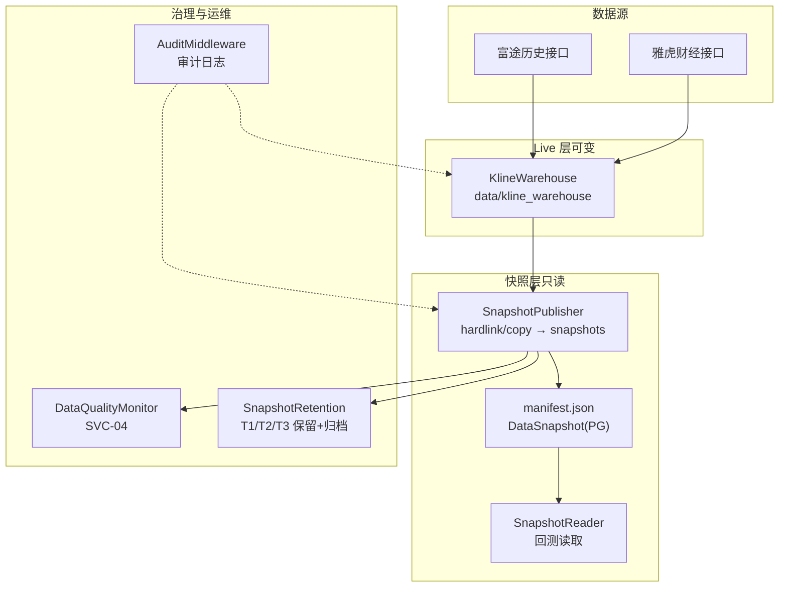
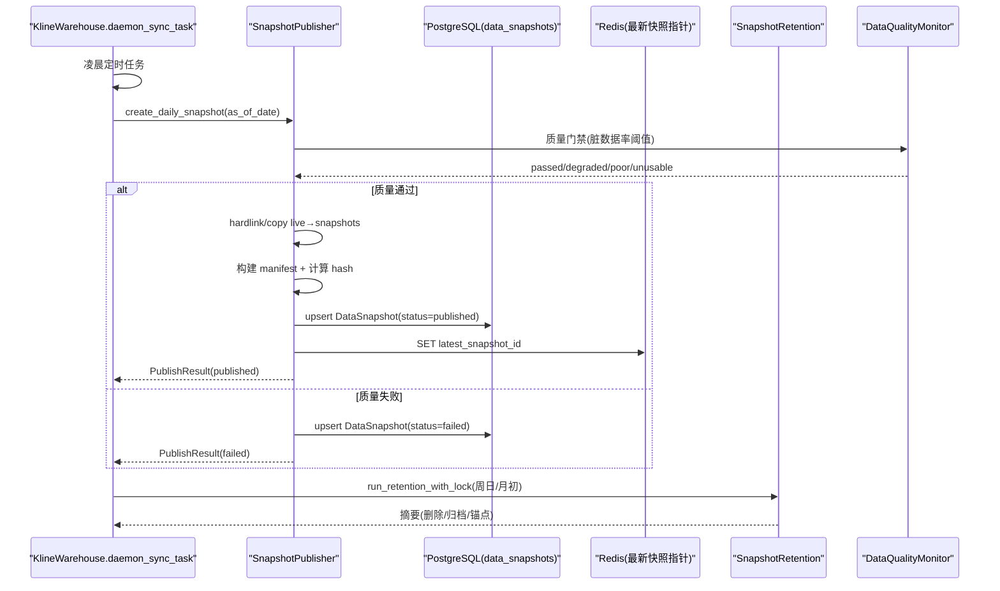
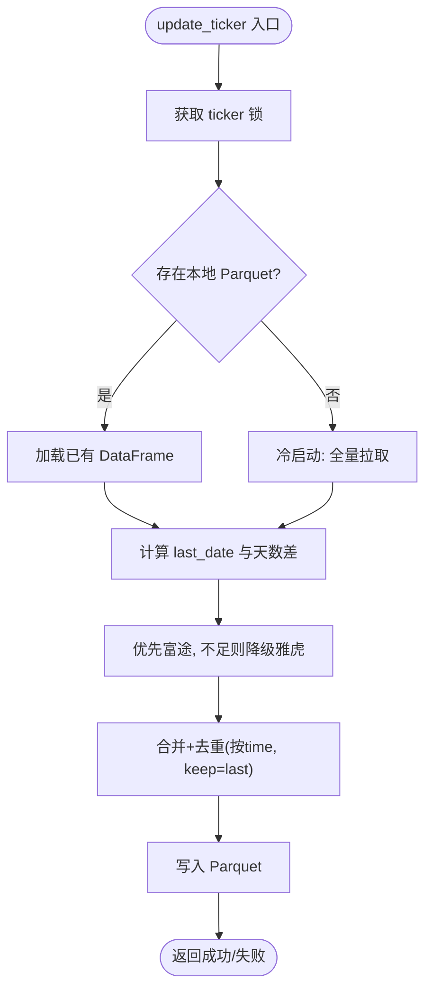
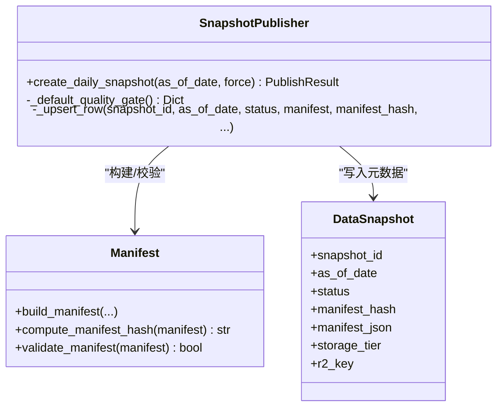
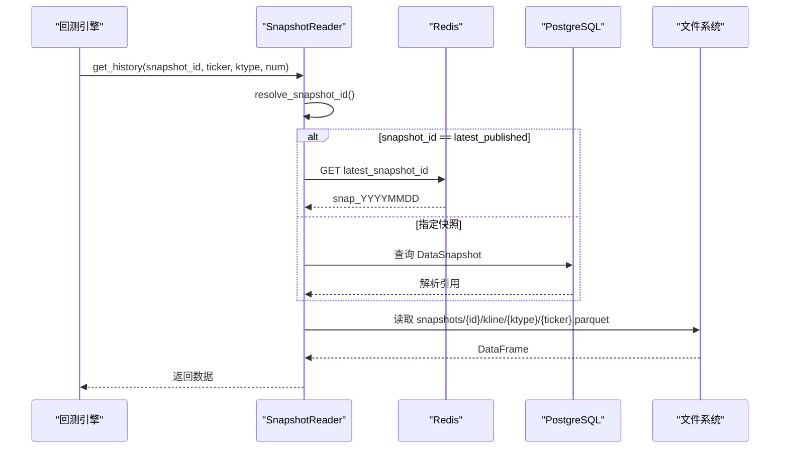
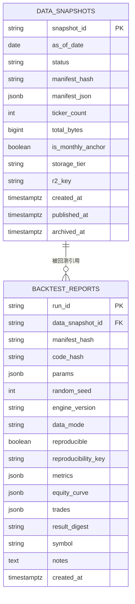
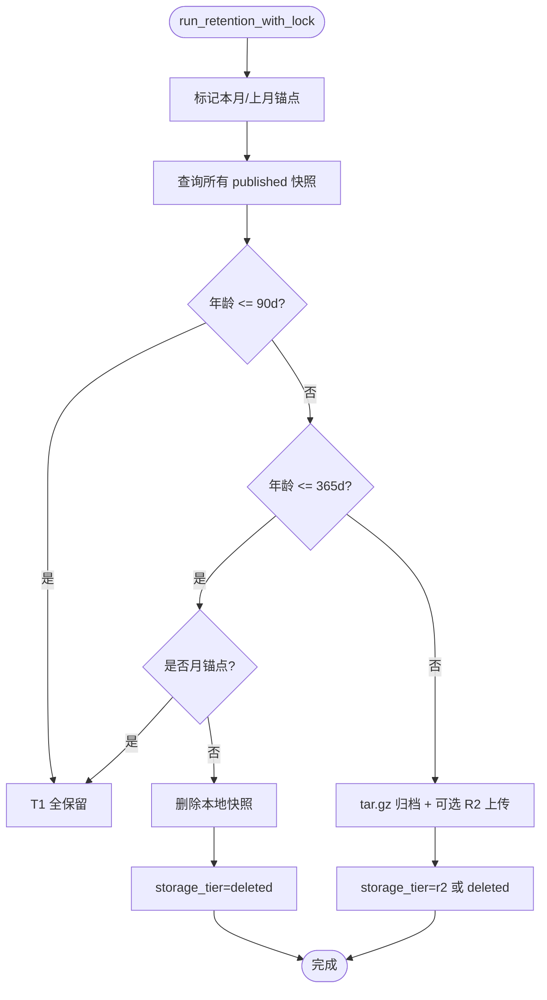
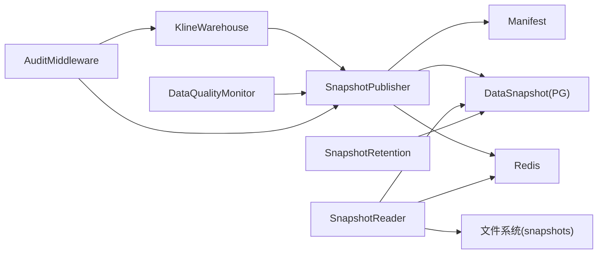

# 数据湖管理

<cite>
**本文引用的文件**
- [kline_warehouse.py](file://backend/services/datalake/kline_warehouse.py)
- [snapshot_publisher.py](file://backend/services/datalake/snapshot_publisher.py)
- [snapshot_reader.py](file://backend/services/datalake/snapshot_reader.py)
- [manifest.py](file://backend/services/datalake/manifest.py)
- [snapshot_retention.py](file://backend/services/datalake/snapshot_retention.py)
- [datalake_models.py](file://backend/core/datalake_models.py)
- [monitor.py](file://backend/services/data_quality/monitor.py)
- [audit_middleware.py](file://backend/middleware/audit_middleware.py)
- [19. Parquet数据湖快照版本化设计.md](file://docs/19. Parquet数据湖快照版本化设计.md)
</cite>

## 目录
1. [简介](#简介)
2. [项目结构](#项目结构)
3. [核心组件](#核心组件)
4. [架构总览](#架构总览)
5. [详细组件分析](#详细组件分析)
6. [依赖关系分析](#依赖关系分析)
7. [性能与扩展性](#性能与扩展性)
8. [故障排查指南](#故障排查指南)
9. [结论](#结论)
10. [附录：查询与优化示例](#附录：查询与优化示例)

## 简介
本技术文档面向 Quant Agent 的数据湖管理系统，聚焦基于 Parquet 的 K 线仓库、元数据管理与版本控制。系统通过“Live 层增量更新 + 日级不可变快照”的双层设计，实现回测可复现、数据治理可观测、保留策略可配置、归档可恢复。同时提供质量门禁、完整性校验、一致性保证、权限与审计日志等配套能力，并给出高效查询与优化建议，以及扩展新数据类型与存储格式的路径。

## 项目结构
数据湖相关代码集中在 backend/services/datalake 与 backend/core/datalake_models，配合数据质量监控与审计中间件形成完整闭环。K 线 Live 层以 Parquet 列式存储于 data/kline_warehouse；日级快照落盘至 data/snapshots，并通过 manifest.json 与 PostgreSQL 表 data_snapshots 进行元数据管理。

图表来源
- [kline_warehouse.py:16-258](file://backend/services/datalake/kline_warehouse.py#L16-L258)
- [snapshot_publisher.py:91-250](file://backend/services/datalake/snapshot_publisher.py#L91-L250)
- [snapshot_reader.py:30-121](file://backend/services/datalake/snapshot_reader.py#L30-L121)
- [manifest.py:16-78](file://backend/services/datalake/manifest.py#L16-L78)
- [snapshot_retention.py:29-143](file://backend/services/datalake/snapshot_retention.py#L29-L143)
- [datalake_models.py:31-82](file://backend/core/datalake_models.py#L31-L82)
- [monitor.py:91-408](file://backend/services/data_quality/monitor.py#L91-L408)
- [audit_middleware.py:30-77](file://backend/middleware/audit_middleware.py#L30-L77)

章节来源
- [kline_warehouse.py:16-258](file://backend/services/datalake/kline_warehouse.py#L16-L258)
- [snapshot_publisher.py:91-250](file://backend/services/datalake/snapshot_publisher.py#L91-L250)
- [snapshot_reader.py:30-121](file://backend/services/datalake/snapshot_reader.py#L30-L121)
- [manifest.py:16-78](file://backend/services/datalake/manifest.py#L16-L78)
- [snapshot_retention.py:29-143](file://backend/services/datalake/snapshot_retention.py#L29-L143)
- [datalake_models.py:31-82](file://backend/core/datalake_models.py#L31-L82)
- [monitor.py:91-408](file://backend/services/data_quality/monitor.py#L91-L408)
- [audit_middleware.py:30-77](file://backend/middleware/audit_middleware.py#L30-L77)
- [19. Parquet数据湖快照版本化设计.md:55-82](file://docs/19. Parquet数据湖快照版本化设计.md#L55-L82)

## 核心组件
- K 线仓库（Live 层）：负责增量拉取、合并与持久化为 Parquet，支持多周期（如 K_DAY、K_60M），并提供守护进程定时同步。
- 快照发布器：在每日同步完成后生成不可变快照包，包含 manifest.json、sidecars（如 universe）、PG 写入与 Redis 指针更新。
- 快照解析与读取：为回测提供稳定数据源，支持 latest_published 解析与本地快照只读访问。
- Manifest 与模型：定义 manifest 构建、哈希计算与校验；PostgreSQL 模型记录快照元数据与回测报告绑定。
- 保留与归档：按 T1/T2/T3 策略清理本地快照、标记月锚点、归档到对象存储（R2）。
- 数据质量监控：对 OHLCV 字段、价格异常、时间戳新鲜度等进行实时检查，输出指标与告警。
- 审计中间件：对关键写操作进行审计日志记录，保障可追溯性。

章节来源
- [kline_warehouse.py:16-258](file://backend/services/datalake/kline_warehouse.py#L16-L258)
- [snapshot_publisher.py:91-250](file://backend/services/datalake/snapshot_publisher.py#L91-L250)
- [snapshot_reader.py:30-121](file://backend/services/datalake/snapshot_reader.py#L30-L121)
- [manifest.py:16-78](file://backend/services/datalake/manifest.py#L16-L78)
- [snapshot_retention.py:29-143](file://backend/services/datalake/snapshot_retention.py#L29-L143)
- [datalake_models.py:31-82](file://backend/core/datalake_models.py#L31-L82)
- [monitor.py:91-408](file://backend/services/data_quality/monitor.py#L91-L408)
- [audit_middleware.py:30-77](file://backend/middleware/audit_middleware.py#L30-L77)

## 架构总览
数据湖采用“Live 层 + Snapshot 层”双轨架构：
- Live 层：持续增量更新，支撑实时与近实时需求。
- Snapshot 层：每日生成不可变快照，供回测与审计使用，确保结果可复现。
- 元数据：manifest.json 与 PG 表 data_snapshots 共同构成 SSOT，提供文件清单、校验和、质量门禁结果与状态。
- 治理：数据质量监控在发布前执行质量门禁；保留策略定期清理与归档；审计日志记录关键操作。

图表来源
- [kline_warehouse.py:175-258](file://backend/services/datalake/kline_warehouse.py#L175-L258)
- [snapshot_publisher.py:119-250](file://backend/services/datalake/snapshot_publisher.py#L119-L250)
- [snapshot_retention.py:61-143](file://backend/services/datalake/snapshot_retention.py#L61-L143)
- [monitor.py:112-256](file://backend/services/data_quality/monitor.py#L112-L256)
- [datalake_models.py:31-50](file://backend/core/datalake_models.py#L31-L50)

## 详细组件分析

### K 线仓库（Live 层）
- 职责：增量拉取、合并、去重与保存 Parquet；守护进程定时同步；失败降级（富途→雅虎）。
- 关键点：
  - 增量算法：根据 last_date 计算拉取条数，避免重复与遗漏。
  - 去重策略：按 time 去重且 keep='last'，覆盖旧复权数据。
  - 并发保护：ticker 级别异步锁，防止并发写入冲突。
  - 守护任务：每天凌晨 3:00 执行，分布式锁防抖，并在成功后触发快照发布与保留任务。

图表来源
- [kline_warehouse.py:55-174](file://backend/services/datalake/kline_warehouse.py#L55-L174)

章节来源
- [kline_warehouse.py:55-174](file://backend/services/datalake/kline_warehouse.py#L55-L174)
- [kline_warehouse.py:175-258](file://backend/services/datalake/kline_warehouse.py#L175-L258)

### 快照发布器（SnapshotPublisher）
- 职责：从 Live 层生成日级不可变快照，导出 sidecars，写入 manifest.json，更新 PG 与 Redis。
- 关键点：
  - 幂等：已 published 的 snapshot_id 直接跳过。
  - 质量门禁：注入 DataQualityMonitor 聚合脏数据率，未通过则标记 failed。
  - 复制策略：优先 hardlink（零拷贝），失败自动降级 copy2，并记录 copy_mode。
  - 只读保护：尽力将快照目录设为只读，防止误改。
  - 指标与日志：Prometheus 计数器与结构化日志。

图表来源
- [snapshot_publisher.py:91-250](file://backend/services/datalake/snapshot_publisher.py#L91-L250)
- [manifest.py:16-78](file://backend/services/datalake/manifest.py#L16-L78)
- [datalake_models.py:31-50](file://backend/core/datalake_models.py#L31-L50)

章节来源
- [snapshot_publisher.py:91-250](file://backend/services/datalake/snapshot_publisher.py#L91-L250)
- [manifest.py:16-78](file://backend/services/datalake/manifest.py#L16-L78)
- [datalake_models.py:31-50](file://backend/core/datalake_models.py#L31-L50)

### 快照解析与读取（SnapshotReader）
- 职责：为回测提供稳定的只读数据源，支持 latest_published 解析与本地快照读取。
- 关键点：
  - 解析策略：优先 Redis 指针，回退到 PG 解析；live/unbound 返回 None。
  - 读取路径：按 ktype/ticker 定位 parquet 文件，排序后取尾部 num 行。
  - 兼容性：文件名安全转换，兼容多种命名方式。

图表来源
- [snapshot_reader.py:30-121](file://backend/services/datalake/snapshot_reader.py#L30-L121)

章节来源
- [snapshot_reader.py:30-121](file://backend/services/datalake/snapshot_reader.py#L30-L121)

### Manifest 与模型
- Manifest：纯函数构建与校验，确保数据指纹一致性与可验证性。
- 模型：DataSnapshot 记录快照元数据；BacktestReport 绑定回测运行与数据快照，支持可复现性键。

图表来源
- [datalake_models.py:31-82](file://backend/core/datalake_models.py#L31-L82)
- [manifest.py:16-78](file://backend/services/datalake/manifest.py#L16-L78)

章节来源
- [datalake_models.py:31-82](file://backend/core/datalake_models.py#L31-L82)
- [manifest.py:16-78](file://backend/services/datalake/manifest.py#L16-L78)

### 保留与归档（SnapshotRetention）
- 职责：按 T1/T2/T3 策略清理本地快照、标记月锚点、归档到对象存储（R2）。
- 关键点：
  - 月锚点：每月最后一个 published 快照标记为锚点，用于温层保留。
  - 归档：>365 天快照打包 tar.gz，可选上传 R2，更新 storage_tier 与 r2_key。
  - 锁保护：Redis 分布式锁避免重复执行。

图表来源
- [snapshot_retention.py:29-143](file://backend/services/datalake/snapshot_retention.py#L29-L143)

章节来源
- [snapshot_retention.py:29-143](file://backend/services/datalake/snapshot_retention.py#L29-L143)

### 数据质量监控（SVC-04）
- 职责：对行情数据进行字段完整性、价格异常、时间戳新鲜度检查，输出指标与告警。
- 关键点：
  - 指标：脏数据率、完整率、延迟、异常计数等。
  - 告警：超过阈值触发回调（如飞书）。
  - 集成：发布前质量门禁，结合快照发布流程。

章节来源
- [monitor.py:91-408](file://backend/services/data_quality/monitor.py#L91-L408)

### 审计日志（AuditMiddleware）
- 职责：对关键写操作进行审计日志记录，保障可追溯性。
- 关键点：
  - 白名单：仅对特定路径与方法进行审计。
  - 非阻塞：审计失败不影响主流程。

章节来源
- [audit_middleware.py:30-77](file://backend/middleware/audit_middleware.py#L30-L77)

## 依赖关系分析
- KlineWarehouse 依赖数据源路由（富途/雅虎），并触发 SnapshotPublisher。
- SnapshotPublisher 依赖 manifest 模块与 DataSnapshot 模型，写入 PG 与 Redis。
- SnapshotReader 依赖 SnapshotResolver 与 Redis/PG，提供回测读取。
- SnapshotRetention 依赖 DataSnapshot 模型与对象存储（R2）。
- DataQualityMonitor 独立运行，但被 SnapshotPublisher 调用作为质量门禁。
- AuditMiddleware 与业务路由解耦，记录审计日志。

图表来源
- [kline_warehouse.py:175-258](file://backend/services/datalake/kline_warehouse.py#L175-L258)
- [snapshot_publisher.py:91-250](file://backend/services/datalake/snapshot_publisher.py#L91-L250)
- [snapshot_reader.py:30-121](file://backend/services/datalake/snapshot_reader.py#L30-L121)
- [snapshot_retention.py:29-143](file://backend/services/datalake/snapshot_retention.py#L29-L143)
- [monitor.py:91-408](file://backend/services/data_quality/monitor.py#L91-L408)
- [audit_middleware.py:30-77](file://backend/middleware/audit_middleware.py#L30-L77)

章节来源
- [kline_warehouse.py:175-258](file://backend/services/datalake/kline_warehouse.py#L175-L258)
- [snapshot_publisher.py:91-250](file://backend/services/datalake/snapshot_publisher.py#L91-L250)
- [snapshot_reader.py:30-121](file://backend/services/datalake/snapshot_reader.py#L30-L121)
- [snapshot_retention.py:29-143](file://backend/services/datalake/snapshot_retention.py#L29-L143)
- [monitor.py:91-408](file://backend/services/data_quality/monitor.py#L91-L408)
- [audit_middleware.py:30-77](file://backend/middleware/audit_middleware.py#L30-L77)

## 性能与扩展性
- 性能特性：
  - Parquet 列式存储与 pyarrow 引擎，提升读取速度。
  - hardlink 零拷贝减少磁盘占用与 I/O。
  - 线程池执行 IO 密集操作，避免阻塞事件循环。
- 扩展性设计：
  - 新增数据类型：在 KTYPES_V1 中扩展周期类型，并在快照发布时枚举对应目录。
  - 新增存储格式：在 SnapshotReader 与 Publisher 中增加格式适配与校验逻辑。
  - Sidecar 扩展：universe/pit_store 等 sidecar 可插拔导出，便于未来扩展更多元数据。
- 优化建议：
  - 合理设置 num 参数，避免过大 DataFrame 导致内存压力。
  - 定期运行保留策略，控制磁盘增长。
  - 监控脏数据率与延迟，及时告警与修复。

章节来源
- [kline_warehouse.py:34-54](file://backend/services/datalake/kline_warehouse.py#L34-L54)
- [snapshot_publisher.py:163-174](file://backend/services/datalake/snapshot_publisher.py#L163-L174)
- [snapshot_reader.py:79-103](file://backend/services/datalake/snapshot_reader.py#L79-L103)
- [snapshot_retention.py:61-143](file://backend/services/datalake/snapshot_retention.py#L61-L143)

## 故障排查指南
- 快照发布失败：
  - 检查质量门禁是否通过（脏数据率阈值）。
  - 查看 Redis 锁是否被占用（创建锁/构建中标志）。
  - 确认 Live 层文件是否存在且可读。
- 回测读取为空：
  - 确认 snapshot_id 解析是否正确（latest_published 指向有效快照）。
  - 检查快照目录中 parquet 文件是否存在。
- 保留任务未执行：
  - 检查 Redis 锁是否被其他实例持有。
  - 确认调度时机（周日/月初）与数据库连接正常。
- 数据质量问题：
  - 查看 DataQualityMonitor 指标与告警。
  - 检查数据源接口返回结构与字段完整性。

章节来源
- [snapshot_publisher.py:119-250](file://backend/services/datalake/snapshot_publisher.py#L119-L250)
- [snapshot_reader.py:42-65](file://backend/services/datalake/snapshot_reader.py#L42-L65)
- [snapshot_retention.py:132-143](file://backend/services/datalake/snapshot_retention.py#L132-L143)
- [monitor.py:112-256](file://backend/services/data_quality/monitor.py#L112-L256)

## 结论
Quant Agent 数据湖通过 Live 层与 Snapshot 层的清晰分离，实现了高可靠、可复现、可扩展的 K 线数据存储与管理。结合数据质量监控、保留归档与审计日志，形成了完整的数据治理闭环。未来可通过扩展侧车文件、存储格式与对象存储集成，进一步提升系统的灵活性与可维护性。

## 附录：查询与优化示例
- 高效查询：
  - 使用 SnapshotReader.get_history 指定 snapshot_id、ticker、ktype 与 num，避免全量扫描。
  - 利用 Parquet 列式读取与排序优化，减少内存与 CPU 开销。
- 优化建议：
  - 合理设置 num，避免过大 DataFrame。
  - 使用硬链接减少磁盘占用。
  - 定期运行保留策略，控制磁盘增长。
  - 监控脏数据率与延迟，及时告警与修复。

章节来源
- [snapshot_reader.py:79-103](file://backend/services/datalake/snapshot_reader.py#L79-L103)
- [kline_warehouse.py:34-54](file://backend/services/datalake/kline_warehouse.py#L34-L54)
- [snapshot_retention.py:61-143](file://backend/services/datalake/snapshot_retention.py#L61-L143)
- [monitor.py:91-408](file://backend/services/data_quality/monitor.py#L91-L408)