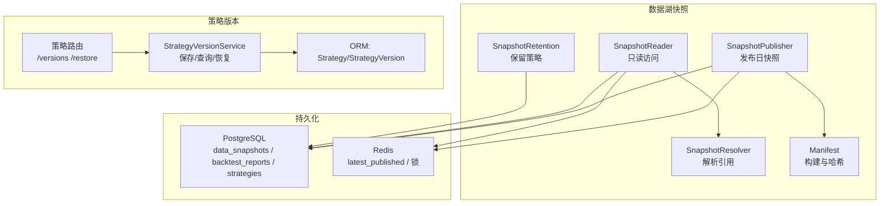
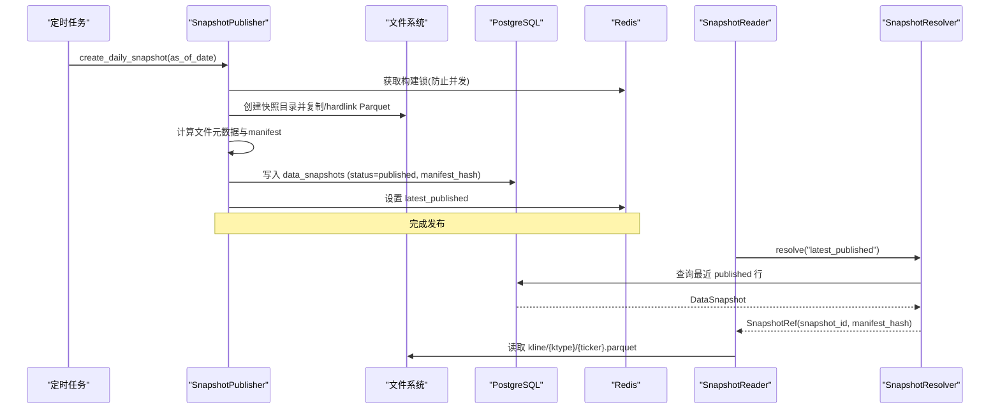
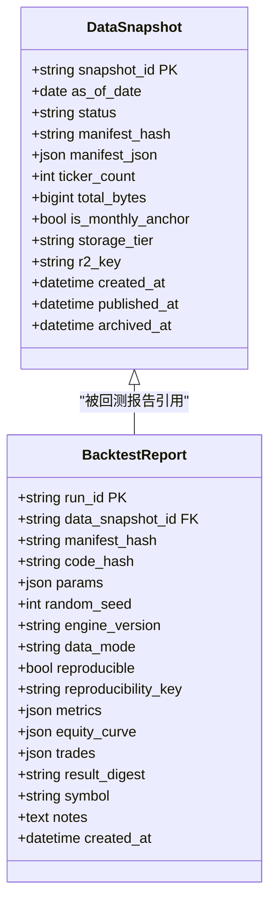
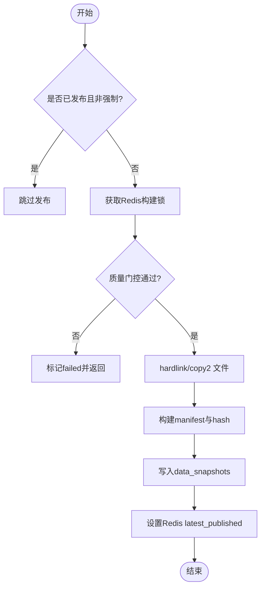
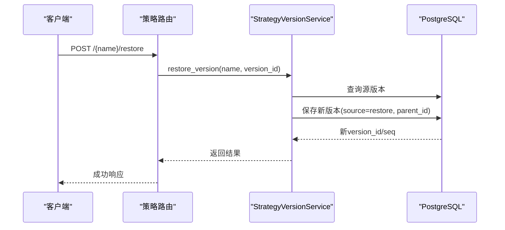
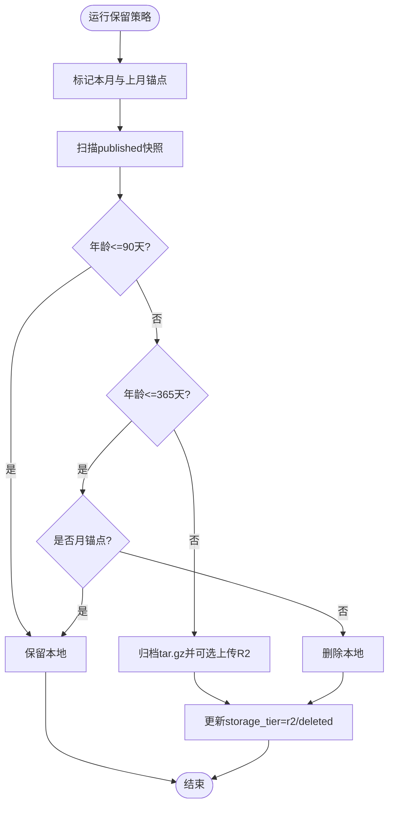
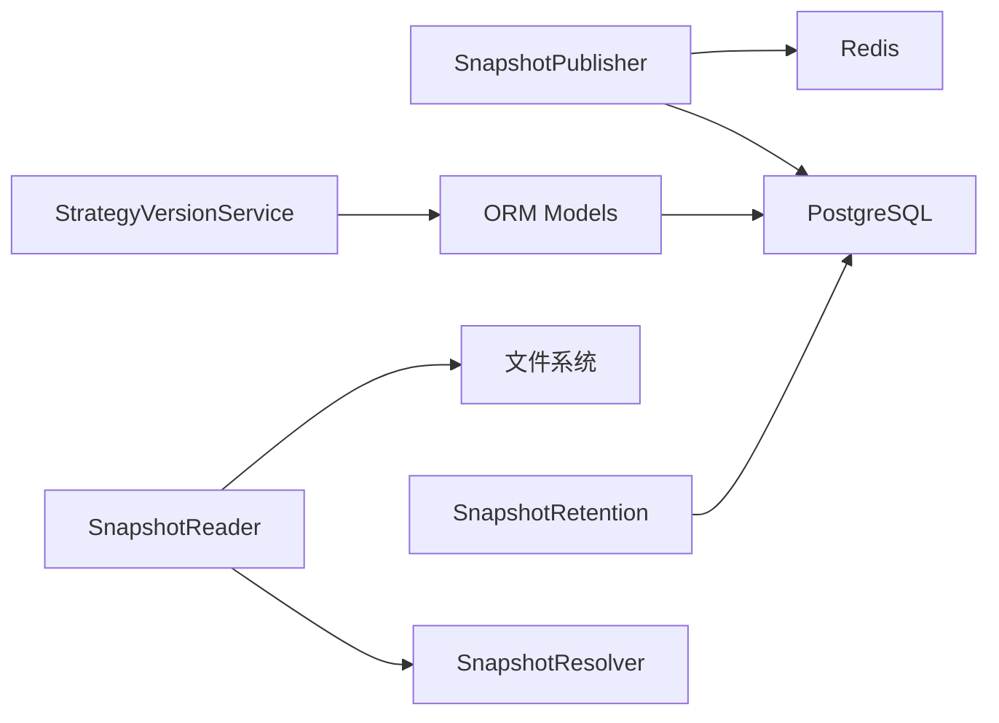

# 版本控制系统

<cite>
**本文引用的文件**
- [backend/core/datalake_models.py](file://backend/core/datalake_models.py)
- [backend/services/datalake/snapshot_publisher.py](file://backend/services/datalake/snapshot_publisher.py)
- [backend/services/datalake/snapshot_reader.py](file://backend/services/datalake/snapshot_reader.py)
- [backend/services/datalake/snapshot_resolver.py](file://backend/services/datalake/snapshot_resolver.py)
- [backend/services/datalake/snapshot_retention.py](file://backend/services/datalake/snapshot_retention.py)
- [backend/services/strategy_version_service.py](file://backend/services/strategy_version_service.py)
- [backend/routers/strategy.py](file://backend/routers/strategy.py)
- [backend/core/models.py](file://backend/core/models.py)
</cite>

## 目录
1. [简介](#简介)
2. [项目结构](#项目结构)
3. [核心组件](#核心组件)
4. [架构总览](#架构总览)
5. [详细组件分析](#详细组件分析)
6. [依赖关系分析](#依赖关系分析)
7. [性能与一致性](#性能与一致性)
8. [故障排查指南](#故障排查指南)
9. [结论](#结论)
10. [附录：API 与使用场景](#附录api-与使用场景)

## 简介
本技术文档面向 Quant Agent 的数据版本控制系统，围绕基于 Manifest 的版本管理机制、快照发布流程（全量与增量策略）、版本回滚与分支管理（策略版本）、版本查询与对比、存储清理与优化、以及一致性与冲突解决机制进行系统化说明。该体系以“数据快照不可变 + 元数据可追踪”为核心思想，结合 Manifest 哈希指纹、数据库持久化与 Redis 指针，实现可复现的回测与稳定的生产数据消费。

## 项目结构
与版本控制相关的关键模块分布在后端服务层：
- 数据湖快照生命周期：发布、解析、读取、保留策略
- 策略版本管理：保存、查询、恢复
- 模型定义：数据快照与回测报告 ORM、策略版本 ORM

图表来源
- [backend/services/datalake/snapshot_publisher.py:91-250](file://backend/services/datalake/snapshot_publisher.py#L91-L250)
- [backend/services/datalake/snapshot_reader.py:30-121](file://backend/services/datalake/snapshot_reader.py#L30-L121)
- [backend/services/datalake/snapshot_resolver.py:31-103](file://backend/services/datalake/snapshot_resolver.py#L31-L103)
- [backend/services/datalake/snapshot_retention.py:29-143](file://backend/services/datalake/snapshot_retention.py#L29-L143)
- [backend/services/strategy_version_service.py:18-243](file://backend/services/strategy_version_service.py#L18-L243)
- [backend/routers/strategy.py:526-557](file://backend/routers/strategy.py#L526-L557)
- [backend/core/datalake_models.py:31-82](file://backend/core/datalake_models.py#L31-L82)
- [backend/core/models.py:351-393](file://backend/core/models.py#L351-L393)

章节来源
- [backend/core/datalake_models.py:31-82](file://backend/core/datalake_models.py#L31-L82)
- [backend/services/datalake/snapshot_publisher.py:91-250](file://backend/services/datalake/snapshot_publisher.py#L91-L250)
- [backend/services/datalake/snapshot_reader.py:30-121](file://backend/services/datalake/snapshot_reader.py#L30-L121)
- [backend/services/datalake/snapshot_resolver.py:31-103](file://backend/services/datalake/snapshot_resolver.py#L31-L103)
- [backend/services/datalake/snapshot_retention.py:29-143](file://backend/services/datalake/snapshot_retention.py#L29-L143)
- [backend/services/strategy_version_service.py:18-243](file://backend/services/strategy_version_service.py#L18-L243)
- [backend/routers/strategy.py:526-557](file://backend/routers/strategy.py#L526-L557)
- [backend/core/models.py:351-393](file://backend/core/models.py#L351-L393)

## 核心组件
- 数据快照发布器（SnapshotPublisher）：从 live 层生成每日快照，写入 Parquet 文件、侧车文件与 manifest.json，并持久化到 PostgreSQL；通过 Redis 设置最新指针与构建中状态。
- 快照解析器（SnapshotResolver）：将 latest_published/live/指定快照 ID 或 manifest_hash 解析为可绑定的 SnapshotRef，用于回测数据绑定与一致性校验。
- 快照读取器（SnapshotReader）：提供只读访问快照目录的能力，支持按 ticker/ktype 读取历史 K 线，并处理 live/unbound/latest_published 的语义。
- 快照保留策略（SnapshotRetention）：按时间分层（T1/T2/T3）执行本地删除、月锚点标记、归档至对象存储（可选），并更新数据库状态。
- 策略版本服务（StrategyVersionService）：对策略源码进行不可变版本化，支持幂等保存、序列号递增、head 指针更新、恢复旧版本。
- 策略版本路由（routers/strategy）：暴露获取版本列表、获取单个版本、恢复版本的 API。

章节来源
- [backend/services/datalake/snapshot_publisher.py:91-250](file://backend/services/datalake/snapshot_publisher.py#L91-L250)
- [backend/services/datalake/snapshot_resolver.py:31-103](file://backend/services/datalake/snapshot_resolver.py#L31-L103)
- [backend/services/datalake/snapshot_reader.py:30-121](file://backend/services/datalake/snapshot_reader.py#L30-L121)
- [backend/services/datalake/snapshot_retention.py:29-143](file://backend/services/datalake/snapshot_retention.py#L29-L143)
- [backend/services/strategy_version_service.py:18-243](file://backend/services/strategy_version_service.py#L18-L243)
- [backend/routers/strategy.py:526-557](file://backend/routers/strategy.py#L526-L557)

## 架构总览
系统采用“发布-解析-读取-保留”的分层架构，配合“策略版本”独立的生命周期管理，形成数据与代码双轨版本化。

图表来源
- [backend/services/datalake/snapshot_publisher.py:119-250](file://backend/services/datalake/snapshot_publisher.py#L119-L250)
- [backend/services/datalake/snapshot_reader.py:42-77](file://backend/services/datalake/snapshot_reader.py#L42-L77)
- [backend/services/datalake/snapshot_resolver.py:44-103](file://backend/services/datalake/snapshot_resolver.py#L44-L103)
- [backend/core/datalake_models.py:31-50](file://backend/core/datalake_models.py#L31-L50)

## 详细组件分析

### 基于 Manifest 的版本管理机制
- 版本号与指纹
  - 每个快照包含 manifest.json，记录文件清单、时间范围、大小、侧车信息等，并通过 compute_manifest_hash 生成固定长度的 manifest_hash，作为数据指纹。
  - 数据快照表 data_snapshots 持久化 manifest_hash 与 manifest_json，便于回溯与比对。
- 元数据管理
  - snapshot_id 格式为 snap_YYYYMMDD，as_of_date 表示基准日期，status 标识 building/published/failed 等状态。
  - 额外字段包括 ticker_count、total_bytes、is_monthly_anchor、storage_tier、r2_key、published_at、archived_at。
- 依赖关系追踪
  - 通过 SnapshotRef 将 data_snapshot_id 与 manifest_hash 绑定，确保回测结果与数据源严格对应。
  - 回测报告表 backtest_reports 记录 code_hash、params、random_seed、engine_version、reproducibility_key 等，保证实验可复现。

图表来源
- [backend/core/datalake_models.py:31-82](file://backend/core/datalake_models.py#L31-L82)

章节来源
- [backend/core/datalake_models.py:31-82](file://backend/core/datalake_models.py#L31-L82)
- [backend/services/datalake/snapshot_publisher.py:192-205](file://backend/services/datalake/snapshot_publisher.py#L192-L205)

### 快照发布流程（全量与增量策略）
- 全量快照
  - 遍历 KTYPES_V1 下的所有 parquet 文件，优先 hardlink，失败则 copy2，生成文件元数据并写入 manifest.json。
  - 质量门控：若 quality_gate 未通过，直接标记 failed 并返回。
  - 幂等保护：已发布的同日期快照在 force=false 时跳过。
- 增量快照（设计要点）
  - 当前实现以“按天全量复制”为主；增量可通过比较 live 层文件变更与快照目录差异来实现（例如仅复制新增/修改的 ticker 文件）。
  - 建议在后续迭代中引入 diff 机制，减少 I/O 与磁盘占用。
- 发布后处理
  - 设置 Redis latest_published 指针，清理构建中键，记录指标。
  - 尝试设置文件只读权限（尽力而为）。

图表来源
- [backend/services/datalake/snapshot_publisher.py:119-250](file://backend/services/datalake/snapshot_publisher.py#L119-L250)

章节来源
- [backend/services/datalake/snapshot_publisher.py:119-250](file://backend/services/datalake/snapshot_publisher.py#L119-L250)

### 版本回滚与分支管理（策略版本）
- 版本保存
  - 计算代码 SHA256 哈希，幂等检查避免重复版本；自动递增 seq 并更新 head_version_id。
  - 支持 source 标记（manual/ai-apply/auto-fix/ast-fix/restore）与 message 备注。
- 版本查询
  - 按 seq 倒序返回版本时间线，默认不包含完整代码以降低带宽。
- 版本恢复
  - 以旧版本内容创建新的 restore 版本，parent_id 指向被恢复版本，形成可追溯的恢复链。
- 分支管理（概念）
  - 当前实现为线性版本链；如需分支，可在 StrategyVersion 中扩展 branch 字段与合并策略。

图表来源
- [backend/routers/strategy.py:542-557](file://backend/routers/strategy.py#L542-L557)
- [backend/services/strategy_version_service.py:179-202](file://backend/services/strategy_version_service.py#L179-L202)
- [backend/core/models.py:351-393](file://backend/core/models.py#L351-L393)

章节来源
- [backend/services/strategy_version_service.py:18-243](file://backend/services/strategy_version_service.py#L18-L243)
- [backend/routers/strategy.py:526-557](file://backend/routers/strategy.py#L526-L557)
- [backend/core/models.py:351-393](file://backend/core/models.py#L351-L393)

### 版本查询 API 与版本对比工具
- 版本查询 API
  - GET /{name}/versions：获取策略版本时间线（limit 默认 50）。
  - GET /versions/{version_id}：获取单个版本详情（含代码）。
  - POST /{name}/restore：恢复指定版本，创建新的 restore 版本。
- 版本对比工具（建议）
  - 基于 code_hash 与 seq 的差异对比，输出新增/删除/修改的行级差异。
  - 结合 manifest_hash 对比数据快照差异，支持数据维度 A/B 测试。

章节来源
- [backend/routers/strategy.py:526-557](file://backend/routers/strategy.py#L526-L557)

### 版本清理策略与存储空间优化
- 分层保留策略
  - T1（0–90天）：全保留。
  - T2（91–365天）：仅保留月锚点，其余删除本地。
  - T3（>365天）：归档为 tar.gz，可选上传至对象存储（R2），删除本地。
- 月锚点标记
  - 每月最后一个 published 快照标记为 is_monthly_anchor=true，便于长期回溯。
- 存储优化
  - 优先 hardlink 减少重复数据；copy2/mixed 模式记录于 manifest。
  - 归档后可释放本地空间，降低冷数据成本。

图表来源
- [backend/services/datalake/snapshot_retention.py:61-129](file://backend/services/datalake/snapshot_retention.py#L61-L129)

章节来源
- [backend/services/datalake/snapshot_retention.py:29-143](file://backend/services/datalake/snapshot_retention.py#L29-L143)

### 版本一致性保证与冲突解决机制
- 一致性保证
  - Manifest 哈希：每次发布计算 manifest_hash，作为数据指纹，绑定到 data_snapshots。
  - 解析器约束：resolve 方法在 DB 缺失或未发布时返回 unbound/missing，禁止在生产环境直接使用 live 数据（需显式开关）。
  - Redis 指针：latest_published 指向最近一次 published 快照，确保读取端一致性。
- 冲突解决
  - 幂等发布：同日期已发布且非强制时跳过。
  - 并发安全：Redis 构建锁防止重复发布；唯一索引（code_hash）防止重复版本。
  - 错误降级：质量门控失败时标记 failed 并返回，不污染 published 集合。

章节来源
- [backend/services/datalake/snapshot_resolver.py:44-103](file://backend/services/datalake/snapshot_resolver.py#L44-L103)
- [backend/services/datalake/snapshot_publisher.py:119-156](file://backend/services/datalake/snapshot_publisher.py#L119-L156)
- [backend/services/strategy_version_service.py:40-113](file://backend/services/strategy_version_service.py#L40-L113)

## 依赖关系分析
- 组件耦合
  - SnapshotPublisher 依赖 manifest 构建与路径管理，写入 PG 与 Redis。
  - SnapshotReader 依赖 SnapshotResolver 解析引用，再访问文件系统。
  - SnapshotRetention 依赖 PG 状态与可选 R2 上传。
  - StrategyVersionService 依赖 ORM 模型与数据库事务。
- 外部依赖
  - PostgreSQL：持久化快照元数据与策略版本。
  - Redis：缓存 latest_published、构建锁、保留锁。
  - 文件系统：Parquet 文件与 manifest.json。

图表来源
- [backend/services/datalake/snapshot_publisher.py:91-250](file://backend/services/datalake/snapshot_publisher.py#L91-L250)
- [backend/services/datalake/snapshot_reader.py:30-121](file://backend/services/datalake/snapshot_reader.py#L30-L121)
- [backend/services/datalake/snapshot_resolver.py:31-103](file://backend/services/datalake/snapshot_resolver.py#L31-L103)
- [backend/services/datalake/snapshot_retention.py:29-143](file://backend/services/datalake/snapshot_retention.py#L29-L143)
- [backend/services/strategy_version_service.py:18-243](file://backend/services/strategy_version_service.py#L18-L243)
- [backend/core/datalake_models.py:31-82](file://backend/core/datalake_models.py#L31-L82)
- [backend/core/models.py:351-393](file://backend/core/models.py#L351-L393)

章节来源
- [backend/services/datalake/snapshot_publisher.py:91-250](file://backend/services/datalake/snapshot_publisher.py#L91-L250)
- [backend/services/datalake/snapshot_reader.py:30-121](file://backend/services/datalake/snapshot_reader.py#L30-L121)
- [backend/services/datalake/snapshot_resolver.py:31-103](file://backend/services/datalake/snapshot_resolver.py#L31-L103)
- [backend/services/datalake/snapshot_retention.py:29-143](file://backend/services/datalake/snapshot_retention.py#L29-L143)
- [backend/services/strategy_version_service.py:18-243](file://backend/services/strategy_version_service.py#L18-L243)
- [backend/core/datalake_models.py:31-82](file://backend/core/datalake_models.py#L31-L82)
- [backend/core/models.py:351-393](file://backend/core/models.py#L351-L393)

## 性能与一致性
- 性能特性
  - 文件复制优先 hardlink，显著减少 I/O 与磁盘占用；fallback 到 copy2 保证兼容性。
  - 读取端异步化（get_history 使用 asyncio.to_thread）避免阻塞事件循环。
  - 保留策略批量处理，减少频繁 IO。
- 一致性保障
  - Manifest 哈希与 DB 持久化确保数据不可变与可审计。
  - Redis 指针与锁机制避免竞态条件。
  - 策略版本唯一索引与事务回滚保证幂等与原子性。

[本节为通用指导，无需特定文件来源]

## 故障排查指南
- 快照发布失败
  - 检查质量门控是否通过；查看 data_snapshots.status 是否为 failed。
  - 确认 Redis 锁是否被持有（构建中状态）。
- 无法解析 latest_published
  - 检查 Redis 是否存在 latest_published 键；若无，查看是否有 published 快照。
  - 若 data_snapshot_id=live，确认环境变量允许 live 数据。
- 策略版本恢复异常
  - 确认源版本存在；检查唯一索引冲突（code_hash）。
  - 查看恢复后的 parent_id 是否正确链接。

章节来源
- [backend/services/datalake/snapshot_publisher.py:147-156](file://backend/services/datalake/snapshot_publisher.py#L147-L156)
- [backend/services/datalake/snapshot_reader.py:42-64](file://backend/services/datalake/snapshot_reader.py#L42-L64)
- [backend/services/datalake/snapshot_resolver.py:59-88](file://backend/services/datalake/snapshot_resolver.py#L59-L88)
- [backend/services/strategy_version_service.py:92-113](file://backend/services/strategy_version_service.py#L92-L113)

## 结论
Quant Agent 的版本控制系统以 Manifest 为核心，结合不可变快照、数据库元数据与 Redis 指针，实现了高可靠的数据版本管理与策略版本管理。通过分层保留策略与幂等发布机制，系统在可扩展性与一致性之间取得平衡。未来可进一步增强增量快照、分支合并与版本对比工具，以支持更复杂的实验与 A/B 测试场景。

[本节为总结，无需特定文件来源]

## 附录：API 与使用场景
- 策略版本 API
  - GET /{name}/versions：获取版本时间线。
  - GET /versions/{version_id}：获取版本详情。
  - POST /{name}/restore：恢复版本。
- 使用场景
  - 回测复现：绑定 data_snapshot_id 与 manifest_hash，确保数据与代码一致。
  - 实验与 A/B 测试：通过策略版本与数据快照组合，隔离不同参数与数据集。
  - 合规审计：利用 manifest_hash 与 code_hash 进行溯源与审计。

章节来源
- [backend/routers/strategy.py:526-557](file://backend/routers/strategy.py#L526-L557)
- [backend/core/datalake_models.py:53-82](file://backend/core/datalake_models.py#L53-L82)
