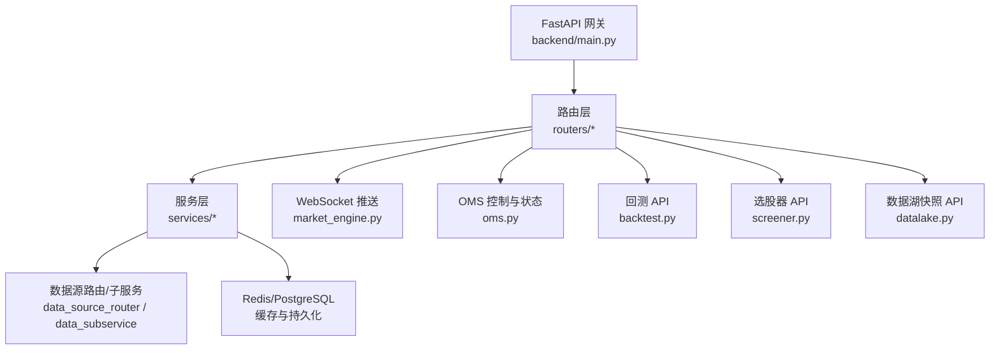
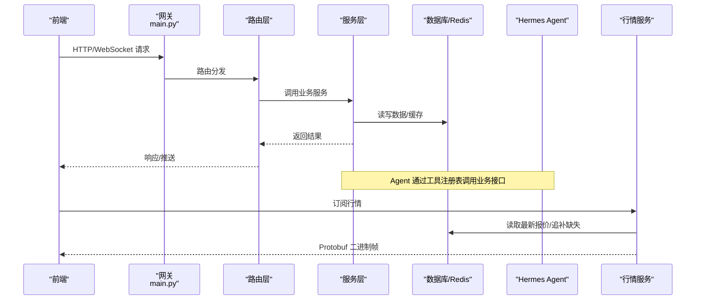
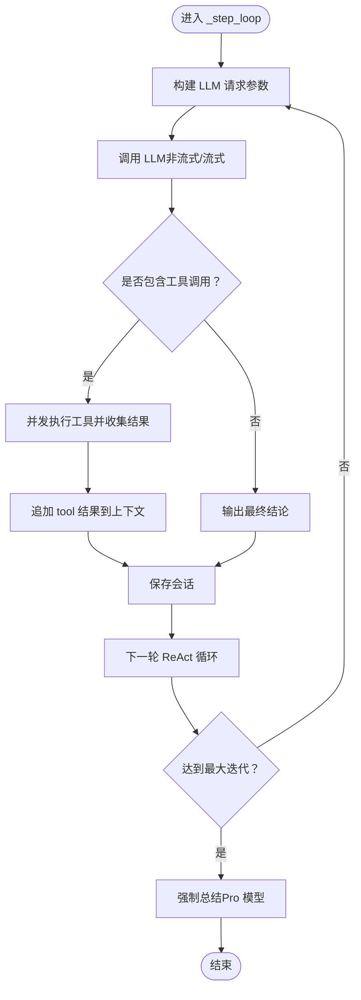
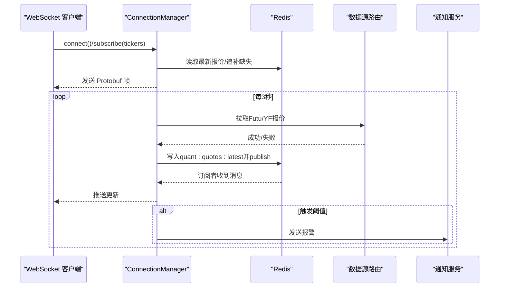
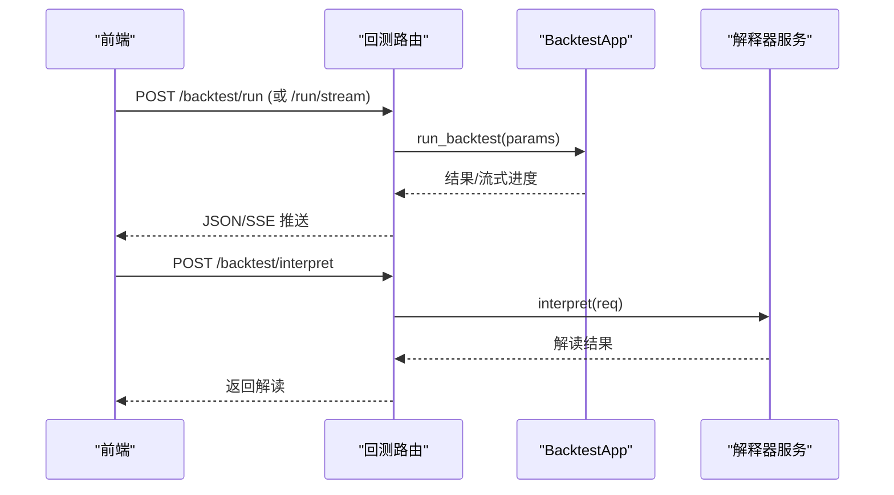
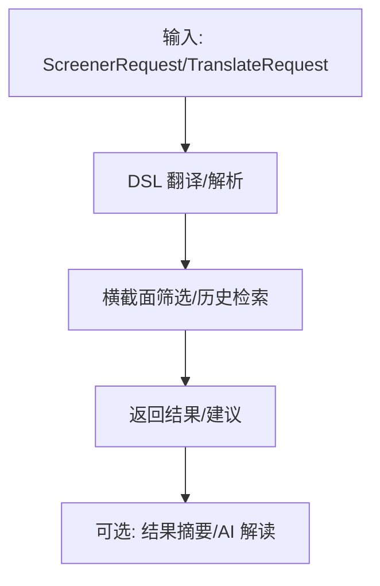
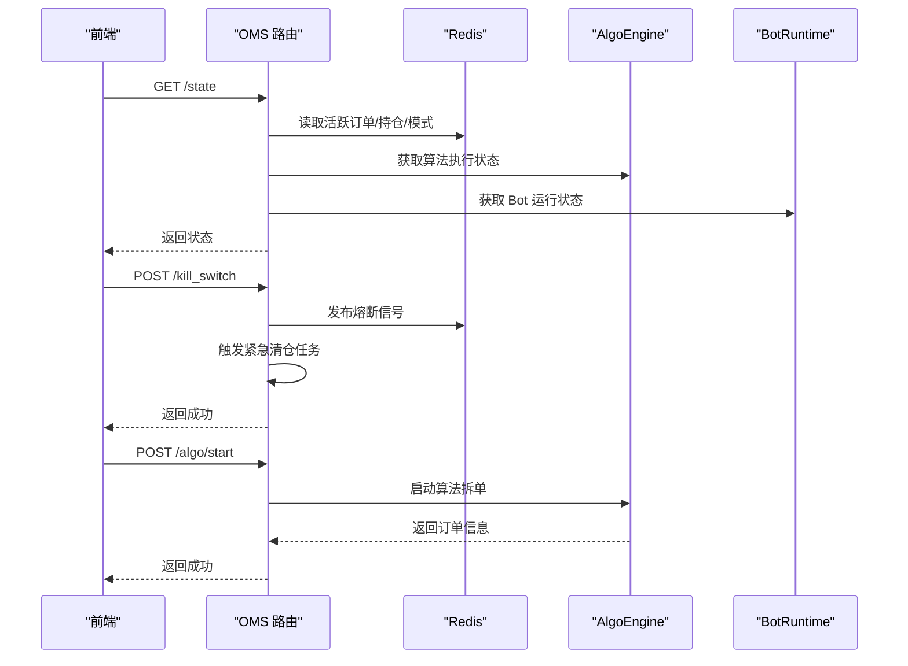
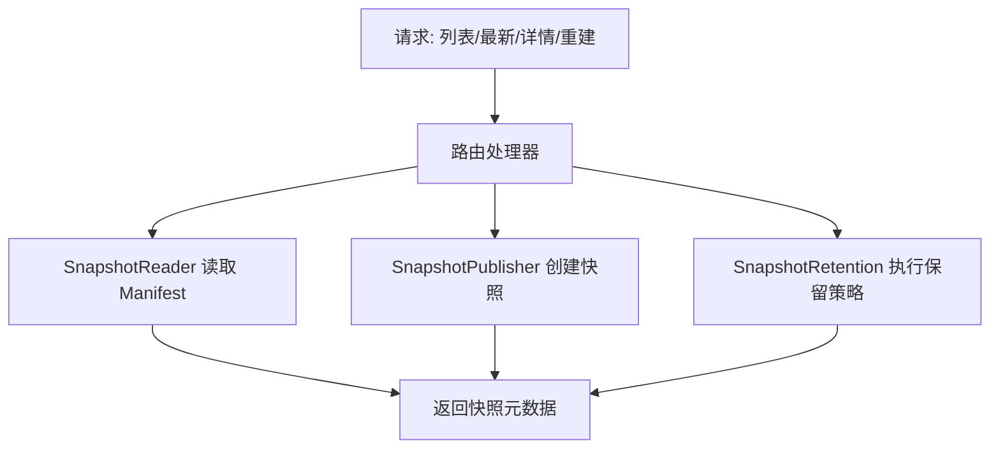
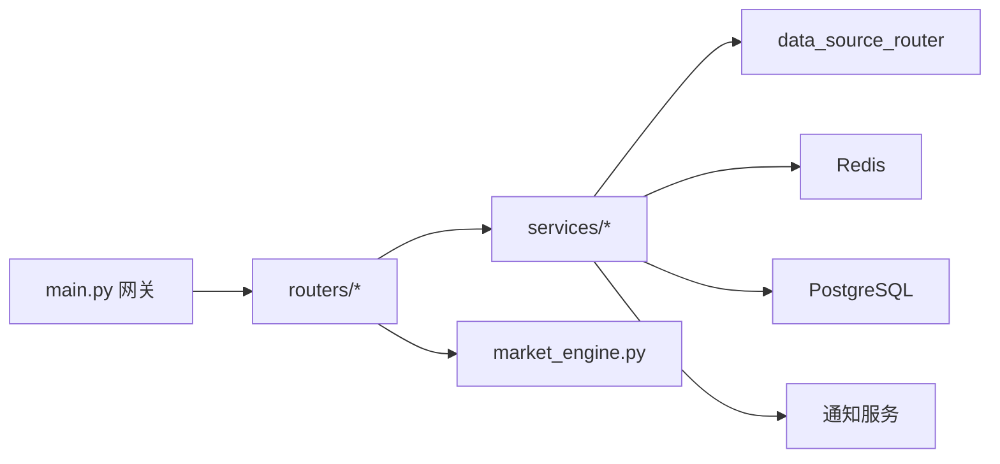

# 核心功能特性

<cite>
**本文引用的文件**
- [backend/main.py](file://backend/main.py)
- [hermes_agent/agent.py](file://hermes_agent/agent.py)
- [backend/routers/backtest.py](file://backend/routers/backtest.py)
- [backend/routers/screener.py](file://backend/routers/screener.py)
- [backend/routers/oms.py](file://backend/routers/oms.py)
- [backend/routers/datalake.py](file://backend/routers/datalake.py)
- [backend/services/market_engine.py](file://backend/services/market_engine.py)
</cite>

## 目录
1. [简介](#简介)
2. [项目结构](#项目结构)
3. [核心组件](#核心组件)
4. [架构总览](#架构总览)
5. [详细组件分析](#详细组件分析)
6. [依赖关系分析](#依赖关系分析)
7. [性能考量](#性能考量)
8. [故障排查指南](#故障排查指南)
9. [结论](#结论)
10. [附录](#附录)

## 简介
Quant Agent 是一个 AI 驱动的量化交易终端，提供 AI 智能分析、实时行情、策略回测、选股器、订单管理与数据湖等核心能力。平台以 FastAPI 为网关，通过 Redis 与数据库进行状态与数据持久化，结合 WebSocket 实现低延迟推送；AI 侧基于 Hermes Agent 的 ReAct 工作流调度工具调用，形成“感知—决策—执行”的闭环。

## 项目结构
后端采用“瘦网关 + 路由层 + 服务层 + 引擎/子服务”的分层架构：
- 网关入口：统一创建应用、注册中间件、挂载所有业务路由
- 路由层：按领域划分（回测、选股、OMS、数据湖、市场等）
- 服务层：封装业务编排与外部系统交互（数据源路由、通知、缓存等）
- 引擎/子服务：回测引擎、数据源节点、OMS 执行器等

**图示来源**
- [backend/main.py:125-218](file://backend/main.py#L125-L218)
- [backend/services/market_engine.py:115-199](file://backend/services/market_engine.py#L115-L199)

**章节来源**
- [backend/main.py:125-218](file://backend/main.py#L125-L218)

## 核心组件
- AI 智能分析系统（Hermes Agent）：ReAct 循环、工具注册与执行、流式输出、记忆与知识库沉淀、熔断恢复
- 实时行情数据服务：WebSocket 连接管理、订阅分发、Redis Pub/Sub 广播、Protobuf 序列化、断线追补
- 策略回测引擎：标准回测、滚动验证、蒙特卡洛压测、参数网格搜索、过拟合检测、AI 解读
- 选股器系统：DSL 翻译、横截面筛选、历史与字典管理、订阅与 CEP 规则、组合回测
- 订单管理系统（OMS）：挂单/改单/撤单、算法拆单、模式切换、Kill Switch、WebSocket 实时推送
- 数据湖管理：快照列表/详情/重建、保留策略、指标埋点

**章节来源**
- [hermes_agent/agent.py:116-199](file://hermes_agent/agent.py#L116-L199)
- [backend/services/market_engine.py:39-113](file://backend/services/market_engine.py#L39-L113)
- [backend/routers/backtest.py:145-385](file://backend/routers/backtest.py#L145-L385)
- [backend/routers/screener.py:87-221](file://backend/routers/screener.py#L87-L221)
- [backend/routers/oms.py:56-371](file://backend/routers/oms.py#L56-L371)
- [backend/routers/datalake.py:61-138](file://backend/routers/datalake.py#L61-L138)

## 架构总览
系统以 FastAPI 网关为中心，各模块通过路由暴露 API；内部使用 Redis 作为消息总线与缓存，PostgreSQL 用于持久化；AI Agent 通过工具注册表调用各业务能力；行情服务通过 WebSocket 与 Redis Pub/Sub 将数据推送到前端。

**图示来源**
- [backend/main.py:125-218](file://backend/main.py#L125-L218)
- [backend/services/market_engine.py:174-244](file://backend/services/market_engine.py#L174-L244)
- [hermes_agent/agent.py:116-199](file://hermes_agent/agent.py#L116-L199)

## 详细组件分析

### AI 智能分析系统（Hermes Agent）
- 核心能力
  - ReAct 循环：Plan → Tool → Verify → Output，最大迭代次数限制并支持强制总结恢复
  - 工具注册与并发执行：统一安全执行包装，异常捕获与结果归一化
  - 流式输出：SSE/异步流式推送文本块、工具开始/结果、心跳保活、图表标注与策略代码事件
  - 记忆与知识库：会话记忆加载/保存、上下文压缩与自愈、事实沉淀到知识库
  - Token 计量与预算护栏：统一记录 token 用量，防止上下文累积过大
- 使用场景
  - 个股深度分析、宏观判因注入、策略建议生成、回测报告解读
- 技术特点
  - 低温度参数确保确定性输出；多模型切换（基础/Pro/视觉）；参考引用完整性校验与自愈
  - 与业务服务解耦：通过工具注册表调用，便于扩展新工具

**图示来源**
- [hermes_agent/agent.py:399-500](file://hermes_agent/agent.py#L399-L500)
- [hermes_agent/agent.py:502-799](file://hermes_agent/agent.py#L502-L799)

**章节来源**
- [hermes_agent/agent.py:116-199](file://hermes_agent/agent.py#L116-L199)
- [hermes_agent/agent.py:399-500](file://hermes_agent/agent.py#L399-L500)
- [hermes_agent/agent.py:502-799](file://hermes_agent/agent.py#L502-L799)

### 实时行情数据服务
- 核心能力
  - WebSocket 连接管理：连接/断开、订阅/反订阅、活跃连接计数
  - 数据写入与广播：Protobuf 序列化报价，写入 Redis Hash 并 Pub/Sub 广播
  - 断线追补：基于 Redis Stream XRANGE 区间追补，批量压缩帧降低网络开销
  - 指标与资金流缓存：技术指标与资金流向定时刷新，失败退避防风暴
  - 风控报警：价格突破/涨跌幅阈值触发通知；宏观资金流出预警
- 使用场景
  - 盘口实时推送、自选列表同步、技术指标展示、账户资产快照
- 技术特点
  - 零拷贝二进制帧传输；订阅集与生产者动态同步；YFinance/Futu 双源兜底

**图示来源**
- [backend/services/market_engine.py:39-113](file://backend/services/market_engine.py#L39-L113)
- [backend/services/market_engine.py:174-244](file://backend/services/market_engine.py#L174-L244)
- [backend/services/market_engine.py:296-331](file://backend/services/market_engine.py#L296-L331)
- [backend/services/market_engine.py:332-598](file://backend/services/market_engine.py#L332-L598)

**章节来源**
- [backend/services/market_engine.py:39-113](file://backend/services/market_engine.py#L39-L113)
- [backend/services/market_engine.py:174-244](file://backend/services/market_engine.py#L174-L244)
- [backend/services/market_engine.py:296-331](file://backend/services/market_engine.py#L296-L331)
- [backend/services/market_engine.py:332-598](file://backend/services/market_engine.py#L332-L598)

### 策略回测引擎
- 核心能力
  - 标准回测与流式进度推送（SSE）
  - 滚动窗口训练/验证（Walk-Forward）
  - 蒙特卡洛压测（交易重排/自助抽样，分位曲线）
  - 参数网格搜索（并发回测+热力图）
  - 过拟合检测（Deflated Sharpe Ratio + 参数悬崖）
  - AI 解读：Tear Sheet 一句话解读、健康度持久化
- 使用场景
  - 策略验证、参数优化、稳健性评估、回测报告解读
- 技术特点
  - 统一参数模型与错误处理；SSE 流式进度；指标与健康度存储

**图示来源**
- [backend/routers/backtest.py:145-218](file://backend/routers/backtest.py#L145-L218)
- [backend/routers/backtest.py:328-385](file://backend/routers/backtest.py#L328-L385)

**章节来源**
- [backend/routers/backtest.py:145-218](file://backend/routers/backtest.py#L145-L218)
- [backend/routers/backtest.py:221-321](file://backend/routers/backtest.py#L221-L321)
- [backend/routers/backtest.py:328-385](file://backend/routers/backtest.py#L328-L385)

### 选股器系统
- 核心能力
  - DSL 翻译与自然语言转条件
  - 横截面筛选与组合回测
  - 历史查询、保存与分享（Screens）
  - 字典管理（自定义词表/因子映射）
  - 订阅与 CEP 规则（复杂事件处理）
  - 结果摘要与 AI 辅助
- 使用场景
  - 快速选股、条件复用、策略初筛、组合回测验证
- 技术特点
  - Thin Router 仅做 HTTP 映射；业务逻辑下沉至 app 层；鉴权与依赖注入清晰

**图示来源**
- [backend/routers/screener.py:87-221](file://backend/routers/screener.py#L87-L221)

**章节来源**
- [backend/routers/screener.py:87-221](file://backend/routers/screener.py#L87-L221)

### 订单管理系统（OMS）
- 核心能力
  - 初始状态获取（活动挂单、历史成交、Bot 算力节点、算法执行、交易模式）
  - Kill Switch 全局熔断（终止进程信号+市价全平）
  - 订单操作：幂等撤单、改单、审计日志
  - 算法拆单：TWAP/VWAP/ICEBERG 启动/暂停/恢复/取消
  - 交易模式热切换：SANDBOX/PAPER/LIVE（Redis 热读）
  - WebSocket 实时推送：订单、成交、Bot 日志、模式变更
- 使用场景
  - 实盘/纸面交易控制、算法执行监控、风控熔断
- 技术特点
  - Redis 分布式锁保证幂等；Pub/Sub 广播实时更新；审计日志可追溯

**图示来源**
- [backend/routers/oms.py:56-118](file://backend/routers/oms.py#L56-L118)
- [backend/routers/oms.py:120-177](file://backend/routers/oms.py#L120-L177)
- [backend/routers/oms.py:217-283](file://backend/routers/oms.py#L217-L283)
- [backend/routers/oms.py:321-371](file://backend/routers/oms.py#L321-L371)
- [backend/routers/oms.py:379-464](file://backend/routers/oms.py#L379-L464)

**章节来源**
- [backend/routers/oms.py:56-118](file://backend/routers/oms.py#L56-L118)
- [backend/routers/oms.py:120-177](file://backend/routers/oms.py#L120-L177)
- [backend/routers/oms.py:217-283](file://backend/routers/oms.py#L217-L283)
- [backend/routers/oms.py:321-371](file://backend/routers/oms.py#L321-L371)
- [backend/routers/oms.py:379-464](file://backend/routers/oms.py#L379-L464)

### 数据湖管理
- 核心能力
  - 快照列表/最新快照/详情查询
  - 按需重建快照（指定日期/强制覆盖）
  - 保留策略执行（清理过期快照）
  - 指标埋点：最新快照年龄监控
- 使用场景
  - 数据版本化管理、离线分析、回测数据一致性保障
- 技术特点
  - 快照 Manifest 与元数据持久化；发布者/读者/保留策略分离

**图示来源**
- [backend/routers/datalake.py:61-138](file://backend/routers/datalake.py#L61-L138)

**章节来源**
- [backend/routers/datalake.py:61-138](file://backend/routers/datalake.py#L61-L138)

## 依赖关系分析
- 网关依赖：中间件（CORS、访问日志）、异常处理、OpenAPI、生命周期、OTEL、结构化日志
- 路由依赖：认证、数据库会话、Redis 客户端、业务服务
- 服务依赖：数据源路由（Futu/YFinance/其他）、通知服务、Kline 仓库、指标埋点
- 外部依赖：PostgreSQL（pgvector/pg_trgm）、Redis（Hash/Stream/PubSub）、LLM 提供商

**图示来源**
- [backend/main.py:125-218](file://backend/main.py#L125-L218)
- [backend/services/market_engine.py:115-199](file://backend/services/market_engine.py#L115-L199)

**章节来源**
- [backend/main.py:125-218](file://backend/main.py#L125-L218)
- [backend/services/market_engine.py:115-199](file://backend/services/market_engine.py#L115-L199)

## 性能考量
- 行情推送：Protobuf 二进制帧、批量压缩帧、Redis Stream 追补、订阅集同步减少无效推送
- 防风暴：技术指标与资金流刷新节流、失败退避、YFinance 串行请求避免封禁
- 内存与资源：后台任务强引用防 GC、连接池与超时配置、Redis 键空间清理
- 可观测性：指标埋点（报价延迟/陈旧度/总量、WS 连接数/消息数）

[本节为通用指导，不直接分析具体文件]

## 故障排查指南
- 行情推送异常
  - 检查 Redis Pub/Sub 通道是否正常、WebSocket 连接是否存活、订阅标的是否同步
  - 关注 Protobuf 解析异常与 XRANGE 追补失败日志
- 大模型调用异常
  - 检查 LLM_API_KEY/BASE_URL/模型配置；查看 TokenGuard 预算与重试机制
  - 流式路径注意心跳保活与 Cloudflare 超时
- 回测数据错误
  - 确认数据源可用性、随机种子与快照 ID；查看流式进度中的错误类型
- OMS 操作失败
  - 检查幂等锁是否冲突、Redis 消息是否送达、审计日志是否记录
- 数据湖快照问题
  - 确认 Manifest 是否存在、重建任务是否成功、保留策略是否误删

**章节来源**
- [backend/services/market_engine.py:39-113](file://backend/services/market_engine.py#L39-L113)
- [backend/services/market_engine.py:296-331](file://backend/services/market_engine.py#L296-L331)
- [hermes_agent/agent.py:399-500](file://hermes_agent/agent.py#L399-L500)
- [backend/routers/backtest.py:145-218](file://backend/routers/backtest.py#L145-L218)
- [backend/routers/oms.py:120-177](file://backend/routers/oms.py#L120-L177)
- [backend/routers/datalake.py:61-138](file://backend/routers/datalake.py#L61-L138)

## 结论
Quant Agent 通过清晰的层次化架构与高内聚的服务边界，实现了 AI 智能分析、实时行情、策略回测、选股器、OMS 与数据湖的协同工作。系统在性能、可靠性与可扩展性方面做了充分设计，包括二进制推送、流式处理、熔断恢复、审计与可观测性。用户可从初学者友好的界面逐步深入到高级定制与扩展。

[本节为总结，不直接分析具体文件]

## 附录
- 使用示例（概念性）
  - 启动回测：提交 ticker、周期、初始资金、滑点与佣金，选择流式或非流式接口
  - 选股：编写 DSL 或使用自然语言翻译，执行横截面筛选并保存为 Screen
  - 下单：在 OMS 中发起算法拆单，实时监控执行进度与绩效分析
  - 数据湖：重建指定日期的快照，查询最新快照与 Manifest
- 扩展与定制
  - 新增工具：在 Hermes Agent 工具注册表中添加新工具，暴露业务接口
  - 新增数据源：在数据源路由中接入新的子服务，保持统一协议
  - 自定义指标：在服务层集成技术指标计算，缓存至 Redis 供前端使用

[本节为通用指导，不直接分析具体文件]