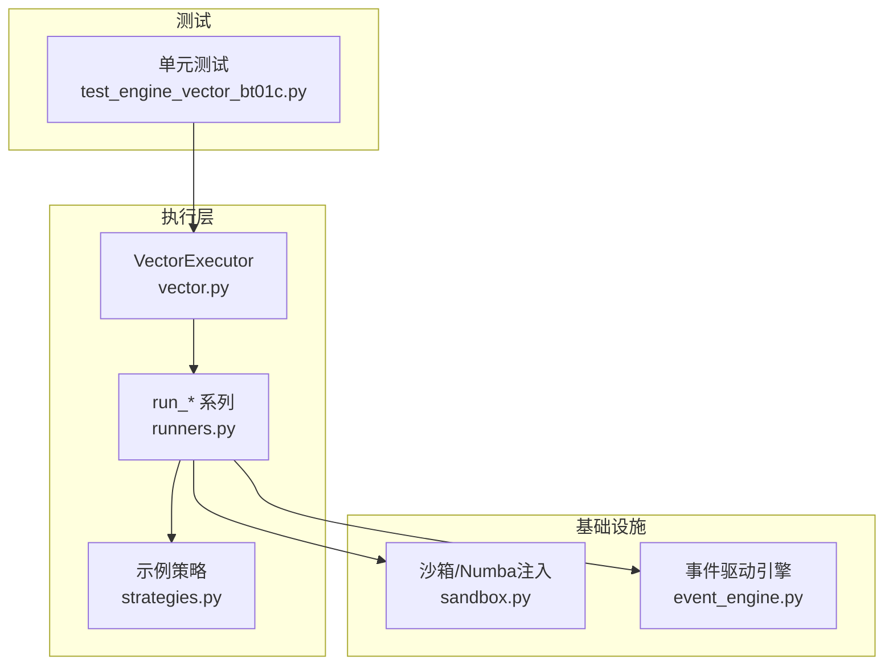
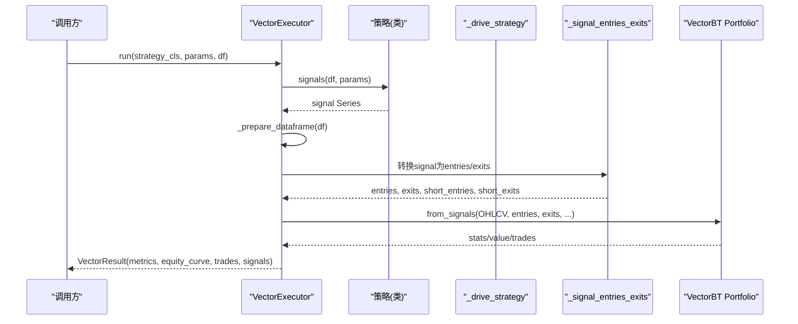
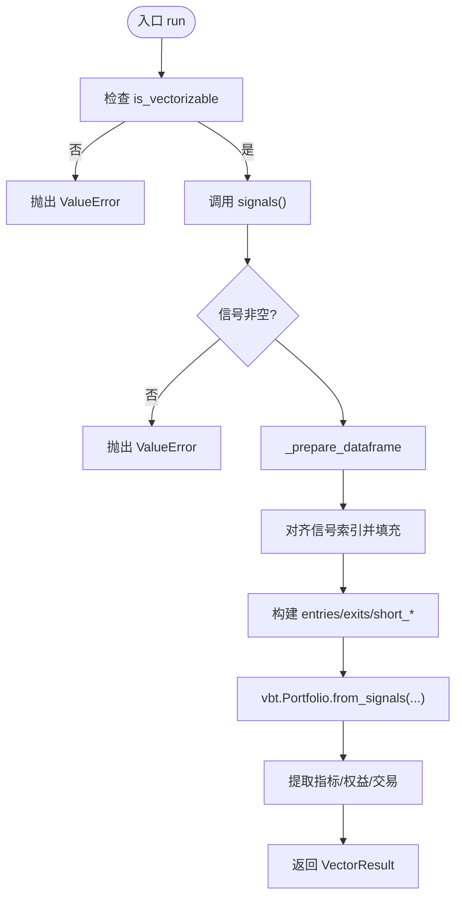
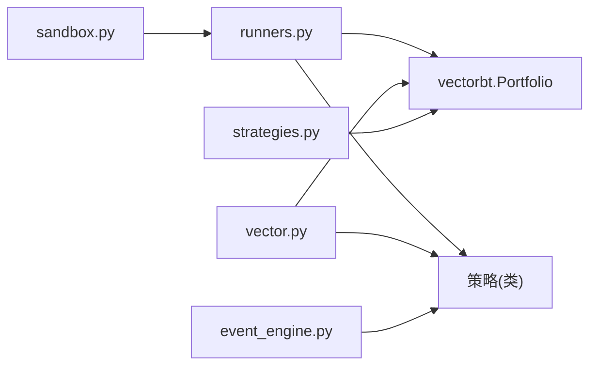

# VectorBT矢量化执行器

<cite>
**本文引用的文件**
- [backend/engine/drivers/vector.py](file://backend/engine/drivers/vector.py)
- [backend/backtest/runners.py](file://backend/backtest/runners.py)
- [backend/backtest/sandbox.py](file://backend/backtest/sandbox.py)
- [backend/backtest/strategies.py](file://backend/backtest/strategies.py)
- [backend/backtest/event_engine.py](file://backend/backtest/event_engine.py)
- [backend/tests/test_engine_vector_bt01c.py](file://backend/tests/test_engine_vector_bt01c.py)
</cite>

## 目录
1. [简介](#简介)
2. [项目结构](#项目结构)
3. [核心组件](#核心组件)
4. [架构总览](#架构总览)
5. [详细组件分析](#详细组件分析)
6. [依赖关系分析](#依赖关系分析)
7. [性能考量](#性能考量)
8. [故障排查指南](#故障排查指南)
9. [结论](#结论)
10. [附录](#附录)

## 简介
本技术文档聚焦于Quant Agent中的VectorBT矢量化执行器，系统性阐述其高性能向量化回测的实现原理与工程实践。内容涵盖：
- Numba JIT编译优化在策略沙箱中的注入与使用
- 批量信号处理与Portfolio对象构建流程
- _drive_strategy函数的工作流程、信号编码机制、入场出场信号生成
- 与VectorBT库的集成方式（参数配置、冲突处理、滑动止损）
- 性能对比分析与选型建议（何时选择矢量化执行器而非事件驱动引擎）
- 常见错误处理与调试方法

## 项目结构
与VectorBT矢量化执行相关的代码主要分布在以下模块：
- 执行器与配置：backend/engine/drivers/vector.py
- 统一策略驱动与批量回测：backend/backtest/runners.py
- 安全沙箱与Numba支持：backend/backtest/sandbox.py
- 示例策略与直接调用VectorBT：backend/backtest/strategies.py
- 事件驱动引擎（用于对比）：backend/backtest/event_engine.py
- 单元测试覆盖：backend/tests/test_engine_vector_bt01c.py

图表来源
- [backend/engine/drivers/vector.py:45-133](file://backend/engine/drivers/vector.py#L45-L133)
- [backend/backtest/runners.py:99-145](file://backend/backtest/runners.py#L99-L145)
- [backend/backtest/sandbox.py:36-85](file://backend/backtest/sandbox.py#L36-L85)
- [backend/backtest/strategies.py:110-138](file://backend/backtest/strategies.py#L110-L138)
- [backend/backtest/event_engine.py:349-395](file://backend/backtest/event_engine.py#L349-L395)
- [backend/tests/test_engine_vector_bt01c.py:82-146](file://backend/tests/test_engine_vector_bt01c.py#L82-L146)

章节来源
- [backend/engine/drivers/vector.py:25-133](file://backend/engine/drivers/vector.py#L25-L133)
- [backend/backtest/runners.py:99-145](file://backend/backtest/runners.py#L99-L145)
- [backend/backtest/sandbox.py:36-85](file://backend/backtest/sandbox.py#L36-L85)
- [backend/backtest/strategies.py:110-138](file://backend/backtest/strategies.py#L110-L138)
- [backend/backtest/event_engine.py:349-395](file://backend/backtest/event_engine.py#L349-L395)
- [backend/tests/test_engine_vector_bt01c.py:82-146](file://backend/tests/test_engine_vector_bt01c.py#L82-L146)

## 核心组件
- VectorConfig / VectorResult：定义VectorBT执行器的输入配置与输出结果结构，包含初始资金、手续费、滑点、频率等参数，以及指标、权益曲线、交易明细和原始信号。
- VectorExecutor：矢量化执行主类，负责校验策略是否可矢量化、生成信号、准备数据、构建VectorBT Portfolio并提取指标与交易记录；提供无VectorBT时的简单回退实现。
- _drive_strategy：统一驱动策略，兼容两种契约（稠密信号dense与事件标记event），返回标准化res_df与encoding。
- _signal_entries_exits：根据信号编码将signal列转换为VectorBT所需的entries/exits/short_entries/short_exits布尔序列。
- 沙箱与Numba注入：_numba_jit_globals与_build_sandbox_globals为策略执行环境预置Numba装饰器，确保@njit/@jit等在exec期间正确解析。

章节来源
- [backend/engine/drivers/vector.py:25-133](file://backend/engine/drivers/vector.py#L25-L133)
- [backend/backtest/runners.py:36-85](file://backend/backtest/runners.py#L36-L85)
- [backend/backtest/runners.py:99-145](file://backend/backtest/runners.py#L99-L145)

## 架构总览
VectorBT矢量化执行器通过“策略信号 → 标准化信号 → VectorBT Portfolio”的流水线完成回测。关键路径如下：
- 策略侧：实现signals()或generate_signals()，输出signal列（dense或event编码）。
- 驱动侧：_drive_strategy统一适配两种契约，_signal_entries_exits生成VectorBT所需布尔序列。
- 执行侧：VectorBT Portfolio.from_signals接收OHLCV与信号，计算收益、回撤、胜率等指标，并导出交易明细与权益曲线。
- 沙箱侧：为策略提供安全的执行环境与Numba JIT支持，剥离cache参数避免临时源码缓存问题。

图表来源
- [backend/engine/drivers/vector.py:54-133](file://backend/engine/drivers/vector.py#L54-L133)
- [backend/backtest/runners.py:99-145](file://backend/backtest/runners.py#L99-L145)

## 详细组件分析

### VectorExecutor（矢量化执行器）
职责与流程：
- 校验策略是否支持矢量化（is_vectorizable）。
- 调用策略signals()获取信号，若None则抛出异常。
- 准备DataFrame（统一列名、去重、去除NaN）。
- 对齐信号索引并填充默认值，构造entries/exits/short_entries/short_exits。
- 构建VectorBT Portfolio，设置费用、滑点、频率与冲突处理策略。
- 提取指标（收益率、夏普、最大回撤、胜率、摩擦成本）、权益曲线与交易列表。
- 若未安装VectorBT，进入_fallback_execution进行简单模拟撮合。

关键点：
- 冲突处理：upon_long_conflict="ignore"、upon_short_conflict="ignore"，避免重复信号导致的冲突报错。
- 频率：freq="1D"，适用于日线级别回测。
- 回退逻辑：在无VectorBT时以逐行循环模拟买卖与滑点手续费，便于降级运行。

图表来源
- [backend/engine/drivers/vector.py:54-133](file://backend/engine/drivers/vector.py#L54-L133)
- [backend/engine/drivers/vector.py:135-145](file://backend/engine/drivers/vector.py#L135-L145)
- [backend/engine/drivers/vector.py:218-288](file://backend/engine/drivers/vector.py#L218-L288)

章节来源
- [backend/engine/drivers/vector.py:45-133](file://backend/engine/drivers/vector.py#L45-L133)
- [backend/engine/drivers/vector.py:135-145](file://backend/engine/drivers/vector.py#L135-L145)
- [backend/engine/drivers/vector.py:147-216](file://backend/engine/drivers/vector.py#L147-L216)
- [backend/engine/drivers/vector.py:218-288](file://backend/engine/drivers/vector.py#L218-L288)

### _drive_strategy（统一策略驱动）
功能：
- 兼容两类策略契约：
  - 稠密信号（dense）：实例具备_calculate_indicators/_generate_signals，操作self.df，输出含signal列的DataFrame。
  - 事件标记（event）：实例具备generate_signals(df)，返回含signal/position列的DataFrame，signal视为事件标记（1=买入，-1=卖出平多，0=无操作），仅做多。
- 统一输出res_df与encoding，供后续_signal_entries_exits处理。

注意：
- 若既无dense接口也无event接口，抛出ValueError提示必须实现相应方法。
- 对position列自动重命名为signal，保证下游一致性。

章节来源
- [backend/backtest/runners.py:99-129](file://backend/backtest/runners.py#L99-L129)

### _signal_entries_exits（信号转入场出场）
功能：
- 根据encoding将signal列转换为VectorBT所需的布尔序列：
  - event：entries = (signal == 1), exits = (signal == -1), short_*均为False。
  - dense：entries = (signal == 1), exits = (signal == 0), short_entries = (signal == -1), short_exits = (signal == 0)。

章节来源
- [backend/backtest/runners.py:132-145](file://backend/backtest/runners.py#L132-L145)

### 网格搜索与蒙特卡洛（基于VectorBT）
- run_grid_search_backtest：遍历参数组合，执行策略→生成信号→计算ATR滑点止损→构建Portfolio→统计指标，按目标指标排序Top N。
- run_monte_carlo_stress_test：对历史价格注入噪声（高斯/拉普拉斯/t分布），重复运行策略与VectorBT回测，评估鲁棒性。
- run_batch_sandbox_backtest：多标的横截面批量回测，聚合各标的信号与止损，使用group_by=True构建组合级Portfolio。

这些函数均复用_drive_strategy与_signal_entries_exits，统一信号处理与Portfolio构建。

章节来源
- [backend/backtest/runners.py:148-279](file://backend/backtest/runners.py#L148-L279)
- [backend/backtest/runners.py:282-435](file://backend/backtest/runners.py#L282-L435)
- [backend/backtest/runners.py:438-569](file://backend/backtest/runners.py#L438-L569)

### 示例策略（直接调用VectorBT）
- strategies.py中示例策略演示了如何计算技术指标、生成signal列，并通过vbt.Portfolio.from_signals执行回测，同时设置sl_trail（ATR倍数）与冲突处理。
- 该示例可作为自定义策略接入VectorBT的参考模板。

章节来源
- [backend/backtest/strategies.py:100-138](file://backend/backtest/strategies.py#L100-L138)
- [backend/backtest/strategies.py:150-204](file://backend/backtest/strategies.py#L150-L204)

### 事件驱动引擎（对比参考）
- event_engine.py展示了事件驱动的回测流程，包括订单匹配、止损设置、进度推送等。
- 与VectorBT路径相比，事件驱动更贴近真实撮合细节，但速度较慢；VectorBT路径适合快速迭代与大规模参数扫描。

章节来源
- [backend/backtest/event_engine.py:349-395](file://backend/backtest/event_engine.py#L349-L395)

## 依赖关系分析
- VectorExecutor依赖Strategy基类与pandas DataFrame；可选依赖vectorbt，若无则回退到简单模拟。
- runners.py依赖sandbox.py提供的安全执行环境与Numba注入；依赖vectorbt进行Portfolio构建。
- strategies.py直接依赖vectorbt进行回测。
- event_engine.py作为事件驱动引擎，与VectorBT路径形成互补。

图表来源
- [backend/backtest/sandbox.py:36-85](file://backend/backtest/sandbox.py#L36-L85)
- [backend/backtest/runners.py:14-23](file://backend/backtest/runners.py#L14-L23)
- [backend/engine/drivers/vector.py:18-22](file://backend/engine/drivers/vector.py#L18-L22)
- [backend/backtest/strategies.py:120-138](file://backend/backtest/strategies.py#L120-L138)
- [backend/backtest/event_engine.py:349-395](file://backend/backtest/event_engine.py#L349-L395)

章节来源
- [backend/backtest/sandbox.py:36-85](file://backend/backtest/sandbox.py#L36-L85)
- [backend/backtest/runners.py:14-23](file://backend/backtest/runners.py#L14-L23)
- [backend/engine/drivers/vector.py:18-22](file://backend/engine/drivers/vector.py#L18-L22)
- [backend/backtest/strategies.py:120-138](file://backend/backtest/strategies.py#L120-L138)
- [backend/backtest/event_engine.py:349-395](file://backend/backtest/event_engine.py#L349-L395)

## 性能考量
- Numba JIT优化：
  - sandbox.py通过_numba_jit_globals预置numba装饰器（njit/jit/vectorize/guvectorize/cfunc/stencil），使策略可在安全沙箱中使用Numba加速。
  - strip_numba_cache_source移除cache参数，避免临时源码无法定位缓存的问题。
- 批量信号处理：
  - _signal_entries_exits将signal列高效转换为布尔序列，减少Python层循环开销。
  - 网格搜索与蒙特卡洛利用向量化Portfolio构建，显著降低单次回测时间。
- 冲突处理：
  - upon_long_conflict="ignore"与upon_short_conflict="ignore"避免重复信号导致的中断，提升稳定性。
- 滑动止损：
  - sl_trail_pct由ATR与倍数计算，传入Portfolio.from_signals，实现动态追踪止损。
- 何时选择矢量化执行器：
  - 需要快速参数扫描、蒙特卡洛压力测试、多标的批量回测时，优先选择VectorBT路径。
  - 当策略逻辑复杂、需精细撮合（如限价单、部分成交、延迟、盘口深度）时，选择事件驱动引擎。

[本节为通用性能讨论，不直接分析具体文件]

## 故障排查指南
常见问题与处理方法：
- 策略不支持矢量化：
  - 现象：抛出ValueError提示不支持矢量化。
  - 处理：确保策略实现signals()或generate_signals()，并在VectorExecutor中通过is_vectorizable检查。
- 信号为空：
  - 现象：signals()返回None。
  - 处理：检查策略信号生成逻辑，确保返回非空Series。
- 数据长度不足：
  - 现象：清洗后有效数据少于阈值（如10根K线）。
  - 处理：增加历史数据长度或调整预处理逻辑。
- 未安装VectorBT：
  - 现象：ImportError，进入fallback执行。
  - 处理：安装vectorbt以获得完整功能；或接受降级回退执行。
- Numba缓存问题：
  - 现象：RuntimeError提示无法缓存临时源码。
  - 处理：使用strip_numba_cache_source移除cache参数，避免临时源码缓存失败。
- 冲突报错：
  - 现象：重复信号导致冲突。
  - 处理：设置upon_long_conflict="ignore"与upon_short_conflict="ignore"。

章节来源
- [backend/engine/drivers/vector.py:73-80](file://backend/engine/drivers/vector.py#L73-L80)
- [backend/backtest/runners.py:199-200](file://backend/backtest/runners.py#L199-L200)
- [backend/backtest/runners.py:210-226](file://backend/backtest/runners.py#L210-L226)
- [backend/backtest/sandbox.py:77-105](file://backend/backtest/sandbox.py#L77-L105)
- [backend/backtest/runners.py:223-225](file://backend/backtest/runners.py#L223-L225)

## 结论
VectorBT矢量化执行器通过统一的信号驱动与高效的Portfolio构建，实现了高性能回测与参数扫描能力。结合Numba JIT与沙箱安全机制，既保证了执行效率，又确保了策略执行的隔离性与可控性。对于大规模回测与快速迭代场景，推荐优先采用VectorBT路径；对于需要精细撮合与复杂订单逻辑的场景，则应选用事件驱动引擎。

[本节为总结性内容，不直接分析具体文件]

## 附录
- 关键函数路径参考：
  - VectorExecutor.run：[backend/engine/drivers/vector.py:54-133](file://backend/engine/drivers/vector.py#L54-L133)
  - _drive_strategy：[backend/backtest/runners.py:99-129](file://backend/backtest/runners.py#L99-L129)
  - _signal_entries_exits：[backend/backtest/runners.py:132-145](file://backend/backtest/runners.py#L132-L145)
  - 网格搜索：[backend/backtest/runners.py:148-279](file://backend/backtest/runners.py#L148-L279)
  - 蒙特卡洛：[backend/backtest/runners.py:282-435](file://backend/backtest/runners.py#L282-L435)
  - 批量回测：[backend/backtest/runners.py:438-569](file://backend/backtest/runners.py#L438-L569)
  - 示例策略：[backend/backtest/strategies.py:100-138](file://backend/backtest/strategies.py#L100-L138)
  - 事件驱动引擎：[backend/backtest/event_engine.py:349-395](file://backend/backtest/event_engine.py#L349-L395)
  - 单元测试：[backend/tests/test_engine_vector_bt01c.py:82-146](file://backend/tests/test_engine_vector_bt01c.py#L82-L146)