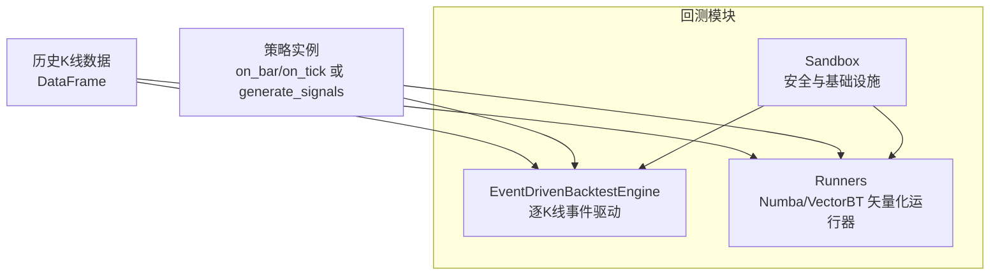
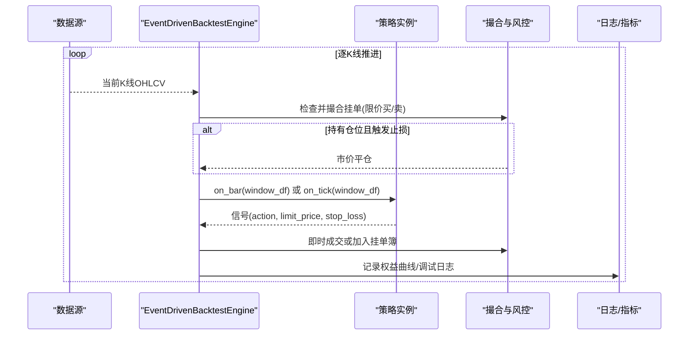
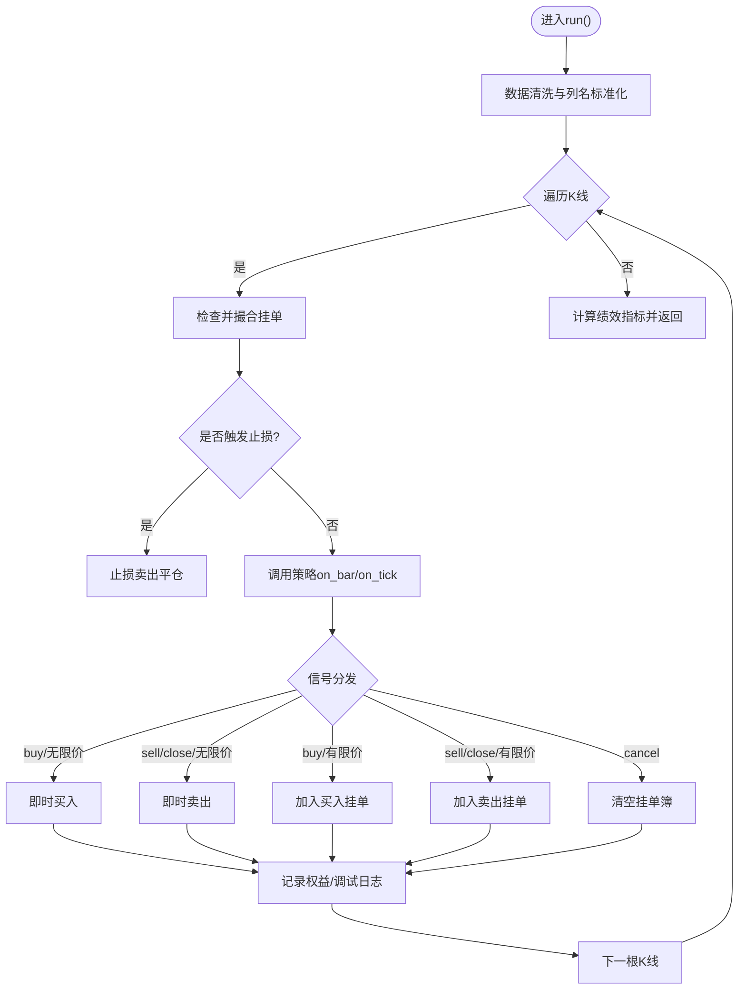
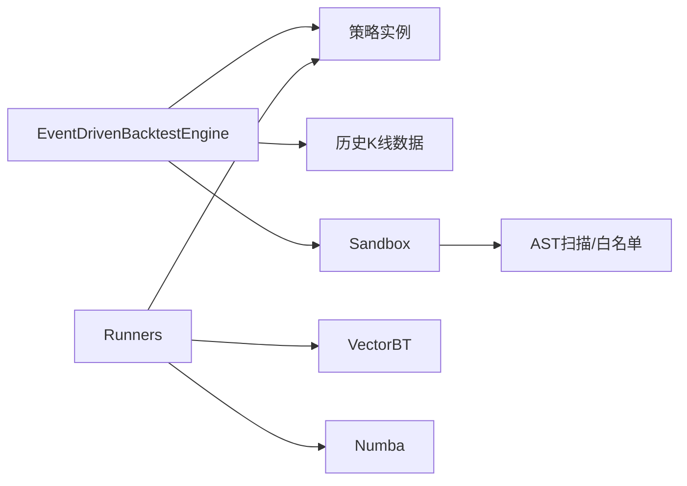

# 事件驱动引擎

<cite>
**本文引用的文件**
- [event_engine.py](file://backend/backtest/event_engine.py)
- [runners.py](file://backend/backtest/runners.py)
- [sandbox.py](file://backend/backtest/sandbox.py)
- [_template_dense.py](file://strategies/drafts/_template_dense.py)
</cite>

## 目录
1. [简介](#简介)
2. [项目结构](#项目结构)
3. [核心组件](#核心组件)
4. [架构总览](#架构总览)
5. [详细组件分析](#详细组件分析)
6. [依赖关系分析](#依赖关系分析)
7. [性能考量](#性能考量)
8. [故障排查指南](#故障排查指南)
9. [结论](#结论)
10. [附录](#附录)

## 简介
本技术文档聚焦于 Quant Agent 的事件驱动回测引擎，围绕 EventDrivenBacktestEngine 的核心架构展开，系统阐述逐 K 线推进机制、订单撮合逻辑、止损风控与挂单簿管理；详解买入/卖出执行流程、滑点与手续费计算、仓位管理与权益曲线生成；解释 on_bar/on_tick 信号处理机制、限价单触发条件与动态止损实现；并提供策略开发示例与调试模式使用方法，以及性能优化建议。

## 项目结构
与事件驱动回测引擎直接相关的代码位于 backend/backtest 目录：
- event_engine.py：高保真事件驱动回测引擎（逐 K 线推进、撮合、止损、挂单簿、权益曲线）
- runners.py：Numba/VectorBT 矢量化运行器（网格搜索、蒙特卡洛压力测试、批量回测），提供与事件驱动引擎的兼容路径
- sandbox.py：沙箱安全与基础设施（AST 扫描、白名单导入、超时/内存熔断、策略基类桩）
- strategies/drafts/_template_dense.py：稠密类方法契约的策略模板（供参考如何产出 signal）

图表来源
- [event_engine.py:37-271](file://backend/backtest/event_engine.py#L37-L271)
- [runners.py:99-145](file://backend/backtest/runners.py#L99-L145)
- [sandbox.py:326-432](file://backend/backtest/sandbox.py#L326-L432)

章节来源
- [event_engine.py:37-271](file://backend/backtest/event_engine.py#L37-L271)
- [runners.py:99-145](file://backend/backtest/runners.py#L99-L145)
- [sandbox.py:326-432](file://backend/backtest/sandbox.py#L326-L432)

## 核心组件
- EventDrivenBacktestEngine：高保真事件驱动回测引擎，逐根 K 线推进，维护现金、持仓、挂单簿、交易记录与权益曲线，支持限价单、动态止损、滑点与手续费磨损统计。
- Runners：提供 Numba/VectorBT 矢量化回测能力，包括统一策略驱动、信号编码转换、网格搜索、蒙特卡洛压力测试与多标的批量回测。
- Sandbox：对动态策略源码进行 AST 级安全扫描、危险模块拦截、文件访问隔离、超时与内存熔断保护，并提供 BaseStrategySandbox 基类桩。

章节来源
- [event_engine.py:37-271](file://backend/backtest/event_engine.py#L37-L271)
- [runners.py:99-145](file://backend/backtest/runners.py#L99-L145)
- [sandbox.py:326-432](file://backend/backtest/sandbox.py#L326-L432)

## 架构总览
事件驱动回测引擎在每根 K 线上按固定顺序执行：检查并撮合历史挂单 → 动态止损与风控拦截 → 调用策略 on_bar/on_tick 产生信号 → 根据信号执行即时成交或挂限价单 → 记录调试日志与权益曲线。

图表来源
- [event_engine.py:129-271](file://backend/backtest/event_engine.py#L129-L271)

章节来源
- [event_engine.py:129-271](file://backend/backtest/event_engine.py#L129-L271)

## 详细组件分析

### EventDrivenBacktestEngine：逐K线推进与撮合
- 初始化参数：初始资金、手续费比例、滑点比例、调试模式、进度队列等；内部维护现金、持仓、权益曲线、交易记录、挂单簿与调试日志。
- 数据预处理：标准化列名（兼容大小写）、去重、校验数据长度。
- 逐K线循环：
  - 挂单撮合：若为买单且空仓，当最低价触及限价则买入；若为卖单且持有多头，当最高价触及限价则卖出。
  - 动态止损：若存在止损位且最低价跌破止损，立即卖出平仓，并清理相关卖单。
  - 信号处理：优先尝试 on_bar，否则 on_tick；信号字典包含 action、limit_price、stop_loss 等字段。
  - 订单分发：
    - cancel：清空挂单簿
    - buy：有空仓时，若有限价则入挂单簿，否则以当前价即时买入
    - sell/close：有持仓时，若有限价则入挂单簿，否则以当前价即时卖出并清空挂单簿
  - 权益与调试：计算权益、基准收益、累计摩擦成本；调试模式下输出逐K线状态。
- 绩效汇总：计算总收益、夏普比率、最大回撤、胜率、摩擦成本等。

图表来源
- [event_engine.py:129-271](file://backend/backtest/event_engine.py#L129-L271)

章节来源
- [event_engine.py:129-271](file://backend/backtest/event_engine.py#L129-L271)

### 订单撮合与风控细节
- 买入执行：成交价 = 基准价 × (1 + 滑点)，使用可用资金的 95% 作为成交额估算手数，扣除手续费后计算实际成交股数；更新现金、持仓、摩擦成本；同步策略仓位信息。
- 卖出执行：成交价 = 基准价 × (1 - 滑点)，收入扣除手续费；基于最近一次买入价计算盈亏；更新现金、持仓、摩擦成本；清空策略仓位信息。
- 止损风控：若策略设置止损位且当前最低价跌破止损，则以止损附近价格卖出平仓，并移除相关卖单。
- 限价单触发：
  - 买单：当最低价 ≤ 限价时触发买入
  - 卖单：当最高价 ≥ 限价时触发卖出

章节来源
- [event_engine.py:68-128](file://backend/backtest/event_engine.py#L68-L128)
- [event_engine.py:161-182](file://backend/backtest/event_engine.py#L161-L182)
- [event_engine.py:190-215](file://backend/backtest/event_engine.py#L190-L215)

### 信号处理机制：on_bar 与 on_tick
- 优先调用 on_bar(window_df)，如不存在则回退到 on_tick(window_df)。
- 信号格式为字典，关键字段：
  - action：buy / sell / close / cancel
  - limit_price：可选，用于挂限价单
  - stop_loss：可选，用于动态止损

章节来源
- [event_engine.py:183-215](file://backend/backtest/event_engine.py#L183-L215)

### 仓位管理与权益曲线
- 仓位管理：通过 _position_size 与 _position_data 暴露给策略，记录入场价、止损位等信息；买卖时自动更新。
- 权益曲线：每根 K 线记录 equity、benchmark、price；基准收益以初始资金乘以价格相对变化计算。
- 绩效指标：总收益、夏普比率、最大回撤、胜率、摩擦成本。

章节来源
- [event_engine.py:68-128](file://backend/backtest/event_engine.py#L68-L128)
- [event_engine.py:217-271](file://backend/backtest/event_engine.py#L217-L271)

### Runners：矢量化运行器与兼容性
- 统一驱动策略：
  - 类方法契约：具备 _calculate_indicators 与 _generate_signals，输出稠密 signal（1=持有多，0=空仓，-1=持有空）
  - 模块级函数契约：generate_signals(df) 返回含 signal/position 列的 DataFrame，视为事件标记（1=买入，-1=卖出平多，0=无操作）
- 信号编码转换：根据 encoding 生成 VectorBT 所需的 entries/exits/short_entries/short_exits
- 网格搜索：遍历参数组合，快速评估 Top N 结果
- 蒙特卡洛压力测试：向价格注入噪声，重复回测评估鲁棒性
- 批量回测：多标的横截面并行回测，合并投资组合绩效

章节来源
- [runners.py:99-145](file://backend/backtest/runners.py#L99-L145)
- [runners.py:148-279](file://backend/backtest/runners.py#L148-L279)
- [runners.py:282-435](file://backend/backtest/runners.py#L282-L435)
- [runners.py:438-569](file://backend/backtest/runners.py#L438-L569)

### Sandbox：安全与基础设施
- AST 级安全扫描：禁止高危内建与魔术属性、限制装饰器白名单、禁止 while 循环与递归、限制 range 使用范围
- 白名单导入：仅允许 numpy/pandas/math/datetime/collections/itertools/scipy/statsmodels/sklearn/lightgbm/xgboost/typing/numba 等
- 文件访问隔离：限定工作目录，防止目录穿越
- 超时与内存熔断：基于 sys.settrace 的执行追踪，限制执行时间与内存增量
- 策略基类桩：BaseStrategySandbox 提供 _position_size/_position_data 等接口

章节来源
- [sandbox.py:147-340](file://backend/backtest/sandbox.py#L147-L340)
- [sandbox.py:352-432](file://backend/backtest/sandbox.py#L352-L432)

## 依赖关系分析
- EventDrivenBacktestEngine 依赖：
  - 策略实例：on_bar/on_tick 或 generate_signals
  - 历史K线数据：DataFrame
  - 沙箱安全：在动态策略场景下通过 run_dynamic_sandbox_backtest 调用
- Runners 依赖：
  - 策略实例：两种契约之一
  - VectorBT：矢量化撮合与绩效统计
  - Numba：加速指标计算与信号生成
- Sandbox 依赖：
  - AST 解析与安全规则
  - 可选 psutil：内存监控

图表来源
- [event_engine.py:37-271](file://backend/backtest/event_engine.py#L37-L271)
- [runners.py:99-145](file://backend/backtest/runners.py#L99-L145)
- [sandbox.py:326-432](file://backend/backtest/sandbox.py#L326-L432)

章节来源
- [event_engine.py:37-271](file://backend/backtest/event_engine.py#L37-L271)
- [runners.py:99-145](file://backend/backtest/runners.py#L99-L145)
- [sandbox.py:326-432](file://backend/backtest/sandbox.py#L326-L432)

## 性能考量
- 矢量化优先：Runners 通过 Numba/VectorBT 实现高性能回测，适合大规模参数寻优与批量回测
- 事件驱动降级：当策略不兼容矢量化契约或开启 debug_mode 时，自动降级至高保真事件驱动引擎，便于逐K线调试
- 资源保护：Sandbox 通过 AST 扫描与运行时追踪，防止死循环、递归与 OOM，保障系统稳定性
- 建议：
  - 尽量采用矢量化指标与信号生成，避免行级循环
  - 合理设置滑点与手续费，贴近真实交易成本
  - 使用 ATR 动态止损提升风控效率
  - 在调试阶段启用 debug_mode 获取逐K线日志，定位问题

[本节为通用指导，无需具体文件引用]

## 故障排查指南
- 数据不足：若数据长度少于阈值（例如 10 根 K 线），将抛出异常提示；请检查数据清洗与 NaN 处理
- 策略未实现必要方法：需实现 _calculate_indicators/_generate_signals 或 generate_signals，否则会报错
- 安全拦截：若使用被禁用的模块、装饰器或危险函数，将被 AST 扫描拦截；请遵循白名单与约束
- 超时/内存熔断：若策略执行过慢或内存增长过大，将被强制中断；请优化算法与数据结构
- 调试模式：开启 debug_mode 可输出逐K线日志，便于观察信号、挂单、成交与权益变化

章节来源
- [event_engine.py:139-140](file://backend/backtest/event_engine.py#L139-L140)
- [runners.py:119-123](file://backend/backtest/runners.py#L119-L123)
- [sandbox.py:326-340](file://backend/backtest/sandbox.py#L326-L340)
- [sandbox.py:352-415](file://backend/backtest/sandbox.py#L352-L415)

## 结论
EventDrivenBacktestEngine 提供了高保真的事件驱动回测能力，支持逐 K 线推进、限价单、动态止损与真实滑点/手续费模拟；配合 Runners 的矢量化引擎与 Sandbox 的安全防护，既满足高精度回测需求，又兼顾性能与安全性。开发者可通过 on_bar/on_tick 或 generate_signals 灵活实现交易信号，并结合 ATR 止损与挂单簿管理构建稳健的交易策略。

[本节为总结，无需具体文件引用]

## 附录

### 策略开发示例（基于稠密类方法契约）
- 继承 BaseStrategy（由沙箱注入），在 __init__ 中声明可调参数
- 在 _calculate_indicators 中计算指标（写入 self.*）
- 在 _generate_signals 中产出稠密 signal 列（1=持有多，0=空仓，-1=持有空）
- 注意：列名使用小写（close/high/low/open/volume），避免 for 循环遍历 DataFrame

章节来源
- [_template_dense.py:1-30](file://strategies/drafts/_template_dense.py#L1-L30)
- [_template_dense.py:35-83](file://strategies/drafts/_template_dense.py#L35-L83)

### 调试模式使用方法
- 在 run_dynamic_sandbox_backtest 中设置 debug_mode=True，将强制使用高保真事件驱动引擎，输出逐K线日志
- 日志包含日期、价格、持仓、现金、权益、信号、挂单数量等关键信息

章节来源
- [event_engine.py:327-334](file://backend/backtest/event_engine.py#L327-L334)
- [event_engine.py:217-223](file://backend/backtest/event_engine.py#L217-L223)

### 性能优化技巧
- 优先使用矢量化策略（generate_signals 或类方法契约），利用 Numba/VectorBT 加速
- 避免 in-place 修改导致 SettingWithCopy 警告，必要时显式 copy
- 合理设置滑点与手续费，避免过度乐观的回测结果
- 使用 ATR 动态止损，提升风控响应速度
- 在网格搜索与蒙特卡洛测试中，控制迭代次数与噪声水平，平衡精度与耗时

章节来源
- [runners.py:99-145](file://backend/backtest/runners.py#L99-L145)
- [runners.py:148-279](file://backend/backtest/runners.py#L148-L279)
- [runners.py:282-435](file://backend/backtest/runners.py#L282-L435)