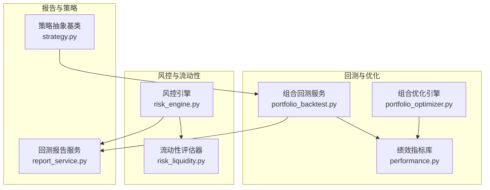
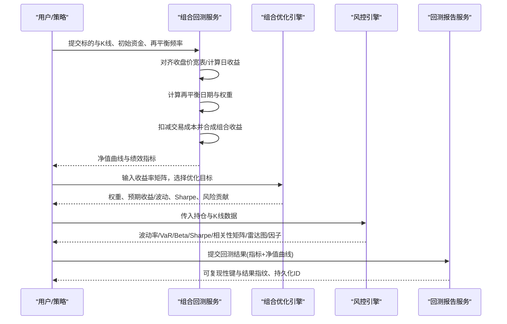
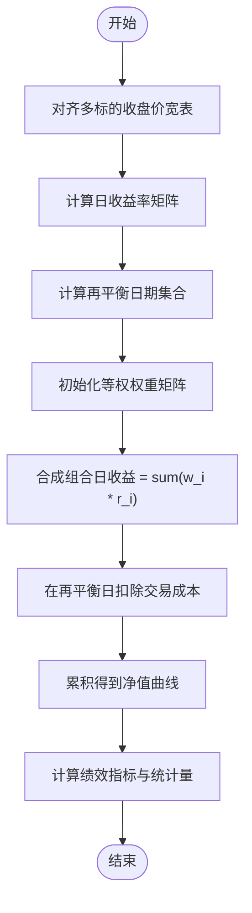
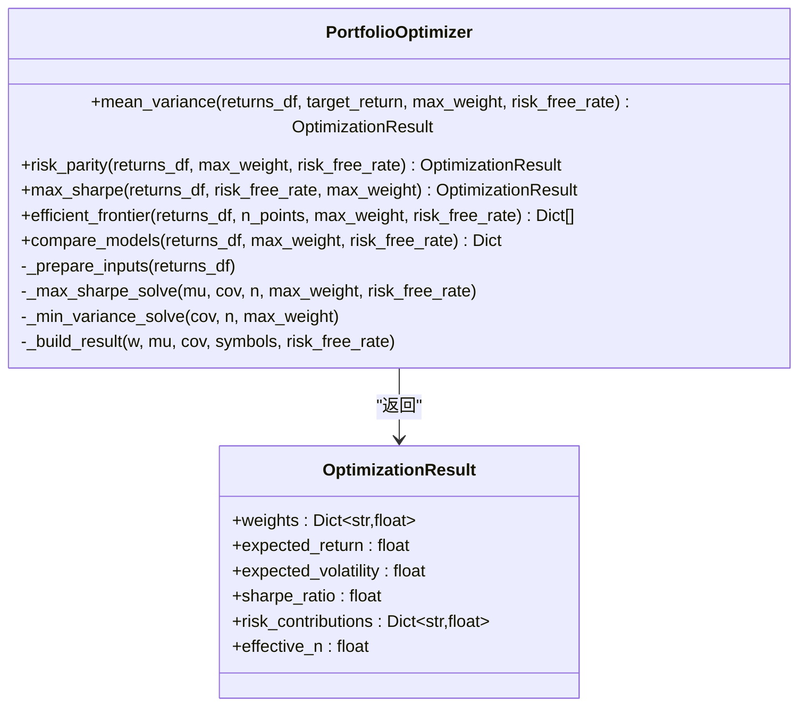
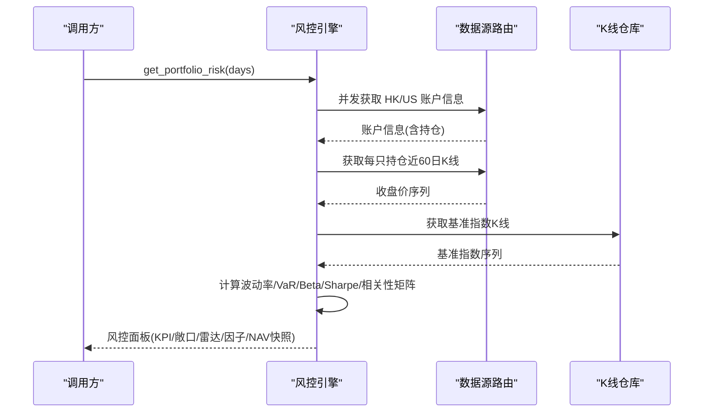
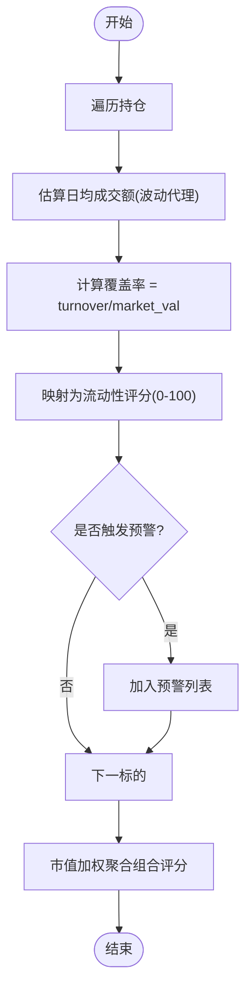
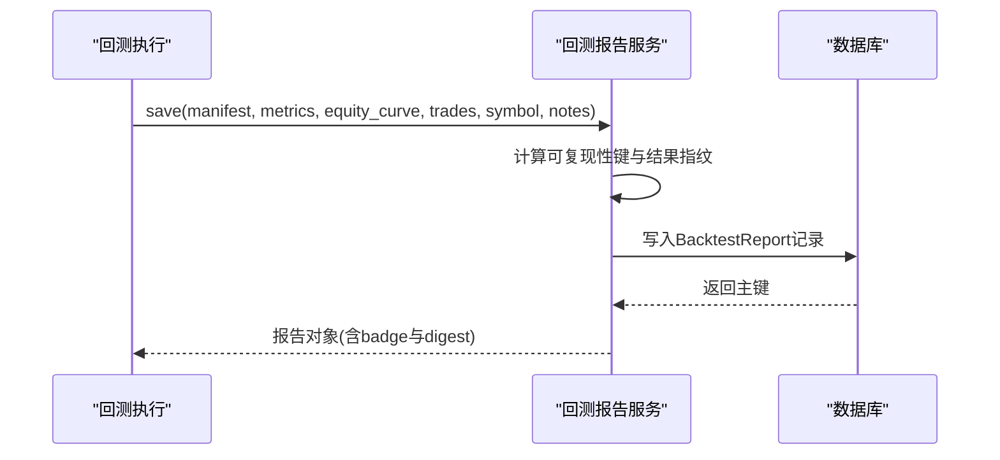
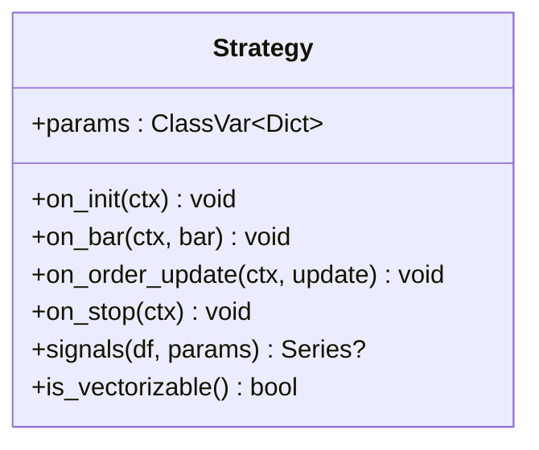
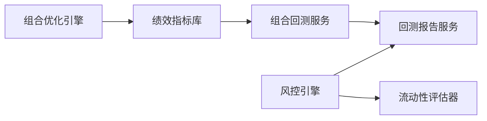

# 多资产回测框架

<cite>
**本文引用的文件**
- [portfolio_backtest.py](file://backend/app/backtest/portfolio_backtest.py)
- [performance.py](file://backend/domain/performance.py)
- [portfolio_optimizer.py](file://backend/domain/portfolio_optimizer.py)
- [risk_engine.py](file://backend/services/risk/risk_engine.py)
- [risk_liquidity.py](file://backend/services/risk/risk_liquidity.py)
- [report_service.py](file://backend/app/backtest/report_service.py)
- [strategy.py](file://backend/engine/strategy.py)
</cite>

## 目录
1. [简介](#简介)
2. [项目结构](#项目结构)
3. [核心组件](#核心组件)
4. [架构总览](#架构总览)
5. [详细组件分析](#详细组件分析)
6. [依赖关系分析](#依赖关系分析)
7. [性能考量](#性能考量)
8. [故障排查指南](#故障排查指南)
9. [结论](#结论)
10. [附录](#附录)

## 简介
本技术文档面向 Quant Agent 的多资产回测框架，聚焦投资组合级别的回测实现与优化能力。内容涵盖：
- 资产配置、权重分配与再平衡策略（买入持有、周度/月度再平衡）
- 多标的同时回测、相关性分析与分散化效果评估
- 组合优化算法：均值方差优化、风险平价、最大 Sharpe 比率、有效前沿
- 多资产策略开发示例与复杂组合管理
- 组合风险评估、流动性约束与交易成本建模
- 可复现的回测报告与持久化

## 项目结构
围绕多资产回测的关键模块分布如下：
- 组合回测服务：负责等权组合回测、净值曲线计算、绩效指标输出
- 组合优化引擎：提供均值方差、风险平价、最大 Sharpe、有效前沿与模型对比
- 风控引擎：基于真实持仓与 K 线计算波动率、VaR、Beta、Sharpe、相关性矩阵、雷达图与因子监控
- 流动性评估：基于成交额代理或波动率代理的流动性评分与预警
- 回测报告服务：结果指纹与可复现性键生成、报告持久化
- 策略抽象基类：统一事件驱动与矢量化快路径接口

**图表来源**
- [portfolio_backtest.py:103-227](file://backend/app/backtest/portfolio_backtest.py#L103-L227)
- [portfolio_optimizer.py:42-202](file://backend/domain/portfolio_optimizer.py#L42-L202)
- [performance.py:14-85](file://backend/domain/performance.py#L14-L85)
- [risk_engine.py:22-135](file://backend/services/risk/risk_engine.py#L22-L135)
- [risk_liquidity.py:12-102](file://backend/services/risk/risk_liquidity.py#L12-L102)
- [report_service.py:58-129](file://backend/app/backtest/report_service.py#L58-L129)
- [strategy.py:24-89](file://backend/engine/strategy.py#L24-L89)

**章节来源**
- [portfolio_backtest.py:103-227](file://backend/app/backtest/portfolio_backtest.py#L103-L227)
- [portfolio_optimizer.py:42-202](file://backend/domain/portfolio_optimizer.py#L42-L202)
- [performance.py:14-85](file://backend/domain/performance.py#L14-L85)
- [risk_engine.py:22-135](file://backend/services/risk/risk_engine.py#L22-L135)
- [risk_liquidity.py:12-102](file://backend/services/risk/risk_liquidity.py#L12-L102)
- [report_service.py:58-129](file://backend/app/backtest/report_service.py#L58-L129)
- [strategy.py:24-89](file://backend/engine/strategy.py#L24-L89)

## 核心组件
- 组合回测服务：对齐多标的收盘价、计算日收益、按频率再平衡、扣除交易成本、产出净值曲线与绩效指标
- 组合优化引擎：Markowitz 均值方差、风险平价、最大 Sharpe、有效前沿、模型对比；输出权重、预期收益/波动、Sharpe、风险贡献、有效持仓数
- 风控引擎：分账户独立计算 KPI、敞口、波动率、VaR、Beta、Sharpe、相关性矩阵、雷达图与因子监控；支持 NAV 快照与缓存
- 流动性评估器：日均成交额估算、覆盖率、评分与大额持仓预警
- 回测报告服务：可复现性键与结果指纹、报告持久化与查询
- 策略抽象基类：on_init/on_bar/on_order_update/on_stop 生命周期，支持矢量化快路径 signals

**章节来源**
- [portfolio_backtest.py:103-227](file://backend/app/backtest/portfolio_backtest.py#L103-L227)
- [portfolio_optimizer.py:42-202](file://backend/domain/portfolio_optimizer.py#L42-L202)
- [risk_engine.py:22-135](file://backend/services/risk/risk_engine.py#L22-L135)
- [risk_liquidity.py:12-102](file://backend/services/risk/risk_liquidity.py#L12-L102)
- [report_service.py:58-129](file://backend/app/backtest/report_service.py#L58-L129)
- [strategy.py:24-89](file://backend/engine/strategy.py#L24-L89)

## 架构总览
下图展示从数据到回测、优化、风控与报告的端到端流程。

**图表来源**
- [portfolio_backtest.py:103-227](file://backend/app/backtest/portfolio_backtest.py#L103-L227)
- [portfolio_optimizer.py:42-202](file://backend/domain/portfolio_optimizer.py#L42-L202)
- [risk_engine.py:22-135](file://backend/services/risk/risk_engine.py#L22-L135)
- [report_service.py:58-129](file://backend/app/backtest/report_service.py#L58-L129)

## 详细组件分析

### 组合回测服务（等权组合、再平衡与成本）
- 多标的对齐：将各标的 K 线按日期对齐为收盘价宽表，仅保留共同交易日
- 日收益矩阵：对收盘价宽表计算日收益率，填充缺失值
- 再平衡策略：支持“买入持有”“周度”“月度”三种频率，自动识别再平衡日
- 权重与收益：等权分配权重，组合日收益为加权求和；在再平衡日按换手率近似扣除手续费
- 绩效指标：累计收益、年化收益、夏普、最大回撤、波动率、胜率、卡玛比率、最长回撤期、月度收益热力图、单标的表现

**图表来源**
- [portfolio_backtest.py:26-65](file://backend/app/backtest/portfolio_backtest.py#L26-L65)
- [portfolio_backtest.py:68-100](file://backend/app/backtest/portfolio_backtest.py#L68-L100)
- [portfolio_backtest.py:103-227](file://backend/app/backtest/portfolio_backtest.py#L103-L227)

**章节来源**
- [portfolio_backtest.py:26-65](file://backend/app/backtest/portfolio_backtest.py#L26-L65)
- [portfolio_backtest.py:68-100](file://backend/app/backtest/portfolio_backtest.py#L68-L100)
- [portfolio_backtest.py:103-227](file://backend/app/backtest/portfolio_backtest.py#L103-L227)

### 组合优化引擎（均值方差、风险平价、最大 Sharpe、有效前沿）
- 输入准备：从收益率 DataFrame 提取年化期望收益向量与协方差矩阵
- 均值方差优化：最小化组合方差，满足目标收益、权重和=1、非负与单只上限约束
- 风险平价：使各标的风险贡献相等，求解非线性目标函数
- 最大 Sharpe：最大化 (w'μ - rf)/√(w'Σw)，SLSQP 求解
- 有效前沿：从最小方差组合到最大收益组合生成 N 个点，热启动加速收敛
- 模型对比：等权 vs Markowitz vs 风险平价 vs MaxSharpe，选出最优模型
- 输出：权重、预期收益/波动、Sharpe、风险贡献、有效持仓数

**图表来源**
- [portfolio_optimizer.py:27-37](file://backend/domain/portfolio_optimizer.py#L27-L37)
- [portfolio_optimizer.py:42-202](file://backend/domain/portfolio_optimizer.py#L42-L202)
- [portfolio_optimizer.py:256-350](file://backend/domain/portfolio_optimizer.py#L256-L350)

**章节来源**
- [portfolio_optimizer.py:42-202](file://backend/domain/portfolio_optimizer.py#L42-L202)
- [portfolio_optimizer.py:256-350](file://backend/domain/portfolio_optimizer.py#L256-L350)

### 风控引擎（波动率、VaR、Beta、Sharpe、相关性矩阵、雷达图、因子）
- 分账户独立计算：HK/US 账户分别获取账户信息、持仓与市场价值
- 指标计算：
  - 波动率：基于最近 60 日对数收益率的标准差年化
  - VaR(95%)：历史模拟法，取 5 分位
  - Beta：与基准指数 (^HSI/^GSPC) OLS 回归估计
  - Sharpe：年化收益减去无风险利率后除以波动率
- 相关性矩阵：基于 60 日收益率计算相关系数矩阵，并提示高相关性对
- 雷达图：Beta、Vol、流动性、相关性、动量、最大回撤六维评分
- 因子监控：VaR 双口径（百分比与金额）、Beta、Sharpe、最大回撤状态判断
- 缓存与快照：Redis 缓存 30s TTL；NAV 快照可从 Redis 或数据库读取

**图表来源**
- [risk_engine.py:32-135](file://backend/services/risk/risk_engine.py#L32-L135)
- [risk_engine.py:195-283](file://backend/services/risk/risk_engine.py#L195-L283)
- [risk_engine.py:348-374](file://backend/services/risk/risk_engine.py#L348-L374)
- [risk_engine.py:376-481](file://backend/services/risk/risk_engine.py#L376-L481)

**章节来源**
- [risk_engine.py:32-135](file://backend/services/risk/risk_engine.py#L32-L135)
- [risk_engine.py:195-283](file://backend/services/risk/risk_engine.py#L195-L283)
- [risk_engine.py:348-374](file://backend/services/risk/risk_engine.py#L348-L374)
- [risk_engine.py:376-481](file://backend/services/risk/risk_engine.py#L376-L481)

### 流动性评估器（成交额代理与预警）
- 日均成交额估算：当无成交量时，使用价格波动幅度与最新价乘以规模因子作为代理
- 流动性覆盖率：日均成交额 / 市值；覆盖率越高流动性越好
- 评分与预警：按覆盖率映射 0-100 分；对占 NAV >10% 的大额持仓与低流动性标的发出警告
- 组合整体评分：按市值加权平均

**图表来源**
- [risk_liquidity.py:15-102](file://backend/services/risk/risk_liquidity.py#L15-L102)
- [risk_liquidity.py:104-126](file://backend/services/risk/risk_liquidity.py#L104-L126)

**章节来源**
- [risk_liquidity.py:15-102](file://backend/services/risk/risk_liquidity.py#L15-L102)
- [risk_liquidity.py:104-126](file://backend/services/risk/risk_liquidity.py#L104-L126)

### 回测报告服务（可复现性与持久化）
- 可复现性键：基于代码哈希、清单哈希、参数与随机种子生成
- 结果指纹：基于指标与净值曲线 equity 列生成，用于断言同输入同输出
- 持久化：保存运行清单、参数、引擎版本、数据模式、可复现标记、指标、净值曲线、交易明细等
- 查询：按 run_id 或可复现性键检索报告

**图表来源**
- [report_service.py:20-55](file://backend/app/backtest/report_service.py#L20-L55)
- [report_service.py:58-129](file://backend/app/backtest/report_service.py#L58-L129)
- [report_service.py:131-166](file://backend/app/backtest/report_service.py#L131-L166)

**章节来源**
- [report_service.py:20-55](file://backend/app/backtest/report_service.py#L20-L55)
- [report_service.py:58-129](file://backend/app/backtest/report_service.py#L58-L129)
- [report_service.py:131-166](file://backend/app/backtest/report_service.py#L131-L166)

### 策略抽象基类（事件驱动与矢量化快路径）
- 生命周期：on_init → on_bar（逐 bar 驱动）→ on_order_update（可选）→ on_stop
- 矢量化快路径：signals(df, params) 返回信号列（1/-1/0），若未实现则走事件驱动
- 设计原则：策略不直接依赖外部服务，所有能力通过上下文注入

**图表来源**
- [strategy.py:24-89](file://backend/engine/strategy.py#L24-L89)

**章节来源**
- [strategy.py:24-89](file://backend/engine/strategy.py#L24-L89)

## 依赖关系分析
- 组合回测服务依赖绩效指标库计算 Sharpe、最大回撤、年化收益与波动率
- 组合优化引擎依赖 NumPy/SciPy 进行二次规划与优化求解
- 风控引擎依赖数据源路由与 K 线仓库获取行情数据，并使用 Redis 做短期缓存
- 流动性评估器依赖风控引擎提供的收盘价序列进行成交额代理估算
- 回测报告服务依赖数据库与数据湖清单进行持久化与可复现性校验

**图表来源**
- [performance.py:14-85](file://backend/domain/performance.py#L14-L85)
- [portfolio_backtest.py:103-227](file://backend/app/backtest/portfolio_backtest.py#L103-L227)
- [portfolio_optimizer.py:42-202](file://backend/domain/portfolio_optimizer.py#L42-L202)
- [risk_engine.py:22-135](file://backend/services/risk/risk_engine.py#L22-L135)
- [risk_liquidity.py:12-102](file://backend/services/risk/risk_liquidity.py#L12-L102)
- [report_service.py:58-129](file://backend/app/backtest/report_service.py#L58-L129)

**章节来源**
- [performance.py:14-85](file://backend/domain/performance.py#L14-L85)
- [portfolio_backtest.py:103-227](file://backend/app/backtest/portfolio_backtest.py#L103-L227)
- [portfolio_optimizer.py:42-202](file://backend/domain/portfolio_optimizer.py#L42-L202)
- [risk_engine.py:22-135](file://backend/services/risk/risk_engine.py#L22-L135)
- [risk_liquidity.py:12-102](file://backend/services/risk/risk_liquidity.py#L12-L102)
- [report_service.py:58-129](file://backend/app/backtest/report_service.py#L58-L129)

## 性能考量
- 向量化计算：绩效指标与回测收益计算采用 Pandas/NumPy 向量化，避免逐行循环
- 优化求解：使用 SLSQP 求解器，配合热启动提升有效前沿迭代效率
- 缓存策略：风控面板使用 Redis 缓存 30s TTL，降低重复计算开销
- I/O 限制：风控引擎并发获取多市场账户与 K 线数据，减少串行等待
- 内存与时间复杂度：
  - 对齐与收益矩阵：O(N×T)，N 为标的数，T 为交易日数
  - 优化求解：取决于标的维度与约束数量，通常多项式时间
  - 相关性矩阵：O(M^2×T)，M 为持仓数

[本节为通用指导，无需特定文件引用]

## 故障排查指南
- 空数据或短序列：绩效指标与回测在空或不足两条数据时返回安全默认值，避免除零错误
- 数据源异常：风控引擎对数据源异常进行容错处理，降级为空态并记录日志
- 相关性高警示：当持仓间相关系数绝对值大于阈值时，给出配对预警，提示分散化不足
- 流动性不足：低流动性标的会触发预警，建议降低仓位或分批建仓
- 可复现性失败：检查数据模式是否为快照、是否设置随机种子与代码哈希

**章节来源**
- [performance.py:14-85](file://backend/domain/performance.py#L14-L85)
- [risk_engine.py:483-510](file://backend/services/risk/risk_engine.py#L483-L510)
- [risk_engine.py:348-374](file://backend/services/risk/risk_engine.py#L348-L374)
- [risk_liquidity.py:74-92](file://backend/services/risk/risk_liquidity.py#L74-L92)
- [report_service.py:47-55](file://backend/app/backtest/report_service.py#L47-L55)

## 结论
该多资产回测框架以清晰的模块化设计实现了从数据对齐、组合回测、优化配置到风控评估与报告持久化的完整闭环。其特点包括：
- 灵活的再平衡策略与交易成本建模
- 丰富的组合优化方法（均值方差、风险平价、最大 Sharpe、有效前沿）
- 基于真实数据的组合风险评估与流动性约束
- 可复现的回测报告机制，确保研究可追溯与验证

未来可扩展方向包括：
- 引入 Black-Litterman 模型与更稳健的协方差估计
- 扩展流动性模型至真实成交量与买卖价差
- 增加更多约束（行业/风格暴露、杠杆上限、换手率限制）
- 集成更多数据源与实盘执行通道

[本节为总结性内容，无需特定文件引用]

## 附录
- 关键术语
  - 再平衡：定期调整组合权重以维持目标配置
  - 风险贡献：各标的对组合总风险的边际贡献占比
  - 有效前沿：在给定风险水平下可获得的最大收益组合轨迹
  - VaR：在一定置信水平下的潜在损失度量
  - Beta：组合相对于基准指数的系统性风险敏感度

[本节为概念说明，无需特定文件引用]