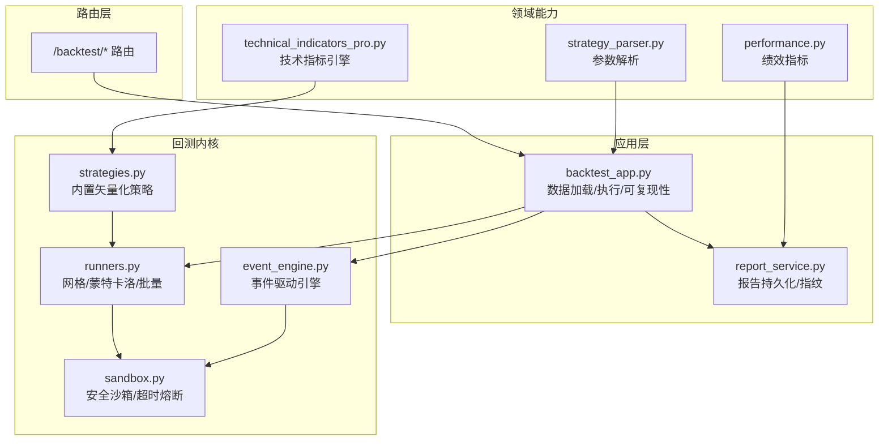
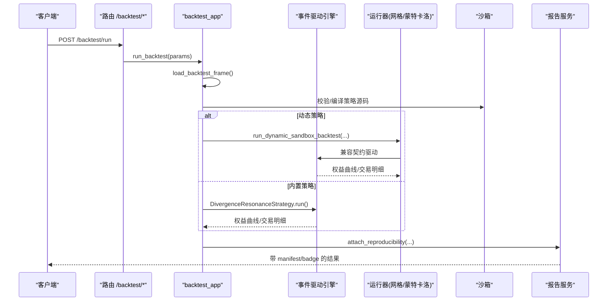
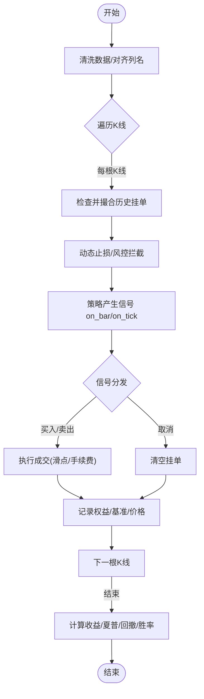
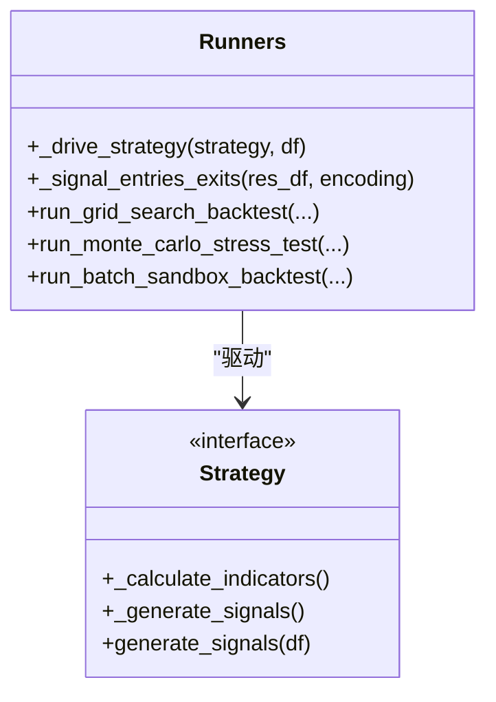
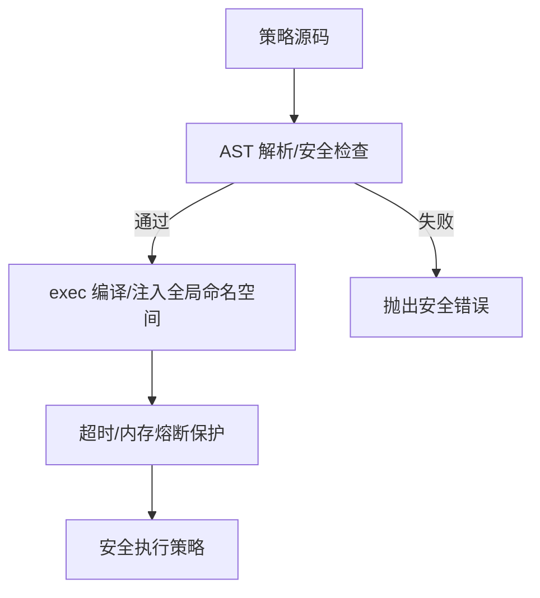
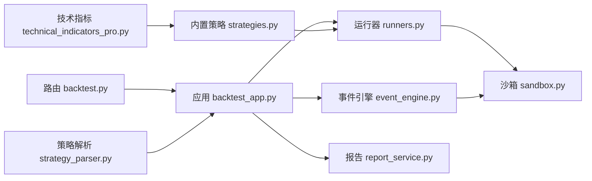

# 策略回测引擎

<cite>
**本文引用的文件**
- [event_engine.py](file://backend/backtest/event_engine.py)
- [runners.py](file://backend/backtest/runners.py)
- [sandbox.py](file://backend/backtest/sandbox.py)
- [strategies.py](file://backend/backtest/strategies.py)
- [strategy_parser.py](file://backend/domain/strategy_parser.py)
- [backtest_app.py](file://backend/app/backtest_app.py)
- [report_service.py](file://backend/app/backtest/report_service.py)
- [performance.py](file://backend/domain/performance.py)
- [technical_indicators_pro.py](file://backend/utils/technical_indicators_pro.py)
- [backtest.py](file://backend/routers/backtest.py)
</cite>

## 目录
1. [简介](#简介)
2. [项目结构](#项目结构)
3. [核心组件](#核心组件)
4. [架构总览](#架构总览)
5. [详细组件分析](#详细组件分析)
6. [依赖关系分析](#依赖关系分析)
7. [性能与优化](#性能与优化)
8. [故障排查指南](#故障排查指南)
9. [结论](#结论)
10. [附录：指标、参数与示例](#附录指标参数与示例)

## 简介
本技术文档面向 Quant Agent 的策略回测引擎，系统性阐述事件驱动的回测架构与工程实现，覆盖事件引擎、执行器、沙箱环境、策略解析器、技术指标库、回测参数配置、绩效评估与可视化报告生成。文档同时提供从简单到复杂的策略开发示例、回测结果解读方法（收益曲线、最大回撤、夏普比率等）、以及回测优化技巧与过拟合检测方法。

## 项目结构
回测相关代码主要分布在以下模块：
- 回测内核：事件驱动引擎、运行器（网格搜索、蒙特卡洛、批量回测）、沙箱安全与基类、内置策略
- 应用层：回测入口、流式进度、可复现性报告持久化
- 领域能力：共享绩效指标库、策略参数解析器、技术指标计算引擎
- 路由层：HTTP API 暴露回测、网格搜索、蒙特卡洛、过拟合检测、滚动验证等能力

图表来源
- [backtest.py:145-200](file://backend/routers/backtest.py#L145-L200)
- [backtest_app.py:72-222](file://backend/app/backtest_app.py#L72-L222)
- [event_engine.py:37-271](file://backend/backtest/event_engine.py#L37-L271)
- [runners.py:148-569](file://backend/backtest/runners.py#L148-L569)
- [sandbox.py:147-432](file://backend/backtest/sandbox.py#L147-L432)
- [strategies.py:13-204](file://backend/backtest/strategies.py#L13-L204)
- [strategy_parser.py:6-115](file://backend/domain/strategy_parser.py#L6-L115)
- [performance.py:14-177](file://backend/domain/performance.py#L14-L177)
- [technical_indicators_pro.py:28-130](file://backend/utils/technical_indicators_pro.py#L28-L130)

章节来源
- [backtest.py:145-200](file://backend/routers/backtest.py#L145-L200)
- [backtest_app.py:72-222](file://backend/app/backtest_app.py#L72-L222)

## 核心组件
- 事件驱动回测引擎：逐 K 线推进，支持限价单撮合、动态止损、滑点与手续费磨损、权益曲线与交易明细记录
- 运行器：Numba/VectorBT 驱动的极速回测，支持网格搜索、蒙特卡洛压力测试、多标的批量回测
- 沙箱环境：AST 级源码扫描、危险模块拦截、目录穿越防护、超时与内存熔断、策略基类桩
- 策略解析器：静态解析策略源码的 __init__ 参数，自动生成前端表单
- 技术指标库：趋势/动量/波动/成交量等多类指标，支持缓存与自定义配置
- 绩效评估：Sharpe、最大回撤、年化收益、波动率、跟踪误差、胜率等纯函数实现
- 报告服务：可复现性指纹、结果摘要持久化、公开字段脱敏

章节来源
- [event_engine.py:37-271](file://backend/backtest/event_engine.py#L37-L271)
- [runners.py:99-146](file://backend/backtest/runners.py#L99-L146)
- [sandbox.py:147-432](file://backend/backtest/sandbox.py#L147-L432)
- [strategy_parser.py:6-115](file://backend/domain/strategy_parser.py#L6-L115)
- [technical_indicators_pro.py:28-130](file://backend/utils/technical_indicators_pro.py#L28-L130)
- [performance.py:14-177](file://backend/domain/performance.py#L14-L177)
- [report_service.py:20-166](file://backend/app/backtest/report_service.py#L20-L166)

## 架构总览
系统采用“路由 -> 应用 -> 内核”的分层设计：
- 路由层接收请求并校验参数，调用应用层用例
- 应用层负责数据加载、策略执行、结果增强（可复现性）
- 内核层提供事件驱动与矢量化双引擎、沙箱安全、运行器工具、内置策略与指标库

图表来源
- [backtest.py:145-200](file://backend/routers/backtest.py#L145-L200)
- [backtest_app.py:166-222](file://backend/app/backtest_app.py#L166-L222)
- [event_engine.py:129-271](file://backend/backtest/event_engine.py#L129-L271)
- [runners.py:274-461](file://backend/backtest/runners.py#L274-L461)
- [report_service.py:224-285](file://backend/app/backtest_app.py#L224-L285)

## 详细组件分析

### 事件驱动回测引擎
- 逐 K 线推进，维护现金、持仓、挂单簿、摩擦成本、调试日志
- 支持限价单撮合、动态止损、滑点与手续费
- 输出权益曲线、交易明细、关键指标（总收益、夏普、最大回撤、胜率、摩擦成本）

图表来源
- [event_engine.py:129-271](file://backend/backtest/event_engine.py#L129-L271)

章节来源
- [event_engine.py:37-271](file://backend/backtest/event_engine.py#L37-L271)

### 运行器（网格搜索/蒙特卡洛/批量）
- 统一驱动策略：支持类方法契约（_calculate_indicators/_generate_signals）与 Numba 契约（generate_signals(df)）
- 网格搜索：遍历参数组合，按目标指标排序返回 Top N
- 蒙特卡洛：对历史价格注入噪声，重复回测评估鲁棒性
- 批量回测：对多标的横截面并行回测，聚合投资组合绩效

图表来源
- [runners.py:99-146](file://backend/backtest/runners.py#L99-L146)
- [runners.py:148-569](file://backend/backtest/runners.py#L148-L569)

章节来源
- [runners.py:99-146](file://backend/backtest/runners.py#L99-L146)
- [runners.py:148-569](file://backend/backtest/runners.py#L148-L569)

### 沙箱环境与策略基类
- AST 级源码扫描：禁止高危模块、危险内建、魔术属性、while 循环、递归、超大 range
- 安全 import/open：白名单导入、目录穿越防护
- 超时与内存熔断：基于 sys.settrace 的执行追踪，限制时间与内存增量
- 策略基类：提供持仓状态查询接口，便于事件驱动引擎注入仓位信息

图表来源
- [sandbox.py:147-432](file://backend/backtest/sandbox.py#L147-L432)

章节来源
- [sandbox.py:147-432](file://backend/backtest/sandbox.py#L147-L432)

### 策略解析器
- 使用 AST 静态解析策略源码，提取 __init__ 参数与类型、默认值、描述
- 自动识别策略类（名称包含 Strategy/Bot 或继承含 Strategy 的基类）
- 支持 Sphinx/Google 风格 docstring 参数说明，生成前端表单元数据

章节来源
- [strategy_parser.py:6-115](file://backend/domain/strategy_parser.py#L6-L115)

### 内置策略（矢量化）
- 示例：RSI/MACD 动能背离 + KDJ 交叉共振策略
- 完全矢量化计算指标与信号，结合 VectorBT 进行高效撮合与统计
- 输出权益曲线、交易明细、关键指标

章节来源
- [strategies.py:13-204](file://backend/backtest/strategies.py#L13-L204)

### 技术指标库
- 分类：趋势（MA/EMA/MACD）、动量（RSI/Stochastic/CCI/Elder Ray）、波动（ATR/Bollinger/Keltner）、成交量（OBV/VWAP）
- 预定义配置与阈值，支持缓存装饰器避免重复计算
- 为策略与信号生成提供高性能基础

章节来源
- [technical_indicators_pro.py:28-130](file://backend/utils/technical_indicators_pro.py#L28-L130)

### 绩效评估与可视化
- 共享指标库：Sharpe、最大回撤、年化收益、波动率、跟踪误差、胜率、累计收益、信号一致率
- 报告服务：计算可复现性指纹、结果摘要持久化、公开字段脱敏
- 可视化：权益曲线、基准对比、交易明细、指标面板

章节来源
- [performance.py:14-177](file://backend/domain/performance.py#L14-L177)
- [report_service.py:20-166](file://backend/app/backtest/report_service.py#L20-L166)

## 依赖关系分析
- 路由层依赖应用层用例；应用层依赖回测内核与报告服务
- 运行器依赖沙箱安全与 VectorBT/Numba；事件引擎依赖沙箱与策略实例
- 策略解析器独立于执行路径，用于前端表单生成
- 技术指标库被内置策略与运行器间接使用

图表来源
- [backtest.py:145-200](file://backend/routers/backtest.py#L145-L200)
- [backtest_app.py:166-222](file://backend/app/backtest_app.py#L166-L222)
- [event_engine.py:129-271](file://backend/backtest/event_engine.py#L129-L271)
- [runners.py:148-569](file://backend/backtest/runners.py#L148-L569)
- [sandbox.py:147-432](file://backend/backtest/sandbox.py#L147-L432)
- [strategies.py:13-204](file://backend/backtest/strategies.py#L13-L204)
- [technical_indicators_pro.py:28-130](file://backend/utils/technical_indicators_pro.py#L28-L130)
- [strategy_parser.py:6-115](file://backend/domain/strategy_parser.py#L6-L115)

章节来源
- [backtest.py:145-200](file://backend/routers/backtest.py#L145-L200)
- [backtest_app.py:166-222](file://backend/app/backtest_app.py#L166-L222)

## 性能与优化
- 矢量化优先：策略尽量使用 Pandas/NumPy 矩阵运算，避免行级迭代
- Numba JIT：允许在沙箱中使用 njit/jit/vectorize/guvectorize/cfunc/stencil 装饰器以提升热点性能
- 缓存机制：技术指标计算结果可缓存，减少重复计算
- 超时与内存熔断：防止死循环与 OOM，保障系统稳定性
- 批量与并行：网格搜索与蒙特卡洛支持大规模参数组合与多次模拟；批量回测对多标的并行处理

章节来源
- [sandbox.py:47-59](file://backend/backtest/sandbox.py#L47-L59)
- [sandbox.py:352-415](file://backend/backtest/sandbox.py#L352-L415)
- [technical_indicators_pro.py:136-169](file://backend/utils/technical_indicators_pro.py#L136-L169)
- [runners.py:148-569](file://backend/backtest/runners.py#L148-L569)

## 故障排查指南
- 数据不足：回测数据长度不足（至少 10 根 K 线），需检查数据源与时间窗口
- 策略未实现契约：必须实现 _calculate_indicators/_generate_signals 或 generate_signals(df)
- 安全拦截：导入非白名单模块、使用危险内建、while 循环、递归、超大 range 将被拒绝
- 超时/内存熔断：策略执行超过阈值或内存增量过大将被强制中断
- 报告不可复现：live/unbound 模式或随机种子缺失将导致 reproducible=false

章节来源
- [event_engine.py:139-141](file://backend/backtest/event_engine.py#L139-L141)
- [runners.py:119-123](file://backend/backtest/runners.py#L119-L123)
- [sandbox.py:147-339](file://backend/backtest/sandbox.py#L147-L339)
- [report_service.py:47-56](file://backend/app/backtest/report_service.py#L47-L56)

## 结论
Quant Agent 的回测引擎以事件驱动为核心，结合矢量化与 Numba 加速，提供高保真与高性能两种回测路径。沙箱环境确保动态策略的安全执行，策略解析器简化前端交互，技术指标库与绩效评估支撑策略研发闭环。通过网格搜索、蒙特卡洛与过拟合检测，形成完整的策略开发与验证体系。

## 附录：指标、参数与示例

### 支持的策略类型与技术指标
- 策略类型
  - 趋势跟踪：均线交叉、MACD、ADX 等
  - 均值回归：RSI、布林带、KDJ 等
  - 统计套利：配对价差、协整、因子模型（可通过多标的批量回测实现）
- 技术指标库
  - 趋势：MA、EMA、MACD、VWMA
  - 动量：RSI、Stochastic、CCI、Elder Ray
  - 波动：ATR、Bollinger、Keltner Channels
  - 成交量：OBV、VWAP

章节来源
- [technical_indicators_pro.py:28-130](file://backend/utils/technical_indicators_pro.py#L28-L130)
- [strategies.py:38-108](file://backend/backtest/strategies.py#L38-L108)

### 回测参数配置
- 通用参数
  - ticker、period、interval、initial_capital、atr_multiplier、commission_pct、slippage_pct、data_source、debug_mode、data_snapshot_id、random_seed
- 动态策略
  - source_code、class_name、params（由策略解析器生成表单）
- 高级功能
  - 网格搜索：param_grid、target_metric、heatmap_x/y、max_workers
  - 蒙特卡洛：iterations、method、seed
  - 过拟合检测：dsr_warn_below、cliff_abs/rel

章节来源
- [backtest.py:46-143](file://backend/routers/backtest.py#L46-L143)
- [backtest_app.py:54-70](file://backend/app/backtest_app.py#L54-L70)
- [strategy_parser.py:6-115](file://backend/domain/strategy_parser.py#L6-L115)

### 绩效评估指标与可视化
- 指标
  - 总收益、年化收益、夏普比率、最大回撤、胜率、利润因子、摩擦成本
  - 跟踪误差、主动收益序列、累计收益率、信号一致率
- 可视化
  - 权益曲线与基准对比、交易明细、热力图（网格搜索）

章节来源
- [event_engine.py:239-271](file://backend/backtest/event_engine.py#L239-L271)
- [performance.py:14-177](file://backend/domain/performance.py#L14-L177)
- [runners.py:228-279](file://backend/backtest/runners.py#L228-L279)

### 策略开发示例
- 简单移动平均线交叉
  - 实现 _calculate_indicators 计算 MA，_generate_signals 根据金叉/死叉生成 signal
  - 或通过 generate_signals(df) 返回含 signal 列的 DataFrame
- 复杂多因子模型
  - 使用技术指标库构建因子，结合横截面筛选与批量回测
  - 利用网格搜索与蒙特卡洛评估稳健性与过拟合风险

章节来源
- [runners.py:99-146](file://backend/backtest/runners.py#L99-L146)
- [strategies.py:38-108](file://backend/backtest/strategies.py#L38-L108)
- [runners.py:438-569](file://backend/backtest/runners.py#L438-L569)

### 回测结果解读
- 收益曲线：观察策略净值与基准的相对表现，识别阶段失效
- 最大回撤：衡量极端风险，结合止损与仓位管理优化
- 夏普比率：风险调整后收益，越高越好但需结合样本量与稳定性
- 胜率与盈亏比：评估交易质量，避免过度交易
- 摩擦成本：关注手续费与滑点对净收益的影响

章节来源
- [event_engine.py:239-271](file://backend/backtest/event_engine.py#L239-L271)
- [performance.py:14-177](file://backend/domain/performance.py#L14-L177)

### 回测优化技巧与过拟合检测
- 优化技巧
  - 矢量化优先，避免行级循环
  - 合理设置滑点与手续费，贴近真实交易
  - 使用 ATR 动态止损，适应波动变化
  - 网格搜索定位稳健参数区间，蒙特卡洛评估鲁棒性
- 过拟合检测
  - Deflated Sharpe Ratio 与参数悬崖分析
  - 滚动验证（Walk-Forward）与样本外检验
  - 结果指纹与可复现性标记，确保实验可追溯

章节来源
- [backtest.py:125-143](file://backend/routers/backtest.py#L125-L143)
- [report_service.py:20-56](file://backend/app/backtest/report_service.py#L20-L56)
