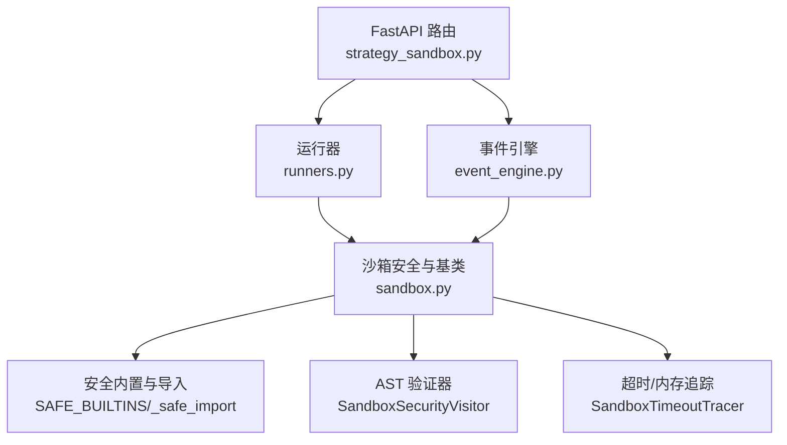
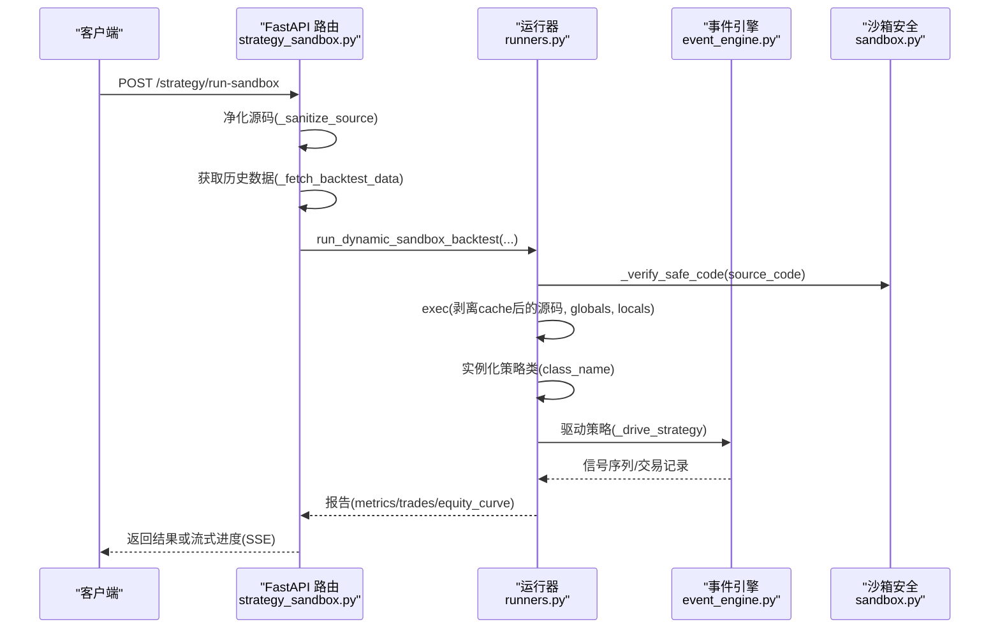
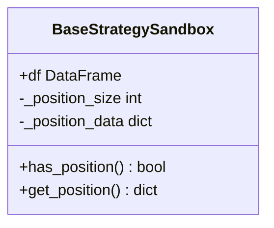
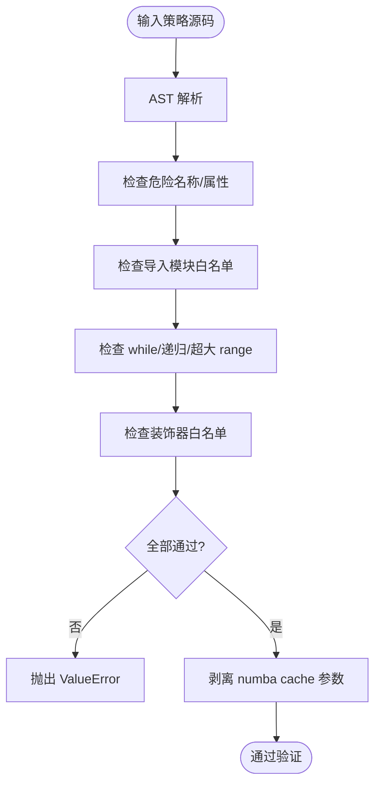
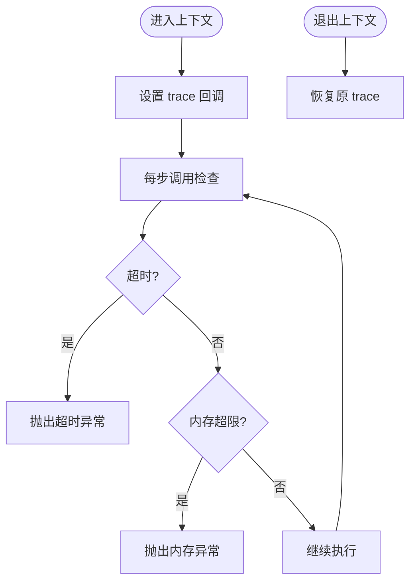
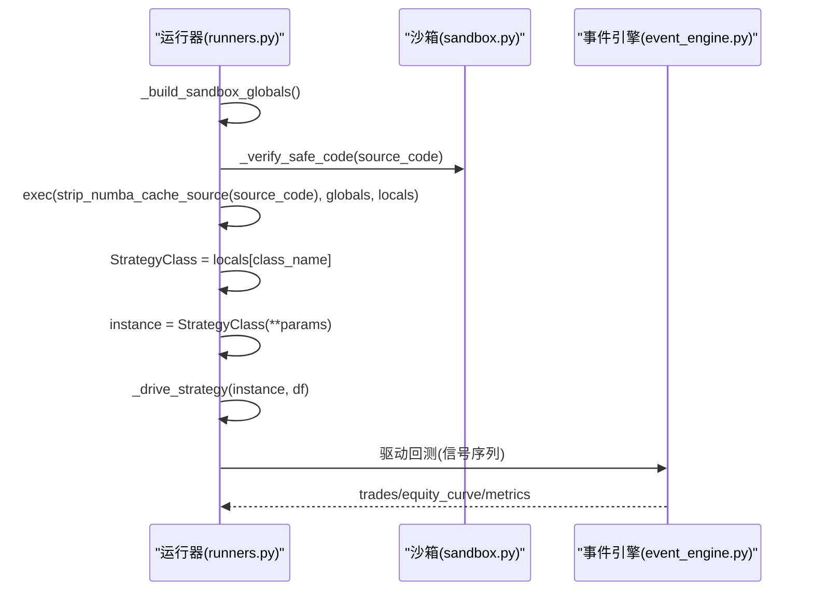
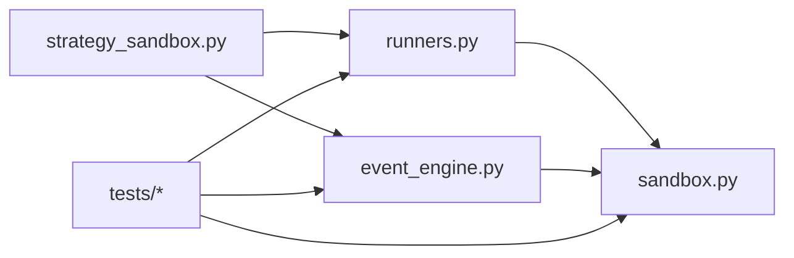

# 策略沙箱环境

<cite>
**本文引用的文件**
- [sandbox.py](file://backend/backtest/sandbox.py)
- [event_engine.py](file://backend/backtest/event_engine.py)
- [runners.py](file://backend/backtest/runners.py)
- [__init__.py](file://backend/backtest/__init__.py)
- [strategy_sandbox.py](file://backend/routers/strategy_sandbox.py)
- [test_sandbox_security.py](file://backend/tests/test_backtest/test_sandbox_security.py)
- [test_sandbox_infra.py](file://backend/tests/test_backtest/test_sandbox_infra.py)
</cite>

## 目录
1. [简介](#简介)
2. [项目结构](#项目结构)
3. [核心组件](#核心组件)
4. [架构总览](#架构总览)
5. [详细组件分析](#详细组件分析)
6. [依赖关系分析](#依赖关系分析)
7. [性能考量](#性能考量)
8. [故障排查指南](#故障排查指南)
9. [结论](#结论)
10. [附录](#附录)

## 简介
本技术文档面向 Quant Agent 的策略沙箱环境，聚焦以下目标：
- 深入解析 BaseStrategySandbox 基类的设计理念与安全隔离机制（SAFE_BUILTINS 白名单、AST 代码验证器、安全限制）
- 说明 SandboxTimeoutTracer 的超时控制、内存限制与执行环境隔离
- 解释动态策略加载流程（源码编译、类实例化、方法调用）
- 提供安全的 API 接口说明（数据访问、指标计算、订单提交等受限操作）
- 覆盖沙箱配置选项、错误处理机制与调试工具使用方法

## 项目结构
策略沙箱位于后端回测子系统中，关键文件与职责如下：
- backend/backtest/sandbox.py：沙箱安全与基础设施（AST 扫描、高危模块拦截、目录穿越防护、超时/内存熔断、策略基类）
- backend/backtest/event_engine.py：事件驱动回测引擎与动态沙箱入口
- backend/backtest/runners.py：网格搜索、蒙特卡洛压力测试、批量回测运行器
- backend/backtest/__init__.py：统一导出沙箱能力与引擎入口
- backend/routers/strategy_sandbox.py：FastAPI 路由层，暴露沙箱运行、优化、批量、蒙特卡洛与部署端点
- tests/test_backtest/*：沙箱安全与基础设施的单元测试

图表来源
- [strategy_sandbox.py:495-612](file://backend/routers/strategy_sandbox.py#L495-L612)
- [runners.py:148-200](file://backend/backtest/runners.py#L148-L200)
- [event_engine.py:37-200](file://backend/backtest/event_engine.py#L37-L200)
- [sandbox.py:140-145](file://backend/backtest/sandbox.py#L140-L145)
- [sandbox.py:147-339](file://backend/backtest/sandbox.py#L147-L339)
- [sandbox.py:352-415](file://backend/backtest/sandbox.py#L352-L415)

章节来源
- [strategy_sandbox.py:1-120](file://backend/routers/strategy_sandbox.py#L1-L120)
- [__init__.py:1-47](file://backend/backtest/__init__.py#L1-L47)

## 核心组件
- SAFE_BUILTINS 白名单：移除 eval/exec/compile/globals/locals 等危险内建，替换 open 为 _safe_open，替换 __import__ 为 _safe_import，实现最小权限执行环境
- AST 代码验证器 SandboxSecurityVisitor：静态扫描禁止反射、魔术属性、危险函数名、非白名单模块导入、while 循环、递归、超大 range 等
- 安全导入与文件访问：_safe_import 拦截系统/网络/并发等高危模块；_safe_open 强制路径在 SANDBOX_DIR 下，防止目录穿越
- 超时与内存熔断：SandboxTimeoutTracer 基于 sys.settrace 监控执行时间与进程 RSS 内存增量，超限时抛出异常
- 策略基类 BaseStrategySandbox：提供持仓状态查询接口，供策略继承使用
- 动态加载与执行：runners 构建全局命名空间并 exec 策略源码，实例化策略类，驱动信号生成与回测

章节来源
- [sandbox.py:26-44](file://backend/backtest/sandbox.py#L26-L44)
- [sandbox.py:115-145](file://backend/backtest/sandbox.py#L115-L145)
- [sandbox.py:147-339](file://backend/backtest/sandbox.py#L147-L339)
- [sandbox.py:352-415](file://backend/backtest/sandbox.py#L352-L415)
- [sandbox.py:417-432](file://backend/backtest/sandbox.py#L417-L432)
- [runners.py:54-85](file://backend/backtest/runners.py#L54-L85)

## 架构总览
下图展示从 FastAPI 路由到沙箱执行的完整调用链，包括数据获取、源码净化、AST 校验、动态加载、策略执行与结果封装。

图表来源
- [strategy_sandbox.py:495-612](file://backend/routers/strategy_sandbox.py#L495-L612)
- [runners.py:148-200](file://backend/backtest/runners.py#L148-L200)
- [event_engine.py:37-200](file://backend/backtest/event_engine.py#L37-L200)
- [sandbox.py:326-339](file://backend/backtest/sandbox.py#L326-L339)

## 详细组件分析

### BaseStrategySandbox 基类与安全隔离
- 设计理念：为动态生成的策略提供最小化的公共接口，仅暴露持仓状态查询，避免直接暴露底层撮合细节
- 安全隔离：通过 SAFE_BUILTINS 与 AST 验证器双重约束，确保策略无法访问危险内建、系统模块与反射能力
- 关键能力：
  - has_position()：判断是否持有仓位
  - get_position()：返回当前持仓详情（size、entry_price、stop_loss 等）

图表来源
- [sandbox.py:417-432](file://backend/backtest/sandbox.py#L417-L432)

章节来源
- [sandbox.py:417-432](file://backend/backtest/sandbox.py#L417-L432)
- [test_sandbox_infra.py:40-63](file://backend/tests/test_backtest/test_sandbox_infra.py#L40-L63)

### SAFE_BUILTINS 白名单与代码验证器
- SAFE_BUILTINS：剔除危险内建，注入安全版 open 与 __import__，限制策略可访问的最小集合
- SandboxSecurityVisitor：AST 级静态检查，拦截：
  - 危险函数名（eval/exec/getattr/setattr/hasattr/vars/compile 等）
  - 魔术属性（__class__/__subclasses__/__dict__/__builtins__ 等）
  - 非白名单模块导入（仅允许 numpy/pandas/math/datetime/collections/itertools/scipy/statsmodels/sklearn/lightgbm/xgboost/typing/numba 等）
  - while 循环、递归调用、超大 range、range(len(...)) 低效遍历
  - 未授权装饰器（仅放行 Numba JIT 相关装饰器）
- strip_numba_cache_source：剥离 numba 装饰器的 cache 参数，避免临时源码缓存失败

图表来源
- [sandbox.py:140-145](file://backend/backtest/sandbox.py#L140-L145)
- [sandbox.py:147-339](file://backend/backtest/sandbox.py#L147-L339)
- [sandbox.py:77-105](file://backend/backtest/sandbox.py#L77-L105)

章节来源
- [sandbox.py:26-44](file://backend/backtest/sandbox.py#L26-L44)
- [sandbox.py:115-145](file://backend/backtest/sandbox.py#L115-L145)
- [sandbox.py:147-339](file://backend/backtest/sandbox.py#L147-L339)
- [test_sandbox_security.py:45-248](file://backend/tests/test_backtest/test_sandbox_security.py#L45-L248)

### SandboxTimeoutTracer 超时控制与内存限制
- 超时控制：基于 sys.settrace 的逐调用计时，超过阈值抛出 SandboxTimeoutException
- 内存限制：抽样检查进程 RSS 内存增量，超过阈值抛出 SandboxMemoryException
- 兼容性：若检测到外部 trace（如 coverage/pdb），则禁用自身 trace，避免干扰调试与覆盖率统计

图表来源
- [sandbox.py:352-415](file://backend/backtest/sandbox.py#L352-L415)
- [test_sandbox_infra.py:16-38](file://backend/tests/test_backtest/test_sandbox_infra.py#L16-L38)

章节来源
- [sandbox.py:352-415](file://backend/backtest/sandbox.py#L352-L415)
- [test_sandbox_infra.py:16-38](file://backend/tests/test_backtest/test_sandbox_infra.py#L16-L38)

### 动态策略加载流程
- 源码净化：移除 talib/BaseStrategy 等禁止导入，保持与执行沙箱一致
- 构建全局命名空间：注入 np/pd/类型提示/基础库/numba 装饰器映射，以及 BaseStrategySandbox
- 执行与实例化：exec 策略源码，提取策略类并实例化
- 驱动策略：支持两种契约
  - 类方法契约：_calculate_indicators()/_generate_signals()，输出稠密 signal 列（encoding="dense"）
  - 模块级 Numba 契约：generate_signals(df)，返回含 signal/position 的事件标记（encoding="event"）
- 信号转换：根据 encoding 生成 vectorbt from_signals 所需的买卖布尔序列
- 回测执行：事件驱动引擎逐 K 线推进，处理挂单、止损、滑点与手续费，产出交易记录与权益曲线

图表来源
- [runners.py:54-85](file://backend/backtest/runners.py#L54-L85)
- [runners.py:99-145](file://backend/backtest/runners.py#L99-L145)
- [runners.py:148-200](file://backend/backtest/runners.py#L148-L200)
- [event_engine.py:37-200](file://backend/backtest/event_engine.py#L37-L200)

章节来源
- [runners.py:54-85](file://backend/backtest/runners.py#L54-L85)
- [runners.py:99-145](file://backend/backtest/runners.py#L99-L145)
- [runners.py:148-200](file://backend/backtest/runners.py#L148-L200)
- [event_engine.py:37-200](file://backend/backtest/event_engine.py#L37-L200)

### 安全 API 接口说明
- 数据访问
  - 历史数据获取：优先快照（SnapshotReader），降级本地数仓，再降级实时源（Futu/AKShare/Finnhub/yfinance）
  - 数据标准化：统一列名（Open/High/Low/Close/Volume）与时序索引
- 指标计算
  - 允许导入 numpy/pandas/scipy/statsmodels/sklearn/lightgbm/xgboost/numba 等计算库
  - 禁止行级迭代（iterrows/itertuples/iteritems），强制矢量化运算
- 订单提交
  - 策略通过 on_bar/on_tick 返回信号字典（action/limit_price），由事件引擎进行限价单挂单与止损触发
  - 不支持直接调用外部交易接口，所有订单均在回测引擎内部撮合

章节来源
- [strategy_sandbox.py:156-357](file://backend/routers/strategy_sandbox.py#L156-L357)
- [event_engine.py:68-200](file://backend/backtest/event_engine.py#L68-L200)
- [sandbox.py:186-203](file://backend/backtest/sandbox.py#L186-L203)

### 沙箱配置选项
- 运行参数
  - ticker/period/interval：标的、周期与频率
  - initial_capital：初始资金
  - data_source：auto/local/snapshot/futu/yfinance
  - debug_mode：是否启用逐 K 线调试日志
  - data_snapshot_id：指定快照 ID（latest_published/live）
  - random_seed：随机种子，用于可复现性
  - persist_report：是否持久化回测报告
  - env：部署目标环境（sandbox/live）
- 寻优与压力测试
  - param_grid：参数网格
  - target_metric：优化目标指标
  - iterations/noise_level/noise_distribution：蒙特卡洛模拟参数
- 运行时限制
  - timeout_seconds：单次执行超时阈值
  - max_memory_mb：内存增量上限

章节来源
- [strategy_sandbox.py:100-151](file://backend/routers/strategy_sandbox.py#L100-L151)
- [runners.py:148-200](file://backend/backtest/runners.py#L148-L200)
- [sandbox.py:352-358](file://backend/backtest/sandbox.py#L352-L358)

### 错误处理机制
- 源码层面：语法错误、缩进错误、危险名称/属性/导入/装饰器均抛出 ValueError
- 执行层面：超时抛出 SandboxTimeoutException，内存超限抛出 SandboxMemoryException
- 路由层：捕获异常并返回结构化错误信息（error_code/message/error_detail/traceback）
- 数据层面：数据缺失时返回明确错误码（DATA_SNAPSHOT_MISSING/LOCAL_DATA_MISSING/FUTU_ERROR 等）

章节来源
- [sandbox.py:326-339](file://backend/backtest/sandbox.py#L326-L339)
- [sandbox.py:344-349](file://backend/backtest/sandbox.py#L344-L349)
- [strategy_sandbox.py:564-612](file://backend/routers/strategy_sandbox.py#L564-L612)
- [strategy_sandbox.py:615-740](file://backend/routers/strategy_sandbox.py#L615-L740)

### 调试工具使用方法
- 流式响应（SSE）：/strategy/run-sandbox/stream 与 /strategy/optimize-sandbox/stream 推送进度与结果
- 调试模式：debug_mode=True 时记录逐 K 线调试日志
- 可复现性：附加 manifest（code_hash/data_snapshot_id/manifest_hash/random_seed/reproducible）
- 状态标记：回测成功标记草稿状态为 backtested，部署成功标记为 deployed/draft（纸面）

章节来源
- [strategy_sandbox.py:437-515](file://backend/routers/strategy_sandbox.py#L437-L515)
- [strategy_sandbox.py:376-434](file://backend/routers/strategy_sandbox.py#L376-L434)
- [strategy_sandbox.py:40-59](file://backend/routers/strategy_sandbox.py#L40-L59)

## 依赖关系分析
- 路由层依赖运行器与事件引擎，运行器与事件引擎共同依赖沙箱安全模块
- 沙箱安全模块被多处复用：AST 验证、安全内置、超时追踪、策略基类
- 测试覆盖安全与基础设施行为，确保白名单、拦截规则与超时/内存熔断有效

图表来源
- [strategy_sandbox.py:24-36](file://backend/routers/strategy_sandbox.py#L24-L36)
- [runners.py:16-23](file://backend/backtest/runners.py#L16-L23)
- [event_engine.py:17-24](file://backend/backtest/event_engine.py#L17-L24)
- [sandbox.py:1-25](file://backend/backtest/sandbox.py#L1-L25)

章节来源
- [__init__.py:1-47](file://backend/backtest/__init__.py#L1-L47)
- [test_sandbox_security.py:1-257](file://backend/tests/test_backtest/test_sandbox_security.py#L1-L257)
- [test_sandbox_infra.py:1-63](file://backend/tests/test_backtest/test_sandbox_infra.py#L1-L63)

## 性能考量
- 矢量化优先：禁止 while 循环与 range(len(...))，强制使用 numpy/pandas 矩阵运算
- Numba JIT：允许 njit/jit/vectorize/guvectorize/cfunc/stencil 装饰器，提升热点计算性能
- 采样内存检测：每 5000 步指令检查一次 RSS，降低系统调用开销
- 数据源优先级：快照优先，减少重复拉取与网络延迟
- 进度推送：SSE 流式推送，避免长连接阻塞

[本节为通用指导，不直接分析具体文件]

## 故障排查指南
- 源码错误
  - 语法/缩进错误：检查报错行号与消息
  - 危险名称/属性/导入：确认未使用 eval/exec/getattr/os/sys 等
  - 非白名单模块：仅允许 numpy/pandas/scipy/statsmodels/sklearn/lightgbm/xgboost/typing/numba 等
- 执行错误
  - 超时：缩短逻辑或改用矢量化；检查是否存在死循环或过大范围
  - 内存溢出：避免创建超大对象；减少中间 DataFrame 拷贝
- 数据问题
  - 快照缺失：检查 ENGINE_ALLOW_LIVE_DATA 与 snapshot_id
  - 本地数据不足：触发 K 线数据同步
  - 实时源失败：切换 data_source 或检查网络/鉴权
- 调试技巧
  - 启用 debug_mode 查看逐 K 线日志
  - 使用 SSE 流式接口观察进度与中间状态
  - 检查 manifest 中的 code_hash 与 data_mode，确保可复现

章节来源
- [strategy_sandbox.py:564-612](file://backend/routers/strategy_sandbox.py#L564-L612)
- [strategy_sandbox.py:615-740](file://backend/routers/strategy_sandbox.py#L615-L740)
- [sandbox.py:326-339](file://backend/backtest/sandbox.py#L326-L339)
- [sandbox.py:352-415](file://backend/backtest/sandbox.py#L352-L415)

## 结论
Quant Agent 的策略沙箱通过“AST 静态验证 + 最小权限执行环境 + 超时/内存熔断”的多层防护，实现了高安全性的动态策略执行。结合事件驱动回测引擎与多种运行器（网格搜索、蒙特卡洛、批量回测），提供了从开发到优化的完整闭环。路由层暴露了丰富的 API 与流式接口，便于前端集成与实时反馈。建议在策略开发中遵循矢量化编程规范，合理使用 Numba JIT，并利用快照与可复现性机制保障实验一致性。

[本节为总结性内容，不直接分析具体文件]

## 附录
- 安全白名单模块（导入阶段）：numpy/pandas/math/datetime/collections/itertools/scipy/statsmodels/sklearn/lightgbm/xgboost/typing/typing_extensions/__future__/numba
- 危险模块（导入阶段拦截）：os/sys/subprocess/shutil/socket/urllib/pathlib/pty/multiprocessing/threading/concurrent/_thread
- 危险内建（执行阶段移除）：eval/exec/compile/globals/locals
- 文件访问限制：仅允许 SANDBOX_DIR 下的相对路径，禁止目录穿越
- 装饰器白名单：njit/jit/vectorize/guvectorize/cfunc/stencil

章节来源
- [sandbox.py:26-44](file://backend/backtest/sandbox.py#L26-L44)
- [sandbox.py:140-145](file://backend/backtest/sandbox.py#L140-L145)
- [sandbox.py:186-203](file://backend/backtest/sandbox.py#L186-L203)
- [sandbox.py:115-136](file://backend/backtest/sandbox.py#L115-L136)
