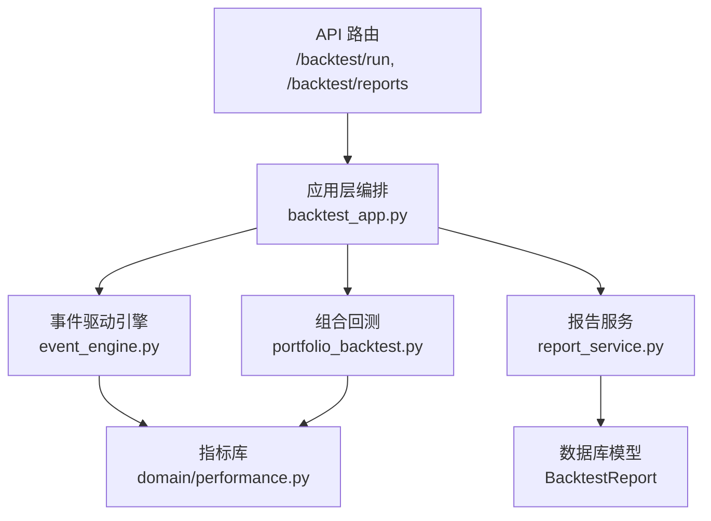
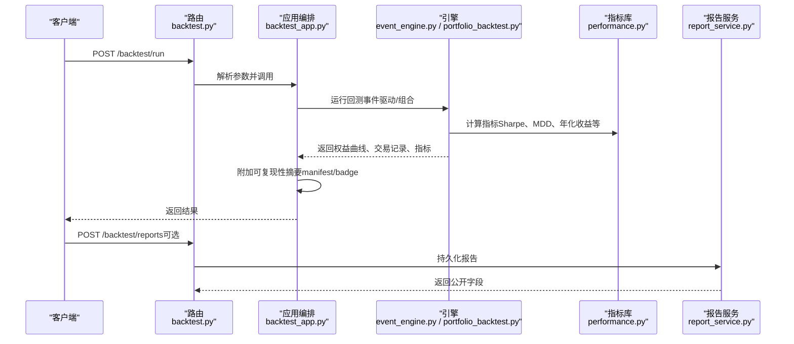
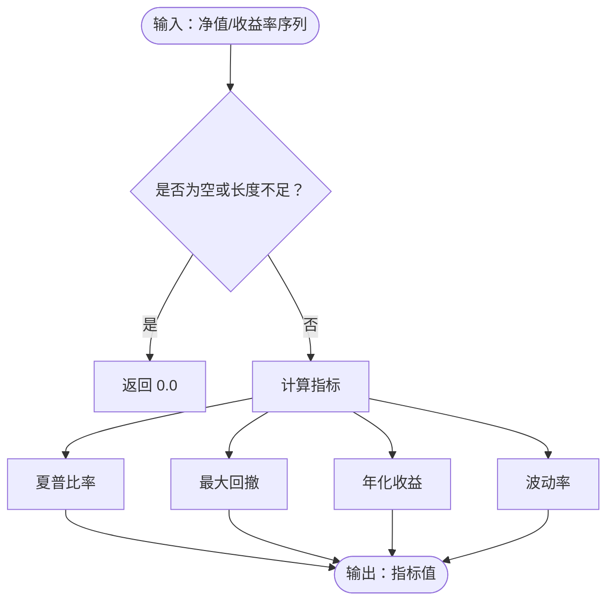
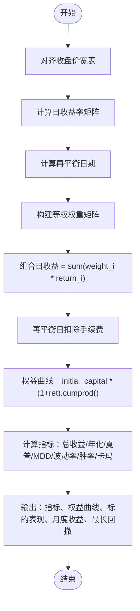
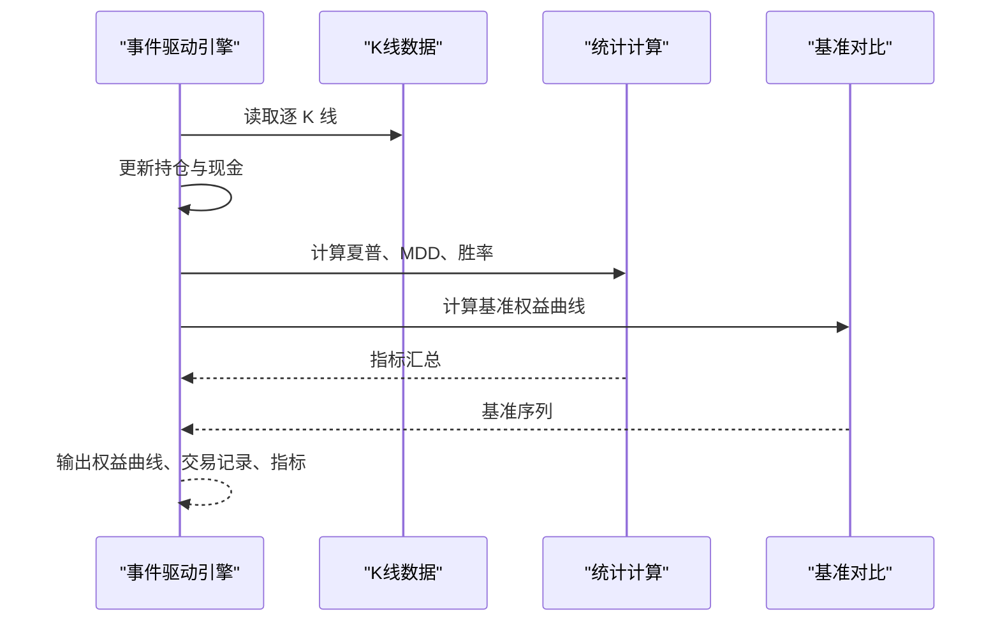
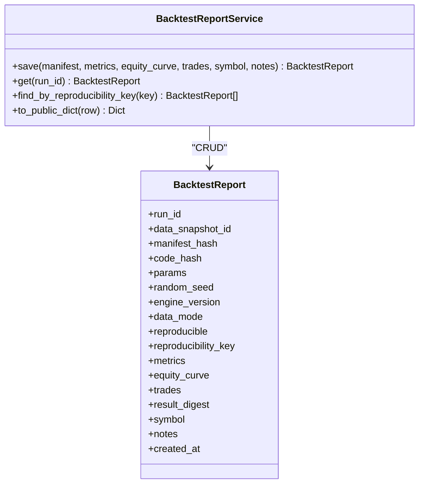
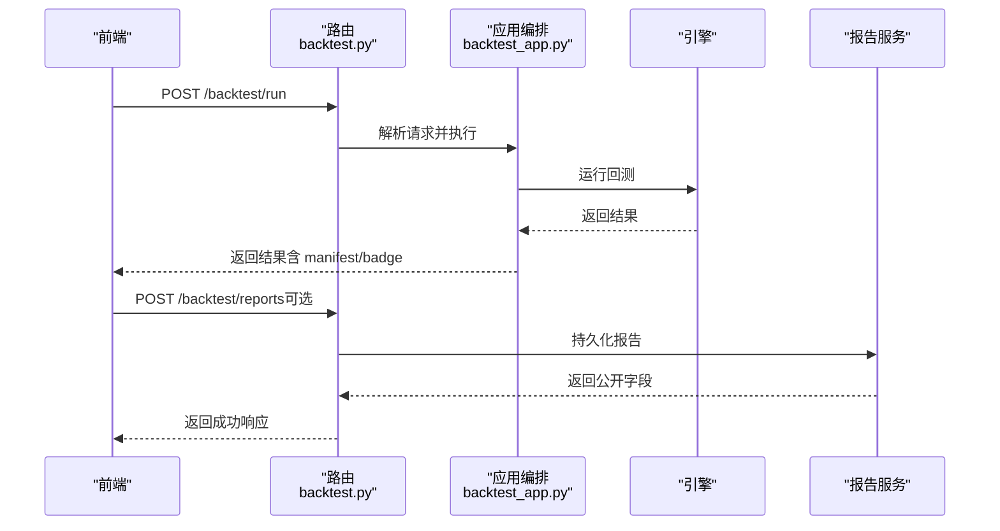
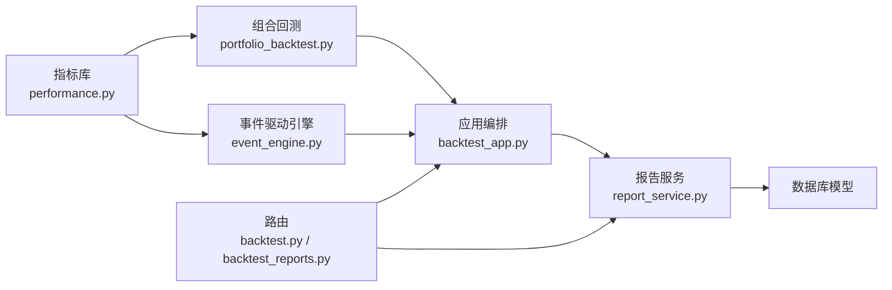

# 绩效分析与报告

<cite>
**本文引用的文件**
- [backend/domain/performance.py](file://backend/domain/performance.py)
- [backend/app/backtest/portfolio_backtest.py](file://backend/app/backtest/portfolio_backtest.py)
- [backend/backtest/event_engine.py](file://backend/backtest/event_engine.py)
- [backend/app/backtest/report_service.py](file://backend/app/backtest/report_service.py)
- [backend/routers/backtest_reports.py](file://backend/routers/backtest_reports.py)
- [backend/routers/backtest.py](file://backend/routers/backtest.py)
- [backend/app/backtest_app.py](file://backend/app/backtest_app.py)
</cite>

## 目录
1. [简介](#简介)
2. [项目结构](#项目结构)
3. [核心组件](#核心组件)
4. [架构总览](#架构总览)
5. [详细组件分析](#详细组件分析)
6. [依赖关系分析](#依赖关系分析)
7. [性能考量](#性能考量)
8. [故障排查指南](#故障排查指南)
9. [结论](#结论)
10. [附录](#附录)

## 简介
本技术文档面向 Quant Agent 的回测绩效分析系统，聚焦以下目标：
- 指标计算：总收益率、年化收益、夏普比率、最大回撤、波动率、胜率、跟踪误差、超额收益序列等。
- 权益曲线与交易记录：从事件驱动引擎或组合回测生成权益曲线、逐笔交易、基准对比数据。
- 报告服务 ReportService：持久化回测报告、可复现性指纹、查询与导出能力。
- 多策略对比与可视化：组合回测输出月度热力图、最长回撤期、标的独立表现；结合前端图表展示。
- 基准对比与归因：跟踪误差与超额收益序列用于相对基准的归因分析。
- 扩展与优化：自定义指标扩展方法、矢量化与并发优化建议。

## 项目结构
围绕绩效分析与报告的关键路径如下：
- 指标库：纯函数实现，无 I/O，供多模块复用。
- 组合回测：等权组合净值曲线、再平衡成本、月度收益矩阵、最长回撤期。
- 事件驱动回测：逐 K 线撮合、权益曲线、交易明细、基准对比。
- 报告服务：可复现性指纹、结果摘要、持久化与查询。
- API 路由：暴露回测执行、流式进度、报告持久化与查询。

**图示来源**
- [backend/routers/backtest.py:145-218](file://backend/routers/backtest.py#L145-L218)
- [backend/app/backtest_app.py:287-357](file://backend/app/backtest_app.py#L287-L357)
- [backend/backtest/event_engine.py:230-429](file://backend/backtest/event_engine.py#L230-L429)
- [backend/app/backtest/portfolio_backtest.py:103-227](file://backend/app/backtest/portfolio_backtest.py#L103-L227)
- [backend/domain/performance.py:14-177](file://backend/domain/performance.py#L14-L177)
- [backend/app/backtest/report_service.py:58-166](file://backend/app/backtest/report_service.py#L58-L166)

**章节来源**
- [backend/routers/backtest.py:145-218](file://backend/routers/backtest.py#L145-L218)
- [backend/app/backtest_app.py:287-357](file://backend/app/backtest_app.py#L287-L357)

## 核心组件
- 指标库（performance.py）：提供 Sharpe、最大回撤、年化收益、波动率、胜率、跟踪误差、超额收益序列、累计收益率、信号一致率等纯函数。
- 组合回测（portfolio_backtest.py）：等权组合净值曲线、再平衡频率、交易成本扣除、月度收益矩阵、最长回撤期、标的独立表现。
- 事件驱动引擎（event_engine.py）：逐 K 线撮合、权益曲线、交易明细、基准对比、统计指标。
- 报告服务（report_service.py）：可复现性指纹、结果摘要、持久化与查询。
- API 路由（backtest.py、backtest_reports.py）：回测执行、流式进度、报告持久化与查询。

**章节来源**
- [backend/domain/performance.py:14-177](file://backend/domain/performance.py#L14-L177)
- [backend/app/backtest/portfolio_backtest.py:103-227](file://backend/app/backtest/portfolio_backtest.py#L103-L227)
- [backend/backtest/event_engine.py:230-429](file://backend/backtest/event_engine.py#L230-L429)
- [backend/app/backtest/report_service.py:58-166](file://backend/app/backtest/report_service.py#L58-L166)
- [backend/routers/backtest.py:145-218](file://backend/routers/backtest.py#L145-L218)
- [backend/routers/backtest_reports.py:82-149](file://backend/routers/backtest_reports.py#L82-L149)

## 架构总览
回测执行与报告生成的端到端流程：
- 客户端调用 /backtest/run 或 /backtest/run/stream。
- backtest_app 加载数据并选择引擎（事件驱动或组合回测）。
- 引擎计算权益曲线与指标，必要时附加基准对比。
- attach_reproducibility 生成 manifest 与 badge。
- 可选通过 /backtest/reports 持久化报告，支持按 run_id 或可复现性键查询。

**图示来源**
- [backend/routers/backtest.py:145-218](file://backend/routers/backtest.py#L145-L218)
- [backend/app/backtest_app.py:287-357](file://backend/app/backtest_app.py#L287-L357)
- [backend/backtest/event_engine.py:230-429](file://backend/backtest/event_engine.py#L230-L429)
- [backend/app/backtest/portfolio_backtest.py:103-227](file://backend/app/backtest/portfolio_backtest.py#L103-L227)
- [backend/domain/performance.py:14-177](file://backend/domain/performance.py#L14-L177)
- [backend/app/backtest/report_service.py:58-166](file://backend/app/backtest/report_service.py#L58-L166)

## 详细组件分析

### 指标库（performance.py）
- 年化夏普比率：基于日收益率均值与标准差，乘以年化因子平方根。
- 最大回撤：净值序列相对历史高点的最大负偏离。
- 年化收益率：基于首尾净值比与周期数推导。
- 波动率：日收益率标准差乘以年化因子。
- 胜率：盈利交易占比。
- 跟踪误差：策略与基准日收益差的标准差乘以年化因子。
- 超额收益序列：逐期策略与基准收益差。
- 累计收益率：净值归一化后的累计变化。
- 信号一致率：持仓集合的 Jaccard 相似度。

**图示来源**
- [backend/domain/performance.py:14-177](file://backend/domain/performance.py#L14-L177)

**章节来源**
- [backend/domain/performance.py:14-177](file://backend/domain/performance.py#L14-L177)

### 组合回测（portfolio_backtest.py）
- 对齐多标的收盘价宽表，计算日收益率矩阵。
- 根据再平衡频率（买入持有/周/月）确定再平衡日。
- 等权权重每日加权求和得到组合日收益，再平衡日扣除换手成本。
- 生成权益曲线，计算总收益、年化收益、夏普、最大回撤、波动率、胜率、卡玛比率。
- 输出标的独立表现、月度收益矩阵、最长回撤期。

**图示来源**
- [backend/app/backtest/portfolio_backtest.py:26-227](file://backend/app/backtest/portfolio_backtest.py#L26-L227)

**章节来源**
- [backend/app/backtest/portfolio_backtest.py:26-227](file://backend/app/backtest/portfolio_backtest.py#L26-L227)

### 事件驱动引擎（event_engine.py）
- 逐 K 线撮合，维护现金与持仓，计算当前权益。
- 权益曲线与基准对比（以初始价格作为基准起点）。
- 计算夏普比率、最大回撤、胜率、摩擦成本。
- 支持矢量化工具（如 VectorBT）快速回测，并重建权益曲线与交易记录。

**图示来源**
- [backend/backtest/event_engine.py:230-429](file://backend/backtest/event_engine.py#L230-L429)

**章节来源**
- [backend/backtest/event_engine.py:230-429](file://backend/backtest/event_engine.py#L230-L429)

### 报告服务（report_service.py）
- 可复现性指纹：基于代码哈希、清单哈希、参数与随机种子。
- 结果摘要：基于指标与权益曲线（仅 equity 字段）计算结果指纹。
- 持久化：保存 RunManifest、指标、权益曲线、交易记录、符号与备注。
- 查询：按 run_id 或可复现性键查找报告，返回公开字段。

**图示来源**
- [backend/app/backtest/report_service.py:58-166](file://backend/app/backtest/report_service.py#L58-L166)

**章节来源**
- [backend/app/backtest/report_service.py:58-166](file://backend/app/backtest/report_service.py#L58-L166)

### API 路由（backtest.py、backtest_reports.py）
- /backtest/run：执行回测，返回结果。
- /backtest/run/stream：SSE 流式推送进度与最终结果。
- /backtest/reports：持久化报告，支持快照解析与可复现性标记。
- /backtest/reports/{run_id}：按 run_id 获取报告。
- /backtest/reports：按可复现性键或代码哈希查询报告列表。

**图示来源**
- [backend/routers/backtest.py:145-218](file://backend/routers/backtest.py#L145-L218)
- [backend/routers/backtest_reports.py:82-149](file://backend/routers/backtest_reports.py#L82-L149)
- [backend/app/backtest_app.py:287-357](file://backend/app/backtest_app.py#L287-L357)
- [backend/app/backtest/report_service.py:58-166](file://backend/app/backtest/report_service.py#L58-L166)

**章节来源**
- [backend/routers/backtest.py:145-218](file://backend/routers/backtest.py#L145-L218)
- [backend/routers/backtest_reports.py:82-149](file://backend/routers/backtest_reports.py#L82-L149)

## 依赖关系分析
- 指标库被组合回测与事件驱动引擎共同使用，保证指标一致性。
- 应用编排协调数据加载、引擎执行与可复现性附加。
- 报告服务依赖数据库模型进行持久化与查询。
- 路由层对外暴露统一接口，屏蔽内部复杂性。

**图示来源**
- [backend/domain/performance.py:14-177](file://backend/domain/performance.py#L14-L177)
- [backend/app/backtest/portfolio_backtest.py:103-227](file://backend/app/backtest/portfolio_backtest.py#L103-L227)
- [backend/backtest/event_engine.py:230-429](file://backend/backtest/event_engine.py#L230-L429)
- [backend/app/backtest_app.py:287-357](file://backend/app/backtest_app.py#L287-L357)
- [backend/app/backtest/report_service.py:58-166](file://backend/app/backtest/report_service.py#L58-L166)
- [backend/routers/backtest.py:145-218](file://backend/routers/backtest.py#L145-L218)
- [backend/routers/backtest_reports.py:82-149](file://backend/routers/backtest_reports.py#L82-L149)

**章节来源**
- [backend/domain/performance.py:14-177](file://backend/domain/performance.py#L14-L177)
- [backend/app/backtest/portfolio_backtest.py:103-227](file://backend/app/backtest/portfolio_backtest.py#L103-L227)
- [backend/backtest/event_engine.py:230-429](file://backend/backtest/event_engine.py#L230-L429)
- [backend/app/backtest_app.py:287-357](file://backend/app/backtest_app.py#L287-L357)
- [backend/app/backtest/report_service.py:58-166](file://backend/app/backtest/report_service.py#L58-L166)
- [backend/routers/backtest.py:145-218](file://backend/routers/backtest.py#L145-L218)
- [backend/routers/backtest_reports.py:82-149](file://backend/routers/backtest_reports.py#L82-L149)

## 性能考量
- 矢量化优先：组合回测与事件驱动引擎均利用 Pandas/NumPy 向量化计算，减少循环开销。
- 并发与进程池：CPU 密集任务卸载到进程池，避免阻塞事件循环。
- 再平衡成本：在再平衡日扣除换手成本，避免高估收益。
- 基准对比：事件驱动引擎内置基准权益曲线，便于可视化与归因。
- 流式进度：SSE 推送阶段进度，提升用户体验与调试效率。

[本节为通用指导，不直接分析具体文件]

## 故障排查指南
- 数据不足：当净值或收益率序列为空或长度不足时，指标返回 0.0，需检查数据加载与清洗逻辑。
- 快照解析失败：若 data_snapshot_id 无法解析，将降级为 unbound 模式，影响可复现性标记。
- 异常处理：路由层捕获数据错误与执行异常，返回结构化错误信息。
- 日志与调试：事件驱动引擎支持 debug 模式，强制高保真引擎以捕获逐 K 线状态。

**章节来源**
- [backend/routers/backtest.py:145-218](file://backend/routers/backtest.py#L145-L218)
- [backend/app/backtest_app.py:287-357](file://backend/app/backtest_app.py#L287-L357)
- [backend/backtest/event_engine.py:230-429](file://backend/backtest/event_engine.py#L230-L429)

## 结论
该回测绩效分析系统通过清晰的模块化设计，实现了指标计算、权益曲线生成、交易记录分析、报告持久化与查询的全链路能力。指标库的纯函数设计确保了跨模块一致性；组合回测与事件驱动引擎提供了灵活的回测路径；报告服务增强了可复现性与审计能力。结合 API 路由，系统具备良好的可扩展性与易用性。

[本节为总结性内容，不直接分析具体文件]

## 附录
- 自定义指标扩展：在 performance.py 中添加新的纯函数，并在组合回测或事件驱动引擎中调用。
- 可视化图表：前端可使用权益曲线、月度收益矩阵、标的独立表现数据进行图表渲染。
- PDF 报告导出：可在后端聚合指标与图表数据，调用 PDF 生成库输出报告。
- 基准对比与归因：使用跟踪误差与超额收益序列进行相对基准的归因分析。
- 性能优化技巧：优先矢量化、合理设置再平衡频率、控制并发度与内存占用。

[本节为概念性内容，不直接分析具体文件]
