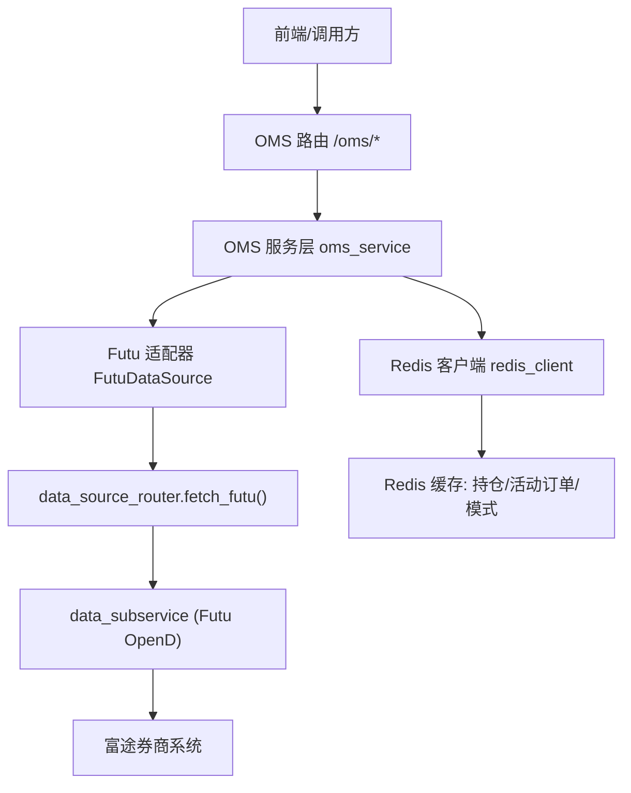
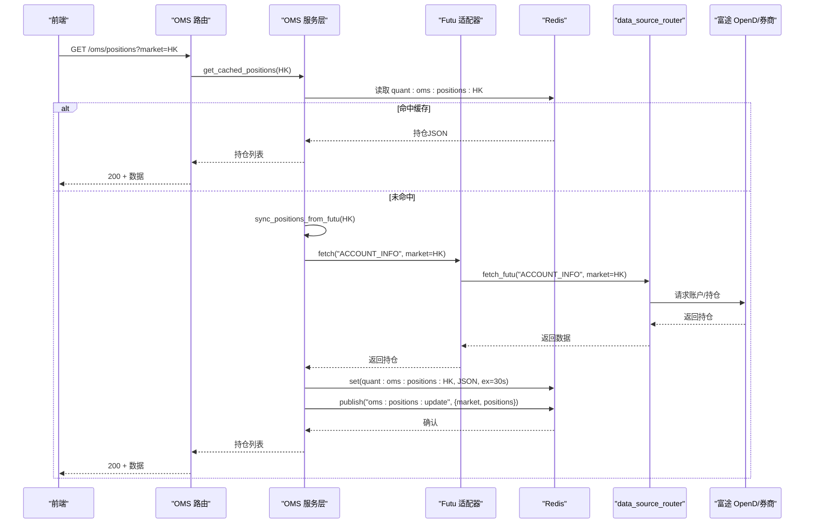
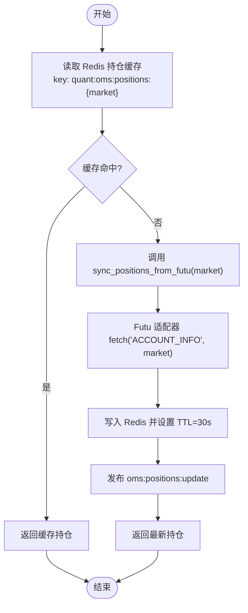
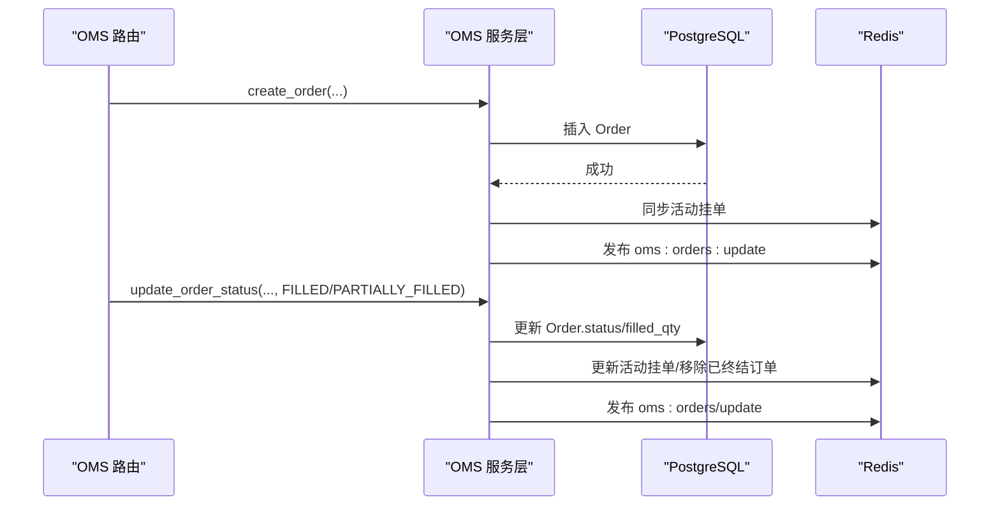
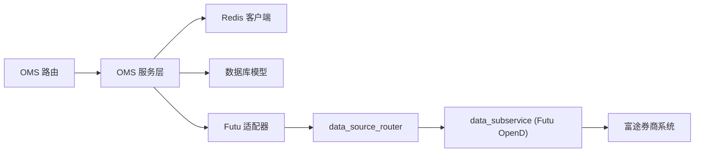

# 仓位管理

<cite>
**本文引用的文件**
- [backend/services/oms_service.py](file://backend/services/oms_service.py)
- [backend/routers/oms.py](file://backend/routers/oms.py)
- [backend/app/oms_app.py](file://backend/app/oms_app.py)
- [backend/core/redis_client.py](file://backend/core/redis_client.py)
- [backend/services/datasource/adapters/futu.py](file://backend/services/datasource/adapters/futu.py)
</cite>

## 目录
1. [简介](#简介)
2. [项目结构](#项目结构)
3. [核心组件](#核心组件)
4. [架构总览](#架构总览)
5. [详细组件分析](#详细组件分析)
6. [依赖关系分析](#依赖关系分析)
7. [性能考量](#性能考量)
8. [故障排查指南](#故障排查指南)
9. [结论](#结论)
10. [附录：API使用示例](#附录api使用示例)

## 简介
本技术文档聚焦于“仓位管理系统”的实现与运行机制，覆盖从富途（Futu）券商接口拉取真实持仓、多市场独立跟踪、Redis缓存策略（TTL与更新机制）、与订单系统的关联与一致性保证、异常处理方案，以及面向前端的实时与历史持仓查询API。文档以代码级为依据，提供架构图、时序图与流程图，帮助读者快速理解并正确使用该系统。

## 项目结构
与仓位管理直接相关的后端模块主要分布在以下位置：
- OMS服务层：负责订单持久化、活动挂单同步、持仓同步与广播等核心逻辑
- OMS路由层：暴露REST与WebSocket接口，提供状态查询、熔断、模式切换、持仓读取等能力
- Redis基础设施：提供连接池、批量写入队列与进程内L1缓存，支撑高频读写与低延迟
- Futu数据源适配器：统一通过data_source_router访问富途子服务，获取账户与持仓信息

图表来源
- [backend/routers/oms.py:180-184](file://backend/routers/oms.py#L180-L184)
- [backend/services/oms_service.py:155-182](file://backend/services/oms_service.py#L155-L182)
- [backend/services/datasource/adapters/futu.py:130-180](file://backend/services/datasource/adapters/futu.py#L130-L180)
- [backend/core/redis_client.py:14-34](file://backend/core/redis_client.py#L14-L34)

章节来源
- [backend/routers/oms.py:180-184](file://backend/routers/oms.py#L180-L184)
- [backend/services/oms_service.py:155-182](file://backend/services/oms_service.py#L155-L182)
- [backend/services/datasource/adapters/futu.py:130-180](file://backend/services/datasource/adapters/futu.py#L130-L180)
- [backend/core/redis_client.py:14-34](file://backend/core/redis_client.py#L14-L34)

## 核心组件
- OMS服务层（OmsService）
  - 订单持久化与状态更新，活动挂单列表维护
  - 持仓同步：从富途拉取账户/持仓信息，写入Redis并按市场分片
  - 事件广播：通过Redis PubSub推送订单、成交、持仓、模式变更等事件
- OMS路由层（/oms）
  - 提供持仓查询、状态查询、熔断、改单/撤单、交易模式切换、WebSocket实时推送
- Redis基础设施
  - 全局连接池、异步批量写入队列、进程内L1缓存，降低网络开销与RTT
- Futu数据源适配器
  - 统一封装对富途子服务的HTTP调用，支持ACCOUNT_INFO等能力，解耦本地SDK依赖

章节来源
- [backend/services/oms_service.py:29-193](file://backend/services/oms_service.py#L29-L193)
- [backend/routers/oms.py:56-184](file://backend/routers/oms.py#L56-L184)
- [backend/core/redis_client.py:14-34](file://backend/core/redis_client.py#L14-L34)
- [backend/services/datasource/adapters/futu.py:34-81](file://backend/services/datasource/adapters/futu.py#L34-L81)

## 架构总览
仓位管理的整体流程如下：
- 定时或触发式任务调用OmsService.sync_positions_from_futu(market)，通过Futu适配器请求富途账户信息（包含持仓），将结果写入Redis并按市场分片存储，同时发布“持仓变更”消息
- 前端通过GET /oms/positions?market=HK|US等接口读取Redis中的最新持仓；或通过WebSocket订阅oms:positions:update通道接收增量推送
- 订单与持仓的关联：下单成功后创建订单记录并同步到Redis活动挂单；成交后更新订单状态与已成交量，并通过PubSub广播；持仓由富途侧返回，系统不直接计算持仓，而是以富途为准进行缓存与展示

图表来源
- [backend/routers/oms.py:180-184](file://backend/routers/oms.py#L180-L184)
- [backend/services/oms_service.py:155-182](file://backend/services/oms_service.py#L155-L182)
- [backend/services/datasource/adapters/futu.py:130-180](file://backend/services/datasource/adapters/futu.py#L130-L180)
- [backend/core/redis_client.py:14-34](file://backend/core/redis_client.py#L14-L34)

## 详细组件分析

### 持仓同步与缓存（OMS-04）
- 数据来源：通过Futu适配器调用ACCOUNT_INFO能力，获取账户与持仓信息
- 缓存策略：按市场分片键quant:oms:positions:{market}，设置短TTL（30秒），确保近实时性
- 更新机制：后台守护进程或定时任务调用sync_positions_from_futu，完成后发布oms:positions:update事件，前端可订阅该通道实现增量刷新
- 读取路径：get_cached_positions优先读Redis，若未命中则返回空数组（由上层决定是否触发同步）

图表来源
- [backend/services/oms_service.py:155-193](file://backend/services/oms_service.py#L155-L193)
- [backend/services/datasource/adapters/futu.py:130-180](file://backend/services/datasource/adapters/futu.py#L130-L180)

章节来源
- [backend/services/oms_service.py:155-193](file://backend/services/oms_service.py#L155-L193)
- [backend/services/datasource/adapters/futu.py:130-180](file://backend/services/datasource/adapters/futu.py#L130-L180)

### 多市场持仓管理
- 键空间设计：quant:oms:positions:{market}，支持HK、US等多市场独立跟踪
- 读取与写入均按市场隔离，避免跨市场数据污染
- 可通过传入不同market参数分别获取各市场持仓

章节来源
- [backend/services/oms_service.py:24-26](file://backend/services/oms_service.py#L24-L26)
- [backend/services/oms_service.py:155-193](file://backend/services/oms_service.py#L155-L193)

### 订单与持仓的关联关系
- 订单生命周期：创建订单→落库→同步至Redis活动挂单→状态更新（部分成交/全部成交/取消）→从活动挂单移除
- 成交记录：从trade_logs表读取历史成交，用于OMS面板展示
- 持仓计算：系统以富途返回的持仓为准，不做本地重算；订单成交仅影响活动挂单与历史成交展示，持仓变化由富途侧推送/轮询后写入缓存

图表来源
- [backend/services/oms_service.py:34-114](file://backend/services/oms_service.py#L34-L114)
- [backend/routers/oms.py:120-177](file://backend/routers/oms.py#L120-L177)

章节来源
- [backend/services/oms_service.py:34-114](file://backend/services/oms_service.py#L34-L114)
- [backend/routers/oms.py:120-177](file://backend/routers/oms.py#L120-L177)

### Redis缓存策略与一致性
- 活动挂单缓存：quant:oms:active_orders，TTL=300秒，写路径在订单创建/状态更新时维护
- 持仓缓存：quant:oms:positions:{market}，TTL=30秒，写路径在持仓同步完成后维护
- 交易模式缓存：quant:oms:trading_mode，无固定过期时间，热切换后立即生效
- 一致性保障：
  - 写路径采用“先写DB再写Redis+广播”的顺序，保证最终一致
  - 读路径优先读Redis，未命中时回源DB或触发同步
  - 通过PubSub通道广播变更，前端订阅实现近实时更新

章节来源
- [backend/services/oms_service.py:118-143](file://backend/services/oms_service.py#L118-L143)
- [backend/services/oms_service.py:155-193](file://backend/services/oms_service.py#L155-L193)
- [backend/routers/oms.py:321-371](file://backend/routers/oms.py#L321-L371)
- [backend/core/redis_client.py:14-34](file://backend/core/redis_client.py#L14-L34)

### 异常处理与降级
- 富途适配器错误分类：限流（429/Rate limit）标记为rate_limited；其他失败根据action决定是否重试
- 持仓同步异常：捕获异常并记录日志，返回空列表，避免阻塞上游
- 订单操作异常：数据库回滚、Redis锁释放、抛出HTTP异常
- 熔断Kill Switch：广播信号、执行物理清仓、停止Bot/算法、标记所有活动订单为CANCELLED

章节来源
- [backend/services/datasource/adapters/futu.py:130-180](file://backend/services/datasource/adapters/futu.py#L130-L180)
- [backend/services/oms_service.py:155-182](file://backend/services/oms_service.py#L155-L182)
- [backend/routers/oms.py:94-117](file://backend/routers/oms.py#L94-L117)
- [backend/app/oms_app.py:24-53](file://backend/app/oms_app.py#L24-L53)

## 依赖关系分析
- OMS路由依赖OMS服务层、Redis客户端、审计服务、算法引擎与Bot运行时
- OMS服务层依赖数据库模型（Order、TradeLog）、Redis客户端、富途数据源适配器
- Futu适配器依赖data_source_router，统一远程访问富途子服务
- Redis基础设施提供连接池、批量写入与L1缓存，被多个模块复用

图表来源
- [backend/routers/oms.py:18-27](file://backend/routers/oms.py#L18-L27)
- [backend/services/oms_service.py:16-21](file://backend/services/oms_service.py#L16-L21)
- [backend/services/datasource/adapters/futu.py:130-180](file://backend/services/datasource/adapters/futu.py#L130-L180)

章节来源
- [backend/routers/oms.py:18-27](file://backend/routers/oms.py#L18-L27)
- [backend/services/oms_service.py:16-21](file://backend/services/oms_service.py#L16-L21)
- [backend/services/datasource/adapters/futu.py:130-180](file://backend/services/datasource/adapters/futu.py#L130-L180)

## 性能考量
- 短TTL持仓缓存（30秒）：平衡实时性与负载，适合盘中高频刷新
- 活动挂单缓存（300秒）：减少DB压力，提升列表页加载速度
- Redis批量写入队列：聚合高频set操作，降低TCP往返与带宽占用
- 进程内L1缓存：对极高频读取（如配置、开关）提供零延迟命中
- WebSocket推送：通过Redis PubSub将订单、成交、持仓、模式变更实时推送到前端，避免轮询

章节来源
- [backend/core/redis_client.py:46-177](file://backend/core/redis_client.py#L46-L177)
- [backend/core/redis_client.py:180-251](file://backend/core/redis_client.py#L180-L251)
- [backend/routers/oms.py:379-463](file://backend/routers/oms.py#L379-L463)

## 故障排查指南
- 持仓为空或陈旧
  - 检查Redis键是否存在且未过期：quant:oms:positions:{market}
  - 检查后台同步任务是否正常运行，查看日志中“持仓同步完成/失败”
  - 验证富途适配器返回状态是否为success
- 活动挂单不更新
  - 检查订单状态更新是否成功，确认Redis活动挂单缓存是否被正确维护
  - 检查PubSub通道oms:orders:update是否正常广播
- 熔断后订单未取消
  - 检查kill_switch是否成功广播，oms:status是否设置为KILLED
  - 确认mark_all_orders_cancelled是否执行成功
- 限流与失败
  - 富途适配器对429/Rate limit进行rate_limited标记，需等待退避或切换节点
  - 其他失败根据action决定是否重试，关注日志中的错误码与消息

章节来源
- [backend/services/oms_service.py:155-182](file://backend/services/oms_service.py#L155-L182)
- [backend/routers/oms.py:94-117](file://backend/routers/oms.py#L94-L117)
- [backend/services/datasource/adapters/futu.py:130-180](file://backend/services/datasource/adapters/futu.py#L130-L180)

## 结论
本仓位管理系统以富途真实持仓为权威来源，结合Redis短TTL缓存与PubSub实时推送，实现了多市场独立跟踪、近实时展示与高吞吐读取。订单与持仓通过明确的数据边界与一致性策略协同工作，异常处理与熔断机制保障了系统在极端情况下的稳定性。通过REST与WebSocket双通道，前端可便捷地获取实时与历史数据，满足交易监控与决策需求。

## 附录：API使用示例
- 获取实时持仓（按市场）
  - 方法：GET
  - 路径：/oms/positions?market=HK
  - 说明：返回Redis缓存中的最新持仓；若未命中，可由上层触发同步
  - 参考实现：[backend/routers/oms.py:180-184](file://backend/routers/oms.py#L180-L184)

- 获取OMS初始状态（含活动挂单、历史成交、模式）
  - 方法：GET
  - 路径：/oms/state
  - 说明：聚合活动挂单、历史成交、Bot状态、算法执行与交易模式
  - 参考实现：[backend/routers/oms.py:56-84](file://backend/routers/oms.py#L56-L84)

- 触发全局熔断（Kill Switch）
  - 方法：POST
  - 路径：/oms/kill_switch
  - 说明：广播熔断信号，执行物理清仓、停止Bot/算法、标记活动订单为CANCELLED
  - 参考实现：[backend/routers/oms.py:94-117](file://backend/routers/oms.py#L94-L117), [backend/app/oms_app.py:24-53](file://backend/app/oms_app.py#L24-L53)

- 修改订单价格（改单）
  - 方法：POST
  - 路径：/oms/orders/{order_id}/modify
  - 说明：下发改单指令并更新DB与Redis活动挂单
  - 参考实现：[backend/routers/oms.py:149-177](file://backend/routers/oms.py#L149-L177)

- 撤销订单（幂等）
  - 方法：POST
  - 路径：/oms/orders/{order_id}/cancel
  - 说明：基于幂等键防止重复处理，更新DB与Redis并发布撤单事件
  - 参考实现：[backend/routers/oms.py:120-147](file://backend/routers/oms.py#L120-L147)

- 切换交易模式（SANDBOX/PAPER/LIVE）
  - 方法：POST
  - 路径：/oms/mode/switch
  - 说明：写入Redis立即生效，并通过PubSub广播模式变更
  - 参考实现：[backend/routers/oms.py:347-371](file://backend/routers/oms.py#L347-L371)

- WebSocket实时推送
  - 路径：/oms/ws?token={JWT}
  - 说明：订阅oms:bots/update、oms:orders/update、oms:trades/new、oms:positions/update、oms:mode_change等通道
  - 参考实现：[backend/routers/oms.py:379-463](file://backend/routers/oms.py#L379-L463)

章节来源
- [backend/routers/oms.py:56-184](file://backend/routers/oms.py#L56-L184)
- [backend/routers/oms.py:379-463](file://backend/routers/oms.py#L379-L463)
- [backend/app/oms_app.py:24-53](file://backend/app/oms_app.py#L24-L53)