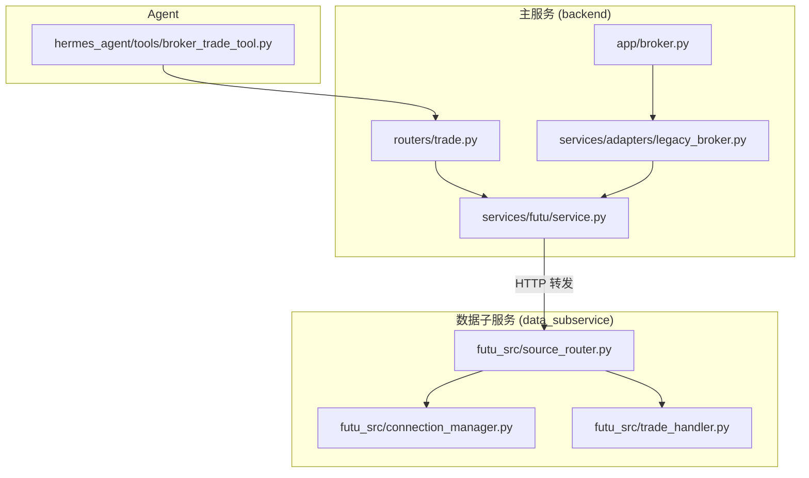
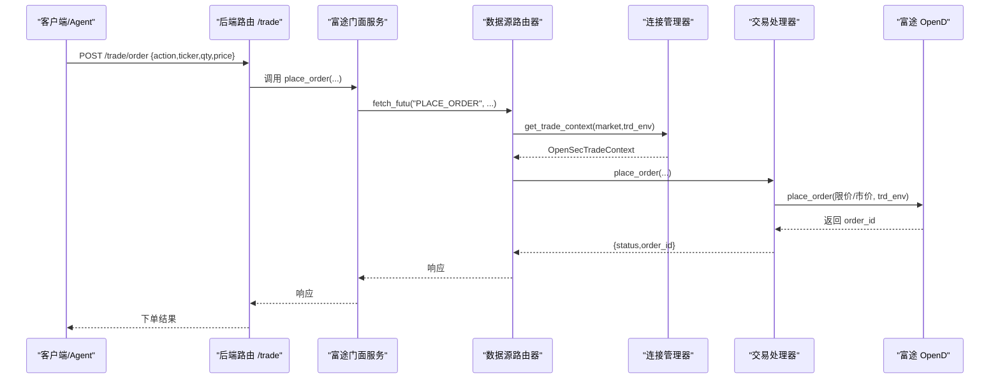
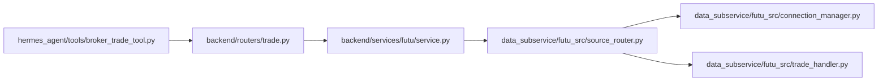

# 券商接口集成

<cite>
**本文引用的文件**
- [backend/app/broker.py](file://backend/app/broker.py)
- [backend/services/adapters/legacy_broker.py](file://backend/services/adapters/legacy_broker.py)
- [backend/services/futu/service.py](file://backend/services/futu/service.py)
- [backend/routers/trade.py](file://backend/routers/trade.py)
- [data_subservice/futu_src/trade_handler.py](file://data_subservice/futu_src/trade_handler.py)
- [data_subservice/futu_src/connection_manager.py](file://data_subservice/futu_src/connection_manager.py)
- [data_subservice/futu_src/source_router.py](file://data_subservice/futu_src/source_router.py)
- [hermes_agent/tools/broker_trade_tool.py](file://hermes_agent/tools/broker_trade_tool.py)
</cite>

## 目录
1. [简介](#简介)
2. [项目结构](#项目结构)
3. [核心组件](#核心组件)
4. [架构总览](#架构总览)
5. [详细组件分析](#详细组件分析)
6. [依赖关系分析](#依赖关系分析)
7. [性能与可靠性](#性能与可靠性)
8. [故障排查指南](#故障排查指南)
9. [结论](#结论)
10. [附录：API使用示例](#附录api使用示例)

## 简介
本技术文档面向“券商接口集成模块”，重点说明富途(Futu)接口的集成方式、配置方法、模拟交易与实盘切换机制、订单路由与分发逻辑、状态同步与成交回报处理，以及连接管理、重试机制与故障转移策略。同时给出与其他券商接口的适配层设计与扩展方法，并提供常用操作（下单、撤单、查询持仓等）的API调用示例路径。

## 项目结构
系统采用“主服务 + 数据子服务”的分层架构：
- 主服务（backend）：提供HTTP API、编排用例、统一门面（Facade），不直接持有外部SDK或本地OpenD连接。
- 数据子服务（data_subservice）：承载富途SDK直连能力，负责连接管理、行情/交易上下文、推送桥接、重试与熔断等。
- Agent工具（hermes_agent）：为大模型提供统一的OMS交互探针，通过后端REST访问交易能力。

**图表来源**
- [backend/routers/trade.py:1-57](file://backend/routers/trade.py#L1-L57)
- [backend/services/futu/service.py:1-213](file://backend/services/futu/service.py#L1-L213)
- [backend/services/adapters/legacy_broker.py:1-109](file://backend/services/adapters/legacy_broker.py#L1-L109)
- [backend/app/broker.py:1-10](file://backend/app/broker.py#L1-L10)
- [data_subservice/futu_src/connection_manager.py:1-351](file://data_subservice/futu_src/connection_manager.py#L1-L351)
- [data_subservice/futu_src/trade_handler.py:1-254](file://data_subservice/futu_src/trade_handler.py#L1-L254)
- [data_subservice/futu_src/source_router.py:1-80](file://data_subservice/futu_src/source_router.py#L1-L80)
- [hermes_agent/tools/broker_trade_tool.py:1-63](file://hermes_agent/tools/broker_trade_tool.py#L1-L63)

**章节来源**
- [backend/routers/trade.py:1-57](file://backend/routers/trade.py#L1-L57)
- [backend/services/futu/service.py:1-213](file://backend/services/futu/service.py#L1-L213)
- [data_subservice/futu_src/connection_manager.py:1-351](file://data_subservice/futu_src/connection_manager.py#L1-L351)
- [data_subservice/futu_src/trade_handler.py:1-254](file://data_subservice/futu_src/trade_handler.py#L1-L254)
- [data_subservice/futu_src/source_router.py:1-80](file://data_subservice/futu_src/source_router.py#L1-L80)
- [hermes_agent/tools/broker_trade_tool.py:1-63](file://hermes_agent/tools/broker_trade_tool.py#L1-L63)

## 核心组件
- 交易路由层（backend/routers/trade.py）：暴露 /trade/order 与 /trade/account 等REST端点，负责请求校验与鉴权注入。
- 富途门面服务（backend/services/futu/service.py）：纯HTTP透传Facade，将业务方法映射为 action 并经由 data_source_router.fetch_futu 转发至子服务。
- 旧版Broker网关（backend/services/adapters/legacy_broker.py）：封装下单、撤单、查单、账户查询与Kill Switch清仓，统一走数据源路由。
- 连接管理器（data_subservice/futu_src/connection_manager.py）：管理行情与交易上下文、连接目标切换、解锁、推送注册、线程安全与跨网络加密。
- 交易处理器（data_subservice/futu_src/trade_handler.py）：实现下单、改单/撤单、订单查询、紧急清仓、账户信息与持仓获取，支持模拟/实盘环境切换。
- 数据源路由器（data_subservice/futu_src/source_router.py）：本地模式路由到 LocalDataSource，供主服务远程-only场景下的兼容。
- Agent工具（hermes_agent/tools/broker_trade_tool.py）：统一OMS交互探针，调用后端REST完成买入/卖出/撤单/状态/账户查询。

**章节来源**
- [backend/routers/trade.py:1-57](file://backend/routers/trade.py#L1-L57)
- [backend/services/futu/service.py:1-213](file://backend/services/futu/service.py#L1-L213)
- [backend/services/adapters/legacy_broker.py:1-109](file://backend/services/adapters/legacy_broker.py#L1-L109)
- [data_subservice/futu_src/connection_manager.py:1-351](file://data_subservice/futu_src/connection_manager.py#L1-L351)
- [data_subservice/futu_src/trade_handler.py:1-254](file://data_subservice/futu_src/trade_handler.py#L1-L254)
- [data_subservice/futu_src/source_router.py:1-80](file://data_subservice/futu_src/source_router.py#L1-L80)
- [hermes_agent/tools/broker_trade_tool.py:1-63](file://hermes_agent/tools/broker_trade_tool.py#L1-L63)

## 架构总览
富途接入采用“主服务远程-only + 子服务直连OpenD”的解耦设计：
- 主服务不导入任何富途SDK，所有能力通过 DataSourceRouter.fetch_futu(action, **params) 以HTTP形式下发到子服务。
- 子服务维护 OpenQuoteContext/OpenSecTradeContext，负责连接、解锁、推送桥接与重试。
- 交易与环境隔离由环境变量控制：FUTU_TRD_ENV=REAL/SIMULATE 决定实盘/模拟；FUTU_HOST/FUTU_PORT 指定OpenD目标；跨网络时启用加密与RSA私钥。

**图表来源**
- [backend/routers/trade.py:30-39](file://backend/routers/trade.py#L30-L39)
- [backend/services/futu/service.py:179-190](file://backend/services/futu/service.py#L179-L190)
- [data_subservice/futu_src/trade_handler.py:25-63](file://data_subservice/futu_src/trade_handler.py#L25-L63)
- [data_subservice/futu_src/connection_manager.py:217-279](file://data_subservice/futu_src/connection_manager.py#L217-L279)

## 详细组件分析

### 富途门面服务（backend/services/futu/service.py）
- 角色：对外保持与原本地实现一致的API签名，内部仅做参数转换并通过 data_source_router.fetch_futu 转发。
- 关键行为：
  - 方法名到 action 的映射（如 PLACE_ORDER、MODIFY_ORDER、QUERY_ORDER、ACCOUNT_INFO）。
  - 枚举值透传（TrdSide/TrdMarket/ModifyOrderOp）。
  - 连接管理兼容占位（无本地OpenD，仅用于管理端展示）。
- 错误处理：当子服务不可用时返回统一错误结构。

**章节来源**
- [backend/services/futu/service.py:1-213](file://backend/services/futu/service.py#L1-L213)

### 旧版Broker网关（backend/services/adapters/legacy_broker.py）
- 角色：统一BrokerPort表面，封装市场解析、下单/撤单/查单/账户查询与Kill Switch清仓。
- 关键行为：
  - 市场解析：根据ticker或传入market推断 TrdMarket。
  - Kill Switch：经数据源路由调用 EMERGENCY_LIQUIDATION，在子服务侧执行物理撤单+市价平仓。
- 健康检查：通过 data_source_router.health_check("futu") 判断远程可达性。

**章节来源**
- [backend/services/adapters/legacy_broker.py:17-109](file://backend/services/adapters/legacy_broker.py#L17-L109)

### 交易处理器（data_subservice/futu_src/trade_handler.py）
- 角色：实现富途交易相关能力（下单、改单/撤单、订单查询、紧急清仓、账户信息）。
- 模拟/实盘切换：
  - 默认使用 TrdEnv.SIMULATE。
  - 账户信息查询读取环境变量 FUTU_TRD_ENV，REAL 则切换到实盘环境。
- 解锁与风控：
  - 交易前尝试解锁（unlock_trade_if_needed），失败时返回锁定状态，避免误伤行情通道。
  - 紧急清仓：先查询待提交订单并批量撤单，再查询持仓进行市价平仓。
- 重试机制：方法级装饰器 with_global_retry 提供全局重试保护。

**章节来源**
- [data_subservice/futu_src/trade_handler.py:19-254](file://data_subservice/futu_src/trade_handler.py#L19-L254)

### 连接管理器（data_subservice/futu_src/connection_manager.py）
- 角色：管理行情与交易上下文、连接目标切换、解锁、推送注册、线程安全与跨网络加密。
- 关键特性：
  - 快速探测OpenD可达性，避免SDK后台无限重试。
  - 跨网络连接强制加密，需配置 RSA 私钥或解锁密码，否则拒绝创建交易上下文，防止线程泄漏。
  - 统一解锁流程 unlock_trade_if_needed，返回布尔表示是否成功。
  - 运行时切换 host/port，自动关闭旧连接并重建。
  - 推送模式：连接成功后注册推送处理器，桥接到Redis PubSub。

**章节来源**
- [data_subservice/futu_src/connection_manager.py:44-351](file://data_subservice/futu_src/connection_manager.py#L44-L351)

### 数据源路由器（data_subservice/futu_src/source_router.py）
- 角色：本地模式路由到 LocalDataSource，供主服务远程-only场景下的兼容。
- 当前行为：始终返回 local 模式，实际富途能力由主服务通过 HTTP 转发到子服务。

**章节来源**
- [data_subservice/futu_src/source_router.py:18-80](file://data_subservice/futu_src/source_router.py#L18-L80)

### Agent工具（hermes_agent/tools/broker_trade_tool.py）
- 角色：大模型统一的OMS交互探针，封装BUY/SELL/CANCEL/STATUS/ACCOUNT动作。
- 调用路径：通过 SecureAsyncClient 调用后端 REST /trade/order 与 /trade/account。

**章节来源**
- [hermes_agent/tools/broker_trade_tool.py:1-63](file://hermes_agent/tools/broker_trade_tool.py#L1-L63)

## 依赖关系分析
- 主服务对富途SDK零依赖，全部能力通过数据源路由HTTP转发。
- 子服务集中持有富途SDK连接与上下文，承担连接稳定性、重试与推送。
- 交易与环境隔离由环境变量驱动，避免硬编码。

**图表来源**
- [backend/routers/trade.py:1-57](file://backend/routers/trade.py#L1-L57)
- [backend/services/futu/service.py:1-213](file://backend/services/futu/service.py#L1-L213)
- [data_subservice/futu_src/source_router.py:1-80](file://data_subservice/futu_src/source_router.py#L1-L80)
- [data_subservice/futu_src/connection_manager.py:1-351](file://data_subservice/futu_src/connection_manager.py#L1-L351)
- [data_subservice/futu_src/trade_handler.py:1-254](file://data_subservice/futu_src/trade_handler.py#L1-L254)
- [hermes_agent/tools/broker_trade_tool.py:1-63](file://hermes_agent/tools/broker_trade_tool.py#L1-L63)

**章节来源**
- [backend/routers/trade.py:1-57](file://backend/routers/trade.py#L1-L57)
- [backend/services/futu/service.py:1-213](file://backend/services/futu/service.py#L1-L213)
- [data_subservice/futu_src/source_router.py:1-80](file://data_subservice/futu_src/source_router.py#L1-L80)
- [data_subservice/futu_src/connection_manager.py:1-351](file://data_subservice/futu_src/connection_manager.py#L1-L351)
- [data_subservice/futu_src/trade_handler.py:1-254](file://data_subservice/futu_src/trade_handler.py#L1-L254)
- [hermes_agent/tools/broker_trade_tool.py:1-63](file://hermes_agent/tools/broker_trade_tool.py#L1-L63)

## 性能与可靠性
- 连接稳定性：
  - 快速探测OpenD可达性，避免SDK后台线程无限重试。
  - 跨网络交易连接强制加密，未配置解锁密码或RSA私钥时拒绝创建交易上下文，防止线程泄漏。
  - 统一解锁流程，失败时明确返回锁定状态，避免误伤行情通道。
- 重试机制：
  - 交易方法使用 with_global_retry 装饰器，提供全局重试保护。
- 推送与拉取双模式：
  - 连接成功后注册推送处理器，桥接到Redis PubSub；若禁用则退化为拉取模式。
- 资源回收：
  - 强制daemon线程，进程退出即回收；close时释放旧上下文，避免回调线程累积。

[本节为通用指导，无需特定文件引用]

## 故障排查指南
- 常见症状与定位：
  - “OpenD 不可达”：检查 FUTU_HOST/FUTU_PORT 与网络连通性。
  - “交易服务已屏蔽”：跨网络缺少解锁密码或RSA私钥，需配置 FUTU_PWD_UNLOCK 或 FUTU_RSA_PRIVATE_KEY。
  - “OpenD 交易连接未解锁”：需在OpenD界面手动解锁或配置解锁密码。
  - “子服务不可用”：检查数据子服务进程与健康检查。
- 建议步骤：
  - 查看连接管理器日志，确认 status 与 error_msg。
  - 核对环境变量与OpenD配置（加密、解锁、端口）。
  - 通过 /trade/account 验证账户与持仓是否正常。
  - 使用紧急清仓接口进行风险控制演练。

**章节来源**
- [data_subservice/futu_src/connection_manager.py:59-160](file://data_subservice/futu_src/connection_manager.py#L59-L160)
- [data_subservice/futu_src/connection_manager.py:217-279](file://data_subservice/futu_src/connection_manager.py#L217-L279)
- [data_subservice/futu_src/trade_handler.py:179-254](file://data_subservice/futu_src/trade_handler.py#L179-L254)

## 结论
本模块通过“主服务远程-only + 子服务直连OpenD”的架构，实现了富途接口的稳定接入与可扩展性。模拟与实盘切换由环境变量驱动，订单路由与分发清晰可控，连接管理与重试机制保障了高可用。未来可基于相同模式扩展其他券商接口，复用数据源路由与连接管理层。

[本节为总结，无需特定文件引用]

## 附录：API使用示例
以下示例展示常用操作的调用路径与参数要点，具体实现细节请参考对应源码位置。

- 下单（买入/卖出）
  - 端点：POST /trade/order
  - 参数：action(BUY/SELL)、ticker、qty、price（可选，市价单可不填）
  - 参考路径：
    - [后端路由定义:30-39](file://backend/routers/trade.py#L30-L39)
    - [富途门面下单方法:179-190](file://backend/services/futu/service.py#L179-L190)
    - [子服务下单实现:25-63](file://data_subservice/futu_src/trade_handler.py#L25-L63)

- 撤单
  - 端点：POST /trade/order（action=CANCEL，需提供order_id）
  - 参考路径：
    - [后端路由定义:30-39](file://backend/routers/trade.py#L30-L39)
    - [富途门面改单方法:192-198](file://backend/services/futu/service.py#L192-L198)
    - [子服务改单/撤单实现:65-77](file://data_subservice/futu_src/trade_handler.py#L65-L77)

- 查询订单状态
  - 端点：POST /trade/order（action=STATUS，需提供order_id）
  - 参考路径：
    - [后端路由定义:30-39](file://backend/routers/trade.py#L30-L39)
    - [富途门面查单方法:200-205](file://backend/services/futu/service.py#L200-L205)
    - [子服务订单查询实现:79-103](file://data_subservice/futu_src/trade_handler.py#L79-L103)

- 查询账户资产与持仓
  - 端点：GET /trade/account?market=HK|US
  - 参考路径：
    - [后端路由定义:42-44](file://backend/routers/trade.py#L42-L44)
    - [富途门面账户查询:207-208](file://backend/services/futu/service.py#L207-L208)
    - [子服务账户与持仓获取:179-254](file://data_subservice/futu_src/trade_handler.py#L179-L254)

- Agent统一OMS交互
  - 工具：manage_broker_orders_and_account
  - 动作：BUY/SELL/CANCEL/STATUS/ACCOUNT
  - 参考路径：
    - [Agent工具实现:1-63](file://hermes_agent/tools/broker_trade_tool.py#L1-L63)

**章节来源**
- [backend/routers/trade.py:30-44](file://backend/routers/trade.py#L30-L44)
- [backend/services/futu/service.py:179-208](file://backend/services/futu/service.py#L179-L208)
- [data_subservice/futu_src/trade_handler.py:25-103](file://data_subservice/futu_src/trade_handler.py#L25-L103)
- [data_subservice/futu_src/trade_handler.py:179-254](file://data_subservice/futu_src/trade_handler.py#L179-L254)
- [hermes_agent/tools/broker_trade_tool.py:1-63](file://hermes_agent/tools/broker_trade_tool.py#L1-L63)
