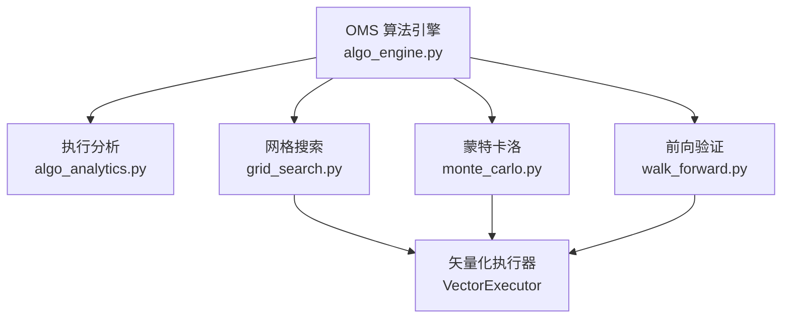
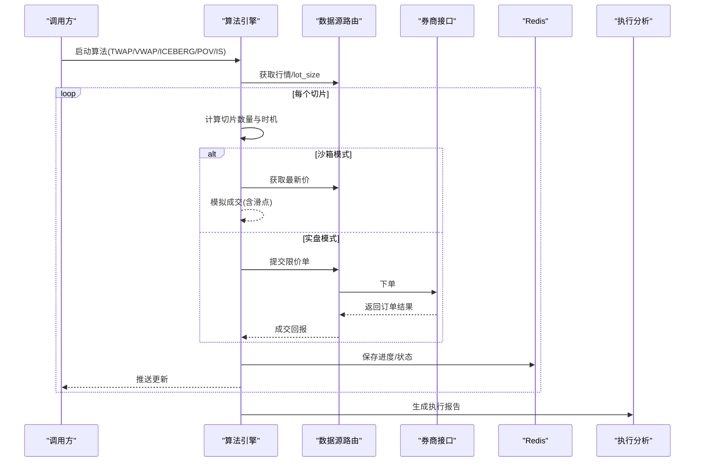
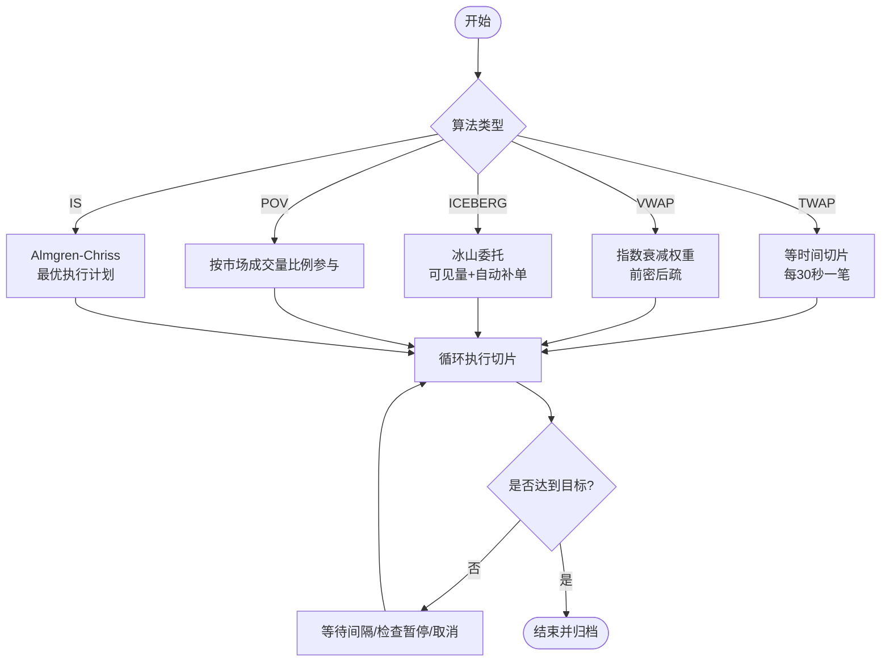
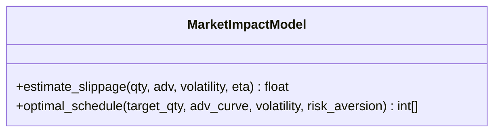
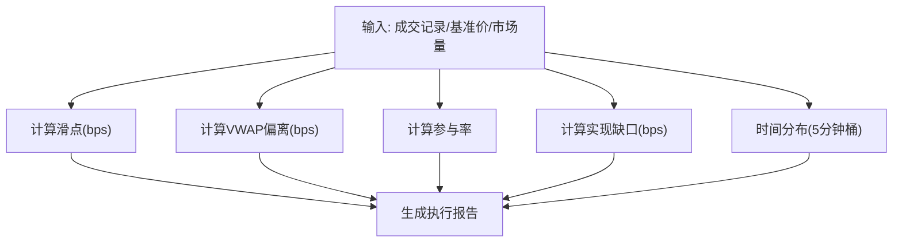
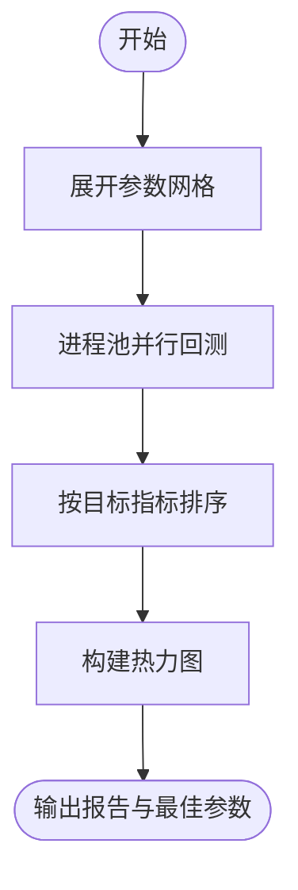
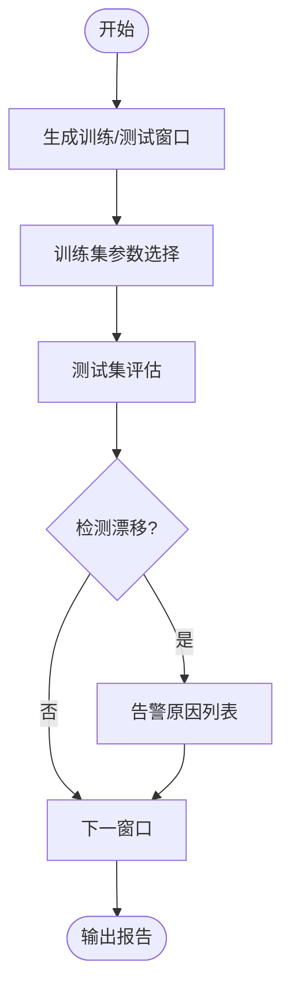
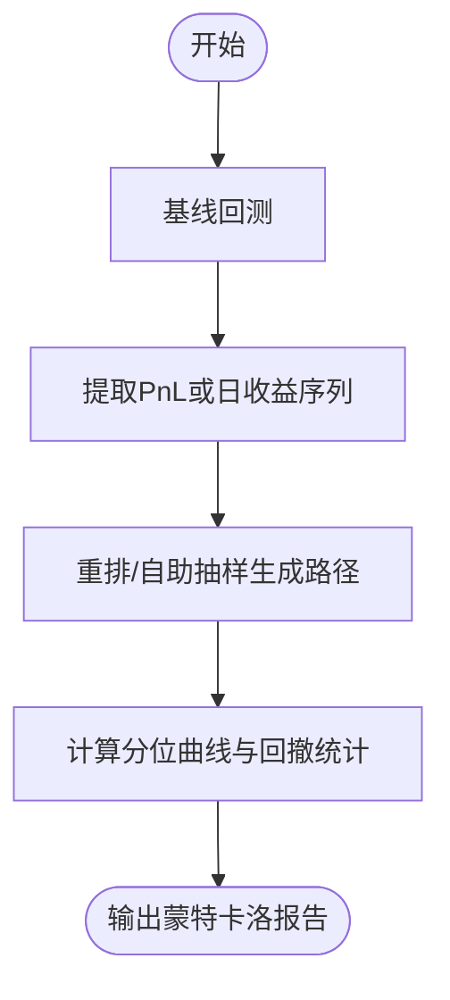
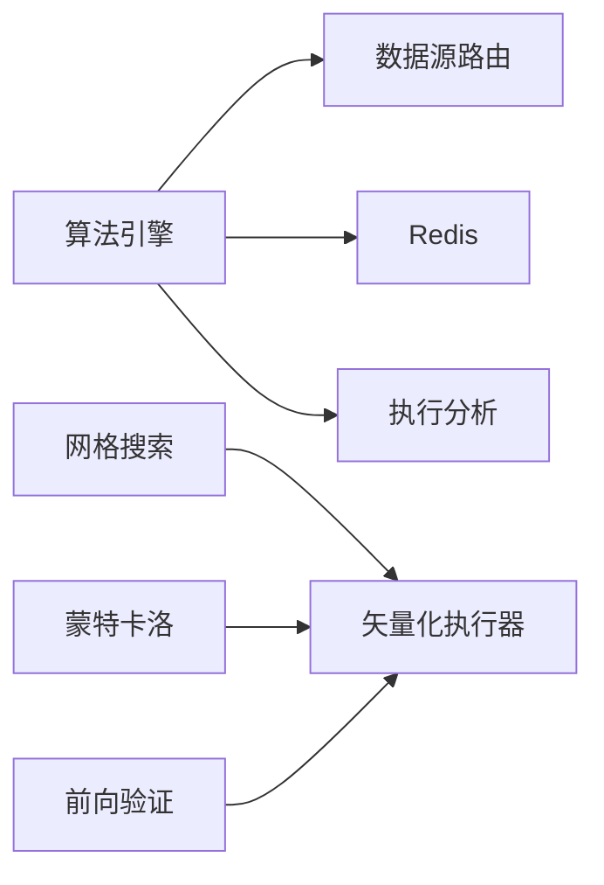

# 执行算法

<cite>
**本文引用的文件**
- [backend/workers/oms/algo_engine.py](file://backend/workers/oms/algo_engine.py)
- [backend/domain/algo_analytics.py](file://backend/domain/algo_analytics.py)
- [backend/engine/grid_search.py](file://backend/engine/grid_search.py)
- [backend/engine/monte_carlo.py](file://backend/engine/monte_carlo.py)
- [backend/engine/walk_forward.py](file://backend/engine/walk_forward.py)
</cite>

## 目录
1. [简介](#简介)
2. [项目结构](#项目结构)
3. [核心组件](#核心组件)
4. [架构总览](#架构总览)
5. [详细组件分析](#详细组件分析)
6. [依赖关系分析](#依赖关系分析)
7. [性能考量](#性能考量)
8. [故障排查指南](#故障排查指南)
9. [结论](#结论)
10. [附录：配置与使用示例](#附录配置与使用示例)

## 简介
本技术文档聚焦“执行算法模块”，系统阐述支持的订单类型（TWAP、VWAP、冰山、POV、IS）、参数优化机制（网格搜索、前向验证、蒙特卡洛模拟）、执行控制流程（订单拆分、执行时机选择、滑点控制）、配置与使用方式、回测评估方法，以及与券商接口的集成与兼容性考虑。文档面向不同技术背景的读者，提供从概览到代码级细节的渐进式说明，并辅以图表帮助理解。

## 项目结构
执行算法相关能力分布在以下模块：
- 算法拆单引擎：负责 TWAP/VWAP/ICEBERG/POV/IS 的执行调度、状态持久化、成交模拟与真实下单桥接。
- 执行分析：计算滑点、VWAP偏离、参与率、实现缺口等质量指标，生成执行报告。
- 参数优化：网格搜索、滚动前向验证、蒙特卡洛模拟，用于策略与执行参数的稳健性评估。
- 回测基础设施：矢量化执行器与指标计算，为优化与评估提供统一基线。

**图示来源**
- [backend/workers/oms/algo_engine.py:251-399](file://backend/workers/oms/algo_engine.py#L251-L399)
- [backend/domain/algo_analytics.py:19-269](file://backend/domain/algo_analytics.py#L19-L269)
- [backend/engine/grid_search.py:221-297](file://backend/engine/grid_search.py#L221-L297)
- [backend/engine/monte_carlo.py:149-254](file://backend/engine/monte_carlo.py#L149-L254)
- [backend/engine/walk_forward.py:176-243](file://backend/engine/walk_forward.py#L176-L243)

**章节来源**
- [backend/workers/oms/algo_engine.py:1-785](file://backend/workers/oms/algo_engine.py#L1-L785)
- [backend/domain/algo_analytics.py:1-270](file://backend/domain/algo_analytics.py#L1-L270)
- [backend/engine/grid_search.py:1-297](file://backend/engine/grid_search.py#L1-L297)
- [backend/engine/monte_carlo.py:1-254](file://backend/engine/monte_carlo.py#L1-L254)
- [backend/engine/walk_forward.py:1-340](file://backend/engine/walk_forward.py#L1-L340)

## 核心组件
- 算法拆单引擎：管理算法生命周期（启动、暂停、恢复、取消），按策略执行切片下单，维护进度与状态，支持沙箱模拟与实盘下单切换。
- 市场冲击模型：基于 Almgren-Chriss 简化模型估计滑点与最优执行计划，支撑 IS 策略。
- 执行分析：计算滑点、VWAP偏离、参与率、实现缺口、时间分布，输出执行质量评估。
- 参数优化：
  - 网格搜索：笛卡尔积展开参数空间，并行矢量化回测，输出最佳参数与热力图。
  - 前向验证：滚动/锚定窗口训练与样本外验证，检测性能漂移。
  - 蒙特卡洛：对交易盈亏或日收益重排/自助抽样，生成分位权益曲线与最坏回撤。

**章节来源**
- [backend/workers/oms/algo_engine.py:100-192](file://backend/workers/oms/algo_engine.py#L100-L192)
- [backend/domain/algo_analytics.py:19-269](file://backend/domain/algo_analytics.py#L19-L269)
- [backend/engine/grid_search.py:88-140](file://backend/engine/grid_search.py#L88-L140)
- [backend/engine/walk_forward.py:28-43](file://backend/engine/walk_forward.py#L28-L43)
- [backend/engine/monte_carlo.py:32-52](file://backend/engine/monte_carlo.py#L32-L52)

## 架构总览
执行算法的整体流程如下：
- 上层通过 OMS 服务发起算法任务（如 TWAP/VWAP/ICEBERG/POV/IS）。
- 算法引擎根据策略类型生成切片计划，循环执行下单；在沙箱模式获取行情并模拟成交，在实盘模式通过数据源路由调用券商接口。
- 执行过程中持续将进度写入 Redis 并广播更新；完成后归档历史。
- 执行分析模块对成交记录进行质量评估，生成报告。
- 参数优化模块对策略与执行参数进行网格搜索、前向验证与蒙特卡洛模拟，辅助选择稳健参数。

**图示来源**
- [backend/workers/oms/algo_engine.py:263-399](file://backend/workers/oms/algo_engine.py#L263-L399)
- [backend/workers/oms/algo_engine.py:617-702](file://backend/workers/oms/algo_engine.py#L617-L702)
- [backend/domain/algo_analytics.py:171-249](file://backend/domain/algo_analytics.py#L171-L249)

## 详细组件分析

### 算法拆单引擎（AlgoEngine）
- 支持的算法类型与控制流：
  - TWAP：等时间切片，固定间隔下单，确保均匀暴露。
  - VWAP：指数衰减权重分配，前期多量、后期少量，贴近成交量分布。
  - ICEBERG：仅显示可见量，逐笔补单，降低信息泄露。
  - POV：按市场成交量百分比参与，匹配流动性节奏。
  - IS：基于 Almgren-Chriss 的最优执行计划，权衡风险厌恶与冲击成本。
- 订单拆分与整手对齐：港股 lot_size 动态获取，不足一手时向上取整或最后一笔特殊处理。
- 执行时机选择：每切片等待固定间隔（如 30s/15s），支持暂停/恢复/取消。
- 滑点控制：沙箱模式以随机微小滑点模拟；实盘模式通过限价单与实时报价控制成交价。
- 状态持久化与恢复：运行中状态写入 Redis Hash，完成/取消/错误归档至 List；重启可从 Redis 恢复。

**图示来源**
- [backend/workers/oms/algo_engine.py:369-616](file://backend/workers/oms/algo_engine.py#L369-L616)

**章节来源**
- [backend/workers/oms/algo_engine.py:251-399](file://backend/workers/oms/algo_engine.py#L251-L399)
- [backend/workers/oms/algo_engine.py:400-616](file://backend/workers/oms/algo_engine.py#L400-L616)
- [backend/workers/oms/algo_engine.py:704-775](file://backend/workers/oms/algo_engine.py#L704-L775)

### 市场冲击模型（Almgren-Chriss 简化）
- 滑点估计：基于波动率、日均成交量与冲击系数估算 bps 滑点。
- 最优执行计划：按 ADV 曲线与风险厌恶系数分配各时段执行量，平衡价格风险与冲击成本。

**图示来源**
- [backend/workers/oms/algo_engine.py:100-192](file://backend/workers/oms/algo_engine.py#L100-L192)

**章节来源**
- [backend/workers/oms/algo_engine.py:100-192](file://backend/workers/oms/algo_engine.py#L100-L192)

### 执行分析（AlgoAnalytics）
- 关键指标：
  - 滑点：实际均价与基准价的偏差（bps）。
  - VWAP偏离：算法实际成交与市场价 VWAP 的偏差（bps）。
  - 参与率：算法成交量占同期市场总量的比例。
  - 实现缺口：实际成本与纸面成本的差异（bps）。
  - 时间分布：按 5 分钟桶聚合成交，展示执行节奏。
- 执行报告：汇总摘要、质量指标、时间分布与总体评估等级。

**图示来源**
- [backend/domain/algo_analytics.py:19-269](file://backend/domain/algo_analytics.py#L19-L269)

**章节来源**
- [backend/domain/algo_analytics.py:19-269](file://backend/domain/algo_analytics.py#L19-L269)

### 参数优化：网格搜索（GridSearch）
- 参数网格展开：笛卡尔积组合，限制最大组合数避免爆炸。
- 并发执行：进程池并行运行矢量化回测，单格失败不影响整体。
- 结果排序与可视化：按目标指标排序，构建 ECharts 热力图矩阵。

**图示来源**
- [backend/engine/grid_search.py:121-297](file://backend/engine/grid_search.py#L121-L297)

**章节来源**
- [backend/engine/grid_search.py:88-140](file://backend/engine/grid_search.py#L88-L140)
- [backend/engine/grid_search.py:221-297](file://backend/engine/grid_search.py#L221-L297)

### 参数优化：前向验证（Walk-Forward）
- 窗口生成：滚动或锚定窗口划分训练集与测试集。
- 参数选择：在训练集内网格搜索选择最佳参数。
- 样本外评估：在测试集上评估并检测性能漂移（夏普缺口、趋势恶化等）。

**图示来源**
- [backend/engine/walk_forward.py:126-243](file://backend/engine/walk_forward.py#L126-L243)
- [backend/engine/walk_forward.py:268-301](file://backend/engine/walk_forward.py#L268-L301)

**章节来源**
- [backend/engine/walk_forward.py:28-43](file://backend/engine/walk_forward.py#L28-L43)
- [backend/engine/walk_forward.py:176-243](file://backend/engine/walk_forward.py#L176-L243)
- [backend/engine/walk_forward.py:268-301](file://backend/engine/walk_forward.py#L268-L301)

### 参数优化：蒙特卡洛模拟（MonteCarlo）
- 基线回测：先运行一次矢量化回测作为基线。
- 路径生成：对交易盈亏或日收益进行重排/自助抽样，生成多条权益路径。
- 统计输出：分位曲线、最坏回撤、最终收益分位数等。

**图示来源**
- [backend/engine/monte_carlo.py:95-146](file://backend/engine/monte_carlo.py#L95-L146)
- [backend/engine/monte_carlo.py:149-254](file://backend/engine/monte_carlo.py#L149-L254)

**章节来源**
- [backend/engine/monte_carlo.py:32-52](file://backend/engine/monte_carlo.py#L32-L52)
- [backend/engine/monte_carlo.py:149-254](file://backend/engine/monte_carlo.py#L149-L254)

## 依赖关系分析
- 算法引擎依赖数据源路由获取行情与下单，依赖 Redis 做状态持久化与广播。
- 执行分析独立于执行引擎，仅依赖成交与基准数据。
- 参数优化模块依赖矢量化执行器与策略接口，保证可复现与高性能。
- 前向验证与蒙特卡洛共享指标计算与矢量化执行能力。

**图示来源**
- [backend/workers/oms/algo_engine.py:617-702](file://backend/workers/oms/algo_engine.py#L617-L702)
- [backend/engine/grid_search.py:221-297](file://backend/engine/grid_search.py#L221-L297)
- [backend/engine/monte_carlo.py:149-254](file://backend/engine/monte_carlo.py#L149-L254)
- [backend/engine/walk_forward.py:176-243](file://backend/engine/walk_forward.py#L176-L243)

**章节来源**
- [backend/workers/oms/algo_engine.py:617-702](file://backend/workers/oms/algo_engine.py#L617-L702)
- [backend/engine/grid_search.py:221-297](file://backend/engine/grid_search.py#L221-L297)
- [backend/engine/monte_carlo.py:149-254](file://backend/engine/monte_carlo.py#L149-L254)
- [backend/engine/walk_forward.py:176-243](file://backend/engine/walk_forward.py#L176-L243)

## 性能考量
- 切片粒度与频率：TWAP/ICEBERG 的间隔影响执行速度与冲击成本，需结合标的流动性调整。
- 整手约束：港股 lot_size 动态获取与对齐，避免下单失败或无效委托。
- 并发与资源：网格搜索使用进程池并行，注意 CPU 与内存占用；蒙特卡洛迭代次数需平衡精度与耗时。
- 数据获取延迟：行情与下单通过数据源路由，网络抖动可能影响执行时效，建议增加重试与超时保护。
- 滑点建模：沙箱随机滑点用于快速验证，实盘应结合订单簿深度与历史冲击模型校准。

[本节为通用指导，不直接分析具体文件]

## 故障排查指南
- 无法获取行情或价格无效：检查数据源路由与标的可用性，确认 last_price 有效。
- 下单失败：核对 lot_size 对齐、trd_side/market 枚举值、券商接口返回码与消息。
- 算法未恢复：检查 Redis 活动表键空间与 TTL，确认恢复逻辑读取 RUNNING/PAUSED 状态。
- 执行异常：捕获异常并记录日志，确保状态转为 ERROR 并归档。
- 性能漂移：在前向验证中关注 IS/OOS 夏普缺口与 OOS 夏普斜率，必要时重新调参或缩短窗口。

**章节来源**
- [backend/workers/oms/algo_engine.py:617-702](file://backend/workers/oms/algo_engine.py#L617-L702)
- [backend/workers/oms/algo_engine.py:704-775](file://backend/workers/oms/algo_engine.py#L704-L775)
- [backend/engine/walk_forward.py:268-301](file://backend/engine/walk_forward.py#L268-L301)

## 结论
执行算法模块提供了完整的订单拆分与执行能力，覆盖主流算法类型与高级策略，并通过执行分析与参数优化工具链保障执行质量与稳健性。建议在实盘中结合标的流动性、券商接口特性与历史冲击模型，精细化调参与监控，以实现更优的执行效果。

[本节为总结，不直接分析具体文件]

## 附录：配置与使用示例
- 启动算法（示例思路）：
  - 选择算法类型（如 TWAP），设置标的、方向、目标数量与持续时间。
  - 引擎自动计算 lot_size 并对齐整手，创建任务并写入 Redis。
  - 循环执行切片，期间可暂停/恢复/取消；完成后归档。
- 参数优化（示例思路）：
  - 网格搜索：定义参数网格与目标指标，运行并行回测，查看最佳参数与热力图。
  - 前向验证：设置训练/测试窗口步长与阈值，观察 OOS 表现与漂移告警。
  - 蒙特卡洛：选择重排/自助抽样方法与迭代次数，查看分位曲线与最坏回撤。
- 执行评估（示例思路）：
  - 收集成交记录与基准价，调用执行分析生成报告，关注滑点、VWAP偏离、参与率与实现缺口。
- 券商集成（示例思路）：
  - 实盘模式下通过数据源路由调用券商下单接口，传入标的、数量、价格与方向；港股需整手对齐。
  - 兼容不同市场（如 HK/US），依据标的后缀判断市场并映射枚举值。

[本节为概念性指导，不直接分析具体文件]