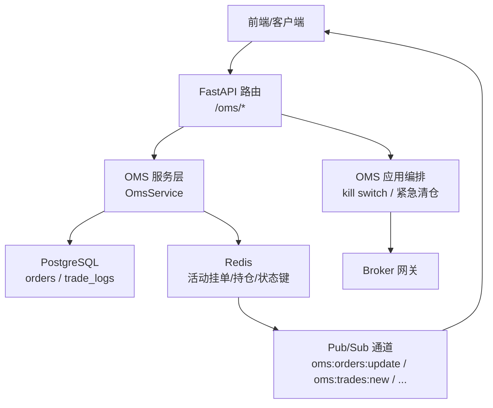
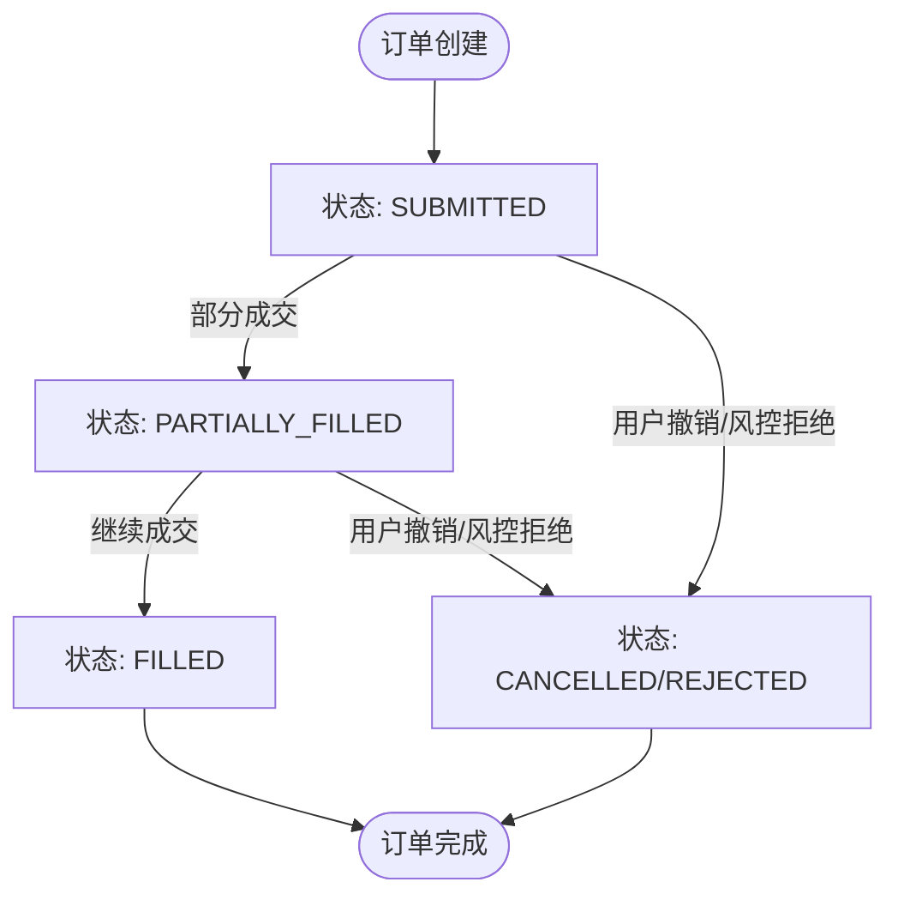
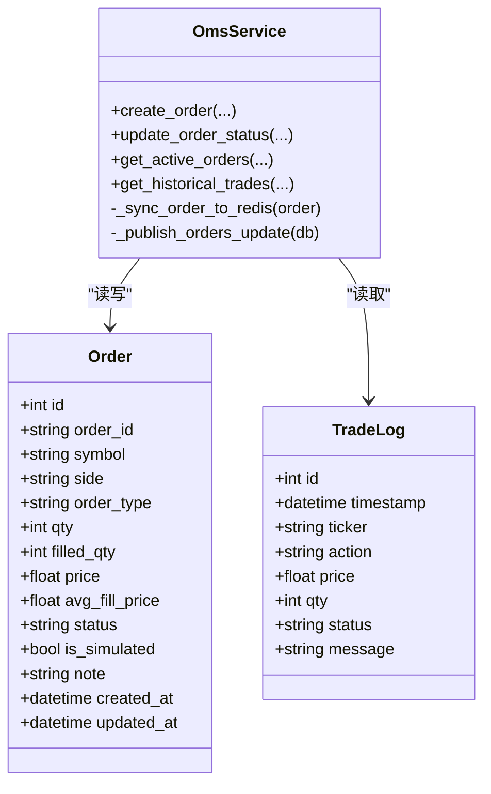
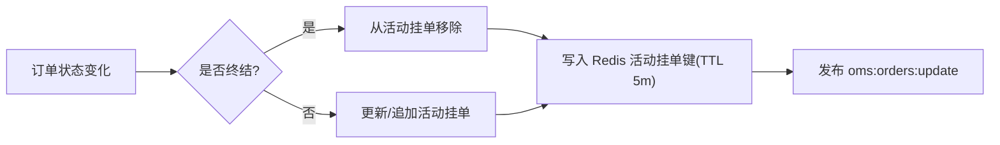
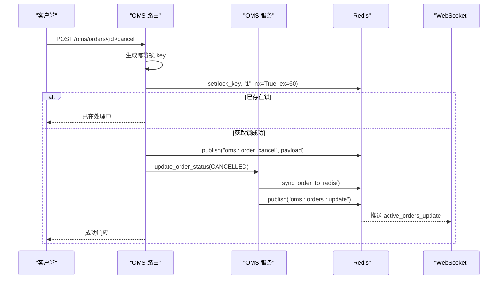
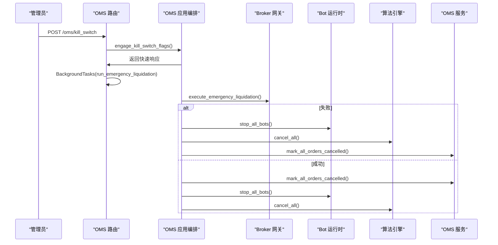
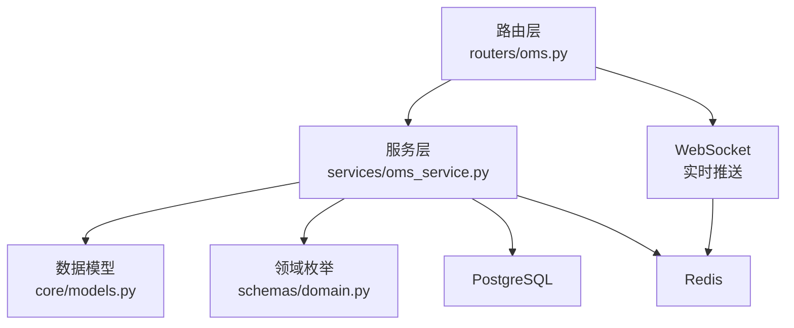

# 订单生命周期管理

<cite>
**本文引用的文件**
- [backend/routers/oms.py](file://backend/routers/oms.py)
- [backend/services/oms_service.py](file://backend/services/oms_service.py)
- [backend/app/oms_app.py](file://backend/app/oms_app.py)
- [backend/core/models.py](file://backend/core/models.py)
- [backend/schemas/domain.py](file://backend/schemas/domain.py)
</cite>

## 目录
1. [简介](#简介)
2. [项目结构](#项目结构)
3. [核心组件](#核心组件)
4. [架构总览](#架构总览)
5. [详细组件分析](#详细组件分析)
6. [依赖关系分析](#依赖关系分析)
7. [性能考量](#性能考量)
8. [故障排查指南](#故障排查指南)
9. [结论](#结论)
10. [附录](#附录)

## 简介
本技术文档聚焦订单生命周期管理模块，覆盖订单从创建到完成的全流程状态转换、持久化与缓存同步策略、活动挂单管理、API 调用示例（查询活动订单、更新状态、处理回调）、以及异常处理与恢复策略。该模块通过 FastAPI 路由暴露接口，服务层对接 PostgreSQL 与 Redis，结合 Pub/Sub 实现实时推送，并通过熔断机制保障极端场景下的系统安全。

## 项目结构
订单生命周期相关代码主要分布在以下位置：
- 路由层：OMS 对外 API（下单、撤单、改单、查询、WebSocket 推送等）
- 服务层：订单持久化、状态更新、Redis 缓存同步、持仓同步
- 应用编排：Kill Switch 熔断清仓编排
- 数据模型：PostgreSQL 表结构与领域枚举
- 领域模式：订单状态、类型、时间在力等枚举定义

图表来源
- [backend/routers/oms.py:56-84](file://backend/routers/oms.py#L56-L84)
- [backend/services/oms_service.py:34-114](file://backend/services/oms_service.py#L34-L114)
- [backend/app/oms_app.py:24-53](file://backend/app/oms_app.py#L24-L53)

章节来源
- [backend/routers/oms.py:56-84](file://backend/routers/oms.py#L56-L84)
- [backend/services/oms_service.py:34-114](file://backend/services/oms_service.py#L34-L114)
- [backend/app/oms_app.py:24-53](file://backend/app/oms_app.py#L24-L53)

## 核心组件
- OMS 路由层：提供订单操作与状态查询的 REST 接口，以及 WebSocket 实时推送通道
- OMS 服务层：负责订单持久化、状态更新、活动挂单缓存同步、历史成交读取、持仓同步与熔断标记
- 应用编排：统一触发 Kill Switch 并协调 Broker、Bot、Algo、DB 的状态变更
- 数据模型：订单表、交易日志表、审计日志表；领域枚举定义订单状态、类型、TIF 等
- Redis 键空间：活动挂单、持仓快照、OMS 状态、交易模式等键及过期策略

章节来源
- [backend/routers/oms.py:56-84](file://backend/routers/oms.py#L56-L84)
- [backend/services/oms_service.py:23-27](file://backend/services/oms_service.py#L23-L27)
- [backend/core/models.py:269-289](file://backend/core/models.py#L269-L289)
- [backend/schemas/domain.py:72-88](file://backend/schemas/domain.py#L72-L88)

## 架构总览
订单生命周期由“路由 → 服务 → 存储/缓存”三层协作完成，关键路径包括：
- 创建订单：写入 orders 表，初始化状态为 SUBMITTED，同步至 Redis 活动挂单，广播更新事件
- 状态更新：根据回调或轮询将状态推进至 PARTIALLY_FILLED/FILLED/CANCELLED，并同步缓存与广播
- 活动挂单：优先读 Redis 缓存，未命中回源 DB 并回填缓存（带 TTL）
- 持仓同步：定时从券商拉取真实持仓，写入 Redis 并按市场分片
- 熔断清仓：广播信号，执行 Broker 平仓、停止 Bot/Algo、标记所有活动订单为 CANCELLED

```mermaid
sequenceDiagram
participant FE as "前端"
participant API as "OMS 路由"
participant SVC as "OMS 服务"
participant DB as "PostgreSQL"
participant R as "Redis"
participant WS as "WebSocket"
FE->>API : GET /oms/state
API->>SVC : get_active_orders()
SVC->>R : 读取活动挂单缓存
alt 缓存命中
R-->>SVC : 返回活动订单列表
else 缓存未命中
SVC->>DB : 查询活跃订单
DB-->>SVC : 订单列表
SVC->>R : 写入缓存(5分钟TTL)
end
API-->>FE : 返回状态数据
SVC->>R : 发布 oms : orders : update
R-->>WS : 推送 active_orders_update
```

图表来源
- [backend/routers/oms.py:56-84](file://backend/routers/oms.py#L56-L84)
- [backend/services/oms_service.py:118-143](file://backend/services/oms_service.py#L118-L143)
- [backend/routers/oms.py:379-464](file://backend/routers/oms.py#L379-L464)

## 详细组件分析

### 订单状态机与转换规则
- 初始状态：SUBMITTED（创建订单时设置）
- 部分成交：PARTIALLY_FILLED（部分数量成交）
- 完全成交：FILLED（全部数量成交）
- 取消：CANCELLED（用户主动撤销或熔断）
- 其他：PENDING、REJECTED（用于上游或风控拒绝）

状态转换触发条件与处理逻辑：
- 创建订单：写入 orders 表，status=SUBMITTED，同步 Redis 活动挂单，广播更新
- 部分成交：更新 filled_qty 与 avg_fill_price，status→PARTIALLY_FILLED，同步缓存与广播
- 完全成交：更新 filled_qty=qty，status→FILLED，从活动挂单移除，广播更新
- 取消：status→CANCELLED，从活动挂单移除，广播更新；熔断时批量标记为 CANCELLED

图表来源
- [backend/services/oms_service.py:34-114](file://backend/services/oms_service.py#L34-L114)
- [backend/schemas/domain.py:72-79](file://backend/schemas/domain.py#L72-L79)

章节来源
- [backend/services/oms_service.py:34-114](file://backend/services/oms_service.py#L34-L114)
- [backend/schemas/domain.py:72-79](file://backend/schemas/domain.py#L72-L79)

### 订单持久化机制（PostgreSQL + Redis 同步）
- 持久化：Order 模型映射到 orders 表，包含 order_id、symbol、side、order_type、qty、filled_qty、price、avg_fill_price、status、is_simulated、note、created_at、updated_at
- 同步策略：
  - 创建订单后写入 orders 表，立即同步到 Redis 活动挂单键 quant:oms:active_orders（TTL 5 分钟）
  - 状态更新后同样同步到 Redis，并发布 oms:orders:update 事件
  - 历史成交从 trade_logs 表读取，转换为 API 格式返回
- 缓存失效：活动挂单缓存采用固定 TTL；熔断时清空活动挂单缓存

图表来源
- [backend/core/models.py:269-289](file://backend/core/models.py#L269-L289)
- [backend/core/models.py:53-64](file://backend/core/models.py#L53-L64)
- [backend/services/oms_service.py:34-114](file://backend/services/oms_service.py#L34-L114)

章节来源
- [backend/core/models.py:269-289](file://backend/core/models.py#L269-L289)
- [backend/core/models.py:53-64](file://backend/core/models.py#L53-L64)
- [backend/services/oms_service.py:34-114](file://backend/services/oms_service.py#L34-L114)

### 活动挂单管理与 Redis 键空间设计
- 键空间约定：
  - quant:oms:active_orders：活动挂单列表（SUBMITTED/PARTIALLY_FILLED/PENDING），TTL 5 分钟
  - quant:oms:positions:{market}：按市场分片的持仓快照，TTL 30 秒
  - quant:oms:status：OMS 全局状态（如 KILLED），TTL 3600 秒
  - quant:oms:trading_mode：当前交易模式（SANDBOX/PAPER/LIVE）
- 缓存失效策略：
  - 固定 TTL 自动过期
  - 状态终结（FILLED/CANCELLED/REJECTED/EXPIRED）时从活动挂单列表中移除
  - 熔断时清空活动挂单缓存
- 广播机制：
  - oms:orders/update：活动挂单变更
  - oms:positions/update：持仓变更
  - oms:trades/new：新成交
  - oms:mode_change：交易模式切换

图表来源
- [backend/services/oms_service.py:218-244](file://backend/services/oms_service.py#L218-L244)
- [backend/services/oms_service.py:155-193](file://backend/services/oms_service.py#L155-L193)
- [backend/routers/oms.py:379-464](file://backend/routers/oms.py#L379-L464)

章节来源
- [backend/services/oms_service.py:218-244](file://backend/services/oms_service.py#L218-L244)
- [backend/services/oms_service.py:155-193](file://backend/services/oms_service.py#L155-L193)
- [backend/routers/oms.py:379-464](file://backend/routers/oms.py#L379-L464)

### API 调用示例与回调处理
- 查询活动订单：GET /oms/state
  - 返回 active_orders、historical_trades、bots、algo_executions、trading_mode
- 查询持仓：GET /oms/positions?market=HK
  - 返回 Redis 缓存中的最新持仓
- 修改订单价格：POST /oms/orders/{order_id}/modify
  - 下发改单指令，更新 DB 价格，同步 Redis 并广播
- 撤单：POST /oms/orders/{order_id}/cancel
  - 幂等锁保护，发布撤单指令，更新 DB 状态为 CANCELLED，记录审计日志
- 交易模式切换：POST /oms/mode/switch
  - 写入 Redis 模式键，广播模式变更，记录审计日志
- WebSocket 实时推送：WS /oms/ws?token=...
  - 订阅多个通道，推送活动订单、新成交、Bot 日志、算法执行、持仓、模式变更等

图表来源
- [backend/routers/oms.py:120-147](file://backend/routers/oms.py#L120-L147)
- [backend/services/oms_service.py:79-114](file://backend/services/oms_service.py#L79-L114)
- [backend/routers/oms.py:379-464](file://backend/routers/oms.py#L379-L464)

章节来源
- [backend/routers/oms.py:56-84](file://backend/routers/oms.py#L56-L84)
- [backend/routers/oms.py:120-147](file://backend/routers/oms.py#L120-L147)
- [backend/routers/oms.py:149-177](file://backend/routers/oms.py#L149-L177)
- [backend/routers/oms.py:180-184](file://backend/routers/oms.py#L180-L184)
- [backend/routers/oms.py:347-371](file://backend/routers/oms.py#L347-L371)
- [backend/routers/oms.py:379-464](file://backend/routers/oms.py#L379-L464)

### 熔断与异常处理机制
- 熔断触发：POST /oms/kill_switch
  - 广播 oms:kill_switch 信号，设置 oms:status=KILLED（TTL 3600s）
  - 后台任务执行紧急清仓：Broker 平仓、停止 Bot、取消 Algo、标记所有活动订单为 CANCELLED
- 异常恢复：
  - 幂等锁防止重复撤单
  - 数据库事务回滚保证一致性
  - Redis 键过期避免脏数据长期滞留
  - WebSocket 连接断开自动清理资源

图表来源
- [backend/routers/oms.py:94-117](file://backend/routers/oms.py#L94-L117)
- [backend/app/oms_app.py:24-53](file://backend/app/oms_app.py#L24-L53)
- [backend/services/oms_service.py:197-214](file://backend/services/oms_service.py#L197-L214)

章节来源
- [backend/routers/oms.py:94-117](file://backend/routers/oms.py#L94-L117)
- [backend/app/oms_app.py:24-53](file://backend/app/oms_app.py#L24-L53)
- [backend/services/oms_service.py:197-214](file://backend/services/oms_service.py#L197-L214)

## 依赖关系分析
- 路由层依赖服务层进行业务编排，服务层依赖数据库与 Redis
- 领域枚举定义订单状态、类型、TIF，确保数据一致性
- WebSocket 通道依赖 Redis Pub/Sub 实现多端实时推送
- 熔断机制依赖 Broker、Bot、Algo 等多组件协同

图表来源
- [backend/routers/oms.py:56-84](file://backend/routers/oms.py#L56-L84)
- [backend/services/oms_service.py:34-114](file://backend/services/oms_service.py#L34-L114)
- [backend/core/models.py:269-289](file://backend/core/models.py#L269-L289)
- [backend/schemas/domain.py:72-88](file://backend/schemas/domain.py#L72-L88)

章节来源
- [backend/routers/oms.py:56-84](file://backend/routers/oms.py#L56-L84)
- [backend/services/oms_service.py:34-114](file://backend/services/oms_service.py#L34-L114)
- [backend/core/models.py:269-289](file://backend/core/models.py#L269-L289)
- [backend/schemas/domain.py:72-88](file://backend/schemas/domain.py#L72-L88)

## 性能考量
- 活动挂单缓存：优先读 Redis，减少 DB 压力；TTL 5 分钟平衡一致性与性能
- 持仓快照：按市场分片，TTL 30 秒，适合高频刷新
- WebSocket 推送：基于 Redis Pub/Sub，支持多通道广播，降低服务端负载
- 幂等性：撤单使用 Redis NX 锁，避免重复处理
- 熔断快速返回：先写 Redis 状态并广播，再异步执行清仓，保证接口响应速度

[本节为通用性能建议，不直接分析具体文件]

## 故障排查指南
- 活动订单未更新：检查 Redis 活动挂单键是否存在且未过期；确认 oms:orders:update 是否发布
- 持仓数据陈旧：确认定时任务是否正常拉取并写入 Redis；检查 oms:positions:update 是否发布
- 撤单失败：检查幂等锁是否被占用；确认 Redis 消息通道是否可达
- 熔断未生效：检查 oms:status 是否为 KILLED；确认 Broker/Bot/Algo 是否收到信号并执行
- WebSocket 断连：确认 token 校验是否通过；检查 Pub/Sub 订阅是否正确释放

章节来源
- [backend/routers/oms.py:120-147](file://backend/routers/oms.py#L120-L147)
- [backend/routers/oms.py:379-464](file://backend/routers/oms.py#L379-L464)
- [backend/services/oms_service.py:118-143](file://backend/services/oms_service.py#L118-L143)
- [backend/app/oms_app.py:24-53](file://backend/app/oms_app.py#L24-L53)

## 结论
订单生命周期管理模块通过清晰的状态机、可靠的持久化与缓存同步、实时的 Pub/Sub 推送以及健壮的熔断机制，实现了从创建到完成的全流程闭环。建议在后续迭代中增强状态一致性校验、完善监控指标与告警、优化缓存命中率与回源策略，以提升整体稳定性与可观测性。

[本节为总结性内容，不直接分析具体文件]

## 附录
- 领域枚举参考：订单状态、类型、TIF
- 数据模型参考：订单表、交易日志表、审计日志表
- 键空间参考：活动挂单、持仓、状态、交易模式

章节来源
- [backend/schemas/domain.py:72-88](file://backend/schemas/domain.py#L72-L88)
- [backend/core/models.py:269-289](file://backend/core/models.py#L269-L289)
- [backend/core/models.py:53-64](file://backend/core/models.py#L53-L64)
- [backend/core/models.py:292-303](file://backend/core/models.py#L292-L303)
- [backend/services/oms_service.py:23-27](file://backend/services/oms_service.py#L23-L27)