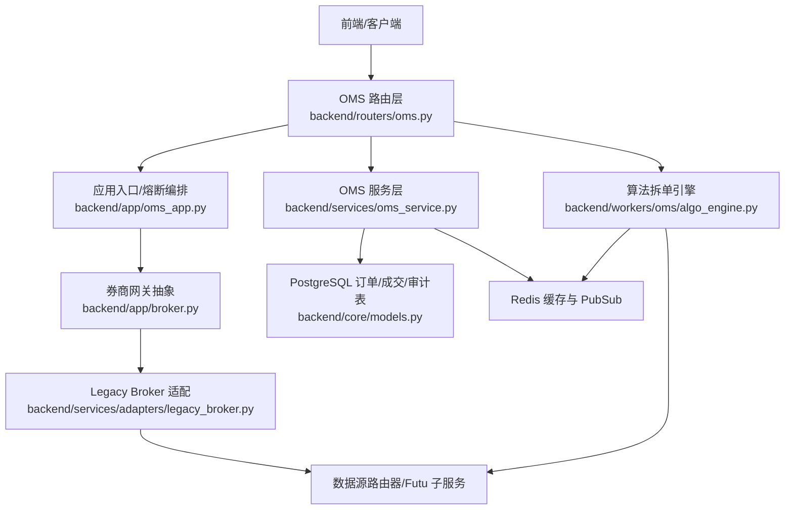
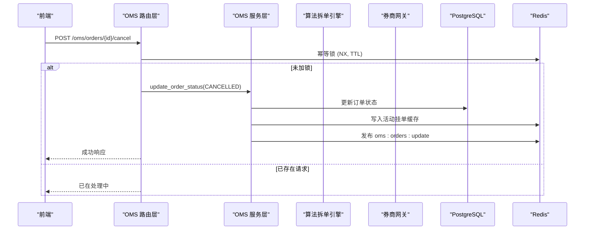
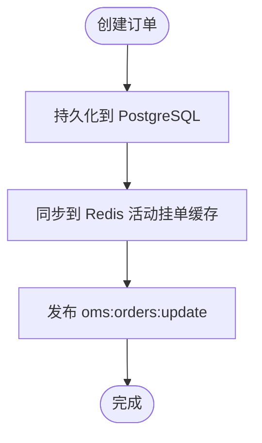
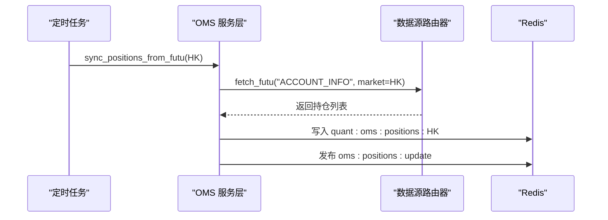
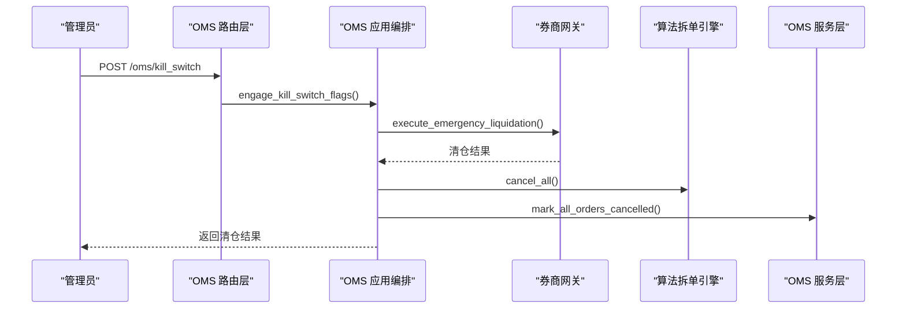
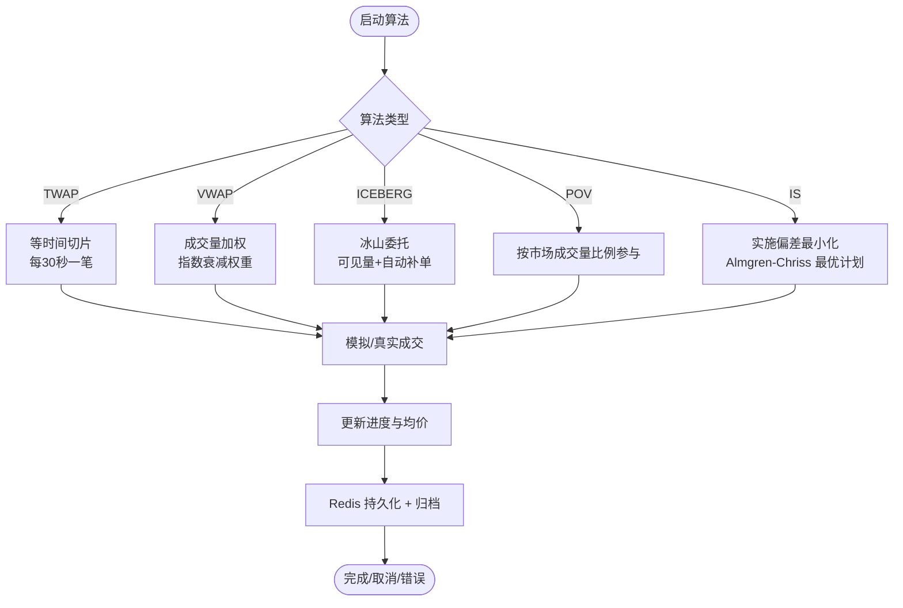
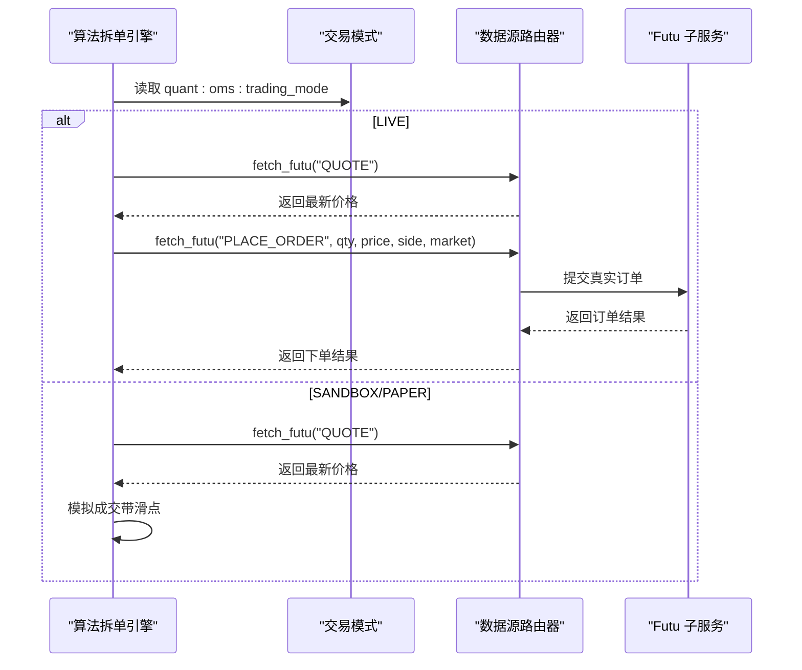
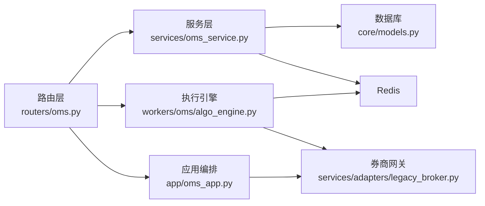
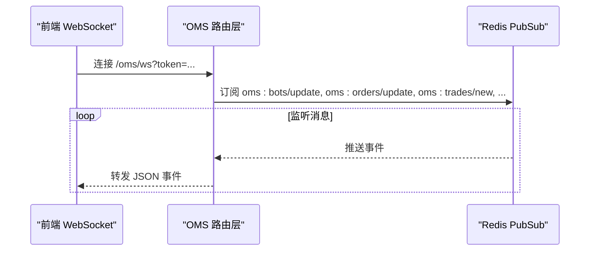

# 订单管理系统

<cite>
**本文引用的文件**
- [backend/routers/oms.py](file://backend/routers/oms.py)
- [backend/services/oms_service.py](file://backend/services/oms_service.py)
- [backend/workers/oms/algo_engine.py](file://backend/workers/oms/algo_engine.py)
- [backend/app/broker.py](file://backend/app/broker.py)
- [backend/services/adapters/legacy_broker.py](file://backend/services/adapters/legacy_broker.py)
- [backend/core/models.py](file://backend/core/models.py)
- [backend/app/oms_app.py](file://backend/app/oms_app.py)
</cite>

## 目录
1. [简介](#简介)
2. [项目结构](#项目结构)
3. [核心组件](#核心组件)
4. [架构总览](#架构总览)
5. [详细组件分析](#详细组件分析)
6. [依赖关系分析](#依赖关系分析)
7. [性能与执行监控](#性能与执行监控)
8. [故障排查指南](#故障排查指南)
9. [结论](#结论)
10. [附录：API 使用示例](#附录api-使用示例)

## 简介
本技术文档面向 Quant Agent 的订单管理系统（OMS），系统性阐述其架构设计、订单生命周期管理、仓位控制、风险管理、执行算法以及与券商接口的集成方式。重点覆盖以下主题：
- 订单类型与执行策略：市价单、限价单、止损单；TWAP、VWAP、冰山订单等算法拆单
- 模拟交易与实盘交易的切换机制（SANDBOX/PAPER/LIVE）
- 订单管理的 API 操作：下单、撤单、改单、查询状态
- 风险控制：仓位限制、止损止盈、异常检测与熔断
- 订单执行监控与性能分析方法

## 项目结构
OMS 相关代码主要分布在以下模块：
- 路由层：提供 OMS 对外 HTTP/WebSocket 接口，负责鉴权、参数校验与任务调度
- 服务层：订单持久化、成交记录同步、持仓同步、Redis 缓存与 PubSub 广播
- 执行引擎：算法拆单引擎（TWAP/VWAP/ICEBERG/POV/IS），支持模拟与真实下单
- 券商网关：统一封装券商交易能力，屏蔽底层实现细节
- 数据模型：订单、成交日志、审计日志等数据库表定义

**图表来源**
- [backend/routers/oms.py:56-84](file://backend/routers/oms.py#L56-L84)
- [backend/services/oms_service.py:29-143](file://backend/services/oms_service.py#L29-L143)
- [backend/workers/oms/algo_engine.py:251-399](file://backend/workers/oms/algo_engine.py#L251-L399)
- [backend/app/broker.py:1-10](file://backend/app/broker.py#L1-L10)
- [backend/services/adapters/legacy_broker.py:17-105](file://backend/services/adapters/legacy_broker.py#L17-L105)
- [backend/core/models.py:269-303](file://backend/core/models.py#L269-L303)

**章节来源**
- [backend/routers/oms.py:56-84](file://backend/routers/oms.py#L56-L84)
- [backend/services/oms_service.py:29-143](file://backend/services/oms_service.py#L29-L143)
- [backend/workers/oms/algo_engine.py:251-399](file://backend/workers/oms/algo_engine.py#L251-L399)
- [backend/app/broker.py:1-10](file://backend/app/broker.py#L1-L10)
- [backend/services/adapters/legacy_broker.py:17-105](file://backend/services/adapters/legacy_broker.py#L17-L105)
- [backend/core/models.py:269-303](file://backend/core/models.py#L269-L303)

## 核心组件
- OMS 路由层：提供订单状态查询、撤单、改单、算法拆单启动/暂停/恢复/取消、交易模式切换、WebSocket 实时推送等接口
- OMS 服务层：订单持久化、活动挂单缓存、历史成交读取、持仓同步、熔断标记、Redis 缓存与事件广播
- 算法拆单引擎：实现 TWAP/VWAP/ICEBERG/POV/IS 等算法，支持整手对齐、市场冲击估计、进度持久化与归档
- 券商网关：统一封装下单、撤单、查询、账户信息、紧急清仓等操作，屏蔽 Futu SDK 直连
- 数据模型：Order、TradeLog、AuditLog 等表用于订单、成交与审计追踪

**章节来源**
- [backend/routers/oms.py:120-177](file://backend/routers/oms.py#L120-L177)
- [backend/services/oms_service.py:34-143](file://backend/services/oms_service.py#L34-L143)
- [backend/workers/oms/algo_engine.py:194-399](file://backend/workers/oms/algo_engine.py#L194-L399)
- [backend/services/adapters/legacy_broker.py:37-105](file://backend/services/adapters/legacy_broker.py#L37-L105)
- [backend/core/models.py:269-303](file://backend/core/models.py#L269-L303)

## 架构总览
OMS 采用分层架构：
- 路由层仅做鉴权、参数校验与后台任务调度，不承载复杂业务逻辑
- 服务层负责数据持久化、缓存与事件广播，保证订单与成交数据的强一致性与可观测性
- 执行引擎以异步任务驱动算法拆单，通过 Redis 持久化进度并广播更新
- 券商网关通过数据源路由器调用 Futu 子服务，避免主进程直接依赖 SDK，提升解耦与可测试性

**图表来源**
- [backend/routers/oms.py:120-147](file://backend/routers/oms.py#L120-L147)
- [backend/services/oms_service.py:79-114](file://backend/services/oms_service.py#L79-L114)

**章节来源**
- [backend/routers/oms.py:120-147](file://backend/routers/oms.py#L120-L147)
- [backend/services/oms_service.py:79-114](file://backend/services/oms_service.py#L79-L114)

## 详细组件分析

### 订单生命周期管理
- 创建订单：服务层将订单写入 PostgreSQL，并同步到 Redis 活动挂单缓存，同时通过 PubSub 广播变更
- 状态更新：根据成交回调或轮询结果更新订单状态（SUBMITTED → PARTIALLY_FILLED → FILLED/CANCELLED）
- 活动挂单查询：优先从 Redis 缓存读取，未命中则回源 DB 并写回缓存（TTL 5 分钟）
- 历史成交：从 TradeLog 表读取最近成交记录，供面板展示与分析

**图表来源**
- [backend/services/oms_service.py:34-77](file://backend/services/oms_service.py#L34-L77)
- [backend/services/oms_service.py:118-143](file://backend/services/oms_service.py#L118-L143)

**章节来源**
- [backend/services/oms_service.py:34-77](file://backend/services/oms_service.py#L34-L77)
- [backend/services/oms_service.py:118-143](file://backend/services/oms_service.py#L118-L143)

### 仓位控制与持仓同步
- 持仓同步：定时从 Futu 拉取账户信息，写入 Redis 缓存并广播 oms:positions:update
- 持仓查询：从 Redis 缓存读取最新持仓列表，减少数据库压力
- 风控联动：结合风险引擎进行仓位限制与止损止盈检查（见“风险管理”小节）

**图表来源**
- [backend/services/oms_service.py:155-182](file://backend/services/oms_service.py#L155-L182)

**章节来源**
- [backend/services/oms_service.py:155-182](file://backend/services/oms_service.py#L155-L182)

### 风险管理
- 仓位限制：在下单前由风险引擎评估当前仓位与可用资金，防止超限
- 止损止盈：基于价格触发条件自动平仓或调整订单
- 异常检测：对行情缺失、下单失败、网络异常等进行告警与降级
- 熔断机制：Kill Switch 触发后，BrokerGateway 执行物理清仓，BotRuntime 停止所有 Bot，AlgoEngine 取消所有算法，OMS 将所有活动订单标记为 CANCELLED

**图表来源**
- [backend/routers/oms.py:94-117](file://backend/routers/oms.py#L94-L117)
- [backend/app/oms_app.py:24-53](file://backend/app/oms_app.py#L24-L53)
- [backend/services/adapters/legacy_broker.py:86-105](file://backend/services/adapters/legacy_broker.py#L86-L105)
- [backend/services/oms_service.py:197-214](file://backend/services/oms_service.py#L197-L214)

**章节来源**
- [backend/routers/oms.py:94-117](file://backend/routers/oms.py#L94-L117)
- [backend/app/oms_app.py:24-53](file://backend/app/oms_app.py#L24-L53)
- [backend/services/adapters/legacy_broker.py:86-105](file://backend/services/adapters/legacy_broker.py#L86-L105)
- [backend/services/oms_service.py:197-214](file://backend/services/oms_service.py#L197-L214)

### 执行算法（TWAP、VWAP、冰山订单等）
- TWAP：等时间切片拆单，固定间隔下单，适合流动性较好的标的
- VWAP：按成交量加权拆分，前密后疏的指数衰减权重，降低市场冲击
- 冰山订单：每次仅显示少量可见量，成交后自动补单，隐藏大单意图
- POV：按市场成交量百分比参与，匹配流动性节奏
- IS：最小化实施偏差，基于 Almgren-Chriss 模型优化执行计划

**图表来源**
- [backend/workers/oms/algo_engine.py:369-615](file://backend/workers/oms/algo_engine.py#L369-L615)
- [backend/workers/oms/algo_engine.py:706-741](file://backend/workers/oms/algo_engine.py#L706-L741)

**章节来源**
- [backend/workers/oms/algo_engine.py:369-615](file://backend/workers/oms/algo_engine.py#L369-L615)
- [backend/workers/oms/algo_engine.py:706-741](file://backend/workers/oms/algo_engine.py#L706-L741)

### 与券商接口的集成（模拟与实盘切换）
- 券商网关：统一封装下单、撤单、查询、账户信息与紧急清仓，屏蔽底层 SDK 细节
- 模拟交易（SANDBOX/PAPER）：通过 DataSourceRouter 获取行情并模拟成交，不产生真实资金变动
- 实盘交易（LIVE）：通过 DataSourceRouter 调用 Futu 子服务提交真实限价单，港股整手对齐
- 交易模式切换：通过 Redis 键存储当前模式，路由层提供热切换接口，WebSocket 实时广播

**图表来源**
- [backend/workers/oms/algo_engine.py:617-702](file://backend/workers/oms/algo_engine.py#L617-L702)
- [backend/routers/oms.py:321-371](file://backend/routers/oms.py#L321-L371)
- [backend/services/adapters/legacy_broker.py:37-74](file://backend/services/adapters/legacy_broker.py#L37-L74)

**章节来源**
- [backend/workers/oms/algo_engine.py:617-702](file://backend/workers/oms/algo_engine.py#L617-L702)
- [backend/routers/oms.py:321-371](file://backend/routers/oms.py#L321-L371)
- [backend/services/adapters/legacy_broker.py:37-74](file://backend/services/adapters/legacy_broker.py#L37-L74)

## 依赖关系分析
- 路由层依赖服务层与执行引擎，负责接口暴露与任务调度
- 服务层依赖数据库与 Redis，负责数据持久化与事件广播
- 执行引擎依赖数据源路由器与 Redis，负责算法执行与状态持久化
- 券商网关依赖数据源路由器，屏蔽底层 SDK 细节，提升可测试性

**图表来源**
- [backend/routers/oms.py:56-84](file://backend/routers/oms.py#L56-L84)
- [backend/services/oms_service.py:29-143](file://backend/services/oms_service.py#L29-L143)
- [backend/workers/oms/algo_engine.py:251-399](file://backend/workers/oms/algo_engine.py#L251-L399)
- [backend/services/adapters/legacy_broker.py:17-105](file://backend/services/adapters/legacy_broker.py#L17-L105)
- [backend/core/models.py:269-303](file://backend/core/models.py#L269-L303)

**章节来源**
- [backend/routers/oms.py:56-84](file://backend/routers/oms.py#L56-L84)
- [backend/services/oms_service.py:29-143](file://backend/services/oms_service.py#L29-L143)
- [backend/workers/oms/algo_engine.py:251-399](file://backend/workers/oms/algo_engine.py#L251-L399)
- [backend/services/adapters/legacy_broker.py:17-105](file://backend/services/adapters/legacy_broker.py#L17-L105)
- [backend/core/models.py:269-303](file://backend/core/models.py#L269-L303)

## 性能与执行监控
- 缓存策略：活动挂单与持仓数据优先从 Redis 读取，降低数据库压力
- 事件广播：通过 Redis PubSub 实时推送订单、成交、算法执行与持仓变更
- 算法执行报告：提供滑点、VWAP 偏离、参与率、实施偏差等指标，便于执行质量评估
- WebSocket 推送：前端订阅多个通道，实时接收 OMS 状态更新

**图表来源**
- [backend/routers/oms.py:379-463](file://backend/routers/oms.py#L379-L463)

**章节来源**
- [backend/routers/oms.py:379-463](file://backend/routers/oms.py#L379-L463)

## 故障排查指南
- 撤单失败：检查 Redis 幂等锁是否已存在，确认订单状态与券商网关可达性
- 持仓不同步：确认定时任务是否正常执行，检查 Redis 持仓缓存与数据源健康状态
- 算法执行异常：查看算法状态与消息，确认交易模式与行情获取是否成功
- 熔断清仓：确认 Kill Switch 信号已广播，BrokerGateway 远程清仓是否返回成功

**章节来源**
- [backend/routers/oms.py:120-147](file://backend/routers/oms.py#L120-L147)
- [backend/services/oms_service.py:155-182](file://backend/services/oms_service.py#L155-L182)
- [backend/workers/oms/algo_engine.py:369-615](file://backend/workers/oms/algo_engine.py#L369-L615)
- [backend/services/adapters/legacy_broker.py:86-105](file://backend/services/adapters/legacy_broker.py#L86-L105)

## 结论
Quant Agent 的 OMS 通过分层架构与解耦设计，实现了订单全生命周期管理、算法拆单执行、风险控制与券商集成的统一平台。借助 Redis 缓存与 PubSub 广播，系统具备高吞吐与低延迟特性；通过 Kill Switch 与审计日志，保障交易安全与可追溯性。未来可进一步增强风险引擎与执行算法的复杂度，提升执行质量与风控能力。

## 附录：API 使用示例
以下为常见 OMS API 的使用说明（路径与方法）：
- 获取初始状态：GET /oms/state
- 触发熔断：POST /oms/kill_switch
- 撤单：POST /oms/orders/{order_id}/cancel
- 改单：POST /oms/orders/{order_id}/modify
- 查询持仓：GET /oms/positions?market=HK
- 启动算法：POST /oms/algo/start
- 暂停/恢复/取消算法：POST /oms/algo/{algo_id}/pause | resume | cancel
- 获取算法分析：POST /oms/algo/analytics/{algo_id}
- 查询交易模式：GET /oms/mode
- 切换交易模式：POST /oms/mode/switch
- WebSocket 实时推送：WS /oms/ws?token=...

**章节来源**
- [backend/routers/oms.py:56-84](file://backend/routers/oms.py#L56-L84)
- [backend/routers/oms.py:94-117](file://backend/routers/oms.py#L94-L117)
- [backend/routers/oms.py:120-177](file://backend/routers/oms.py#L120-L177)
- [backend/routers/oms.py:180-184](file://backend/routers/oms.py#L180-L184)
- [backend/routers/oms.py:217-318](file://backend/routers/oms.py#L217-L318)
- [backend/routers/oms.py:340-371](file://backend/routers/oms.py#L340-L371)
- [backend/routers/oms.py:379-463](file://backend/routers/oms.py#L379-L463)