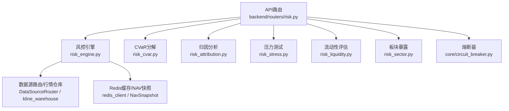
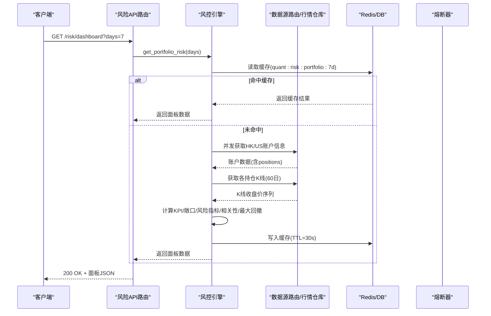
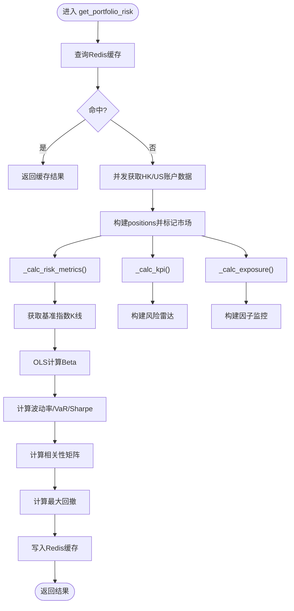
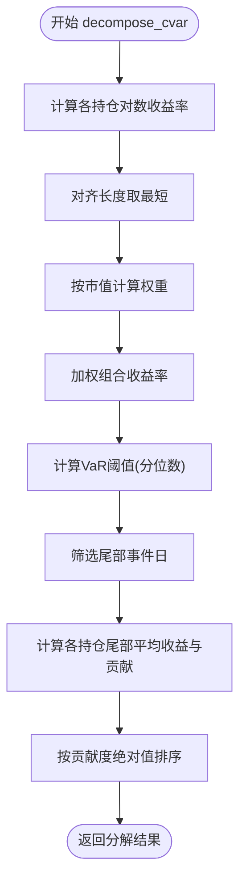
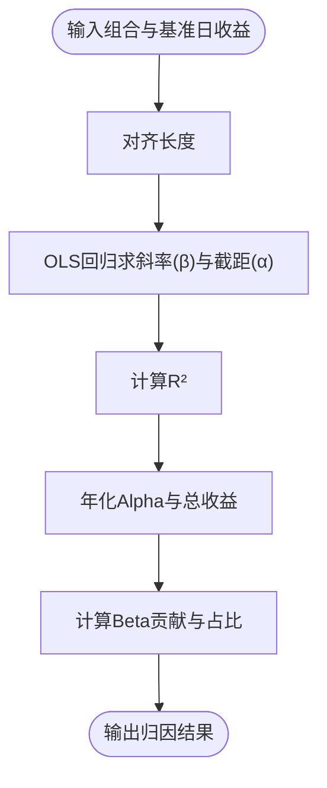
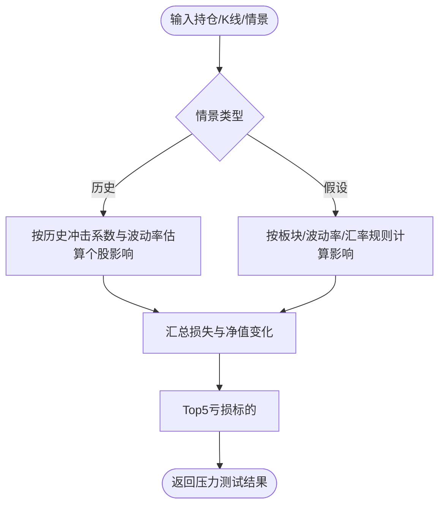
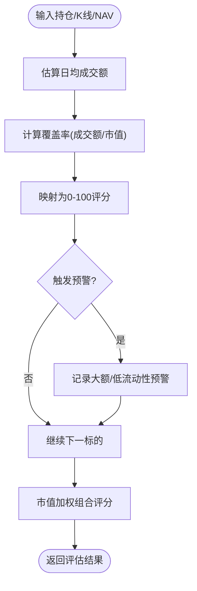
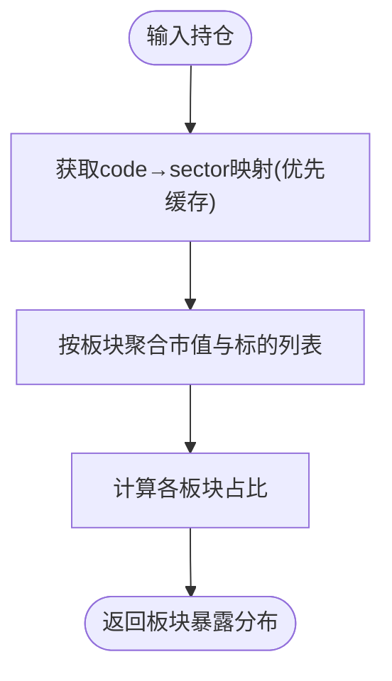
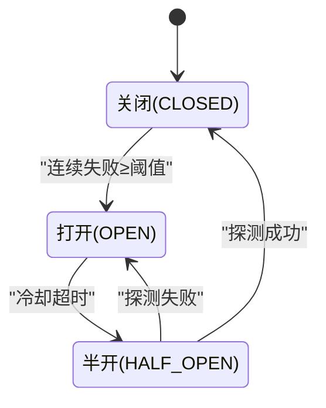
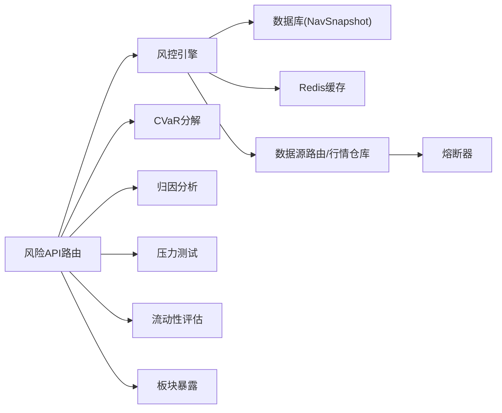

# 风险控制引擎

<cite>
**本文引用的文件**
- [backend/routers/risk.py](file://backend/routers/risk.py)
- [backend/services/risk/risk_engine.py](file://backend/services/risk/risk_engine.py)
- [backend/services/risk/risk_cvar.py](file://backend/services/risk/risk_cvar.py)
- [backend/services/risk/risk_attribution.py](file://backend/services/risk/risk_attribution.py)
- [backend/services/risk/risk_stress.py](file://backend/services/risk/risk_stress.py)
- [backend/services/risk/risk_liquidity.py](file://backend/services/risk/risk_liquidity.py)
- [backend/services/risk/risk_sector.py](file://backend/services/risk/risk_sector.py)
- [backend/core/circuit_breaker.py](file://backend/core/circuit_breaker.py)
- [backend/tests/test_risk_engine.py](file://backend/tests/test_risk_engine.py)
</cite>

## 目录
1. [简介](#简介)
2. [项目结构](#项目结构)
3. [核心组件](#核心组件)
4. [架构总览](#架构总览)
5. [详细组件分析](#详细组件分析)
6. [依赖关系分析](#依赖关系分析)
7. [性能考量](#性能考量)
8. [故障排查指南](#故障排查指南)
9. [结论](#结论)
10. [附录](#附录)

## 简介
本技术文档面向风险控制引擎，围绕“事前风控、事中监控、事后分析”三层能力展开：
- 事前风控：仓位限制检查（单笔限额、总仓位限制、行业集中度控制）、压力测试与情景模拟。
- 事中监控：实时/近实时的风险指标计算（波动率、VaR、CVaR、最大回撤、Beta、Sharpe）、流动性评估、板块暴露与相关性预警、熔断与告警联动。
- 事后分析：归因分析（Jensen's Alpha/Beta 贡献分解）、CVaR 按持仓分解、历史回测与假设情景复盘。

该引擎以组合为单位，基于真实账户数据与K线数据，提供可配置的风险阈值、可视化雷达图、因子监控面板与API接口，便于前端展示与自动化决策。

## 项目结构
风险相关代码主要位于后端 services/risk 与 routers/risk，辅以 core 层的熔断器与数据库/缓存交互。

图表来源
- [backend/routers/risk.py:1-231](file://backend/routers/risk.py#L1-L231)
- [backend/services/risk/risk_engine.py:22-135](file://backend/services/risk/risk_engine.py#L22-L135)
- [backend/core/circuit_breaker.py:45-103](file://backend/core/circuit_breaker.py#L45-L103)

章节来源
- [backend/routers/risk.py:1-231](file://backend/routers/risk.py#L1-L231)
- [backend/services/risk/risk_engine.py:22-135](file://backend/services/risk/risk_engine.py#L22-L135)

## 核心组件
- 风控引擎 RiskEngine：聚合多市场账户数据，计算KPI、敞口、风险指标（波动率、VaR、Beta、Sharpe）、相关性矩阵、最大回撤、风险雷达与因子监控；支持Redis缓存与NAV快照读取。
- CVaR分解：计算组合CVaR与按持仓的贡献度、边际VaR。
- 归因分析：基于基准指数进行Jensen's Alpha与Beta贡献分解，输出年化Alpha、Beta贡献与拟合优度。
- 压力测试：支持历史情景回放与假设情景（利率、波动率、汇率）冲击，输出组合前后净值变化与Top亏损标的。
- 流动性评估：通过日均成交额与市值比率估算流动性覆盖率与评分，识别大额持仓与低流动性风险。
- 板块暴露：按GICS标准聚合行业分布，输出集中度与预警。
- 熔断器：对外部数据源调用进行状态机保护，避免雪崩并快速恢复。

章节来源
- [backend/services/risk/risk_engine.py:22-515](file://backend/services/risk/risk_engine.py#L22-L515)
- [backend/services/risk/risk_cvar.py:12-114](file://backend/services/risk/risk_cvar.py#L12-L114)
- [backend/services/risk/risk_attribution.py:12-87](file://backend/services/risk/risk_attribution.py#L12-L87)
- [backend/services/risk/risk_stress.py:58-245](file://backend/services/risk/risk_stress.py#L58-L245)
- [backend/services/risk/risk_liquidity.py:12-130](file://backend/services/risk/risk_liquidity.py#L12-L130)
- [backend/services/risk/risk_sector.py:43-153](file://backend/services/risk/risk_sector.py#L43-L153)
- [backend/core/circuit_breaker.py:45-379](file://backend/core/circuit_breaker.py#L45-L379)

## 架构总览
风险引擎采用分层设计：
- API层：统一暴露风控面板与进阶能力端点（板块暴露、相关性、CVaR、流动性、归因、压力测试）。
- 服务层：各专项服务负责具体算法与数据处理。
- 基础设施层：数据源路由、K线仓库、Redis缓存、数据库、熔断器。

图表来源
- [backend/routers/risk.py:63-76](file://backend/routers/risk.py#L63-L76)
- [backend/services/risk/risk_engine.py:32-135](file://backend/services/risk/risk_engine.py#L32-L135)
- [backend/core/circuit_breaker.py:147-218](file://backend/core/circuit_breaker.py#L147-L218)

## 详细组件分析

### 风控引擎 RiskEngine
职责与流程：
- 单例模式，提供 get_portfolio_risk 方法，支持 days 参数控制时间范围。
- 优先从Redis读取缓存；未命中则并发拉取HK/US账户数据，再并行获取各持仓K线。
- 计算KPI（净值、今日盈亏、杠杆、货币符号）、敞口（多头/空头/现金占比）、风险指标（波动率、VaR、Beta、Sharpe）、相关性矩阵、最大回撤、风险雷达与因子监控。
- NAV快照：days≤1时从Redis读取最近24小时；days>1时从数据库NavSnapshot表读取历史。
- 将结果写回Redis缓存（TTL=30s），供后续请求复用。

关键实现要点：
- 波动率：对数收益率的标准差×√252（年化）。
- VaR（95%）：历史模拟法，取5分位。
- Beta：OLS回归组合收益对基准指数收益。
- Sharpe：(年化收益 - 无风险利率)/波动率。
- 最大回撤：基于NAV序列的峰值到谷值比例。
- 相关性矩阵：对齐长度后计算相关系数，并对高相关性（|corr|>0.8）发出预警。
- 风险雷达：六维（Beta、Vol、Liq、Corr、Mom、DD）评分映射。
- 因子监控：双口径VaR（百分比+金额），阈值分档（safe/warn/crit）。

图表来源
- [backend/services/risk/risk_engine.py:32-135](file://backend/services/risk/risk_engine.py#L32-L135)
- [backend/services/risk/risk_engine.py:195-283](file://backend/services/risk/risk_engine.py#L195-L283)
- [backend/services/risk/risk_engine.py:330-346](file://backend/services/risk/risk_engine.py#L330-L346)
- [backend/services/risk/risk_engine.py:348-374](file://backend/services/risk/risk_engine.py#L348-L374)
- [backend/services/risk/risk_engine.py:376-426](file://backend/services/risk/risk_engine.py#L376-L426)
- [backend/services/risk/risk_engine.py:428-481](file://backend/services/risk/risk_engine.py#L428-L481)

章节来源
- [backend/services/risk/risk_engine.py:22-515](file://backend/services/risk/risk_engine.py#L22-L515)
- [backend/tests/test_risk_engine.py:21-341](file://backend/tests/test_risk_engine.py#L21-L341)

### CVaR分解（风险指标：CVaR）
- 计算组合CVaR（Expected Shortfall）：在超过VaR阈值的尾部区域，收益率的条件均值。
- 按持仓分解：Component VaR_i = w_i × E[r_i | r_portfolio < VaR_threshold]；Marginal VaR_i为尾部条件均值。
- 输出：组合CVaR、VaR阈值、各持仓贡献度（按绝对值降序）。

图表来源
- [backend/services/risk/risk_cvar.py:26-114](file://backend/services/risk/risk_cvar.py#L26-L114)

章节来源
- [backend/services/risk/risk_cvar.py:12-114](file://backend/services/risk/risk_cvar.py#L12-L114)

### 归因分析（风险指标：Beta/Alpha）
- 使用Jensen's Alpha模型：R_p = α + β·R_m + ε。
- 输出年化Alpha、Beta、拟合优度R²、Beta贡献、总收益与基准收益，以及Alpha/Beta/残差占比。
- 基准选择：HK市场用^HSI，US市场用^GSPC。

图表来源
- [backend/services/risk/risk_attribution.py:12-87](file://backend/services/risk/risk_attribution.py#L12-L87)

章节来源
- [backend/services/risk/risk_attribution.py:12-87](file://backend/services/risk/risk_attribution.py#L12-L87)

### 压力测试（风险指标：情景模拟）
- 历史情景：2008金融危机、2020新冠疫情、2022加息周期，按标的波动率缩放冲击。
- 假设情景：利率上升1%（按板块影响）、波动率翻倍、汇率贬值（仅受影响市场）。
- 输出：情景描述、前后净值、变动金额与百分比、Top亏损标的。

图表来源
- [backend/services/risk/risk_stress.py:58-245](file://backend/services/risk/risk_stress.py#L58-L245)

章节来源
- [backend/services/risk/risk_stress.py:58-245](file://backend/services/risk/risk_stress.py#L58-L245)

### 流动性风险评估（风险指标：流动性）
- 日均成交额估计：利用价格波动幅度×最新价×规模因子作为代理。
- 流动性覆盖率：日均成交额/市值；评分映射至0-100。
- 预警：大额持仓（占NAV>10%）、低流动性（评分<30）。

图表来源
- [backend/services/risk/risk_liquidity.py:12-130](file://backend/services/risk/risk_liquidity.py#L12-L130)

章节来源
- [backend/services/risk/risk_liquidity.py:12-130](file://backend/services/risk/risk_liquidity.py#L12-L130)

### 板块暴露（风险指标：行业集中度）
- 按GICS标准聚合行业分类，输出各板块市值与占比。
- 数据来源：Futu基础信息（优先），美股缺失部分通过YFinance兜底；结果缓存24小时。

图表来源
- [backend/services/risk/risk_sector.py:43-153](file://backend/services/risk/risk_sector.py#L43-L153)

章节来源
- [backend/services/risk/risk_sector.py:43-153](file://backend/services/risk/risk_sector.py#L43-L153)

### 风险预警与熔断机制（Kill Switch与自动止损）
- 熔断器（Circuit Breaker）：
  - 状态机：CLOSED → OPEN（连续失败≥阈值）→ HALF_OPEN（冷却超时探测）→ CLOSED（探测成功）或OPEN（探测失败）。
  - 限流错误过滤：可通过error_classifier或is_rate_limit_error钩子跳过失败计数。
  - 监控与度量：Prometheus指标记录状态与转换次数。
- Kill Switch与自动止损：
  - 当前代码库中未发现显式的Kill Switch或自动止损逻辑实现；可在API路由或服务层结合风险因子阈值（如VaR、最大回撤、流动性评分）触发停止交易或减仓动作。
  - 建议扩展：在风险因子监控达到crit级别时，调用OMS或交易网关执行平仓/暂停下单。

图表来源
- [backend/core/circuit_breaker.py:45-103](file://backend/core/circuit_breaker.py#L45-L103)
- [backend/core/circuit_breaker.py:147-218](file://backend/core/circuit_breaker.py#L147-L218)

章节来源
- [backend/core/circuit_breaker.py:45-379](file://backend/core/circuit_breaker.py#L45-L379)

### 仓位限制检查机制（事前风控）
- 单笔交易限额：可在订单前置校验中限制单个标的的最大下单金额或数量。
- 总仓位限制：限制组合总市值或杠杆上限（例如杠杆利用率≤某阈值）。
- 行业集中度控制：按GICS板块聚合，限制单一板块占比不超过设定阈值。
- 实现建议：在订单路由或OMS服务中集成上述规则，结合风险引擎输出的板块暴露与杠杆指标进行动态校验。

[本节为概念性说明，不直接分析具体文件]

## 依赖关系分析
- API路由依赖多个风险服务模块，并通过数据源路由获取账户与K线数据。
- 风控引擎依赖Redis缓存与数据库（NavSnapshot）以提供高性能与持久化支持。
- 熔断器为外部数据源调用提供稳定性保障，避免级联故障。

图表来源
- [backend/routers/risk.py:1-231](file://backend/routers/risk.py#L1-L231)
- [backend/services/risk/risk_engine.py:32-135](file://backend/services/risk/risk_engine.py#L32-L135)
- [backend/core/circuit_breaker.py:147-218](file://backend/core/circuit_breaker.py#L147-L218)

章节来源
- [backend/routers/risk.py:1-231](file://backend/routers/risk.py#L1-L231)
- [backend/services/risk/risk_engine.py:32-135](file://backend/services/risk/risk_engine.py#L32-L135)
- [backend/core/circuit_breaker.py:147-218](file://backend/core/circuit_breaker.py#L147-L218)

## 性能考量
- 缓存策略：组合风控面板数据使用Redis缓存（TTL=30s），显著降低重复计算开销。
- 并发拉取：HK/US账户数据与K线数据采用异步并发获取，提升响应速度。
- 数据对齐：收益率序列按最短长度对齐，避免广播与内存浪费。
- 指标计算：使用NumPy向量化运算，减少循环开销。
- 降级处理：当数据源不可用时返回空态或默认值，保证系统可用性。

[本节提供一般性指导，不直接分析具体文件]

## 故障排查指南
- 数据源异常：
  - 观察熔断器日志与状态，确认是否进入OPEN/HALF_OPEN状态。
  - 检查数据源路由返回的status与message，定位连接或限流问题。
- 缓存失效：
  - 若面板数据长时间不变，检查Redis键是否存在且TTL合理。
  - 验证NAV快照写入与读取是否正常（Redis list与数据库表）。
- 指标异常：
  - 核对K线数据质量（缺失close/volume）、对齐长度是否为0。
  - 检查基准指数K线获取是否成功（^HSI/^GSPC）。
- 单元测试参考：
  - 覆盖RiskEngine单例、KPI/敞口/最大回撤/雷达/因子等逻辑，可作为回归基线。

章节来源
- [backend/core/circuit_breaker.py:147-218](file://backend/core/circuit_breaker.py#L147-L218)
- [backend/tests/test_risk_engine.py:21-341](file://backend/tests/test_risk_engine.py#L21-L341)

## 结论
本风险控制引擎以模块化设计实现了事前、事中、事后的全链路风险管理：
- 事前：压力测试与情景模拟帮助识别潜在脆弱点；建议补充仓位限制检查（单笔、总量、行业集中度）。
- 事中：实时/近实时的风险指标与流动性评估，配合熔断器保障系统稳定性；可扩展Kill Switch与自动止损。
- 事后：归因分析与CVaR分解支持策略优化与风险归因；板块暴露与相关性矩阵辅助分散化投资。

建议后续增强：
- 在订单前置校验中集成仓位限制规则。
- 在风险因子达到crit级别时触发Kill Switch或自动减仓。
- 扩展更多压力情景与更精细的流动性指标（引入真实成交量）。

[本节总结性内容，不直接分析具体文件]

## 附录
- API端点概览：
  - /risk/dashboard：风控面板全量数据（KPI、敞口、风险雷达、因子监控、NAV快照、持仓明细、相关性矩阵）。
  - /risk/positions-breakdown：持仓明细与个股风控指标。
  - /risk/sector-exposure：板块暴露分析（GICS聚合）。
  - /risk/correlation：持仓间60日收益率相关系数矩阵。
  - /risk/cvar：CVaR分解（Expected Shortfall + 按持仓贡献度）。
  - /risk/liquidity：流动性风险评估（覆盖率、评分、大额预警）。
  - /risk/attribution：Jensen's Alpha归因（Market因子）。
  - /risk/stress-test：压力测试（历史/假设情景）。
  - /risk/stress-test/scenarios：列出可用压力测试情景。

章节来源
- [backend/routers/risk.py:63-231](file://backend/routers/risk.py#L63-L231)
