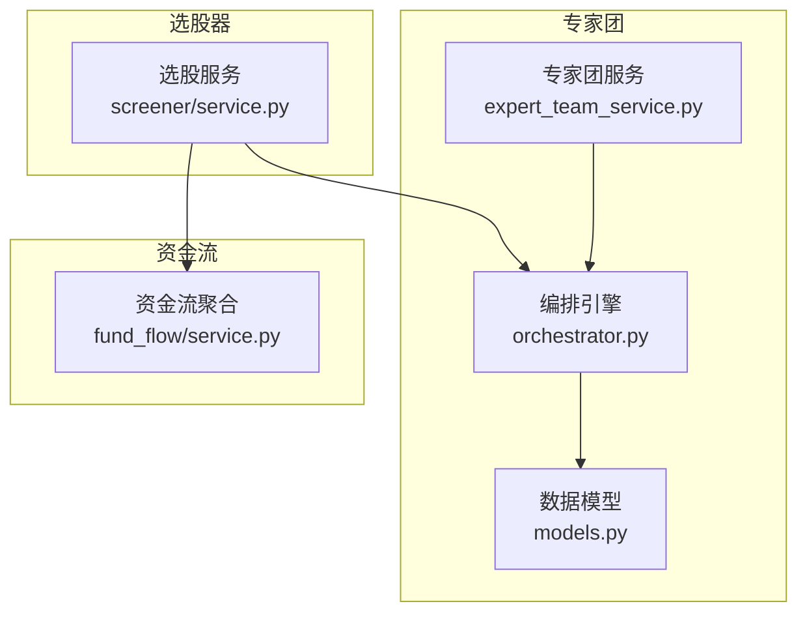
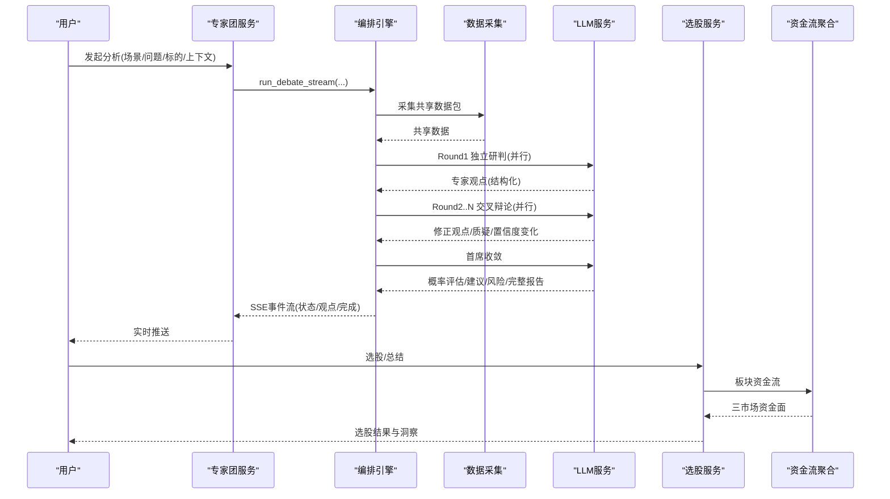
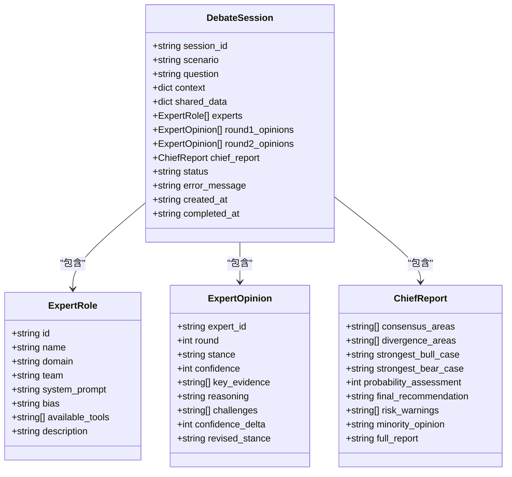
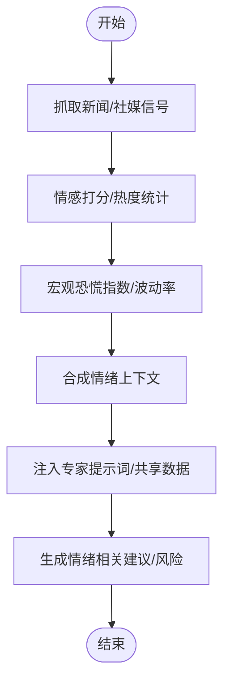
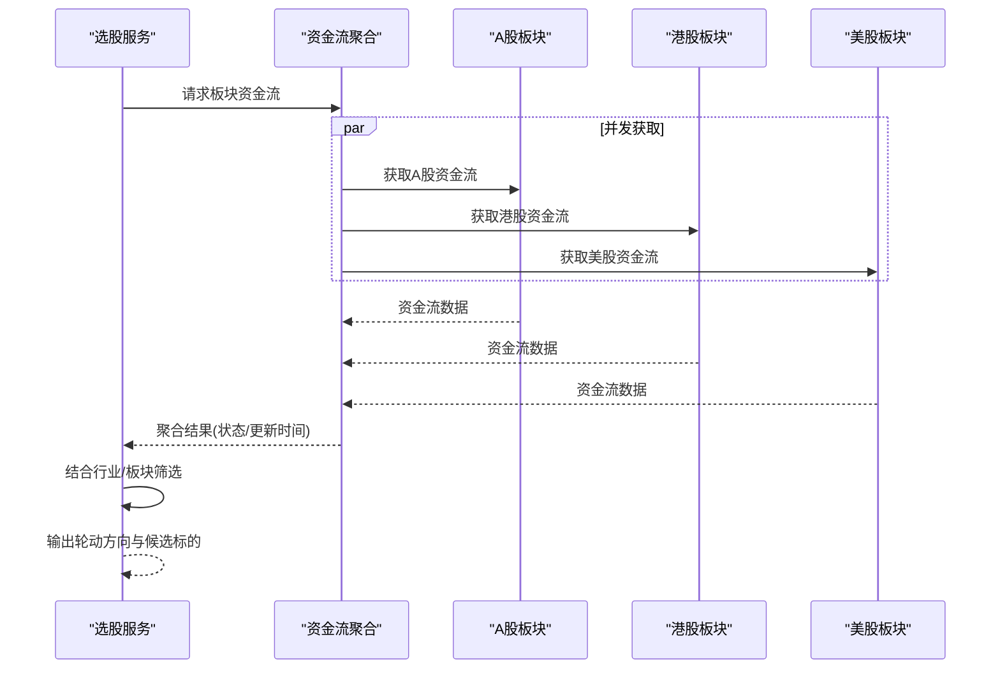
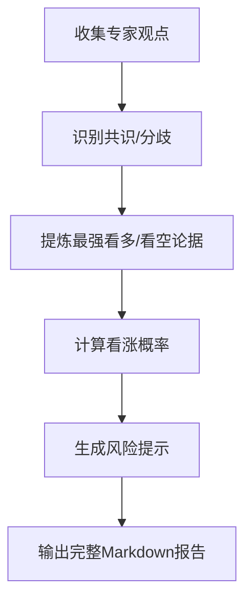
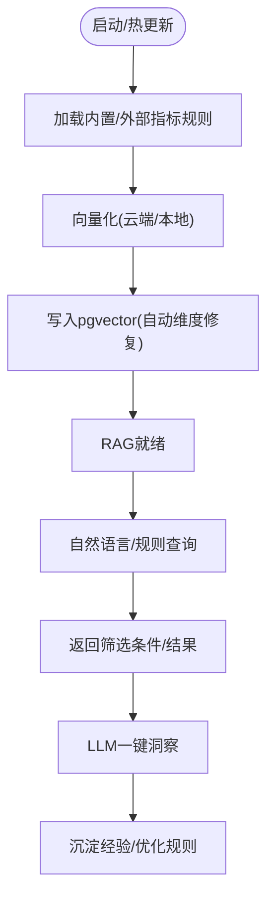
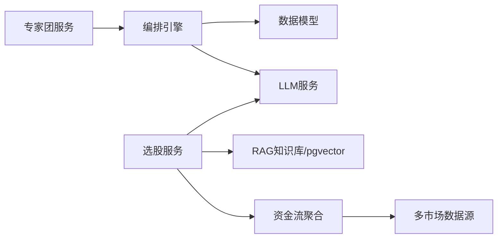

# AI增强选股

<cite>
**本文引用的文件**
- [backend/services/expert_team/expert_team_service.py](file://backend/services/expert_team/expert_team_service.py)
- [backend/services/expert_team/orchestrator.py](file://backend/services/expert_team/orchestrator.py)
- [backend/services/expert_team/models.py](file://backend/services/expert_team/models.py)
- [backend/services/screener/service.py](file://backend/services/screener/service.py)
- [backend/services/fund_flow/service.py](file://backend/services/fund_flow/service.py)
</cite>

## 目录
1. [简介](#简介)
2. [项目结构](#项目结构)
3. [核心组件](#核心组件)
4. [架构总览](#架构总览)
5. [详细组件分析](#详细组件分析)
6. [依赖关系分析](#依赖关系分析)
7. [性能考量](#性能考量)
8. [故障排查指南](#故障排查指南)
9. [结论](#结论)
10. [附录](#附录)

## 简介
本文件面向Quant Agent的AI增强选股能力，系统性说明系统如何结合市场情绪、板块轮动与宏观经济因素优化选股结果；阐述专家团协作机制（角色分工与决策融合）；解释市场情绪分析模型（新闻情感、社交媒体监控、恐慌指数）；给出板块轮动识别算法（行业表现分析与资金流向追踪）；提供AI建议的可解释性报告框架；并说明模型的持续学习与反馈机制。文档同时给出架构图、时序图、流程图等可视化表达，帮助读者快速理解端到端流程。

## 项目结构
围绕“AI增强选股”，后端主要涉及以下模块：
- 专家团编排与持久化：负责多专家并行研判、交叉辩论与首席收敛，输出结构化报告并通过SSE流式推送，支持Redis热缓存与PostgreSQL冷存储双层持久化。
- 选股器服务：将自然语言/规则转译为可执行筛选条件，结合RAG知识库与向量数据库进行语义匹配，并对结果进行LLM一键洞察总结。
- 板块资金流聚合：并发获取A股、港股、美股板块资金流，形成跨市场资金面视图，支撑板块轮动识别。
- 数据与工具集成：通过工具注册表与数据源路由接入行情、新闻、宏观等数据，为专家团与选股器提供事实依据。

**图表来源**
- [backend/services/expert_team/expert_team_service.py:31-65](file://backend/services/expert_team/expert_team_service.py#L31-L65)
- [backend/services/expert_team/orchestrator.py:35-172](file://backend/services/expert_team/orchestrator.py#L35-L172)
- [backend/services/expert_team/models.py:11-128](file://backend/services/expert_team/models.py#L11-L128)
- [backend/services/screener/service.py:16-24](file://backend/services/screener/service.py#L16-L24)
- [backend/services/fund_flow/service.py:18-81](file://backend/services/fund_flow/service.py#L18-L81)

**章节来源**
- [backend/services/expert_team/expert_team_service.py:31-65](file://backend/services/expert_team/expert_team_service.py#L31-L65)
- [backend/services/expert_team/orchestrator.py:35-172](file://backend/services/expert_team/orchestrator.py#L35-L172)
- [backend/services/expert_team/models.py:11-128](file://backend/services/expert_team/models.py#L11-L128)
- [backend/services/screener/service.py:16-24](file://backend/services/screener/service.py#L16-L24)
- [backend/services/fund_flow/service.py:18-81](file://backend/services/fund_flow/service.py#L18-L81)

## 核心组件
- 专家团服务：封装编排器，提供会话管理、SSE事件流与双层持久化（Redis热+PG冷），保障高可用与可追溯。
- 编排引擎：实现三轮混合协议（独立研判→交叉辩论→首席收敛），按场景模板实例化专家，采集共享数据，并行调用LLM生成结构化观点，最终产出概率评估与建议。
- 选股服务：维护RAG指标库与私有规则，将自然语言需求翻译为结构化筛选条件，对结果进行LLM一键洞察总结。
- 资金流聚合：并发拉取三市场板块资金流，统一返回状态与更新时间，用于板块轮动识别。

**章节来源**
- [backend/services/expert_team/expert_team_service.py:31-65](file://backend/services/expert_team/expert_team_service.py#L31-L65)
- [backend/services/expert_team/orchestrator.py:35-172](file://backend/services/expert_team/orchestrator.py#L35-L172)
- [backend/services/screener/service.py:16-24](file://backend/services/screener/service.py#L16-L24)
- [backend/services/fund_flow/service.py:18-81](file://backend/services/fund_flow/service.py#L18-L81)

## 架构总览
AI增强选股的整体流程如下：
- 输入：用户问题/标的/代码上下文/额外上下文。
- 数据采集：根据场景模板的数据需求，采集共享数据包（行情、新闻、宏观、资金流等）。
- 专家团研判：
  - Round 1：各专家基于共享数据独立研判，输出结构化观点与置信度。
  - Round 2..N：交叉辩论，专家审视彼此观点，修正立场与置信度，提出质疑。
  - 首席收敛：综合全部辩论记录，输出共识/分歧、最强看多/看空论据、看涨概率、风险提示与完整Markdown报告。
- 选股与总结：选股服务将自然语言或规则转为筛选条件，结合RAG与向量检索执行过滤，并对结果进行LLM一键洞察总结。
- 资金流与板块轮动：资金流聚合提供跨市场板块资金面视图，辅助识别热点轮动方向。
- 持久化与回放：会话以Redis热缓存+PG冷存储保存，支持历史回溯与审计。

**图表来源**
- [backend/services/expert_team/expert_team_service.py:37-61](file://backend/services/expert_team/expert_team_service.py#L37-L61)
- [backend/services/expert_team/orchestrator.py:43-172](file://backend/services/expert_team/orchestrator.py#L43-L172)
- [backend/services/screener/service.py:421-475](file://backend/services/screener/service.py#L421-L475)
- [backend/services/fund_flow/service.py:21-76](file://backend/services/fund_flow/service.py#L21-L76)

## 详细组件分析

### 专家团协作机制
- 角色分工：专家角色定义包含领域、团队、偏见倾向、可用工具子集与描述，便于在金融/代码/策略等不同域内精准调用。
- 决策融合：Round 1独立研判确保多样性；Round 2交叉辩论引入对抗与纠错；首席收敛综合共识与分歧，输出概率评估与最终建议。
- 会话与持久化：每轮观点与最终报告均写入会话对象，完成后异步落盘至Redis与PG，支持查询历史会话摘要与详情。

**图表来源**
- [backend/services/expert_team/models.py:11-128](file://backend/services/expert_team/models.py#L11-L128)

**章节来源**
- [backend/services/expert_team/models.py:11-128](file://backend/services/expert_team/models.py#L11-L128)
- [backend/services/expert_team/expert_team_service.py:67-145](file://backend/services/expert_team/expert_team_service.py#L67-L145)
- [backend/services/expert_team/orchestrator.py:252-525](file://backend/services/expert_team/orchestrator.py#L252-L525)

### 市场情绪分析模型
- 新闻情感分析：通过数据源路由抓取公司/行业新闻，作为共享数据包的一部分注入专家提示词，辅助判断短期催化与舆情风险。
- 社交媒体监控：可扩展接入社交平台信号（如热度、讨论量），纳入共享数据，提升情绪捕捉粒度。
- 市场恐慌指数：可引入波动率/恐慌指标作为宏观情绪因子，影响专家对下行风险的权重与概率评估。
- 在选股总结中，服务会并发拉取龙头股最新新闻，结合涨跌幅与新闻标题生成“一键洞察”，体现情绪对短期走势的影响。

[此图为概念流程，不直接映射具体源码]

**章节来源**
- [backend/services/screener/service.py:421-475](file://backend/services/screener/service.py#L421-L475)

### 板块轮动识别算法
- 行业表现分析：结合资金流与价格表现，识别强势/弱势行业，定位轮动方向。
- 资金流向追踪：通过资金流聚合服务并发获取A股、港股、美股板块资金流，形成跨市场资金面视图，辅助判断热点扩散与切换。
- 选股联动：选股服务可将“行业/板块”等自然语言需求映射为筛选条件，结合资金流结果进行二次过滤或排序。

**图表来源**
- [backend/services/fund_flow/service.py:21-76](file://backend/services/fund_flow/service.py#L21-L76)
- [backend/services/screener/service.py:155-165](file://backend/services/screener/service.py#L155-L165)

**章节来源**
- [backend/services/fund_flow/service.py:21-76](file://backend/services/fund_flow/service.py#L21-L76)
- [backend/services/screener/service.py:155-165](file://backend/services/screener/service.py#L155-L165)

### AI建议的可解释性报告
- 共识与分歧：首席报告明确列出共识区与分歧区，便于用户理解多数派与少数派逻辑。
- 最强论据：分别提炼最强看多与看空论据，突出关键驱动因素。
- 概率评估：给出看涨概率整数，量化预期收益可能性。
- 风险提示：列出系统性/个体风险点，辅助风控决策。
- 完整报告：提供Markdown格式完整报告，便于归档与分享。

**章节来源**
- [backend/services/expert_team/models.py:39-51](file://backend/services/expert_team/models.py#L39-L51)
- [backend/services/expert_team/orchestrator.py:460-525](file://backend/services/expert_team/orchestrator.py#L460-L525)

### 持续学习与反馈机制
- RAG知识库动态更新：选股服务支持从CSV动态加载指标规则，向量化后灌入PostgreSQL(pgvector)，实现知识库热更新。
- 私有规则CRUD：用户可添加/删除私有规则，绑定user_id隔离，保证个性化与安全性。
- 维度自愈：若embedding列维度不一致，自动ALTER迁移，避免向量入库失败。
- 结果总结闭环：对选股结果进行LLM一键洞察，沉淀为可复用的分析范式，间接反哺规则优化。

**章节来源**
- [backend/services/screener/service.py:26-327](file://backend/services/screener/service.py#L26-L327)
- [backend/services/screener/service.py:329-419](file://backend/services/screener/service.py#L329-L419)
- [backend/services/screener/service.py:421-475](file://backend/services/screener/service.py#L421-L475)

## 依赖关系分析
- 专家团服务依赖编排引擎与数据模型，编排引擎依赖LLM服务与数据采集模块。
- 选股服务依赖RAG知识库、向量数据库与LLM服务，并可调用资金流聚合服务。
- 资金流聚合服务依赖多市场数据源，具备容错与降级能力（partial/error）。

**图表来源**
- [backend/services/expert_team/expert_team_service.py:31-65](file://backend/services/expert_team/expert_team_service.py#L31-L65)
- [backend/services/expert_team/orchestrator.py:35-172](file://backend/services/expert_team/orchestrator.py#L35-L172)
- [backend/services/screener/service.py:16-24](file://backend/services/screener/service.py#L16-L24)
- [backend/services/fund_flow/service.py:18-81](file://backend/services/fund_flow/service.py#L18-L81)

**章节来源**
- [backend/services/expert_team/expert_team_service.py:31-65](file://backend/services/expert_team/expert_team_service.py#L31-L65)
- [backend/services/expert_team/orchestrator.py:35-172](file://backend/services/expert_team/orchestrator.py#L35-L172)
- [backend/services/screener/service.py:16-24](file://backend/services/screener/service.py#L16-L24)
- [backend/services/fund_flow/service.py:18-81](file://backend/services/fund_flow/service.py#L18-L81)

## 性能考量
- 并发与超时：专家团采用并行任务调度，设置单专家与整轮超时，防止长尾阻塞。
- 流式输出：SSE事件流分片推送专家观点与首席报告，降低前端渲染压力，提升交互体验。
- 双层持久化：Redis热缓存+PG冷存储，兼顾读取延迟与数据可靠性；异步写入不阻塞主流程。
- 向量检索：批量嵌入与pgvector入库，支持维度自愈与回退策略，保障RAG稳定性。
- 资源控制：选股总结仅处理前10只龙头股，控制Token用量与生成时延。

**章节来源**
- [backend/services/expert_team/orchestrator.py:30-33](file://backend/services/expert_team/orchestrator.py#L30-L33)
- [backend/services/expert_team/orchestrator.py:252-288](file://backend/services/expert_team/orchestrator.py#L252-L288)
- [backend/services/expert_team/expert_team_service.py:147-194](file://backend/services/expert_team/expert_team_service.py#L147-L194)
- [backend/services/screener/service.py:236-327](file://backend/services/screener/service.py#L236-L327)
- [backend/services/screener/service.py:421-475](file://backend/services/screener/service.py#L421-L475)

## 故障排查指南
- 专家团异常：若某专家Round1/Round2超时或异常，编排器会记录错误并继续其他专家，最终仍尝试首席收敛；可通过会话状态与错误消息定位问题。
- 持久化失败：Redis/PG写入失败会降级到内存兜底，不影响SSE流式输出；检查日志中的警告信息。
- RAG初始化失败：未安装sentence_transformers或未配置Embedding API Key将降级为全量规则模式；确认环境变量与依赖。
- 向量维度不匹配：自动检测并ALTER列类型；若失败，检查pgvector版本与列定义。
- 资金流部分失败：整体状态可能为partial，需检查各市场数据源健康度。

**章节来源**
- [backend/services/expert_team/orchestrator.py:174-184](file://backend/services/expert_team/orchestrator.py#L174-L184)
- [backend/services/expert_team/expert_team_service.py:71-145](file://backend/services/expert_team/expert_team_service.py#L71-L145)
- [backend/services/screener/service.py:194-234](file://backend/services/screener/service.py#L194-L234)
- [backend/services/screener/service.py:236-327](file://backend/services/screener/service.py#L236-L327)
- [backend/services/fund_flow/service.py:57-76](file://backend/services/fund_flow/service.py#L57-L76)

## 结论
Quant Agent的AI增强选股以“专家团+选股器+资金流”为核心，通过三轮混合协议实现多视角研判与稳健收敛，结合RAG与向量检索提升规则匹配精度，并以SSE流式输出与双层持久化保障用户体验与可追溯性。市场情绪与板块轮动作为关键因子，贯穿数据采集、专家提示与结果总结，形成闭环。持续学习机制使系统随数据与反馈不断进化，提供更可解释、更可靠的选股建议。

## 附录
- 使用建议：
  - 合理设置辩论轮数与专家阵容，平衡深度与时效。
  - 利用RAG规则库扩展自定义指标，结合私有规则实现个性化筛选。
  - 关注资金流聚合结果，把握板块轮动节奏。
- 扩展方向：
  - 接入更多情绪数据源（社交、舆情、恐慌指数）。
  - 强化宏观因子与政策事件的解析能力。
  - 完善回测与实盘验证，建立策略迭代闭环。
