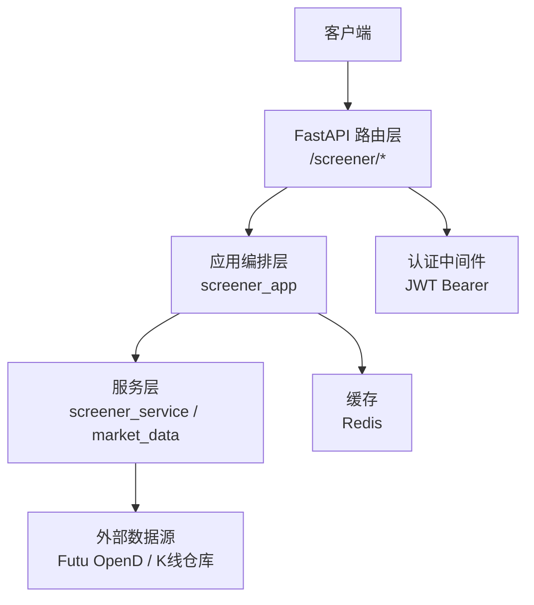
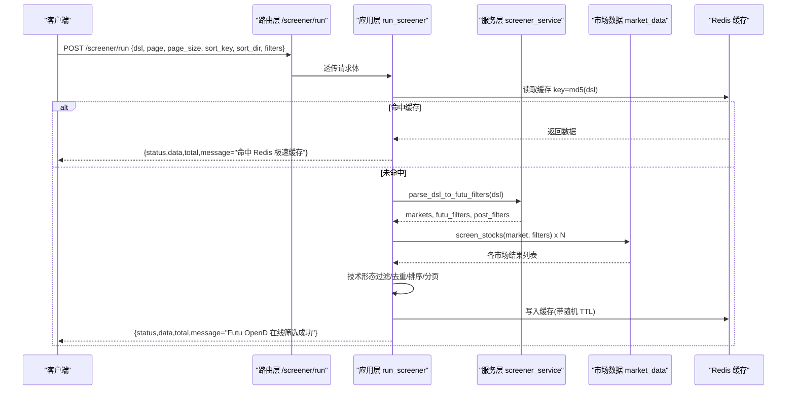
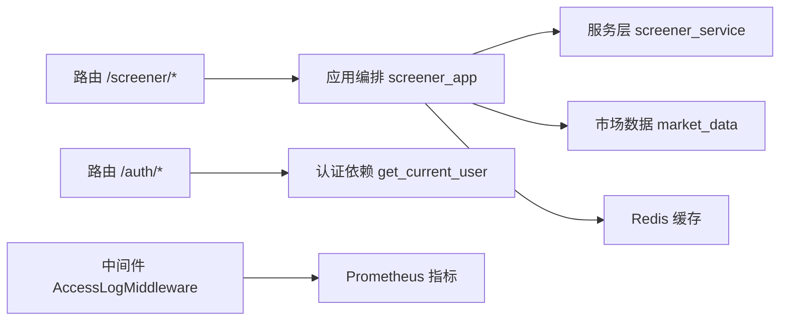

# API接口规范

<cite>
**本文引用的文件**
- [backend/routers/screener.py](file://backend/routers/screener.py)
- [backend/app/screener_app.py](file://backend/app/screener_app.py)
- [backend/routers/auth.py](file://backend/routers/auth.py)
- [backend/core/security.py](file://backend/core/security.py)
- [backend/core/middleware.py](file://backend/core/middleware.py)
- [backend/core/exceptions.py](file://backend/core/exceptions.py)
- [backend/core/error_codes.py](file://backend/core/error_codes.py)
- [docs/10. API接口规范.md](file://docs/10. API接口规范.md)
</cite>

## 目录
1. [简介](#简介)
2. [项目结构](#项目结构)
3. [核心组件](#核心组件)
4. [架构总览](#架构总览)
5. [详细组件分析](#详细组件分析)
6. [依赖关系分析](#依赖关系分析)
7. [性能与限流](#性能与限流)
8. [故障排查指南](#故障排查指南)
9. [结论](#结论)
10. [附录：客户端集成与SDK使用](#附录客户端集成与sdk使用)

## 简介
本规范面向 Quant Agent 选股器系统的 RESTful API 与实时推送能力，覆盖认证鉴权、权限控制、错误码、版本管理、请求/响应约定、WebSocket 实时推送以及客户端集成要点。文档以代码导出的 OpenAPI 为权威来源，并补充业务层面的使用说明与最佳实践。

## 项目结构
后端采用 FastAPI 路由层薄封装 + 应用编排层集中处理的模式：
- 路由层（routers）：仅负责 HTTP 映射、参数校验与依赖注入，不承载业务逻辑。
- 应用编排层（app）：统一收敛选股、订阅、横截面筛选、组合回测等用例。
- 服务层（services）：对外部数据源（如 Futu OpenD）、缓存（Redis）、K线仓库等进行抽象与调用。
- 核心模块（core）：提供安全、异常、中间件、错误码等基础设施。

图表来源
- [backend/routers/screener.py:63-101](file://backend/routers/screener.py#L63-L101)
- [backend/app/screener_app.py:295-463](file://backend/app/screener_app.py#L295-L463)
- [backend/routers/auth.py:66-83](file://backend/routers/auth.py#L66-L83)

章节来源
- [backend/routers/screener.py:1-271](file://backend/routers/screener.py#L1-L271)
- [backend/app/screener_app.py:1-873](file://backend/app/screener_app.py#L1-L873)

## 核心组件
- 选股查询：支持 DSL 查询、自然语言翻译为 DSL、服务端排序与分页、二次过滤与去重、Redis 缓存命中提示。
- 选股历史与字典：保存/读取用户选股历史；维护私有规则词库（RAG）。
- 订阅任务：将选股策略持久化，支持定时触发、启停切换与时间更新。
- 横截面筛选：基于表达式对多标的进行跨指标筛选。
- 组合回测：对选股结果执行等权组合回测并输出报告。
- 认证鉴权：JWT Bearer Token、Refresh Token Cookie、Google OAuth 验证登录。
- 内部通信：HMAC-SHA256 签名校验，防止内网横向渗透。
- 监控与可观测性：Prometheus 指标、访问日志、外部 API 耗时统计。

章节来源
- [backend/routers/screener.py:87-220](file://backend/routers/screener.py#L87-L220)
- [backend/app/screener_app.py:120-199](file://backend/app/screener_app.py#L120-L199)
- [backend/routers/auth.py:117-162](file://backend/routers/auth.py#L117-L162)
- [backend/core/security.py:37-118](file://backend/core/security.py#L37-L118)
- [backend/core/middleware.py:90-133](file://backend/core/middleware.py#L90-L133)

## 架构总览
下图展示一次“DSL 选股”的端到端流程，包括缓存、并发扫盘、二次过滤、排序与分页。

图表来源
- [backend/routers/screener.py:97-101](file://backend/routers/screener.py#L97-L101)
- [backend/app/screener_app.py:295-463](file://backend/app/screener_app.py#L295-L463)

## 详细组件分析

### 选股器 REST 接口
- 基础路径：/screener
- 通用约束：
  - 多数接口需要 JWT Bearer Token（通过路由级依赖注入）。
  - /screener/run 为公开查询端点（注释明确无鉴权），便于前端或第三方直接发起 DSL 选股。
  - 请求体字段由 Pydantic 模型校验，错误时返回统一错误信封。
  - 响应体包含 status/data/message 等业务字段；全局统一信封见文档约定。

主要端点与用法
- GET /screener/suggestions
  - 作用：获取选股灵感提示词（用于前端引导输入）。
  - 参数：limit（默认6，范围1-50）。
  - 响应：{status:"success", data:[...]}。

- POST /screener/translate
  - 作用：将自然语言即时翻译为选股 DSL。
  - 请求体：{query: string}。
  - 响应：{status:"success", data: dsl字符串}。

- POST /screener/run（公开查询）
  - 作用：执行选股查询。
  - 请求体：
    - dsl: JSON 格式的选股条件（AI 生成或手写）。
    - page: 页码（默认1）。
    - page_size: 服务端分页条数（0 表示全量返回）。
    - sort_key: 排序字段（如 mktcap、symbol、name 等）。
    - sort_dir: 排序方向（-1 降序，1 升序）。
    - filters: 表头二次过滤区间（键为列名，值为 {min,max}）。
  - 处理流程：
    - 先查 Redis 缓存（key=md5(dsl)），命中则直接返回。
    - 解析 DSL 为 Futu 过滤条件，并发向多市场发起扫盘。
    - 合并结果后进行技术形态过滤、去重、排序、重新计算排名、分页。
    - 写回 Redis（TTL 带随机抖动防雪崩）。
  - 响应：{status:"success", data:[...], total:N, message:...}。
  - 错误：
    - DSL 非法：400。
    - 数据源未连接：503。
    - 其他异常：500。

- GET /screener/history
  - 作用：获取当前用户的云端选股历史。
  - 鉴权：需要登录。
  - 响应：{status:"success", data:[...]}。

- POST /screener/history
  - 作用：保存当前用户的选股历史。
  - 请求体：history: [{nlp, dsl, time}]。
  - 响应：{status:"success"}。

- POST /screener/reload-indicators
  - 作用：热更新选股指标 RAG 词库。
  - 响应：{status:"success", message:"..."}。

- 字典管理（私有规则）
  - GET /screener/dictionary：获取当前用户私有规则。
  - POST /screener/dictionary：新增一条规则。
  - DELETE /screener/dictionary：按内容删除规则。
  - POST /screener/dictionary/batch：批量导入规则。

- 订阅任务
  - POST /screener/subscribe：创建每日定时选股订阅（含名称、DSL、触发时间 HH:MM）。
  - GET /screener/subscriptions：列出当前用户所有订阅。
  - PUT /screener/subscription/time：更新触发时间。
  - DELETE /screener/subscription/{sub_id}：删除订阅。
  - POST /screener/subscription/{sub_id}/toggle：切换启用/暂停。

- 总结与横截面
  - POST /screener/summarize：对选股结果进行 AI 总结。
  - POST /screener/cross-sectional：基于表达式对多标的进行横截面筛选。

- 组合回测
  - POST /screener/portfolio-backtest：对选股结果执行等权组合回测。

- CEP 异动筛选
  - POST /screener/cep/rule：创建事件规则。
  - GET /screener/cep/rules：列出规则。
  - DELETE /screener/cep/rule/{rule_id}：删除规则。
  - GET /screener/cep/matches/sse?since=0.0：SSE 推送匹配事件。

- 选股条件保存/分享
  - POST /screener/screens：保存/更新筛选条件。
  - GET /screener/screens：列出当前用户保存的条件。
  - GET /screener/screens/{screen_id}：获取单条条件。
  - PUT /screener/screens/{screen_id}：重命名/更新描述。
  - DELETE /screener/screens/{screen_id}：删除条件。

章节来源
- [backend/routers/screener.py:87-220](file://backend/routers/screener.py#L87-L220)
- [backend/app/screener_app.py:120-800](file://backend/app/screener_app.py#L120-L800)

### 认证与权限控制
- 登录
  - POST /auth/login：用户名+密码登录，返回 access_token，并通过 HttpOnly Cookie 设置 refresh_token。
  - 响应：{status:"success", access_token, token_type, user}。
- 刷新令牌
  - POST /auth/refresh：从 Cookie 中读取 refresh_token，签发新的 access_token，并续期 refresh_token。
- 登出
  - POST /auth/logout：清理 refresh_token Cookie，记录审计日志。
- 获取当前用户
  - GET /auth/me：需携带 Bearer Token，返回用户基本信息。
- Google OAuth 验证
  - POST /auth/google/verify：验证前端 Google ID Token，自动注册/登录并签发系统 Token。
- 鉴权依赖
  - get_current_user：解析 Bearer Token，查询数据库用户对象。
  - get_current_user_optional：可选鉴权，有 token 返回 username，否则 None。

章节来源
- [backend/routers/auth.py:66-83](file://backend/routers/auth.py#L66-L83)
- [backend/routers/auth.py:117-162](file://backend/routers/auth.py#L117-L162)
- [backend/routers/auth.py:204-299](file://backend/routers/auth.py#L204-L299)
- [backend/routers/auth.py:305-386](file://backend/routers/auth.py#L305-L386)

### 内部通信安全（HMAC）
- 生成签名：generate_internal_signature(method, path, timestamp?, secret?)
- 验证签名：verify_internal_signature(method, path, signature_header, secret?)
- 请求头：X-Internal-Sig（timestamp.signature）
- 过期时间：5 分钟（配置项）
- 用途：内部服务间调用防重放与防篡改。

章节来源
- [backend/core/security.py:37-118](file://backend/core/security.py#L37-L118)

### 错误处理与统一响应
- 统一响应信封：{code, msg, data, ts}（详见文档全局约定）。
- 错误码定义：ErrorCode 枚举，涵盖认证、请求、基础设施、内部错误等。
- 应用层异常：AppError 继承 HTTPException，便于统一转换为信封格式。
- 常见错误：
  - 400：DSL 格式错误、参数校验失败。
  - 401/403：Token 缺失/无效/权限不足。
  - 404：资源不存在。
  - 503：数据源未连接或不可用。
  - 500：内部未知错误。

章节来源
- [docs/10. API接口规范.md:32-77](file://docs/10. API接口规范.md#L32-L77)
- [backend/core/error_codes.py:15-55](file://backend/core/error_codes.py#L15-L55)
- [backend/core/exceptions.py:118-144](file://backend/core/exceptions.py#L118-L144)

### WebSocket 实时推送
- 协议说明：行情 WebSocket 路径与消息格式在文档中有明确约定（V1.1 纠偏后为 /api/v1/market/quotes/ws）。
- 鉴权：连接时通过 QueryString 传递 token。
- 客户端消息：
  - subscribe/unsubscribe：订阅/取消订阅 quote/kline 频道。
  - ping：心跳保活。
- 服务端消息：
  - connected：连接确认。
  - tick/kline_update：行情/K线实时更新。
  - pong：心跳应答。
  - error：服务端主动错误通知。

注意：本仓库当前可见的选股器路由未暴露独立的 WebSocket 端点；若需选股结果实时推送，可复用文档约定的行情 WS 通道或结合 CEP SSE 接口（/screener/cep/matches/sse）实现事件驱动推送。

章节来源
- [docs/10. API接口规范.md:465-520](file://docs/10. API接口规范.md#L465-L520)
- [backend/routers/screener.py:218-220](file://backend/routers/screener.py#L218-L220)

## 依赖关系分析
- 路由层依赖应用编排层函数（run_screener、translate_dsl、get_dictionary 等）。
- 应用编排层依赖服务层（screener_service、market_data）与缓存（redis_client）。
- 认证依赖 JWT 解码与数据库查询。
- 中间件提供 Prometheus 指标与访问日志。

图表来源
- [backend/routers/screener.py:63-101](file://backend/routers/screener.py#L63-L101)
- [backend/app/screener_app.py:23-27](file://backend/app/screener_app.py#L23-L27)
- [backend/routers/auth.py:66-83](file://backend/routers/auth.py#L66-L83)
- [backend/core/middleware.py:90-133](file://backend/core/middleware.py#L90-L133)

章节来源
- [backend/routers/screener.py:1-271](file://backend/routers/screener.py#L1-L271)
- [backend/app/screener_app.py:1-873](file://backend/app/screener_app.py#L1-L873)
- [backend/routers/auth.py:1-386](file://backend/routers/auth.py#L1-L386)
- [backend/core/middleware.py:1-133](file://backend/core/middleware.py#L1-L133)

## 性能与限流
- 缓存策略：
  - 基于 DSL 哈希的 Redis 缓存，命中即返回，减少重复计算。
  - TTL 带随机抖动，避免雪崩效应。
- 并发处理：
  - 多市场扫盘使用 asyncio.gather 并发执行，提升吞吐。
- 排序与分页：
  - 服务端动态排序与切片，降低前端压力。
- 监控：
  - Prometheus 指标记录请求总数、延迟分布、外部 API 耗时。
  - 慢请求告警（>3s）。
- 限流策略：
  - 当前路由层未见显式速率限制中间件；建议在生产环境引入基于 IP/用户维度的限流（如 Redis 计数器或网关层限流），并结合熔断保护外部数据源。

章节来源
- [backend/app/screener_app.py:295-463](file://backend/app/screener_app.py#L295-L463)
- [backend/core/middleware.py:10-38](file://backend/core/middleware.py#L10-L38)
- [backend/core/middleware.py:44-88](file://backend/core/middleware.py#L44-L88)

## 故障排查指南
- 常见问题定位：
  - DSL 解析失败：检查 JSON 合法性与字段语义。
  - 数据源未连接：检查 Futu OpenD 状态与网络连通性。
  - Redis 不可用：检查缓存服务健康与权限。
  - 鉴权失败：检查 Token 是否有效、是否过期、是否携带正确 Header。
- 日志与指标：
  - 查看中间件记录的访问日志与耗时。
  - 通过 Prometheus 面板观察 P95/P99 延迟与 5xx 错误率。
- 错误码对照：
  - 参考 ErrorCode 枚举与 HTTP 状态映射，快速定位问题域。

章节来源
- [backend/core/exceptions.py:14-116](file://backend/core/exceptions.py#L14-L116)
- [backend/core/error_codes.py:15-55](file://backend/core/error_codes.py#L15-L55)
- [backend/core/middleware.py:90-133](file://backend/core/middleware.py#L90-L133)

## 结论
本规范明确了 Quant Agent 选股器的 RESTful API 与实时推送能力，覆盖认证鉴权、权限控制、错误码、版本管理与客户端集成要点。建议在生产环境补充显式限流与更细粒度的熔断策略，以提升系统稳定性与可观测性。

## 附录：客户端集成与SDK使用
- 认证流程
  - 登录获取 access_token，并在后续请求中携带 Authorization: Bearer <token>。
  - 使用 Refresh Token Cookie 自动续期 access_token。
- 选股查询
  - 优先使用 translate 接口将自然语言转为 DSL，再调用 run 执行查询。
  - 合理使用 page/page_size 与服务端排序，优化前端渲染性能。
- 实时推送
  - 使用文档约定的 WebSocket 通道订阅行情/K线，连接时附带 token。
  - 对于选股结果的事件推送，可结合 CEP SSE 接口订阅匹配事件。
- SDK 建议
  - 封装统一的 HTTP 客户端，自动处理鉴权、重试、超时与错误转换。
  - 对 WebSocket 连接实现断线重连与心跳保活。
  - 缓存 DSL 与历史结果，减少重复请求。

章节来源
- [docs/10. API接口规范.md:52-77](file://docs/10. API接口规范.md#L52-L77)
- [docs/10. API接口规范.md:465-520](file://docs/10. API接口规范.md#L465-L520)
- [backend/routers/auth.py:117-162](file://backend/routers/auth.py#L117-L162)
- [backend/routers/auth.py:305-386](file://backend/routers/auth.py#L305-L386)
