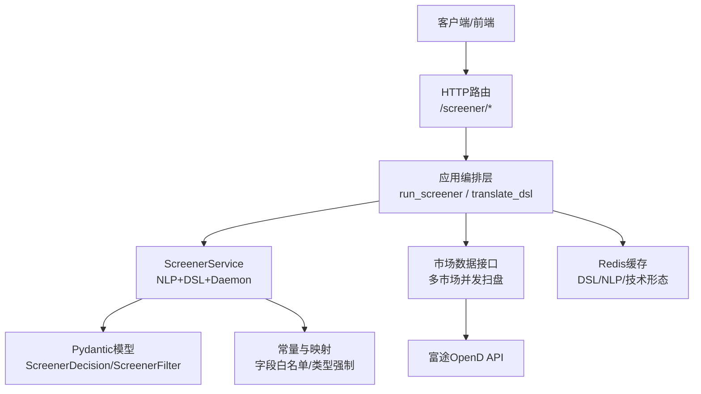
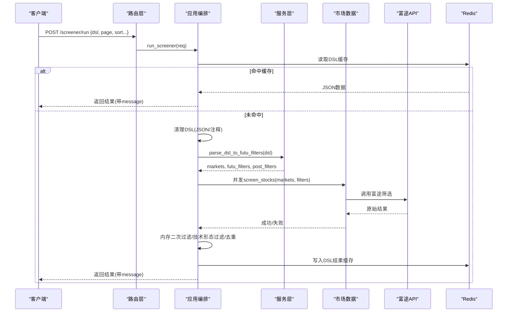
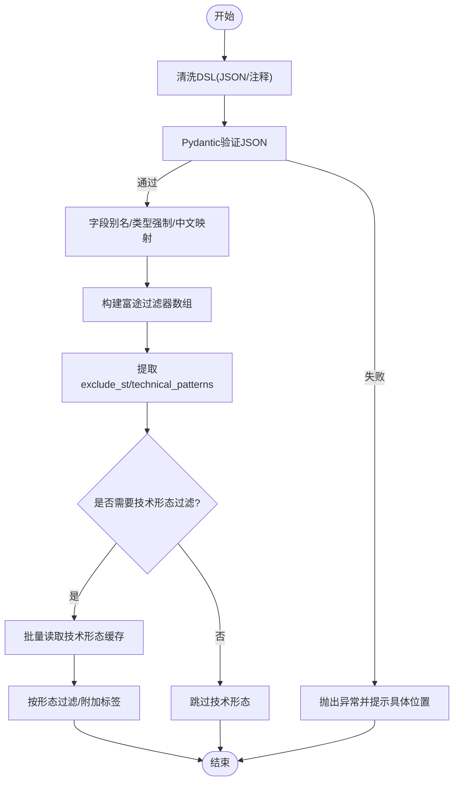
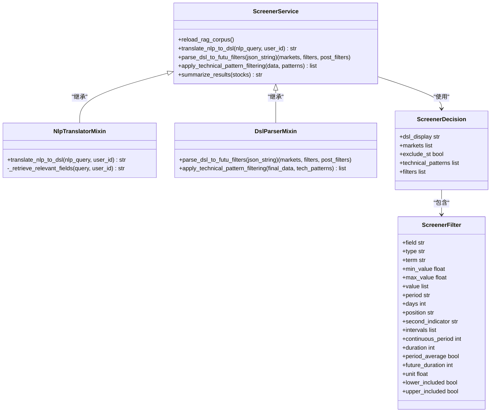

# DSL语法规范

<cite>
**本文引用的文件**
- [backend/services/screener/models.py](file://backend/services/screener/models.py)
- [backend/services/screener/constants.py](file://backend/services/screener/constants.py)
- [backend/services/screener/dsl_parser.py](file://backend/services/screener/dsl_parser.py)
- [backend/services/screener/nlp_translator.py](file://backend/services/screener/nlp_translator.py)
- [backend/services/screener/service.py](file://backend/services/screener/service.py)
- [backend/app/screener_app.py](file://backend/app/screener_app.py)
- [backend/routers/screener.py](file://backend/routers/screener.py)
</cite>

## 目录
1. [简介](#简介)
2. [项目结构](#项目结构)
3. [核心组件](#核心组件)
4. [架构总览](#架构总览)
5. [详细组件分析](#详细组件分析)
6. [依赖关系分析](#依赖关系分析)
7. [性能与缓存](#性能与缓存)
8. [故障诊断与修复指南](#故障诊断与修复指南)
9. [结论](#结论)
10. [附录：DSL字段与示例速查](#附录dsl字段与示例速查)

## 简介
本规范面向Quant Agent选股器的DSL（领域特定语言），定义其数据结构、语法规则、解析流程与错误处理机制。该DSL以JSON为承载，由大模型将自然语言转译为结构化筛选条件，再由后端校验并下发至富途API执行筛选；同时支持技术形态二次过滤与横截面表达式等扩展能力。文档覆盖条件表达式、逻辑组合、比较运算符、函数调用语法、字段类型、版本兼容性与常见错误诊断。

## 项目结构
- HTTP边界层：路由仅做参数映射与鉴权注入，业务编排下沉到应用层。
- 应用编排层：负责DSL清洗、缓存、并发扫盘、排序分页、去重与结果封装。
- 服务层：组合NLP转译、DSL解析、定时任务与RAG规则管理。
- 数据模型与常量：Pydantic模型约束字段、类型强制、中文映射与白名单。
- 解析器：将LLM输出的JSON转译为富途可执行的过滤条件数组，并执行技术面二次过滤。

**图表来源**
- [backend/routers/screener.py:87-200](file://backend/routers/screener.py#L87-L200)
- [backend/app/screener_app.py:286-459](file://backend/app/screener_app.py#L286-L459)
- [backend/services/screener/service.py:16-24](file://backend/services/screener/service.py#L16-L24)
- [backend/services/screener/models.py:121-130](file://backend/services/screener/models.py#L121-L130)
- [backend/services/screener/constants.py:57-144](file://backend/services/screener/constants.py#L57-L144)

**章节来源**
- [backend/routers/screener.py:1-271](file://backend/routers/screener.py#L1-L271)
- [backend/app/screener_app.py:1-800](file://backend/app/screener_app.py#L1-L800)
- [backend/services/screener/service.py:1-480](file://backend/services/screener/service.py#L1-L480)

## 核心组件
- ScreenerDecision：顶层决策对象，包含市场、是否剔除ST、技术形态、filters数组与展示用dsl_display。
- ScreenerFilter：单个筛选条件，支持简单指标、财务指标、累计指标、板块、K线形态、指标位置、资金流/期权等。
- DslParserMixin：将JSON转译为富途过滤器数组，并执行技术形态二次过滤。
- NlpTranslatorMixin：自然语言→DSL的转译，含RAG召回、语义缓存、重试与兜底。
- ScreenerService：组合上述能力并提供RAG规则CRUD与结果总结。

**章节来源**
- [backend/services/screener/models.py:20-130](file://backend/services/screener/models.py#L20-L130)
- [backend/services/screener/dsl_parser.py:13-78](file://backend/services/screener/dsl_parser.py#L13-L78)
- [backend/services/screener/nlp_translator.py:18-322](file://backend/services/screener/nlp_translator.py#L18-L322)
- [backend/services/screener/service.py:16-480](file://backend/services/screener/service.py#L16-L480)

## 架构总览

**图表来源**
- [backend/routers/screener.py:97-101](file://backend/routers/screener.py#L97-L101)
- [backend/app/screener_app.py:295-459](file://backend/app/screener_app.py#L295-L459)
- [backend/services/screener/dsl_parser.py:16-78](file://backend/services/screener/dsl_parser.py#L16-L78)

## 详细组件分析

### 数据结构与语法规则
- 顶层对象（ScreenerDecision）
  - dsl_display：用于前端展示的短句，自动截断与中文形态替换。
  - markets：市场代码数组，如["US","HK","SH","SZ"]；若为空将补全默认市场。
  - exclude_st：是否剔除ST股。
  - technical_patterns：技术形态数组，如["macd_gold_cross","rsi_oversold"]。
  - filters：筛选条件数组，每个元素为ScreenerFilter。
- 筛选条件（ScreenerFilter）关键字段
  - field：底层字段名或枚举（如PE_TTM、MARKET_CAP、MACD_GOLD_CROSS）。
  - type：字段类型，包括simple、financial、accumulate、plate、exclude_plate、featured、indicator、indicator_pattern、indicator_positional、kline_shape、broker、option。
  - term：财报周期（如ANNUAL、TTM、SURPRISE_LATEST等，财务类常用）。
  - min_value/max_value：数值区间（比率/百分比需使用小数，如0.15表示15%）。
  - value：板块数组（如["银行","半导体"]）。
  - period：K线周期（如K_DAY、K_60M）。
  - days：累计天数（用于累计型指标）。
  - position：位置关系（ABOVE、BELOW、CROSS_UP、CROSS_DOWN）。
  - second_indicator：对比的第二指标名称（如MA）。
  - intervals：特定指标/期权区间。
  - continuous_period：连续满足条件的期数（如连续3年）。
  - duration：历史时间窗口长度（配合period_average使用）。
  - period_average：是否周期求均值。
  - future_duration：未来观测期/预测窗口。
  - unit：量纲/单位换算。
  - lower_included/upper_included：区间开闭。
- 字段白名单与类型强制
  - 通过常量表维护有效字段集合与类型强制映射，防止误用。
  - 提供别名映射（中英文混用、历史命名）与中文显示映射。
- 逻辑组合与比较
  - 单条filter内部通过min_value/max_value表达区间比较。
  - 多条filter之间为“且”的关系；如需“或”，可通过拆分多个请求或使用横截面表达式（见后文）。
  - NOT逻辑可通过设置相反区间实现（例如排除某范围）。
- 函数调用语法
  - 技术指标与形态通过type=indicator/indicator_pattern/kline_shape/indicator_positional等表达，结合field、period、position、second_indicator等字段描述函数式语义。
  - 复杂形态（如VCP、跳空高开、连续三天放量）降级到technical_patterns数组，由二次流水线计算。

**章节来源**
- [backend/services/screener/models.py:20-130](file://backend/services/screener/models.py#L20-L130)
- [backend/services/screener/constants.py:10-144](file://backend/services/screener/constants.py#L10-L144)
- [backend/services/screener/constants.py:234-315](file://backend/services/screener/constants.py#L234-L315)

### 解析器工作原理
- NLP→DSL转译
  - 标准化查询、RAG动态召回相关指标、组装提示词调用大模型生成JSON。
  - 使用Pydantic预验证，失败时自动反馈错误并最多重试两次；仍失败则回退到默认DSL。
  - 成功后将DSL存入Redis进行语义缓存（带版本号与随机TTL防雪崩）。
- JSON→富途过滤器
  - 校验并规范化字段名（别名映射）、类型强制纠偏、非财务指标剔除term、字段中文名剥离。
  - 特殊字段还原（如VOLUME_MULTIPLE→VOLUME_RATIO）。
  - 输出markets、futu_filters、post_filters（exclude_st、technical_patterns）。
- 技术形态二次过滤
  - 批量从Redis读取技术形态命中结果，避免重复拉取历史K线。
  - 对纯技术形态进行过滤，另类数据（如高管净买入）通过异步联邦过滤。
  - 最终附加matched_patterns列供前端展示。

**图表来源**
- [backend/app/screener_app.py:286-390](file://backend/app/screener_app.py#L286-L390)
- [backend/services/screener/dsl_parser.py:16-78](file://backend/services/screener/dsl_parser.py#L16-L78)
- [backend/services/screener/dsl_parser.py:80-193](file://backend/services/screener/dsl_parser.py#L80-L193)

**章节来源**
- [backend/services/screener/nlp_translator.py:96-322](file://backend/services/screener/nlp_translator.py#L96-L322)
- [backend/services/screener/dsl_parser.py:16-193](file://backend/services/screener/dsl_parser.py#L16-L193)

### 错误处理机制
- Pydantic验证失败：打印详细错误位置与上下文，转换为人类可读信息并抛出异常。
- LLM输出非法：自动重试并反馈错误消息；达到最大重试次数后使用兜底DSL。
- 字段互斥冲突：检测同一字段的min>max情况，直接报错阻止无效查询。
- 技术形态保护：当候选过多时拒绝批量拉取历史K线，避免API限流与额度耗尽。
- 市场连接状态：若富途未连接且无结果，返回明确的状态码与提示信息。

**章节来源**
- [backend/services/screener/dsl_parser.py:16-55](file://backend/services/screener/dsl_parser.py#L16-L55)
- [backend/services/screener/models.py:151-201](file://backend/services/screener/models.py#L151-L201)
- [backend/app/screener_app.py:436-463](file://backend/app/screener_app.py#L436-L463)

### 版本兼容性与向后兼容策略
- 字段别名与中文映射：支持历史命名与中文别名，确保旧DSL仍可解析。
- 类型强制纠偏：根据字段白名单强制修正type，防止误分类。
- 市场展开：模糊市场（如CN/A）自动展开为SH/SZ，保证兼容性。
- 技术形态降级：不支持的复杂形态自动降级到technical_patterns，保持功能可用。
- 缓存键版本化：NLP缓存键包含版本号，便于后续升级平滑过渡。

**章节来源**
- [backend/services/screener/constants.py:10-55](file://backend/services/screener/constants.py#L10-L55)
- [backend/services/screener/models.py:51-118](file://backend/services/screener/models.py#L51-L118)
- [backend/services/screener/models.py:151-217](file://backend/services/screener/models.py#L151-L217)
- [backend/services/screener/nlp_translator.py:96-108](file://backend/services/screener/nlp_translator.py#L96-L108)

### 常见语法示例
- 简单单条件：市盈率区间、市值下限、最新价范围。
- 多条件组合：财务指标+价格指标+技术形态（如ROE>0.15且PE<20且MACD金叉）。
- 累计型指标：过去N日涨跌幅、成交量均值、换手率区间。
- K线形态与指标位置：多头排列、突破上轨、价格上穿均线。
- 另类数据：高管净买入作为技术形态之一参与过滤。

说明：以上示例对应filters数组中的不同type与字段组合，具体字段取值请参考附录与常量表。

[本节为概念性说明，不直接引用具体代码行]

## 依赖关系分析

**图表来源**
- [backend/services/screener/service.py:16-24](file://backend/services/screener/service.py#L16-L24)
- [backend/services/screener/nlp_translator.py:18-322](file://backend/services/screener/nlp_translator.py#L18-L322)
- [backend/services/screener/dsl_parser.py:13-193](file://backend/services/screener/dsl_parser.py#L13-L193)
- [backend/services/screener/models.py:20-130](file://backend/services/screener/models.py#L20-L130)

**章节来源**
- [backend/services/screener/service.py:1-480](file://backend/services/screener/service.py#L1-L480)
- [backend/services/screener/models.py:20-130](file://backend/services/screener/models.py#L20-L130)

## 性能与缓存
- NLP语义缓存：基于MD5归一化查询，命中即秒回，减少LLM调用。
- DSL结果缓存：按DSL哈希缓存筛选结果，带随机Jitter防雪崩。
- 技术形态缓存：按标的与日期批量读取，避免重复拉取历史K线。
- 并发扫盘：多市场并行调用富途接口，提升吞吐。
- 内存二次过滤：服务端排序、分页与表头区间过滤，降低前端压力。

**章节来源**
- [backend/services/screener/nlp_translator.py:96-108](file://backend/services/screener/nlp_translator.py#L96-L108)
- [backend/app/screener_app.py:299-355](file://backend/app/screener_app.py#L299-L355)
- [backend/services/screener/dsl_parser.py:92-124](file://backend/services/screener/dsl_parser.py#L92-L124)

## 故障诊断与修复指南
- 常见错误定位
  - Pydantic验证失败：查看错误位置与类型，检查字段名、类型、数值格式。
  - LLM输出非法：关注重试日志与错误消息，必要时调整自然语言表述。
  - 字段互斥冲突：检查同一字段的min与max是否合理。
  - 技术形态保护：若候选过多，系统会拒绝批量拉取历史K线，建议缩小范围或增加前置筛选。
- 修复建议
  - 使用别名与中文映射修正字段名。
  - 将比率/百分比转为小数输入。
  - 将不支持的复杂形态降级到technical_patterns。
  - 明确市场代码，避免模糊缩写。
  - 利用横截面表达式进行更复杂的跨指标筛选。

**章节来源**
- [backend/services/screener/dsl_parser.py:16-55](file://backend/services/screener/dsl_parser.py#L16-L55)
- [backend/services/screener/models.py:151-201](file://backend/services/screener/models.py#L151-L201)
- [backend/app/screener_app.py:436-463](file://backend/app/screener_app.py#L436-L463)

## 结论
本DSL以JSON为载体，结合Pydantic强类型校验、常量白名单与类型强制，确保从自然语言到富途API的稳定转译。通过NLP语义缓存、DSL结果缓存与技术形态缓存，系统在性能与稳定性方面具备良好保障。错误处理机制覆盖解析、验证、网络与资源保护等多环节，提供清晰的诊断与修复路径。

[本节为总结性内容，不直接引用具体代码行]

## 附录：DSL字段与示例速查
- 字段类型
  - simple：简单指标（如PE_TTM、PB、PRICE、DIVIDEND_RATIO等）。
  - financial：财务指标（如ROE、ROA_TTM、DEBT_TO_ASSETS、REVENUE_GROWTH等）。
  - accumulate：累计型指标（如PRICE_CHANGE_PCT、AMPLITUDE、AVG_VOLUME等）。
  - plate/exclude_plate：行业板块筛选。
  - featured：特色指标（如HIST_PERCENTILE_PE/PB/PS）。
  - indicator/indicator_pattern/kline_shape/indicator_positional：技术指标与形态。
  - broker/option：资金流与期权相关。
- 比较与区间
  - min_value/max_value：区间比较，比率/百分比使用小数。
  - lower_included/upper_included：区间开闭控制。
- 时序与周期
  - term：财报周期（ANNUAL、TTM、SURPRISE_LATEST等）。
  - period：K线周期（K_DAY、K_60M等）。
  - days：累计天数。
  - continuous_period：连续满足期数。
  - duration/period_average：周期均值计算。
- 技术形态
  - technical_patterns：["macd_gold_cross","rsi_oversold","kdj_gold_cross","rsi_bottom_diverge","rsi_top_diverge","macd_bottom_diverge","macd_top_diverge","vcp_pattern","gap_up","volume_surge_3d","insider_net_buy"]。
- 示例思路
  - 单条件：PE_TTM在10~20之间。
  - 多条件：ROE>0.15且PE<20且MACD金叉。
  - 累计型：近5日涨跌幅在-5%~5%之间。
  - 形态：多头排列或突破上轨。
  - 另类数据：高管净买入参与过滤。

[本节为概念性速查，不直接引用具体代码行]