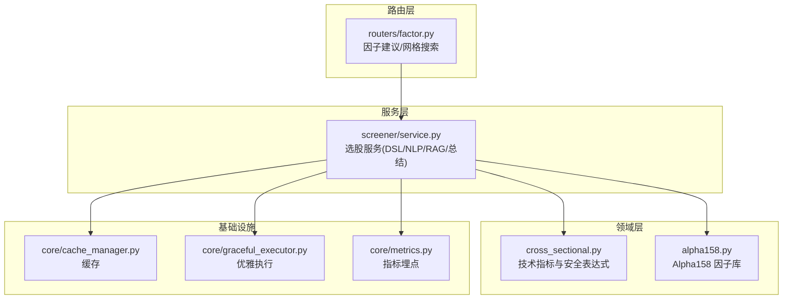
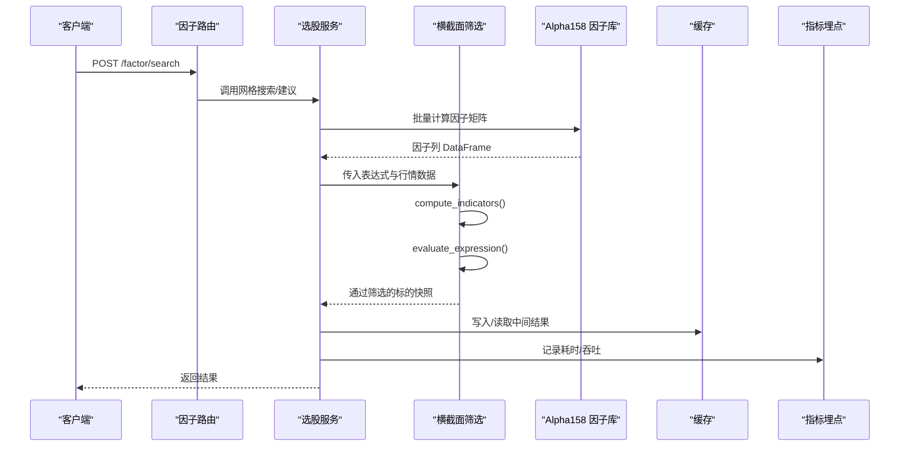
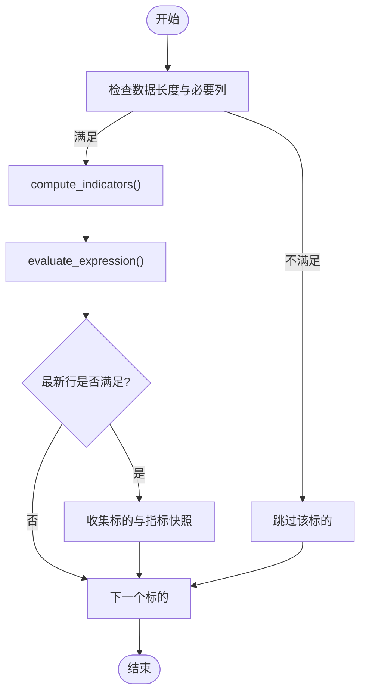
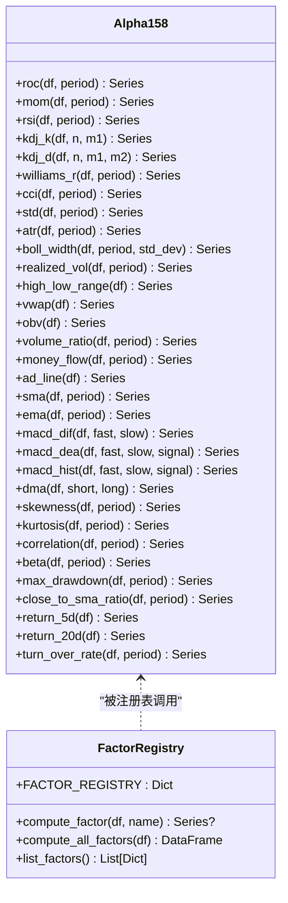
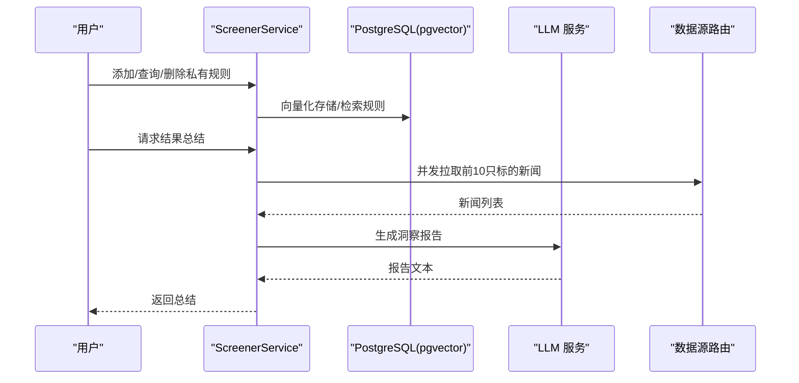
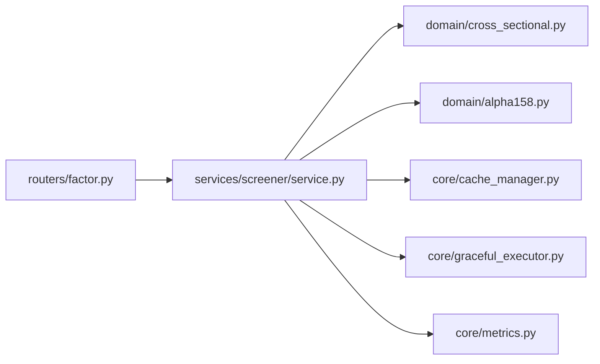

# 横截面分析引擎

<cite>
**本文引用的文件**
- [backend/domain/cross_sectional.py](file://backend/domain/cross_sectional.py)
- [backend/domain/alpha158.py](file://backend/domain/alpha158.py)
- [backend/services/screener/service.py](file://backend/services/screener/service.py)
- [backend/routers/factor.py](file://backend/routers/factor.py)
- [backend/services/factor_mining/factor_miner.py](file://backend/services/factor_mining/factor_miner.py)
- [backend/core/cache_manager.py](file://backend/core/cache_manager.py)
- [backend/core/graceful_executor.py](file://backend/core/graceful_executor.py)
- [backend/core/metrics.py](file://backend/core/metrics.py)
</cite>

## 目录
1. [简介](#简介)
2. [项目结构](#项目结构)
3. [核心组件](#核心组件)
4. [架构总览](#架构总览)
5. [详细组件分析](#详细组件分析)
6. [依赖关系分析](#依赖关系分析)
7. [性能考虑](#性能考虑)
8. [故障排查指南](#故障排查指南)
9. [结论](#结论)
10. [附录](#附录)

## 简介
本技术文档聚焦于 Quant Agent 的横截面分析引擎，系统阐述横截面选股算法的核心原理与工程实现。内容涵盖因子构建、标准化处理、评分排序机制；支持的分析维度（市值、估值、动量、质量等）及其计算方法；多因子模型的权重分配与组合策略；结果过滤与排名算法（百分位排名、Z-score 标准化等）；以及面向大规模股票池的性能优化策略（并行计算、数据缓存、内存管理）。

## 项目结构
横截面分析能力由“领域层 + 服务层 + 路由层”共同构成：
- 领域层提供纯 Pandas 矢量化指标与因子计算、安全表达式解析与求值、横截面筛选入口。
- 服务层提供选股器编排、自然语言到 DSL 的翻译、RAG 规则库管理与结果总结。
- 路由层暴露因子挖掘与搜索 API，支撑上层应用调用。

图表来源
- [backend/domain/cross_sectional.py:1-321](file://backend/domain/cross_sectional.py#L1-L321)
- [backend/domain/alpha158.py:1-385](file://backend/domain/alpha158.py#L1-L385)
- [backend/services/screener/service.py:1-480](file://backend/services/screener/service.py#L1-L480)
- [backend/routers/factor.py:1-74](file://backend/routers/factor.py#L1-L74)
- [backend/core/cache_manager.py](file://backend/core/cache_manager.py)
- [backend/core/graceful_executor.py](file://backend/core/graceful_executor.py)
- [backend/core/metrics.py](file://backend/core/metrics.py)

章节来源
- [backend/domain/cross_sectional.py:1-321](file://backend/domain/cross_sectional.py#L1-L321)
- [backend/domain/alpha158.py:1-385](file://backend/domain/alpha158.py#L1-L385)
- [backend/services/screener/service.py:1-480](file://backend/services/screener/service.py#L1-L480)
- [backend/routers/factor.py:1-74](file://backend/routers/factor.py#L1-L74)

## 核心组件
- 横截面筛选器：基于已计算的指标序列，对每只标的执行安全表达式求值，输出通过筛选的标的快照。
- Alpha158 因子库：提供动量、波动率、量价、均线、统计与衍生类因子，全部为纯 Pandas 矢量化实现。
- 选股服务：整合 DSL 解析、NLP 翻译、RAG 规则库、结果总结等功能，对外提供选股流程编排。
- 因子挖掘路由：提供 LLM 建议因子与参数网格搜索接口，便于策略研发与回测。

章节来源
- [backend/domain/cross_sectional.py:105-321](file://backend/domain/cross_sectional.py#L105-L321)
- [backend/domain/alpha158.py:31-385](file://backend/domain/alpha158.py#L31-L385)
- [backend/services/screener/service.py:16-480](file://backend/services/screener/service.py#L16-L480)
- [backend/routers/factor.py:18-74](file://backend/routers/factor.py#L18-L74)

## 架构总览
横截面分析引擎采用“指标/因子计算 → 表达式求值 → 筛选 → 可选的多因子组合与排序”的分层架构。服务层负责将用户意图（自然语言或 DSL）转译为可执行的筛选条件，并调用领域层的计算能力完成横截面评估。

图表来源
- [backend/routers/factor.py:28-74](file://backend/routers/factor.py#L28-L74)
- [backend/services/screener/service.py:16-480](file://backend/services/screener/service.py#L16-L480)
- [backend/domain/cross_sectional.py:105-321](file://backend/domain/cross_sectional.py#L105-L321)
- [backend/domain/alpha158.py:363-385](file://backend/domain/alpha158.py#L363-L385)
- [backend/core/cache_manager.py](file://backend/core/cache_manager.py)
- [backend/core/metrics.py](file://backend/core/metrics.py)

## 详细组件分析

### 横截面筛选器（cross_sectional）
- 指标计算：内置 RSI、KDJ、MACD、布林带、ATR、量比，以及 SMA/EMA 系列，全部使用 Pandas 滚动/指数加权方法实现，保证向量化高效计算。
- 安全表达式：对用户输入的表达式进行规范化与白名单校验，仅允许受控的指标引用、比较符、逻辑运算符与常量，避免任意代码执行风险。
- 筛选入口：对每个标的计算指标后，按最新行判断是否满足表达式，收集通过的标的及指标快照。

图表来源
- [backend/domain/cross_sectional.py:105-137](file://backend/domain/cross_sectional.py#L105-L137)
- [backend/domain/cross_sectional.py:197-264](file://backend/domain/cross_sectional.py#L197-L264)
- [backend/domain/cross_sectional.py:272-321](file://backend/domain/cross_sectional.py#L272-L321)

章节来源
- [backend/domain/cross_sectional.py:25-137](file://backend/domain/cross_sectional.py#L25-L137)
- [backend/domain/cross_sectional.py:140-264](file://backend/domain/cross_sectional.py#L140-L264)
- [backend/domain/cross_sectional.py:272-321](file://backend/domain/cross_sectional.py#L272-L321)

### Alpha158 因子库（alpha158）
- 因子类别：动量（ROC、MOM、RSI、KDJ、Williams %R、CCI）、波动率（STD、ATR、Bollinger Width、Realized Volatility、日内振幅）、量价（VWAP、OBV、量比、MFI、AD Line）、均线（SMA、EMA、MACD、DMA）、统计（偏度、峰度、相关性、Beta、滚动最大回撤）、衍生（收盘价/SMA 比率、短期收益率、换手率均值）。
- 注册表：统一维护因子名、默认参数与分类，提供单因子与全量因子计算接口。
- 复杂度：多数因子为 O(N) 滚动/指数加权操作，整体因子矩阵计算在 Pandas 层面高度向量化，适合大规模标的批处理。

图表来源
- [backend/domain/alpha158.py:31-315](file://backend/domain/alpha158.py#L31-L315)
- [backend/domain/alpha158.py:317-385](file://backend/domain/alpha158.py#L317-L385)

章节来源
- [backend/domain/alpha158.py:31-385](file://backend/domain/alpha158.py#L31-L385)

### 选股服务（ScreenerService）
- DSL 与 NLP 集成：将自然语言描述映射为结构化筛选条件，结合 RAG 规则库（内置与 CSV 动态加载），提升语义理解准确率。
- RAG 规则库：支持云端 Embedding 或本地 SentenceTransformer，向量入库 PostgreSQL (pgvector)，并提供维度自愈与批量写入。
- 结果总结：并发获取标的最新新闻，调用 LLM 生成洞察报告，控制 Token 用量与响应速度。
- 私有规则：支持用户上传、查询与删除私有规则，严格绑定 user_id 防止越权。

图表来源
- [backend/services/screener/service.py:26-327](file://backend/services/screener/service.py#L26-L327)
- [backend/services/screener/service.py:329-419](file://backend/services/screener/service.py#L329-L419)
- [backend/services/screener/service.py:421-475](file://backend/services/screener/service.py#L421-L475)

章节来源
- [backend/services/screener/service.py:16-480](file://backend/services/screener/service.py#L16-L480)

### 因子挖掘路由（Factor Router）
- 建议因子：根据标的与目标函数（如最大化夏普）调用因子挖掘服务，返回候选因子表达式与参数范围。
- 网格搜索：对指定因子族进行参数网格遍历，返回最佳参数与绩效指标摘要。

章节来源
- [backend/routers/factor.py:18-74](file://backend/routers/factor.py#L18-L74)
- [backend/services/factor_mining/factor_miner.py](file://backend/services/factor_mining/factor_miner.py)

## 依赖关系分析
- 领域层与服务层解耦：服务层通过 DSL/NLP 将用户意图转译为可执行条件，再调用领域层的指标/因子计算能力，降低耦合度。
- 外部依赖：PostgreSQL (pgvector)、Embedding 模型（云端或本地）、LLM 服务、数据源路由（AkShare/Finnhub）。
- 潜在循环依赖：当前未发现直接循环导入；服务层通过 Mixin 组织功能，保持职责清晰。

图表来源
- [backend/routers/factor.py:1-74](file://backend/routers/factor.py#L1-L74)
- [backend/services/screener/service.py:1-480](file://backend/services/screener/service.py#L1-L480)
- [backend/domain/cross_sectional.py:1-321](file://backend/domain/cross_sectional.py#L1-L321)
- [backend/domain/alpha158.py:1-385](file://backend/domain/alpha158.py#L1-L385)
- [backend/core/cache_manager.py](file://backend/core/cache_manager.py)
- [backend/core/graceful_executor.py](file://backend/core/graceful_executor.py)
- [backend/core/metrics.py](file://backend/core/metrics.py)

章节来源
- [backend/routers/factor.py:1-74](file://backend/routers/factor.py#L1-L74)
- [backend/services/screener/service.py:1-480](file://backend/services/screener/service.py#L1-L480)

## 性能考虑
- 并行计算
  - 服务层在结果总结阶段使用异步并发拉取新闻，减少 I/O 等待时间。
  - 建议在横截面筛选与因子计算中引入任务级并行（如进程池/线程池）以充分利用 CPU，尤其在大股票池场景下。
- 数据缓存
  - 通过缓存管理器对中间结果（如因子矩阵、指标快照）进行缓存，避免重复计算。
  - 针对高频访问的 RAG 规则与热门标的，可采用键值缓存（如 Redis）加速检索。
- 内存管理
  - 因子计算尽量使用 Pandas 向量化操作，避免逐行 Python 循环。
  - 大对象及时释放（如中间 DataFrame），必要时分块处理（chunking）以降低峰值内存占用。
- 指标埋点
  - 使用指标埋点记录关键路径耗时、吞吐与错误率，便于定位瓶颈与容量规划。

[本节为通用性能指导，不直接分析具体文件]

## 故障排查指南
- 表达式求值失败
  - 现象：抛出异常并附带规范化后的表达式。
  - 排查：检查表达式中的 token 是否在白名单内，确认指标列名映射是否正确。
- 数据缺失或长度不足
  - 现象：标的被跳过并计入失败计数。
  - 排查：确保输入 DataFrame 包含必要列（open/high/low/close/volume），且历史长度满足指标计算需求（至少 30 日）。
- RAG 规则库初始化异常
  - 现象：非 PostgreSQL 或未安装 Embedding 依赖时降级为全量规则模式。
  - 排查：确认数据库类型、向量列维度与依赖安装情况，必要时启用本地模型兜底。
- 网络与外部服务超时
  - 现象：新闻拉取或 LLM 调用失败。
  - 排查：检查网络连通性、API Key 配置与重试策略，必要时降级为无新闻总结。

章节来源
- [backend/domain/cross_sectional.py:230-264](file://backend/domain/cross_sectional.py#L230-L264)
- [backend/domain/cross_sectional.py:272-321](file://backend/domain/cross_sectional.py#L272-L321)
- [backend/services/screener/service.py:26-327](file://backend/services/screener/service.py#L26-L327)
- [backend/services/screener/service.py:421-475](file://backend/services/screener/service.py#L421-L475)

## 结论
Quant Agent 的横截面分析引擎以纯 Pandas 矢量化为核心，结合安全表达式解析与丰富的因子库，实现了高效、可扩展的横截面选股能力。服务层通过 DSL/NLP 与 RAG 规则库提升了易用性与准确性，并通过缓存、并发与埋点等手段保障性能与可观测性。未来可在多因子权重分配、组合策略与更细粒度的排名算法上进一步扩展，以满足复杂投研需求。

[本节为总结性内容，不直接分析具体文件]

## 附录
- 因子维度说明
  - 动量：ROC、MOM、RSI、KDJ、Williams %R、CCI
  - 波动率：STD、ATR、Bollinger Width、Realized Volatility、日内振幅
  - 量价：VWAP、OBV、量比、MFI、AD Line
  - 均线：SMA、EMA、MACD、DMA
  - 统计：偏度、峰度、相关性、Beta、滚动最大回撤
  - 衍生：收盘价/SMA 比率、短期收益率、换手率均值
- 常用标准化与排名
  - Z-score 标准化：对因子值进行去量纲处理，便于跨因子组合。
  - 百分位排名：将因子值映射至 [0,1] 区间，增强稳健性。
  - 多因子组合：可按行业中性化、风险平价或自定义权重合成综合得分，再进行排序与筛选。

[本节为概念性补充，不直接分析具体文件]
