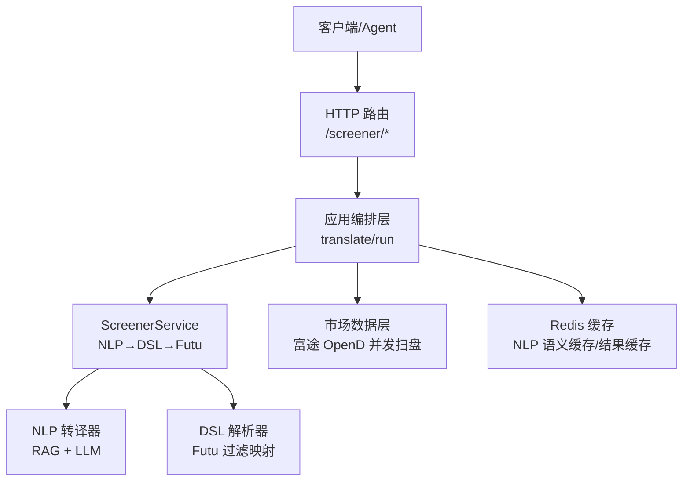
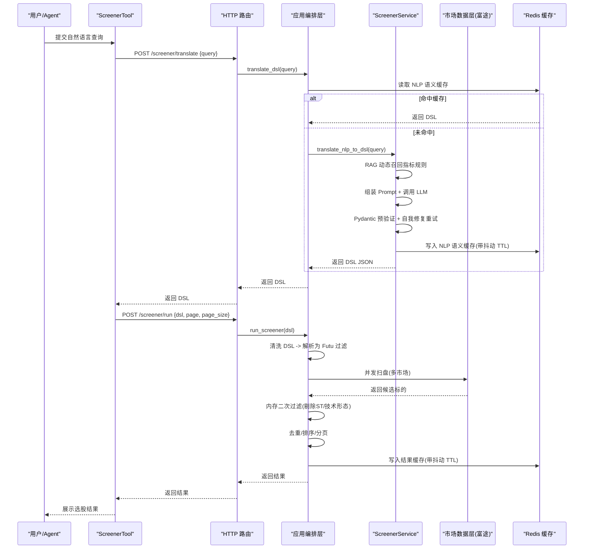
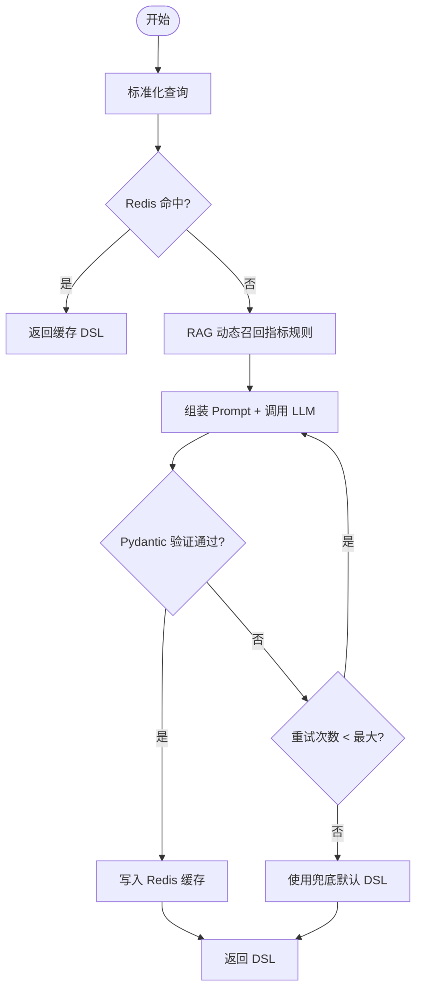
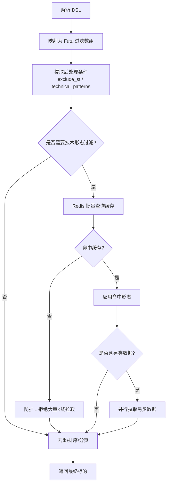
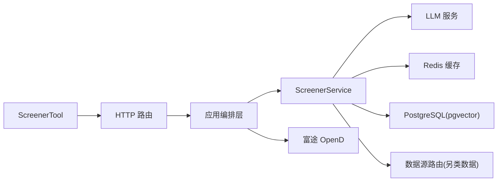

# 自然语言翻译引擎

<cite>
**本文引用的文件**
- [screener_tool.py](file://hermes_agent/tools/screener_tool.py)
- [screener.py](file://backend/routers/screener.py)
- [screener_app.py](file://backend/app/screener_app.py)
- [service.py](file://backend/services/screener/service.py)
- [nlp_translator.py](file://backend/services/screener/nlp_translator.py)
- [dsl_parser.py](file://backend/services/screener/dsl_parser.py)
- [__init__.py](file://backend/services/screener/__init__.py)
</cite>

## 目录
1. [简介](#简介)
2. [项目结构](#项目结构)
3. [核心组件](#核心组件)
4. [架构总览](#架构总览)
5. [详细组件分析](#详细组件分析)
6. [依赖关系分析](#依赖关系分析)
7. [性能与可靠性](#性能与可靠性)
8. [故障排查指南](#故障排查指南)
9. [结论](#结论)
10. [附录：查询模式与示例](#附录：查询模式与示例)

## 简介
本文件为 Quant Agent 的“自然语言到选股条件”翻译引擎提供完整技术文档。该引擎将用户的自然语言描述（如价值投资、成长股筛选、技术指标选股等）自动转译为强类型的 DSL JSON，并进一步解析为富途（Futu）可执行的筛选条件，最终执行跨市场在线选股与二次过滤。系统包含意图识别、实体提取、语义分析、置信度评估与歧义消解机制；同时提供降级策略与用户反馈闭环，确保在异常或低置信度场景下仍能提供可用结果。

## 项目结构
- 入口与编排层
  - HTTP 路由负责参数校验与鉴权，调用应用层编排函数。
  - 应用层封装缓存、并发、排序、分页、去重、技术形态二次过滤等流程。
- NLP 转译层
  - 通过 RAG 动态召回相关指标规则，结合系统提示词与大模型生成结构化 DSL。
  - 使用 Pydantic 进行严格校验，失败时触发自我修复重试，最终兜底默认值。
- DSL 解析层
  - 将 LLM 输出的 DSL 映射为富途 API 所需的过滤数组，并分离后处理条件（如剔除 ST、技术形态）。
- 服务与数据层
  - 服务层组合 Mixin，管理 RAG 语料库、私有规则 CRUD、向量化与 pgvector 存储。
  - 数据源层对接富途 OpenD 进行多市场并发扫盘，返回候选标的。

**图表来源**
- [screener.py:87-101](file://backend/routers/screener.py#L87-L101)
- [screener_app.py:286-463](file://backend/app/screener_app.py#L286-L463)
- [service.py:16-24](file://backend/services/screener/service.py#L16-L24)
- [nlp_translator.py:96-321](file://backend/services/screener/nlp_translator.py#L96-L321)
- [dsl_parser.py:16-78](file://backend/services/screener/dsl_parser.py#L16-L78)

**章节来源**
- [screener.py:87-101](file://backend/routers/screener.py#L87-L101)
- [screener_app.py:286-463](file://backend/app/screener_app.py#L286-L463)
- [service.py:16-24](file://backend/services/screener/service.py#L16-L24)

## 核心组件
- ScreenerTool（Agent 工具）
  - 接收用户自然语言查询，调用后端 /screener/translate 接口获取 DSL，再调用 /screener/run 执行选股。
  - 支持错误自纠正：当后端返回 400 时抛出 ToolCorrectionError，由装饰器触发大模型重试。
- HTTP 路由
  - 暴露 /screener/translate 与 /screener/run 等端点，仅做参数校验与透传。
- 应用编排层
  - translate_dsl：调用服务层进行 NLP→DSL 转译，带 Redis 语义缓存。
  - run_screener：清洗 DSL、解析为 Futu 过滤条件、并发扫盘、内存二次过滤、去重、排序、分页、缓存写入。
- 服务层（ScreenerService）
  - 组合 NLP 转译与 DSL 解析 Mixin，维护 RAG 语料库与私有规则，支持热更新与向量检索。
- NLP 转译器
  - 标准化查询、RAG 动态召回、组装 Prompt、调用 LLM、Pydantic 预验证、自我修复重试、缓存与兜底。
- DSL 解析器
  - 将 DSL 转为 Futu 过滤数组，剥离前端展示字段，处理特殊字段映射，输出后处理条件。

**章节来源**
- [screener_tool.py:10-72](file://hermes_agent/tools/screener_tool.py#L10-L72)
- [screener.py:87-101](file://backend/routers/screener.py#L87-L101)
- [screener_app.py:286-463](file://backend/app/screener_app.py#L286-L463)
- [service.py:16-24](file://backend/services/screener/service.py#L16-L24)
- [nlp_translator.py:96-321](file://backend/services/screener/nlp_translator.py#L96-L321)
- [dsl_parser.py:16-78](file://backend/services/screener/dsl_parser.py#L16-L78)

## 架构总览
下图展示了从用户输入到选股结果的端到端流程，包括 NLP 转译、DSL 解析、富途扫盘、二次过滤与缓存。

**图表来源**
- [screener_tool.py:24-72](file://hermes_agent/tools/screener_tool.py#L24-L72)
- [screener.py:92-101](file://backend/routers/screener.py#L92-L101)
- [screener_app.py:286-463](file://backend/app/screener_app.py#L286-L463)
- [nlp_translator.py:96-321](file://backend/services/screener/nlp_translator.py#L96-L321)
- [dsl_parser.py:16-78](file://backend/services/screener/dsl_parser.py#L16-L78)

## 详细组件分析

### NLP 转译器（意图识别、实体提取、语义分析）
- 标准化查询：小写化、去除标点、压缩空格，提升缓存命中率。
- RAG 动态召回：根据用户查询与私有规则，通过向量检索召回最相关的指标规则，注入 Prompt。
- 意图识别与实体提取：Prompt 中明确字段白名单、数值换算规则、大师法则平替、时序逻辑处理法则与技术/K线形态支持，使 LLM 能准确识别意图并提取实体（市场、指标、阈值、周期等）。
- 语义分析与约束：强制金额单位换算为绝对数值；比率/百分位统一为小数；财务周期映射；连续增长/均值使用 continuous_period/period_average。
- 置信度评估与歧义消解：
  - Pydantic 预验证：若 LLM 输出不合法，记录错误位置与类型，追加消息让模型自我修复，最多重试两次。
  - 兜底默认值：若仍无法生成合法 JSON，回退到内置默认 DSL（覆盖多市场与常见估值区间），保证可用性。
- 缓存与持久化：成功结果写入 Redis，键基于归一化查询 MD5，TTL 带随机抖动防雪崩。

**图表来源**
- [nlp_translator.py:21-34](file://backend/services/screener/nlp_translator.py#L21-L34)
- [nlp_translator.py:96-321](file://backend/services/screener/nlp_translator.py#L96-L321)

**章节来源**
- [nlp_translator.py:21-34](file://backend/services/screener/nlp_translator.py#L21-L34)
- [nlp_translator.py:96-321](file://backend/services/screener/nlp_translator.py#L96-L321)

### DSL 解析器（富途过滤映射与二次过滤）
- 解析与映射：将 LLM 输出的 DSL 解析为 ScreenerDecision，逐条转换为 Futu 过滤数组；非财务指标移除 term；剥离 field_zh 避免污染请求；特殊字段映射（如 VOLUME_MULTIPLE → VOLUME_RATIO）。
- 后处理条件：exclude_st（剔除 ST）、technical_patterns（技术形态数组）用于后续二次过滤。
- 技术形态二次过滤：
  - 批量缓存查询：按日期维度缓存技术形态结果，减少重复计算。
  - 防护限流：若候选过多且需拉取历史 K 线，主动拒绝以避免 API 额度耗尽与限流。
  - 另类数据联邦过滤：如高管净买入通过数据源路由异步并行检查，命中则附加标签。

**图表来源**
- [dsl_parser.py:16-78](file://backend/services/screener/dsl_parser.py#L16-L78)
- [dsl_parser.py:80-193](file://backend/services/screener/dsl_parser.py#L80-L193)

**章节来源**
- [dsl_parser.py:16-78](file://backend/services/screener/dsl_parser.py#L16-L78)
- [dsl_parser.py:80-193](file://backend/services/screener/dsl_parser.py#L80-L193)

### 应用编排层（缓存、并发、排序、分页、去重）
- 缓存策略：
  - NLP 语义缓存：基于归一化查询 MD5，TTL 带抖动，命中直接秒回。
  - 结果缓存：DSL 哈希作为键，TTL 带抖动，命中直接返回。
- 并发扫盘：对多个市场并发调用 market_data.screen_stocks，聚合结果。
- 内存二次过滤：剔除 ST、应用技术形态过滤。
- 排序与分页：服务端动态排序（支持人类数字解析），重新计算排名，按需切片。
- 错误处理：DSL 格式错误、数据源未连接、执行异常均抛出 AppError 并返回明确状态码。

**章节来源**
- [screener_app.py:129-163](file://backend/app/screener_app.py#L129-L163)
- [screener_app.py:295-463](file://backend/app/screener_app.py#L295-L463)

### 服务层（RAG 语料管理与私有规则）
- RAG 语料加载：
  - 内置核心指标规则作为兜底。
  - 尝试从 CSV 动态加载数百条额外指标。
  - 初始化 Embedding 模型（云端 OpenAI 兼容或本地 SentenceTransformer）。
  - 向量化并灌入 PostgreSQL (pgvector)，支持维度自愈与批量插入。
- 私有规则 CRUD：
  - 添加：向量化用户描述并入库，绑定 user_id。
  - 查询：按 user_id 获取私有规则列表。
  - 删除：安全删除，强依赖 user_id 鉴权。
- 结果总结：
  - 对选股结果前 10 只股票并行拉取最新新闻，生成专业洞察报告。

**章节来源**
- [service.py:26-327](file://backend/services/screener/service.py#L26-L327)
- [service.py:329-475](file://backend/services/screener/service.py#L329-L475)

## 依赖关系分析
- 模块耦合
  - ScreenerTool 依赖后端 HTTP 接口，解耦了 Agent 与后端实现。
  - 路由层薄封装，业务逻辑集中在应用编排层与服务层，便于单测与扩展。
  - NLP 转译与 DSL 解析通过 Mixin 组合，职责清晰，易于替换或增强。
- 外部依赖
  - LLM 服务：用于 NLP 转译与结果总结。
  - Redis：语义缓存与结果缓存，降低延迟与压力。
  - 富途 OpenD：在线扫盘数据源。
  - PostgreSQL (pgvector)：向量检索与私有规则存储。
  - 数据源路由：另类数据（如 Finnhub 内幕交易）并行拉取。

**图表来源**
- [screener_tool.py:10-72](file://hermes_agent/tools/screener_tool.py#L10-L72)
- [screener.py:87-101](file://backend/routers/screener.py#L87-L101)
- [screener_app.py:286-463](file://backend/app/screener_app.py#L286-L463)
- [service.py:16-327](file://backend/services/screener/service.py#L16-L327)

**章节来源**
- [__init__.py:1-15](file://backend/services/screener/__init__.py#L1-L15)
- [service.py:16-327](file://backend/services/screener/service.py#L16-L327)

## 性能与可靠性
- 性能优化
  - NLP 语义缓存：归一化查询 MD5 命中，毫秒级返回。
  - 结果缓存：DSL 哈希键，TTL 带抖动，避免重复扫盘。
  - 并发扫盘：多市场并行调用，缩短整体延迟。
  - 技术形态缓存：按日期维度批量查询，减少重复计算。
  - 防护限流：候选过多时拒绝大量 K 线拉取，防止 API 额度耗尽。
- 可靠性保障
  - Pydantic 预验证 + 自我修复重试，提高 LLM 输出稳定性。
  - 兜底默认 DSL，确保异常场景下仍可返回合理结果。
  - 数据源未连接时返回明确 503，避免静默失败。
  - 私有规则强绑定 user_id，防止越权操作。

[本节为通用指导，无需特定文件引用]

## 故障排查指南
- 转译失败
  - 现象：/screener/translate 返回错误或空 DSL。
  - 排查：检查 LLM 响应是否为空；查看 Pydantic 验证错误详情；确认 RAG 召回是否正常；必要时启用兜底默认 DSL。
  - 参考路径：[nlp_translator.py:217-321](file://backend/services/screener/nlp_translator.py#L217-L321)
- DSL 格式错误
  - 现象：/screener/run 报 DSL 格式错误。
  - 排查：确认 AI 生成的 JSON 是否合法；检查清洗逻辑是否正确移除 Markdown 标记与注释。
  - 参考路径：[screener_app.py:153-163](file://backend/app/screener_app.py#L153-L163)
- 数据源未连接
  - 现象：选股无结果并返回 503。
  - 排查：检查富途 OpenD 连接状态；确认市场与过滤条件是否合理。
  - 参考路径：[screener_app.py:436-444](file://backend/app/screener_app.py#L436-L444)
- 技术形态过滤受限
  - 现象：候选过多时技术形态计算被跳过。
  - 排查：确认是否指定了技术形态；检查缓存命中情况；避免频繁拉取历史 K 线。
  - 参考路径：[dsl_parser.py:114-124](file://backend/services/screener/dsl_parser.py#L114-L124)

**章节来源**
- [nlp_translator.py:217-321](file://backend/services/screener/nlp_translator.py#L217-L321)
- [screener_app.py:153-163](file://backend/app/screener_app.py#L153-L163)
- [screener_app.py:436-444](file://backend/app/screener_app.py#L436-L444)
- [dsl_parser.py:114-124](file://backend/services/screener/dsl_parser.py#L114-L124)

## 结论
该翻译引擎通过 RAG 动态召回、LLM 意图识别与实体提取、Pydantic 严格校验与自我修复、以及多级缓存与并发优化，实现了高可用、高性能的自然语言到选股条件的自动化转译。系统在异常场景下具备完善的降级与兜底机制，并通过用户反馈与私有规则扩展持续提升准确率与覆盖面。未来可进一步增强领域词典、优化向量检索精度与扩展更多技术形态支持。

[本节为总结性内容，无需特定文件引用]

## 附录：查询模式与示例
以下为常见查询模式及其对应的 DSL 输出结构说明（以路径引用代替具体代码内容）：

- 价值投资
  - 自然语言示例：“寻找港股市盈率低于 20、市净率小于 1 的破净股”
  - DSL 要点：markets=["HK"], filters 包含 PE_TTM 与 PB 区间，simple 类型
  - 参考路径：[nlp_translator.py:135-166](file://backend/services/screener/nlp_translator.py#L135-L166)
- 成长股筛选
  - 自然语言示例：“连续三年净利润同比增长超过 30% 的科技股”
  - DSL 要点：NET_PROFIT_GROWTH 连续增长，continuous_period=3，行业 plate="科技"
  - 参考路径：[nlp_translator.py:182-193](file://backend/services/screener/nlp_translator.py#L182-L193)
- 技术指标选股
  - 自然语言示例：“MACD 金叉且 RSI 超卖的美股”
  - DSL 要点：indicator_pattern MACD_GOLD_CROSS 与 RSI_OVERSOLD，period="K_DAY"
  - 参考路径：[nlp_translator.py:173-180](file://backend/services/screener/nlp_translator.py#L173-L180)
- 资金流与放量
  - 自然语言示例：“放量 1.5 倍以上的 A 股”
  - DSL 要点：VOLUME_MULTIPLE min_value=1.5，accumulate 类型
  - 参考路径：[service.py:78-81](file://backend/services/screener/service.py#L78-L81)
- 技术形态二次过滤
  - 自然语言示例：“跳空高开且连续三天放量”
  - DSL 要点：technical_patterns=["gap_up","volume_surge_3d"]
  - 参考路径：[service.py:123-129](file://backend/services/screener/service.py#L123-L129)

[本节为概念性说明，无需特定文件引用]