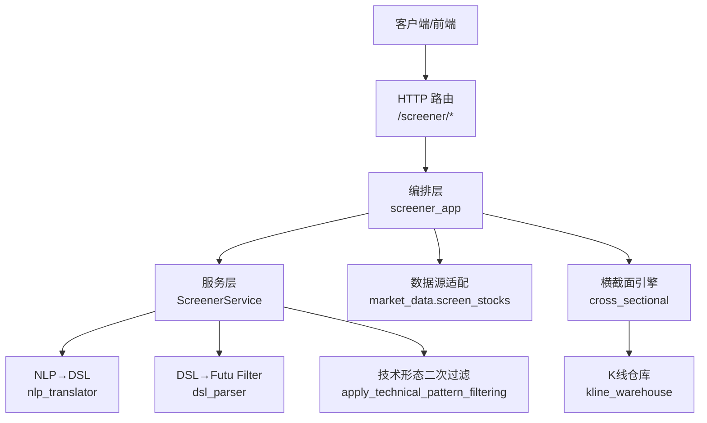
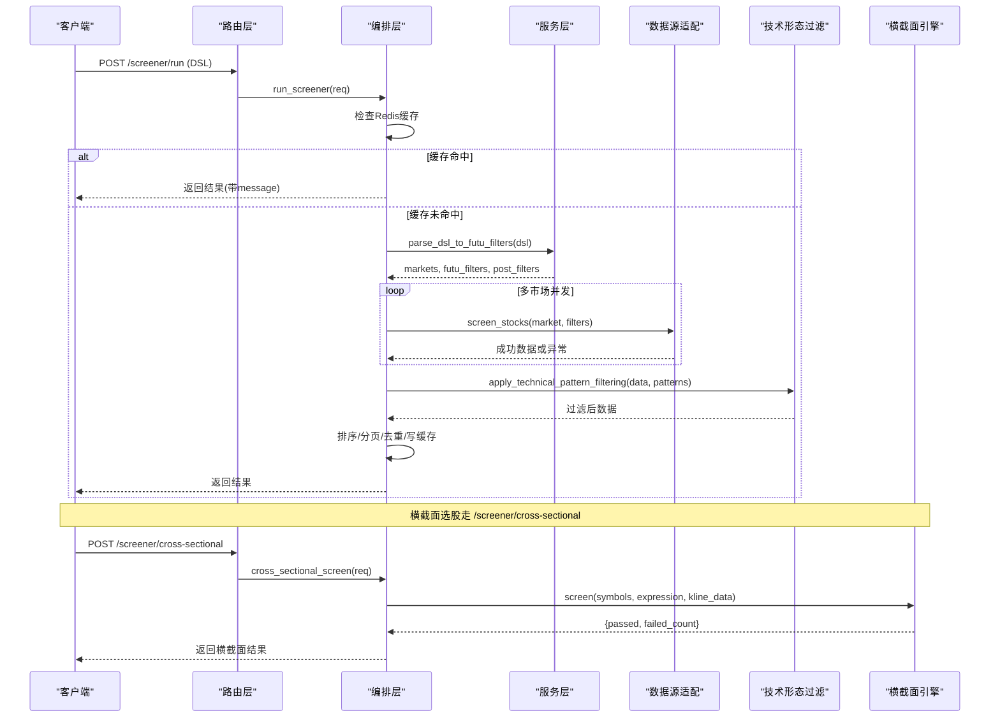
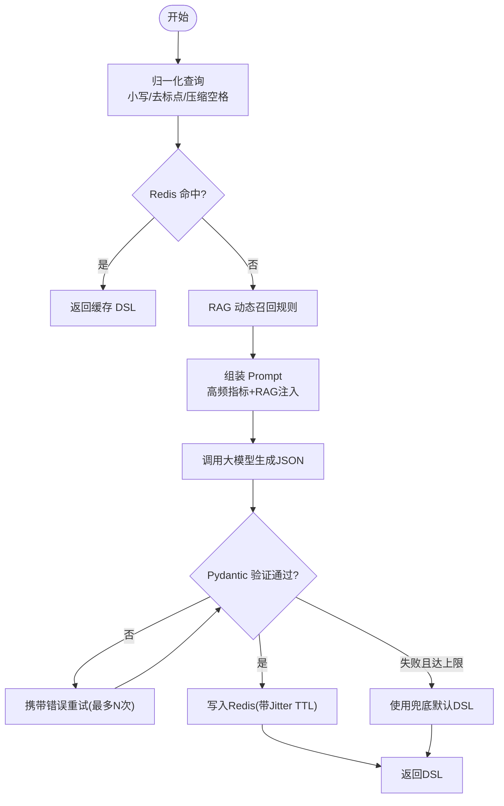
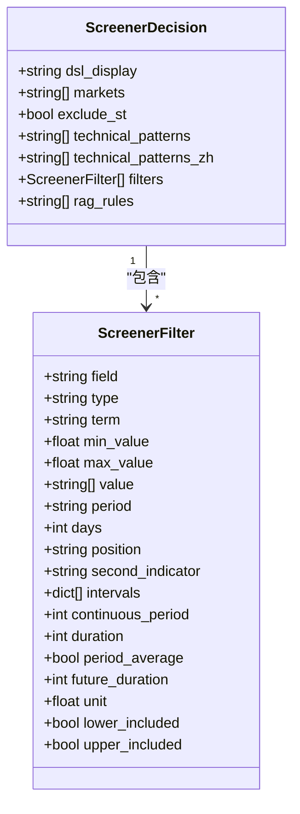
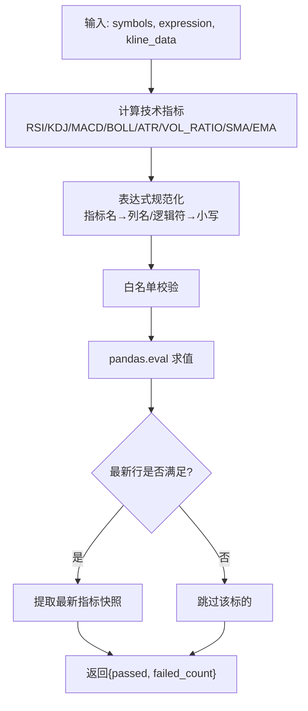
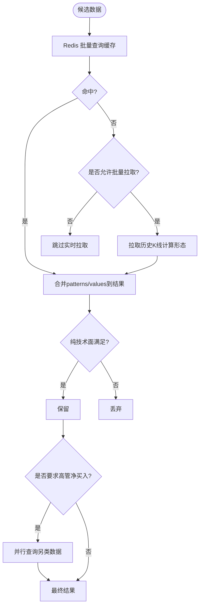
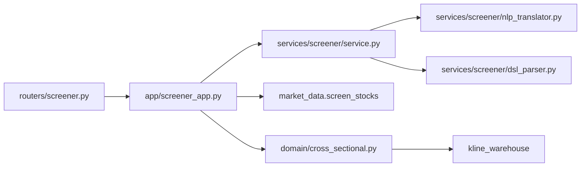

# 选股器系统

<cite>
**本文引用的文件**
- [backend/routers/screener.py](file://backend/routers/screener.py)
- [backend/app/screener_app.py](file://backend/app/screener_app.py)
- [backend/services/screener/service.py](file://backend/services/screener/service.py)
- [backend/services/screener/nlp_translator.py](file://backend/services/screener/nlp_translator.py)
- [backend/services/screener/dsl_parser.py](file://backend/services/screener/dsl_parser.py)
- [backend/services/screener/models.py](file://backend/services/screener/models.py)
- [backend/domain/cross_sectional.py](file://backend/domain/cross_sectional.py)
</cite>

## 目录
1. [简介](#简介)
2. [项目结构](#项目结构)
3. [核心组件](#核心组件)
4. [架构总览](#架构总览)
5. [详细组件分析](#详细组件分析)
6. [依赖关系分析](#依赖关系分析)
7. [性能与最佳实践](#性能与最佳实践)
8. [故障排查指南](#故障排查指南)
9. [结论](#结论)
10. [附录：DSL 语法与场景示例](#附录dsl-语法与场景示例)

## 简介
本文件为 Quant Agent 选股器系统的全面功能文档，覆盖 DSL 语法规范、自然语言到选股条件的翻译机制、横截面选股算法（因子构建、评分排序、结果过滤）、可视化与导出能力、AI 增强的选股建议（市场情绪分析与板块轮动识别），以及性能优化与批量查询的最佳实践。目标是帮助非技术用户也能用日常语言描述选股需求，并得到可执行、可解释、可回测的选股结果。

## 项目结构
选股器系统采用分层设计：HTTP 路由层仅做参数校验与转发；编排层负责流程控制、缓存与并发；服务层组合 NLP 转译、DSL 解析、技术形态二次过滤、RAG 规则库管理；领域层提供横截面表达式引擎；数据源通过统一适配器调用富途等底层接口。

**图表来源**
- [backend/routers/screener.py:87-195](file://backend/routers/screener.py#L87-L195)
- [backend/app/screener_app.py:286-463](file://backend/app/screener_app.py#L286-L463)
- [backend/services/screener/service.py:16-25](file://backend/services/screener/service.py#L16-L25)
- [backend/services/screener/nlp_translator.py:96-322](file://backend/services/screener/nlp_translator.py#L96-L322)
- [backend/services/screener/dsl_parser.py:16-78](file://backend/services/screener/dsl_parser.py#L16-L78)
- [backend/domain/cross_sectional.py:272-321](file://backend/domain/cross_sectional.py#L272-L321)

**章节来源**
- [backend/routers/screener.py:87-195](file://backend/routers/screener.py#L87-L195)
- [backend/app/screener_app.py:286-463](file://backend/app/screener_app.py#L286-L463)

## 核心组件
- HTTP 路由层：定义 /screener 系列接口，包括翻译、运行、历史、订阅、横截面筛选、组合回测等。
- 编排层：实现 DSL 清洗、Redis 缓存、并发多市场扫盘、内存排序与分页、去重、技术形态二次过滤、异常处理。
- 服务层：组合 NLP 转译、DSL 解析、技术形态过滤、RAG 语料加载与私有规则管理、结果总结。
- 领域层：横截面选股引擎，支持跨指标表达式求值与指标快照输出。
- 模型层：Pydantic 强类型校验与自动纠错，确保 LLM 输出稳定可靠。

**章节来源**
- [backend/routers/screener.py:87-195](file://backend/routers/screener.py#L87-L195)
- [backend/app/screener_app.py:120-193](file://backend/app/screener_app.py#L120-L193)
- [backend/services/screener/service.py:16-25](file://backend/services/screener/service.py#L16-L25)
- [backend/services/screener/models.py:20-130](file://backend/services/screener/models.py#L20-L130)
- [backend/domain/cross_sectional.py:272-321](file://backend/domain/cross_sectional.py#L272-L321)

## 架构总览
选股请求从 HTTP 进入路由层，转发至编排层；编排层先尝试 Redis 缓存命中，未命中则调用服务层进行 NLP→DSL 转译与 DSL→Futu Filter 转换，再并发拉取多市场数据，执行内存排序、分页、去重与技术形态二次过滤，最后返回结果并写入缓存。横截面选股通过独立入口，批量获取 K 线后在内存中计算指标并评估表达式。

**图表来源**
- [backend/routers/screener.py:92-195](file://backend/routers/screener.py#L92-L195)
- [backend/app/screener_app.py:286-463](file://backend/app/screener_app.py#L286-L463)
- [backend/services/screener/dsl_parser.py:16-78](file://backend/services/screener/dsl_parser.py#L16-L78)
- [backend/services/screener/dsl_parser.py:80-193](file://backend/services/screener/dsl_parser.py#L80-L193)
- [backend/domain/cross_sectional.py:272-321](file://backend/domain/cross_sectional.py#L272-L321)

## 详细组件分析

### 自然语言到 DSL 的翻译机制
- 语义归一化与缓存：对输入进行标准化（小写、去标点、压缩空格）并计算 MD5，命中 Redis 直接秒回。
- RAG 动态召回：根据用户意图检索相关指标规则，注入 Prompt 提升映射准确性。
- 大模型转译与自修复：强制 JSON 输出，失败时携带错误信息重试，最多多次尝试；仍失败则使用兜底默认值。
- 安全与健壮性：字段白名单、数值单位换算、财务周期映射、连续期数与均值窗口处理、技术形态降级策略。

**图表来源**
- [backend/services/screener/nlp_translator.py:21-34](file://backend/services/screener/nlp_translator.py#L21-L34)
- [backend/services/screener/nlp_translator.py:96-322](file://backend/services/screener/nlp_translator.py#L96-L322)

**章节来源**
- [backend/services/screener/nlp_translator.py:21-34](file://backend/services/screener/nlp_translator.py#L21-L34)
- [backend/services/screener/nlp_translator.py:96-322](file://backend/services/screener/nlp_translator.py#L96-L322)

### DSL 语法规范
- 条件表达式：基于 Pydantic 模型 ScreenerFilter，支持 simple、financial、accumulate、plate、featured、indicator、indicator_pattern、indicator_positional、kline_shape、broker、option 等类型。
- 逻辑运算符：在横截面表达式中支持 AND/OR/NOT 与比较运算符，表达式经安全白名单校验后由 pandas eval 求值。
- 函数调用：横截面引擎内置 RSI、KDJ、MACD、BOLL、ATR、VOL_RATIO、SMA、EMA 等指标函数，支持跨指标组合如 RSI(14) < KDJ.K AND MACD.histogram > 0。
- 字段映射与纠错：自动模糊匹配与类型纠偏，剔除无用 term，补齐缺失项，拦截互斥条件。

**图表来源**
- [backend/services/screener/models.py:20-130](file://backend/services/screener/models.py#L20-L130)
- [backend/services/screener/models.py:121-219](file://backend/services/screener/models.py#L121-L219)

**章节来源**
- [backend/services/screener/models.py:20-130](file://backend/services/screener/models.py#L20-L130)
- [backend/services/screener/models.py:121-219](file://backend/services/screener/models.py#L121-L219)
- [backend/domain/cross_sectional.py:140-264](file://backend/domain/cross_sectional.py#L140-L264)

### 横截面选股算法
- 因子构建：计算 RSI、KDJ、MACD、BOLL、ATR、量比、SMA/EMA 等指标，附加到 DataFrame。
- 表达式求值：将用户表达式规范化为列名与逻辑符，经白名单校验后用 pandas.eval 求值，返回布尔掩码。
- 结果过滤：仅保留最新行满足表达式的标的，并输出指标快照。

**图表来源**
- [backend/domain/cross_sectional.py:105-137](file://backend/domain/cross_sectional.py#L105-L137)
- [backend/domain/cross_sectional.py:197-264](file://backend/domain/cross_sectional.py#L197-L264)
- [backend/domain/cross_sectional.py:272-321](file://backend/domain/cross_sectional.py#L272-L321)

**章节来源**
- [backend/domain/cross_sectional.py:105-137](file://backend/domain/cross_sectional.py#L105-L137)
- [backend/domain/cross_sectional.py:197-264](file://backend/domain/cross_sectional.py#L197-L264)
- [backend/domain/cross_sectional.py:272-321](file://backend/domain/cross_sectional.py#L272-L321)

### 技术形态二次过滤与另类数据联邦过滤
- 技术形态：支持 MACD金叉/死叉、RSI超买/超卖、KDJ金叉、布林突破、顶/底背离、VCP形态、跳空高开、连续放量等，命中后以中文标签追加到结果。
- 缓存与防限流：优先读取 Redis 缓存，避免大量标的历史 K 线拉取导致 API 额度耗尽；若未指定形态或拒绝批量拉取，仅展示已命中缓存的标的。
- 另类数据：高管净买入通过第三方数据源异步并行查询，按最近一个月净流入判断并追加标签。

**图表来源**
- [backend/services/screener/dsl_parser.py:80-193](file://backend/services/screener/dsl_parser.py#L80-L193)

**章节来源**
- [backend/services/screener/dsl_parser.py:80-193](file://backend/services/screener/dsl_parser.py#L80-L193)

### 结果总结与 AI 增强建议
- 一键洞察：选取前 10 只标的，并行拉取最新新闻，结合涨跌幅等信息生成专业分析报告，提示主线概念与风险。
- 市场情绪与板块轮动：通过新闻摘要与涨跌分布提炼共性主题，辅助识别短期热点与潜在轮动方向。

**章节来源**
- [backend/services/screener/service.py:421-475](file://backend/services/screener/service.py#L421-L475)

## 依赖关系分析
- 路由层依赖编排层暴露的函数，保持薄边界。
- 编排层依赖服务层、市场数据适配、Redis 缓存、数据库会话。
- 服务层组合 NLP 转译、DSL 解析、技术形态过滤、RAG 语料与私有规则管理。
- 横截面引擎依赖 K 线仓库与 Pandas/Numpy 矢量化计算。

**图表来源**
- [backend/routers/screener.py:87-195](file://backend/routers/screener.py#L87-L195)
- [backend/app/screener_app.py:286-463](file://backend/app/screener_app.py#L286-L463)
- [backend/services/screener/service.py:16-25](file://backend/services/screener/service.py#L16-L25)
- [backend/domain/cross_sectional.py:272-321](file://backend/domain/cross_sectional.py#L272-L321)

**章节来源**
- [backend/routers/screener.py:87-195](file://backend/routers/screener.py#L87-L195)
- [backend/app/screener_app.py:286-463](file://backend/app/screener_app.py#L286-L463)

## 性能与最佳实践
- 缓存策略：NLP 转译结果与选股结果均写入 Redis，带随机抖动 TTL 防止雪崩；技术形态优先读缓存，避免大规模 K 线拉取。
- 并发优化：多市场扫盘与另类数据查询使用 asyncio.gather 并行执行；横截面指标计算采用 Pandas 矢量化。
- 内存排序与分页：服务端动态排序与切片，减少前端负载；去重保证结果唯一性。
- 批量查询：建议将相似 DSL 合并为一次请求，利用缓存命中降低延迟；合理设置 page_size 控制响应体积。
- 指标热更新：支持 CSV 动态加载与 pgvector 向量化，提升 RAG 召回精度与速度。

[本节为通用指导，不直接分析具体文件]

## 故障排查指南
- DSL 格式错误：检查 AI 输出的 JSON 是否合法，必要时清理 Markdown 标记与注释。
- 数据源未连接：当 Futu OpenD 未连接时，会返回明确状态码与提示信息，需检查连接状态或稍后重试。
- 表达式求值失败：确认表达式仅包含允许的 token 与指标名，避免非法字符或未知列。
- 技术形态过滤无结果：若未命中缓存且禁止批量拉取，将仅展示已缓存标的；可调整技术形态或等待缓存更新。
- 向量检索异常：RAG 检索失败会降级为全量规则兜底，不影响基本功能。

**章节来源**
- [backend/app/screener_app.py:153-163](file://backend/app/screener_app.py#L153-L163)
- [backend/app/screener_app.py:436-443](file://backend/app/screener_app.py#L436-L443)
- [backend/domain/cross_sectional.py:230-264](file://backend/domain/cross_sectional.py#L230-L264)
- [backend/services/screener/dsl_parser.py:114-124](file://backend/services/screener/dsl_parser.py#L114-L124)
- [backend/services/screener/nlp_translator.py:43-94](file://backend/services/screener/nlp_translator.py#L43-L94)

## 结论
Quant Agent 选股器系统通过 NLP→DSL→Futu Filter 的完整链路，结合横截面表达式引擎与技术形态二次过滤，实现了从自然语言到可执行选股条件的智能转化。系统在性能上采用缓存、并发与矢量化优化，在可靠性上通过强类型校验与降级策略保障稳定性。用户可通过简洁的自然语言描述复杂选股需求，并获得可视化与 AI 洞察的增强体验。

[本节为总结，不直接分析具体文件]

## 附录：DSL 语法与场景示例
- 价值投资：低 PE/PB、高股息率、ROE 连续增长、资产负债率低。
- 成长股筛选：营收/净利润高增长、PEG 小于 1、研发投入占比高。
- 技术指标选股：MACD 金叉、RSI 超卖、KDJ 低位金叉、布林带突破、量比放大。
- 横截面表达式示例：RSI(14) < 30 AND MACD.histogram > 0；KDJ.K > KDJ.D AND VOL_RATIO > 1.5。
- 结果可视化与导出：前端表格支持排序、分页、表头区间过滤；后端返回 rank、symbol、name、mktcap、price、chg、rsi 等字段便于渲染。
- AI 增强建议：一键洞察报告提炼共性主题与龙头股点评，提示系统性风险。

[本节为概念性内容，不直接分析具体文件]