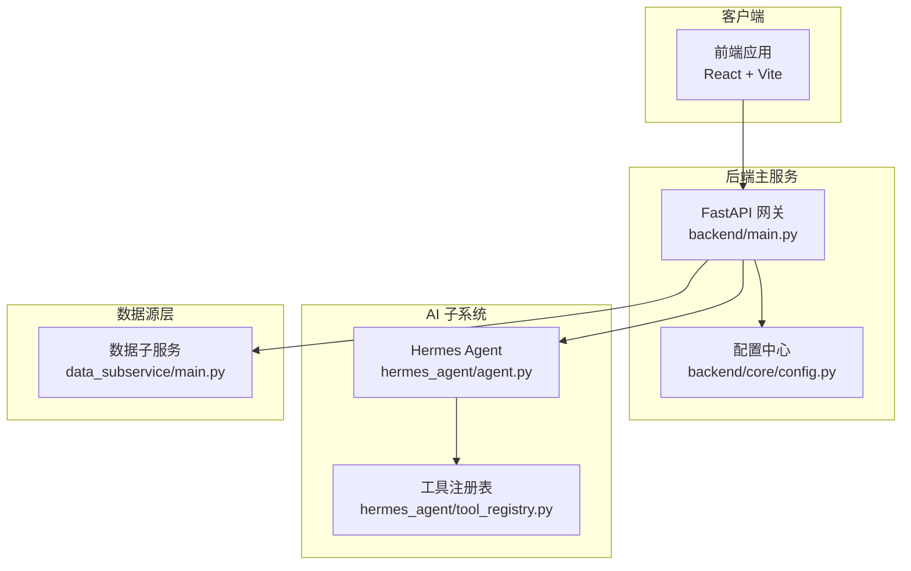
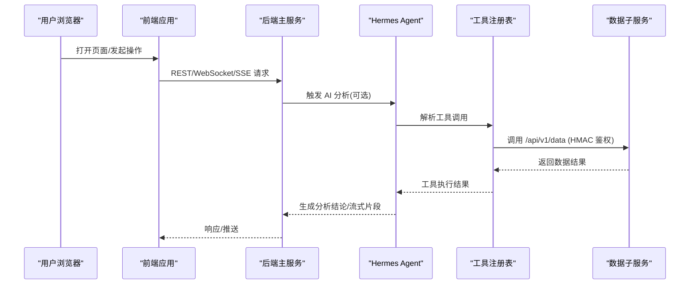
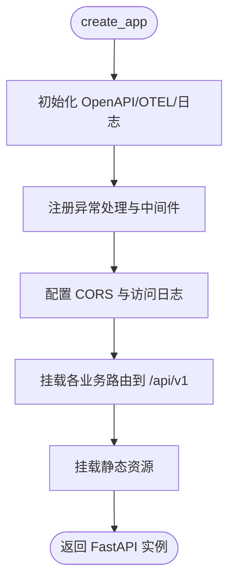
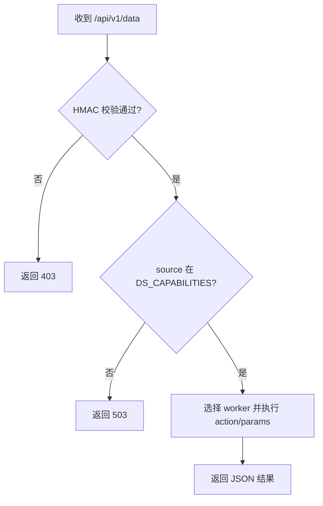
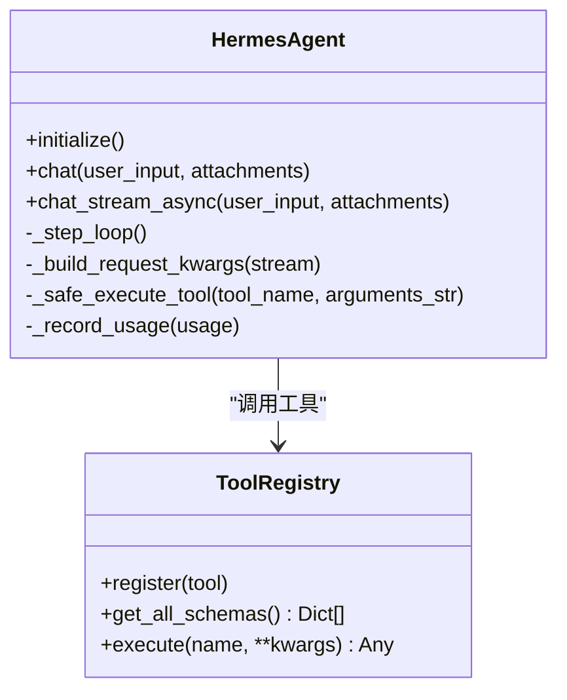
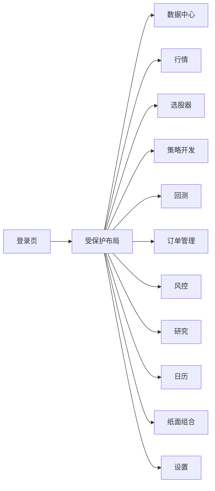
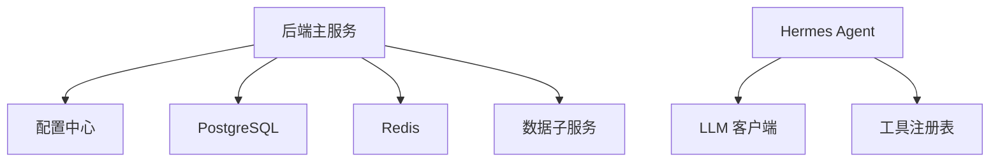

# 项目概述

<cite>
**本文引用的文件**
- [README.md](file://README.md)
- [backend/main.py](file://backend/main.py)
- [data_subservice/main.py](file://data_subservice/main.py)
- [hermes_agent/agent.py](file://hermes_agent/agent.py)
- [hermes_agent/tool_registry.py](file://hermes_agent/tool_registry.py)
- [frontend/src/App.tsx](file://frontend/src/App.tsx)
- [backend/core/config.py](file://backend/core/config.py)
- [docs/ARCHITECTURE_REVIEW.md](file://docs/ARCHITECTURE_REVIEW.md)
</cite>

## 目录
1. [简介](#简介)
2. [项目结构](#项目结构)
3. [核心组件](#核心组件)
4. [架构总览](#架构总览)
5. [详细组件分析](#详细组件分析)
6. [依赖关系分析](#依赖关系分析)
7. [性能考量](#性能考量)
8. [故障排查指南](#故障排查指南)
9. [结论](#结论)
10. [附录：快速开始](#附录快速开始)

## 简介
Quant Agent 是一个 AI 驱动的量化交易终端，提供 AI 智能分析、实时行情、策略回测、选股器与订单管理等能力。系统采用前后端分离与微服务化设计，后端以 FastAPI 为核心网关，前端基于 React + Vite SPA；AI 子系统由 Hermes Agent 驱动，通过工具注册表调用市场数据、研报、宏观等外部能力；分布式数据源服务（Data Subservice）将各数据源解耦为独立节点，主服务通过 HMAC 安全鉴权进行统一调度。整体遵循事件驱动与可观测性优先的工程实践，兼顾高性能与可扩展性。

**章节来源**
- [README.md:9-21](file://README.md#L9-L21)

## 项目结构
仓库采用多模块组织：
- backend：FastAPI 主服务，负责路由、中间件、数据库初始化、业务编排与对外 API
- data_subservice：独立的数据源 HTTP 服务，按 DS_CAPABILITIES 声明能力，暴露 /api/v1/data 统一入口
- hermes_agent：Hermes Agent 主脑，实现 ReAct 循环、工具执行、流式输出与记忆管理
- frontend：React 18 + Vite SPA，模块化懒加载与错误边界保护
- docs：架构与设计文档，包含全栈架构审计与演进路线

**图表来源**
- [backend/main.py:125-218](file://backend/main.py#L125-L218)
- [data_subservice/main.py:189-234](file://data_subservice/main.py#L189-L234)
- [hermes_agent/agent.py:99-137](file://hermes_agent/agent.py#L99-L137)
- [hermes_agent/tool_registry.py:52-92](file://hermes_agent/tool_registry.py#L52-L92)
- [backend/core/config.py:20-134](file://backend/core/config.py#L20-L134)

**章节来源**
- [README.md:58-77](file://README.md#L58-L77)
- [docs/ARCHITECTURE_REVIEW.md:23-37](file://docs/ARCHITECTURE_REVIEW.md#L23-L37)

## 核心组件
- 后端主服务（FastAPI）
  - 应用工厂 create_app() 组装中间件、CORS、OpenAPI、异常处理、路由挂载与静态资源
  - 统一 API 版本前缀 /api/v1，集中挂载市场、回测、OMS、选股、研究、风险、系统健康等路由
- 分布式数据源服务（Data Subservice）
  - 独立进程运行，仅依赖 _internal，暴露 /api/v1/data 统一入口
  - 通过 HMAC 签名校验请求头 X-Timestamp/X-Signature，按 DS_CAPABILITIES 门控能力
  - 支持 yfinance 及延迟导入的 akshare/tushare/futu/finnhub/fmp/fred/dbnomics/rbi/search 等 worker
- AI 智能分析（Hermes Agent）
  - 维护会话上下文、ReAct 循环、工具调用与流式输出
  - 工具注册表自动发现并缓存结果，限流与并发执行保障稳定性
- 前端应用（React + Vite）
  - 模块化懒加载与错误边界，路由覆盖数据中心、行情、选股、策略、回测、OMS、风控、研究、日历、纸面组合等
  - 登录页与受保护布局分离，按需加载减少首屏体积

**章节来源**
- [backend/main.py:125-218](file://backend/main.py#L125-L218)
- [data_subservice/main.py:189-234](file://data_subservice/main.py#L189-L234)
- [hermes_agent/agent.py:99-137](file://hermes_agent/agent.py#L99-L137)
- [hermes_agent/tool_registry.py:52-92](file://hermes_agent/tool_registry.py#L52-L92)
- [frontend/src/App.tsx:89-133](file://frontend/src/App.tsx#L89-L133)

## 架构总览
系统采用“前后端分离 + 微服务 + 事件驱动”的总体架构：
- 前端通过 REST/WebSocket/SSE 与后端交互，使用懒加载与错误边界提升体验与健壮性
- 后端作为统一网关，承载认证、路由、中间件、可观测性与业务编排
- AI 子系统通过 ReAct 工作流与工具注册表动态调用数据与研究能力
- 数据源层以 Data Subservice 物理解耦，按能力声明与 HMAC 鉴权提供服务，支持横向扩展与熔断降级
- 配置与密钥通过 Pydantic Settings 集中校验，fail-fast 避免带病启动

**图表来源**
- [backend/main.py:125-218](file://backend/main.py#L125-L218)
- [data_subservice/main.py:70-88](file://data_subservice/main.py#L70-L88)
- [data_subservice/main.py:189-234](file://data_subservice/main.py#L189-L234)
- [hermes_agent/agent.py:316-393](file://hermes_agent/agent.py#L316-L393)
- [hermes_agent/tool_registry.py:94-123](file://hermes_agent/tool_registry.py#L94-L123)

## 详细组件分析

### 后端主服务（FastAPI）
- 应用工厂 create_app() 完成：
  - 初始化 OpenAPI、OTEL、日志、异常处理器、中间件栈
  - CORS 白名单与访问日志顺序控制
  - 路由按功能域挂载至 /api/v1
  - 静态资源挂载用于前端产物
- 数据库初始化时创建 pgvector/pg_trgm 扩展与索引，支撑向量检索与模糊匹配

**图表来源**
- [backend/main.py:125-218](file://backend/main.py#L125-L218)

**章节来源**
- [backend/main.py:1-222](file://backend/main.py#L1-L222)

### 分布式数据源服务（Data Subservice）
- 安全鉴权：verify_hmac 校验时间戳与签名，拒绝过期或非法请求
- 能力门控：_declared_capabilities 读取 DS_CAPABILITIES，未声明的能力返回 503
- 统一入口：POST /api/v1/data 根据 source/action/params 路由到对应 worker
- 健康检查：/health 暴露线程水位与 Futu 连接状态，便于监控与告警
- 生命周期：startup/shutdown 管理心跳任务与 Futu 看门狗任务

**图表来源**
- [data_subservice/main.py:70-88](file://data_subservice/main.py#L70-L88)
- [data_subservice/main.py:175-234](file://data_subservice/main.py#L175-L234)

**章节来源**
- [data_subservice/main.py:1-354](file://data_subservice/main.py#L1-L354)

### AI 智能分析（Hermes Agent）
- ReAct 循环：最多迭代次数限制，失败强制恢复，确保收敛
- 工具执行：ToolRegistry 自动注册工具，并发执行、限流与结果缓存
- 流式输出：SSE/流式响应，心跳保活，兼容 DeepSeek/OpenAI 流式 usage
- 记忆与治理：会话持久化、上下文自愈、参考文献完整性校验

**图表来源**
- [hermes_agent/agent.py:99-137](file://hermes_agent/agent.py#L99-L137)
- [hermes_agent/tool_registry.py:52-92](file://hermes_agent/tool_registry.py#L52-L92)

**章节来源**
- [hermes_agent/agent.py:1-774](file://hermes_agent/agent.py#L1-L774)
- [hermes_agent/tool_registry.py:1-123](file://hermes_agent/tool_registry.py#L1-L123)

### 前端应用（React + Vite）
- 路由与布局：登录页与受保护布局分离，DashboardLayout 包裹业务模块
- 懒加载与容错：lazyWithRetry 处理 ChunkLoadError，自动刷新避免白屏
- 功能模块：数据中心、行情、选股、策略、回测、OMS、风控、研究、日历、纸面组合、设置等

**图表来源**
- [frontend/src/App.tsx:89-133](file://frontend/src/App.tsx#L89-L133)

**章节来源**
- [frontend/src/App.tsx:1-133](file://frontend/src/App.tsx#L1-L133)

## 依赖关系分析
- 后端主服务依赖：
  - 配置中心（Pydantic Settings）集中校验必填项与环境变量
  - 数据库（PostgreSQL + pgvector/pg_trgm）与 Redis（缓存/会话/指标）
  - 各业务路由（市场、回测、OMS、选股、研究、风险、系统等）
- AI 子系统依赖：
  - LLM 客户端（OpenAI 兼容），支持多模型与流式
  - 工具注册表与结果缓存（Redis Hash）
- 数据源层依赖：
  - 各数据源 SDK（yfinance/akshare/tushare/futu/finnhub/fmp/fred/dbnomics/rbi/search）
  - 健康检查与 Prometheus 指标采集

**图表来源**
- [backend/core/config.py:20-134](file://backend/core/config.py#L20-L134)
- [backend/main.py:125-218](file://backend/main.py#L125-L218)
- [hermes_agent/agent.py:175-223](file://hermes_agent/agent.py#L175-L223)
- [hermes_agent/tool_registry.py:52-92](file://hermes_agent/tool_registry.py#L52-L92)
- [data_subservice/main.py:189-234](file://data_subservice/main.py#L189-L234)

**章节来源**
- [backend/core/config.py:1-134](file://backend/core/config.py#L1-L134)
- [backend/main.py:1-222](file://backend/main.py#L1-L222)
- [data_subservice/main.py:1-354](file://data_subservice/main.py#L1-L354)
- [hermes_agent/agent.py:1-774](file://hermes_agent/agent.py#L1-L774)
- [hermes_agent/tool_registry.py:1-123](file://hermes_agent/tool_registry.py#L1-L123)

## 性能考量
- 前端渲染分层：ECharts/Lightweight Charts/PixiJS/AG Grid，结合 Web Worker 与 Canvas/WebGL 降低主线程压力
- 后端中间件顺序：AccessLog 在 CORS 内层执行，避免 OPTIONS 预检丢失日志
- 数据源弹性：Data Subservice 按能力门控与延迟导入重型依赖，降低冷启动成本
- AI 流式与心跳：SSE 心跳保活防止代理超时，流式 usage 计量与预算护栏控制 Token 消耗
- 可观测性：Prometheus/Grafana 指标与结构化日志，便于定位瓶颈

[本节为通用指导，不直接分析具体文件]

## 故障排查指南
- 数据子服务健康检查
  - /health 返回线程数与警告阈值，Futu 连接状态（行情/交易通道）便于快速定位断连或解锁失败
  - /metrics/circuit 查看熔断状态
- HMAC 鉴权失败
  - 检查 X-Timestamp 与 X-Signature 是否一致且未过期
  - 确认 DATA_SOURCE_HMAC_SECRET 一致
- 数据源能力未启用
  - 检查 DS_CAPABILITIES 环境变量是否包含目标 source
- AI 流式中断
  - 关注心跳与超时，必要时调整代理空闲超时
- 配置缺失导致启动失败
  - 依据 Pydantic Settings 校验规则补齐 DATABASE_URL、EMBEDDING_API_KEY 等必填项

**章节来源**
- [data_subservice/main.py:91-111](file://data_subservice/main.py#L91-L111)
- [data_subservice/main.py:70-88](file://data_subservice/main.py#L70-L88)
- [data_subservice/main.py:175-234](file://data_subservice/main.py#L175-L234)
- [backend/core/config.py:94-134](file://backend/core/config.py#L94-L134)

## 结论
Quant Agent 以 FastAPI 为主网关、React 前端 SPA、Hermes Agent AI 系统与分布式数据源服务构成完整量化交易闭环。系统通过能力门控、HMAC 鉴权、流式输出与可观测性设计，实现了高可用、可扩展与高性能的目标。对于初学者，可从 README 快速开始；对于有经验的开发者，可深入数据子服务、AI 工具链与前端渲染优化等关键路径。

[本节为总结性内容，不直接分析具体文件]

## 附录：快速开始
- 环境准备
  - Python 虚拟环境与依赖安装
  - Node.js 与 pnpm
  - PostgreSQL（含 pgvector/pg_trgm）、Redis
- 启动后端
  - 进入 backend 目录，激活虚拟环境，安装依赖后使用 uvicorn 启动
- 启动前端
  - 进入 frontend 目录，安装依赖后运行开发服务器
- 启动数据子服务（可选）
  - 根据需要部署独立节点，配置 DS_CAPABILITIES 与 HMAC 密钥
- 验证
  - 访问 /health 与 /metrics，确认服务健康与指标采集正常

**章节来源**
- [README.md:38-56](file://README.md#L38-L56)