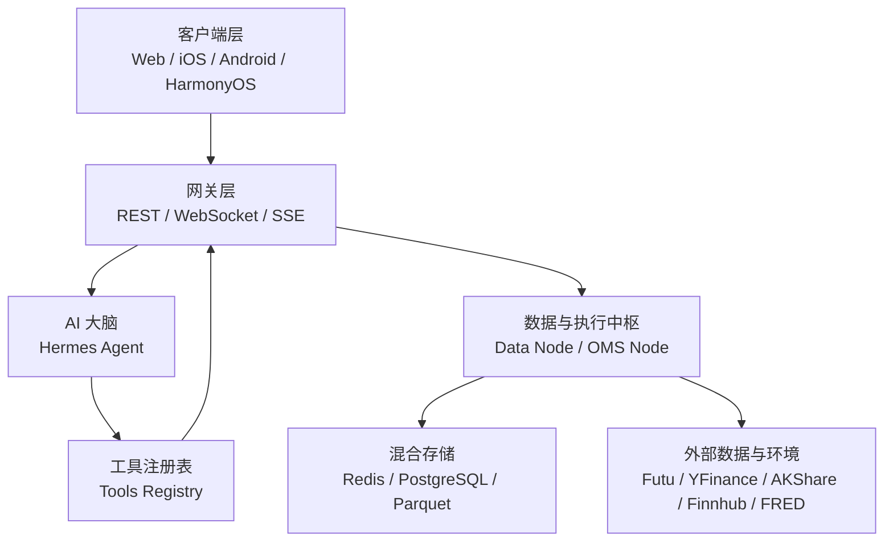
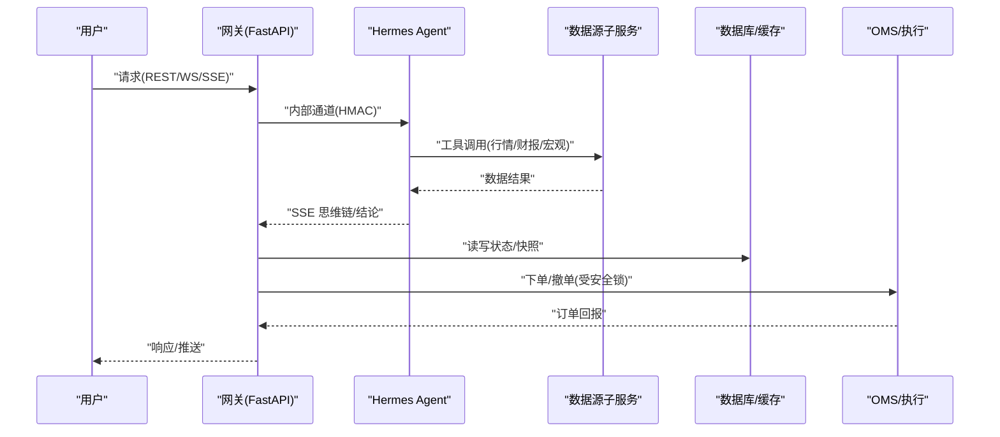
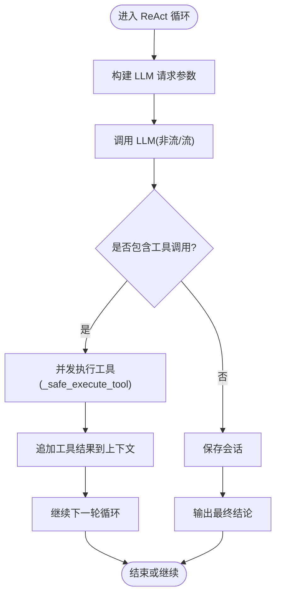
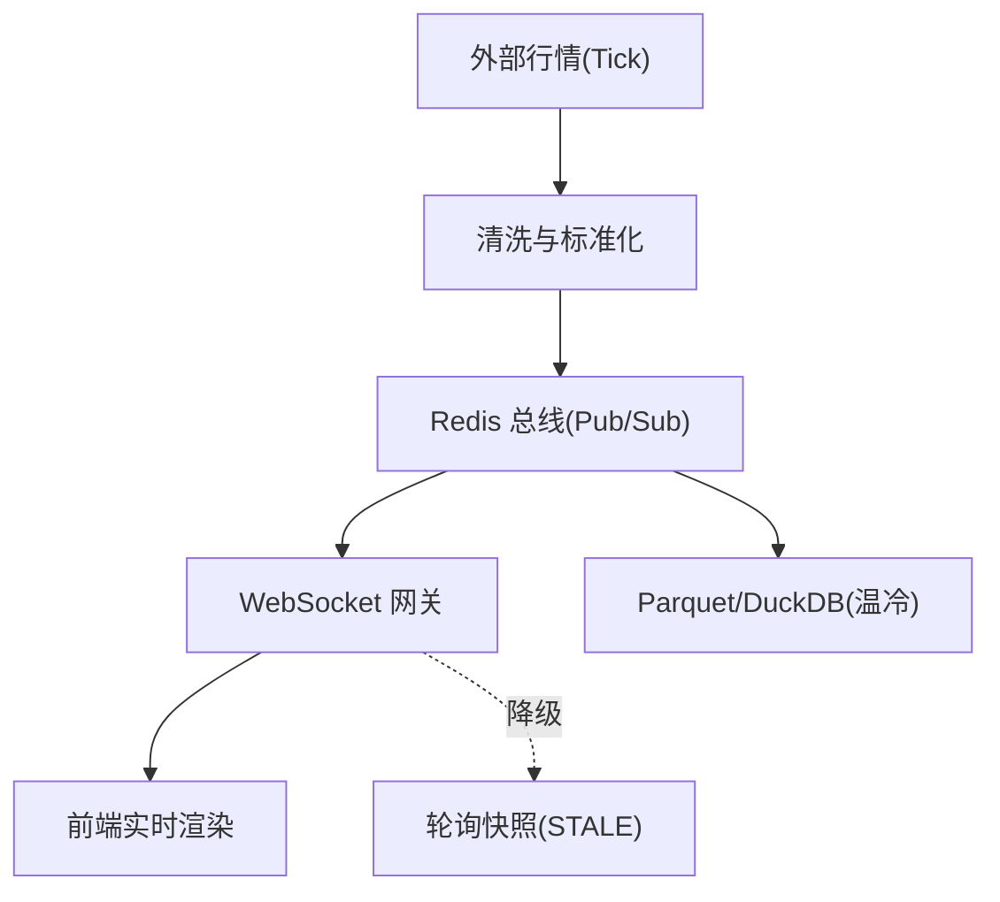
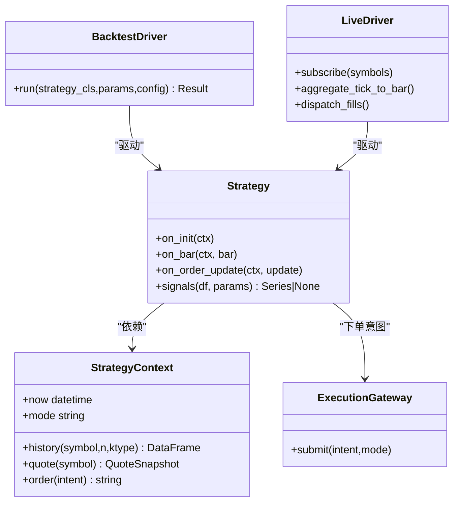
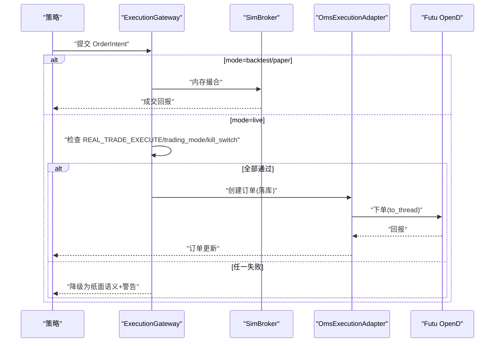
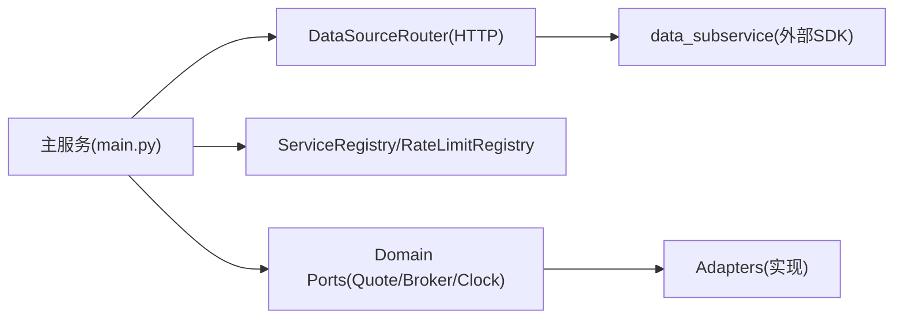

# 项目简介与目标

<cite>
**本文引用的文件**
- [README.md](file://README.md)
- [backend/main.py](file://backend/main.py)
- [docs/README.md](file://docs/README.md)
- [docs/03. 后端架构与执行引擎.md](file://docs/03.%20后端架构与执行引擎.md)
- [docs/15. 回测实盘同构引擎设计.md](file://docs/15.%20回测实盘同构引擎设计.md)
- [docs/01. 产品功能与UIUE架构.md](file://docs/01.%20产品功能与UIUE架构.md)
- [AGENTS.md](file://AGENTS.md)
- [hermes_agent/agent.py](file://hermes_agent/agent.py)
- [backend/core/config.py](file://backend/core/config.py)
</cite>

## 目录
1. [引言](#引言)
2. [项目结构](#项目结构)
3. [核心组件](#核心组件)
4. [架构总览](#架构总览)
5. [详细组件分析](#详细组件分析)
6. [依赖关系分析](#依赖关系分析)
7. [性能考量](#性能考量)
8. [故障排查指南](#故障排查指南)
9. [结论](#结论)
10. [附录](#附录)

## 引言
Quant Agent 是一个以 AI 驱动的极客量化交易终端，面向个人交易者、量化研究员与中小型机构，提供“选股—策略研发—回测—纸面验证—实盘部署”的闭环能力。平台通过 Hermes Agent 将大模型推理与量化工具链结合，实现智能分析、实时数据处理、策略回测与订单管理的一体化体验。

核心价值主张：
- AI 深度集成：从选股到策略生成、风险研判与盘中辅助，贯穿投研全流程。
- 实时行情与低延迟渲染：WebSocket 推送 + WebGL/Canvas 渲染，盯盘无延迟。
- 可信回测：财务数据按时间切片（PIT）、动态标的池与数据快照版本化，确保结果可复现。
- 沙箱→纸面→实盘：单次推演到常驻模拟盘再到生产交易，路径清晰、安全可控。
- 多端覆盖：Web 重型工作台 + Flutter 移动端监控与告警推送。

技术目标：
- 构建同构的回测/实盘引擎，使同一份策略代码可在回测、纸面与实盘无缝运行。
- 建立稳定、可扩展的后端服务边界与插件体系，解耦外部数据源与业务编排。
- 强化安全与合规：JWT/HMAC 鉴权、审计日志、敏感数据加密、Kill Switch。
- 提升可观测性与稳定性：结构化日志、指标采集、熔断限流、健康检查分级。

业务目标：
- 降低量化研究门槛，缩短从想法到实盘的周期。
- 为机构提供可审计、可复现、可回滚的研究与执行基础设施。
- 通过纸面组合与风控面板，帮助用户稳健过渡至实盘。

适合用户群体：
- 个人交易者：快速验证策略、可视化回测、移动端盯盘与告警。
- 量化研究员：策略实验室、因子挖掘、回测工坊、数据湖与版本化快照。
- 中小型机构：多通道推送、审计与风控、分布式数据源与高可用部署。

历史背景与发展路线：
- 早期聚焦单机 FastAPI + Redis + PG 闭环，逐步引入 CollectorRegistry、数据源子服务与 Registry/Router。
- 完成整洁架构收口与依赖物理隔离，主服务不再直装数据源 SDK，统一经 data_subservice HTTP 调用。
- 推进回测/实盘同构引擎（BT-01），并配套 VectorBT 快路径与同构校验器，保障批量寻优一致性。
- 持续完善纸面组合、多通道告警、数据湖快照版本化与前端四场景模式。

**章节来源**
- [README.md:9-21](file://README.md#L9-L21)
- [docs/README.md:55-131](file://docs/README.md#L55-L131)
- [docs/01. 产品功能与UIUE架构.md:81-186](file://docs/01.%20产品功能与UIUE架构.md#L81-L186)

## 项目结构
仓库采用前后端分离与节点化设计，核心目录包括：
- backend：FastAPI 网关、路由、服务、引擎、工作进程与测试。
- frontend：React + Vite 前端应用与页面模块。
- hermes_agent：ReAct 推理循环、工具注册与 LLM 调用封装。
- data_subservice：独立的数据源子服务，承载外部 SDK 连接与采集保障。
- docs：系统文档、子系统设计与规范。
- strategies：策略草稿与实盘策略存放。
- scripts：运维脚本、探针与基准测试。

**图表来源**
- [docs/README.md:55-131](file://docs/README.md#L55-L131)

**章节来源**
- [docs/README.md:35-131](file://docs/README.md#L35-L131)
- [backend/main.py:125-218](file://backend/main.py#L125-L218)

## 核心组件
- 后端网关与路由：基于 FastAPI，集中挂载各业务路由，统一 API 前缀与中间件栈。
- 数据源子服务：独立进程承载外部 SDK，暴露统一 HTTP 协议，主服务仅通过 Router 调用。
- 执行引擎：同构抽象（StrategyContext + Driver），支持事件驱动与 VectorBT 快路径。
- AI 副驾：Hermes Agent 维护会话记忆、ReAct 循环、工具调度与流式输出。
- 存储与缓存：PostgreSQL/pgvector 持久化，Redis 总线与缓存，Parquet 数据湖快照。
- 前端与移动端：Web 重型工作台 + Flutter 三端，零 GC 渲染与 STALE 感知。

**章节来源**
- [backend/main.py:125-218](file://backend/main.py#L125-L218)
- [docs/03. 后端架构与执行引擎.md:61-109](file://docs/03.%20后端架构与执行引擎.md#L61-L109)
- [docs/15. 回测实盘同构引擎设计.md:51-115](file://docs/15.%20回测实盘同构引擎设计.md#L51-L115)
- [hermes_agent/agent.py:116-190](file://hermes_agent/agent.py#L116-L190)

## 架构总览
系统采取极度解耦的节点化拓扑：客户端通过网关访问 REST/WS/SSE；AI 大脑经内部通道调用工具；数据与执行中枢负责行情清洗、撮合与订单状态机；存储层提供混合介质；外部数据源由子服务统一管理。

**图表来源**
- [docs/README.md:55-131](file://docs/README.md#L55-L131)
- [backend/main.py:125-218](file://backend/main.py#L125-L218)
- [docs/03. 后端架构与执行引擎.md:113-137](file://docs/03.%20后端架构与执行引擎.md#L113-L137)

## 详细组件分析

### AI 驱动的分析能力（Hermes Agent）
- ReAct 推理循环：Plan → Tool → Verify → Output，最大迭代次数限制与强制恢复策略。
- 工具注册与执行：统一入口 _safe_execute_tool，并发调度工具并捕获异常。
- 流式输出与心跳保活：SSE 推送文本块、工具开始/结果、心跳防止连接空闲超时。
- 参考完整性自愈：自动检测正文引用与参考文献列表不一致，触发补充生成。

**图表来源**
- [hermes_agent/agent.py:116-190](file://hermes_agent/agent.py#L116-L190)
- [hermes_agent/agent.py:399-506](file://hermes_agent/agent.py#L399-L506)
- [hermes_agent/agent.py:508-795](file://hermes_agent/agent.py#L508-L795)

**章节来源**
- [hermes_agent/agent.py:116-190](file://hermes_agent/agent.py#L116-L190)
- [hermes_agent/agent.py:399-506](file://hermes_agent/agent.py#L399-L506)
- [hermes_agent/agent.py:508-795](file://hermes_agent/agent.py#L508-L795)

### 实时数据处理与行情流水线
- 数据源子服务：独立进程直连外部 SDK，暴露统一 HTTP 接口，主服务不安装数据源依赖。
- 行情总线：Tick 流入 Redis，Pub/Sub 推送至 WebSocket Gateway 与前端。
- 降级与 STALE：订阅配额超限或断连时回退轮询快照，前端显示 STALE 标识。

**图表来源**
- [docs/03. 后端架构与执行引擎.md:321-340](file://docs/03.%20后端架构与执行引擎.md#L321-L340)
- [docs/03. 后端架构与执行引擎.md:357-380](file://docs/03.%20后端架构与执行引擎.md#L357-L380)

**章节来源**
- [docs/03. 后端架构与执行引擎.md:113-137](file://docs/03.%20后端架构与执行引擎.md#L113-L137)
- [docs/03. 后端架构与执行引擎.md:321-380](file://docs/03.%20后端架构与执行引擎.md#L321-L380)

### 策略回测与验证（同构引擎）
- 策略契约：Strategy 基类与 StrategyContext，统一 on_init/on_bar/on_order_update 生命周期。
- 双驱动：BacktestDriver（事件回放 + SimBroker）与 LiveDriver（行情消费 + K线聚合）。
- VectorBT 快路径：signals() 纯函数声明，批量寻优加速，并由同构校验器保证一致性。
- 安全锁：ExecutionGateway 在 live 模式下检查 REAL_TRADE_EXECUTE、trading_mode 与 kill switch。

**图表来源**
- [docs/15. 回测实盘同构引擎设计.md:51-115](file://docs/15.%20回测实盘同构引擎设计.md#L51-L115)
- [docs/15. 回测实盘同构引擎设计.md:118-239](file://docs/15.%20回测实盘同构引擎设计.md#L118-L239)
- [docs/15. 回测实盘同构引擎设计.md:242-353](file://docs/15.%20回测实盘同构引擎设计.md#L242-L353)

**章节来源**
- [docs/15. 回测实盘同构引擎设计.md:51-353](file://docs/15.%20回测实盘同构引擎设计.md#L51-L353)

### 订单管理与风控（OMS）
- 订单出口：OrderIntent 经 ExecutionGateway 路由至 SimBroker 或 OmsExecutionAdapter。
- 安全机制：三重检查（环境变量、运行时软锁、kill switch），任一失败降级为纸面语义。
- 状态枚举收口：统一 OrderStatus，修正 PARTIAL/PARTIALLY_FILLED 不一致问题。

**图表来源**
- [docs/15. 回测实盘同构引擎设计.md:331-353](file://docs/15.%20回测实盘同构引擎设计.md#L331-L353)

**章节来源**
- [docs/15. 回测实盘同构引擎设计.md:331-353](file://docs/15.%20回测实盘同构引擎设计.md#L331-L353)

### 前端与移动端（零GC与STALE感知）
- 零 GC 渲染：Tick 不进 React 状态，使用 useRef + DOM 突变；Level 2 盘口用 PixiJS。
- STALE 感知：断连或超时时区域叠加 STALE 遮罩，禁止展示过期数据。
- 四场景模式：盯盘/研究/监控/AI 分析，布局密度与强调色差异化。

**章节来源**
- [AGENTS.md:106-130](file://AGENTS.md#L106-L130)
- [docs/01. 产品功能与UIUE架构.md:135-186](file://docs/01.%20产品功能与UIUE架构.md#L135-L186)

## 依赖关系分析
- 主服务与数据源子服务依赖物理隔离：主服务 requirements 不含第三方数据源 SDK，所有真实请求经 DataSourceRouter HTTP 调子服务。
- 插件体系：Collector/DataSource/Alert/Strategy 均通过 Registry 发现与热加载。
- 端口与契约：跨模块只依赖 Port/Schema，避免耦合具体实现。

**图表来源**
- [docs/03. 后端架构与执行引擎.md:113-137](file://docs/03.%20后端架构与执行引擎.md#L113-L137)
- [docs/03. 后端架构与执行引擎.md:244-275](file://docs/03.%20后端架构与执行引擎.md#L244-L275)

**章节来源**
- [docs/03. 后端架构与执行引擎.md:113-137](file://docs/03.%20后端架构与执行引擎.md#L113-L137)
- [docs/03. 后端架构与执行引擎.md:244-275](file://docs/03.%20后端架构与执行引擎.md#L244-L275)

## 性能考量
- 零 GC 数据管道：Tick 不入状态，高频计算进 Web Worker；K 线主图用 Lightweight-Charts，盘口用 PixiJS。
- CPU 密集任务隔离：回测/网格搜索/蒙特卡洛迁移至 ProcessPoolExecutor，to_thread 用于同步阻塞 SDK。
- 背压与限流：WS 慢客户端丢弃或断开；数据源限流与熔断解耦，退避期内禁止硬重试。
- 连接池与资源：PG 连接池参数可调，Redis 连接上限统一配置，避免打满。

**章节来源**
- [AGENTS.md:106-130](file://AGENTS.md#L106-L130)
- [docs/03. 后端架构与执行引擎.md:383-413](file://docs/03.%20后端架构与执行引擎.md#L383-L413)
- [docs/03. 后端架构与执行引擎.md:342-356](file://docs/03.%20后端架构与执行引擎.md#L342-L356)

## 故障排查指南
- 启动失败：检查 DATABASE_URL、EMBEDDING_API_KEY 等必填配置；缺失关键配置 fail-fast。
- 实盘下单失败：确认 REAL_TRADE_EXECUTE、FUTU_PWD_UNLOCK、trading_mode 与 kill switch 状态。
- 数据源不可用：查看 data_subservice 健康探针与限流/熔断状态；主服务仅经 Router 调用。
- 前端 STALE：WS 断连或超时时显示 STALE 标签，检查订阅配额与降级链路。

**章节来源**
- [backend/core/config.py:94-119](file://backend/core/config.py#L94-L119)
- [docs/03. 后端架构与执行引擎.md:315-340](file://docs/03.%20后端架构与执行引擎.md#L315-L340)
- [AGENTS.md:106-130](file://AGENTS.md#L106-L130)

## 结论
Quant Agent 以 AI 为核心、以同构引擎为骨架、以插件化与依赖隔离为基石，构建了从研究到执行的完整量化平台。它既满足个人交易者的易用性需求，也为机构提供了可审计、可复现、可扩展的基础设施。未来将继续完善纸面组合、多通道告警、数据湖快照与前端四场景模式，推动平台向更高可靠性与更强智能化演进。

## 附录
- 快速开始：后端 uvicorn main:app，前端 pnpm dev。
- 部署：生产环境编译前端静态资源，容器化部署，统一 8000 端口访问。
- 文档导航：详见 docs/README.md 索引与各子系统文档。

**章节来源**
- [README.md:38-56](file://README.md#L38-L56)
- [docs/README.md:139-170](file://docs/README.md#L139-L170)