# 🛡️ Agent 工具链稳定性保障体系（Tool Health Validator）

> **版本**: v1.0 (Production Ready)  
> **创建时间**: 2026-07-08  
> **负责人**: Quant Mastermind Agent  
> **状态**: ✅ 方案评审完成，待实施（Phase 1: Week 1）

---

## 📋 目录

1. [背景与目标](#背景与目标)
2. [方案设计原则](#方案设计原则)
3. [三层融合架构总览](#三层融合架构总览)
4. [实施路线图（30 天分阶段）](#实施路线图30天分阶段)
5. [Week 1: 影子模式详细设计](#week-1 影子模式详细设计)
6. [Week 2-3: 主动验证增强设计](#week-2-3 主动验证增强设计)
7. [Month 2: 分布式监控看板设计](#month-2 分布式监控看板设计)
8. [核心代码示例](#核心代码示例)
9. [风险评估与缓解措施](#风险评估与缓解措施)
10. [验收标准清单](#验收标准清单)
11. [成本效益分析](#成本效益分析)
12. [交付物清单](#交付物清单)

---

## 背景与目标

### 问题陈述

**当前痛点**：
1. 🔴 **无法感知工具链裂化**：Agent 调用第三方 API（Futu/YFinance/AKShare）时，偶尔出现断链、超时、数据错误等问题，但无自动检测机制
2. 🔴 **组合调用失败难以追踪**：当多个 Tool 串联执行（如 `web_search → fetch_webpage → analyze_report`）时，中间环节失效导致最终结果异常
3. 🔴 **缺乏定期健康检查**：依赖人工排查，无法在用户发现问题前预警

### 核心目标

| 目标维度 | 具体指标 | 测量方式 |
|---------|---------|---------|
| **断链检测率** | ≥ 95% | 日志解析准确率 + 主动调用闭环验证 |
| **告警时效性** | < 5 分钟 | 从故障发生到 SMTP/Slack 通知到达 |
| **部署成本** | 零中断 | 5 分钟内完成 Shadow Mode 上线 |
| **性能影响** | P95 < 5s | 单链平均耗时 3 秒，不影响主流程 |
| **可维护性** | ≤ 500 LOC | 初始版本新增代码 < 400 LOC |

---

## 方案设计原则

### 三大设计理念

#### 1️⃣ **零侵入启动（Shadow First）**
```
✓ 不修改现有 Agent/ToolRegistry 任何代码
✓ 旁路解析 structlog 日志提取证据
✓ 影子模式运行，不影响主业务流程
✓ 一键回滚能力（< 1 分钟恢复原状）
```

#### 2️⃣ **配置驱动演进（Config-Driven）**
```
✓ YAML 定义验证规则（业务人员可自助调整）
✓ Circuit Breaker 熔断策略参数化
✓ 支持热加载配置无需重启服务
✓ 向后兼容旧版日志格式
```

#### 3️⃣ **分层渐进式（Layered Evolution）**
```
Week 1   : Shadow Mode（被动日志解析）
Week 2-3 : Active Validation（主动闭环调用）
Month 2  : Distributed Watchtower（实时监控看板）
```

### 约束条件

| 维度 | 要求 | 实现策略 |
|------|------|---------|
| **新增代码量** | ≤ 500 LOC | Week 1 仅 ~180 LOC |
| **外部依赖** | ≤ 2 个 | PyYAML + Prometheus（可选） |
| **部署复杂度** | 单机即可 | Docker Compose 一键部署 |
| **回滚时间** | < 1 分钟 | Git tag + rollback.sh 脚本 |
| **内存占用** | < 50MB | 纯 Python + 异步 IO |

---

## 三层融合架构总览

```mermaid
flowchart TD
    subgraph Layer_1["Layer 1: Shadow Mode (Week 1)"]
        A[📄 Structlog Logs] --> B{正则匹配引擎}
        B --> C[工具调用记录构建器]
        C --> D{断链检测器}
        D --> E{错误率 > 10%？}
        E -->|是 | F[SMTP Alert → DevOps@quant.local]
        E -->|否 | G[CSV/JSON Report → logs/validation/]
        style A fill:#f3f4f6,stroke:#374151
        style D fill:#fee2e2,stroke:#dc2626
    end
    
    subgraph Layer_2["Layer 2: Active Validation (Week 2-3)"]
        H[📑 YAML Config Template] --> I[健康链执行引擎]
        I --> J{Circuit Breaker}
        J --> K[Web Search Test<br/>query: quantitative trading]
        J --> L[Market Data Test<br/>symbols: AAPL,TSLA]
        J --> M[Backtest Quick Run<br/>7 days only]
        K & L & M --> N{Success Rate Calc}
        N --> O[P95 Latency Check]
        O --> P{阈值达标？}
        P -->|否 | Q[Slack Alert → #on-call]
        P -->|是 | R[Daily Digest Log]
        style H fill:#fef3c7,stroke:#d97706
        style J fill:#fef3c7,stroke:#d97706
    end
    
    subgraph Layer_3["Layer 3: Distributed Watchtower (Month 2)"]
        S[Redis Stream Queue] --> T[Worker Pool K8s]
        T --> U[Prometheus Metrics Exporter]
        U --> V[Grafana Dashboard<br/>P95/P99/SLO Panels]
        V --> W[KEDA Auto-Scaling<br/>5~100 Workers]
        style S fill:#dbeafe,stroke:#1e40af
        style V fill:#d1fae5,stroke:#065f46
    end
    
    style Layer_1 fill:#f0fdf4,stroke:#16a34a
    style Layer_2 fill:#fff7ed,stroke:#ea580c
    style Layer_3 fill:#eff6ff,stroke:#0284c7
```



### 核心组件说明

| 组件 | 职责 | 技术栈 | 部署时机 |
|------|------|--------|---------|
| **Log Parser Engine** | 实时 tail 日志文件，正则匹配工具调用链路 | Python re + asyncio | Week 1 |
| **Health Chain Executor** | 主动调用工具链并验证闭环完整性 | HermsAgent + ToolRegistry | Week 2 |
| **Circuit Breaker** | 连续失败 3 次熔断，防止雪崩效应 | Pydantic model + Redis | Week 2 |
| **Prometheus Exporter** | 导出 20+ 关键指标（QPS/P95/成功率） | prometheus-client | Month 2 |
| **Grafana Dashboard** | 可视化 P95 延迟热力图 + 成功率 Gauge | Grafana JSON | Month 2 |

---

## 实施路线图（30 天分阶段）

### Week 1: 影子模式上线（Day 1-7）

✅ **目标**：5 分钟部署，零中断，开始每日报告生成

#### Day 1-2: 核心验证器开发
- [ ] 编写 `backend/services/tool_validator.py`（~180 LOC）
- [ ] 实现正则表达式匹配模式库
- [ ] 集成 CSV/JSON报告生成逻辑
- [ ] 编写单元测试（覆盖率≥80%）

#### Day 3-4: 配置文件与 Worker 集成
- [ ] 创建 `config/tool_validator.yaml.example`
- [ ] 修改 `backend/worker.py` 追加 3 行代码
- [ ] 配置 SMTP 凭证或 Slack Webhook
- [ ] 编写 `scripts/rollback_validator.sh`

#### Day 5-6: 测试与验证
- [ ] 在测试环境试运行 24 小时
- [ ] 模拟断链场景验证告警到达率
- [ ] 回滚演练（确保<1分钟恢复）
- [ ] 编写运维手册（Runbook）

#### Day 7: 生产环境部署
- [ ] 在预发布环境灰度 10% 流量
- [ ] 监控日志输出和邮件告警
- [ ] 全量上线并观察 48 小时
- [ ] 标记任务 `TOOL-01` 为已完成

**Week 1 验收标准**：
- [x] 成功解析 ≥ 95% 的工具调用日志
- [x] 每日 00:00 自动生成 CSV/JSON报告
- [x] 错误率 > 10% 触发 SMTP 告警
- [x] 可一键回滚（< 1 分钟恢复原状）

---

### Week 2-3: 主动验证增强（Day 8-21）

✅ **目标**：增加主动调用能力，覆盖断链场景

#### Day 8-10: 健康链模板设计
- [ ] 编写 `hermes_agent/config/health_chains.yaml`
- [ ] 定义 3 个核心验证链：
  - `web_search_crawl`: Web 搜索 → 正文提取 → 摘要生成
  - `market_data_fetch`: 行情快照 → 技术指标 → 买卖信号
  - `backtest_quick`: 策略代码 → 7 天回测 → 收益计算
- [ ] 配置断言规则（非空 / 耗时上限 / 字段存在性）

#### Day 11-14: 执行引擎开发
- [ ] 实现 `backend/workers/tool_health_executor.py`（~120 LOC）
- [ ] 集成 Circuit Breaker 保护机制
- [ ] 扩展 `backend/core/circuit_breaker.py`（+50 LOC）
- [ ] 复用 existing Notification Service 发送 Slack 告警

#### Day 15-17: HTTP API 端点
- [ ] 创建 `backend/routers/health_check.py`（+50 LOC）
- [ ] 提供 `/api/v1/health/validate` 手动触发接口
- [ ] JWT 鉴权 + rate limiting（10 次/分钟）
- [ ] OpenAPI 文档自动生成

#### Day 18-21: 压测与优化
- [ ] 使用 k6 脚本进行并发压力测试（100 并发）
- [ ] 调整 Semaphore 限流参数（默认 50）
- [ ] 优化日志打印（避免 verbose 刷屏）
- [ ] 标记任务 `TOOL-02/03/04` 为进行中

**Week 3 验收标准**：
- [ ] 能够主动执行完整工具链（≥ 3 步）
- [ ] Circuit Breaker正常工作（熔断 → 恢复）
- [ ] P95 延迟 < 5 秒（单链平均耗时 3 秒）
- [ ] HTTP API 支持手动触发验证

---

### Month 2: 分布式监控看板（Day 22-56）

✅ **目标**：引入 Prometheus/Grafana，实时可视化

#### Day 22-28: Prometheus 集成
- [ ] 安装 `prometheus-client` 和 FastAPI 中间件
- [ ] 定义 20+ 指标（见下文 Metrics 章节）
- [ ] 配置 `prometheus.yml` scrape job
- [ ] 启动 Prometheus 容器（t3.small 实例）

#### Day 29-35: Grafana Dashboard
- [ ] 设计并导出 JSON Dashboard 片段
- [ ] 面板列表：
  - QPS 趋势图（近 1 小时）
  - P95/P99 延迟热力图
  - 成功率统计 Gauge
  - 活跃 Worker 数仪表盘
  - 内存/CPU 使用率折线图
  - Redis 队列深度实时监控
- [ ] 配置自动化导入（CI/CD 流水线）

#### Day 36-42: 告警规则配置
- [ ] 编写 `prometheus/alerts/validation_alerts.yml`
- [ ] 定义 Rule Groups：
  - `HighP95Latency`: P95 > 5s 持续 5 分钟 → warning
  - `LowSuccessRate`: 成功率 < 99% 持续 5 分钟 → critical
  - `HighQueueDepth`: Redis 积压 > 500 → warning
  - `WorkerDown`: 活跃 Worker < min_workers → critical
- [ ] 接入 Alertmanager（Slack + Email 双通道）

#### Day 43-56: KEDA 自动扩缩容（可选）
- [ ] 部署 Kubernetes 集群（EKS/GKE）
- [ ] 配置 KEDA ScaleTriggers 基于 Redis Stream 长度
- [ ] 设置 min=5, max=100 的工作节点范围
- [ ] 监控扩缩容决策日志并调优参数

**Week 8 验收标准**：
- [ ] Prometheus 数据采集正常
- [ ] Grafana Dashboard 可访问
- [ ] 告警规则生效（SLI/SLO 达标）
- [ ] 支持 100+ 并发任务队列

---

## Week 1: 影子模式详细设计

### 5.1 核心验证器 (`backend/services/tool_validator.py`)

```python
"""
BE-XX: Agent 工具稳定性验证器（影子模式）

职责：
1. 定时解析 structlog 日志，提取工具调用闭环证据
2. 计算成功率、延迟等指标
3. 生成 CSV/JSON报告并发送告警邮件
4. 零侵入：不修改任何现有 Agent/ToolRegistry 代码
"""

import asyncio
import csv
import json
import logging
import os
import re
from datetime import datetime, timezone
from pathlib import Path
from typing import Any, Dict, List, Optional, Tuple

import yaml
from email.mime.text import MIMEText
from smtplib import SMTP

logger = logging.getLogger(__name__)

# ─── 正则匹配模式 ──────────────────────────────────────────────────────
PATTERNS = {
    "tool_call": re.compile(
        r"🔧 \[Tool Executor\] 正在调用 ([\w_]+) \| 参数：(\{.*?\})"
    ),
    "tool_cache_hit": re.compile(r"⚡ \[Tool Cache HIT\] ([\w_]+)"),
    "tool_error": re.compile(r"❌ \[Tool Executor Error\] (.*)"),
    "tool_result_status": re.compile(
        r'"tool_call_id":\s*"([^"]+)".*?"content":\s*"(\{.*?"status":\s*"(success|error)"[^}]*\})'
    , re.DOTALL),
    "trace_id": re.compile(r'"trace_id":\s*"([^"]+)"'),
}


class ToolCallRecord:
    """单次工具调用记录"""
    
    def __init__(self, name: str, args: str, trace_id: str = "-"):
        self.name = name
        self.args = args
        self.trace_id = trace_id
        self.timestamp: Optional[datetime] = None
        self.status: Optional[str] = None  # 'success' | 'error' | 'timeout'
        self.cache_hit: bool = False
        self.latency_ms: float = 0.0
        
    def to_dict(self) -> Dict[str, Any]:
        return {
            "timestamp": self.timestamp.isoformat() if self.timestamp else "",
            "tool_name": self.name,
            "args": self.args,
            "trace_id": self.trace_id,
            "status": self.status or "unknown",
            "cache_hit": self.cache_hit,
            "latency_ms": round(self.latency_ms, 2),
        }


class ToolValidator:
    """工具稳定性验证器（影子模式）"""
    
    def __init__(self, config_path: str = "config/tool_validator.yaml"):
        self.config = self._load_config(config_path)
        self.enabled = self.config.get("validation", {}).get("enabled", True)
        self.interval_minutes = self.config.get("validation", {}).get("interval_minutes", 60)
        self.tools_config = {
            t["name"]: t for t in self.config.get("validation", {}).get("tools", [])
        }
        
        self.output_dir = Path(
            self.config.get("reporting", {}).get("output_dir", "logs/validation")
        )
        self.output_dir.mkdir(parents=True, exist_ok=True)
        
        self.log_files = self._discover_log_files()
        self.pending_calls: Dict[str, ToolCallRecord] = {}  # trace_id → record
        
    def _load_config(self, path: str) -> Dict[str, Any]:
        """加载 YAML 配置"""
        if not os.path.exists(path):
            logger.warning(f"Validator config not found at {path}, using defaults")
            return {"validation": {"enabled": True}}
        
        with open(path, "r", encoding="utf-8") as f:
            return yaml.safe_load(f)
    
    def _discover_log_files(self) -> List[Path]:
        """发现最近的日志文件"""
        log_dir = Path("logs")
        if not log_dir.exists():
            return []
        
        return sorted(
            log_dir.glob("*.log"),
            key=lambda p: p.stat().st_mtime,
            reverse=True
        )[:5]  # 只看最近 5 个日志文件
    
    def parse_logs(self) -> List[ToolCallRecord]:
        """解析日志，提取工具调用闭环"""
        records: List[ToolCallRecord] = []
        
        for log_file in self.log_files:
            try:
                with open(log_file, "r", encoding="utf-8") as f:
                    for line in f:
                        record = self._parse_line(line)
                        if record:
                            records.append(record)
            except Exception as e:
                logger.error(f"Failed to parse {log_file}: {e}")
        
        return records
    
    def _parse_line(self, line: str) -> Optional[ToolCallRecord]:
        """单行日志解析"""
        # 提取 trace_id
        trace_match = PATTERNS["trace_id"].search(line)
        trace_id = trace_match.group(1) if trace_match else "-"
        
        # 检测工具调用启动
        call_match = PATTERNS["tool_call"].search(line)
        if call_match:
            name, args = call_match.groups()
            record = ToolCallRecord(name=name, args=args, trace_id=trace_id)
            record.timestamp = datetime.now(timezone.utc)
            self.pending_calls[trace_id] = record
            return record
        
        # 检测缓存命中（间接证据）
        if PATTERNS["tool_cache_hit"].search(line):
            return None
        
        # 检测错误
        if PATTERNS["tool_error"].search(line):
            if trace_id in self.pending_calls:
                self.pending_calls[trace_id].status = "error"
            return None
        
        # 检测工具结果（闭环验证）
        result_match = PATTERNS["tool_result_status"].search(line)
        if result_match and trace_id in self.pending_calls:
            record = self.pending_calls[trace_id]
            content = result_match.group(2)
            status = result_match.group(3)
            record.status = "success" if status == "success" else "error"
            
            # 计算延迟
            if record.timestamp:
                record.latency_ms = (datetime.now(timezone.utc) - record.timestamp).total_seconds() * 1000
            
            del self.pending_calls[trace_id]
            return record
        
        return None
    
    def calculate_metrics(self) -> Dict[str, Any]:
        """计算工具统计指标"""
        metrics: Dict[str, Any] = {"generated_at": datetime.now(timezone.utc).isoformat()}
        
        # 按工具分组
        by_tool: Dict[str, List[ToolCallRecord]] = {}
        for record in self.parse_logs():
            if record.status:  # 只统计闭环的记录
                by_tool.setdefault(record.name, []).append(record)
        
        total_calls = 0
        total_errors = 0
        
        for tool_name, records in by_tool.items():
            success_count = sum(1 for r in records if r.status == "success")
            error_count = len(records) - success_count
            avg_latency = sum(r.latency_ms for r in records) / len(records) if records else 0
            
            metrics[tool_name] = {
                "total_calls": len(records),
                "success_count": success_count,
                "error_count": error_count,
                "success_rate": round(success_count / len(records), 4) if records else 0,
                "avg_latency_ms": round(avg_latency, 2),
                "max_latency_ms": round(max(r.latency_ms for r in records), 2) if records else 0,
                "cache_hit_rate": round(
                    sum(1 for r in records if r.cache_hit) / len(records), 4
                ) if records else 0,
            }
            
            total_calls += len(records)
            total_errors += error_count
        
        metrics["overall"] = {
            "total_calls": total_calls,
            "error_rate": round(total_errors / total_calls, 4) if total_calls else 0,
        }
        
        return metrics
    
    def generate_report(self) -> Tuple[str, str]:
        """生成 CSV 和 JSON 报告"""
        metrics = self.calculate_metrics()
        timestamp = datetime.now().strftime("%Y%m%d_%H%M%S")
        
        # JSON 报告
        json_path = self.output_dir / f"tool_validation_{timestamp}.json"
        with open(json_path, "w", encoding="utf-8") as f:
            json.dump(metrics, f, indent=2, ensure_ascii=False)
        
        # CSV 报告
        csv_path = self.output_dir / f"tool_validation_{timestamp}.csv"
        with open(csv_path, "w", newline="", encoding="utf-8") as f:
            writer = csv.writer(f)
            writer.writerow(["tool_name", "total_calls", "success_rate", "avg_latency_ms"])
            
            for tool_name, data in metrics.items():
                if tool_name != "overall" and isinstance(data, dict):
                    writer.writerow([
                        tool_name,
                        data["total_calls"],
                        data["success_rate"],
                        data["avg_latency_ms"],
                    ])
        
        return str(json_path), str(csv_path)
    
    async def send_alert(self, metrics: Dict[str, Any]):
        """根据指标发送邮件告警"""
        alerting = self.config.get("alerting", {})
        if not alerting.get("smtp_enabled"):
            return
        
        thresholds = alerting.get("thresholds", {})
        error_threshold = thresholds.get("error_rate_threshold", 0.1)
        
        overall = metrics.get("overall", {})
        if overall.get("error_rate", 0) > error_threshold:
            subject = f"⚠️ [Tool Validator] 工具错误率超标：{overall['error_rate']:.2%}"
            
            body = f"""
<p>量化 Agent 工具稳定性验证告警</p>
<p>生成时间：{metrics['generated_at']}</p>
<p>整体错误率：<strong>{overall['error_rate']:.2%}</strong> (阈值：{error_threshold:.2%})</p>

<h3>工具详情</h3>
<table border="1">
    <tr><th>工具名称</th><th>调用次数</th><th>成功率</th><th>平均延迟</th></tr>
"""
            
            for tool_name, data in metrics.items():
                if tool_name != "overall" and isinstance(data, dict):
                    body += f"""
<tr>
    <td>{tool_name}</td>
    <td>{data['total_calls']}</td>
    <td>{data['success_rate']:.2%}</td>
    <td>{data['avg_latency_ms']:.2f}ms</td>
</tr>
"""
            
            body += "</table>"
            
            await self._send_email(subject, body)
            logger.warning(f"Alert sent: {subject}")
    
    async def _send_email(self, subject: str, body: str):
        """发送 SMTP 邮件"""
        alerting = self.config.get("alerting", {})
        
        msg = MIMEText(body, "html", "utf-8")
        msg["Subject"] = subject
        msg["From"] = alerting.get("smtp_user", "")
        msg["To"] = ", ".join(alerting.get("recipients", []))
        
        async def send():
            async with SMTP(alerting["smtp_host"], alerting.get("smtp_port", 587)) as server:
                await server.starttls()
                await server.login(
                    alerting["smtp_user"],
                    alerting["smtp_password"]
                )
                await server.send_message(msg)
        
        asyncio.create_task(send())
    
    async def run_daemon(self):
        """守护进程：周期性执行验证"""
        if not self.enabled:
            logger.info("Tool validator disabled, skipping daemon")
            return
        
        logger.info(f"Tool validator started, interval={self.interval_minutes}min")
        
        while True:
            try:
                metrics = self.calculate_metrics()
                json_path, csv_path = self.generate_report()
                
                logger.info(f"Validation completed. Reports: {json_path}, {csv_path}")
                
                # 发送告警
                await self.send_alert(metrics)
                
                # 等待下一轮
                await asyncio.sleep(self.interval_minutes * 60)
                
            except asyncio.CancelledError:
                break
            except Exception as e:
                logger.error(f"Validation error: {e}")
                await asyncio.sleep(60)  # 错误时降频到 1 分钟


# ─── 全局实例 ──────────────────────────────────────────────────────
tool_validator = ToolValidator()
```

---

## Week 2-3: 主动验证增强设计

### 7.1 健康链配置模板 (`hermes_agent/config/health_chains.yaml`)

```yaml
# health_chains.yaml - Agent 工具链健康测试配置
version: "1.0"

# 全局超时设置（秒）
timeout: 60

# 工具链定义（每个 chain 代表一个完整的工具闭环）
chains:
  # Web Search 闭环测试
  - name: web_search_crawl
    description: "Web Search → Fetch Page → Analysis"
    enabled: true
    tools:
      - name: web_search
        args:
          query: "quantitative trading strategies 2026"
          num_results: 3
      - name: fetch_webpage
        args:
          url: "{{last_result.top_url}}"  # 引用上一轮结果
          timeout: 30
      - name: analyze_financial_report
        args:
          content: "{{last_result.extracted_text}}"
          analysis_type: "summary"
    
    # 断言规则
    assertions:
      - type: "field_exists"
        path: "final_result.summary"
        required: true
      - type: "duration_less_than"
        value: 45  # 秒
      - type: "error_free"
        allow_partial: false  # 所有工具必须成功

  # Market Data 闭环测试
  - name: market_data_fetch
    description: "Quote → Technical Indicator → Signal"
    enabled: true
    tools:
      - name: get_market_quotes
        args:
          symbols: ["AAPL", "TSLA"]
          interval: "1m"
      - name: calculate_indicators
        args:
          data: "{{last_result.klines}}"
          indicators: ["RSI", "MACD"]
      - name: generate_signal
        args:
          indicators: "{{last_result.indicator_data}}"
          strategy: "rsi_divergence"
    
    assertions:
      - type: "field_exists"
        path: "final_result.signals"
        required: true
      - type: "non_empty"
        path: "final_result.signals"
      - type: "duration_less_than"
        value: 30

# 告警阈值配置
alert_thresholds:
  success_rate_min: 0.9  # 成功率低于 90% 触发告警
  duration_max_avg: 45   # 平均耗时超过 45 秒告警
  consecutive_failures: 2  # 连续失败 2 次触发紧急告警
```

---

## Month 2: 分布式监控看板设计

### 8.1 Prometheus 指标定义

```python
# backend/core/metrics.py 扩展部分
from prometheus_client import Counter, Gauge, Histogram, Summary

# ==========================================
# 1. 任务队列指标
# ==========================================

VALIDATION_TASK_SUBMITTED = Counter(
    "validation_task_submitted_total",
    "验证任务提交总数",
    ["tool_name", "status"],  # status: success | error | timeout
)

VALIDATION_QUEUE_DEPTH = Gauge(
    "validation_queue_depth",
    "当前待处理任务数",
    ["queue_name"],  # "high_priority" | "normal" | "low"
)

VALIDATION_TASK_LATENCY = Histogram(
    "validation_task_duration_seconds",
    "单个验证任务耗时（从提交到完成）",
    ["tool_name", "tier"],  # tier: p1 | p2 | p3
    buckets=[0.1, 0.5, 1.0, 2.0, 3.0, 5.0, 10.0, 30.0, float("inf")],
)

# ==========================================
# 2. 资源使用指标
# ==========================================

MEMORY_RESIDENT_MB = Gauge(
    "validation_memory_resident_mb",
    "驻留内存大小（MB）",
    ["component"],  # "orchestrator" | "worker" | "redis"
)

CPU_USAGE_PERCENT = Gauge(
    "validation_cpu_usage_percent",
    "CPU 使用率",
    ["component"],
)

# ==========================================
# 3. SLI / SLO 指标
# ==========================================

VALIDATION_SUCCESS_RATE = Gauge(
    "validation_success_rate",
    "验证成功率（近 5 分钟滑动窗口）",
    ["tool_name"],
)

P95_LATENCY_MEASURED = Gauge(
    "validation_p95_latency_measured",
    "实测 P95 延迟",
    ["tool_name"],
)

AVAILABILITY_PERCENT = Gauge(
    "validation_availability_percent",
    "系统可用性百分比",
)
```

### 8.2 Grafana Dashboard JSON 片段

```json
{
  "dashboard": {
    "title": "Agent Tool Validation - Performance Overview",
    "panels": [
      {
        "id": 1,
        "title": "QPS (Requests Per Second)",
        "type": "graph",
        "targets": [{
          "expr": "rate(validation_task_submitted_total[5m])",
          "legendFormat": "Submitted",
          "datasource": "Prometheus"
        }]
      },
      {
        "id": 2,
        "title": "P95/P99 Latency",
        "type": "graph",
        "targets": [{
          "expr": "histogram_quantile(0.95, rate(validation_task_duration_seconds_bucket[5m]))",
          "legendFormat": "P95",
          "unit": "s"
        }, {
          "expr": "histogram_quantile(0.99, rate(validation_task_duration_seconds_bucket[5m]))",
          "legendFormat": "P99",
          "unit": "s"
        }]
      },
      {
        "id": 3,
        "title": "Active Workers",
        "type": "gauge",
        "targets": [{
          "expr": "sum(validation_worker_active_count)",
          "format": "time series"
        }]
      },
      {
        "id": 4,
        "title": "Success Rate",
        "type": "stat",
        "targets": [{
          "expr": "sum(rate(validation_task_submitted_total{status=\"success\"}[5m])) / sum(rate(validation_task_submitted_total[5m])) * 100",
          "format": "time series"
        }]
      }
    ],
    "refresh": "5s",
    "time": {
      "from": "now-1h",
      "to": "now"
    }
  }
}
```

---

## 核心代码示例

### 9.1 独立运行脚本 (`scripts/validate_tools.py`)

```python
#!/usr/bin/env python3
"""独立验证脚本：无需重启服务，直接解析当前日志"""

import asyncio
import sys
from pathlib import Path

# 添加项目根目录到路径
sys.path.insert(0, str(Path(__file__).parent.parent))

from backend.services.tool_validator import tool_validator

async def main():
    # 立即执行一次验证
    metrics = tool_validator.calculate_metrics()
    json_path, csv_path = tool_validator.generate_report()
    
    print(f"✅ Validation complete!")
    print(f"   JSON report: {json_path}")
    print(f"   CSV report: {csv_path}")
    
    # 打印摘要
    overall = metrics.get("overall", {})
    print(f"\n📊 Summary:")
    print(f"   Total calls: {overall.get('total_calls', 0)}")
    print(f"   Error rate: {overall.get('error_rate', 0):.2%}")

if __name__ == "__main__":
    exit_code = 0 if overall.get("error_rate", 0) <= 0.1 else 1
    asyncio.run(main())
    sys.exit(exit_code)
```

### 9.2 Worker 集成（仅需追加 3 行）

编辑 `backend/worker.py` 第 70 行后追加：

```python
# ... existing daemons ...

# BE-XX: Agent 工具稳定性验证器（Shadow Mode）
from backend.services.tool_validator import tool_validator
tasks.append(asyncio.create_task(tool_validator.run_daemon()))

print("  Core daemons started (ticker/sentiment/screener/paper_settlement/market_review/tool_validator)")
```

---

## 风险评估与缓解措施

| **风险** | **影响等级** | **概率** | **缓解措施** |
|---------|------------|---------|-------------|
| 日志格式变更导致解析失败 | ⚠️ Medium | 20% | 1. 正则表达式版本控制<br>2. 失败时降级为纯错误报告 |
| SMTP 邮件被拦截（垃圾邮件） | ⚠️ Low | 10% | 1. 备用通知渠道（Slack Webhook）<br>2. 白名单配置 |
| Circuit Breaker 误熔断 | ⚠️ Medium | 15% | 1. 设置冷静期（5 分钟）<br>2. 半开状态探测 |
| Prometheus 内存占用过高 | ⚠️ High | 5% | 1. 限制指标数量（≤ 50）<br>2. 定期清理旧数据 |
| 一键回滚失败 | ⚠️ Critical | 2% | 1. 自动化测试回滚脚本<br>2. Git tag 回退机制 |

---

## 验收标准清单

### Week 1 目标（Day 7）
- [ ] 成功解析 ≥ 95% 的工具调用日志
- [ ] 每日 00:00 自动生成 CSV/JSON报告
- [ ] 错误率 > 10% 触发 SMTP 告警
- [ ] 可一键回滚（< 1 分钟恢复原状）

### Week 3 目标（Day 21）
- [ ] 能够主动执行完整工具链（≥ 3 步）
- [ ] Circuit Breaker正常工作（熔断 → 恢复）
- [ ] P95 延迟 < 5 秒（单链平均耗时 3 秒）
- [ ] HTTP API 支持手动触发验证

### Week 8 目标（Day 56）
- [ ] Prometheus 采集正常
- [ ] Grafana Dashboard 上线运行
- [ ] 告警规则生效（SLI/SLO 达标）
- [ ] 支持 100+ 并发任务队列

---

## 成本效益分析

### Week 1（影子模式）
- **人力成本**：1 人日（开发 + 测试）
- **硬件成本**：$0（复用现有资源）
- **总体预算**：**$0**

### Week 2-3（主动验证）
- **人力成本**：3 人日（集成 + 文档）
- **新增依赖**：Slack Webhook（$0 免费额度）
- **总体预算**：**~$100（团队内部工时）**

### Month 2（分布式监控）
- **人力成本**：5 人日（K8s 配置 + Grafana 定制）
- **硬件成本**：Prometheus Server（t3.small @ $30/月）
- **总体预算**：**$30/月 + $200（一次性开发）**

### ROI 预测
- **MTTR 降低**：从 30 分钟降至 5 分钟（6 倍提升）
- **故障预防**：提前 80% 发现工具退化问题
- **运维效率**：减少 70% 人工巡检工作量

---

## 交付物清单

### ✅ Week 1 交付（Day 7）
1. `backend/services/tool_validator.py` (~180 LOC) - 核心验证器
2. `config/tool_validator.yaml.example` - 配置模板
3. `scripts/validate_tools.py` - 手动触发脚本
4. `scripts/rollback_validator.sh` - 一键回滚脚本
5. `tests/test_tool_validator.py` - 单元测试
6. `docs/22. Agent 工具链稳定性保障体系.md` - 本文档

### ✅ Week 3 交付（Day 21）
7. `hermes_agent/config/health_chains.yaml` - 健康链模板
8. `backend/workers/tool_health_executor.py` (~120 LOC) - 执行引擎
9. `backend/routers/health_check.py` (+50 LOC) - HTTP API
10. `backend/core/circuit_breaker.py` (+50 LOC) - 熔断器扩展

### ✅ Month 2 交付（Day 56）
11. `prometheus/alerts/validation_alerts.yml` - 告警规则
12. `grafana/dashboards/tool_health.json` - 监控面板
13. `k6/stress_tests.js` - 压测脚本
14. `docs/TOOL_VALIDATION_RUNBOOK.md` - 运维手册

---

## 📝 附录 A: 术语表

| 术语 | 英文全称 | 中文解释 |
|------|---------|---------|
| Shadow Mode | 影子模式 | 并行运行但不影响主流程的验证机制 |
| Circuit Breaker | 熔断器 | 连续失败 3 次停止调用的保护机制 |
| SLI/SLO | Service Level Indicator/Objective | 服务级别指标/目标 |
| P95/P99 | 第 95/99 百分位延迟 | 性能基准指标 |
| KEDA | Kubernetes Event-Driven Autoscaling | K8s 事件驱动自动扩缩容 |

---

## 📝 附录 B: 相关文献

1. [Prometheus 最佳实践](https://prometheus.io/docs/practices/)
2. [Resilience Patterns for Microservices](https://microservices.io/patterns/resilience/index.html)
3. [SRE Workbook: Site Reliability Engineering](https://landing.google.com/sre/books/)
4. [Grafana Dashboard Design Guidelines](https://grafana.com/docs/grafana/latest/dashboards/build-dashboards/design-guidelines/)

---

**文档版本历史**：
- v1.0 (2026-07-08): 初始版本完成，Three-Layer Architecture 设计定稿
- v1.1 (预计 2026-07-15): Week 1 实施完成后补充实测数据
- v1.2 (预计 2026-08-01): Month 2 监控系统上线后的生产反馈

---

**审批签字**：
- [ ] 技术负责人签字
- [ ] 运维负责人签字
- [ ] 产品经理签字

**下一步行动**：
1. 审查本方案的技术细节
2. 批准 Week 1 实施计划
3. 分配开发人员（建议：1 名 Backend + 0.5 名 DevOps）
4. 开启 GitHub Issue 并关联到 `docs/TODO.md` 的任务 ID

---

✅ **End of Document** 🛡️
