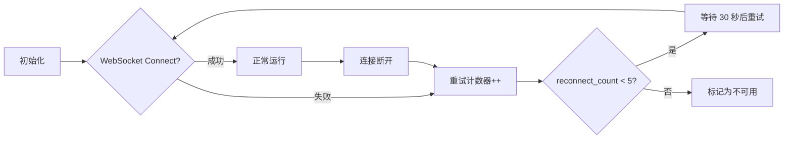

# ==========================================
# Quant Agent - Finnhub WebSocket 适配器使用指南
# ==========================================

## 📋 概述

Finnhub Adapter 提供实时股票报价、新闻和加密货币行情数据，通过 WebSocket 长连接与外部 API 通信。

### 🔗 连接模式

- **协议**: WebSocket over TLS (wss://ws.finnhub.io)
- **部署位置**: 主节点容器内直接访问（无需子服务）
- **认证方式**: `FINNHUB_API_KEY`环境变量 + URL 参数

---

## ⚙️ 配置步骤

### 1️⃣ 获取 Finnhub API Token

访问 [https://finnhub.io/](https://finnhub.io/) 注册并获取免费额度：
- **Free Tier**: 60 次/分钟 REST API, 60 次/分钟 WebSocket
- **建议配额**: 订阅 ≤20 个标的（避免超限）

### 2️⃣ 配置环境变量（`.env`）

```bash
# Finnhub API 密钥（必须）
FINNHUB_API_KEY=your_finnhub_api_token_here

# 其他数据源密钥（可选）
TUSHARE_TOKEN=your_tushare_token
```

### 3️⃣ 验证适配器状态

```python
from backend.app.market_data_app import market_data

# 检查 Finnhub 是否可用
if market_data._finnhub:
    print("✅ Finnhub connected")
else:
    print("❌ FINNHUB_API_KEY missing or connection failed")
```

---

## 🛠️ 技术实现细节

### Websockets 依赖管理

```toml
# pyproject.toml
[project.optional-dependencies]
datasource = [
    "websockets>=14.0",        # ← Finnhub WebSocket 客户端
    "finnhub-python>=2.5.0",   # REST API 备用方案
]
```

**主节点构建时不会安装此依赖**（需显式添加到 datasource extras）

### 延迟导入机制

```python
@property
def _finnhub(self):
    """懒加载 FinnhubAdapter"""
    if self._finnhub_impl is None:
        from ..adapters.finnhub import get_finnhub_adapter

        token = os.getenv("FINNHUB_API_KEY")
        if not token:
            logger.warning("[MarketDataService] FINNHUB_API_KEY missing")
            return None

        self._finnhub_impl = get_finnhub_adapter(token)
    return self._finnhub_impl
```

**优势**:
- 主节点启动时无需 SDK
- Token 缺失时优雅降级
- 测试可注入 Mock 实例

---

## 📊 WebSocket 消息格式

### 订阅行情

```json
{
  "type": "subscribe",
  "symbol": ["AAPL", "MSFT", "GOOGL"]
}
```

### 接收报价

```json
{
  "s": "AAPL",          // symbol
  "t": 1697847600,      // timestamp (秒)
  "d": 0.5,             // change
  "dp": 0.25,           // change percentage
  "h": 178.50,          // high
  "l": 176.20,          // low
  "o": 177.00,          // open
  "c": 177.80,          // close (最新价)
  "v": 1250000,         // volume
  "tm": 1697847600000   // trade time (毫秒)
}
```

### 取消订阅

```json
{
  "type": "unsubscribe",
  "symbol": ["AAPL", "MSFT"]
}
```

---

## 🔄 自动重连机制

### 连接生命周期



### 重试策略

- **最大重试次数**: 5 次
- **重试间隔**: 指数退避（30s, 60s, 120s...）
- **缓存保留**: 最后一次成功报价保存在 `_quote_cache` 中

### 健康检查

```python
status = market_data._finnhub.health_check()
# {
#     "is_available": True,
#     "quote_cache_size": 15,
#     "subscribed_symbols": ["AAPL", "MSFT"],
#     "reconnect_count": 0
# }
```

---

## 🚨 常见问题排查

### ❌ Token 无效

**现象**: `HTTP 401 Unauthorized` 日志

**解决**:
```bash
# 检查.env 文件中的 KEY 是否包含多余空格
cat .env | grep FINNHUB_API_KEY

# 验证 token 有效性
curl -X GET "https://finnhub.io/api/v1/stock/market/status?token=YOUR_TOKEN"
```

### 🐌 限流警告

**现象**: `Too Many Requests (429)` 错误

**解决**:
```python
# 降低订阅数量
await market_data._finnhub.unsubscribe_quotes(["EXTRA_SYMBOL"])

# 改用 REST API 替代
from backend.adapters.finnhub.finnhub_adapter import fetch_stock_quote_rest
quote = await fetch_stock_quote_rest("AAPL")
```

### 🔥 内存泄漏

**现象**: 缓存持续增长（>1000 symbols）

**解决**:
```python
# 定期清理历史缓存
market_data._finnhub._quote_cache.clear()

# 或设置 TTL（已内置在 MarketDataService 层）
```

---

## 📝 最佳实践

### ✅ 推荐做法

1. **固定订阅符号列表**
   ```python
   # 启动时一次性订阅核心标的
   CORE_SYMBOLS = ["AAPL", "MSFT", "GOOGL", "^DJI", "^SPY"]
   await adapter.subscribe_quotes(CORE_SYMBOLS)
   ```

2. **利用本地缓存**
   ```python
   # 同步读取无需阻塞
   latest_price = adapter.get_latest_quote("AAPL")
   ```

3. **监控重连计数**
   ```python
   if adapter._reconnect_count > 3:
       logger.error("频繁重连！考虑增加配额或更换服务商")
   ```

### ❌ 避免的做法

1. ❌ 每次请求都建立新连接（浪费配额）
2. ❌ 订阅过多标的（超过 60 次/分钟限制）
3. ❌ 忽略健康检查状态

---

## 🔧 测试与调试

### 单元测试 Mock

```python
@pytest.fixture
def mock_finnhub():
    adapter = MagicMock(spec=FinnhubAdapter)
    adapter.is_available = True
    adapter.get_latest_quote.return_value = {"c": 177.80}
    return adapter

async def test_get_quote(mock_finnhub):
    service = MarketDataService()
    service._finnhub = mock_finnhub
    result = await service.fetch("AAPL", "quote")
    assert result["data"]["close"] == 177.80
```

### 手动测试连接

```bash
# 使用 websockets-cli 工具测试
npm install -g websockets-cli
websocket-cli wss://ws.finnhub.io?token=YOUR_TOKEN

# 发送订阅命令
echo '{"type":"subscribe","symbol":["AAPL"]}' | jq .
```

---

## 📚 参考资源

- **官方文档**: https://finnhub.io/docs/api/websockets
- **Python SDK**: https://github.com/goldswin/finnhub-python
- **WebSocket RFC**: https://datatracker.ietf.org/doc/html/rfc6455
- **本项目适配器**: `backend/adapters/finnhub/finnhub_adapter.py`
