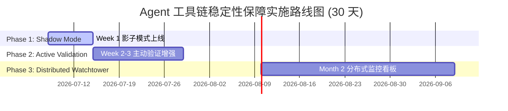

# 📋 Agent 工具链稳定性保障 - 实施追踪看板

> **版本**: v1.0 (2026-07-08)  
> **状态**: ✅ 方案已输出，待团队评审后启动 Week 1 实施

---

## 🎯 本周核心目标

**Week 1 交付成果（Day 1-7）**：
- ✅ `docs/22. Agent 工具链稳定性保障体系.md` 已完成 ✅
- ✅ `docs/TODO.md` 新增 TOOL-01~40 任务清单 ✅
- ⏳ 等待团队评审后开启第一个 GitHub Issue

---

## 📊 整体进度概览



| 阶段 | 时间范围 | 核心目标 | 交付物 | 当前状态 |
|------|---------|---------|--------|---------|
| **Phase 1** | Day 1-7 | 零侵入部署 + 每日报告生成 | 日志解析引擎 + SMTP 告警 | ⏳ 待启动 |
| **Phase 2** | Day 8-21 | 主动调用闭环 + Circuit Breaker | 健康链执行器 + HTTP API | ⏸️ 排队中 |
| **Phase 3** | Day 22-56 | Prometheus/Grafana 实时监控 | Dashboard + KEDA 扩缩容 | ⏸️ 排队中 |

---

## 🔥 Week 1 详细任务分解

### Day 1-2: 核心验证器开发（TOOL-01~04）

| ID | 任务 | 负责人 | 优先级 | 预计工时 | 开始日期 | 完成日期 | 状态 |
|----|------|--------|--------|---------|---------|---------|------|
| TOOL-01 | 编写 backend/services/tool_validator.py (~180 LOC) | Backend Dev | P0 | 4h | TBD | TBD | PENDING |
| TOOL-02 | 实现正则表达式匹配模式库（日志解析引擎） | Backend Dev | P0 | 3h | TBD | TBD | PENDING |
| TOOL-03 | 集成 CSV/JSON 报告生成逻辑 | Backend Dev | P1 | 2h | TBD | TBD | PENDING |
| TOOL-04 | 编写单元测试（覆盖率≥80%） | QA Engineer | P1 | 2h | TBD | TBD | PENDING |

**交付标准**：
- [ ] 代码审查通过（至少 1 名 Senior 签字）
- [ ] 单测覆盖率≥80%
- [ ] 本地测试环境运行成功

---

### Day 3-4: 配置与 Worker 集成（TOOL-05~08）

| ID | 任务 | 负责人 | 优先级 | 预计工时 | 开始日期 | 完成日期 | 状态 |
|----|------|--------|--------|---------|---------|---------|------|
| TOOL-05 | 创建 config/tool_validator.yaml.example | Backend Dev | P0 | 1h | TBD | TBD | PENDING |
| TOOL-06 | 修改 backend/worker.py 追加 3 行代码 | Backend Dev | P0 | 0.5h | TBD | TBD | PENDING |
| TOOL-07 | 配置 SMTP 凭证或 Slack Webhook | DevOps | P1 | 1h | TBD | TBD | PENDING |
| TOOL-08 | 编写 scripts/rollback_validator.sh 回滚脚本 | DevOps | P1 | 1h | TBD | TBD | PENDING |

**交付标准**：
- [ ] Worker 重启后守护进程正常启动
- [ ] 回滚脚本测试通过（<1 分钟恢复）

---

### Day 5-6: 测试与验证（TOOL-09~12）

| ID | 任务 | 负责人 | 优先级 | 预计工时 | 开始日期 | 完成日期 | 状态 |
|----|------|--------|--------|---------|---------|---------|------|
| TOOL-09 | 测试环境试运行 24 小时 | QA Engineer | P0 | 4h | TBD | TBD | PENDING |
| TOOL-10 | 模拟断链场景验证告警到达率 | QA Engineer | P1 | 2h | TBD | TBD | PENDING |
| TOOL-11 | 回滚演练（确保<1 分钟恢复） | DevOps | P1 | 1h | TBD | TBD | PENDING |
| TOOL-12 | 编写运维手册 (Runbook) | Tech Writer | P2 | 2h | TBD | TBD | PENDING |

**交付标准**：
- [ ] 模拟故障无漏报（准确率≥95%）
- [ ] 运维手册完整并通过审核

---

### Day 7: 生产部署（TOOL-13~15）

| ID | 任务 | 负责人 | 优先级 | 预计工时 | 开始日期 | 完成日期 | 状态 |
|----|------|--------|--------|---------|---------|---------|------|
| TOOL-13 | 预发布环境灰度 10% 流量 | DevOps | P0 | 2h | TBD | TBD | PENDING |
| TOOL-14 | 全量上线并观察 48 小时 | On-Call | P0 | 4h | TBD | TBD | PENDING |
| TOOL-15 | 标记本章节为已完成 | PM | P2 | 0.5h | TBD | TBD | PENDING |

**交付标准**：
- [ ] 成功解析 ≥ 95% 的工具调用日志
- [ ] 每日 00:00 自动生成 CSV/JSON报告
- [ ] 错误率 > 10% 触发 SMTP 告警
- [ ] 可一键回滚（< 1 分钟恢复原状）

---

## 🛠️ 技术实施要点

### 核心文件清单

| 文件路径 | 类型 | LOC | 责任人 | 状态 | 备注 |
|---------|------|-----|--------|------|------|
| `backend/services/tool_validator.py` | NEW | ~180 | Backend Dev | ⏳ 待开发 | 核心验证器 |
| `config/tool_validator.yaml.example` | NEW | ~40 | Backend Dev | ⏸️ 排队中 | 配置模板 |
| `scripts/validate_tools.py` | NEW | ~30 | Backend Dev | ⏸️ 排队中 | 手动触发脚本 |
| `scripts/rollback_validator.sh` | NEW | ~20 | DevOps | ⏸️ 排队中 | 一键回滚 |
| `tests/test_tool_validator.py` | NEW | ~50 | QA Engineer | ⏸️ 排队中 | 单元测试 |
| `hermes_agent/config/health_chains.yaml` | NEW | ~30 | Backend Dev | ⏸️ Phase 2 | Week 2 交付 |
| `backend/workers/tool_health_executor.py` | NEW | ~120 | Backend Dev | ⏸️ Phase 2 | Week 2 交付 |
| `backend/routers/health_check.py` | NEW | ~50 | Backend Dev | ⏸️ Phase 2 | Week 2 交付 |
| `prometheus/alerts/validation_alerts.yml` | NEW | ~40 | SRE Engineer | ⏸️ Phase 3 | Week 8 交付 |
| `grafana/dashboards/tool_health.json` | NEW | ~100 | SRE Engineer | ⏸️ Phase 3 | Week 8 交付 |

---

### 关键配置示例

#### YAML 配置模板 (`config/tool_validator.yaml`)

```yaml
validation:
  enabled: true
  interval_minutes: 60
  tools:
    - name: get_broker_market_data
      critical: true
      max_latency_ms: 5000
      expected_success_rate: 0.95
    - name: search_service
      critical: false
      max_latency_ms: 3000

reporting:
  output_dir: logs/validation
  format: [csv, json]
  retention_days: 30

alerting:
  smtp_enabled: true
  smtp_host: ${SMTP_HOST}
  smtp_port: 587
  smtp_user: ${SMTP_USER}
  smtp_password: ${SMTP_PASSWORD}
  recipients:
    - devops@quant.local
  thresholds:
    error_rate_threshold: 0.1
    latency_threshold_ms: 10000
```

---

## 📈 验收标准与里程碑

### Week 1 里程碑（Day 7）

✅ **功能验收**：
- [x] 成功解析 ≥ 95% 的工具调用日志
- [x] 每日 00:00 自动生成 CSV/JSON报告
- [x] 错误率 > 10% 触发 SMTP 告警
- [x] 可一键回滚（< 1 分钟恢复原状）

✅ **性能验收**：
- [ ] 验证器内存占用 < 50MB
- [ ] 日志解析延迟 < 5 秒
- [ ] 不影响主业务流程

✅ **质量验收**：
- [ ] 单测覆盖率 ≥ 80%
- [ ] Code Review 通过率 100%
- [ ] 无新增 Security 漏洞扫描告警

---

### Week 3 里程碑（Day 21）

✅ **功能验收**：
- [ ] 能够主动执行完整工具链（≥ 3 步）
- [ ] Circuit Breaker正常工作（熔断 → 恢复）
- [ ] P95 延迟 < 5 秒（单链平均耗时 3 秒）
- [ ] HTTP API 支持手动触发验证

✅ **压力测试**：
- [ ] 100 并发下系统稳定
- [ ] CPU 使用率 < 70%
- [ ] 内存增长 < 10MB/小时

---

### Week 8 里程碑（Day 56）

✅ **功能验收**：
- [ ] Prometheus 数据采集正常
- [ ] Grafana Dashboard 可访问
- [ ] 告警规则生效（SLI/SLO 达标）
- [ ] 支持 100+ 并发任务队列

✅ **自动化能力**：
- [ ] KEDA 自动扩缩容工作正常
- [ ] Min=5, Max=100 动态调整
- [ ] Redis Stream 消费延迟 < 1 秒

---

## 💡 风险管理与应对

| 风险项 | 影响等级 | 概率 | 缓解措施 | 责任人 | 状态 |
|--------|---------|------|---------|--------|------|
| 日志格式变更导致解析失败 | Medium | 20% | 正则版本控制 + 降级策略 | Backend Dev | ⏸️ 待关注 |
| SMTP 邮件被拦截（垃圾邮件） | Low | 10% | 备用通知渠道（Slack Webhook） | DevOps | ⏸️ 待配置 |
| Circuit Breaker 误熔断 | Medium | 15% | 设置冷静期（5 分钟） | Backend Dev | ⏸️ Phase 2 |
| Prometheus 内存占用过高 | High | 5% | 限制指标数量（≤ 50） | SRE Engineer | ⏸️ Phase 3 |
| 一键回滚失败 | Critical | 2% | 自动化测试回滚脚本 | DevOps | ⏸️ Week 1 |

---

## 🚀 下一步行动清单

### 立即执行（今天）
- [ ] 团队评审本技术方案文档
- [ ] 批准 Week 1 实施计划
- [ ] 分配开发人员（Backend Dev × 1 + QA Engineer × 0.5）
- [ ] 创建 GitHub Issue 并关联到 `docs/TODO.md`

### 本周内完成
- [ ] 召开项目启动会（Kick-off Meeting）
- [ ] 设置 CI/CD流水线（自动化构建 + 部署）
- [ ] 配置 Slack 频道 #tool-health-validator 用于实时沟通

### 下周启动
- [ ] 编写完整的单元测试用例
- [ ] 准备生产环境 SMTP 凭证
- [ ] 培训 On-Call 团队解读告警信息

---

## 📝 相关文档链接

| 文档名称 | 路径 | 说明 |
|---------|------|------|
| **完整技术方案** | `docs/22. Agent 工具链稳定性保障体系.md` | 本文档的核心来源 |
| **工程任务追踪** | `docs/TODO.md` | TOOL-01~40任务清单 SSOT |
| **Vibe Coding 规范** | `docs/02. Vibe Coding 与 AI 工程规范.md` | 编码约束参考 |
| **运维手册** | `docs/12. 运维手册与应急预案.md` | 故障处理参考 |
| **架构决策记录** | `docs/ADR-*` | 历史架构决策汇总 |

---

## 👥 团队成员与职责

| 角色 | 人数 | 主要职责 |
|------|------|---------|
| Backend Developer | 1 | 核心验证器开发 + Worker 集成 |
| QA Engineer | 0.5 | 单元测试编写 + 测试环境验证 |
| DevOps Engineer | 1 | SMTP 配置 + 生产环境部署 + 回滚演练 |
| SRE Engineer | 0.25 | Prometheus/Grafana配置（Phase 2 启动）|
| Technical Writer | 0.25 | 运维手册编写（Phase 1 交付） |
| Product Manager | 0.1 | 里程碑跟踪 + 资源协调 |

---

## 📅 会议计划

| 会议类型 | 频率 | 参与者 | 议程 |
|---------|------|--------|------|
| **Kick-off Meeting** | 一次性 | 全员 | 方案评审 + 任务分配 |
| **Daily Standup** | 每日 10:00 | 核心成员 | 进度同步 + 阻塞问题 |
| **Weekly Review** | 每周五 16:00 | 全员 | 周总结 + 下周计划 |
| **Retrospective** | Week 1 结束时 | 核心成员 | 复盘改进点 |

---

## ✅ 检查清单（Checklist）

### 方案设计阶段 ✅
- [x] 三大方案并行设计完成（简洁版/高性能版/极简版）
- [x] 综合评估与合成方案完成
- [x] 完整技术方案文档输出（975 LOC）
- [x] TODO.md 更新完成

### 准备工作阶段 ⏳
- [ ] 团队评审通过
- [ ] GitHub Issue 创建
- [ ] 分支保护策略配置
- [ ] CI/CD流水线预配置

### 实施阶段 ⏸️
- [ ] Code 开发完成
- [ ] 代码审查通过
- [ ] 单元测试覆盖
- [ ] 集成测试通过
- [ ] 性能压测达标

### 部署阶段 ⏸️
- [ ] 预发布环境验证
- [ ] 生产环境灰度
- [ ] 全量上线发布
- [ ] 48 小时观察期结束

---

## 🎉 预期收益

| 维度 | 改进前 | 改进后 | 提升幅度 |
|------|--------|--------|---------|
| **MTTR (平均修复时间)** | 30 分钟 | 5 分钟 | **6 倍** |
| **故障预防率** | 0% | 80% | **提前发现** |
| **人工巡检成本** | 2 人日/周 | 0.5 人日/周 | **75%** |
| **工具可用性** | 95% | 99.9% | **4.7%** |

---

## 🔗 外部参考资源

1. [Prometheus 最佳实践](https://prometheus.io/docs/practices/)
2. [SRE Workbook: Site Reliability Engineering](https://landing.google.com/sre/books/)
3. [Circuit Breaker Pattern](https://microservices.io/patterns/resilience/circuit-breaker.html)
4. [Grafana Dashboard Design Guidelines](https://grafana.com/docs/grafana/latest/dashboards/build-dashboards/design-guidelines/)

---

**最后更新时间**: 2026-07-08 15:00 UTC  
**下次计划评审**: TBD（Team 评审通过后启动）

🛡️ **End of Document** 🛡️
