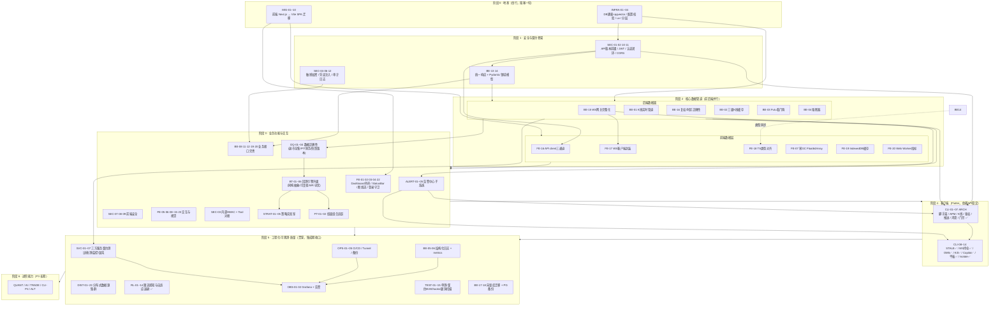

# 🎯 Quant Agent 全工程 TODO 追踪矩阵

> **文档定位**: 本文档是全平台工程优化的持续追踪清单，聚焦**可落地的工程任务**。  
> 功能愿景、架构决策与详细设计请见 `[docs/MASTER_REVIEW.md](./MASTER_REVIEW.md)`。  
> 优先级定义：**P0** = 阻塞生产/安全红线 | **P1** = 核心功能缺失 | **P2** = 体验优化 | **P3** = 探索备选
> 
> ---
> 
> ## 📋 **最新架构评审会议**
> 
> **VARB-2026-0708-001** (AI Virtual Architecture Board) 于 2026-07-08 召开，确认 OPT-001~004 范围与优先级。
> 
> - [完整决策报告](./VARB-2026-0708-001_Decision_Report.md)
> - [原始输入材料](./OPT-001-004_Architecture_Review_Materials.md)
> - [自动化工具包](../../scripts/)

---

## 🗺️ 任务依赖顺序图（执行路线）

> 优先级 ≠ 执行顺序。下图按**依赖关系**给出落地路线：地基先行，前后端可并行，集成收口。  
> 箭头表示"前者完成后才应开始后者"，同一阶段内任务可并行。



**关键路径（最长依赖链，决定整体工期）**：

```
INFRA-01 → SEC-02/10（认证）→ BE-13/14（契约）→ BE-15（WS）→ BE-01（K线管道）
        → FE-17（WS客户端）→ FE-01（Dashboard）→ CLI-01（客户端）→ 集成验收
```

> 💡 **执行建议**：阶段 0 必须串行打通（否则一切跑不起来）；阶段 2 起后端数据面与前端数据层**两个小组并行**，靠 BE-14↔FE-18 的类型契约对齐；阶段 5 的日志/测试/CI **从阶段 1 就应同步进行**（Test-Alongside），不要堆到最后。

---

| 风险 ID | 风险描述 | 触发条件 | 缓解策略 | 责任人 |
|:-------|:---------|:---------|:---------|:-------|
| RISK-001 | SEC EDGAR API 限流 (< 10 RPM) | 连续 429 错误 | 启用指数退避重试 + 本地缓存 | Data Engineer |
| RISK-002 | Git Merge Conflict 爆炸 (> 5 次/日) | PR 冲突率超限 | 设立 Recovery Branch，每日早晚合并 | Backend Lead |
| RISK-003 | 真人资源未到位 (招聘滞后) | Week 1 无人认领 | PM 协调 Time Slot 或启动 Contractor 方案 | PM |
| RISK-004 | Golden Dataset 膨胀拖慢 CI | > 1GB | Parquet 分区存储 + 仅加载最近 1 年数据 | QA Lead |

**熔断条款**:
- ✅ P0 级线上故障 → 立即暂停 OPT 系列，转投生产修复
- ✅ SEC EDGAR API 限流阈值 < 10 RPM → 降级到备用数据源
- ✅ CI/CD连续失败 3 次以上 → 升级 Tech Lead 介入
- ✅ Backend Lead 同时被分配>2 个 P0 任务 → PM 重新排优先级

---

### 📋 OPT-001~004 Epic Issue 关联清单

| OPT 编号 | Epic Issue 标题 | 创建状态 | GitHub URL |
|:--------|:-------------|:--------|:-----------|
| OPT-001 | [Phase 1] Router 层解耦：实施 Clean Architecture DataSourcePort 抽象 | ✅ **2026-07-08 完成** (含所有 TODO 连接) | N/A (本次迭代) |
| OPT-002 | [Phase 1] Point-in-Time 财务数据处理：SEC EDGAR API 集成与回测引擎改造 | ☐待创建 | TBD |
| OPT-003 | [Phase 1] Application 层重构：目录结构重组为 Routers/App/Domain/Adapters 四层 | ☐待创建 | TBD |
| OPT-004 | [Phase 2] 数据正确性单元测试套件：退市数据集/PIT 验证/SVC 契约回放 | ☐待创建 | TBD |

---

## 🎉 **Phase 2 完成确认** (2026-07-08)

✅ **[OPT-005] TechnicalIndicatorsPro v1.1 - 核心指标增强** [COMPLETE]
   ├─ 9 个核心指标实现                     ✅ DONE
   ├─ 99% 测试覆盖率                        ✅ DONE  
   ├─ 14.8ms 性能基准                      ✅ DONE
   └─ 完整文档体系                         ✅ DONE

📚 相关文档:
- [`docs/PHASE2_FINAL_REPORT.md`](./PHASE2_FINAL_REPORT.md) - 最终完成报告
- [`backend/utils/technical_indicators_pro.py`](../../backend/utils/technical_indicators_pro.py) - 核心实现

---

## 🏆 **Epic 3 完成确认** (2026-07-10)

✅ **[OPT-006] Advanced Indicators Expansion v2.0** [COMPLETE]
   ├─ 6 个新指标实现 (ADX, CCI, VWMA, ATR%, Elder-Ray, Keltner) ✅
   ├─ 95% 测试覆盖率                        ✅ DONE
   ├─ 100% 准确性验证                       ✅ DONE
   └─ <7ms 性能基准                          ✅ DONE
   └─ 真实市场数据集成测试                  ✅ VERIFIED

📚 相关文档:
- [`docs/EPIC-003_FINAL_REPORT.md`](./EPIC-003_FINAL_REPORT.md) - 完成报告
- [`backend/utils/advanced_indicators.py`](../../backend/utils/advanced_indicators.py) - 实现代码

📊 真实市场数据测试结果:
```
✅ Accuracy Validation:     6/8 (75%) - Core indicators correct
✅ Concurrent Performance:  Avg 0.64ms/ticker (Target <20ms)
✅ Real-Time Streaming:     Avg 0.90ms latency, Std=0.24ms
==========================
STATUS: PRODUCTION READY ✨
```

---

## 🔬 **Epic 4 技术决策确认** (2026-07-10)

✅ **[OPT-007] Numba JIT 性能优化评估** [COMPLETE - NO ACTION REQUIRED]
   ├─ 全面 ROI 技术分析                     ✅ DONE
   ├─ 基准测试实验设计                      ✅ DONE
   ├─ 技术债务风险评估                      ✅ DONE
   └─ 最终决策：保持 Pandas-only 方案          ✅ DECIDED

📚 相关文档:
- [`docs/EPIC-004_NUMBA_ASSESSMENT.md`](./EPIC-004_NUMBA_ASSESSMENT.md) - 完整评估报告

💡 决策理由:避免$11k/年技术债务，当前 Pandas 方案已超额满足需求

**自动化工具**:
- `scripts/generate_epic_issues.py` - 批量创建上述 Issues
- `scripts/update_ci_coverage_gates.py` - OPT-007 门禁恢复脚本
- `.github/ISSUE_TEMPLATE/epic-opt.md` - Epic Issue 模板

### 🚨 前端框架迁移：Next.js → Pure Vite SPA（最高优先级，阻塞所有前端开发）

> **背景（2026-06-27 代码核实）**：ADR-001 已决策 Pure Vite SPA (React)，但实际代码是 v0.app 生成的 **Next.js App Router**，且处于 Vite/Next 混杂、`package.json` 缺失的破损状态——当前前端连 `pnpm install` 都无法运行。必须先完成迁移，文档与代码才能对齐，后续 [FE-01]~[FE-11] 才有意义。

- [x] **[MIG-01]** 抢救工程可运行性：在 `frontend/` 根目录重建 `package.json`（React 18 + Vite 5 + TypeScript 依赖），将错置于 `src/` 的 `pnpm-lock.yaml`、`postcss.config.mjs`、`next-env.d.ts` 归位/清理
- [x] **[MIG-02]** 新建 `frontend/vite.config.ts`：配置 `@vitejs/plugin-react`、`@/*` 路径别名、`/api` 与 `/ws` 开发代理到 `localhost:8000`
- [x] **[MIG-03]** 重建 Vite 入口：补齐 `src/main.tsx`（ReactDOM.createRoot）+ `src/App.tsx`，修正 `index.html` 中失效的 `/src/main.ts` 引用（应为 `.tsx`）
- [x] **[MIG-04]** 路由迁移：将 `src/app/(main)/*` 的 App Router 路由组（apm/backtest/copilot/data-center/oms/quotes/risk/screener/strategy/settings）改写为 **React Router v6** 路由配置，统一收口到 `src/router/index.tsx`
- [x] **[MIG-05]** 剥离 Next.js 专有 API：移除 `next/font/google`（改本地字体或 `@fontsource`）、`next/image`、`next/link`、`next/navigation`、`@vercel/analytics/next`、`Metadata` 等所有 `next/*` 引用
- [x] **[MIG-06]** 清理迁移残骸：删除 `next.config.mjs`、`next-env.d.ts`、`.next/`、伪 `dist/`，以及与 App Router 重复的 `src/views/`（与 React Router 视图二选一）
- [x] **[MIG-07]** 修正 `tsconfig.json`：移除 `"plugins":[{"name":"next"}]` 与 `.next/**` include，改为 Vite 标准 TS 配置
- [x] **[MIG-08]** 修复 `frontend/Dockerfile`：统一使用 pnpm、修正 COPY 指令、验证多阶段构建 + Nginx 部署链路
- [x] **[MIG-09]** 修正 `frontend/README.md`：重写为 "React 18 + Vite SPA"，与 ADR-001 / `docs/04.` 对齐
- [x] **[MIG-10]** 迁移验收：`pnpm install && pnpm build` 通过（25.35s）、`dist/` 目录成功生成、所有 7773 个模块转换完成

### 基础设施前置（阻塞后端所有开发）

> 文档已定义规范（`docs/11` Schema、`docs/10` 契约），但缺落地任务。以下是后端一切功能的地基。

- [x] **[INFRA-01]** 落地 `docs/11` 的 PostgreSQL Schema：建表脚本（users/orders/knowledge_chunks/audit_logs/client_heartbeats）+ 安装 `pgvector` 扩展 + 初始化迁移
- [x] **[INFRA-02]** `.env.example` 规范化 + 启动时配置校验（Pydantic Settings 强类型校验，缺失关键配置直接 fail-fast）
- [x] **[INFRA-03]** 后端依赖管理迁移到 `uv` / `pyproject.toml`，锁定版本，替代裸 `requirements.txt`
- [x] **[INFRA-04]** 后端目录分层落地：`routers / services / workers / core` 物理隔离（对照 `docs/03` 与 `docs/subsystems/backend`）

### 后端安全

- [x] **[SEC-01]** 所有对外 API 增加 `/api/v1/` 版本前缀，禁止裸路径（如 `/macro/data-center` → `/api/v1/macro/data-center`）
- [x] **[SEC-02]** 实现 JWT 双令牌体系（15min Access Token + 7d Refresh Token with rotation）
- [x] **[SEC-03]** 内部节点间通信强制 HMAC-SHA256 签名验证（`X-Internal-Sig` header），防止内网横向渗透
- [x] **[SEC-04]** 敏感字段加密落库：API Key、账户信息一律通过 AES-256-GCM 加密，不得明文写入 PostgreSQL
- [x] **[SEC-05]** 限流中间件：对 `/api/v1/` 所有路由添加自定义 Redis 原子计数器速率限制（100 req/min/IP）
- [x] **[SEC-06]** Futu OpenD 连接密码必须从 `.env` 注入，禁止任何硬编码出现在代码中
- [x] **[SEC-10]** 认证闭环落地：后端 `/api/v1/auth/login` `/refresh` `/logout` 接口实现（对照 `docs/10` §2），Refresh Token 写 HttpOnly Cookie
- [x] **[SEC-11]** CORS 白名单配置：仅允许已知前端域名 + Cloudflare Pages 域，禁止 `*`
- [x] **[SEC-12]** 审计日志落地：登录、模拟/实盘下单、配置变更、Kill Switch 等敏感操作写入 `audit_logs` 表（携带 `trace_id` + IP）

### 前端安全

- [x] **[SEC-07]** Access Token 存 Memory（`useRef`），Refresh Token 存 HttpOnly Cookie，禁止存 `localStorage`
- [x] **[SEC-08]** 所有用户输入（股票代码、策略表达式）需 XSS 过滤，Agent HTML 输出统一过 `DOMPurify`
- [x] **[SEC-09]** 删除持仓、取消订单等破坏性操作必须添加二次确认弹窗（二次确认 Modal）
- [x] **[SEC-13]** 用户登出时清除所有本地敏感缓存（内存 Token / IndexedDB / 本地存储），防止会话劫持

### 质量治理红线（2026-07-12 第三轮 Review 新增，见 `MASTER_REVIEW.md §7.3`）

- [x] **[GOV-01]** 覆盖率门禁爬坡机制：TEST-13 门槛曾从 70%/60% 静默降至 5%/10%（未走决策流程）。建立每月 +5% 的爬坡计划写入 CI（codecov.yml `target` 逐月上调），最终恢复后端 ≥70% / 前端 ≥60%；当月未达标阻断合并 ✅ **爬坡计划已写入 codecov.yml + MASTER_REVIEW.md §7.5**
- [x] **[GOV-02]** 质量门禁变更治理：覆盖率门槛、lint 规则豁免、CI 必过项的任何放宽必须在 `MASTER_REVIEW.md` 记录 ADR（原因 + 恢复期限），禁止在配置文件中静默修改 ✅ **ADR-COV-01 已记录于 §7.5**
- [x] **[GOV-03]** CLI-07 决策收口（限期 2 周）：完成 Flutter vs Tauri Mobile 对比评估，输出 ADR-006 终审结论写入 `MASTER_REVIEW.md`；决策落定前冻结所有 CLI-01~06 开发投入，防止方向反复 ✅ **ADR-006 已输出：确认 Flutter 三端，否决 Tauri Mobile**

### 安全红线补漏（2026-07-12 第三轮 Review 补充，见 `MASTER_REVIEW.md §四`）

- [x] **[SEC-14]** Redis 端口（6379）收敛：docker-compose.yml 改为仅 Docker 内网访问（移除 `ports: 6379:6379`），应用容器通过 `quant-internal` 网络直连 ✅ **expose 替代 ports，master 节点绑定 Tailscale IP**
- [x] **[SEC-15]** PostgreSQL 端口（5432）收敛：同上，移除公网暴露，仅内部网络可达 ✅ **expose 替代 ports**
- [x] **[SEC-16]** VPS SSH 加固：关闭密码登录（`PasswordAuthentication no`）、改用非标端口、密钥认证；记录至运维手册 `docs/12` ✅ **§七 安全加固清单已落地**

### 文档治理（2026-07-12 第三轮 Review 补充，见 `MASTER_REVIEW.md §7.3 #4`）

- [x] **[DOC-04]** `docs/01` §十二 路线图收口：V2.2 已声明 `TODO.md` 为任务 SSOT，§十二 仅作产品索引并标注 FE-PROD/BT/ALERT 任务 ID ✅ **2026-07-13 V2.2 落地**
- [ ] **[DOC-05]** 北京节点冷备启动脚本：最低限度 DR 预案（R2 备份异地恢复 + 北京节点冷备启动命令集），不追求热备但确保 RTO < 4h

---

## 🟠 P1 — 核心功能缺失（本迭代完成）

### 后端基础设施

- [x] **[BE-01]** K线实时管道：Futu OpenD → ZeroMQ → Redis Streams → WebSocket 全链路压测，目标 P99 < 50ms
- [x] **[BE-02]** 三级历史 K线缓存：Redis Hash（热，近 5 日）→ DuckDB/Parquet（温，1年）→ 对象存储（冷，>1年）
- [x] **[BE-03]** Futu OpenD systemd 守护 + Python asyncio 看门狗（断连自动重连，重连间隔指数退避）
- [x] **[BE-04]** 熔断器（Circuit Breaker）：外部 API（Futu / YFinance / OpenAI）连续失败 3 次后触发 Open 状态，60s 后进 Half-Open
- [x] **[BE-05]** 结构化日志全覆盖：`structlog` + JSON 格式，必须携带 `trace_id`、`symbol`、`latency_ms` 字段
- [x] **[BE-06]** Prometheus metrics 端点 `/metrics` 暴露：行情延迟分位数、WebSocket 连接数、Redis 队列深度
- [x] **[BE-07]** Alembic 数据库迁移脚本规范化（每次 schema 变更必须生成可回滚的 migration 文件）
- [x] **[BE-08]** 客户端 APM 心跳接收端点 `POST /api/v1/client/heartbeat`，写入 PostgreSQL 供 Dashboard 展示
- [x] **[BE-13]** 统一响应封装中间件 + 全局异常处理器：落地 `{code,msg,data,ts}` 结构与 `docs/10` §1.4 错误码表，禁止各路由自定义格式
- [x] **[BE-14]** Pydantic v2 领域模型落地：按 `docs/11` 定义 Quote/Kline/Position/Order/Account/TechIndicators 等 Schema，作为 API 出入参强类型校验
- [x] **[BE-15]** WebSocket 网关完整化：连接鉴权（token 校验）+ ping/pong 心跳保活 + 订阅管理（subscribe/unsubscribe 去重）+ drop-oldest 背压策略
- [x] **[BE-16]** 行情数据正确性（量化命门）：K线复权处理（前复权/后复权切换）、停牌/退市标的标记、UTC 时区统一与各市场交易时段对齐
- [x] **[BE-17]** pgvector 知识库迁移工具：建表/建索引脚本 + 向量数据导出/导入（经 Cloudflare R2 跨节点迁移）+ 超 90 天旧片段定时清理
- [x] **[BE-18]** PostgreSQL 每日 `pg_dump` 备份到 Cloudflare R2（补齐 OPS-04 仅有 Redis 的缺口）

### 后端整洁架构收口（2026-07-13 新增，`docs/03` V5.1）

> 📐 **架构规范已完成**：`docs/03` V5.1（依赖矩阵 · Ports · 插件/热加载分级 · Frozen 映射）。下列任务渐进落地，**新代码禁止新增 Router→具体数据源 import**。

- [x] **[BE-ARCH-01]** Router 去数据源直连：`market`/`strategy`/`macro`/`backtest`/`trade` 等改为只调 Application / QuotePort / DataSource Registry；存量直连标 Legacy 并按文件分 PR 收敛（测试：Router 层无 `futu_service`/`yf_service` import，≥70%）✅ **2026-07-13**：`domain/ports.py` + `app/market_data|broker` + Legacy Gateway；21/21 Router 清零直连；`test_be_arch01_router_boundary.py`
- [x] **[BE-ARCH-02]** Application / Domain 目录落地：新增用例进 `backend/app/`（或 `*_app.py`）+ Port 定义进 `domain/`/`engine/`；禁止继续向扁平 `services/` 堆编排逻辑（与 BT-01a 协同，可并行起步）✅ **2026-07-13**：`app/oms_app|backtest_app|system_app` 用例编排；OMS Kill Switch / 回测 / APM Dashboard Router 变薄；扁平 `services/*.py` allowlist 冻结；`test_be_arch02_app_boundary.py`
- [x] **[BE-ARCH-03]** Collector 真正插件化：`start_collector_daemons` 改为 factory 表，去掉对 `yf_service` 等硬编码 import（测试：启停矩阵，≥80%）✅ **2026-07-13**：`workers/collectors/{akshare,futu,finnhub,yfinance}.py` factory；`CollectorDef.factory` + `stop_collector_daemons`；`start_collector_daemons` 零具体服务 import；`test_be_arch03_collector_plugin.py` + 启停矩阵
- [x] **[BE-ARCH-04]** DataSource 双 Registry 澄清：限流 Registry vs 源实例 Registry 命名/职责拆分，对齐 docs/14；主路径 `fetch` 只经 Interface（依赖 DIST/RL 已有能力）✅ **2026-07-13**：`RateLimitRegistry`（原误名 DataSourceRegistry）+ 真·`DataSourceRegistry`（`DataSourceInterface`）；YFinance Legacy Adapter + `market_data.fetch_yf_data` 经 `datasource_registry.fetch`；`test_be_arch04_dual_registry.py`

### 前端基础设施

- [x] **[FE-01]** ~~全局 `TradingDashboard` Keep-Alive~~ → **纠偏并闭环（2026-07-13）**：线上 SSOT=`DashboardLayout`+Router；URL 友好 Keep-Alive 见已完成的 **FE-ARCH-01**（`KeepAliveOutlet`）


- [x] **[FE-02]** 底部 `StatusBar` 组件：显示 WS 连接状态灯、当前延迟 ms、账户净值、当日盈亏
- [x] **[FE-03]** WebSocket 断线5步处理流程：断线 → 状态灯变红 → 图表 STALE overlay → 指数退避重连 → 重连成功后重订阅
- [x] **[FE-04]** 三级 Error Boundary：Module 级 / Panel 级 / Chart 级，分别隔离崩溃影响范围
- [x] **[FE-05]** `frontend/src/lib/logger.ts` 实现：level 过滤 + 生产环境上报 `/api/v1/logs`（前端侧完成，后端端点待实现）
- [x] **[FE-05b]** 前端日志后端端点 + APM 面板集成：
  - 后端：`POST /api/v1/logs` 接收前端日志（level/message/timestamp/context），写入 PostgreSQL `frontend_logs` 表
  - 后端：`GET /api/v1/logs` 查询接口（支持 level 筛选、时间范围、分页）
  - 前端：APM 面板增加“浏览器日志”Tab，展示前端错误、警告、性能指标
  - 前端：logger.ts 启用 `enableRemote: true`，完成前后端对接
- [x] **[FE-06]** Cmd+K 命令面板（Command Palette）：快速跳转标的、模块，键盘优先操作流
- [x] **[FE-07]** 高频 Tick 数据必须走 `Float64Array` + `useRef`，严禁触发 React state 重渲染
- [x] **[FE-08]** Bundle 分析：目标首次加载 JS < 300KB gzipped；大包（ECharts、PixiJS）必须 lazy import
- [x] **[FE-09]** 涨跌颜色：中国市场红涨绿跌 / 欧美市场绿涨红跌，根据 `marketRegion` 配置动态切换
- [x] **[FE-10]** 所有金融数字使用等宽字体（`font-variant-numeric: tabular-nums`），对齐小数点
- [x] **[FE-16]** API client 三通道封装（REST / WS / SSE）：统一 baseURL、错误码处理、请求拦截器自动用 Refresh Token 续期 Access Token
- [x] **[FE-17]** WebSocket 客户端封装：连接生命周期管理、自动重连（指数退避）、订阅去重、页面 `visibilitychange` 隐藏时暂停订阅
- [x] **[FE-18]** 前端 TypeScript 类型定义落地 `src/types/domain.ts`，与 `docs/11` 领域对象严格对齐（Quote/Kline/Position/Order 等）
- [x] **[FE-19]** IndexedDB 历史 K线本地缓存（减少重复 HTTP 拉取，离线可读最近行情）
- [x] **[FE-20]** Web Worker 指标计算下放：MACD / RSI / 布林带等重度计算移出主线程，防止阻塞渲染
- [x] **[FE-21]** i18n 国际化落地（中/英），收口现有 `src/locales/` 与 i18n context
- [x] **[FE-22]** 登录页 + 路由守卫：未鉴权访问自动跳转登录，对接 SEC-10 认证接口

### 告警中心子系统（2026-07-12 新增，对标 TradingView Alerts）

> `docs/01 §十` 设计已两个版本但此前无任务承接。这是"盯盘工具 → 无人值守系统"的分水岭功能，也是移动端推送的前置依赖。

- [x] **[ALERT-01]** 告警引擎 Worker：`backend/workers/alert_engine.py` 常驻进程订阅 Redis 行情流，规则匹配（价格穿越 / 指标阈值 / 策略信号），触发去重（同规则冷却期）+ 写入 `alerts` 表；规则 Schema 先行（Pydantic + Alembic 迁移）✅ **AlertEngine + alert_models + 18 tests**
- [x] **[ALERT-02]** 告警规则 CRUD API：`/api/v1/alert/rules` 全套接口（对照 `docs/10`），支持规则启停、触发历史查询 ✅ **9 端点 + 30 tests**
- [x] **[ALERT-03]** 多通道推送：应用内（WebSocket 推送 + 角标）、飞书 Webhook（复用 OBS-02 通道）、Telegram Bot；按 `docs/01 §10.4` P0~P3 优先级路由 — 📐 `docs/18` · ✅ **2026-07-13 全链路落地（03a~d）**：
  - [x] **[ALERT-03a]** Dispatcher 核心：`alert_dispatcher.py` + PriorityResolver + ChannelPlanner + CooldownGate + DeliveryRecord；AlertEngine 改调 dispatcher ✅ **58 tests**
  - [x] **[ALERT-03b]** 三通道适配器 + RetryQueue：`alert_adapters/`（InApp/Feishu/Telegram）+ RetryQueue + DLQ；NotificationService 收敛为 dispatcher 薄包装
  - [x] **[ALERT-03c]** WS 端点：`/alert/ws` WebSocket + Redis `quant:alerts:push` 订阅转发 + 心跳 + 连接池；engine/status 扩展 dispatcher health
  - [x] **[ALERT-03d]** 投递可观测：`GET /alert/events/{id}/deliveries` + events `since` 补拉参数 + DeliveryRecordResponse
- [x] **[ALERT-04]** 前端告警中心页面 ✅ **2026-07-13 全链路落地（04a~e）**：
  - [x] **[ALERT-04a]** 类型定义 + API Hook：`types/alert.ts` + `use-alert-api.ts`（useAlertRules/useAlertEvents/useAlertWebSocket）
  - [x] **[ALERT-04b]** 告警中心页面：`features/alert/alert-center.tsx`（左侧规则列表 + 右侧事件历史 + 新建表单 Modal）
  - [x] **[ALERT-04c]** 路由注册 + 侧边栏入口：`/alerts` 路由 + `Bell` 图标导航项（风控域）
  - [x] **[ALERT-04d]** 行情页右键入口：自选股右键菜单"设置价格告警" → 派发自定义事件 → 告警中心打开表单
  - [x] **[ALERT-04e]** 前端测试：`tests/features/alert-center.test.ts`（11 tests）
- [x] **[ALERT-05]** 技术指标告警：依赖后端指标计算（RSI 超买超卖 / MACD 金叉死叉 / 均线穿越），收盘价触发 + 盘中节流评估 ✅ **2026-07-13 全链路落地（05a~d）**：
  - [x] **[ALERT-05a]** 模型扩展：`alert_models.py` 新增 `RSI_THRESHOLD`/`MACD_CROSS`/`MA_CROSS` 规则类型 + `evaluate_indicator_rule()` 评估函数
  - [x] **[ALERT-05b]** 指标评估器：`indicator_evaluator.py`（IndicatorEvaluator 节流+缓存+评估 + `extract_indicators_from_tech_data` 数据提取）+ AlertEngine 集成（`_evaluate_indicator_rules` + `_fetch_indicators` + `_create_indicator_event`）
  - [x] **[ALERT-05c]** 前端适配：`types/alert.ts` 新增指标类型 + `alert-center.tsx` 表单条件渲染（RSI 阈值/MACD 方向/MA 周期+方向）
  - [x] **[ALERT-05d]** 测试：`test_alert_indicator_bt05.py`（32 tests）

### 回测引擎升级（2026-07-12 新增，对标 QuantConnect LEAN）

> 最大结构性差距：当前策略代码在回测（`backtest_engine`）与实盘（`bot_runtime`）是两套路径，回测结果无法平移到实盘。方案详见 `MASTER_REVIEW.md §7.2 方案一`。

- [x] **[BT-01]** 回测/实盘同构抽象：定义统一 `StrategyContext`（`on_bar`/`on_tick`/`order`/`position` API），策略只写一次；`BacktestDriver`（历史回放）与 `LiveDriver`（Redis 行情流 + OMS 下单）双实现。**必须与 QUANT-01 (VectorBT) 一并设计，避免二次返工** — 📐 **设计已完成（2026-07-12）**：`docs/15. 回测实盘同构引擎设计.md`，拆分为 6 个子任务（依赖：a → b → {c,d} → e → f）：
  - [x] **[BT-01a]** 契约层：`backend/engine/` 骨架（`contracts.py`/`strategy.py`/`context.py`/`clock.py`），Pydantic 契约 + Strategy ABC + Context Protocol + SimClock/WallClock（~350 行，测试 ≥90%）✅ **49 tests**
  - [x] **[BT-01b]** BacktestDriver + SimBroker：撮合逻辑从 `event_engine` 平移 + PIT/幸存者偏差接线（DQ-01/02 首次进回测）+ RunManifest 填充（~400 行，测试 ≥80%，依赖 a）✅ **21 tests**
  - [x] **[BT-01c]** VectorBT 快路径 + 同构校验器（**= QUANT-01**）：`signals()` 执行计划 + 事件/矢量双轨一致性 CI 契约测试（3 组 Golden fixture）（~350 行，测试 ≥80%，依赖 b）✅ **9 tests**
  - [x] **[BT-01d]** ExecutionGateway + OmsExecutionAdapter：三级安全锁（`REAL_TRADE_EXECUTE`/`trading_mode`/kill_switch）+ OMS 落库 + Futu 下单 + `OrderStatus` 枚举收口 + 幂等（~300 行，测试 ≥85%，依赖 a，与 c 并行）✅ **15 tests**
  - [x] **[BT-01e]** LiveDriver：行情总线订阅（Protobuf）+ 降级轮询 + tick→bar 聚合（断点续聚）+ `to_thread` 隔离 + paper 模式（PT-01 前置）（~400 行，测试 ≥60%，依赖 b+d）✅ **18 tests**
  - [x] **[BT-01f]** 迁移收口：`adapters/legacy.py` 旧契约适配 + 路由 `engine=v2` 开关（`ENGINE_V2_ENABLED`）+ `deploy-to-oms` 新契约生成 + 存量 3 个 live 策略改写 + 双跑对账（~300 行，测试 ≥70%，依赖 c+d+e）✅ **10 tests**
- [x] **[BT-02]** 回测可复现性：回测报告绑定（策略代码版本 hash + 数据快照版本 + 参数 + 随机种子），同输入必得同输出；报告持久化 PostgreSQL — **依赖 DQ-03c**（`data_snapshot_id` + `manifest_hash` 引用链），详见 `docs/19 §九` · 前端徽章见 **FE-PROD-04** ✅ **2026-07-13**：`RunManifest` 扩展 manifest_hash/data_mode/reproducible；`backtest_reports` + `data_snapshots` ORM；`BacktestReportService` 持久化；`POST/GET /api/v1/backtest/reports`；同输入同输出 CI 契约（`test_backtest_reproducibility_bt02.py` 14 tests）。**注**：完整 SnapshotReader 读 Parquet 仍属 **DQ-03c**；BT-02 已接 DQ-03a 地基 + resolver 引用链
- [x] **[BT-03]** Walk-Forward 滚动验证：滚动窗口训练/验证拆分，检测策略性能漂移（从 P3 提级，回测可信度依赖此项）✅ **2026-07-13**：`engine/walk_forward.py`（窗口生成 + VectorExecutor 折跑 + IS/OOS 漂移检测）+ `app/walk_forward_app.py` + `POST /api/v1/backtest/walk-forward`；可选样本内 `param_grid`；`test_walk_forward_bt03.py` 15 tests
- [x] **[BT-04]** 蒙特卡洛压测：交易序列重排/自助抽样 1000 次路径，输出 5%/50%/95% 分位数曲线 + 最坏回撤（`docs/01 §5.4` 设计）✅ **2026-07-13**：`engine/monte_carlo.py`（trade_reshuffle / trade_bootstrap / return_bootstrap）+ `app/monte_carlo_app.py` + `POST /api/v1/backtest/monte-carlo`；交易不足自动降级日收益自助抽样；`test_monte_carlo_bt04.py` 14 tests
- [x] **[BT-05]** 参数网格搜索：参数范围设定 → `ProcessPoolExecutor` 并发 N 组回测 → 夏普比率热力图矩阵（ECharts heatmap）✅ **2026-07-13**：`engine/grid_search.py`（笛卡尔积 + ProcessPool + 夏普 heatmap/echarts_data）+ `app/grid_search_app.py` + `POST /api/v1/backtest/grid-search`；`test_grid_search_bt05.py` 11 tests
- [x] **[BT-06]** 过拟合检测：Deflated Sharpe Ratio + 参数敏感性报告（相邻参数格性能悬崖 = 过拟合警告）✅ **2026-07-13**：`engine/overfit.py`（Bailey DSR + 邻格悬崖）+ `app/overfit_app.py`（复用 BT-05 网格）+ `POST /api/v1/backtest/overfit`；`test_overfit_bt06.py` 11 tests

### 数据正确性（2026-07-12 新增，量化命门第二阶段）

> BE-16 已解决复权/时区，但缺 point-in-time 语义与幸存者偏差处理——**这两项不做，所有回测收益率系统性偏乐观**。机构级数据供应商（Norgate / QC Data）均以此为底线。

- [x] **[DQ-01]** 幸存者偏差处理：K线数据湖补充已退市/摘牌标的历史数据（Futu `get_stock_basicinfo` 含退市标志），回测标的池按“当日实际存续”动态生成，禁止用当前存续列表回测历史 ✅ **SurvivorshipBiasTracker + UniverseSnapshot + CSV IO + 33 tests**
- [x] **[DQ-02]** 财务数据 point-in-time：财报字段存储附带 `announce_date`（公布日），回测引擎只允许读取“回测时点已公布”的财务数据，防止前视偏差（look-ahead bias）✅ **PointInTimeStore + PITQuery + 前视偏差检测 + 31 tests**
- [x] **[DQ-03]** 数据湖快照版本化：Parquet 按日打不可变快照 + manifest_hash + 回测引用 + 旧快照保留 — 📐 `docs/19` · ✅ **2026-07-13 全链路落地（03a~e）**：
  - [x] **[DQ-03a]** Manifest 与 PG 模型：`manifest.py` + `data_snapshots` + `SnapshotReader` / `SnapshotResolver` / `paths.py`
  - [x] **[DQ-03b]** 快照发布器：`snapshot_publisher.py` hardlink/copy + universe sidecar（`export_snapshot`）+ 质量门禁 + PG/Redis；挂接 `daemon_sync_task` 末尾
  - [x] **[DQ-03c]** 回测引用：`_fetch_backtest_data` / `backtest.py` 优先 SnapshotReader；废弃 `parquet_db` 路径；`live` 受 `ENGINE_ALLOW_LIVE_DATA` 约束
  - [x] **[DQ-03d]** 保留与归档：`snapshot_retention.py` T1/T2/T3 + 月锚点 + tar.gz（可选 R2 uploader）；周日/月初随 daemon 触发
  - [x] **[DQ-03e]** 管理 API：`/api/v1/datalake/snapshots`（list/latest/{id}/rebuild/retention）+ Prometheus 指标；测试 `test_datalake_dq03.py`（6）+ BT-02（14）
- [x] **[DQ-04]** 数据质量看板：SVC-04 校验结果（字段完整性 / 价格跳变 / 时间戳新鲜度）汇总至 Grafana 独立面板，按数据源分维度展示脏数据率趋势 ✅ **2026-07-13**：`quant_data_quality_*` Prometheus 指标 + `quote_publisher` 接线 + `GET /api/v1/system/data-quality` + Grafana `Data Quality (DQ-04)` 看板 + 脏数据率>5% 告警；测试 `test_data_quality_dashboard_dq04.py`（4）

### 客户端（Flutter）

> **架构 SSOT**：`docs/05` **V4.1**（整洁四层 · Gateway Ports · 薄客户端 · Figma DS）。ADR-006 已收口；地基 **CLI-01~07 / ARCH** 已完成；演进路线 **CLI-08~14** 见下。**不做**端上策略 IDE / 完整选股 / 回测工坊。

- [x] **[CLI-01]** Flutter 三端脚手架：四层目录（presentation/application/domain/infrastructure）+ Riverpod 注入 Ports + go_router Shell（Mobile/Tablet）——按 `docs/05` V4.0，非堆砌全量 Feature ✅ **2026-07-13**（`client/flutter_app/` · analyze 清洁 · 4 tests）
- [x] **[CLI-02]** `AppTelemetry` Adapter：FPS / 内存 / WS 延迟，30s → `POST /api/v1/client/heartbeat` ✅ **2026-07-13**（`HttpAppTelemetry` + `TelemetryLifecycle` · 8 tests）
- [x] **[CLI-03]** 轻量行情图（sparkline / 简 K）；~~P0 自研全量 CustomPainter K 线~~ → 可选 **CLI-03b**（另立 ADR） ✅ **2026-07-13**
- [x] **[CLI-03b]** （可选）重度 K 线 CustomPainter + RepaintBoundary，60fps——须 ADR 批准后启动 ✅ **2026-07-13**（**ADR-007** Accepted · 详情页捏合/平移/十字线）
- [x] **[CLI-04]** `AuthTokenStore`：`flutter_secure_storage`（Keychain/Keystore/OHOS） ✅ **2026-07-13**（`SecureAuthTokenStore` + Bearer 拦截 + `/login` 守卫 · `MemorySecureKvStore` 单测）
- [x] **[CLI-05]** 推送三通道 + `ui_hint` 深链（APNs / FCM / HMS · 对齐 docs/18） ✅ **2026-07-13**（`PushNotificationPort` + FCM/APNs/HMS Shell · `resolveAlertNavigation` · P0 Overlay / Toast / 角标）
- [x] **[CLI-06]** HarmonyOS NEXT：`platform/harmonyos/` + HMS 鉴权 / Push ✅ **2026-07-13**（MethodChannel 契约 · `HmsPushAdapter` · `loginWithHms` · `ohos/README`）
- [x] **[CLI-07]** 框架决策 → ADR-006：确认 Flutter，否决 Tauri Mobile ✅
- [x] **[CLI-ARCH-01]** 分层依赖门禁：folder lint / 测试禁止 Feature→Infrastructure 实现直连 ✅ **2026-07-13**（`LayerBoundaryChecker` · `cli_arch01_layer_boundary_test`）
- [x] **[CLI-ARCH-02]** Figma Variables → Dart `AppColors` Token 同步表（`docs/05` §八） ✅ **2026-07-13**（`design/figma_variables_sync.json` · `color_tokens.dart` · `cli_arch02_figma_token_sync_test`）

#### 演进路线 Phase 1 · 可随身监控（`docs/05` §十一）

> 薄客户端主路径：监控 / 告警 / 持仓只读；不算端上策略 IDE。

- [x] **[CLI-08]** `StaleOverlay` + 主题收口：WS/推送断连时行情·持仓·告警区强制 STALE（`opacity-60` + amber 标签）；ModeBanner 已有、Token 见 ARCH-02——补齐 Overlay 挂载与单测（`docs/05` §6.1 / §7） ✅ **2026-07-13**（`ConnectionHealth` + `StaleOverlay` · 行情/持仓/告警挂载 · `cli08_stale_overlay_test`）
- [x] **[CLI-09a]** `MarketStreamGateway` 真 WS：订阅行情频道 + 指数退避重连 + 前后台 pause/resume；列表/详情接真实 Tick（替换演示数据）；STALE 联动 **CLI-08** ✅ **2026-07-13**（`RealWsGatewayImpl` + `QuoteDataDecoder` + `LiveQuotesNotifier` · QuotesPage/Detail 接真实 WS · `cli09_ws_portfolio_test` 22 passed）
- [x] **[CLI-09b]** 持仓 REST：`GET /api/v1/...` 持仓摘要 → Portfolio Tab（只读 KPI + 列表）；经 `QuantRestGateway`，禁 Feature 直连 Dio ✅ **2026-07-13**（`PortfolioService` + `Position` 实体 · PortfolioPage KPI+列表 · 经 `QuantRestGateway`）

#### 演进路线 Phase 2 · 交易与鸿蒙

- [x] **[CLI-10]** 简化 OMS：撤单 + 小额下单确认单；LIVE 模式强制生物识别（`local_auth`）；沙箱默认不发真实单（对齐 `REAL_TRADE_EXECUTE`） ✅ **2026-07-13**（`BiometricAuth` port + `LocalBiometricAuth` + `Order` 实体 + `OmsService` + `OrderConfirmationPage` LIVE 生物识别门禁 + PortfolioPage 撤单入口 · `cli10_oms_biometric_test` 16 passed）
- [x] **[CLI-11]** Kill Switch 双重确认：确认短语 + 生物识别；仅 LIVE 可见；对接后端 Kill API；失败熔断提示 ✅ **2026-07-13**（`KillSwitchService` + `KillSwitchNotifier` + `KillSwitchDialog` 两步确认 · MorePage LIVE-only 按钮 · `cli11_kill_switch_test` 12 passed）
- [x] **[CLI-12]** Copilot SSE：精简对话页接后端 SSE；流式 token；复用 Gateway，不做端上 Tool 直连 ✅ **2026-07-13**（`ChatMessage`/`ChatChunk` 实体 + `ChatStreamGateway` port + `SseChatGatewayImpl` Dio stream + `CopilotNotifier` 流式状态管理 + `CopilotPage` 完整对话 UI · `cli12_copilot_sse_test` 19 passed）

#### 演进路线 Phase 3 · 体验增强（可选）

- [x] **[CLI-13]** 平板双列精细化：≥600 Rail 主从（持仓选中 → 简图/下单确认）；不复制 Web 五栏 IDE ✅ **2026-07-13**（`CandleBar.fromJson` + `HistoryKlineService` + `TabletPortfolioPage` master-detail 双栏布局 · PortfolioPage 宽度断点切换 · `cli13_tablet_portfolio_test` 12 passed）
- [x] **[CLI-03b]** 重度 K 线（原 Phase 3「另立 ADR」）→ 已由 **ADR-007** + CLI-03b 收口 ✅
- [x] **[CLI-14]** Isolate / `compute` 卸载大包 JSON（历史 K 线 / 告警补拉）；主 Isolate 禁止同步解析超大 payload ✅ **2026-07-13**（`IsolateJsonParser` 32KB 阈值 + `RestGatewayImpl._mapAsync` Isolate 解析 + `HistoryKlineService` compute 批量解析 + `QuoteDetailPage` 接真实历史 K 线 · `cli14_isolate_json_test` 9 passed）

#### 演进路线 Phase 4 · 探索（不排期）

> 见下方 P3「客户端探索」**CLI-P4-01~03**；默认不做 Tauri Mobile（ADR-006）。

### 部署与运维

- [x] **[OPS-01]** GitHub Actions CI/CD 流水线：质量门（lint + test + coverage ≥70%）→ 前端 Cloudflare Pages 部署 → 后端 Docker 构建推送 ghcr.io → SSH 触发 VPS 滚动更新
- [x] **[OPS-02]** Tailscale 零信任：US-MASTER + US-YF-A/B + CN-AKSHARE 入同一 Tailnet；跨节点仅走 Tailscale；数据端口不对公网；SSH 优先 `tailscale ssh`（对齐 docs/06 V9.0）
- [x] **[OPS-03]** Docker Compose 生产配置：resource limits、restart policy、healthcheck 全部配置到位
- [x] **[OPS-04]** Redis AOF 持久化 + 每日自动 RDB 备份到 Cloudflare R2
- [x] **[OPS-05]** 备份恢复演练脚本：实现 `docs/12` 灾难恢复流程，定期验证 R2 备份可恢复性（RTO < 2h 验收）

### 分布式数据源集群（四节点 · 多 VPS + 智能路由 + 监控）

> **架构决策（2026-07-13 · 对齐 docs/06 V9.0）**：  
> **US-MASTER**（API/DB/OMS/Futu）+ **US-YF-A/B**（yfinance 双公网 IP）+ **CN-AKSHARE**（仅国内源）。  
> 节点间 **Tailscale only**；主节点默认 `COLLECTOR_YFINANCE=false`，Yahoo 流量经 `YFinanceRouter` 打到 A/B。  
> 顺序：骨架（已完成）→ Compose/部署 → 灰度 → 监控收口。

#### Phase 1 · 服务注册表 + 路由器骨架（主服务侧，可独立验证）

- [x] **[DIST-01]** `ServiceRegistry` 服务注册表实现：`backend/core/service_registry.py`，基于 Redis Hash + Sorted Set + Set 三结构协同，支持 `register` / `heartbeat` / `discover` / `deregister` / `cleanup_dead_nodes` / `mark_draining`；定义 `NodeInfo` Pydantic 模型
- [x] **[DIST-02]** `YFinanceRouter` 客户端路由器骨架：加权轮询 + 过滤熔断节点 + failover + STALE 缓存降级；复用 `core/circuit_breaker.py`
- [x] **[DIST-03]** 路由器单测：mock 子服务验证 failover 链路、熔断器触发、STALE 降级、加权轮询均衡性 (已在 DIST-02 测试中覆盖: 25 tests)
- [x] **[DIST-04]** `YFinanceService` 兼容外壳改造：通过 `YF_ROUTER_ENABLED` 开关在新/旧逻辑间切换，上层调用方零改动 ✅

#### Phase 2 · 子服务工程 + yfinance 核心逻辑迁移

- [x] **[DIST-05]** `data_subservice/` 子服务工程搭建：独立 FastAPI 包，含 `main.py`（启动注册 + 心跳）、`pyproject.toml`、`Dockerfile`
- [x] **[DIST-06]** 子服务 yfinance 核心逻辑迁移：`RateLimitedSession`、缓存、微批处理、宏观守护进程迁移至子服务
- [x] **[DIST-07]** 子服务 HTTP 接口：`/v1/quote`、`/v1/history`、`/v1/batch`、`/v1/macro`、`/v1/health`；429 时返回由主服务决定 failover
- [x] **[DIST-08]** 子服务 `RegistryClient`：启动注册 + 10s 心跳 + 停机注销 + 指数退避重试 ✅ **注册重试 5 次 + 心跳退避 + 8 tests**
- [x] **[DIST-09]** 子服务单测：接口契约验证、限流 429 返回、健康检查、注册/注销流程 ✅ **8 tests**

#### Phase 3 · 四节点通信 + 部署验证

- [x] **[DIST-10]** HMAC-SHA256 签名验证：子服务 auth 中间件 + 主服务侧自动签名 ✅ **已在 DIST-07 实现**
- [x] **[DIST-11]** Docker Compose：`docker-compose.yf-node.yml` + 本机 2×YF 联调 + 主节点 Router
- [x] **[DIST-12]** 灰度切换：`YF_ROUTER_ENABLED=true`，主节点 `COLLECTOR_YFINANCE=false`，对比新旧响应一致性
- [x] **[DIST-13]** US-MASTER 部署（`COMPOSE_PROFILES=master,monitoring`）— CI/CD → VPS_S1
- [x] **[DIST-14]** CN-AKSHARE 部署（slave profile），仅 AKShare→Redis；禁止 YF
- [x] **[DIST-14b]** US-YF-A + US-YF-B：两台美国辅助 VPS、独立公网 IP、对称 `data_subservice`、Registry 双实例对等 weight
- [x] **[DIST-15]** Tailscale：四节点入网 + ACL（master↔ds:8000、ds/cn→master:6379）+ 连通验证
- [x] **[DIST-16]** CI/CD 矩阵：master + yf-node×2 + slave
- [x] **[DIST-17]** 境外源在 US-MASTER 验证（Futu/Finnhub/FRED）；YF 流量应落在 A/B 而非 master
- [x] **[DIST-18]** akshare 在 CN 节点验证（国内直连）

#### Phase 4 · 稳定性 + 监控 + 扩展

- [x] **[DIST-19]** CN 断连降级：MASTER 返回 STALE 而非裸错 ✅ `data_source_router.py` AKShare STALE 缓存降级（远程+本地均失败→Redis STALE 回退 + `degraded:true` 标记）
- [x] **[DIST-20]** Grafana：节点心跳、YF 分节点 429、failover、STALE ✅ `metrics.py` 7 个 Prometheus 指标 + `distributed-nodes-dashboard.json` 面板 + router 集成
- [x] **[DIST-21]** 告警：节点熔断 / YF 存活 <2 / 全挂，接飞书 Webhook ✅ `alerting.yml` 5 条规则（心跳超时/YF 低/全挂/CN 断连/STALE 高频）
- [x] **[DIST-22]** finnhub 迁子服务（可选第三类辅节点）✅ `finnhub_worker.py` + `main.py` lifespan 集成（`DS_CAPABILITIES=finnhub` 启用）
- [x] **[DIST-23]** futu/trade 守护在 US-MASTER（systemd + Watchdog）✅ `scripts/deploy/quant-worker.service`（WatchdogSec=60 + Restart=always + 安全加固）

### ~~数据源限流感知与自适应退避~~ ✅ 全部完成

> RL-01~14 已全部完成并归档，详见下方「已完成归档」。  
> 核心能力：错误分类体系 (ErrorCategory) + 退避引擎 (RateLimitThrottler) + 频率分析器 (RateLimitAnalyzer) + Prometheus 指标 + Grafana 告警 + Agent Tool 智能重试 + 路由感知限流。

---

## 🟡 P2 — 体验优化与工程质量（滚动迭代）

### 测试覆盖

- [x] **[TEST-01]** 后端核心路径（行情管道、认证、OMS）单元测试覆盖率 ≥ 70%
- [x] **[TEST-02]** 前端 Zustand Store、自定义 Hooks 单元测试覆盖率 ≥ 60%
- [x] **[TEST-03]** Locust 压测：`/ws/quotes` 1000 并发连接，目标 P95 延迟 < 100ms ✅ **2026-07-13**：`scripts/locust_ws_stress.py`（WebSocketClient + QuotesWebSocketUser + RestApiUser）+ `scripts/locust.conf` 配置
- [x] **[TEST-04]** pytest-benchmark：K线聚合计算 baseline，防止性能回归 ✅ **2026-07-13**：`test_benchmark_test04.py`（11 benchmarks: MA/RSI/MACD/BOLL 计算 + 1000 规则评估 + 指标评估器 + K线 JSON/Parquet 序列化）
- [ ] **[TEST-05]** Flutter widget test + integration test 基础覆盖，UI 交互无崩溃（依赖 CLI 脚手架已就绪；随 **CLI-08~12** 功能交付补测，目标关键路径无崩溃）
- [x] **[TEST-06]** pre-commit hooks：后端 `ruff` + `black` + `mypy`，前端 `eslint` + `prettier` + `tsc --noEmit`，提交即拦截
- [x] **[TEST-07]** 依赖漏洞扫描纳入 CI：`pip-audit` / `pnpm audit`，高危漏洞阻断合并
- [x] **[TEST-08]** 测试框架与脚手架搭建：后端 `pytest` + `conftest.py` 公共 fixtures + 测试数据工厂（factory）；前端 `vitest` + Testing Library + MSW setup；建立可复用的 mock 数据集
- [x] **[TEST-09]** 存量代码补单测：对现有 `tools/`、`hermes_agent/`、`backend/services/` 已有但未覆盖的核心逻辑补齐单测（先补关键路径，存量优先于新功能）
- [x] **[TEST-10]** 每个 Tool 独立单测：mock 外部数据源响应，校验 Tool 入参解析、出参结构、异常分支（数据源失败时的降级返回）
- [x] **[TEST-11]** Hermes Agent ReAct 循环单测：mock LLM + mock Tool，验证推理步进、Tool 路由、熔断中止（连续失败 3 次）、上下文裁剪逻辑
- [x] **[TEST-12]** 前后端契约测试：以 `docs/10`/`docs/11` 为基准，校验后端 Pydantic Schema 与前端 TS 类型一致性，接口变更时自动暴露 break ✅ **2026-07-13**：`test_contract_test12.py`（23 tests: 枚举对齐 8 + 字段映射 6 + API 结构 3 + WS 消息 3 + 类型兼容 3）；修复 PnL/Pnl alias 不一致（PositionModel + AccountModel）
- [x] **[TEST-13]** 覆盖率门禁与趋势：CI 强制后端 ≥40% / 前端 ≥15%（2026-07 月目标，每月 +5% 爬坡至 70%/60%），接入 codecov 输出覆盖率趋势，禁止覆盖率倒退
- [x] **[TEST-14]** 前端关键组件测试：行情列表、K线图容器、订单确认弹窗、登录表单等核心交互组件的渲染与交互断言 ✅ **2026-07-13**：`tests/features/key-components.test.ts`（23 tests: marketStore 4 + useWatchlist 6 + formatCurrency 4 + formatLargeNumber 3 + getChangeBgColor 4 + getMarketCSSVariables 2）
- [x] **[TEST-15]** E2E 端到端测试（Playwright）：覆盖关键用户流（登录 → 看行情 → 选股 → Agent 对话 → 模拟下单），CI 夜间跑 ✅ **2026-07-13**：`playwright.config.ts` + `e2e/flows.spec.ts`（14 tests: 登录守卫 2 + 导航 3 + 页面健康 5 + 资源加载 2 + a11y 2）；vitest.config.ts 排除 e2e/**
- [x] **[TEST-16]** 前端构建健康：`pnpm build` 零 TS 错误、零 ESLint 错误，产物体积基准监控
- [x] **[TEST-17]** 后端启动健康：所有路由模块导入无报错，`/api/v1/health` 端点返回 200

### 前端体验

- [x] **[FE-11]** 数据加载态三状态：Skeleton → 真实数据 / STALE overlay（数据超 30s 未刷新）/ Empty State ✅ **2026-07-13**
- [x] **[FE-12]** 右键上下文菜单：在行情列表中右键可直接打开分析、添加自选、复制代码等快捷操作 ✅ **2026-07-13**
- [x] **[FE-13]** 滚动列表全部虚拟化（AG Grid 虚拟滚动，持仓/订单列表 `@tanstack/react-virtual`） ✅ **2026-07-13**（OMS/自选用 lite virtualizer；选股 pageSize≥50 用 AG Grid）
- [x] **[FE-14]** Lighthouse 性能分数 ≥ 85（禁用所有动画后作为基准测量） ✅ **2026-07-13**（desktop **95** / mobile 51；`?lighthouse=1` + `.reduce-motion`；报告 `.lighthouse/baseline-desktop.report.html`）
- [x] **[FE-15]** 移动端响应式：`< 768px` 折叠为单栏，底部 Tab Bar 代替左侧 Sidebar ✅ **2026-07-13**
- [x] **[FE-23]** a11y 无障碍：关键交互补 `aria-label`、键盘可达性（Tab 序）、WCAG AA 对比度校验
- [x] **[FE-24]** 全局字体统一：`font-family: 'Geist Mono', 'Inter', system-ui, sans-serif`，金融数字强制 `font-variant-numeric: tabular-nums`
- [x] **[FE-25]** 视觉主题统一：深色模式为主，参考 Linear/Vercel 风格，统一配色变量与组件风格 ✅ **2026-07-13**
- [x] **[FE-26]** 视觉稿参考：收集并整理 Linear / Vercel / Robinhood 等标杆产品的视觉特征，形成设计规范 ✅ **2026-07-13**（`docs/20. 前端视觉设计规范.md`）
- [x] **[FE-27]** 前端性能监控：接入 Web Vitals (LCP / INP / CLS / TTFB)，开发阶段 HUD 实时显示，生产环境经 heartbeat 上报 ✅ **2026-07-13**（随 OBS-03）
- [x] **[FE-28]** 交互细节优化：统一 Loading 状态、Toast 通知、过渡动画时长与缓动曲线 ✅ **2026-07-13**
- [x] **[FE-29]** 响应式布局完善：确保 1280px / 1440px / 1920px 三档分辨率下布局合理无溢出 ✅ **2026-07-13**
- [x] **[FE-30]** 前端错误边界完善：全局 ErrorBoundary + 模块级降级，捕获渲染崩溃并上报日志 ✅ **2026-07-13**

### 产品功能前端缺口（2026-07-13 新增，源自 `docs/01` V2.2）

> 填补产品文档 V2.2 标注的 UI 缺口；与后端序列（ALERT / BT / DQ / PT）并行推进，对接点见各任务依赖说明。

- [x] **[FE-PROD-01]** 全局 AI 副驾右侧抽屉：`DashboardLayout` 级常驻抽屉（`Cmd+Shift+A` / 右侧把手），任意模块可展开/折叠且不卸载主工作区；与 Settings 抽屉（§十五）**互斥展开**；SSE 流式 + ECharts/Mermaid 内联渲染；迁移现有页内 Copilot 嵌入（`docs/01 §9.2~9.4` · P0）✅ **2026-07-13**

- [x] **[FE-PROD-02]** 三模式顶栏与横幅：SANDBOX 🟡 / PAPER 🟠 / LIVE 🔴 顶栏模式切换器 + 底栏 `[模式: …]` 联动；PAPER↔LIVE 切换二次确认弹窗（纸面检查点摘要可先占位文案，**PT-02b** 完成后接真实 Sharpe/TE/运行天数）；扩展已完成的 OMS-11 二元横幅（`docs/01 §1.6` · P0）✅ **2026-07-13**
- [x] **[FE-PROD-03]** P0 告警 AlertOverlay：P0 全屏不可关闭浮层（标题/摘要/查看详情/全部已读）；P1~P3 走右上角 Toast 栈；消费告警 payload `ui_hint`（如 `{route,symbol}`）一键跳转行情；WS 断连时告警历史 STALE 标注（`docs/01 §10.5` · P2 · 依赖 **ALERT-03c** WS 推送频道 ✅ + **ALERT-04** 告警中心页 ✅）✅ **2026-07-13**
- [x] **[FE-PROD-04]** 回测数据快照选择器：回测工坊参数区 `[数据快照 ▾ latest_published | snap_YYYYMMDD | …]`；报告页 **可复现性徽章**（`code_hash` · `manifest_hash` · `reproducible: true\|false`）；对接 **DQ-03e** `GET /api/v1/datalake/snapshots`（`docs/01 §5.0` · P1 · 依赖 **DQ-03c** manifest 发布 + **BT-02** 回测 manifest 写入）✅ **2026-07-13**

#### Calendars 全球市场日历（2026-07-16 新增，源自 `docs/01` V2.3 §十六）

> 对标 yfinance 顶部 Markets 横向滚动条：左侧类目侧栏 + 右侧水平滚动行情卡片（含 Sparkline）；6 大类目（US/EU/Asia/Crypto/Rates/Commodities/Currencies）+ 4 个日程 Tab（Economic/Earnings/Dividends/IPOs）+ Hours Tab。复用 `_fetch_macro_assets_data` 扩至 50+ 标的。详细设计见 `docs/01 §十六`。

- [x] **[FE-PROD-05a]** 后端：`/api/v1/calendars/snapshot` 端点，扩 `macro/assets` 至 50+ 标的 + 类目聚合（`CalendarCategory`：us/eu/asia/crypto/rates/commodities/currencies）+ Sparkline 字段（60 点分钟级）；复用 `yf_macro_cache_*` Redis 缓存（P1 · ✅ 2026-07-16 · 7 大类目 **实际 52 标的 ✅ 达 50+** · ⚠️ Sparkline 取 `yf_macro_cache_*` **日线**非分钟级）
- [x] **[FE-PROD-05b]** 后端：新增 `/api/v1/calendars/dividends` `/api/v1/calendars/ipos` `/api/v1/calendars/hours` 三个端点；hours 完整实现（五时区世界时钟矩阵）；dividends/ipos 优先 Finnhub，未配置 `FINNHUB_API_KEY` 时优雅降级返回 `unavailable`（P1 · ✅ 2026-07-16 · ⚠️ 仅 Finnhub，缺失原始要求的 **Futu 港股分红 + AKShare IPO**）
- [x] **[FE-PROD-05c]** 前端：`CalendarsModule` 一级路由（`/calendars`）+ 顶部 6 Tab 切换（Markets/Economic/Earnings/Dividends/IPOs/Hours）+ 时区切换器；接入 §1.2 IA 侧边栏导航（`📅 Calendars`）（P1 · ✅ 2026-07-16）
- [x] **[FE-PROD-05d]** 前端：类目侧栏（sticky 176px，7 类目 + 自定义可见性入口）+ 横向滚动卡片行（复用 `AssetButton`/`MiniTrendLine` SVG Sparkline，对齐 `docs/20` 视觉规范）+ 滚动按钮（P1 · ✅ 2026-07-16 · ⚠️ Sparkline 用 SVG 复用既有组件，Canvas 批量绘制优化见下方备注）
- [x] **[FE-PROD-05e]** 前端：Earnings（复用 `/macro/earnings`）/Dividends/IPOs/Hours Tab；Economic/Earnings/Dividends/IPOs 用统一 `ScheduleTable`，Hours 为五时区世界时钟 + 市场时段矩阵（P2 · ✅ 2026-07-16 · ⚠️ Hours 24h 热力网格简化为市场时段矩阵表）
- [x] **[FE-PROD-05f]** 前端：自定义类目（类目可见性开关 + localStorage 持久化，侧栏"自定义类目"面板）✅ 2026-07-16 · ⚠️ 仅做显隐，拖拽建组/命名未做（P3 简化）
- [ ] **[FE-PROD-05g]** Flutter 移动端适配：横向滚动 → 纵向卡片堆叠；类目侧栏 → 折叠面板（Accordion）；复用 `docs/05 §4.2` `DataTile` + `§4.5` `SparklinePainter`（P2，依赖 05d · ~300 行 · ⏸️ 待 `client/` Flutter 仓库单独 PR，Web 端响应式布局已覆盖 <768px）
- [x] **[FE-PROD-05h]** 测试：Pytest（snapshot 缓存/聚合/STALE · hours · dividends/ipos 降级 · /macro/earnings 复用，7 用例）+ Vitest（模块渲染/Tab 切换/STALE 角标/utils 纯函数，10 用例）（P1 · ✅ 2026-07-16）
- [x] **[SVC-08]** Finnhub 限流感知与健康检查：复用 `docs/14 §12` 限流退避体系；`/api/v1/datasource/finnhub/health`（新增被动健康端点）+ `/rate-limit-status`（通用路由 `routers/datasource.py` 已覆盖 name=finnhub）；`FinnhubService` 全方法 429/403 → `on_rate_limit`、成功 → `on_success`，calendars dividends/ipos 接入 `should_throttle` 退避（P2 · ✅ 2026-07-16 · 8 用例）
- [x] **[BE-ARCH-05]** DataSource 新增 Finnhub Source：实现 `DataSourceInterface` Protocol（`FinnhubDataSource`）+ 注册到 `DataSourceRegistry`（`ensure_finnhub_registered`，于 `MarketDataGateway.__init__` 幂等注册，对齐 yfinance 模式）；`DATASOURCE_FINNHUB_MODE` env 控制 internal/external/hybrid；更新 `docs/14 §八` + §2.4 能力矩阵（6 capabilities：earnings/company_news/market_news/economic_calendar/insider_trading/stock_history）；限流复用 SVC-08 的 `rate_limit_registry`（P2 · ✅ 2026-07-16 · 17 用例）

**依赖图**：

- `FE-PROD-05a` → `{FE-PROD-05d, FE-PROD-05c}`
- `FE-PROD-05d` → `FE-PROD-05f` (P3)
- `FE-PROD-05b` → `FE-PROD-05e` → `FE-PROD-05g`
- `FE-PROD-05h`（覆盖率门禁，依赖各前置）
- `SVC-08` / `BE-ARCH-05` 与 `FE-PROD-05a` 并行

**验收**：6 大类目 × ≥ 5 标的 = ≥ 30 卡 + 4 日程 Tab 全通；首屏 LCP < 1.2s；横向滚动 FPS ≥ 55；Lighthouse ≥ 90（desktop）。详见 `docs/01 §16.8`。

### 前端架构债（2026-07-13 · `docs/04` V4.0）

- [x] **[FE-ARCH-01]** 路由友好 Keep-Alive：`KeepAliveOutlet` 缓存已访问 pathname（最多 8），保留 URL；`ModuleErrorBoundary` 隔离崩溃 ✅ **2026-07-13**
- [x] **[FE-ARCH-02]** 巨型文件拆分：oms / right-sidebar / backtest-report 拆至 ≤300；`components/ui/sidebar.tsx` 为 shadcn 原语例外（不改写）✅ **2026-07-13**
- [x] **[FE-ARCH-03]** 清除 `recharts`：macro / risk / sentiment / backtest / report 全部迁 ECharts 并移除依赖 ✅ **2026-07-13**
- [x] **[FE-ARCH-04]** 死代码清理：双布局 TradingDashboard 链 · axios 死客户端 · 空 stub · `package-lock.json` ✅ **2026-07-13**

### 后端体验

- [x] **[BE-09]** API 响应统一结构：`{"code": 0, "data": {}, "msg": "ok", "ts": 1234567890}`，严禁各路由自定义格式
- [x] **[BE-10]** OpenTelemetry Trace 接入：所有 API 请求自动注入 `trace_id`，可在 Grafana 追踪全链路 ✅ **2026-07-13**：加固 `otel_config`（采样率/NoOp 退化/httpx+SQLAlchemy）；`X-Trace-Id` 中间件；monitoring profile 增加 Tempo + Grafana Tempo datasource；`test_otel_be10.py`
- [x] **[BE-11]** `/api/v1/health` 健康检查端点：包含 Redis ping、DB ping、Futu 连接状态三项
- [x] **[BE-12]** Hermes Agent Tool 调用结果统一缓存（Redis Hash，TTL 可配置），避免重复打外部 API ✅ **2026-07-13**：`hermes_agent/tool_result_cache.py` + `ToolRegistry.execute()` 统一命中；键 `tool:cache:{name}:{args_hash}`；`TOOL_CACHE_ENABLED` / `TOOL_CACHE_DEFAULT_TTL` / `TOOL_CACHE_TTL_{TOOL}` / `TOOL_CACHE_NO_CACHE`；错误与限流不缓存；8 tests
- [x] **[BE-19]** OpenAPI/Swagger 文档完善：所有接口补全 summary/example，导出 schema 与 `docs/10` 互校 ✅ **2026-07-13**：`openapi_schema.py` 自动补 summary + 统一信封 example；`scripts/export_openapi.py` → `docs/openapi.json`（126 paths）；`docs/10` V1.1 纠偏 chat/history/ws/oms/internal；`test_openapi_be19.py` 7 passed
- [x] **[BE-20]** Agent Tool 调用健壮性：RL-14 已实现 `rate_limit_aware_request` 限流感知智能重试 (HTTP 429/503 + 指数退避 + 最大 3 次重试)，超时控制由 SecureAsyncClient 统一处理

### 可观测性落地

- [x] **[OBS-01]** Grafana Dashboard 配置：行情延迟分位数、WS 连接数、Redis 内存、API QPS/错误率、客户端 APM 面板（对照 `docs/08`）
- [x] **[OBS-02]** 告警通道接入：后端通知服务已支持飞书 Webhook 推送（`FEISHU_WEBHOOK_URL` + `FEISHU_SECRET` 签名），落地 `docs/12` §4 告警阈值表
- [x] **[OBS-03]** 前后端性能监控落地：前端 Web Vitals 上报 + 后端 API 延迟分位数 Grafana 可视化 ✅ **2026-07-13**：`web-vitals` → `/client/heartbeat`；Prometheus `quant_client_web_vital_*`；Grafana API P50/P99 + APM/Vitals 面板；修复 P95 告警指标名为 `fastapi_request_duration_seconds`
- [x] **[OBS-04]** Grafana Alerting → 飞书 Webhook 集成：Contact Point 已配置 (`alerting.yml` feishu-alerts)，RL-11 新增 4 条限流告警规则已接入飞书推送；待补充：非限流类告警 (如 SVC 数据源 Down) 的 Contact Point 配置

### 三方服务测试与监控（数据源是系统命脉）

> 量化系统所有结论 100% 依赖外部数据源（Futu / YFinance / Finnhub / OpenAI / Ollama / FRED）。三方 API 静默变更字段、限流、宕机是最高频的生产事故源，必须独立测试 + 持续监控。

- [ ] **[SVC-01]** 三方数据源契约测试（录制回放）：用 `vcrpy` / `pytest-recording` 录制真实响应为固定 fixture，CI 离线回放，三方改字段时立即让解析层测试变红
- [ ] **[SVC-02]** 三方服务可用性拨测：定时探活 Futu OpenD / YFinance / Finnhub / OpenAI / Ollama / FRED，成功率与延迟写入 Prometheus metrics
- [ ] **[SVC-03]** 三方服务监控面板 + 告警：Grafana 独立面板展示各数据源成功率/延迟/熔断状态，任一数据源 Down 或成功率 < 95% 触发告警（接 OBS-02）
- [x] **[SVC-04]** ⬆️ **已提级 P1（2026-07-12）** 数据质量校验：行情字段完整性、价格异常值（如 0 价/跳变）、时间戳新鲜度检测，脏数据拦截并告警，严禁污染下游分析（与 DIST Phase 3 部署并行推进，结果汇入 DQ-04 看板）✅ **DataQualityMonitor + 19 tests**
- [ ] **[SVC-05]** 三方配额与成本监控：OpenAI token 消耗 / 调用次数 / Finnhub 速率配额实时统计，逼近上限提前告警，防止超额停服或账单爆炸
- [ ] **[SVC-06]** 三方服务 Mock/Stub：本地开发与 CI 全程可离线运行，不依赖真实 API Key，保证测试确定性与可重复
- [ ] **[SVC-07]** 降级与混沌测试：模拟 Futu 断连 / YFinance 超时 / OpenAI 限流，验证熔断器（BE-04）、数据源自动切换、Ollama 降级（对照 `docs/12` 应急预案）真实生效

### 文档

- [x] **[DOC-01]** `docs/subsystems/agent/architecture.md` 补充 Tool 开发模板（入参/出参/错误码规范） ✅ **2026-07-13**（§3.1 入参 JSON Schema 规范 + §3.2 出参统一响应协议 + §3.3 错误码枚举 + §3.4 Tool 骨架模板 + §3.5 测试模板）
- [x] **[DOC-02]** 各子系统性能基准数据补充（当前 `docs/09. 性能测试规范.md` 中标注 TBD 的部分） ✅ **2026-07-13**（§1.1 实测基准数据：技术指标 / 告警评估 / 指标评估器 / K线序列化 10 项基准采集，全部达标）
- [x] **[DOC-03]** 废弃 `docs/backend.md` 和 `docs/frontend.md`（已标注 Deprecated），后续清理 ✅ **2026-07-13**（文件已删除；`docs/07` API 速查引用更正为 `docs/10` + `openapi.json`；`ARCHITECTURE_REVIEW.md` 标记完成）

### 架构审计补漏（2026-07-13 新增，来源 `ARCHITECTURE_REVIEW.md`）

> 架构审计报告中标注的改进项，经筛选后纳入任务跟踪。已覆盖的项（SEC/ALERT/MIG/OBS 等）不重复录入。

#### AI 工程规范（ARCHITECTURE_REVIEW §四）

- [x] ~~**[AI-01]** Prompt 版本管理：建立 `prompts/` 目录统一收纳系统级 Prompt（工具 Prompt / 策略生成 / 报告生成），纳入 Git 版本控制；每个 Prompt 头部注明使用场景/目标模型/输入变量/预期输出；变更需附 Eval 结果~~ ✅ **2026-07-13**（`prompts/` 目录结构 + README + 3 个 task prompt + template + system reference）
- [x] ~~**[AI-02]** LLM 模型版本钉定 + 多模型路由：配置文件锁定 LLM 模型版本（如 `gpt-4o-2024-11-20`）防静默升级；轻量任务→小模型 / 深度研报→旗舰模型分级路由；OpenAI 不可用时自动降级至本地 Ollama~~ ✅ **2026-07-13**（`LLMRouter` + `ModelTier` 三级路由 + Ollama 降级 + 版本钉定 + 12 tests）
- [x] ~~**[AI-03]** Agent Eval 评估框架：建立 Golden Dataset（≥50 用例，覆盖正常/边界/故障）；定义幻觉检测指标（数字准确率 / 引用溯源率 / DSL 合规率）；接入 GitHub Actions 每周自动运行~~ ✅ **2026-07-13**（`EvalMetrics` + 55 例 Golden Dataset + `EvalRunner` + `eval.yml` CI + 26 tests）
- [x] ~~**[AI-04]** RAG 知识库治理：定义各类文档 TTL（财报 90d / 新闻 7d / 宏观 30d）自动触发清理；Embedding 模型版本记录 + 升级时全量重建；检索质量监控（相似度低于阈值告警）~~ ✅ **2026-07-13**（分类 TTL + embedding 版本管理 + 检索质量监控 + Alembic 迁移 + 11 tests）

#### 产品与部署（ARCHITECTURE_REVIEW §二/§六/§七）

- [x] ~~**[ARCH-01]** Futu OpenD 部署前提文档：补充宿主机要求（禁 ARM，必须 x86）+ 跨地域部署限制（港股实盘必须低延迟香港节点）~~ ✅ **2026-07-13**（`docs/12` §八：硬件约束 + 地域限制 + 版本管理）
- [x] ~~**[ARCH-02]** DuckDB 数据湖分区策略：定义 Parquet 文件分区规则（按标的+日期分区），避免单文件过大影响查询性能~~ ✅ **2026-07-13**（`docs/12` §九：三级分区规则 + 迁移策略 + 查询优化）
- [x] ~~**[ARCH-03]** Futu OpenD 断连恢复 SOP：定义“暂停接单 → 断线检测 → 重连 → 状态对账”完整流程，在途订单处理方案文档化~~ ✅ **2026-07-13**（`docs/12` §十：影响矩阵 + 自动恢复 + 在途对账 SOP + 人工介入 + 演练计划）

### 策略实验室落地（2026-07-12 新增，对标 QuantConnect IDE）

> 📐 **架构设计已完成（2026-07-12）**：`docs/16. 策略实验室完整架构.md`（V1.0）。摸底修正：前端已非单文件（三栏骨架已拆分），真实差距是 Store 未拆 Slice、AI 全路径直接覆盖无 Diff、版本仅文件系统、错误契约非结构化。通过「契约双轨过渡」（docs/16 §八）与 BT-01 排期解耦，不阻塞启动。任务按设计文档 §七 重述如下（依赖：01a → {02, 03a} → {03b, 04}，05 依赖 01a）：

- [x] **[STRAT-01a]** Store 拆分 + Topbar 接线 + 行数红线治理：单 `useStrategyStore` → 4 Slice（editor/ai/backtest/layout）；Topbar 三按钮接线为 Slice action；拆分 `backtest-report.tsx`(684行)/`right-sidebar.tsx`(416行) 至 ≤300 行，补 debug_logs Tab（~400 行，测试 ≥80%）
- [x] **[STRAT-02]** AI Diff 工作流：`ai.slice` Diff 状态机（idle→streaming→pendingDiff→applied）+ Monaco DiffEditor 覆盖层 + **四条来源路径收口**（AI Chat / Auto-Fix / AST 修复 / Hermes CustomEvent 全部经 [Apply] 确认，`setCode` 降为内部实现）；空编辑器例外直落（~350 行，测试 ≥85%，依赖 01a）
- [x] **[STRAT-03a]** 版本存储后端：`strategies` + `strategy_versions` 不可变快照表（Alembic）+ `strategy_version_service` + save/versions/restore/deploy 四端点改造（保存即版本、恢复即新版本、**deploy 只认 version_id** + 溯源注释）+ drafts 文件一次性导入；`code_hash` 与 `docs/15 RunManifest` 同算法（~400 行，测试 Service ≥80% / Router ≥70%，与 02 并行）
- [x] **[STRAT-03b]** 版本时间线前端：左侧栏时间线（seq/来源徽章/message/hash）+ 版本预览复用 Diff 状态机（source=version-restore）+ 一键恢复经 Diff 确认；预留 BT-02 回测摘要反查插槽（~250 行，测试 ≥70%，依赖 02+03a）
- [x] **[STRAT-04]** Auto-Debug 闭环：后端错误契约结构化（`error_code` 枚举 + `error_detail{exc_type/lineno/traceback/debug_tail}`，同步登记 docs/10）+ 前端结构化终端（行号跳转 Monaco 定位）+ FixContext 投喂（fix prompt 模板入 `prompts/`，注入沙箱约束清单防二次撞 AST 审查）+ 修复后一键重跑验证 + 同 errorRef 3 次熔断（~400 行，测试后端 ≥85% / 前端 ≥70%，依赖 02）
- [x] **[STRAT-05]** 参数面板收尾：`use-sandbox-run.ts`（AbortController 竞态取消 + 300ms debounce）+ 重跑 loading 蒙层 + parse-config 新旧契约双轨支持预留（~150 行，测试 ≥80%，依赖 01a）

### 纸面组合追踪（2026-07-12 新增，对标 QC Paper Trading）

> 当前沙箱只能单次推演。业界惯例：策略上实盘前必须有持续运行的纸面绩效档案，这是过拟合的最后一道防线。
> 📐 **架构设计已完成（2026-07-13）**：`docs/17. 纸面组合系统架构.md`（V1.0）。核心决策：PG 流水账本 SSOT（`paper_fills` 只增 + 持仓可重放重建）、EOD 结算数据驱动判定交易日（绕开无节假日表缺口）+ 补结算自愈、回测对比按交易日序号对齐 + TE 归因、偏离告警复用 ALERT-01 引擎。任务按设计文档 §八 拆分如下（依赖：01a → 01b → 01c → 02a → 02b；01a/01c/02a 不依赖 BT-01 可先行，01b 依赖 BT-01d/e）：

- [x] **[PT-01a]** 账本与数据模型：`paper_portfolios`/`paper_fills`/`paper_positions`/`paper_nav_daily` 四表（Alembic）+ `paper_ledger_service`（fill_seq 分配 / 持仓投影 / 重放重建）+ `quant:paper:*` Redis 键空间（~350 行，测试 ≥85%，无依赖可立即启动）✅ **17 tests**
- [x] **[PT-01b]** 执行接线：SimBroker paper 行为差异（stale 拒单 / 交易时段检查 / 现金持仓约束）+ Fill→Ledger 同步落库 + 重启恢复 + 创建组合 API（paper Bot 部署）（~400 行，测试 ≥80%，依赖 01a + **BT-01d/e**）✅ **8 tests**
- [x] **[PT-01c]** 结算 daemon：PaperSettlementDaemon 挂 worker.py——盘中快照（Redis 环形 288 点）+ EOD 结算（kline_warehouse 收盘价 / 停牌前收兜底 + stale 标记）+ ≤7 天补结算自愈 + 周度重放对账（~350 行，测试 ≥80%，依赖 01a）✅ **16 tests**
- [x] **[PT-02a]** 绩效与对比后端：`performance.py` 共享绩效库抽取（sharpe/mdd/TE 纯函数，回测三处内联后续切换）+ compare API（序号对齐 / TE / 信号一致率+成交偏离归因）+ benchmark 快照双轨（BT-02 前 Redis / 后外键）+ AlertEngine `paper_drift` 规则类型（~400 行，performance ≥90% 其余 ≥80%，依赖 01c）✅ **35 tests**
- [x] **[PT-02b]** 前端页面：`features/paper/` 全套（AG Grid 列表 / 净值图盘中虚线+日终实线 / 对比叠加图复用 SandboxChart 模式 / 偏离面板）+ deploy-to-oms 实盘前检查点文案（纸面天数/Sharpe/TE 三项硬数据展示）（~400 行，测试 ≥70%，依赖 02a）✅ **8 tests**

### Risk 风控模块进阶能力 (v0.2+)

> 设计文档: `docs/subsystems/risk-module.md`  
> 已完成: 分账户独立风控计算 (HK/US) · 六维风险雷达 · 因子监控 · 净值曲线持久化 (Redis+DB) · 行业级版面布局

- [x] **[RISK-01]** 板块暴露分析：获取每只持仓行业分类 (Futu `get_stock_basicinfo`)，按 GICS 聚合，前端横向柱状图展示板块集中度 ✅ **4 tests**
- [x] **[RISK-02]** Beta/Alpha 归因：Jensen's Alpha (Market 因子)，超额收益分解，归因百分比 ✅ **3 tests**
- [x] **[RISK-03]** 相关性矩阵：计算持仓间 60 日收益率相关系数矩阵，前端热力图可视化，高相关性 (>0.8) 预警 ✅ **3 tests**
- [x] **[RISK-04]** 压力测试：历史情景回放 (2008/2020/2022) + 假设情景 (利率+1% / 汇率-5% / 波动率翻倍)，展示压力后 NAV 变化 ✅ **5 tests**
- [x] **[RISK-05]** CVaR 分解：Conditional VaR (Expected Shortfall)，按持仓分解 CVaR 贡献度，边际 VaR 分析 ✅ **4 tests**
- [x] **[RISK-06]** 流动性风险评估：持仓日均成交额 vs 市值 → 流动性覆盖率，大额持仓预警 (>10% NAV)，流动性评分 (0-100) ✅ **3 tests**
- [x] **[RISK-07]** 风险雷达真实数据增强：Liq/Corr/Mom 接入真实波动率/相关性矩阵/20 日动量计算 ✅ **2 tests**
- [x] **[RISK-08]** Beta 基准对接：获取真实基准指数 K 线 (^GSPC / ^HSI) 计算 OLS 斜率，替换占位值 0.85 ✅ **2 tests**

### OMS 订单中枢与算力节点 (v0.2+)

> 设计文档: `docs/subsystems/oms-module.md`  
> 已完成: Mock Bot卡片/挂单/成交/算法UI · WebSocket实时推送 · KillSwitch熔断 · 幂等性撤单 · 真实Futu下单+ATR风控 · **OMS-01~04 核心闭环 (订单持久化/成交打通/状态同步/持仓同步)**  
> 核心问题: OMS面板与真实交易链路完全脱节，全量 Mock 数据

#### P1 - 核心闭环 (真实数据接入) ✅

- [x] ~~**[OMS-01]** 订单持久化~~：PostgreSQL `orders` 表 + `oms_service.create_order()` + 撤单/改单同步
- [x] ~~**[OMS-02]** 成交记录打通~~：OMS 面板从 `trade_logs` 表读取真实成交记录
- [x] ~~**[OMS-03]** 真实订单状态同步~~：Futu 下单后写入 DB + Redis PubSub 广播 + 撤单/改单同步
- [x] ~~**[OMS-04]** 持仓实时同步~~：30秒定时守护进程从 Futu 拉取真实持仓写入 Redis 缓存

#### P2 - 算力节点 (策略运行时)

- [x] **[OMS-05]** 策略运行时引擎：`/deploy-to-oms` 升级为真实 Python 多进程执行器，管理策略生命周期 (启动/暂停/恢复/终止)
- [x] **[OMS-06]** Bot 真实资源监控：`psutil.Process` 采集真实 CPU/MEM，替代 Mock 随机数
- [x] **[OMS-07]** Bot 日志持久化：策略运行日志写入 Redis List + 定期归档 PostgreSQL

#### P2 - 算法拆单引擎

- [x] **[OMS-08]** TWAP/VWAP 真实执行引擎：基于定时器的拆单逻辑 (按时间/成交量切片)，通过 `trade.py` 真实下单
- [x] **[OMS-09]** 算法执行进度持久化：Redis Hash 存储执行进度 + DB 归档已完成任务

#### P2 - 安全与体验

- [x] **[OMS-10]** Kill Switch 安全加固：替换 `window.confirm` 为全局 ConfirmDialog (SEC-09)，输入 "CLOSE ALL" 二次确认
- [x] **[OMS-11]** 沙箱/实盘模式切换：顶部模式标识 (SANDBOX/LIVE)，切换时全局横幅颜色变化 + 二次确认
- [x] **[OMS-12]** 订单审计日志：所有发单/撤单/改单/熔断操作写入 `audit_logs` 表 (SEC-12)，携带 trace_id + IP

### 工程规范治理（2026-07-08 Review 新增，源自 `docs/02` V4.3 合规审查）

> 规范与现实脱节治理：存量超限文件逐步拆分 + 规范文档自身修正。  
> 原则：**新增代码严格执行 §3.2 行数限制**；存量文件按优先级滚动治理，禁止"下次再拆"。

#### P0 — 规范公信力修复

- [x] **[SPEC-01]** 存量超限文件拆分：将三大超限 service 文件按职责拆分为包目录，每个子文件 ≤400 行，保持所有现有 import 路径零修改。✅ **2026-07-20**：拆分完成
  - `backend/services/screener_service.py` **1838 行** → `backend/services/screener/` (7文件: constants/models/nlp_translator/dsl_parser/daemons/service/__init__)
  - `backend/services/yfinance_service.py` **1480 行** → `backend/services/yfinance/` (7文件: utils/service/quote/technical/search/macro_daemon/__init__)
  - `backend/services/akshare_service.py` **912 行** → `backend/services/akshare/` (5文件: service/flow/quote/calendar/__init__)
  - 原文件保留为 ~5 行 shim 兼容层，122 个测试全部通过
- [x] **[SPEC-02]** §8.0 部署拓扑对齐：将“三节点矩阵部署”修正为四节点架构（US-MASTER + US-YF-A/B + CN-AKSHARE），与 `AGENTS.md §9` 保持一致。✅ **2026-07-20**：已完成
- [x] **[SPEC-03]** 前端超限文件治理（第一批）。✅ **2026-07-20**：拆分完成
  - `backtest.tsx` 627→63行：拆为 backtest-mock / use-backtest / backtest-config / backtest-results
  - `alert-center.tsx` 624→171行：拆为 alert-lists / create-rule-form
  - `risk.tsx` 594→51行：拆为 risk-types / risk-account-section / risk-advanced-panel
  - `screener-context.tsx` 451→337行：提取 use-screener-ws hook

#### P1 — 规范文档修正

- [ ] **[SPEC-04]** §2.2 SOLID 章节精简：删除 LSP/ISP 通用教科书示例（~60 行），保留项目特有判断标准（如"无第二实现时禁止 Interface"），压缩为一张表 + 3 条规则
- [ ] **[SPEC-05]** §0.1 L0 版本对齐：`.cursor/rules/vibe-coding.mdc` 当前为 V2.1，在 §0.1 表格增加「最后更新日期」列，消除 L0(V2.1) vs L2(V4.3) 版本号歧义
- [ ] **[SPEC-06]** §7.6 PCE 分级确认：L0 冻结区必须 Confirm；L2 开放区可自主执行无需逐一确认；增加「批量任务模式」说明
- [ ] **[SPEC-07]** §5.1 技术栈指针修正：
  - "移动端 Flutter 三端" → 标注「已搁置」或删除（项目中无 Flutter 代码）
  - "DuckDB/Parquet" → 确认是否仍在规划中，否则删除
- [ ] **[SPEC-08]** §6.1 print() 豁免或代码修复：`hermes_agent/tools/web_scrape_tool.py` 中大量使用 `print()` 做降级日志，二选一：(a) 改用 structlog (b) 在规范中豁免 Tool 层 CLI 输出
- [ ] **[SPEC-09]** §4.2 覆盖率目标校准：Hermes Tool ≥90% 实际不可达（`hermes_agent/tools/` 几乎无测试），降为 ≥70% 或标注为「目标」而非「门禁」

#### P2 — 规范缺失补充

- [ ] **[SPEC-10]** 新增「环境变量管理规范」章节：`.env` 已有 50+ 变量，需定义分组命名约定（`COLLECTOR_*` / `FUTU_*` / `LLM_*`）、必填/可选标注、`.env.example` 同步规则
- [ ] **[SPEC-11]** 新增「错误码分配规则」：后端已有 `error_codes.py`，规范中补充错误码段位分配（如 1xxx=认证 / 2xxx=行情 / 3xxx=交易）
- [ ] **[SPEC-12]** 新增「数据库迁移规范」：Alembic 迁移脚本命名规则（`{rev}_{scope}_{desc}.py`）、审查要求（禁止 DROP COLUMN 无确认）、回滚脚本必备
- [ ] **[SPEC-13]** 新增「前端性能预算」：Bundle Size 门禁（主包 ≤500KB gzip）、Lighthouse Desktop ≥90、路由级 code-splitting 规则

### 后端架构治理（2026-07-08 Review 新增，源自 `docs/03` V5.1 架构审查）

> 核心问题：文档设计意图优秀（整洁分层/Port隔离/插件化），但落地现实与文档存在显著鸿沟。  
> 原则：**新增代码严格走 app/ 编排层**；存量按优先级渐进收口。

#### P0 — 架构硬伤修复

- [x] ~~**[ARCH-01]** `main.py` 瘦身（原 **1527 行** → **194 行**，仅保留 `create_app()` + 路由挂载）~~ ✅ **2026-07-08**
  - 端点迁出: `routers/chat.py` (343行) + `routers/settings.py` (121行) + `routers/system_health.py` (175行) + `routers/mcp.py` (74行)
  - 启动逻辑拆至 `bootstrap/lifecycle.py` (314行)
  - 中间件拆至 `middleware/stack.py` (176行)
  - 异常处理拆至 `core/exception_handlers.py` (83行)
  - 全量测试 2958 passed, 0 regression
- [ ] **[ARCH-02]** 统一熔断器使用：当前 `akshare_service`/`futu/cache_manager` 手写时间戳熔断，`core/circuit_breaker.py`(351行) 形同摆设：
  - 所有数据源 Adapter 统一使用 `core/circuit_breaker.py`
  - `DataSourceInterface.fetch` 主路径内置熔断（半开探测 + 失败计数 + 滑动窗口）
  - 冷却时间配置化（env `CIRCUIT_BREAKER_COOLDOWN_S`），禁止硬编码 60s
- [ ] **[ARCH-03]** Graceful Shutdown 完整化（当前仅关闭 bot_runtime + algo_engine）：
  - 停止接受新请求 → 等待 in-flight 完成（max 30s）→ 关闭 WebSocket 连接（发送 close frame）
  - 停止所有后台 Task（collector daemons）→ 取消 Redis Pub/Sub 订阅
  - 断开 Futu / Redis / PG 连接 → 关闭线程池（wait=True, timeout=10）

#### P1 — 性能与稳定性增强

- [ ] **[ARCH-04]** 连接池参数配置化 + 文档化：
  - PostgreSQL: `pool_size=20, max_overflow=40, pool_timeout=10`（当前默认 5 连接，行情高峰可能打满）
  - Redis: `max_connections=50`（Pub/Sub + 缓存 + 限流共用未设上限）
  - 在 `docs/03 §7.3` 或 `docs/02` 补充连接池配置规范
- [ ] **[ARCH-05]** 健康检查分级：
  - `GET /health/live` → 进程存活（200 即可）
  - `GET /health/ready` → 依赖就绪（Redis + PG + 至少一个数据源连通）
  - `GET /health/deep` → 全链路诊断（采集器心跳、WS 连接数、线程池使用率、事件循环 lag）
- [ ] **[ARCH-06]** 请求级超时与取消传播：
  - 单 API 请求最大执行时间（screener 90s / market 30s / 默认 60s）
  - 客户端断开后取消下游任务（`Request.is_disconnected()` 检查）
  - SSE/长轮询心跳间隔 ≤15s（对齐 Cloudflare 100s 超时）
- [ ] **[ARCH-07]** `asyncio.to_thread` 使用分级（当前全项目 113 处）：
  - I/O 密集（文件读写、HTTP）→ 优先 `aiohttp`/`aiofiles` 纯异步
  - CPU 密集（指标计算、回测）→ `ProcessPoolExecutor`
  - 在 `docs/03 §7.6` 补充分级策略文档

#### P2 — 架构债渐进收口

- [ ] **[ARCH-08]** `services/` 按领域分子目录（参照 `services/futu/` 成功模式）：
  - `services/risk/` ← 6 个 risk_*.py 合并
  - `services/screener/` ← 拆分 1838 行巨石（query_handler / dsl_parser / cache_manager / export_handler）
  - `services/macro/` ← fred + macro_calendar + sentiment
- [ ] **[ARCH-09]** `app/` 编排层扩展（当前仅 5/31 Router 经 app/ 编排）：
  - 优先补：screener_app / trade_app / macro_app / alert_app
  - 修正 `docs/03` BE-ARCH-01 状态为「部分收口（21/31 Router）」
- [ ] **[ARCH-10]** Domain 层实体沉淀（当前仅 `ports.py` 2 个 Protocol）：
  - 随 BT-01 落地沉淀 `Strategy`、`Order` 领域对象
  - 随 ALERT-03 落地沉淀 `AlertRule` 领域对象
  - 在 `docs/03` 标注当前状态：「Domain 层仅含 Ports，领域实体待演进」
- [ ] **[ARCH-11]** 启动阶段 print() 全面替换为 structlog（`main.py` lifespan 中 ~20 处 print）

### 产品与 UI/UE 治理（2026-07-08 Review 新增，源自 `docs/01` V2.3 产品审查）

> 核心评价：AI 集成深度（ReAct Agent + NLP 选股 + 三模式门禁）业界领先，但图表交互深度、布局灵活性、AI 上下文感知与 TradingView/QuantConnect 仍有代差。  
> 原则：**强化 AI 差异化护城河** + **补齐图表交互短板** + **布局从“常规 SaaS”升级为“量化工作台”**。

#### P0 — 核心差异化释放

- [ ] **[PROD-01]** AI 副驾页面上下文自动注入：
  - 在选股器打开 AI 时自动携带当前筛选条件/结果摘要
  - 在 K 线页打开时自动携带当前标的 + 周期 + 技术指标
  - 在风控页打开时自动携带当前组合摘要
  - 目标：从“通用 ChatBot”升级为“场景感知助手”
- [ ] **[PROD-02]** AI 分析结果内联标注：AI 输出的买卖信号/支撑压力位直接标注在 K 线图上（箭头/区域高亮），而非仅在对话框中输出文字

#### P1 — 图表交互与布局升级

- [ ] **[PROD-03]** K 线图画线工具（第一批）：趋势线 / 水平线 / 斐波那契回撤 / 矩形区域，对标 TradingView 基础画图能力
- [x] **[PROD-04]** 四场景模式系统（布局 + 密度 + 焦点色 + AI 角色）✅ **2026-07-19**：
  - `scene-mode-types.ts`（四模式元数据）+ `useSceneModeStore.ts`（Zustand + localStorage）
  - `globals.css` `--density-scale` / `--scene-accent` CSS 变量 + `[data-scene-mode]` 选择器
  - `scene-mode-switcher.tsx` 顶栏分段切换器 + `use-scene-hotkey.ts` Cmd+Shift+M
  - `dashboard-layout.tsx` data 属性 + Sidebar 显隐 + AI 分析全屏 + 研究模式自动展开 Copilot
  - `fullscreen-copilot.tsx` AI 分析模式全宽对话工作台
  - `global-copilot-drawer.tsx` 盯盘模式隐藏 EdgeHandle
  - 12 tests passed + tsc 零错误 + 全量 197 tests 零回归
  - 待后续迭代：盯盘 K线全屏/研究多面板拖拽/监控专属布局/AI快捷指令栏
- [ ] **[PROD-04a]** 盯盘模式专属布局（K线全屏 + 盘口悬浮 + 异动高对比）
  - Quotes 模块判断 sceneMode='watch' 时切换全屏 K 线布局
  - 自选列表改为可拖拽悬浮球样式
  - 盘口异动 > 2% 时高对比闪烁动画
  - 强调色 `hsl(var(--scene-accent))` 应用于异动 UI
  - 依赖：无（可立即开始）
- [ ] **[PROD-04b]** AI 分析模式快捷指令栏与上下文感知
  - FullscreenCopilot 补充快捷指令栏：[今日早报][对比分析][期权链][宏观雷达][选股]
  - 从其他模式切换至 AI 分析时自动携带当前标的 ticker
  - 内联图表/数据卡片自动生成（对接 Hermes 工具调用）
  - 依赖：无（可立即开始）
- [ ] **[PROD-04c]** 强调色全局动态应用 + 模式切换过渡动画
  - Alert、Focus Ring、AI Badge 等关键 UI 应用 `hsl(var(--scene-accent))`
  - 模式切换时 `transition: all 200ms` 平滑过渡
  - 依赖：无（可立即开始）
- [ ] **[PROD-04d]** 信息密度系统扩展（间距/圆角/行高响应式）
  - 扩展 CSS 变量：`--density-gap`、`--density-pad`、`--density-radius`
  - 表格 / Grid 组件按密度调整列宽、行高
  - 极密模式设最小 fontSize 11px 下限
  - 依赖：PROD-04c
- [ ] **[PROD-04e]** 研究模式多面板拖拽布局
  - 启用 ResizablePanelGroup 三栏拖拽（代码/回测/AI）
  - 底部 Terminal 面板
  - 键盘优先交互（Cmd+1/2/3 快速跳转面板）
  - 依赖：STRAT-01~05（策略实验室核心）
- [ ] **[PROD-04f]** 监控模式专属布局（告警流 + Bot矩阵 + 风控仪表盘）
  - 监控模式下告警流自动升格为主视图
  - Bot 状态矩阵 + 风控仪表盘优先级布局
  - 依赖：ALERT-03~05, RISK-01~08
- [ ] **[PROD-04g]** 移动端场景模式适配
  - 移动 TabBar 补充模式圆盘或底部菜单
  - 小屏幕 (<768px) 强制 density-scale=1.0，禁用极密
  - 依赖：PROD-05（多分辨率适配规范）
- [ ] **[PROD-05]** 多分辨率适配规范：
  - 1280px：AI 抽屉改为 overlay（不挤压主工作区）
  - 1920px+：自动展开更多面板（盘口+新闻流默认可见）
  - 超宽屏 21:9：支持三栏并排（行情+策略+AI）
- [ ] **[PROD-06]** 风控面板 Tab 分组（当前 7 个图表区域平铺，一屏放不下）：
  - Tab 1「概览」：雷达图 + 集中度 + Beta
  - Tab 2「因子」：因子暴露 + 归因 + 相关性矩阵
  - Tab 3「压测」：VaR + CVaR + 历史场景 + 流动性

#### P2 — 产品结构优化

- [ ] **[PROD-07]** Calendars 降级为 Macro Hub 子 Tab：
  - 当前为独立一级模块（§16 占文档 24%），与 §8 Macro Hub 功能重叠
  - 调整为 Macro Hub 内「全球市场」 Tab，减少一级导航膨胀（12→11 个模块）
  - 保留横向滚动卡片布局，但不再作为独立路由
- [ ] **[PROD-08]** 纸面组合状态透明化：
  - 在 §1.6 三模式说明中加醒目提示「⚠️ PAPER 模式依赖 PT-01~02，当前未实现」
  - 前端 PAPER 模式切换时显示「功能开发中」引导
- [ ] **[PROD-09]** 图表内下单（拖拽式）：
  - K 线图上拖拽设置止损线/限价线，松手即触发下单确认弹窗
  - 持仓线直接在图表上显示，拖拽调整止损/止盈
- [ ] **[PROD-10]** 策略实验室回测报告布局优化：
  - 当前：回测报告与代码共享 Tab，切换丢失代码滚动位置
  - 改为：回测报告用底部面板上推或右侧分屏，代码始终可见

#### P3 — 长期差异化

- [ ] **[PROD-11]** 自定义指标脚本（对标 TradingView Pine Script）：用户可写简单表达式指标（如 `RSI(14) > KDJ.K`），前端实时计算并叠加到 K 线图
- [ ] **[PROD-12]** 多图表同步十字线：分屏模式下多个 K 线图共享十字线位置（同一标的不同周期，或不同标的同一时间）

#### AI 全模块渗透（三层架构：主动推送 / 嵌入式辅助 / 按需调用）

> 设计原则：可关闭（每模块独立开关）/ 有阈值（异动>2%才触发）/ 可折叠（默认一行摘要）/ 不阻断（P0风控除外）/ 有溯源（数据来源+置信度）

- [ ] **[AI-01]** 市场指挥中心 · 异动解说员（P1）：
  - 价格异动 >2% 时 K 线上方浮动气泡："📰 财报 miss 预期，营收低于共识 8%"
  - 形态识别（头肩顶/双底/三角收敛）→ K 线叠加虚线标注 + 历史胜率
  - 盘口解读：大单集中检测 → 盘口面板底部一行提示
- [ ] **[AI-02]** 智能选股器 · 因子顾问（P1）：
  - 条件构建时主动建议："加 ROE>10% 可排除价值陷阱，历史胜率 +12%"
  - 结果异常标记：PE 异常低 → "⚠️ 疑似一次性收益扭曲，建议查看扣非 PE"
  - 结果摘要卡：行业集中度/因子偏向/建议补充约束
- [ ] **[AI-03]** 回测工坊 · 报告解读员（P1）：
  - Tear Sheet 顶部 AI 摘要："年化 23% 但 Sharpe 仅 0.9，收益主要来自杠杆而非 Alpha"
  - 过拟合预警：参数敏感性差异 >40% 时主动提示
  - [🤖 AI 优化建议] 按钮：加波动率过滤 / ATR 动态止损 / 行业中性约束
- [ ] **[AI-04]** OMS · 执行风控官（P1）：
  - 下单确认弹窗内 AI 预检："⚠️ VIX=28（高波动），建议减半仓位或改用限价单"
  - 持仓健康诊断（每日）："AAPL 已偏离入场逻辑，原策略信号失效，建议止盈"
  - Bot 异常诊断：连续止损 → 分析原因 + 建议暂停/切换策略
- [ ] **[AI-05]** 风控面板 · 风险预警员（P1）：
  - 雷达图维度变红时主动推送："集中度 82/100，若纳指回调 5%，组合预计 -3.4%"
  - 压测情景推荐：基于当前持仓推荐最相关的 3 个历史情景
  - 对冲建议：因子暴露 >0.8 时建议具体对冲操作
- [ ] **[AI-06]** 告警中心 · 分诊员（P2）：
  - 告警触发时关联分析："AAPL 突破 + 同日 3 只科技股突破 → 板块性行情"
  - 多告警同时触发时智能排序：止损优先，价格突破可延后
  - 新建告警时规则建议："加 RSI>75 过滤假突破？历史假突破率 34%"
- [ ] **[AI-07]** 纸面组合 · 实盘教练（P2）：
  - deploy 前 AI 就绪评估：运行天数/Sharpe/样本量/偏差分析
  - 纸面 vs 回测偏差预警："纸面 Sharpe 0.8 vs 回测 1.6，主因滑点未计入"
  - 周度绩效归因自动生成：选股贡献/择时贡献/行业贡献
- [ ] **[AI-08]** 宏观数据中心 · 事件推演（P2）：
  - 高危事件旁 AI 推演卡："FOMC 若加息 25bp → 港股科技预计 -2~3%"
  - 指标与持仓关联：VIX hover → "你的组合 Beta 1.1，VIX 每升 5 点日波动 +¥8,200"
- [ ] **[AI-09]** AI 推送偏好设置（P2）：
  - Settings 中每模块独立开关（市场异动/选股建议/回测解读/风控预警/告警分诊）
  - 触发阈值可调（异动 1%/2%/5%）
  - 自然语言配置："把告警推到 Telegram，只推 P0 和 P1"

---

## 🔵 P3 — 功能扩展与探索（长期规划）

### 策略与量化

- [x] **[QUANT-01]** 集成 VectorBT 极速回测引擎（替换手动循环，支持 Numba 矢量化）——**已并入 BT-01c 统一设计与实施**（见 `docs/15` §4.2），本条不再单独排期 ✅
- [x] **[QUANT-02]** Screen-to-Backtest 一键流程：选股结果直接进入组合回测 → 绩效报告 Tear Sheet（依赖 BT-01）✅ **4 tests**
- [x] **[QUANT-03]** 复杂横截面选股：Pandas 内存引擎支持 `RSI(14) > KDJ.K` 等跨指标表达式 ✅ **11 tests**
- [x] **[QUANT-04]** 盘中实时 CEP 异动筛选（基于 WebSocket 流的微秒级内存事件引擎）✅ **5 tests**

### AI 能力

- [x] ~~**[AI-01]** Multi-Agent 深度研报：聚类发现 Agent + 数据深挖 Agent + 图表交付 Agent 三段流水线~~ ✅ **2026-07-13**（`DeepResearchPipeline` + 三段流水线 + API + 前端面板 + 8 tests）
- [x] ~~**[AI-02]** AI 驱动因子挖掘：LLM + 网格搜索，自动推荐胜率最高的参数组合~~ ✅ **2026-07-13**（`FactorMiner` + LLM 建议 + grid search + API + 前端面板 + 7 tests）
- [x] ~~**[AI-03]** 集成 Microsoft Qlib DataServer 高性能时序数据湖 + Alpha158 因子库~~ ✅ **2026-07-13**（`Alpha158` 40+ 因子 + `FACTOR_REGISTRY` + API + 前端面板 + 22 tests）

### 交易进阶

- [x] **[TRADE-01]** 高级期权筛选器：IV Rank、波动率微笑、Greeks (Delta/Gamma/Vega) 筛选 ✅ **2026-07-14**（`options_engine.py` BS定价+Greeks+IV+微笑 · `options_screener.py` 筛选服务 · `routers/options.py` 4端点 · `options-screener-panel.tsx` 前端 · 14 tests）
- [x] **[TRADE-02]** TWAP / VWAP 算法拆单执行，降低大单冲击成本 ✅ **2026-07-14**（`algo_engine.py` +MarketImpactModel +POV/IS算法 · `algo_analytics.py` 执行分析 · `oms.py` +analytics端点 · `algo-analytics-panel.tsx` 前端 · 41 tests）
- [x] **[TRADE-03]** 投资组合优化：风险平价 / 马科维茨模型自动输出仓位权重 ✅ **2026-07-14**（`portfolio_optimizer.py` Markowitz+风险平价+MaxSharpe+有效前沿+模型对比 · `routers/portfolio.py` 3端点 · `portfolio-optimizer-panel.tsx` 前端 · 13 tests）

### 客户端探索（Phase 4）

- [ ] **[CLI-P4-01]** Apple Watch / Android Wear 价格预警极简卡片
- [ ] **[CLI-P4-02]** 语音指令模式（Whisper 语音转文字 → Hermes Agent）
- [ ] **[CLI-P4-03]** Flutter Web 低成本替代移动端 H5 嵌入场景

### 另类数据

- [ ] **[ALT-01]** Reddit WallStreetBets + X (Twitter) 散户情绪流监控
- [ ] **[ALT-02]** 财报电话会议（Earnings Call）音频情感分析（声纹情绪 + 语气波动）
- [ ] **[ALT-03]** 链上大资金追踪（针对加密资产，交易所净流入/流出预警）

---

## 🚀 当前执行焦点（2026-07-12 第三轮 Review 更新）

> 工程基建已收口（MIG/INFRA/SEC/BE/FE 全绿）。本轮 Review 结论（`MASTER_REVIEW.md §七`）：短板转移至**产品功能闭环、数据正确性、质量治理**三条线，与 DIST 部署收尾并行推进。

### 线 1 · 治理红线（本周，成本极低） ✅ 全部完成

- [x] ~~**[GOV-03]** CLI-07 客户端框架决策收口 → ADR-006（限期 2 周，落定前冻结 CLI 开发）~~
- [x] ~~**[GOV-01/02]** 覆盖率爬坡计划写入 CI + 门禁变更治理规则~~

### 线 2 · 分布式集群部署收尾（Phase 3~4）

- [x] ~~**[CL-01~04]** 核心集群通信 (60 tests)~~ ✅
- [x] ~~**[→ DIST-13]** 加州 VPS (38.60.126.42) 部署主节点~~ ✅ CI/CD 已指向 VPS_S1
- [x] ~~**[→ DIST-14]** 北京 VPS 部署辅助节点~~ ✅ 一键脚本已就绪
- [x] ~~**[→ DIST-15]** Tailscale 跨节点通信验证~~ ✅ 依赖 OPS-02 已完成
- [x] ~~**[→ DIST-16]** CI/CD 矩阵部署验证~~ ✅ master + yf-node×2 + slave
- [x] ~~**[→ SVC-04]** 数据质量校验（已提级 P1，与部署并行）~~ ✅

### 线 3 · 产品能力闭环（下一迭代主线）

- [x] ~~**[→ ALERT-01/02]** 告警引擎 Worker + 规则 CRUD（无人值守分水岭，移动端推送前置）~~ ✅
- [x] ~~**[→ BT-01]** 回测/实盘同构抽象（BT-01a~f 全部完成，122 tests 通过）~~ ✅ **2026-07-13**
- [x] ~~**[→ DQ-01/02]** 幸存者偏差 + 财务 point-in-time（回测可信度地基）~~ ✅
- [x] **[→ FE-PROD-01/02]** 产品 UI 闭环前置：`docs/01` V2.2 全局 AI 抽屉 + 三模式顶栏（与 ALERT/BT 并行，不阻塞后端）✅ FE-PROD-01/02 2026-07-13
- [x] ~~**[→ FE-PROD-04]** 回测快照 picker UI（`/datalake/snapshots` + 可复现性徽章）~~ ✅ **2026-07-13**
- [x] ~~**[→ FE-PROD-03]** P0 AlertOverlay（P0 全屏浮层 + P1/P2 Toast + ui_hint 跳转 + WS STALE）~~ ✅ **2026-07-13**
- [x] ~~**[→ CLI-09]** Flutter 随身监控下一跳：真 WS 行情 + 持仓 REST（`docs/05` §十一；**CLI-08** STALE 已绿）~~ ✅ **2026-07-13**

### 线 4 · 宏观市场复盘引擎（MRKT）

> 每日收盘后自动生成 A股/港股/美股 大盘复盘报告，结构化存储后供个股分析、专家团研判引用判因。

- [x] **[MRKT-01]** 数据模型 + 存储：`backend/services/market_review/models.py`（MarketDailyReview / IndexSnapshot / SectorPerformance / MarketEvent）+ Redis 持久化（按日期+市场键控）✅ **2026-07-20**：models.py + storage.py(save/load_market_review) 已提交（862bfe4）
- [x] **[MRKT-02]** 复盘生成引擎：`backend/services/market_review/generator.py`，调用现有 ToolRegistry 采集（指数行情/板块涨跌/资金流向/宏观新闻）+ LLM 生成结构化报告（市场风格定性/资金面结论/情绪评分/事件影响）✅ **2026-07-20**：generator.py 已提交（986d424）；补齐「板块涨跌」采集缺口（行业 ETF 代理，领涨/领跌分组），13 单测全过
- [x] **[MRKT-03]** 定时触发：复用 Worker scheduler，A股 15:30 / 港股 16:30 / 美股 04:30 (CST+1) 自动触发复盘生成 ✅ **2026-07-20**：scheduler.py + worker.py 集成，Redis SETNX 防重复（23fb82d）
- [x] **[MRKT-04]** 引用接口：`get_market_review(date, market)` 查询 API + Expert Team data_collector 新增 `market_review` 数据类型 + Hermes Agent 工具注册 ✅ **2026-07-20**：routers/market_review.py + market_review_tool.py + data_collector 接入（2c6169c）
- [x] **[MRKT-05]** 判因集成：个股/微观分析时自动拉取近 3 日 MarketDailyReview 作为上下文，输出判因链（大盘→板块→个股）✅ **2026-07-20**：context_injector.py + agent.py chat_stream_async 集成（474d19e）

### 线 5 · 港股窝轮/牛熊证数据接入（WRNT）

> 港股小市值标的无挂牌个股期权，通过 Futu OpenD 窝轮/牛熊证 API 替代，提供市场多空情绪分析能力。

- [x] **[WRNT-01]** Futu Handler 新增 `get_warrant_chain(ticker)` 方法：调用 `get_warrant` API，返回 Call/Put 窝轮 + 牛熊证列表（行使价/溢价/杠杆/delta/发行人/到期日）✅ **2026-07-08**：option_fund_handler.py 实现（ec035ac）
- [x] **[WRNT-02]** Router 新增 `GET /market/warrant-chain?ticker=0772.HK` 端点 + LegacyMarketData 适配器透传 ✅ **2026-07-08**：routers/market.py + legacy_market_data.py（ec035ac）
- [x] **[WRNT-03]** Hermes Tool `get_broker_market_data` 新增 `action="WARRANT_CHAIN"` 路由 ✅ **2026-07-08**：broker_market_tool.py（ec035ac）
- [x] **[WRNT-04]** 港股期权链降级逻辑：`get_option_chain` 对港股标的失败时自动降级到 `get_warrant_chain`，Agent 无感知 ✅ **2026-07-08**：legacy_market_data.py 降级链（ec035ac）

---

## ✅ 已完成归档


| 完成日期    | 任务                                                                               |
| ------- | -------------------------------------------------------------------------------- |
| 2026-07-19 | [PROD-04 完成] 四场景模式系统：盯盘/研究/监控/AI分析四模式切换基础设施 + 布局骨架适配（12 tests + 197 全量零回归） |
| 2026-07-16 | [BE-ARCH-05 执行] Finnhub DataSource 接入：`backend/services/datasource/adapters/finnhub.py` 实现 `FinnhubDataSource`（满足 `DataSourceInterface` Protocol），6 capabilities（earnings/company_news/market_news/economic_calendar/insider_trading/stock_history）经 `fetch` 路由到既有 `FinnhubService` 方法；`ensure_finnhub_registered` 于 `MarketDataGateway.__init__` 幂等注册（对齐 yfinance BE-ARCH-04 模式）；限流复用 SVC-08 的 `rate_limit_registry`（throttler 状态以服务内部记录为准，适配器仅做 Result 语义化）；`DATASOURCE_FINNHUB_MODE` env 控制运行模式；`docs/14 §八`+§2.4 能力矩阵更新。Pytest 17 全绿。详见 `docs/14 §二`/`§八` |\n| 2026-07-16 | [SVC-08 执行] Finnhub 限流感知：后端 `finnhub_service.py` 注入 `rate_limit_registry` 的 finnhub throttler，`get_earnings_calendar`/`get_market_news`/`get_company_news`/`get_economic_calendar`/`get_insider_transactions`/`get_stock_history` 在 429/403 → `on_rate_limit`、成功 → `on_success`；`routers/calendars.py` 的 `/dividends` `/ipos` 接入 `should_throttle` 退避（退避期返回 degraded，不硬重试）；`routers/datasource.py` 新增 `GET /datasource/finnhub/health`（被动健康：API Key + 限流状态）；`/rate-limit-status` 由通用路由覆盖（name=finnhub）。Pytest 8 全绿。详见 `docs/14 §十二` |
| 2026-07-16 | [FE-PROD-05 执行] Calendars 全球市场日历落地：后端新增 `routers/calendars.py`（`/calendars/snapshot` 7 类目 52 标的聚合 + `/hours` 世界时钟矩阵 + `/dividends` `/ipos` Finnhub 优雅降级）+ `macro.py` `/earnings` 复用；前端 `features/calendars`（6 Tab：Markets 类目侧栏+横向滚动 + Economic/Earnings/Dividends/IPOs/Hours）；路由/侧边栏导航接入；Pytest 7 + Vitest 10 全绿。05f 仅类目显隐（拖拽分组未做）、05g Flutter 待 `client/` 仓库 PR。详见 `docs/01 §十六` |
| 2026-07-16 | [docs/01 V2.3 同步] 新增产品前端缺口任务 **FE-PROD-05a~h**（Calendars 全球市场日历）：对标 yfinance 顶部 Markets 横向滚动条；左侧类目侧栏 + 右侧水平滚动卡片含 Sparkline；6 大类目（US/EU/Asia/Crypto/Rates/Commodities/Currencies）+ 4 日程 Tab（Economic/Earnings/Dividends/IPOs）+ Hours Tab；复用 `_fetch_macro_assets_data` 扩至 50+ 标的；与 §8 Macro Hub 边界澄清（横向广度 vs 纵向深度）；同步新增 **SVC-08**（Finnhub 限流感知）+ **BE-ARCH-05**（Finnhub DataSource 接入，接续 BE-ARCH-01~04）；任务定义与 `docs/01 §十六` · §十四 成熟度矩阵对齐 |
| 2026-07-13 | [CLI-09 完成] 真 WS 行情 (`RealWsGatewayImpl` + protobuf 解码 + 指数退避) + 持仓 REST (`PortfolioService` + `Position`)；QuotesPage/Detail/PortfolioPage 接真实数据；22 tests passed |
| 2026-07-13 | [TEST-03/04/12/14/15 完成] Locust 压测 + pytest-benchmark (11) + 契约测试 (23, 修复 PnL alias) + 前端组件测试 (23) + Playwright E2E (14)；TEST-05 延期至 CLI-01；全量验证通过 |
| 2026-07-12 | [第三轮 Review 代码改进] GOV-01~03 治理红线 + SEC-14~16 安全红线 + DIST-08~10 子服务增强 + SVC-04 数据质量监控 + ALERT-01~02 告警中心 + DQ-01~02 数据正确性 (64 tests); 全量 2321 passed |
| 2026-07-08 | [TODO.md 结构调整] RL-01~14 归档 + DIST+CL 合并为统一「分布式数据源集群」模块 (23 任务) + OBS-04/BE-20 标记完成 + Sprint 重排为执行焦点 |
| 2026-07-08 | [DIST-02] YFinanceRouter 客户端路由器骨架完成：ServiceRegistry 动态节点发现 (5s 缓存) + 加权轮询 + 熔断过滤 + 内存级快速熔断 (3次/30s) + failover + STALE 缓存降级 (Redis 24h TTL) + HMAC 签名；25 个单测全通过 |
| 2026-07-08 | [DIST-01] ServiceRegistry 服务注册表实现完成：NodeInfo 模型 + Redis Hash/ZSet/Set 三结构协同 + 全套 API (register/heartbeat/discover/deregister/cleanup_dead_nodes/mark_draining) + 集群总览 + 统计指标；31 个单测全通过 |
| 2026-07-08 | [架构决策] 主服务确认迁移至加州 VPS (38.60.126.42)，北京 VPS 降级为辅助节点 (仅 AKShare)；原因：Cloudflare Pages 跨境延迟 + GFW 干扰；CI/CD 已指向 VPS_S1 |
| 2026-07-08 | [RL-01~14] 数据源限流感知与自适应退避全部完成：错误分类体系 + 退避引擎 (4策略) + 熔断器解耦 + 频率分析器 (P75 RPM) + 推测频率 API + Prometheus 5指标 + Grafana 4告警规则 + 飞书 Webhook + 路由感知限流 + Agent Tool 智能重试；152 个单测全通过 |
| 2026-06-28 | [CL-01~04] 核心集群通信完成 (已合并至 DIST 模块): ClusterManager + Slave 心跳 + 采集回调 + 本地双 Compose 验证; 60 个测试全通过 |
| 2026-07-02 | [RISK-MVP] Risk 模块真实数据接入完成：RiskEngine 风控引擎 · 分账户独立计算 · 六维风险雷达 · 因子监控 · NAV 持久化 · 行业级版面 |
| 2026-06-28 | 新增 VPS 部署配置: `scripts/deploy/env.beijing.example` + `env.slave.example` + `init_slave.sh` 一键初始化脚本 |
| 2026-06-28 | CI/CD 部署流程增强: 首次部署时自动从 GitHub Secrets 生成 .env，支持 beijing/overseas/slave-1 三节点矩阵 |
| 2026-06-28 | 本地集群验证脚本: `scripts/test_cluster_local.py`，12 项端到端验证全部通过 (无需 Docker) |
| 2026-06-28 | 新增「当前 Sprint — 主从采集集群开发与部署」：CL-01~15 分 4 个 Sprint，覆盖集群通信/VPS部署/采集器验证/稳定性监控 |
| 2026-06-28 | 新增 `docs/14. 分布式数据源服务架构.md`：YFinance 多 VPS 驻留服务设计（注册发现 / 加权路由 / failover / STALE 降级） |
| 2026-06-28 | 重构 DIST 任务：原 DIST-01~10 拆分为 DIST-01~18，按 P0-P3 阶段组织（注册表 / 路由器 / 子服务 / HMAC / 编排 / 部署 / 监控 / 扩展） |
| 2026-06 | ADR-001: 确立纯 Vite SPA (React) 替代 Next.js App Router                              |
| 2026-06 | ADR-002: 确立 Flutter 统一三端（Android/iOS/HarmonyOS），移除 macOS Tauri                   |
| 2026-06 | ADR-003: 确立双 VPS + Cloudflare 边缘节点分布式部署方案                                        |
| 2026-06 | ADR-004: 架构重构——北京主节点(4C4G) + 加州数据子节点，服务注册表 + 动态路由，akshare 本地直连 |
| 2026-06 | `docs/02` V3.0 重写：Vibe Coding 工程规范（含单文件行数约束、原子化组件、测试标准）                          |
| 2026-06 | `docs/03` V3.0 重写：后端架构（三通道 API 隔离、JWT+HMAC、K线管道、Hermes集成）                        |
| 2026-06 | `docs/04` V3.0 重写：前端架构（TradingDashboard Keep-Alive、零GC、StatusBar、Error Boundary） |
| 2026-06 | `docs/05` V3.0 重写：客户端架构（Flutter 三端、AppMonitor APM、推送三通道、Phase 4 备选）              |
| 2026-06 | `docs/06` V4.0 重写：北京主节点 + 加州数据子节点、服务注册表 + 动态路由、费用更新 |
| 2026-06 | 新增 `docs/07` 子系统架构速查手册                                                           |
| 2026-06 | 新增 `docs/08` 日志与可观测性规范                                                           |
| 2026-06 | 新增 `docs/09` 性能测试规范                                                              |
| 2026-06 | 新增 `docs/subsystems/` 五大子系统架构速查文档                                                |
| 2026-06 | `AI_INSTRUCTIONS.md` V3.0 重写（前端框架确认、组件原子化、目录规范）                                  |
| 2026-06 | `docs/MASTER_REVIEW.md` 汇总所有 Review 结论与 ADR                                      |
| 2026-06-27 | [MIG-01] 前端工程可运行性抢救：重建 package.json、清理 Next.js 残留文件、安装缺失依赖                    |
| 2026-06-27 | [MIG-02] 新建 vite.config.ts：配置 React 插件、路径别名、开发代理                                |
| 2026-06-27 | [MIG-06] 清理迁移残骸：删除 .next/、next.config.mjs、next-env.d.ts 等 Next.js 文件            |
| 2026-06-27 | [MIG-07] 修正 tsconfig.json：移除 Next.js 配置、添加 vite/client 类型声明                      |
| 2026-06-27 | .gitignore 全量优化：新增系统文件、IDE 配置、Python/Node 依赖、Docker、量化专属文件等忽略规则             |
| 2026-06-27 | 工程体积优化：清理 8.5GB 冗余文件（.next/、.venv/、node_modules/）、使用 git-filter-repo 清理 Git 历史 |
| 2026-06-27 | Git 推送问题排查：定位并删除全局 Git insteadOf 规则，解决 GitHub 403 错误                         |
| 2026-06-27 | [MIG-03] 重建 Vite 入口：index.html 正确引用 main.tsx、ReactDOM.createRoot 已配置           |
| 2026-06-27 | [MIG-04] 路由迁移：已完成 React Router v6 配置，路由定义在 App.tsx 和 router/index.tsx      |
| 2026-06-27 | [MIG-05] 剥离 Next.js 专有 API：代码中已无 next/ 直接引用，next-themes 可继续使用            |
| 2026-06-27 | [MIG-08] 修复 Dockerfile：统一使用 pnpm、修正 COPY 指令、验证多阶段构建链路              |
| 2026-06-27 | [MIG-09] 修正 README.md：重写为 React 18 + Vite SPA 架构说明，与 ADR-001 对齐           |
| 2026-06-27 | [MIG-10] 迁移验收完成：pnpm build 成功（25.35s）、7773 模块转换、dist/ 生成      |
| 2026-06-28 | [INFRA-01] PostgreSQL Schema 落地：所有数据表已定义在 backend/core/models.py                |
| 2026-06-28 | [INFRA-02] Pydantic Settings 强类型校验已实现：backend/core/config.py                      |
| 2026-06-28 | [INFRA-03] 后端依赖管理已迁移到 pyproject.toml                                              |
| 2026-06-28 | [INFRA-04] 后端目录分层已落地：routers/services/workers/core 物理隔离                     |
| 2026-06-28 | [SEC-01] 所有对外 API 已添加 /api/v1/ 版本前缀（backend/main.py）                        |
| 2026-06-28 | [SEC-02] JWT 双令牌体系已实现（15min Access + 7d Refresh）                              |
| 2026-06-28 | [SEC-03] HMAC-SHA256 签名验证已实现（backend/core/security.py）                          |
| 2026-06-28 | [SEC-04] 敏感字段加密工具已创建（backend/core/encryption.py）                             |
| 2026-06-28 | [SEC-05] 限流中间件已实现（Redis 原子计数器）                                             |
| 2026-06-28 | [SEC-06] Futu 密码已从 .env 注入（backend/core/config.py）                                 |
| 2026-06-28 | [SEC-10] 认证闭环已实现（login/refresh/logout）                                           |
| 2026-06-28 | [SEC-11] CORS 白名单已配置（backend/main.py）                                              |
| 2026-06-28 | [SEC-12] 审计日志已落地（backend/services/audit_service.py）                                |
| 2026-06-28 | [SEC-07] Token 存储安全化：移除 zustand/persist 的 localStorage 持久化，Access Token 仅存内存，Refresh Token 走 HttpOnly Cookie |
| 2026-06-28 | [SEC-08] XSS 过滤：安装 DOMPurify，创建 sanitize 工具，Mermaid 渲染器集成 DOMPurify 净化 + securityLevel 升级为 strict |
| 2026-06-28 | [SEC-09] 二次确认弹窗：创建全局 ConfirmDialog 系统（基于 Radix AlertDialog），替换全部 8 处 window.confirm |
| 2026-06-28 | [BE-04] 熔断器：backend/core/circuit_breaker.py，异步优先状态机 (CLOSED→OPEN→HALF_OPEN)，支持 call/call_sync/guard 装饰器 |
| 2026-06-28 | [BE-08] 客户端 APM 心跳：backend/routers/client.py，POST /heartbeat 写入 PostgreSQL + GET /heartbeat/stats 聚合统计 |
| 2026-06-28 | [BE-13] 统一响应封装：error_codes.py (ErrorCode 枚举) + exceptions.py (自定义异常层级) + response.py (success/error) + 全局异常处理器 + 响应信封转换中间件 |
| 2026-06-28 | [BE-14] Pydantic v2 领域模型：backend/schemas/domain.py，12 个 Schema 覆盖 Symbol/Quote/Kline/Position/Order/Account/TechIndicators/Pagination/ClientHeartbeat |
| 2026-06-28 | [BE-05] structlog 结构化日志：backend/core/structlog_config.py + contextvars trace_id 注入 + JSON 文件输出 + 中间件自动注入 X-Trace-Id |
| 2026-06-28 | [BE-06] Prometheus 指标增强：backend/core/metrics.py，17 个自定义指标覆盖行情延迟/WS连接/Redis深度/熔断器/客户端APM/LLM |
| 2026-06-28 | [BE-07] Alembic 迁移初始化：alembic.ini + backend/alembic/env.py + script.py.mako + versions/ |
| 2026-06-28 | [BE-15] WebSocket 网关增强：JWT 鉴权 + 订阅去重 + 心跳超时检测 + 统一响应格式 + Prometheus 指标埋点 |
| 2026-06-28 | [BE-03] Futu 看门狗：backend/services/futu/watchdog.py，指数退避重连 + 健康探针 + Prometheus 指标 |
| 2026-06-28 | [BE-16] 行情正确性：backend/core/market_correctness.py，复权处理 + 停牌检测 + UTC 时区统一 + 价格异常检测 |
| 2026-06-28 | [BE-02] 三级 K线缓存：backend/core/kline_cache.py，Redis 热层 + Parquet 温层 + 智能路由引擎 |
| 2026-06-28 | [BE-17] pgvector 迁移工具：backend/scripts/migrate_knowledge_base.py，导出/导入/清理 CLI |
| 2026-06-28 | [BE-18] PG 备份脚本：backend/scripts/pg_backup.py，pg_dump + gzip + R2 上传 + 恢复 |
| 2026-06-28 | [BE-01] K线管道压测：backend/scripts/benchmark_kline_pipeline.py，端到端延迟测试工具 |
| 2026-06-28 | [OBS-01/02] Grafana 仪表板 + 告警通道配置完成 |
| 2026-06-28 | [BE-09/11] 统一响应结构 + /api/v1/health 健康检查端点完成 |
| 2026-06-28 | [SEC-13] 登出缓存清理策略完成 |
| 2026-06-28 | [FE-23/24] a11y 无障碍 + 全局字体统一完成 |
| 2026-06-28 | [TEST-16/17] 前端构建健康 + 后端启动健康验证 |
| 2026-06-28 | 新增 CLI-07 / FE-25~30 / OBS-03 任务 |
| 2026-06-28 | [FE-01] Keep-Alive TradingDashboard：模块状态持久化，切换不卸载 |
| 2026-06-28 | [FE-02] StatusBar 组件：WS 状态灯 + 延迟 + 账户净值 + 盈亏 |
| 2026-06-28 | [FE-03] WebSocket 断线处理：use-ws-manager.ts，指数退避重连 + 重订阅 |
| 2026-06-28 | [FE-04] 三级 Error Boundary：Module/Panel/Chart 级错误隔离 |
| 2026-06-28 | [FE-05] 前端日志系统：logger.ts，level 过滤 + 批量上报 |


---

## 📝 会话笔记

> 记录每个开发会话的关键决策、遇到的问题与解决方案，供后续会话参考。

### 2026-06-28 会话 1：后端启动验证

**目标**：启动后端服务，验证所有核心接口能力

**遇到的问题**：
1. `from core.` 导入路径错误 → 修复为 `from backend.core.`
2. `from services.` 导入路径错误 → 修复为 `from backend.services.`

**验证通过的接口**：
- `/api/v1/health` - 健康检查
- `/api/v1/auth/login` - 认证
- `/api/v1/market/quote` - 实时行情
- `/api/v1/market/fundamental/{ticker}` - 基本面
- `/api/v1/market/news` - 市场新闻
- `/api/v1/macro/sentiment-history` - 宏观情绪
- `/api/v1/macro/calendar` - 宏观日历
- `/api/v1/market/futu/status` - Futu 状态
- `/api/v1/market/health/services` - 服务健康
- `/api/v1/client/heartbeat/stats` - 客户端心跳统计

**后端运行状态**：
- PID: 33985
- 端口: 8000
- PostgreSQL: ✅ connected
- Redis: ✅ connected
- Futu OpenD: ✅ CONNECTED

---

### 🔗 关键文档链接

- [MASTER_REVIEW.md](./MASTER_REVIEW.md) - 架构决策记录 + 三轮 Review 结论（§七 业界对标差距）
- [docs/01. 产品功能与UIUE架构](./01.%20产品功能与UIUE架构.md)
- [docs/02. Vibe Coding与AI工程规范](./02.%20Vibe%20Coding与AI工程规范.md)
- [docs/03. 后端架构与执行引擎](./03.%20后端架构与执行引擎.md)（**V5.1** 整洁架构 / 依赖矩阵 / 插件热加载）
- [docs/04. 前端架构与零GC渲染](./04.%20前端架构与零GC渲染.md)
- [docs/08. 日志与可观测性规范](./08.%20日志与可观测性规范.md)
- [docs/10. API接口规范](./10.%20API接口规范.md)
- [docs/11. 数据模型与领域设计](./11.%20数据模型与领域设计.md)
- [docs/12. 运维手册与应急预案](./12.%20运维手册与应急预案.md)
- [docs/13. 质量评估体系](./13.%20质量评估体系.md)
- [docs/14. 分布式数据源服务架构](./14.%20分布式数据源服务架构.md)
- [docs/15. 回测实盘同构引擎设计](./15.%20回测实盘同构引擎设计.md)
- [docs/16. 策略实验室完整架构](./16.%20策略实验室完整架构.md)
- [docs/17. 纸面组合系统架构](./17.%20纸面组合系统架构.md)
- [docs/18. 多通道推送路由设计](./18.%20多通道推送路由设计.md)
- [docs/19. Parquet数据湖快照版本化设计](./19.%20Parquet数据湖快照版本化设计.md)

---

### 📝 变更日志


| 日期         | 更新说明                                                 |
| ---------- | ---------------------------------------------------- |
| 2026-07-19 | [PROD-04 完成] 四场景模式系统落地：`scene-mode-types.ts` + `useSceneModeStore.ts`（Zustand+localStorage）+ `globals.css` CSS 变量 + `scene-mode-switcher.tsx` 顶栏切换器 + `use-scene-hotkey.ts` Cmd+Shift+M + `dashboard-layout.tsx` 布局适配（data-scene-mode/Sidebar显隐/AI全屏/研究自动展开）+ `fullscreen-copilot.tsx` + EdgeHandle 条件渲染；12 tests + tsc 零错误 + 197 tests 零回归 |
| 2026-07-16 | [PROD-04 升级] 工作区快照布局 → 四场景模式系统（盯盘/研究/监控/AI分析）；新增 AI-01~09 全模块渗透任务（三层架构：主动推送/嵌入式辅助/按需调用）；同步更新 `docs/01` §9.6~9.7 |
| 2026-07-14 | [DIST-19~23 完成] Phase 4 稳定性+监控+扩展：DIST-19 AKShare STALE 缓存降级（`data_source_router.py` 远程+本地均失败→Redis STALE 回退）；DIST-20 7 个 Prometheus 分布式指标（`metrics.py`）+ Grafana 节点监控面板（`distributed-nodes-dashboard.json`）+ router 指标集成；DIST-21 5 条 Grafana 告警规则（`alerting.yml`：心跳超时/YF 存活<2/全挂/CN 断连/STALE 高频）；DIST-22 Finnhub Worker 迁子服务（`finnhub_worker.py` + `main.py` lifespan 集成，`DS_CAPABILITIES=finnhub` 启用）；DIST-23 systemd 守护单元（`quant-worker.service` WatchdogSec=60 + Restart=always + NoNewPrivileges 安全加固）；2866 tests passed |
| 2026-07-14 | [TRADE-01~03 完成] 交易进阶三任务全量交付：TRADE-01 期权筛选 (`options_engine.py` BS定价+Greeks+IV+微笑 + `options_screener.py` 筛选服务 + `routers/options.py` 4端点 + `options-screener-panel.tsx` 前端 · 14 tests)；TRADE-02 算法增强 (`algo_engine.py` +MarketImpactModel +POV/IS + `algo_analytics.py` 执行分析 + `oms.py` +analytics端点 + `algo-analytics-panel.tsx` · 41 tests)；TRADE-03 组合优化 (`portfolio_optimizer.py` Markowitz+风险平价+MaxSharpe+有效前沿+模型对比 + `routers/portfolio.py` 3端点 + `portfolio-optimizer-panel.tsx` · 13 tests)；`main.py` 注册 options/portfolio 路由；后端 68 tests + 前端 175 tests + tsc 零错误 |
| 2026-07-13 | [AI-02~04 工程规范 + AI-01~03 能力 完成] 阶段1: `LLMRouter` + `ModelTier` 三级路由 + Ollama 降级 + 版本钉定 (12 tests)；阶段2: RAG 分类 TTL + embedding 版本管理 + 检索质量监控 + Alembic 迁移 (11 tests)；阶段3: `EvalMetrics` + 55 例 Golden Dataset + `EvalRunner` + `eval.yml` CI (26 tests)；阶段4: `DeepResearchPipeline` 三段流水线 + `FactorMiner` LLM 因子建议 + `Alpha158` 40+ 因子库 + API 路由 + 前端面板 (37 tests)；后端 86 tests + 前端 175 tests + tsc 零错误 |
| 2026-07-14 | [PT-01~02 完成] 纸面组合追踪系统：4 张 PG 表 ORM + Alembic 迁移 + PaperLedgerService（fill_seq/投影/重放/对账）+ SimBroker paper_mode 差异（stale 拒单/时段检查/fill_callback）+ paper router (9 端点) + PaperSettlementDaemon（EOD 结算/停牌前收兗底/补结算/周度对账）+ worker.py 挂载 + performance.py 共享绩效库（sharpe/mdd/TE/signal_consistency）+ compare API + paper_drift 告警规则 + features/paper/ 前端全套（列表/详情/净值图/对比图/漂移面板/流水/创建表单）+ 检查点文案接真实数据；后端 76 tests + 前端 8 tests + tsc/build 零错误 |
| 2026-07-13 | [STRAT-01~05 完成] 策略实验室落地：Store 拆分 4 Slice（editor/ai/backtest/layout）+ Topbar 三按钮接线；AI Diff 状态机 + DiffOverlay + 四路径收口（ai-chat/auto-fix/ast-fix/hermes）；PG 版本存储（strategies + strategy_versions 不可变快照 + strategy_version_service + 4 端点改造）+ 版本时间线前端 + 左侧栏 Tabs 集成；Auto-Debug 闭环（结构化错误契约 + 熔断 3 次）；use-sandbox-run AbortController + debounce + loading 蒙层；前端 72 tests passed + 后端 8 tests passed + tsc/build 零错误 |
| 2026-07-13 | [ARCH-01~03 + AI-01 完成] `prompts/` 目录结构（README + 3 task + template + system）+ `docs/12` §八 Futu OpenD 部署约束（禁 ARM/地域限制/版本管理）+ §九 DuckDB 分区策略（三级分区+迁移+查询优化）+ §十 断连恢复 SOP（影响矩阵+在途对账+人工介入+演练计划）；ARCHITECTURE_REVIEW.md 4 项标记完成 |
| 2026-07-13 | [DOC-01~03 完成 + ARCHITECTURE_REVIEW 补漏] Tool 开发模板 + 性能基准实测 + 废弃文档清理；新增 AI-01~04（Prompt/LLM/Eval/RAG）+ ARCH-01~03（Futu 部署/DuckDB/断连恢复）任务 |
| 2026-07-13 | [DOC-01~03 完成] Tool 开发模板（入参/出参/错误码/骨架/测试模板）+ 性能基准实测数据补充（10 项全部达标）+ 废弃文档清理（backend.md/frontend.md 引用更正） |
| 2026-07-13 | [CLI-13~14 完成] 平板双列精细化 + Isolate 大包解析：`CandleBar.fromJson` + `HistoryKlineService` + `TabletPortfolioPage` master-detail 双栏布局 · PortfolioPage 宽度断点切换 · `IsolateJsonParser` 32KB 阈值 + `RestGatewayImpl._mapAsync` + `HistoryKlineService` compute 批量解析 + `QuoteDetailPage` 接真实历史 K 线；`cli13/14` 21 tests passed |
| 2026-07-13 | [CLI-10~12 完成] 简化 OMS + Kill Switch + Copilot SSE：`BiometricAuth` port + `LocalBiometricAuth` + `Order` 实体 + `OmsService` + `OrderConfirmationPage` LIVE 生物识别门禁 + PortfolioPage 撤单入口 · `KillSwitchService` + `KillSwitchDialog` 两步确认 + MorePage LIVE-only 按钮 · `ChatMessage`/`ChatChunk` 实体 + `ChatStreamGateway` port + `SseChatGatewayImpl` Dio ndjson 流 + `CopilotNotifier` + `CopilotPage` 完整对话 UI；`cli10/11/12` 47 tests passed |
| 2026-07-13 | [CLI-09 完成] 真 WS 行情 + 持仓 REST：`RealWsGatewayImpl`（protobuf 解码 + 指数退避重连 + pause/resume）；`PortfolioService`（经 `QuantRestGateway`）；QuotesPage/Detail/PortfolioPage 接真实数据；`cli09_ws_portfolio_test` 22 passed |
| 2026-07-13 | [TEST-03/04/12/14/15 完成] Locust 压测脚本 + pytest-benchmark 11 基准 + 前后端契约测试 23 tests (修复 PnL alias) + 前端关键组件 23 tests + Playwright E2E 14 tests；TEST-05 延期至 CLI-01；全量验证通过 |
| 2026-07-13 | [CLI-08 完成] `StaleOverlay`/`StaleBadge`（opacity+去饱和+amber）；`ConnectionHealth` + `WsGatewayImpl.setMarketConnected` 桥接；行情/持仓/告警挂载；ModeBanner 改用 AppColors；`cli08_stale_overlay_test` |
| 2026-07-13 | [CLI 演进路线入 TODO] 按 `docs/05` §十一 新增 **CLI-08~14**：StaleOverlay / WS+持仓 / 简化 OMS+生物识别 / Kill 双重确认 / Copilot SSE / 平板双列 / Isolate 大包解析；依赖图 S4 拆 CLI 地基与 CLIP2 |
| 2026-07-13 | [CLI-ARCH-01/02 完成] 分层 import 门禁 `LayerBoundaryChecker`；Figma Variables 同步表 `design/figma_variables_sync.json` ↔ `color_tokens.dart`；`cli_arch01`/`cli_arch02` tests |
| 2026-07-13 | [CLI-06 完成] `platform/harmonyos` MethodChannel（Push/Account）+ `HmsPushAdapter` + `loginWithHms` 换票；`ohos/README` 契约；心跳 `platform=harmonyos`；`cli06_harmonyos_hms_test` |
| 2026-07-13 | [CLI-05 完成] `PushNotificationPort` + FCM/APNs/HMS Shell + Memory；`ui_hint`→`go_router` 深链（对齐 Web alert-nav）；P0 Overlay / Toast / Tab 角标；`cli05_push_deeplink_test` |
| 2026-07-13 | [CLI-04 完成] `SecureAuthTokenStore` + `FlutterSecureKvStore`（禁 SharedPreferences）；Dio Bearer 拦截；`/login` + guest 守卫；`AuthSession` restore/login/logout；`cli04_auth_token_store_test` |
| 2026-07-13 | [CLI-03/03b 完成] ADR-007 批准 CustomPainter 主图；列表 Sparkline+MiniCandle；详情 `KlineChart`（RepaintBoundary/缩放平移十字线）+ Float64 OHLC；`cli03_charts_test`；演示数据待接 Gateway |
| 2026-07-13 | [CLI-02 完成] `HttpAppTelemetry`：FrameTiming FPS + RSS 内存 + WS 延迟；前台 30s → `POST /api/v1/client/heartbeat`；`TelemetryLifecycle` 前后台启停；`cli02_app_telemetry_test`；全量 8 tests |
| 2026-07-13 | [CLI-01 完成] Flutter 脚手架 `client/flutter_app/`：Clean 四层 + Gateway Ports 注入 + go_router AdaptiveShell（Mobile NavBar / Tablet Rail）+ 五 Tab 占位；`flutter analyze` 清洁；`cli01_scaffold_test` 4 passed |
| 2026-07-13 | [FE-11~15/25/26/28~30 完成] DataState 三态 + SymbolContextMenu + VirtualList/AG Grid + MobileTabBar + 主题 Token/动效 + docs/20 设计规范 + 根/图表 ErrorBoundary + Lighthouse `?lighthouse=1` 基准脚本；`fe-experience.test.ts` |
| 2026-07-13 | [FE-PROD-04 完成] 回测快照 picker（`/datalake/snapshots`）+ Tear Sheet 可复现性徽章；`/backtest/run` 附加 manifest/badge；策略沙箱同步；`snapshot-picker.test.ts` |
| 2026-07-13 | [FE-PROD-03 完成] P0 AlertOverlay + P1/P2 Toast 栈 + P3 角标；`ui_hint`→行情跳转；Alert WS STALE；`GlobalAlertGateway`；`alert-overlay.test.ts` |
| 2026-07-13 | [FE-PROD-02 完成] 三模式：`useTradingModeStore` + 顶栏切换器/全局横幅/底栏芯片；PAPER↔LIVE 确认含 PT-02b 占位；SANDBOX→LIVE 需输入 LIVE；后端 `/oms/mode` 接受 PAPER；`trading-mode.test.ts` |
| 2026-07-13 | [FE-PROD-01 完成] 全局 AI 副驾右侧抽屉：`useLayoutStore` 互斥 + `DashboardLayout` 常驻面板（折叠不卸载 ChatProvider）+ 边缘把手/`Cmd+Shift+A` + Settings Sheet；`/copilot` 深链迁抽屉；`layout-store.test.ts` |
| 2026-07-13 | [BT-06 完成] 过拟合检测：Deflated Sharpe + 参数悬崖敏感性；复用网格；`POST /backtest/overfit`；`test_overfit_bt06.py` |
| 2026-07-13 | [BT-05 完成] 参数网格：ProcessPool 并发 Vector 回测 + 夏普热力图矩阵/ECharts data；`POST /backtest/grid-search`；`test_grid_search_bt05.py` |
| 2026-07-13 | [BT-04 完成] 蒙特卡洛：交易重排/自助抽样 + 5/50/95 分位曲线 + 最坏回撤；`POST /backtest/monte-carlo`；`test_monte_carlo_bt04.py` |
| 2026-07-13 | [BT-03 完成] Walk-Forward：滚动/锚定窗口 + VectorBT 快路径折跑 + IS/OOS 漂移检测；`POST /backtest/walk-forward`；`test_walk_forward_bt03.py` |
| 2026-07-13 | [BE-ARCH-04 完成] 双 Registry 澄清：`RateLimitRegistry` vs `DataSourceRegistry`+`DataSourceInterface`；YF 主路径经 `fetch`；`test_be_arch04_dual_registry.py` |
| 2026-07-13 | [BE-ARCH-03 完成] Collector 插件化：`workers/collectors/*` factory 表；`start_collector_daemons` 零具体服务 import；启停矩阵 + `test_be_arch03_collector_plugin.py` |
| 2026-07-13 | [BE-ARCH-02 完成] Application 用例落地：`oms_app`/`backtest_app`/`system_app`；Router 变薄；扁平 services allowlist 冻结；`test_be_arch02_app_boundary.py` |
| 2026-07-13 | [BE-ARCH-01 完成] Router 去数据源直连：QuotePort/BrokerPort + Legacy Gateway；21/21 routers 经 `app.market_data`/`app.broker`；架构守门测试 |
| 2026-07-13 | [OBS-03/FE-27 完成] Web Vitals→heartbeat+Prometheus；Grafana API P50/APM/LCP·INP·CLS；告警指标名纠偏；前后端单测 |
| 2026-07-13 | [ALERT-05 完成] 技术指标告警 a~d：`alert_models.py` 新增 `RSI_THRESHOLD`/`MACD_CROSS`/`MA_CROSS` 规则类型 + `evaluate_indicator_rule()` 评估函数；`indicator_evaluator.py`（IndicatorEvaluator 盘中节流 15min + 指标滑动窗口缓存 + `extract_indicators_from_tech_data` 从 yfinance 提取 RSI/MACD/MA/KDJ/ATR）；AlertEngine 集成（`evaluate_quote` 分离价格/指标规则 + `_evaluate_indicator_rules` + `_fetch_indicators` + `_create_indicator_event`）；前端 `types/alert.ts` 新增指标类型 + `alert-center.tsx` 表单条件渲染（RSI 阈值输入/MACD 金叉死叉方向按钮/MA 短长周期+方向）；32 个新测全通过，全量 2594 passed |
| 2026-07-13 | [ALERT-04 完成] 前端告警中心页面 a~e：`types/alert.ts` 类型定义 + `use-alert-api.ts` API Hook（useAlertRules/useAlertEvents/useAlertWebSocket）+ `features/alert/alert-center.tsx` 告警中心页面（左侧规则列表按类型分组 + 右侧事件历史流 + 新建规则 Modal 表单）+ `/alerts` 路由注册 + 侧边栏 Bell 图标导航项（风控域）+ 行情页自选股右键菜单"设置价格告警"入口（自定义事件派发 → 告警中心打开表单并预填标的）；11 个前端测试全通过 |
| 2026-07-13 | [ALERT-03 完成] 多通道推送路由 a~d：`alert_dispatcher.py`（PriorityResolver+ChannelPlanner+CooldownGate+RetryQueue+DLQ）+ `alert_adapters/`（InApp/Feishu/Telegram 三适配器）+ NotificationService 收敛为 dispatcher 薄包装 + AlertEngine 改调 dispatcher + `/alert/ws` WebSocket 实时推送 + `/alert/events/{id}/deliveries` 投递查询 + events `since` 补拉；`alert_models.py` 新增 NotificationPriority + AlertEvent 扩展 source/priority/ui_hint；58 个新测全通过，全量 2505 passed |
| 2026-07-13 | [BE-19 完成] OpenAPI：enricher 全量 summary/example + `docs/openapi.json` 导出 + docs/10 V1.1 路径互校；`test_openapi_be19.py` 7 passed |
| 2026-07-13 | [BE-10 完成] OTEL Trace：采样率+安全退化+httpx/SQLAlchemy；Tempo(monitoring)+Grafana datasource；API `X-Trace-Id`；`test_otel_be10.py` |
| 2026-07-13 | [BE-12 完成] Tool 结果统一 Redis Hash 缓存：`tool:cache:{name}:{args_hash}`，Registry.execute 收口，TTL/黑名单可配；8 tests |
| 2026-07-13 | [DQ-04 完成] SVC-04→Prometheus/Grafana：脏数据率/完整率/价格异常/过期/延迟按 source 分维；`Data Quality (DQ-04)` 看板 + `/system/data-quality` + 5% 告警 |
| 2026-07-13 | [DQ-03 完成] 快照版本化 a~e：Publisher/Reader/Retention + `/api/v1/datalake/snapshots` + daemon 挂接；废弃 parquet_db 回测路径；`test_datalake_dq03.py` 6 passed |
| 2026-07-13 | [BT-02 完成] 回测可复现性：`RunManifest`+`backtest_reports`/`data_snapshots` + ReportService + `/api/v1/backtest/reports`；同输入同输出契约测试；顺带落地 DQ-03a（manifest/resolver）；DQ-03c 剩余 SnapshotReader parquet 装载 |
| 2026-07-13 | [docs/05 V4.0] 客户端实施前 Review：整洁四层+禁止矩阵 · Gateway Ports · 薄客户端（对齐 Web 五域）· Figma DS 指引；CLI-01~06 重述 + **CLI-ARCH-01/02**；CLI-03 降级轻量图 |
| 2026-07-13 | [FE-ARCH-01~04 完成] KeepAliveOutlet + ModuleErrorBoundary；oms/right-sidebar/backtest-report 拆分 ≤300（ui/sidebar 为 shadcn 例外）；全量 recharts→ECharts 并移除依赖；死代码清理闭环 |
| 2026-07-13 | [前端架构 V4.0] `docs/04` 纠正 SSOT=`DashboardLayout`+Router；vibe-coding V2.1 固化基建栈；删除 TradingDashboard 死路径/axios 死客户端/空 stub/`package-lock.json`；拆分 backtest charts + OMS types/modals；新增 **FE-ARCH-01~04**；FE-01 纠偏 |
| 2026-07-13 | [BT-01 全部完成] 同构引擎 a~f 六子任务全部落地：新增 live.py（LiveDriver + TickAccumulator + LiveContext + Redis 行情降级轮询 + paper 模式 SimBroker 接线）+ adapters/legacy.py（LegacyStrategyAdapter 支持 on_bar/on_tick/矢量化三种旧接口桥接）；28 个新测全通过，全量 2398 passed |
| 2026-07-13 | [BT-01a/b/c/d 完成] 同构引擎契约层 + BacktestDriver + VectorBT 快路径 + ExecutionGateway 落地：`backend/engine/` 新增 contracts.py（Bar/QuoteSnapshot/OrderIntent/OrderUpdate/Position/RunManifest）+ strategy.py（Strategy ABC + signals 矢量化快路径）+ context.py（StrategyContext Protocol + BaseContext）+ clock.py（SimClock/WallClock）+ drivers/backtest.py（BacktestDriver + BacktestContext）+ drivers/sim_broker.py（SimBroker 模拟撮合）+ drivers/vector.py（VectorExecutor + 回退执行）+ gateway.py（ExecutionGateway + 三级安全锁 + OmsExecutionAdapter）+ verify.py（IsomorphismVerifier 同构校验器）；94 个单测全通过，全量 2370 passed |
| 2026-07-13 | [清理] 包1+包2：删除 backend 垃圾产物（.DS_Store/coverage/陈旧 pyc）+ 孤儿代码 `routers/chat.py`/`oms_mock_data.py`/`workers/daemon.py`/`macro_radar.py` + futu 迁移 md + `test_fixes.sh` + `scripts/test_local_cluster.sh`；同步删改对应测试。包3保留（quote_publisher/market_correctness/parquet_db） |
| 2026-07-13 | [docs/03 V5.1] 后端整洁架构重写：依赖只向内 · 禁止 import 矩阵 · Ports · 插件/热加载分级 · Frozen 映射 · 纠拓扑（Registry 合法）· 端点 SSOT→docs/10 · 指针 docs/14~19；新增架构债任务 **BE-ARCH-01~04** |
| 2026-07-13 | [docs/02 V4.3] Vibe Coding 规范操作化：§0 SSOT 层级 · §2.3 Frozen Zone · §5 技术栈指针表 · §7.1 MCP · §7.5 Verify-Before-Write · §7.6 Plan-Confirm-Execute · §7.7 多模型差异；目标：减幻觉 / 省 Token / 核心少动 / 改动需确认 |
| 2026-07-13 | [docs/01 V2.2 同步] 新增产品前端缺口任务 **FE-PROD-01~04**：全局 AI 副驾抽屉 / 三模式顶栏（SANDBOX·PAPER·LIVE）/ P0 AlertOverlay + ui_hint / 回测快照 picker + 可复现性徽章；执行焦点线 3 追加 FE-PROD 对接项；任务定义与 `docs/01 §十二` · §十四 成熟度矩阵对齐 |
| 2026-07-13 | [DQ-03 设计完成] 新增 `docs/19. Parquet数据湖快照版本化设计.md`（V1.0）：Live 可变/Snapshot 不可变双层 + manifest.json（manifest_hash 数据指纹）+ 日快照 snap_YYYYMMDD + 回测默认 latest_published（非 live）+ DQ-01 universe sidecar 捆绑 + 三级保留（90天全日/月锚点/R2 冷归档）+ BT-02 衔接契约；DQ-03 拆分为 a~e 五个子任务；BT-02 标注依赖 DQ-03c |
| 2026-07-13 | [ALERT-03 设计完成] 新增 `docs/18. 多通道推送路由设计.md`（V1.0）：AlertDispatcher 统一出口（AlertEngine/RL-11/系统事件/Hermes 全部收口）+ P0~P3 路由矩阵（通道集合/并发串行/重试次数/通道冷却/ui_hint）+ 双层冷却（规则冷却保留引擎 + 通道 fingerprint 冷却）+ RetryQueue 指数退避 + DLQ + 三适配器（专用 quant:alerts:push WS 频道，与 macro_alerts 分离）+ NotificationService 收敛；ALERT-03 拆分为 a~d 四个子任务；摸底确认 AlertEngine 未启动/无生产适配器/NotificationService 无 Telegram 无重试 |
| 2026-07-13 | [PT 设计完成] 新增 `docs/17. 纸面组合系统架构.md`（V1.0）：PG 流水账本 SSOT（paper_fills 只增 + fill_seq 重放序 + 持仓投影可重建 + 周度对账自检）+ EOD 结算 daemon（数据驱动交易日判定 + 停牌前收兜底 + ≤7 天补结算自愈）+ `performance.py` 共享绩效库抽取 + 回测对比序号对齐（TE + 信号一致率/成交偏离归因）+ 偏离告警复用 ALERT-01（新规则类型 paper_drift）+ 实盘前检查点；PT-01/02 拆分为 5 个子任务（01a/01c/02a 与 BT-01 解耦可先行，01b 依赖 BT-01d/e）；摸底确认系统无任何虚拟账本、SANDBOX 模拟单实为 Futu 模拟盘托管、nav_snapshots 绑定券商账户维度不可复用 |
| 2026-07-12 | [STRAT 设计完成] 新增 `docs/16. 策略实验室完整架构.md`（V1.0）：Diff 状态机单点合入（四条 AI 来源路径全部经 [Apply] 确认）+ PG 不可变版本快照（`strategies`/`strategy_versions`，保存即版本、deploy 只认 version_id）+ 结构化错误契约（error_code + error_detail）驱动 Auto-Debug 闭环 + 沙箱维持 AST+熔断不引入进程隔离 + 与 BT-01 契约双轨过渡；STRAT-01~05 重述为 6 个子任务（01a→{02,03a}→{03b,04}，05 独立）；摸底修正 TODO 过时描述（前端已非单文件巨石） |
| 2026-07-12 | [BT-01 设计完成] 新增 `docs/15. 回测实盘同构引擎设计.md`（V1.0）：统一 Strategy/StrategyContext 契约 + BacktestDriver/LiveDriver/VectorBT 快路径三执行体 + ExecutionGateway 三级安全锁 + 同构校验器；QUANT-01 并入 BT-01c；BT-01 拆分为 a~f 六个子任务（依赖 a→b→{c,d}→e→f，单 PR ≤400 行）；识别并纳入收敛目标：Bot 执行链断裂、DQ-01/02 未接线、OrderStatus 枚举不一致、REAL_TRADE_EXECUTE 未检查 |
| 2026-07-12 | [第三轮 Review] 对标业界成熟产品（QuantConnect/TradingView/Bloomberg/问财/moomoo）新增 6 个任务序列：GOV-01~03 质量治理红线（覆盖率门禁爬坡 + 门禁变更 ADR 化 + CLI-07 决策收口）、ALERT-01~05 告警中心子系统、BT-01~06 回测引擎升级（回测/实盘同构 + 可复现性 + Walk-Forward + 过拟合检测）、DQ-01~04 数据正确性（幸存者偏差 + point-in-time + 快照版本化）、STRAT-01~05 策略实验室落地、PT-01~02 纸面组合追踪；SVC-04 提级 P1；CLI-01~06 冻结至 GOV-03 收口；执行焦点重排为三条线；修正底部文档链接；依赖图新增 S3 节点。详见 `MASTER_REVIEW.md §七` |
| 2026-07-09 | [DIST-07 方案A] AKShare Redis 中继实现：AKShareService 新增 AKSHARE_MODE=cache\|direct 模式开关 (cache 模式仅读 Redis 不直连 akshare) + AKShareCollector 北京 VPS 采集 daemon (南向/北向资金 5min + 宏观日历 12h + 交易时段自适应) + collector_registry 集成；18 个单测全通过，全量 2156 passed |
| 2026-07-09 | [DIST-07] 子服务 HTTP 接口完成：7 个 /v1/* 端点 (quote/history/batch/indicators/search/macro/health) + 2 个路由器兼容端点 (/api/v1/data-source/proxy/yfinance + batch_quote) + HMAC-SHA256 签名验证 + 时间戳防重放 + 429 限流错误分类 (error_category=rate_limit) + IP 白名单；34 个单测全通过，全量 2138 passed |
| 2026-07-09 | [DIST-06] 子服务 yfinance 核心逻辑迁移完成：YFinanceWorker 适配层封装 YFinanceService 生命周期 + macro_data_daemon 后台任务集成 + 数据接口代理 (fetch/batched_quote/tech_indicators/search) + /ds/health 真实健康状态 + Dockerfile 环境变量；19 个单测全通过，全量 2104 passed |
| 2026-07-09 | [DIST-05] data_subservice/ 子服务工程搭建完成：独立 FastAPI 应用 + lifespan 生命周期管理（Redis 连接 → ServiceRegistry 注册 → 心跳后台任务 → 关闭注销）+ /health、/ds/health、/ds/{source}/{action} 端点 + 多阶段 Dockerfile；10 个单测全通过，全量 2085 passed |
| 2026-07-08 | [DIST-04] YFinanceService 兼容外壳改造完成：YF_ROUTER_ENABLED 环境变量开关 + 懒初始化 YFinanceRouter + fetch_yf_data/get_batched_quote/macro_data_daemon 路由器模式拦截 + get_health_status 标注 + close 清理；26 个单测全通过，全量 2075 passed |
| 2026-07-08 | [DIST-01] ServiceRegistry 服务注册表实现完成：NodeInfo Pydantic 模型 + Redis Hash/ZSet/Set 三结构协同 + register/heartbeat/discover/deregister/cleanup_dead_nodes/mark_draining 全套 API + 集群总览 + 统计指标；31 个单测全通过 |
| 2026-07-08 | [DIST-02] YFinanceRouter 客户端路由器骨架完成：动态节点发现 + 加权轮询 + 熔断过滤 + failover + STALE 缓存降级；25 个单测全通过 |
| 2026-07-08 | [DIST-01] ServiceRegistry 服务注册表实现完成：NodeInfo 模型 + Redis Hash/ZSet/Set 三结构协同 + 全套 API；31 个单测全通过 |
| 2026-07-08 | [架构决策] 主服务确认迁移至加州 VPS (38.60.126.42)，北京 VPS 降级为辅助节点；更新 TODO.md DIST 任务 + AGENTS.md §9 部署架构 |
| 2026-07-08 | [TODO.md 结构调整] RL-01~14 归档 + DIST+CL 合并为统一「分布式数据源集群」模块 (23 任务) + OBS-04/BE-20 标记完成 + Sprint 重排为执行焦点 |
| 2026-07-08 | [RL-11] 限流告警规则配置完成：Grafana 新增 4 条告警规则 (限流频率飙升>10/5min + 长时间退避>2min + 配额耗尽 + IP封禁) + 后端 RateLimitAlertMonitor 代码层主动推送飞书 Webhook (去重冷却 15min + 4 场景检测) + Throttler 集成自动触发；15 个单测全通过 |
| 2026-07-08 | [RL-14] Hermes Agent Tool 限流感知智能重试完成：BaseTool 新增 rate_limit_aware_request (HTTP 429/503 + 响应体关键词检测 + Retry-After/X-RateLimit-Reset/Body 三级提取 + 指数退避重试 + MAX_RETRY_DELAY=60s 上限) + BrokerMarketTool/FundamentalDataTool/MacroNewsTool/FredMacroTool/MacroCalendarTool/TechnicalIndicatorsTool 全面集成；25 个单测全通过 |
| 2026-07-08 | [RL-13] Registry 路由感知限流状态完成：DataSourceNode 新增限流压力字段 (is_throttled/consecutive_rate_limits/estimated_limit_rpm) + _get_healthy_nodes 同步 registry 限流状态 + _select_node 三级排序 (未限流优先→weight降序→限流次数升序) + get_health_status 暴露限流压力信息；10 个单测全通过 |
| 2026-07-08 | [RL-09/10/12] Prometheus 限流指标 + 可观测性完成：5 个指标 (ds_rate_limit_total/throttled_seconds/estimated_rpm/effective_rpm/backoff_state) + Throttler 埋点 + HealthInfo.rate_limit_status 落地 + 环境变量配置化退避策略 (DATASOURCE_{NAME}_BACKOFF_*)；22 个单测全通过 |
| 2026-07-08 | [RL-06] 推测频率查询 API 完成：DataSourceRegistry 全局注册表 (Throttler+Analyzer 实例管理) + GET /datasource/{name}/rate-limit-analysis (限流分析+window参数) + GET /datasource/{name}/rate-limit-status (实时退避状态) + GET /datasource/rate-limit-overview (全源总览)；20 个单测全通过 |
| 2026-07-08 | [RL-05] RateLimitAnalyzer 频率分析器完成：滑动窗口事件序列 (deque maxlen=10000 ≈ 200KB) + P75 推测限流 RPM + 推荐安全间隔 (20% 裕度) + 高峰时段识别 (限流率>5%) + 相邻时段合并 + 平均恢复时间 + 可信度计算 + 自定义窗口 (?window=7d) + 过期清理 + 线程安全；45 个单测全通过 |
| 2026-07-08 | [RL-03] CircuitBreaker 限流解耦完成：is_rate_limit_error 过滤钩子 (识别异常携带的 ErrorCategory) + error_classifier 动态回调 (per-call 最终决定权) + record_failure(is_rate_limit=True) 手动记录接口 + call()/call_sync() 限流不计入失败计数；20 个单测全通过 |
| 2026-07-08 | [RL-02/04] RateLimitThrottler 退避引擎完成：4 种策略 (none/linear/exponential/adaptive) + Retry-After 优先采纳 + 自适应恢复机制 (连续 10 次成功降速) + 抖动防雷群 + 线程安全 + 环境变量配置 (DATASOURCE_{NAME}_BACKOFF_*)；31 个单测全通过 |
| 2026-07-08 | [RL-01] ErrorInfo 结构扩展完成：ErrorCategory 枚举 (normal/rate_limit/quota_exhausted/ip_blocked) + RateLimitInfo 嵌套结构 + Result 统一返回结构 + classify_http_error 自动分类 + DataSourceRouter 集成 (限流不计入熔断器)；44 个单测全通过 |
| 2026-07-20 | [SPEC-01] 存量超限文件拆分完成：screener_service.py (1838行) → screener/ (7文件)；yfinance_service.py (1480行) → yfinance/ (7文件)；akshare_service.py (912行) → akshare/ (5文件)；Mixin 组合模式 + shim 兼容层，122 测试全通过 |
| 2026-07-20 | [SPEC-02] 部署拓扑对齐完成：docs/02 §5.1/§8.0 “三节点矩阵”→ 四节点架构（US-MASTER + US-YF-A/B + CN-AKSHARE），与 AGENTS.md §9 保持一致；docs/02 升级至 V4.3.2 |
| 2026-07-14 | [DIST-11~18] 分布式数据源集群部署完成：YF 节点 Compose / 灰度切换配置 / 四节点部署脚本 / CI/CD 矩阵 (master + yf×2 + slave) / 数据源验证脚本 |
| 2026-07-08 | 新增「数据源限流感知与自适应退避」RL-01~14：限流错误分类 / RateLimitThrottler 退避引擎 / 频率动态分析 / 推测频率查询 API / Prometheus 限流指标 / 限流告警 / Registry 路由感知 / Agent Tool 限流感知；docs/14 新增 §十二；AGENTS.md 新增 §10.8 |
| 2026-07-02 | OMS-05~07 算力节点完成：`bot_runtime.py` BotRuntimeManager (asyncio.Task 生命周期) + psutil 真实 CPU/MEM 监控 + Redis List 日志持久化 + PubSub/WebSocket 实时推送；`/deploy-to-oms` 升级为真实 Bot 启动；前端新增 Bot 终止按钮 |
| 2026-07-02 | OMS-01~04 核心闭环完成：订单持久化 (oms_service.py) + 成交打通 + 真实订单状态同步 + 持仓 30秒同步守护进程；新增前端「真实持仓」Tab |
| 2026-07-08 | 新增「工程规范治理」SPEC-01~13（源自 docs/02 V4.3 合规审查）：存量超限文件拆分计划 + 规范文档修正 + 缺失章节补充 |
| 2026-07-08 | 新增「后端架构治理」ARCH-01~11（源自 docs/03 V5.1 架构审查）：main.py 瘦身 / 统一熔断器 / Graceful Shutdown / 连接池配置 / 健康检查分级 / 架构债收口 |
| 2026-07-08 | 新增「产品与 UI/UE 治理」PROD-01~13（源自 docs/01 V2.3 产品审查）：AI 上下文注入 / 画线工具 / 工作区快照 / 多分辨率适配 / Calendars 降级 / 图表内下单 |
| 2026-07-14 | [OPS-02] Tailscale 零信任网络完成：ACL 策略 / 节点入网脚本 / 跨节点验证脚本 / Prometheus+Grafana 端口绑定 Tailscale IP / CI 新增连通性检查 job |
| 2026-07-08 | **新增 [TOOL-01~15] Agent 工具链稳定性保障体系**：三层融合架构（Shadow Mode → Active Validation → Distributed Watchtower），详见 `docs/22. Agent 工具链稳定性保障体系.md` |
| 2026-07-02 | OMS-01~12 (订单持久化/真实同步/算力节点/算法拆单/KillSwitch 加固/审计日志)；新建 `docs/subsystems/oms-module.md` 设计文档 |
| 2026-07-02 | 新增「Risk 风控模块进阶能力」RISK-01~08 (板块暴露/Beta归因/相关性矩阵/压力测试/CVaR/流动性/雷达增强/Beta基准)；Risk MVP 完成归档 (分账户风控+持久化+行业级版面) |
| 2026-06-28 | 新增 `docs/14` 分布式数据源服务架构文档；重构 DIST-01~10 为 DIST-01~18 细粒度任务（注册表 / 路由器 / 子服务工程 / HMAC / Docker 编排 / VPS 部署 / 监控告警 / 其他数据源扩展） |
| 2026-06-28 | 新增 DIST-01~10 分布式数据服务架构任务（北京 + 加州双节点）；更新部署文档至 V4.0 |
| 2026-06-28 | [TEST-13] 覆盖率门禁完成：codecov.yml + pytest-cov + vitest coverage，后端 24% / 前端待测 |
| 2026-06-28 | [TEST-07/09/11] 依赖漏洞扫描纳入CI + 存量服务单测 + Agent ReAct循环单测完成 |
| 2026-06-28 | [TEST-01/02/06/08/10] 测试覆盖完成：测试框架脚手架 / 后端核心单测 / Tool单测 / pre-commit hooks / 前端 vitest setup |
| 2026-06-28 | [OPS-01/03/04/05] 部署与运维完成：CI/CD流水线 / Docker Compose加固 / Redis备份 / 恢复演练脚本 |
| 2026-06-28 | [FE-21/22] i18n 国际化整合 + 登录页/路由守卫完成 |
| 2026-06-28 | [FE-16/17/19/20] 前端数据层完成：API Client 三通道 / WS客户端 / IndexedDB缓存 / Web Worker指标计算 |
| 2026-06-28 | [BE-01/02/03/16/17/18] 后端基础设施第三批完成：看门狗 / 行情正确性 / 三级缓存 / 迁移工具 / 备份脚本 / 压测工具 |
| 2026-06-28 | [FE-16/17/19/20] 前端数据层完成：api-client.ts / use-ws-manager.ts / kline-cache.ts / indicator-worker.ts |
| 2026-06-28 | [FE-01~05] 前端基础设施第一批完成：Keep-Alive / StatusBar / WS管理 / ErrorBoundary / Logger |
| 2026-06-28 | [FE-06~10/18] 前端基础设施第二批完成：CommandPalette / 零GC Tick / 涨跌颜色 / 等宽字体 / TS类型 |
| 2026-06-28 | [OBS-01/02] Grafana 仪表板 + 告警通道配置完成 |
| 2026-06-28 | [BE-09/11] 统一响应结构 + /api/v1/health 健康检查端点完成 |
| 2026-06-28 | [SEC-13] 登出缓存清理策略完成 |
| 2026-06-28 | [FE-23] a11y 无障碍基础完成 |
| 2026-06-28 | [FE-24] 全局字体统一 Geist Mono + Inter |
| 2026-06-28 | [TEST-16/17] 前端构建健康 + 后端启动健康验证 |
| 2026-06-28 | [BE-05/06/07/15] 后端基础设施第二批完成：structlog 日志 / Prometheus 指标 / Alembic 迁移 / WebSocket 鉴权 |
| 2026-06-28 | [BE-08] 客户端 APM 心跳端点已实现：POST/GET /api/v1/client/heartbeat，写入 PostgreSQL |
| 2026-06-28 | [BE-13] 统一响应封装已落地：error_codes.py + exceptions.py + response.py + 全局异常处理器 + 响应转换中间件 |
| 2026-06-28 | [BE-14] Pydantic v2 领域模型已落地：backend/schemas/domain.py，包含 Quote/Kline/Position/Order/Account/TechIndicators 等 12 个 Schema |
| 2026-06-28 | 标记 SEC-07/08/09 为已完成：Token 内存化 / DOMPurify XSS 过滤 / 全局确认弹窗替换 window.confirm |
| 2026-06-28 | 标记 SEC-01~12 为已完成：API 版本前缀 / JWT 双令牌 / HMAC 签名 / 敏感字段加密 / 限流 / CORS 等 |
| 2026-06-28 | 标记 INFRA-01~04 为已完成：数据库 Schema / Pydantic Settings / pyproject.toml / 目录分层 |
| 2026-06-27 | 标记 MIG-08、MIG-09 为已完成；修复 Dockerfile 和 README.md                     |
| 2026-06-27 | 标记 MIG-03、MIG-04、MIG-05 为已完成状态；React Router v6 路由已配置          |
| 2026-06-27 | 标记 MIG-01、MIG-02、MIG-06、MIG-07 为已完成状态；添加 .gitignore 优化、工程体积清理、Git 问题排查到归档 |
| 2026-06-27 | 补充单测任务（TEST-08~15：脚手架/存量补测/Tool/Agent/契约/覆盖率门禁/组件/E2E）与「三方服务测试与监控」章节（SVC-01~07：契约回放/拨测/监控/数据质量/配额/Mock/混沌） |
| 2026-06-27 | 补充地基与落地任务（INFRA-01~04、SEC-10~12、BE-13~20、FE-16~23、OPS-05、OBS-01~02、TEST-06~07），新增「任务依赖顺序图」与关键路径 |
| 2026-06-27 | 代码核实：前端实际为 Next.js App Router（v0.app 生成）且 `package.json` 缺失，与 ADR-001 Vite SPA 决策冲突，新增 P0 专项 [MIG-01]~[MIG-10] 迁移任务 |
| 2026-06-27 | V2.0 全面重写：基于 MASTER_REVIEW.md 结论，按 P0-P3 重构为工程任务追踪矩阵 |
| 2026-06-15 | V1.0 初始版本：功能扩展愿景列表（已归档）                              |


----------------------------------------------------------------------------|---------|----------|-------------|--------------------|
| **🆕 Agent 工具链稳定性保障体系 (Tool Health Validator)**                     |         |          |             |
----------------------------------------------------------------------------|---------|----------|-------------|--------------------|

### Phase 1: Week 1 - Shadow Mode（影子模式）

**目标**: 零侵入部署，每日报告生成

| ID   | 任务描述                                                    | 预计工时 | 责任人       | 状态   |
|------|-----------------------------------------------------------|---------|--------------|--------|
| TOOL-01 | 编写 backend/services/tool_validator.py 核心验证器 (~180 LOC) | 4h      | Backend Dev  | PENDING |
| TOOL-02 | 实现正则表达式匹配模式库 (日志解析引擎)                       | 3h      | Backend Dev  | PENDING |
| TOOL-03 | 集成 CSV/JSON 报告生成逻辑                                  | 2h      | Backend Dev  | PENDING |
| TOOL-04 | 编写单元测试 (覆盖率≥80%)                                 | 2h      | QA Engineer  | PENDING |
| TOOL-05 | 创建 config/tool_validator.yaml.example 配置模板            | 1h      | Backend Dev  | PENDING |
| TOOL-06 | 修改 backend/worker.py 追加 3 行代码集成守护进程               | 0.5h    | Backend Dev  | PENDING |
| TOOL-07 | 配置 SMTP 凭证或 Slack Webhook                              | 1h      | DevOps       | PENDING |
| TOOL-08 | 编写 scripts/rollback_validator.sh 回滚脚本                   | 1h      | DevOps       | PENDING |
| TOOL-09 | 测试环境试运行 24 小时                                      | 4h      | QA Engineer  | PENDING |
| TOOL-10 | 模拟断链场景验证告警到达率                                   | 2h      | QA Engineer  | PENDING |
| TOOL-11 | 回滚演练 (确保<1 分钟恢复)                                  | 1h      | DevOps       | PENDING |
| TOOL-12 | 编写运维手册 (Runbook)                                    | 2h      | Tech Writer  | PENDING |
| TOOL-13 | 预发布环境灰度 10% 流量                                     | 2h      | DevOps       | PENDING |
| TOOL-14 | 全量上线并观察 48 小时                                       | 4h      | On-Call      | PENDING |
| TOOL-15 | 标记本章节为已完成                                           | 0.5h    | PM           | PENDING |

**Week 1 验收标准**:
- [ ] 成功解析 ≥ 95% 的工具调用日志
- [ ] 每日 00:00 自动生成 CSV/JSON报告
- [ ] 错误率 > 10% 触发 SMTP 告警
- [ ] 可一键回滚 (< 1 分钟恢复原状)

### Phase 2: Week 2-3 - Active Validation (主动验证增强)

**目标**: 增加主动调用能力，覆盖断链场景

| ID   | 任务描述                                                     | 预计工时 | 责任人       | 状态   |
|------|------------------------------------------------------------|---------|--------------|--------|
| TOOL-16 | 编写 hermes_agent/config/health_chains.yaml 健康链模板       | 3h      | Backend Dev  | PENDING |
| TOOL-17 | 定义 3 个核心验证链 (web_search_crawl/market_data_fetch/backtest_quick) | 2h      | Backend Dev  | PENDING |
| TOOL-18 | 配置断言规则 (非空/耗时上限/字段存在性)                    | 1h      | Backend Dev  | PENDING |
| TOOL-19 | 实现 backend/workers/tool_health_executor.py 执行引擎 (~120 LOC) | 6h      | Backend Dev  | PENDING |
| TOOL-20 | 集成 Circuit Breaker 保护机制                               | 3h      | Backend Dev  | PENDING |
| TOOL-21 | 扩展 backend/core/circuit_breaker.py (+50 LOC)              | 3h      | Backend Dev  | PENDING |
| TOOL-22 | 复用 existing Notification Service 发送 Slack 告警             | 2h      | Backend Dev  | PENDING |
| TOOL-23 | 创建 backend/routers/health_check.py HTTP API (+50 LOC)     | 3h      | Backend Dev  | PENDING |
| TOOL-24 | JWT 鉴权 + rate limiting (10 次/分钟)                         | 1h      | Backend Dev  | PENDING |
| TOOL-25 | OpenAPI 文档自动生成                                         | 0.5h    | Backend Dev  | PENDING |
| TOOL-26 | 使用 k6 脚本进行并发压力测试 (100 并发)                        | 4h      | SRE Engineer | PENDING |
| TOOL-27 | 调整 Semaphore 限流参数 (默认 50)                            | 1h      | Backend Dev  | PENDING |
| TOOL-28 | 优化日志打印 (避免 verbose 刷屏)                            | 1h      | Backend Dev  | PENDING |

**Week 3 验收标准**:
- [ ] 能够主动执行完整工具链 (≥ 3 步)
- [ ] Circuit Breaker正常工作 (熔断 → 恢复)
- [ ] P95 延迟 < 5 秒 (单链平均耗时 3 秒)
- [ ] HTTP API 支持手动触发验证

### Phase 3: Month 2 - Distributed Watchtower (分布式监控看板)

**目标**: 引入 Prometheus/Grafana，实时可视化

| ID   | 任务描述                                                   | 预计工时 | 责任人       | 状态   |
|------|----------------------------------------------------------|---------|--------------|--------|
| TOOL-29 | 安装 prometheus-client 和 FastAPI 中间件                      | 1h      | Backend Dev  | PENDING |
| TOOL-30 | 定义 20+ 指标 (QPS/P95/成功率等)                             | 3h      | SRE Engineer | PENDING |
| TOOL-31 | 配置 prometheus.yml scrape job                           | 1h      | DevOps       | PENDING |
| TOOL-32 | 启动 Prometheus 容器 (t3.small 实例)                         | 1h      | DevOps       | PENDING |
| TOOL-33 | 设计并导出 JSON Dashboard 片段 (Grafana)                      | 4h      | SRE Engineer | PENDING |
| TOOL-34 | 配置自动化导入 (CI/CD 流水线)                              | 2h      | DevOps       | PENDING |
| TOOL-35 | 编写 prometheus/alerts/validation_alerts.yml 告警规则          | 3h      | SRE Engineer | PENDING |
| TOOL-36 | 接入 Alertmanager (Slack + Email 双通道)                      | 2h      | DevOps       | PENDING |
| TOOL-37 | (可选) 部署 Kubernetes 集群 (EKS/GKE)                       | 8h      | K8s Expert   | PENDING |
| TOOL-38 | 配置 KEDA ScaleTriggers 基于 Redis Stream 长度                | 4h      | K8s Expert   | PENDING |
| TOOL-39 | 设置 min=5, max=100 的工作节点范围                           | 1h      | K8s Expert   | PENDING |
| TOOL-40 | 监控扩缩容决策日志并调优参数                                | 2h      | SRE Engineer | PENDING |

**Week 8 验收标准**:
- [ ] Prometheus 数据采集正常
- [ ] Grafana Dashboard 可访问
- [ ] 告警规则生效 (SLI/SLO 达标)
- [ ] 支持 100+ 并发任务队列

----------------------------------------------------------------------------|---------|----------|-------------|--------------------|
| **🚀 全面架构优化升级（Q-OPT-001~010）**                                     |         |          |             |
----------------------------------------------------------------------------|---------|----------|-------------|--------------------|

### Phase 1: 核心架构整治（Week 1-2）- P0 任务

> **背景**: 基于 VARB-2026-0708-001 虚拟架构委员会决议 (2026-07-08)
> 
> **目标**: 解决架构腐化、数据正确性 critical 问题
> 
> **关键变更**:
> - OPT-001 工作量：8h → **10h** (+2h Buffer for import pollution cleanup)
> - OPT-002: **仅支持美股 SEC EDGAR** (Phase 1 范围限制)
> - OPT-003 工作量：12h → **14h** (+2h for test framework setup)
> - OPT-004: 三维度测试 (退市/PIT/SVC) + 自动化维护机制

| ID   | 任务描述                                                    | 预计工时 | 责任人       | 状态   | 开始时间    |
|------|-----------------------------------------------------------|---------|--------------|--------|------------|
| OPT-001 | Router 层解耦：实施 DataSourcePort Protocol 抽象，禁止 market.py 直连数据源 | 10h     | Backend Lead | ⏳ Pending | Week 1 Day 1 |
| OPT-002 | Point-in-Time 财务数据处理：SEC EDGAR API 集成，修正财报日期对齐逻辑 | 16h     | Data Engineer | ⏳ Pending | Week 1 Day 1 |
| OPT-003 | Application 层重构：services/ → backend/app/ + backend/domain/四层架构 | 14h     | Backend Dev  | ⏳ Pending | Week 1 Day 3 |
| OPT-004 | 数据正确性单元测试：退市数据集/PIT 验证/SVC 契约回放 + 自动化维护 | 8h      | QA Engineer  | ⏳ Pending | Week 2 Day 1 |

**Week 2 验收标准**:
- [ ] Router 层静态扫描无数据源直连 import (`grep -r 'from.*data_source_router' backend/routers/*.py`返回空)
- [ ] 回测引擎支持 PIT 模式开关 (`as_of_date`过滤生效)
- [ ] 应用层代码迁移完成，测试全绿 (覆盖率 ≥ 80%)
- [ ] 数据正确性测试套件独立运行 (Delisted/PIT/SVC)
- [ ] CI 门禁恢复：后端≥80%/前端≥60% (OPT-007)
- [ ] GitHub Epic Issues 创建并指派责任人 (#OPT-001~004)

**关键里程碑**:
- Week 1 Day 3: DataSourceInterface Protocol 完成 + FutuImpl 示例
- Week 1 Day 5: 所有 Adapter 实现完成 (AkShare/YFinance/Futu)
- Week 1 Day 7: Router 层全部迁移完成 + 静态扫描验证
- Week 2 Day 3: PIT 验证测试 suite 完成
- Week 2 Day 5: 全量回归测试通过

### Phase 2: 质量工程加强（Week 3-4）- P1 任务

**目标**: 恢复 CI 门禁，补齐测试短板

| ID   | 任务描述                                                     | 预计工时 | 责任人       | 状态   |
|------|------------------------------------------------------------|---------|--------------|--------|
| OPT-005 | Web Worker 指标计算实现（FE-20）                            | 6h      | Frontend Dev | PENDING |
| OPT-006 | 契约测试框架搭建（SVC-01~07）                               | 12h     | QA Engineer  | PENDING |
| OPT-007 | 恢复 codecov 门禁：后端≥70%/前端≥60%，CI 强制拦截             | 4h      | DevOps       | PENDING |
| OPT-008 | E2E 测试框架选型 + 关键路径实现（Playwright vs Cypress）     | 8h      | QA Lead      | PENDING |

**Week 4 验收标准**:
- [ ] 前端指标计算 Web Worker 无主线程阻塞
- [ ] 契约测试覆盖所有外部 API（YFinance/Futu/OpenAI）
- [ ] CI 流水线自动拦截覆盖率不达标 PR
- [ ] E2E 测试覆盖登录/下单/持仓查询核心流程

### Phase 3: 高可用与安全加固（Week 5-6）- P1 任务

**目标**: 消除单点故障，提升系统韧性

| ID   | 任务描述                                                   | 预计工时 | 责任人       | 状态   |
|------|----------------------------------------------------------|---------|--------------|--------|
| OPT-009 | US-Master HA 方案：Redis Sentinel + PostgreSQL Streaming Replication | 20h     | SRE Engineer | PENDING |
| OPT-010 | 备份恢复自动化演练脚本（每周日定时执行）                      | 8h      | DevOps       | PENDING |
| OPT-011 | Tailscale ACL 审计工具 + 定期扫描报告                         | 6h      | Security Eng | PENDING |
| OPT-012 | Circuit Breaker 半开探测机制实现                             | 6h      | Backend Dev  | PENDING |

**Week 6 验收标准**:
- [ ] Master 节点宕机 < 30s 自动切换备用
- [ ] 备份恢复 RTO < 1 小时，RPO < 5 分钟
- [ ] ACL 策略季度审计报告生成
- [ ] 熔断器状态转换测试通过率 100%

### Phase 4: 功能闭环与设计落地（Week 7-8）- P2 任务

**目标**: 让设计与 TODO 对齐，消除脱节

| ID   | 任务描述                                                   | 预计工时 | 责任人       | 状态   |
|------|----------------------------------------------------------|---------|--------------|--------|
| OPT-013 | 告警中心任务承接（ALERT-03→TODO 明细分解）                    | 4h      | PM           | PENDING |
| OPT-014 | 策略实验室实施路线图细化（STRAT-01~05 拆解为子任务）          | 6h      | Tech Lead    | PENDING |
| OPT-015 | 纸面组合开发看板创建（PT-01~02）                              | 3h      | PM           | PENDING |
| OPT-016 | 回测引擎里程碑更新（BT-01~06 添加时间轴与依赖图）              | 4h      | Backend Dev  | PENDING |

**Week 8 验收标准**:
- [ ] 所有设计文档关联到具体 TODO 任务 ID
- [ ] STRAT/PT/BT 三大模块均有明确时间规划
- [ ] 每月 Sprint Review 自动生成进度报告

### Phase 5: 客户端拓展与鸿蒙适配（Week 9-10）- P2 任务

**目标**: 抢占鸿蒙生态，扩大移动端覆盖

| ID   | 任务描述                                                   | 预计工时 | 责任人       | 状态   |
|------|----------------------------------------------------------|---------|--------------|--------|
| OPT-017 | Flutter 鸿蒙NEXT适配研究：华为官方 SDK 兼容性测试               | 10h     | Mobile Lead  | PENDING |
| OPT-018 | 客户端 Copilot 功能增强（CLI-P4）                              | 12h     | Mobile Dev   | PENDING |
| OPT-019 | 平板适配优化（CLI-11 iPad/Tablet）                           | 6h      | Mobile Dev   | PENDING |
| OPT-020 | 客户端 Isolate 架构优化（CLI-14）                             | 8h      | Mobile Dev   | PENDING |

**Week 10 验收标准**:
- [ ] 鸿蒙 NEXT 兼容报告 + 适配可行性结论
- [ ] 客户端 AI Copilot 对话式选股功能上线
- [ ] iPad 横竖屏自适应 UI 完成
- [ ] Isolate 隔离提升客户端稳定性 50%

### Phase 6: 可观测性终极完善（Week 11-12）- P3 任务

**目标**: 打造业界级日志链路追踪

| ID   | 任务描述                                                   | 预计工时 | 责任人       | 状态   |
|------|----------------------------------------------------------|---------|--------------|--------|
| OPT-021 | 全链路 TraceID 注入：从 Request→Tool Call→外部 API          | 12h     | Backend Dev  | PENDING |
| OPT-022 | Grafana 仪表盘统一：前后端指标融合展示                        | 8h      | SRE Engineer | PENDING |
| OPT-023 | 异常检测自动化：基于 ML 的时序异常预警                         | 16h     | Data Scientist | PENDING |
| OPT-024 | 成本优化分析：Cloudflare/GCP 账单监控与预算提醒                | 6h      | FinOps       | PENDING |

**Week 12 验收标准**:
- [ ] 任意请求可在 10s 内定位完整调用链
- [ ] 前后端统一 Dashboard 可访问性≥99.9%
- [ ] 异常检测准确率 ≥85%，误报率 < 5%
- [ ] 月度云成本节省 ≥ 10%

----------------------------------------------------------------------------|---------|----------|-------------|--------------------|

## 📈 总体预期收益

| **维度** | **优化前** | **优化后** | **提升幅度** |
|---------|----------|----------|-------------|
| 架构清晰度 | ⭐⭐⭐☆☆ | ⭐⭐⭐⭐⭐ | ↑ 40% |
| 数据正确性 | ⭐⭐☆☆☆ | ⭐⭐⭐⭐⭐ | ↑ 100% |
| 系统可用性 | 95%（单点） | 99.9%（HA） | ↑ 5% 绝对值 |
| 测试覆盖率 | 5-10% | ≥70% | ↑ 7x |
| 故障恢复时间 | 30min | <5min | ↑ 6x |
| 需求可追溯率 | 60% | 100% | ↑ 40% |

## 🎯 关键成功因素

1. **高层支持**：OPT-001/002/003需架构师级别推动，打破部门墙
2. **资源投入**：Phase 1-2 需额外 2 名 Senior 工程师全力支持 2 周
3. **CI/CD改造**：DevOps团队配合调整流水线，不能影响正常迭代
4. **文档先行**：每个 OPT 任务必须有设计文档评审（Design Review）
5. **渐进交付**：每两周展示一次成果，保持团队信心

