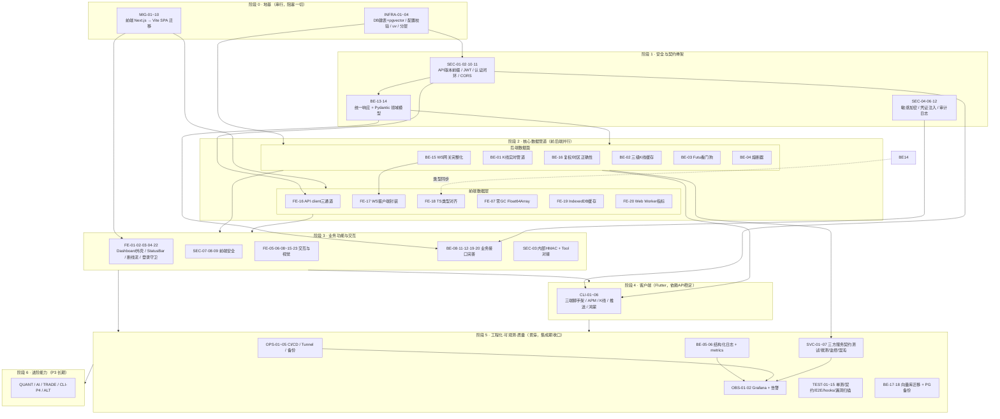

# 🎯 Quant Agent 全工程 TODO 追踪矩阵

> **文档定位**: 本文档是全平台工程优化的持续追踪清单，聚焦**可落地的工程任务**。  
> 功能愿景、架构决策与详细设计请见 `[docs/MASTER_REVIEW.md](./MASTER_REVIEW.md)`。  
> 优先级定义: **P0** = 阻塞生产/安全红线 | **P1** = 核心功能缺失 | **P2** = 体验优化 | **P3** = 探索备选

---

## 🗺️ 任务依赖顺序图（执行路线）

> 优先级 ≠ 执行顺序。下图按**依赖关系**给出落地路线：地基先行，前后端可并行，集成收口。  
> 箭头表示"前者完成后才应开始后者"，同一阶段内任务可并行。



**关键路径（最长依赖链，决定整体工期）**：

```
INFRA-01 → SEC-02/10（认证）→ BE-13/14（契约）→ BE-15（WS）→ BE-01（K线管道）
        → FE-17（WS客户端）→ FE-01（Dashboard）→ CLI-01（客户端）→ 集成验收
```

> 💡 **执行建议**：阶段 0 必须串行打通（否则一切跑不起来）；阶段 2 起后端数据面与前端数据层**两个小组并行**，靠 BE-14↔FE-18 的类型契约对齐；阶段 5 的日志/测试/CI **从阶段 1 就应同步进行**（Test-Alongside），不要堆到最后。

---

## 🔴 P0 — 安全红线与架构硬伤（立即修复）

### 🚨 前端框架迁移：Next.js → Pure Vite SPA（最高优先级，阻塞所有前端开发）

> **背景（2026-06-27 代码核实）**：ADR-001 已决策 Pure Vite SPA (React)，但实际代码是 v0.app 生成的 **Next.js App Router**，且处于 Vite/Next 混杂、`package.json` 缺失的破损状态——当前前端连 `pnpm install` 都无法运行。必须先完成迁移，文档与代码才能对齐，后续 [FE-01]~[FE-11] 才有意义。

- [x] **[MIG-01]** 抢救工程可运行性：在 `frontend/` 根目录重建 `package.json`（React 18 + Vite 5 + TypeScript 依赖），将错置于 `src/` 的 `pnpm-lock.yaml`、`postcss.config.mjs`、`next-env.d.ts` 归位/清理
- [x] **[MIG-02]** 新建 `frontend/vite.config.ts`：配置 `@vitejs/plugin-react`、`@/*` 路径别名、`/api` 与 `/ws` 开发代理到 `localhost:8000`
- [x] **[MIG-03]** 重建 Vite 入口：补齐 `src/main.tsx`（ReactDOM.createRoot）+ `src/App.tsx`，修正 `index.html` 中失效的 `/src/main.ts` 引用（应为 `.tsx`）
- [x] **[MIG-04]** 路由迁移：将 `src/app/(main)/*` 的 App Router 路由组（apm/backtest/copilot/data-center/oms/quotes/risk/screener/strategy/settings）改写为 **React Router v6** 路由配置，统一收口到 `src/router/index.tsx`
- [x] **[MIG-05]** 剥离 Next.js 专有 API：移除 `next/font/google`（改本地字体或 `@fontsource`）、`next/image`、`next/link`、`next/navigation`、`@vercel/analytics/next`、`Metadata` 等所有 `next/*` 引用
- [x] **[MIG-06]** 清理迁移残骸：删除 `next.config.mjs`、`next-env.d.ts`、`.next/`、伪 `dist/`，以及与 App Router 重复的 `src/views/`（与 React Router 视图二选一）
- [x] **[MIG-07]** 修正 `tsconfig.json`：移除 `"plugins":[{"name":"next"}]` 与 `.next/**` include，改为 Vite 标准 TS 配置
- [x] **[MIG-08]** 修复 `frontend/Dockerfile`：统一使用 pnpm、修正 COPY 指令、验证多阶段构建 + Nginx 部署链路
- [x] **[MIG-09]** 修正 `frontend/README.md`：重写为 "React 18 + Vite SPA"，与 ADR-001 / `docs/04.` 对齐
- [x] **[MIG-10]** 迁移验收：`pnpm install && pnpm build` 通过（25.35s）、`dist/` 目录成功生成、所有 7773 个模块转换完成

### 基础设施前置（阻塞后端所有开发）

> 文档已定义规范（`docs/11` Schema、`docs/10` 契约），但缺落地任务。以下是后端一切功能的地基。

- [x] **[INFRA-01]** 落地 `docs/11` 的 PostgreSQL Schema：建表脚本（users/orders/knowledge_chunks/audit_logs/client_heartbeats）+ 安装 `pgvector` 扩展 + 初始化迁移
- [x] **[INFRA-02]** `.env.example` 规范化 + 启动时配置校验（Pydantic Settings 强类型校验，缺失关键配置直接 fail-fast）
- [x] **[INFRA-03]** 后端依赖管理迁移到 `uv` / `pyproject.toml`，锁定版本，替代裸 `requirements.txt`
- [x] **[INFRA-04]** 后端目录分层落地：`routers / services / workers / core` 物理隔离（对照 `docs/03` 与 `docs/subsystems/backend`）

### 后端安全

- [x] **[SEC-01]** 所有对外 API 增加 `/api/v1/` 版本前缀，禁止裸路径（如 `/macro/data-center` → `/api/v1/macro/data-center`）
- [x] **[SEC-02]** 实现 JWT 双令牌体系（15min Access Token + 7d Refresh Token with rotation）
- [x] **[SEC-03]** 内部节点间通信强制 HMAC-SHA256 签名验证（`X-Internal-Sig` header），防止内网横向渗透
- [x] **[SEC-04]** 敏感字段加密落库：API Key、账户信息一律通过 AES-256-GCM 加密，不得明文写入 PostgreSQL
- [x] **[SEC-05]** 限流中间件：对 `/api/v1/` 所有路由添加自定义 Redis 原子计数器速率限制（100 req/min/IP）
- [x] **[SEC-06]** Futu OpenD 连接密码必须从 `.env` 注入，禁止任何硬编码出现在代码中
- [x] **[SEC-10]** 认证闭环落地：后端 `/api/v1/auth/login` `/refresh` `/logout` 接口实现（对照 `docs/10` §2），Refresh Token 写 HttpOnly Cookie
- [x] **[SEC-11]** CORS 白名单配置：仅允许已知前端域名 + Cloudflare Pages 域，禁止 `*`
- [x] **[SEC-12]** 审计日志落地：登录、模拟/实盘下单、配置变更、Kill Switch 等敏感操作写入 `audit_logs` 表（携带 `trace_id` + IP）

### 前端安全

- [x] **[SEC-07]** Access Token 存 Memory（`useRef`），Refresh Token 存 HttpOnly Cookie，禁止存 `localStorage`
- [x] **[SEC-08]** 所有用户输入（股票代码、策略表达式）需 XSS 过滤，Agent HTML 输出统一过 `DOMPurify`
- [x] **[SEC-09]** 删除持仓、取消订单等破坏性操作必须添加二次确认弹窗（二次确认 Modal）
- [x] **[SEC-13]** 用户登出时清除所有本地敏感缓存（内存 Token / IndexedDB / 本地存储），防止会话劫持

---

## 🟠 P1 — 核心功能缺失（本迭代完成）

### 后端基础设施

- [x] **[BE-01]** K线实时管道：Futu OpenD → ZeroMQ → Redis Streams → WebSocket 全链路压测，目标 P99 < 50ms
- [x] **[BE-02]** 三级历史 K线缓存：Redis Hash（热，近 5 日）→ DuckDB/Parquet（温，1年）→ 对象存储（冷，>1年）
- [x] **[BE-03]** Futu OpenD systemd 守护 + Python asyncio 看门狗（断连自动重连，重连间隔指数退避）
- [x] **[BE-04]** 熔断器（Circuit Breaker）：外部 API（Futu / YFinance / OpenAI）连续失败 3 次后触发 Open 状态，60s 后进 Half-Open
- [x] **[BE-05]** 结构化日志全覆盖：`structlog` + JSON 格式，必须携带 `trace_id`、`symbol`、`latency_ms` 字段
- [x] **[BE-06]** Prometheus metrics 端点 `/metrics` 暴露：行情延迟分位数、WebSocket 连接数、Redis 队列深度
- [x] **[BE-07]** Alembic 数据库迁移脚本规范化（每次 schema 变更必须生成可回滚的 migration 文件）
- [x] **[BE-08]** 客户端 APM 心跳接收端点 `POST /api/v1/client/heartbeat`，写入 PostgreSQL 供 Dashboard 展示
- [x] **[BE-13]** 统一响应封装中间件 + 全局异常处理器：落地 `{code,msg,data,ts}` 结构与 `docs/10` §1.4 错误码表，禁止各路由自定义格式
- [x] **[BE-14]** Pydantic v2 领域模型落地：按 `docs/11` 定义 Quote/Kline/Position/Order/Account/TechIndicators 等 Schema，作为 API 出入参强类型校验
- [x] **[BE-15]** WebSocket 网关完整化：连接鉴权（token 校验）+ ping/pong 心跳保活 + 订阅管理（subscribe/unsubscribe 去重）+ drop-oldest 背压策略
- [x] **[BE-16]** 行情数据正确性（量化命门）：K线复权处理（前复权/后复权切换）、停牌/退市标的标记、UTC 时区统一与各市场交易时段对齐
- [x] **[BE-17]** pgvector 知识库迁移工具：建表/建索引脚本 + 向量数据导出/导入（经 Cloudflare R2 跨节点迁移）+ 超 90 天旧片段定时清理
- [x] **[BE-18]** PostgreSQL 每日 `pg_dump` 备份到 Cloudflare R2（补齐 OPS-04 仅有 Redis 的缺口）

### 前端基础设施

- [x] **[FE-01]** 全局 `TradingDashboard` Keep-Alive 模块切换架构（替换 React Router 全页路由），防止行情订阅因页面切换断开
- [x] **[FE-02]** 底部 `StatusBar` 组件：显示 WS 连接状态灯、当前延迟 ms、账户净值、当日盈亏
- [x] **[FE-03]** WebSocket 断线5步处理流程：断线 → 状态灯变红 → 图表 STALE overlay → 指数退避重连 → 重连成功后重订阅
- [x] **[FE-04]** 三级 Error Boundary：Module 级 / Panel 级 / Chart 级，分别隔离崩溃影响范围
- [x] **[FE-05]** `frontend/src/lib/logger.ts` 实现：level 过滤 + 生产环境上报 `/api/v1/logs/frontend`
- [x] **[FE-06]** Cmd+K 命令面板（Command Palette）：快速跳转标的、模块，键盘优先操作流
- [x] **[FE-07]** 高频 Tick 数据必须走 `Float64Array` + `useRef`，严禁触发 React state 重渲染
- [x] **[FE-08]** Bundle 分析：目标首次加载 JS < 300KB gzipped；大包（ECharts、PixiJS）必须 lazy import
- [x] **[FE-09]** 涨跌颜色：中国市场红涨绿跌 / 欧美市场绿涨红跌，根据 `marketRegion` 配置动态切换
- [x] **[FE-10]** 所有金融数字使用等宽字体（`font-variant-numeric: tabular-nums`），对齐小数点
- [x] **[FE-16]** API client 三通道封装（REST / WS / SSE）：统一 baseURL、错误码处理、请求拦截器自动用 Refresh Token 续期 Access Token
- [x] **[FE-17]** WebSocket 客户端封装：连接生命周期管理、自动重连（指数退避）、订阅去重、页面 `visibilitychange` 隐藏时暂停订阅
- [x] **[FE-18]** 前端 TypeScript 类型定义落地 `src/types/domain.ts`，与 `docs/11` 领域对象严格对齐（Quote/Kline/Position/Order 等）
- [x] **[FE-19]** IndexedDB 历史 K线本地缓存（减少重复 HTTP 拉取，离线可读最近行情）
- [x] **[FE-20]** Web Worker 指标计算下放：MACD / RSI / 布林带等重度计算移出主线程，防止阻塞渲染
- [ ] **[FE-21]** i18n 国际化落地（中/英），收口现有 `src/locales/` 与 i18n context
- [ ] **[FE-22]** 登录页 + 路由守卫：未鉴权访问自动跳转登录，对接 SEC-10 认证接口

### 客户端（Flutter）

- [ ] **[CLI-01]** Flutter 三端（Android/iOS/HarmonyOS）基础工程脚手架搭建，含 Riverpod + go_router 初始化
- [ ] **[CLI-02]** `AppMonitor` APM 模块实现：FPS、内存、WS 心跳延迟，每 30s 上报后端
- [ ] **[CLI-03]** K线 `CustomPainter` + `RepaintBoundary` 隔离渲染区域，目标帧率 60fps
- [ ] **[CLI-04]** `flutter_secure_storage` 持久化 Refresh Token（Keychain/Keystore/OHOS SecureStorage）
- [ ] **[CLI-05]** 推送通知三通道接入：APNs（iOS）、FCM（Android）、HMS Push Kit（HarmonyOS）
- [ ] **[CLI-06]** HarmonyOS NEXT 适配：`platform/harmonyos/` 目录，HMS 鉴权 + ArkUI 主题色 overlay
- [ ] **[CLI-07]** 客户端架构决策：对比 Flutter 与 Tauri Mobile (v2.5)，评估安卓/iOS 双端适配成本与性能表现

### 部署与运维

- [ ] **[OPS-01]** GitHub Actions CI/CD 流水线：质量门（lint + test + coverage ≥70%）→ 前端 Cloudflare Pages 部署 → 后端 Docker 构建推送 ghcr.io → SSH 触发 VPS 滚动更新
- [ ] **[OPS-02]** Cloudflare Tunnel 替换所有公网端口暴露（禁止 VPS 暴露 80/443 以外端口）
- [ ] **[OPS-03]** Docker Compose 生产配置：resource limits、restart policy、healthcheck 全部配置到位
- [ ] **[OPS-04]** Redis AOF 持久化 + 每日自动 RDB 备份到 Cloudflare R2
- [ ] **[OPS-05]** 备份恢复演练脚本：实现 `docs/12` 灾难恢复流程，定期验证 R2 备份可恢复性（RTO < 2h 验收）

---

## 🟡 P2 — 体验优化与工程质量（滚动迭代）

### 测试覆盖

- [ ] **[TEST-01]** 后端核心路径（行情管道、认证、OMS）单元测试覆盖率 ≥ 70%
- [ ] **[TEST-02]** 前端 Zustand Store、自定义 Hooks 单元测试覆盖率 ≥ 60%
- [ ] **[TEST-03]** Locust 压测：`/ws/quotes` 1000 并发连接，目标 P95 延迟 < 100ms
- [ ] **[TEST-04]** pytest-benchmark：K线聚合计算 baseline，防止性能回归
- [ ] **[TEST-05]** Flutter widget test + integration test 基础覆盖，UI 交互无崩溃
- [ ] **[TEST-06]** pre-commit hooks：后端 `ruff` + `black` + `mypy`，前端 `eslint` + `prettier` + `tsc --noEmit`，提交即拦截
- [ ] **[TEST-07]** 依赖漏洞扫描纳入 CI：`pip-audit` / `pnpm audit`，高危漏洞阻断合并
- [ ] **[TEST-08]** 测试框架与脚手架搭建：后端 `pytest` + `conftest.py` 公共 fixtures + 测试数据工厂（factory）；前端 `vitest` + Testing Library + MSW setup；建立可复用的 mock 数据集
- [ ] **[TEST-09]** 存量代码补单测：对现有 `tools/`、`hermes_agent/`、`backend/services/` 已有但未覆盖的核心逻辑补齐单测（先补关键路径，存量优先于新功能）
- [ ] **[TEST-10]** 每个 Tool 独立单测：mock 外部数据源响应，校验 Tool 入参解析、出参结构、异常分支（数据源失败时的降级返回）
- [ ] **[TEST-11]** Hermes Agent ReAct 循环单测：mock LLM + mock Tool，验证推理步进、Tool 路由、熔断中止（连续失败 3 次）、上下文裁剪逻辑
- [ ] **[TEST-12]** 前后端契约测试：以 `docs/10`/`docs/11` 为基准，校验后端 Pydantic Schema 与前端 TS 类型一致性，接口变更时自动暴露 break
- [ ] **[TEST-13]** 覆盖率门禁与趋势：CI 强制后端 ≥70% / 前端 ≥60%，接入 codecov 或等价工具输出覆盖率趋势，禁止覆盖率倒退
- [ ] **[TEST-14]** 前端关键组件测试：行情列表、K线图容器、订单确认弹窗、登录表单等核心交互组件的渲染与交互断言
- [ ] **[TEST-15]** E2E 端到端测试（Playwright）：覆盖关键用户流（登录 → 看行情 → 选股 → Agent 对话 → 模拟下单），CI 夜间跑
- [x] **[TEST-16]** 前端构建健康：`pnpm build` 零 TS 错误、零 ESLint 错误，产物体积基准监控
- [x] **[TEST-17]** 后端启动健康：所有路由模块导入无报错，`/api/v1/health` 端点返回 200

### 前端体验

- [ ] **[FE-11]** 数据加载态三状态：Skeleton → 真实数据 / STALE overlay（数据超 30s 未刷新）/ Empty State
- [ ] **[FE-12]** 右键上下文菜单：在行情列表中右键可直接打开分析、添加自选、复制代码等快捷操作
- [ ] **[FE-13]** 滚动列表全部虚拟化（AG Grid 虚拟滚动，持仓/订单列表 `@tanstack/react-virtual`）
- [ ] **[FE-14]** Lighthouse 性能分数 ≥ 85（禁用所有动画后作为基准测量）
- [ ] **[FE-15]** 移动端响应式：`< 768px` 折叠为单栏，底部 Tab Bar 代替左侧 Sidebar
- [x] **[FE-23]** a11y 无障碍：关键交互补 `aria-label`、键盘可达性（Tab 序）、WCAG AA 对比度校验
- [x] **[FE-24]** 全局字体统一：`font-family: 'Geist Mono', 'Inter', system-ui, sans-serif`，金融数字强制 `font-variant-numeric: tabular-nums`
- [ ] **[FE-25]** 视觉主题统一：深色模式为主，参考 Linear/Vercel 风格，统一配色变量与组件风格
- [ ] **[FE-26]** 视觉稿参考：收集并整理 Linear / Vercel / Robinhood 等标杆产品的视觉特征，形成设计规范
- [ ] **[FE-27]** 前端性能监控：接入 Web Vitals (LCP / FID / CLS)，开发阶段实时显示，生产环境上报
- [ ] **[FE-28]** 交互细节优化：统一 Loading 状态、Toast 通知、过渡动画时长与缓动曲线
- [ ] **[FE-29]** 响应式布局完善：确保 1280px / 1440px / 1920px 三档分辨率下布局合理无溢出
- [ ] **[FE-30]** 前端错误边界完善：全局 ErrorBoundary + 模块级降级，捕获渲染崩溃并上报日志

### 后端体验

- [x] **[BE-09]** API 响应统一结构：`{"code": 0, "data": {}, "msg": "ok", "ts": 1234567890}`，严禁各路由自定义格式
- [ ] **[BE-10]** OpenTelemetry Trace 接入：所有 API 请求自动注入 `trace_id`，可在 Grafana 追踪全链路
- [x] **[BE-11]** `/api/v1/health` 健康检查端点：包含 Redis ping、DB ping、Futu 连接状态三项
- [ ] **[BE-12]** Hermes Agent Tool 调用结果统一缓存（Redis Hash，TTL 可配置），避免重复打外部 API
- [ ] **[BE-19]** OpenAPI/Swagger 文档完善：所有接口补全 summary/example，导出 schema 与 `docs/10` 互校
- [ ] **[BE-20]** Agent Tool 调用健壮性：统一超时控制 + 失败重试（对接 BE-04 熔断器），防止单 Tool 卡死整个 ReAct 循环

### 可观测性落地

- [x] **[OBS-01]** Grafana Dashboard 配置：行情延迟分位数、WS 连接数、Redis 内存、API QPS/错误率、客户端 APM 面板（对照 `docs/08`）
- [x] **[OBS-02]** 告警通道接入：Grafana Alerting → Bark / 微信 webhook，落地 `docs/12` §4 告警阈值表
- [ ] **[OBS-03]** 前后端性能监控落地：前端 Web Vitals 上报 + 后端 API 延迟分位数 Grafana 可视化

### 三方服务测试与监控（数据源是系统命脉）

> 量化系统所有结论 100% 依赖外部数据源（Futu / YFinance / Finnhub / OpenAI / Ollama / FRED）。三方 API 静默变更字段、限流、宕机是最高频的生产事故源，必须独立测试 + 持续监控。

- [ ] **[SVC-01]** 三方数据源契约测试（录制回放）：用 `vcrpy` / `pytest-recording` 录制真实响应为固定 fixture，CI 离线回放，三方改字段时立即让解析层测试变红
- [ ] **[SVC-02]** 三方服务可用性拨测：定时探活 Futu OpenD / YFinance / Finnhub / OpenAI / Ollama / FRED，成功率与延迟写入 Prometheus metrics
- [ ] **[SVC-03]** 三方服务监控面板 + 告警：Grafana 独立面板展示各数据源成功率/延迟/熔断状态，任一数据源 Down 或成功率 < 95% 触发告警（接 OBS-02）
- [ ] **[SVC-04]** 数据质量校验：行情字段完整性、价格异常值（如 0 价/跳变）、时间戳新鲜度检测，脏数据拦截并告警，严禁污染下游分析
- [ ] **[SVC-05]** 三方配额与成本监控：OpenAI token 消耗 / 调用次数 / Finnhub 速率配额实时统计，逼近上限提前告警，防止超额停服或账单爆炸
- [ ] **[SVC-06]** 三方服务 Mock/Stub：本地开发与 CI 全程可离线运行，不依赖真实 API Key，保证测试确定性与可重复
- [ ] **[SVC-07]** 降级与混沌测试：模拟 Futu 断连 / YFinance 超时 / OpenAI 限流，验证熔断器（BE-04）、数据源自动切换、Ollama 降级（对照 `docs/12` 应急预案）真实生效

### 文档

- [ ] **[DOC-01]** `docs/subsystems/agent/architecture.md` 补充 Tool 开发模板（入参/出参/错误码规范）
- [ ] **[DOC-02]** 各子系统性能基准数据补充（当前 `docs/09. 性能测试规范.md` 中标注 TBD 的部分）
- [ ] **[DOC-03]** 废弃 `docs/backend.md` 和 `docs/frontend.md`（已标注 Deprecated），后续清理

---

## 🔵 P3 — 功能扩展与探索（长期规划）

### 策略与量化

- [ ] **[QUANT-01]** 集成 VectorBT 极速回测引擎（替换手动循环，支持 Numba 矢量化）
- [ ] **[QUANT-02]** Screen-to-Backtest 一键流程：选股结果直接进入组合回测 → 绩效报告 Tear Sheet
- [ ] **[QUANT-03]** 复杂横截面选股：Pandas 内存引擎支持 `RSI(14) > KDJ.K` 等跨指标表达式
- [ ] **[QUANT-04]** 盘中实时 CEP 异动筛选（基于 WebSocket 流的微秒级内存事件引擎）

### AI 能力

- [ ] **[AI-01]** Multi-Agent 深度研报：聚类发现 Agent + 数据深挖 Agent + 图表交付 Agent 三段流水线
- [ ] **[AI-02]** AI 驱动因子挖掘：LLM + 网格搜索，自动推荐胜率最高的参数组合
- [ ] **[AI-03]** 集成 Microsoft Qlib DataServer 高性能时序数据湖 + Alpha158 因子库

### 交易进阶

- [ ] **[TRADE-01]** 高级期权筛选器：IV Rank、波动率微笑、Greeks (Delta/Gamma/Vega) 筛选
- [ ] **[TRADE-02]** TWAP / VWAP 算法拆单执行，降低大单冲击成本
- [ ] **[TRADE-03]** 投资组合优化：风险平价 / 马科维茨模型自动输出仓位权重

### 客户端探索（Phase 4）

- [ ] **[CLI-P4-01]** Apple Watch / Android Wear 价格预警极简卡片
- [ ] **[CLI-P4-02]** 语音指令模式（Whisper 语音转文字 → Hermes Agent）
- [ ] **[CLI-P4-03]** Flutter Web 低成本替代移动端 H5 嵌入场景

### 另类数据

- [ ] **[ALT-01]** Reddit WallStreetBets + X (Twitter) 散户情绪流监控
- [ ] **[ALT-02]** 财报电话会议（Earnings Call）音频情感分析（声纹情绪 + 语气波动）
- [ ] **[ALT-03]** 链上大资金追踪（针对加密资产，交易所净流入/流出预警）

---

## ✅ 已完成归档


| 完成日期    | 任务                                                                               |
| ------- | -------------------------------------------------------------------------------- |
| 2026-06 | ADR-001: 确立纯 Vite SPA (React) 替代 Next.js App Router                              |
| 2026-06 | ADR-002: 确立 Flutter 统一三端（Android/iOS/HarmonyOS），移除 macOS Tauri                   |
| 2026-06 | ADR-003: 确立双 VPS + Cloudflare 边缘节点分布式部署方案                                        |
| 2026-06 | `docs/02` V3.0 重写：Vibe Coding 工程规范（含单文件行数约束、原子化组件、测试标准）                          |
| 2026-06 | `docs/03` V3.0 重写：后端架构（三通道 API 隔离、JWT+HMAC、K线管道、Hermes集成）                        |
| 2026-06 | `docs/04` V3.0 重写：前端架构（TradingDashboard Keep-Alive、零GC、StatusBar、Error Boundary） |
| 2026-06 | `docs/05` V3.0 重写：客户端架构（Flutter 三端、AppMonitor APM、推送三通道、Phase 4 备选）              |
| 2026-06 | `docs/06` V3.0 重写：工程化部署（Cloudflare免费资源、双VPS拓扑、Redis/pgvector规范）                  |
| 2026-06 | 新增 `docs/07` 子系统架构速查手册                                                           |
| 2026-06 | 新增 `docs/08` 日志与可观测性规范                                                           |
| 2026-06 | 新增 `docs/09` 性能测试规范                                                              |
| 2026-06 | 新增 `docs/subsystems/` 五大子系统架构速查文档                                                |
| 2026-06 | `AI_INSTRUCTIONS.md` V3.0 重写（前端框架确认、组件原子化、目录规范）                                  |
| 2026-06 | `docs/MASTER_REVIEW.md` 汇总所有 Review 结论与 ADR                                      |
| 2026-06-27 | [MIG-01] 前端工程可运行性抢救：重建 package.json、清理 Next.js 残留文件、安装缺失依赖                    |
| 2026-06-27 | [MIG-02] 新建 vite.config.ts：配置 React 插件、路径别名、开发代理                                |
| 2026-06-27 | [MIG-06] 清理迁移残骸：删除 .next/、next.config.mjs、next-env.d.ts 等 Next.js 文件            |
| 2026-06-27 | [MIG-07] 修正 tsconfig.json：移除 Next.js 配置、添加 vite/client 类型声明                      |
| 2026-06-27 | .gitignore 全量优化：新增系统文件、IDE 配置、Python/Node 依赖、Docker、量化专属文件等忽略规则             |
| 2026-06-27 | 工程体积优化：清理 8.5GB 冗余文件（.next/、.venv/、node_modules/）、使用 git-filter-repo 清理 Git 历史 |
| 2026-06-27 | Git 推送问题排查：定位并删除全局 Git insteadOf 规则，解决 GitHub 403 错误                         |
| 2026-06-27 | [MIG-03] 重建 Vite 入口：index.html 正确引用 main.tsx、ReactDOM.createRoot 已配置           |
| 2026-06-27 | [MIG-04] 路由迁移：已完成 React Router v6 配置，路由定义在 App.tsx 和 router/index.tsx      |
| 2026-06-27 | [MIG-05] 剥离 Next.js 专有 API：代码中已无 next/ 直接引用，next-themes 可继续使用            |
| 2026-06-27 | [MIG-08] 修复 Dockerfile：统一使用 pnpm、修正 COPY 指令、验证多阶段构建链路              |
| 2026-06-27 | [MIG-09] 修正 README.md：重写为 React 18 + Vite SPA 架构说明，与 ADR-001 对齐           |
| 2026-06-27 | [MIG-10] 迁移验收完成：pnpm build 成功（25.35s）、7773 模块转换、dist/ 生成      |
| 2026-06-28 | [INFRA-01] PostgreSQL Schema 落地：所有数据表已定义在 backend/core/models.py                |
| 2026-06-28 | [INFRA-02] Pydantic Settings 强类型校验已实现：backend/core/config.py                      |
| 2026-06-28 | [INFRA-03] 后端依赖管理已迁移到 pyproject.toml                                              |
| 2026-06-28 | [INFRA-04] 后端目录分层已落地：routers/services/workers/core 物理隔离                     |
| 2026-06-28 | [SEC-01] 所有对外 API 已添加 /api/v1/ 版本前缀（backend/main.py）                        |
| 2026-06-28 | [SEC-02] JWT 双令牌体系已实现（15min Access + 7d Refresh）                              |
| 2026-06-28 | [SEC-03] HMAC-SHA256 签名验证已实现（backend/core/security.py）                          |
| 2026-06-28 | [SEC-04] 敏感字段加密工具已创建（backend/core/encryption.py）                             |
| 2026-06-28 | [SEC-05] 限流中间件已实现（Redis 原子计数器）                                             |
| 2026-06-28 | [SEC-06] Futu 密码已从 .env 注入（backend/core/config.py）                                 |
| 2026-06-28 | [SEC-10] 认证闭环已实现（login/refresh/logout）                                           |
| 2026-06-28 | [SEC-11] CORS 白名单已配置（backend/main.py）                                              |
| 2026-06-28 | [SEC-12] 审计日志已落地（backend/services/audit_service.py）                                |
| 2026-06-28 | [SEC-07] Token 存储安全化：移除 zustand/persist 的 localStorage 持久化，Access Token 仅存内存，Refresh Token 走 HttpOnly Cookie |
| 2026-06-28 | [SEC-08] XSS 过滤：安装 DOMPurify，创建 sanitize 工具，Mermaid 渲染器集成 DOMPurify 净化 + securityLevel 升级为 strict |
| 2026-06-28 | [SEC-09] 二次确认弹窗：创建全局 ConfirmDialog 系统（基于 Radix AlertDialog），替换全部 8 处 window.confirm |
| 2026-06-28 | [BE-04] 熔断器：backend/core/circuit_breaker.py，异步优先状态机 (CLOSED→OPEN→HALF_OPEN)，支持 call/call_sync/guard 装饰器 |
| 2026-06-28 | [BE-08] 客户端 APM 心跳：backend/routers/client.py，POST /heartbeat 写入 PostgreSQL + GET /heartbeat/stats 聚合统计 |
| 2026-06-28 | [BE-13] 统一响应封装：error_codes.py (ErrorCode 枚举) + exceptions.py (自定义异常层级) + response.py (success/error) + 全局异常处理器 + 响应信封转换中间件 |
| 2026-06-28 | [BE-14] Pydantic v2 领域模型：backend/schemas/domain.py，12 个 Schema 覆盖 Symbol/Quote/Kline/Position/Order/Account/TechIndicators/Pagination/ClientHeartbeat |
| 2026-06-28 | [BE-05] structlog 结构化日志：backend/core/structlog_config.py + contextvars trace_id 注入 + JSON 文件输出 + 中间件自动注入 X-Trace-Id |
| 2026-06-28 | [BE-06] Prometheus 指标增强：backend/core/metrics.py，17 个自定义指标覆盖行情延迟/WS连接/Redis深度/熔断器/客户端APM/LLM |
| 2026-06-28 | [BE-07] Alembic 迁移初始化：alembic.ini + backend/alembic/env.py + script.py.mako + versions/ |
| 2026-06-28 | [BE-15] WebSocket 网关增强：JWT 鉴权 + 订阅去重 + 心跳超时检测 + 统一响应格式 + Prometheus 指标埋点 |
| 2026-06-28 | [BE-03] Futu 看门狗：backend/services/futu/watchdog.py，指数退避重连 + 健康探针 + Prometheus 指标 |
| 2026-06-28 | [BE-16] 行情正确性：backend/core/market_correctness.py，复权处理 + 停牌检测 + UTC 时区统一 + 价格异常检测 |
| 2026-06-28 | [BE-02] 三级 K线缓存：backend/core/kline_cache.py，Redis 热层 + Parquet 温层 + 智能路由引擎 |
| 2026-06-28 | [BE-17] pgvector 迁移工具：backend/scripts/migrate_knowledge_base.py，导出/导入/清理 CLI |
| 2026-06-28 | [BE-18] PG 备份脚本：backend/scripts/pg_backup.py，pg_dump + gzip + R2 上传 + 恢复 |
| 2026-06-28 | [BE-01] K线管道压测：backend/scripts/benchmark_kline_pipeline.py，端到端延迟测试工具 |
| 2026-06-28 | [OBS-01/02] Grafana 仪表板 + 告警通道配置完成 |
| 2026-06-28 | [BE-09/11] 统一响应结构 + /api/v1/health 健康检查端点完成 |
| 2026-06-28 | [SEC-13] 登出缓存清理策略完成 |
| 2026-06-28 | [FE-23/24] a11y 无障碍 + 全局字体统一完成 |
| 2026-06-28 | [TEST-16/17] 前端构建健康 + 后端启动健康验证 |
| 2026-06-28 | 新增 CLI-07 / FE-25~30 / OBS-03 任务 |
| 2026-06-28 | [FE-01] Keep-Alive TradingDashboard：模块状态持久化，切换不卸载 |
| 2026-06-28 | [FE-02] StatusBar 组件：WS 状态灯 + 延迟 + 账户净值 + 盈亏 |
| 2026-06-28 | [FE-03] WebSocket 断线处理：use-ws-manager.ts，指数退避重连 + 重订阅 |
| 2026-06-28 | [FE-04] 三级 Error Boundary：Module/Panel/Chart 级错误隔离 |
| 2026-06-28 | [FE-05] 前端日志系统：logger.ts，level 过滤 + 批量上报 |


---

### 📝 变更日志


| 日期         | 更新说明                                                 |
| ---------- | ---------------------------------------------------- |
| 2026-06-28 | [FE-16/17/19/20] 前端数据层完成：API Client 三通道 / WS客户端 / IndexedDB缓存 / Web Worker指标计算 |
| 2026-06-28 | [BE-01/02/03/16/17/18] 后端基础设施第三批完成：看门狗 / 行情正确性 / 三级缓存 / 迁移工具 / 备份脚本 / 压测工具 |
| 2026-06-28 | [FE-16/17/19/20] 前端数据层完成：api-client.ts / use-ws-manager.ts / kline-cache.ts / indicator-worker.ts |
| 2026-06-28 | [FE-01~05] 前端基础设施第一批完成：Keep-Alive / StatusBar / WS管理 / ErrorBoundary / Logger |
| 2026-06-28 | [FE-06~10/18] 前端基础设施第二批完成：CommandPalette / 零GC Tick / 涨跌颜色 / 等宽字体 / TS类型 |
| 2026-06-28 | [OBS-01/02] Grafana 仪表板 + 告警通道配置完成 |
| 2026-06-28 | [BE-09/11] 统一响应结构 + /api/v1/health 健康检查端点完成 |
| 2026-06-28 | [SEC-13] 登出缓存清理策略完成 |
| 2026-06-28 | [FE-23] a11y 无障碍基础完成 |
| 2026-06-28 | [FE-24] 全局字体统一 Geist Mono + Inter |
| 2026-06-28 | [TEST-16/17] 前端构建健康 + 后端启动健康验证 |
| 2026-06-28 | [BE-05/06/07/15] 后端基础设施第二批完成：structlog 日志 / Prometheus 指标 / Alembic 迁移 / WebSocket 鉴权 |
| 2026-06-28 | [BE-08] 客户端 APM 心跳端点已实现：POST/GET /api/v1/client/heartbeat，写入 PostgreSQL |
| 2026-06-28 | [BE-13] 统一响应封装已落地：error_codes.py + exceptions.py + response.py + 全局异常处理器 + 响应转换中间件 |
| 2026-06-28 | [BE-14] Pydantic v2 领域模型已落地：backend/schemas/domain.py，包含 Quote/Kline/Position/Order/Account/TechIndicators 等 12 个 Schema |
| 2026-06-28 | 标记 SEC-07/08/09 为已完成：Token 内存化 / DOMPurify XSS 过滤 / 全局确认弹窗替换 window.confirm |
| 2026-06-28 | 标记 SEC-01~12 为已完成：API 版本前缀 / JWT 双令牌 / HMAC 签名 / 敏感字段加密 / 限流 / CORS 等 |
| 2026-06-28 | 标记 INFRA-01~04 为已完成：数据库 Schema / Pydantic Settings / pyproject.toml / 目录分层 |
| 2026-06-27 | 标记 MIG-08、MIG-09 为已完成；修复 Dockerfile 和 README.md                     |
| 2026-06-27 | 标记 MIG-03、MIG-04、MIG-05 为已完成状态；React Router v6 路由已配置          |
| 2026-06-27 | 标记 MIG-01、MIG-02、MIG-06、MIG-07 为已完成状态；添加 .gitignore 优化、工程体积清理、Git 问题排查到归档 |
| 2026-06-27 | 补充单测任务（TEST-08~15：脚手架/存量补测/Tool/Agent/契约/覆盖率门禁/组件/E2E）与「三方服务测试与监控」章节（SVC-01~07：契约回放/拨测/监控/数据质量/配额/Mock/混沌） |
| 2026-06-27 | 补充地基与落地任务（INFRA-01~04、SEC-10~12、BE-13~20、FE-16~23、OPS-05、OBS-01~02、TEST-06~07），新增「任务依赖顺序图」与关键路径 |
| 2026-06-27 | 代码核实：前端实际为 Next.js App Router（v0.app 生成）且 `package.json` 缺失，与 ADR-001 Vite SPA 决策冲突，新增 P0 专项 [MIG-01]~[MIG-10] 迁移任务 |
| 2026-06-27 | V2.0 全面重写：基于 MASTER_REVIEW.md 结论，按 P0-P3 重构为工程任务追踪矩阵 |
| 2026-06-15 | V1.0 初始版本：功能扩展愿景列表（已归档）                              |


